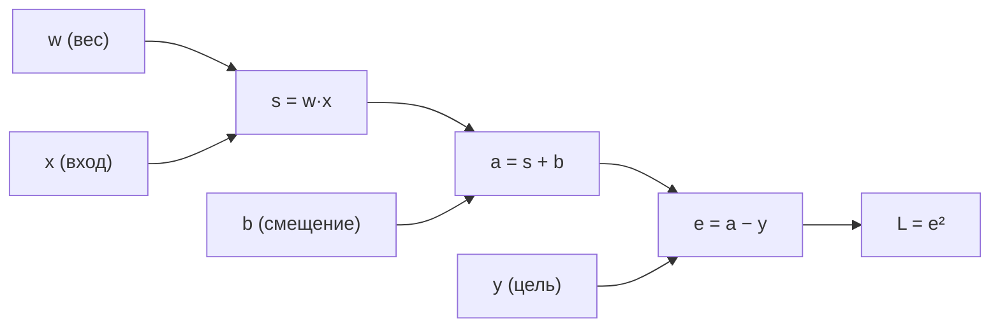
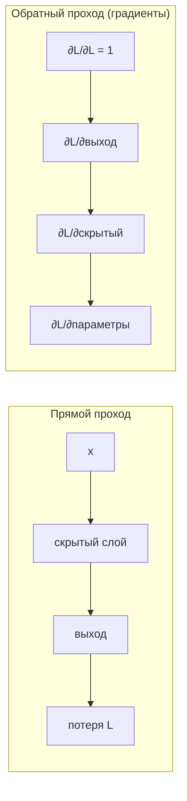

Цепное правило (chain rule) — это правило дифференцирования сложной функции, то есть композиции функций. Звучит скромно, но именно оно делает возможным обучение почти всех современных нейросетей: алгоритм обратного распространения ошибки (backpropagation) — это не более чем аккуратное применение цепного правила к большому вычислительному графу.

В этом разделе мы разберём правило в одномерном случае, обобщим на многомерный, научимся изображать вычисления графом и увидим, почему градиент удобнее считать «с конца к началу».

## Интуиция: скорости перемножаются

Представьте цепочку зависимостей: переменная $x$ влияет на $u$, а $u$ влияет на $y$. Если изменить $x$ на маленькую величину, то $u$ изменится в $\frac{du}{dx}$ раз сильнее, а $y$ изменится ещё в $\frac{dy}{du}$ раз сильнее, чем $u$. Чтобы узнать, как $y$ реагирует на $x$, эти «коэффициенты усиления» нужно перемножить.

Бытовая аналогия с шестерёнками: если первая шестерёнка крутит вторую втрое быстрее, а вторая крутит третью вдвое быстрее, то третья крутится в $3 \cdot 2 = 6$ раз быстрее первой. Локальные скорости перемножаются вдоль цепочки.

## Одномерный случай

Пусть $y = f(u)$ и $u = g(x)$, то есть $y = f(g(x))$. Тогда производная композиции равна произведению производных:

$$
\frac{dy}{dx} = \frac{dy}{du} \cdot \frac{du}{dx} = f'(g(x)) \cdot g'(x).
$$

Ключевая тонкость: внешнюю производную $f'$ берут **в точке** $u = g(x)$, а не в точке $x$. Это самая частая ошибка новичков.

### Пример с числами

Пусть $y = (3x + 1)^2$. Разложим на $u = 3x + 1$ и $y = u^2$.

$$
\frac{dy}{du} = 2u, \qquad \frac{du}{dx} = 3.
$$

$$
\frac{dy}{dx} = 2u \cdot 3 = 6u = 6(3x + 1) = 18x + 6.
$$

Проверим в лоб: раскрыв скобки, $y = 9x^2 + 6x + 1$, откуда $y' = 18x + 6$. Совпало.

### Цепочка из нескольких звеньев

Правило естественно продолжается на любую длину. Для $y = f(g(h(x)))$:

$$
\frac{dy}{dx} = f'\big(g(h(x))\big) \cdot g'\big(h(x)\big) \cdot h'(x).
$$

То есть «снимаем» функции по слоям, как кожуру с лука, и перемножаем локальные производные.

:::tip[Запись Лейбница облегчает жизнь]
В нотации $\frac{dy}{dx} = \frac{dy}{du}\cdot\frac{du}{dx}$ дроби как будто «сокращаются» — промежуточные $du$ формально гасят друг друга. Это не строгое доказательство, но надёжная мнемоника, которая почти никогда не подводит при практических вычислениях.
:::

## Многомерный случай

В машинном обучении функции почти всегда многомерные: на вход идёт вектор признаков, внутри — матрицы весов. Здесь цепное правило обобщается через сумму по всем путям влияния.

### Скаляр через несколько промежуточных переменных

Пусть $z = f(u, v)$, где $u = u(t)$ и $v = v(t)$ зависят от одного параметра $t$. Тогда полная производная складывается из вкладов по каждому пути:

$$
\frac{dz}{dt} = \frac{\partial z}{\partial u}\cdot\frac{du}{dt} + \frac{\partial z}{\partial v}\cdot\frac{dv}{dt}.
$$

Логика та же, что в одномерном случае, но теперь $t$ влияет на $z$ двумя дорогами — через $u$ и через $v$, — и эти вклады **суммируются**. Общее правило: вдоль одного пути производные перемножаются, по разным путям — складываются.

### Векторная форма и матрица Якоби

Пусть $\mathbf{y} = f(\mathbf{u})$ и $\mathbf{u} = g(\mathbf{x})$, где $\mathbf{x}\in\mathbb{R}^n$, $\mathbf{u}\in\mathbb{R}^m$, $\mathbf{y}\in\mathbb{R}^k$. Производная вектор-функции — это матрица Якоби $J$, где $J_{ij} = \frac{\partial y_i}{\partial x_j}$. Цепное правило превращается в **произведение матриц Якоби**:

$$
J_{\mathbf{y}/\mathbf{x}} = J_{\mathbf{y}/\mathbf{u}} \cdot J_{\mathbf{u}/\mathbf{x}}.
$$

Размерности должны сходиться: $(k\times m)\cdot(m\times n) = (k\times n)$. Это прямое обобщение «перемножения скоростей»: вместо чисел перемножаются матрицы локальных чувствительностей.

### Градиент сложной скалярной функции

Частный, но самый важный для ML случай — когда на выходе **скаляр** (например, значение функции потерь $L$). Если $L = f(\mathbf{u})$ и $\mathbf{u} = g(\mathbf{x})$, то градиент по входу получается так:

$$
\nabla_{\mathbf{x}} L = J_{\mathbf{u}/\mathbf{x}}^{\top}\, \nabla_{\mathbf{u}} L.
$$

Транспонированная Якоби «протаскивает» градиент с выхода слоя на его вход. Именно это уравнение многократно применяется при обучении. Если линейная алгебра матриц и транспонирования подзабылась — загляните в раздел [линейная алгебра](/linear-algebra/).

## Вычислительный граф

Удобный способ организовать вычисления — представить функцию как **ориентированный граф**: узлы это операции и промежуточные значения, рёбра — потоки данных. Возьмём для примера

$$
L = (wx + b - y)^2,
$$

то есть квадрат ошибки одного нейрона. Введём промежуточные переменные: $s = wx$, $a = s + b$, $e = a - y$, $L = e^2$.



### Прямой проход (forward)

Идём слева направо и считаем значения. Пусть $w = 2$, $x = 3$, $b = 1$, $y = 5$:

| Узел | Формула | Значение |
|------|---------|----------|
| $s$ | $w\cdot x$ | $6$ |
| $a$ | $s + b$ | $7$ |
| $e$ | $a - y$ | $2$ |
| $L$ | $e^2$ | $4$ |

### Обратный проход (backward)

Теперь идём справа налево и накапливаем производные $\frac{\partial L}{\partial(\cdot)}$, перемножая локальные производные на каждом ребре. Локальную производную узла на «приходящий сверху» градиент — и дальше вниз.

$$
\frac{\partial L}{\partial e} = 2e = 4, \qquad
\frac{\partial e}{\partial a} = 1 \;\Rightarrow\; \frac{\partial L}{\partial a} = 4.
$$

$$
\frac{\partial a}{\partial s} = 1 \;\Rightarrow\; \frac{\partial L}{\partial s} = 4, \qquad
\frac{\partial a}{\partial b} = 1 \;\Rightarrow\; \frac{\partial L}{\partial b} = 4.
$$

$$
\frac{\partial s}{\partial w} = x = 3 \;\Rightarrow\; \frac{\partial L}{\partial w} = 4\cdot 3 = 12.
$$

Один прямой проход даёт значение функции, один обратный — сразу **все** частные производные. В этом и состоит магия эффективности.

## Почему именно «обратное» распространение

Можно было бы считать градиент и слева направо (это называют forward-mode дифференцированием). Почему в нейросетях почти всегда идут с конца?

Дело в размерностях. В сети много параметров (вход в Якоби — огромный), а на выходе **один скаляр** — потеря $L$. 

- **Прямой режим** считает производную выхода по одному входу за проход. Чтобы получить градиент по всем $n$ параметрам, нужно $n$ проходов — дорого.
- **Обратный режим** считает производные одного выхода по всем входам за один проход. Ровно то, что нужно: один скаляр $L$, тысячи (или миллиарды) параметров.

:::note[Reverse-mode = backpropagation]
Обратное распространение ошибки — это reverse-mode автоматическое дифференцирование, применённое к вычислительному графу нейросети. Никакой отдельной «магии» в backprop нет: это цепное правило плюс грамотный порядок обхода графа, переиспользующий промежуточные результаты.
:::

Для слоя нейросети $\mathbf{a}^{(l)} = \sigma(W^{(l)}\mathbf{a}^{(l-1)} + \mathbf{b}^{(l)})$ обратный проход последовательно применяет векторную форму цепного правила: градиент потери, пришедший на выход слоя, умножается на производную активации и на транспонированную матрицу весов, чтобы получить градиент на входе слоя. Разбор полной схемы — в разделе [нейронные сети](/machine-learning/neural-networks/).



### Минимальный код: ручной backward против autograd

```python
import torch

# те же числа: w=2, x=3, b=1, y=5
w = torch.tensor(2.0, requires_grad=True)
b = torch.tensor(1.0, requires_grad=True)
x = torch.tensor(3.0)
y = torch.tensor(5.0)

L = (w * x + b - y) ** 2  # прямой проход строит граф
L.backward()              # обратный проход = цепное правило

print(L.item())   # 4.0
print(w.grad)     # 12.0  -> совпало с ручным расчётом
print(b.grad)     # 4.0
```

PyTorch строит вычислительный граф во время прямого прохода, а `backward()` обходит его в обратном порядке, применяя цепное правило к каждому узлу. Полезно посчитать пример руками хотя бы один раз — тогда autograd перестаёт быть чёрным ящиком.

## Частые ошибки

- **Забыть подставить точку.** Внешнюю производную берут в значении внутренней функции: $f'(g(x))$, а не $f'(x)$.
- **Сложить вместо умножения (или наоборот).** Вдоль одного пути — умножаем, по разным путям к одной переменной — складываем.
- **Перепутать порядок матриц.** В многомерном случае произведение Якоби некоммутативно; следите за размерностями $(k\times m)(m\times n)$.

## Задания

### Задание 1

Найдите $\dfrac{dy}{dx}$ для $y = \sin(x^2 + 1)$, используя цепное правило.

<details>
<summary>Решение</summary>

Разложим: $u = x^2 + 1$, $y = \sin u$.

$$
\frac{dy}{du} = \cos u, \qquad \frac{du}{dx} = 2x.
$$

$$
\frac{dy}{dx} = \cos(x^2 + 1)\cdot 2x = 2x\cos(x^2 + 1).
$$

</details>

### Задание 2

Сигмоида $\sigma(z) = \dfrac{1}{1 + e^{-z}}$ — классическая активация. Покажите цепным правилом, что $\sigma'(z) = \sigma(z)\big(1 - \sigma(z)\big)$.

<details>
<summary>Решение</summary>

Запишем $\sigma(z) = (1 + e^{-z})^{-1}$ и обозначим $u = 1 + e^{-z}$, тогда $\sigma = u^{-1}$.

$$
\frac{d\sigma}{du} = -u^{-2}, \qquad \frac{du}{dz} = -e^{-z}.
$$

По цепному правилу:

$$
\sigma'(z) = -u^{-2}\cdot(-e^{-z}) = \frac{e^{-z}}{(1 + e^{-z})^2}.
$$

Теперь приведём к нужному виду. Заметим, что $\dfrac{1}{1+e^{-z}} = \sigma(z)$ и

$$
\frac{e^{-z}}{1+e^{-z}} = \frac{(1+e^{-z}) - 1}{1+e^{-z}} = 1 - \sigma(z).
$$

Следовательно:

$$
\sigma'(z) = \frac{1}{1+e^{-z}}\cdot\frac{e^{-z}}{1+e^{-z}} = \sigma(z)\big(1 - \sigma(z)\big).
$$

Именно поэтому сигмоида так удобна в backprop: её производная выражается через уже посчитанное на прямом проходе значение $\sigma(z)$.

</details>

### Задание 3

Дан вычислительный граф $f = (x + y)\cdot z$ при $x = 1$, $y = 2$, $z = 3$. Сделайте прямой проход, затем обратным проходом найдите $\dfrac{\partial f}{\partial x}$, $\dfrac{\partial f}{\partial y}$, $\dfrac{\partial f}{\partial z}$.

<details>
<summary>Решение</summary>

Введём промежуточную переменную $q = x + y$, тогда $f = q\cdot z$.

**Прямой проход:** $q = 1 + 2 = 3$, $\;f = 3\cdot 3 = 9$.

**Обратный проход.** Стартуем с $\dfrac{\partial f}{\partial f} = 1$. Локальные производные узла умножения:

$$
\frac{\partial f}{\partial q} = z = 3, \qquad \frac{\partial f}{\partial z} = q = 3.
$$

Узел сложения распределяет градиент без изменения:

$$
\frac{\partial q}{\partial x} = 1, \quad \frac{\partial q}{\partial y} = 1
\;\Rightarrow\;
\frac{\partial f}{\partial x} = 3\cdot 1 = 3, \quad \frac{\partial f}{\partial y} = 3\cdot 1 = 3.
$$

Итого: $\dfrac{\partial f}{\partial x} = 3$, $\dfrac{\partial f}{\partial y} = 3$, $\dfrac{\partial f}{\partial z} = 3$.

Проверка PyTorch:

```python
import torch
x = torch.tensor(1.0, requires_grad=True)
y = torch.tensor(2.0, requires_grad=True)
z = torch.tensor(3.0, requires_grad=True)
f = (x + y) * z
f.backward()
print(x.grad, y.grad, z.grad)  # 3.0 3.0 3.0
```

</details>

### Задание 4

Пусть $z = u^2 + v$, где $u = \cos t$ и $v = t^3$. Найдите $\dfrac{dz}{dt}$ через многомерное цепное правило.

<details>
<summary>Решение</summary>

Здесь $t$ влияет на $z$ двумя путями — через $u$ и через $v$, поэтому вклады складываем:

$$
\frac{dz}{dt} = \frac{\partial z}{\partial u}\cdot\frac{du}{dt} + \frac{\partial z}{\partial v}\cdot\frac{dv}{dt}.
$$

Частные производные:

$$
\frac{\partial z}{\partial u} = 2u, \quad \frac{\partial z}{\partial v} = 1, \quad
\frac{du}{dt} = -\sin t, \quad \frac{dv}{dt} = 3t^2.
$$

Подставляем:

$$
\frac{dz}{dt} = 2u\cdot(-\sin t) + 1\cdot 3t^2 = -2\cos t\sin t + 3t^2 = -\sin(2t) + 3t^2.
$$

(использовали $2\sin t\cos t = \sin 2t$).

</details>

## Что дальше

- [Производная и градиент](/calculus/) — базовые определения, если хочется освежить.
- [Градиентный спуск](/machine-learning/) — как именно посчитанные градиенты двигают параметры.
- [Нейронные сети](/machine-learning/neural-networks/) — полная схема обратного распространения по слоям.
- [Линейная алгебра](/linear-algebra/) — матрицы Якоби, транспонирование, произведение матриц.
