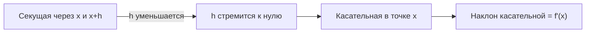
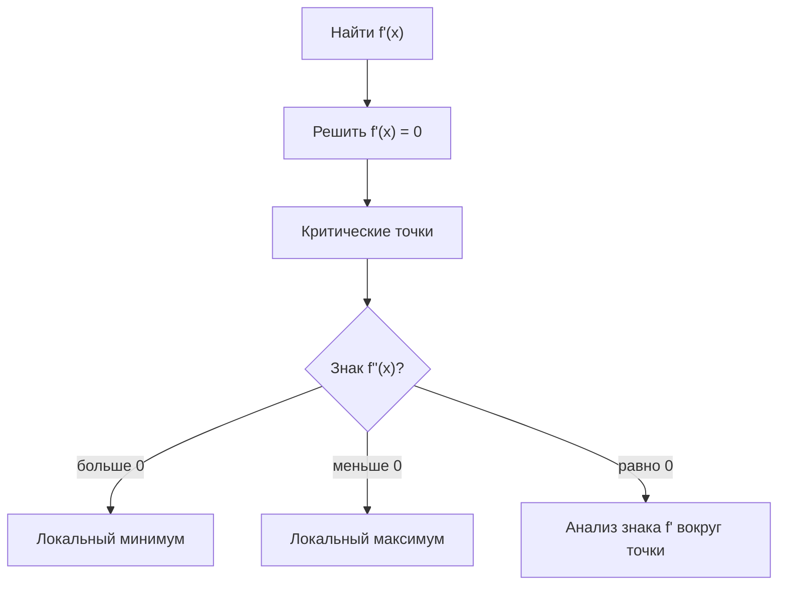

Производная — главный инструмент, на котором держится обучение моделей. Когда вы слышите «градиентный спуск», «функция потерь минимизируется», «модель учится» — за всем этим стоит одна идея: посмотреть, как быстро меняется выход функции при крошечном изменении входа, и сделать шаг в сторону уменьшения ошибки. Эта «скорость изменения» и есть производная. Чтобы аккуратно её определить, сначала нужен предел.

## Предел: что значит «приближаться»

Интуитивно предел — это значение, к которому стремится функция, когда аргумент подходит всё ближе к некоторой точке. Мы не обязательно подставляем саму точку (иногда там функция и не определена) — нас интересует поведение *вокруг* неё.

Запись
$$
\lim_{x \to a} f(x) = L
$$
читается так: «когда $x$ подходит к $a$ сколь угодно близко, значения $f(x)$ подходят к $L$ сколь угодно близко».

Классический пример, где подстановка не работает напрямую:
$$
\lim_{x \to 2} \frac{x^2 - 4}{x - 2}.
$$
В точке $x = 2$ мы получаем $\tfrac{0}{0}$ — неопределённость. Но разложив числитель, $x^2 - 4 = (x-2)(x+2)$, и сократив, видим, что при $x \ne 2$ функция равна $x + 2$. Значит, предел равен $4$, хотя в самой точке $x=2$ исходное выражение не определено.

:::note[Зачем это в ML]
Все «мгновенные» величины — скорость изменения ошибки, наклон функции потерь — определяются через предел. Поняв предел один раз, дальше можно работать с производными почти механически по правилам.
:::

### Особо важный предел

В ML и анализе постоянно встречается
$$
\lim_{x \to 0} \frac{\sin x}{x} = 1.
$$
При $x = 0$ снова $\tfrac{0}{0}$, но численно видно, что отношение стремится к единице:

```python
import numpy as np

for x in [1, 0.1, 0.01, 0.001]:
    print(f"x={x:<6} sin(x)/x = {np.sin(x)/x:.6f}")
# x=1      sin(x)/x = 0.841471
# x=0.1    sin(x)/x = 0.998334
# x=0.01   sin(x)/x = 0.999983
# x=0.001  sin(x)/x = 1.000000
```

## Производная как наклон и как скорость

Возьмём две точки на графике функции: $x$ и $x + h$. Средняя скорость изменения между ними — это наклон секущей (прямой через эти две точки):
$$
\frac{f(x+h) - f(x)}{h}.
$$

Теперь устремим $h \to 0$: точки сливаются, секущая превращается в касательную, а средняя скорость — в мгновенную. Это и есть **производная**:
$$
f'(x) = \lim_{h \to 0} \frac{f(x+h) - f(x)}{h}.
$$

Два эквивалентных взгляда на одно и то же число $f'(x)$:

- **Геометрический:** наклон касательной к графику в точке $x$. Положительный наклон — функция растёт, отрицательный — убывает.
- **Кинематический:** мгновенная скорость изменения. Если $f(t)$ — путь, то $f'(t)$ — скорость.



Обозначения производной взаимозаменяемы: $f'(x)$, $\dfrac{df}{dx}$, $\dfrac{dy}{dx}$. Запись $\tfrac{df}{dx}$ удобна тем, что прямо подсказывает «изменение $f$ на изменение $x$».

:::tip[Проверка пальцем]
Прежде чем считать формально, прикиньте знак производной по графику. Функция идёт вверх — производная положительна, вниз — отрицательна, в вершине/впадине — ноль. Это спасает от арифметических ошибок.
:::

### Численная производная

Если формулу дифференцировать лень или нельзя, производную приближают конечной разностью. Центральная разность точнее односторонней:
$$
f'(x) \approx \frac{f(x+h) - f(x-h)}{2h}.
$$

```python
import numpy as np

def numerical_derivative(f, x, h=1e-5):
    return (f(x + h) - f(x - h)) / (2 * h)

# f(x) = x^2  ->  f'(x) = 2x,  в точке x=3 ожидаем 6
print(numerical_derivative(lambda x: x**2, 3.0))  # ~6.0000000
```

## Правила дифференцирования

На практике производные не вычисляют через предел каждый раз — пользуются готовыми правилами. Пусть $u(x)$ и $v(x)$ — дифференцируемые функции, $c$ — константа.

| Правило | Формула |
|---|---|
| Константа | $(c)' = 0$ |
| Степень | $(x^n)' = n\,x^{n-1}$ |
| Константа-множитель | $(c \cdot u)' = c \cdot u'$ |
| Сумма / разность | $(u \pm v)' = u' \pm v'$ |
| Произведение | $(u \cdot v)' = u'v + u v'$ |
| Частное | $\left(\dfrac{u}{v}\right)' = \dfrac{u'v - u v'}{v^2}$ |

Самая частая ошибка новичков — считать, что производная произведения равна произведению производных. Это **не так**: работает правило произведения $u'v + uv'$.

### Производные элементарных функций

Этот короткий список покрывает почти всё, что встречается в ML (особенно экспонента и логарифм — они стоят за softmax, кросс-энтропией и сигмоидой):

$$
(e^x)' = e^x, \qquad (a^x)' = a^x \ln a,
$$
$$
(\ln x)' = \frac{1}{x}, \qquad (\log_a x)' = \frac{1}{x \ln a},
$$
$$
(\sin x)' = \cos x, \qquad (\cos x)' = -\sin x,
$$
$$
(\sqrt{x})' = \frac{1}{2\sqrt{x}}, \qquad \left(\frac{1}{x}\right)' = -\frac{1}{x^2}.
$$

Последние две — частные случаи степенного правила: $\sqrt{x} = x^{1/2}$ и $\tfrac{1}{x} = x^{-1}$.

:::note
Производная композиции функций ($f(g(x))$) считается по **правилу цепочки** — именно оно лежит в основе обратного распространения ошибки в нейросетях. Ему посвящён отдельный материал в разделе [Математический анализ и оптимизация](/calculus/).
:::

### Пример «по правилам»

Продифференцируем $f(x) = x^3 \ln x$. Это произведение $u = x^3$ и $v = \ln x$:
$$
u' = 3x^2, \qquad v' = \frac{1}{x},
$$
$$
f'(x) = u'v + uv' = 3x^2 \ln x + x^3 \cdot \frac{1}{x} = 3x^2 \ln x + x^2 = x^2(3\ln x + 1).
$$

## Экстремумы и условие $f'(x) = 0$

В точке, где функция достигает локального максимума или минимума (если она там гладкая), касательная горизонтальна — её наклон равен нулю. Отсюда **необходимое условие экстремума**:
$$
f'(x) = 0.
$$

Точки, где производная равна нулю или не существует, называют **критическими**. Это кандидаты на экстремум, но не гарантия: бывают и «точки перегиба» с горизонтальной касательной (например, $f(x) = x^3$ в нуле).

Чтобы отличить максимум от минимума, смотрят либо на смену знака $f'(x)$, либо на вторую производную $f''(x)$:

- $f''(x) > 0$ — функция «вогнута вверх» (чаша), точка — **минимум**;
- $f''(x) < 0$ — функция «вогнута вниз» (купол), точка — **максимум**;
- $f''(x) = 0$ — тест не работает, нужен анализ знака $f'$.



### Пример: минимум параболы

Пусть $f(x) = x^2 - 4x + 7$. Тогда $f'(x) = 2x - 4$. Приравниваем к нулю:
$$
2x - 4 = 0 \;\Rightarrow\; x = 2.
$$
Вторая производная $f''(x) = 2 > 0$, значит, это минимум. Значение функции $f(2) = 4 - 8 + 7 = 3$.

:::tip[Связь с ML]
Обучение модели — это поиск минимума функции потерь $L(\theta)$ по параметрам $\theta$. Аналитически решить $L'(\theta) = 0$ удаётся редко, поэтому используют итеративный **градиентный спуск**: шаг за шагом двигаются против направления производной. Подробнее — в разделе [Машинное обучение](/machine-learning/) и в материалах по оптимизации в [Математическом анализе](/calculus/).
:::

## Что дальше

- Понятие производной по нескольким переменным — это **градиент**, для него нужна [линейная алгебра](/linear-algebra/) (векторы и матрицы).
- Производные сложных функций и обратное распространение — правило цепочки (отдельный материал в [/calculus/](/calculus/)).
- Применение к данным и численные эксперименты удобно ставить в [Python для данных](/python-data/).

## Задания

### Задание 1. Производная многочлена

Найдите $f'(x)$ для $f(x) = 5x^4 - 3x^2 + 2x - 9$.

<details>
<summary>Решение</summary>

Дифференцируем почленно по правилам суммы и степени:

$$
f'(x) = 5 \cdot 4x^3 - 3 \cdot 2x + 2 - 0 = 20x^3 - 6x + 2.
$$

Константа $-9$ даёт ноль.

</details>

### Задание 2. Правило произведения

Продифференцируйте $g(x) = x^2 e^x$.

<details>
<summary>Решение</summary>

Это произведение $u = x^2$ и $v = e^x$, где $u' = 2x$, $v' = e^x$. По правилу произведения:

$$
g'(x) = u'v + uv' = 2x\,e^x + x^2 e^x = e^x(x^2 + 2x) = x\,e^x(x + 2).
$$

</details>

### Задание 3. Поиск экстремума

Найдите точку минимума функции $f(x) = x^2 - 6x + 11$ и значение функции в ней. Проверьте характер экстремума второй производной.

<details>
<summary>Решение</summary>

Первая производная:
$$
f'(x) = 2x - 6.
$$
Приравниваем к нулю: $2x - 6 = 0 \Rightarrow x = 3$.

Вторая производная $f''(x) = 2 > 0$ — значит, это минимум.

Значение функции: $f(3) = 9 - 18 + 11 = 2$.

Минимум достигается в точке $(3,\ 2)$.

</details>

### Задание 4. Численная проверка (код)

Напишите функцию, которая численно оценивает производную $f(x) = \sin x$ в точке $x = 0$ через центральную разность, и сравните результат с точным значением.

<details>
<summary>Решение</summary>

Точная производная: $(\sin x)' = \cos x$, поэтому в нуле $\cos 0 = 1$.

```python
import numpy as np

def numerical_derivative(f, x, h=1e-5):
    return (f(x + h) - f(x - h)) / (2 * h)

approx = numerical_derivative(np.sin, 0.0)
print(approx)        # ~1.0000000
print(np.cos(0.0))   # 1.0
```

Численное значение совпадает с точным $\cos 0 = 1$ с точностью до ошибки порядка $h^2$.

</details>
