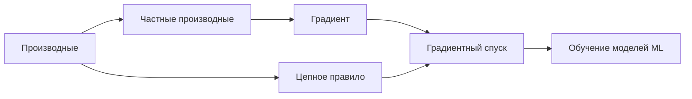

Это сводная страница заданий по всей теме. Если какой-то приём подзабылся, загляните в разделы: [Производные](/calculus/derivatives/), [Градиент](/calculus/gradient/), [Цепное правило](/calculus/chain-rule/), [Градиентный спуск](/calculus/gradient-descent/). Решайте сами, а раскрывающийся блок открывайте только для проверки — так пользы больше.

Задания сгруппированы по уровням. Базовые проверяют технику дифференцирования, средние связывают производные с градиентами и цепным правилом, продвинутые выводят на оптимизацию и код, как в реальном ML.

:::tip[Как работать со страницей]
Возьмите лист бумаги (или ноутбук с Python) и решайте до конца, прежде чем смотреть ответ. Если ошиблись — важно понять, *где именно* свернули не туда: чаще всего это знак производной, забытый множитель из цепного правила или перепутанные размерности.
:::

## Базовые задания

### Задание 1. Производные элементарных функций

Найдите производные по $x$:

1. $f(x) = 3x^4 - 5x^2 + 7$
2. $g(x) = \sqrt{x} + \dfrac{1}{x}$
3. $h(x) = e^{2x}$
4. $p(x) = \ln(3x)$

<details>
<summary>Решение</summary>

Используем степенное правило $\left(x^n\right)' = n x^{n-1}$, а также $\left(e^{kx}\right)' = k e^{kx}$ и $\left(\ln x\right)' = \tfrac{1}{x}$.

1. $f'(x) = 12x^3 - 10x$
2. $g(x) = x^{1/2} + x^{-1}$, поэтому $g'(x) = \dfrac{1}{2}x^{-1/2} - x^{-2} = \dfrac{1}{2\sqrt{x}} - \dfrac{1}{x^2}$
3. $h'(x) = 2e^{2x}$
4. $p(x) = \ln 3 + \ln x$, константа $\ln 3$ исчезает, значит $p'(x) = \dfrac{1}{x}$

</details>

### Задание 2. Геометрический смысл производной

Дана функция $f(x) = x^2 - 4x + 1$. Найдите точку, в которой касательная к графику горизонтальна, и запишите уравнение этой касательной.

<details>
<summary>Решение</summary>

Касательная горизонтальна там, где производная равна нулю.

$$f'(x) = 2x - 4 = 0 \implies x = 2$$

Значение функции: $f(2) = 4 - 8 + 1 = -3$. Это вершина параболы (минимум).

Уравнение горизонтальной касательной: $y = -3$.

</details>

### Задание 3. Частные производные

Для функции двух переменных $f(x, y) = x^2 y + 3xy^3$ найдите $\dfrac{\partial f}{\partial x}$ и $\dfrac{\partial f}{\partial y}$.

<details>
<summary>Решение</summary>

При дифференцировании по одной переменной вторую считаем константой.

$$\frac{\partial f}{\partial x} = 2xy + 3y^3$$

$$\frac{\partial f}{\partial y} = x^2 + 9xy^2$$

</details>

## Средние задания

### Задание 4. Цепное правило

Найдите производную $\dfrac{dz}{dx}$ для $z = \left(x^2 + 1\right)^5$.

<details>
<summary>Решение</summary>

Внешняя функция $u^5$, внутренняя $u = x^2 + 1$. По цепному правилу $\dfrac{dz}{dx} = \dfrac{dz}{du}\cdot\dfrac{du}{dx}$.

$$\frac{dz}{du} = 5u^4, \qquad \frac{du}{dx} = 2x$$

$$\frac{dz}{dx} = 5\left(x^2 + 1\right)^4 \cdot 2x = 10x\left(x^2 + 1\right)^4$$

Типичная ошибка — забыть множитель $2x$ из внутренней функции.

</details>

### Задание 5. Производная сигмоиды

Сигмоида $\sigma(x) = \dfrac{1}{1 + e^{-x}}$ — базовая функция активации. Докажите, что её производная равна $\sigma'(x) = \sigma(x)\bigl(1 - \sigma(x)\bigr)$.

<details>
<summary>Решение</summary>

Запишем $\sigma(x) = \left(1 + e^{-x}\right)^{-1}$ и применим цепное правило.

$$\sigma'(x) = -\left(1 + e^{-x}\right)^{-2} \cdot \frac{d}{dx}\!\left(1 + e^{-x}\right) = -\left(1 + e^{-x}\right)^{-2}\cdot\left(-e^{-x}\right) = \frac{e^{-x}}{\left(1 + e^{-x}\right)^2}$$

Теперь покажем равенство нужной форме. Заметим, что $1 - \sigma(x) = \dfrac{e^{-x}}{1 + e^{-x}}$. Тогда

$$\sigma(x)\bigl(1 - \sigma(x)\bigr) = \frac{1}{1 + e^{-x}}\cdot\frac{e^{-x}}{1 + e^{-x}} = \frac{e^{-x}}{\left(1 + e^{-x}\right)^2} = \sigma'(x)$$

Это удобно для backprop: имея уже вычисленное значение $\sigma(x)$, производную считаем без новых экспонент.

</details>

### Задание 6. Градиент функции нескольких переменных

Для $f(x, y) = x^2 + 3y^2 - xy$ найдите градиент $\nabla f$ и вычислите его в точке $(1, 2)$.

<details>
<summary>Решение</summary>

Градиент — это вектор частных производных.

$$\nabla f = \begin{pmatrix} \dfrac{\partial f}{\partial x} \\[6pt] \dfrac{\partial f}{\partial y} \end{pmatrix} = \begin{pmatrix} 2x - y \\ 6y - x \end{pmatrix}$$

В точке $(1, 2)$:

$$\nabla f(1, 2) = \begin{pmatrix} 2\cdot 1 - 2 \\ 6\cdot 2 - 1 \end{pmatrix} = \begin{pmatrix} 0 \\ 11 \end{pmatrix}$$

Градиент указывает направление наискорейшего роста функции; антиградиент $-\nabla f$ — направление спуска.

</details>

### Задание 7. Производная по направлению

Используя градиент из задания 6, найдите производную функции $f$ в точке $(1, 2)$ по направлению единичного вектора $\vec{u} = \left(\tfrac{3}{5}, \tfrac{4}{5}\right)$.

<details>
<summary>Решение</summary>

Производная по направлению — это скалярное произведение градиента и единичного вектора направления:

$$D_{\vec{u}} f = \nabla f \cdot \vec{u}$$

$$D_{\vec{u}} f(1,2) = \begin{pmatrix} 0 \\ 11 \end{pmatrix} \cdot \begin{pmatrix} 3/5 \\ 4/5 \end{pmatrix} = 0\cdot\frac{3}{5} + 11\cdot\frac{4}{5} = \frac{44}{5} = 8{,}8$$

Поскольку $\vec{u}$ — единичный, дополнительной нормировки не требуется.

</details>

### Задание 8. Один шаг градиентного спуска

Минимизируем $f(w) = w^2$. Начальная точка $w_0 = 4$, скорость обучения $\eta = 0{,}1$. Выполните два шага градиентного спуска по правилу $w_{t+1} = w_t - \eta\, f'(w_t)$.

<details>
<summary>Решение</summary>

Производная: $f'(w) = 2w$.

Шаг 1:
$$w_1 = w_0 - \eta\, f'(w_0) = 4 - 0{,}1\cdot(2\cdot 4) = 4 - 0{,}8 = 3{,}2$$

Шаг 2:
$$w_2 = w_1 - \eta\, f'(w_1) = 3{,}2 - 0{,}1\cdot(2\cdot 3{,}2) = 3{,}2 - 0{,}64 = 2{,}56$$

Значения приближаются к минимуму $w^\* = 0$. В общем виде $w_{t+1} = w_t(1 - 2\eta) = 0{,}8\, w_t$ — геометрическая прогрессия со знаменателем $0{,}8$.

</details>

## Продвинутые задания

### Задание 9. Влияние скорости обучения

В условиях задания 8 ($f(w) = w^2$, $w_0 = 4$) рекуррента имеет вид $w_{t+1} = (1 - 2\eta)\,w_t$. При каких значениях $\eta$ спуск сходится к минимуму, при каких расходится, и что происходит при $\eta = 0{,}5$ и $\eta = 1$?

<details>
<summary>Решение</summary>

Сходимость определяется множителем $q = 1 - 2\eta$: последовательность $w_t = q^t w_0$ сходится к нулю тогда и только тогда, когда $|q| < 1$.

$$|1 - 2\eta| < 1 \iff 0 < \eta < 1$$

- $0 < \eta < 0{,}5$: $q \in (0, 1)$ — монотонное затухание, точка приближается к минимуму с одной стороны.
- $\eta = 0{,}5$: $q = 0$ — попадаем в минимум за один шаг ($w_1 = 0$). Для квадратичной функции это оптимальный шаг.
- $0{,}5 < \eta < 1$: $q \in (-1, 0)$ — затухающие колебания вокруг минимума (знак $w_t$ чередуется).
- $\eta = 1$: $q = -1$ — точка прыгает между $4$ и $-4$, не сходясь.
- $\eta > 1$: $|q| > 1$ — расходимость, значения растут по модулю.

Вывод: слишком большой $\eta$ ломает обучение, слишком маленький — замедляет его.

</details>

### Задание 10. Градиент MSE для линейной регрессии (вывод)

Для линейной модели $\hat{y}_i = w x_i + b$ и функции потерь
$$L(w, b) = \frac{1}{n}\sum_{i=1}^{n}\left(w x_i + b - y_i\right)^2$$
выведите частные производные $\dfrac{\partial L}{\partial w}$ и $\dfrac{\partial L}{\partial b}$.

<details>
<summary>Решение</summary>

Обозначим ошибку $e_i = w x_i + b - y_i$. Применяем цепное правило: внешняя функция $e_i^2$, внутренняя — линейная по $w$ и $b$.

По $w$ (внутренняя производная $\partial e_i / \partial w = x_i$):

$$\frac{\partial L}{\partial w} = \frac{1}{n}\sum_{i=1}^{n} 2 e_i \cdot x_i = \frac{2}{n}\sum_{i=1}^{n}\left(w x_i + b - y_i\right)x_i$$

По $b$ (внутренняя производная $\partial e_i / \partial b = 1$):

$$\frac{\partial L}{\partial b} = \frac{2}{n}\sum_{i=1}^{n}\left(w x_i + b - y_i\right)$$

Эти две формулы — основа обучения линейной регрессии градиентным спуском. Подробнее о связи с моделями — в разделе [Машинное обучение](/machine-learning/).

</details>

### Задание 11. Градиентный спуск на Python

Реализуйте градиентный спуск для функции $f(x) = x^2 + 3x + 4$ (минимум в $x = -1{,}5$). Сделайте 50 шагов с $\eta = 0{,}1$ из начальной точки $x_0 = 5$ и выведите финальное значение.

<details>
<summary>Решение</summary>

Производная: $f'(x) = 2x + 3$.

```python
import numpy as np

def f(x):
    return x**2 + 3*x + 4

def grad(x):
    return 2*x + 3

x = 5.0
eta = 0.1
for _ in range(50):
    x = x - eta * grad(x)

print(round(x, 4))   # -1.4999  (приближение к минимуму -1.5)
print(round(f(x), 4))  # 1.75
```

После 50 итераций $x \approx -1{,}5$ — точка минимума. Здесь $1 - 2\eta = 0{,}8$, как в задании 9, поэтому сходимость монотонная и быстрая. Если поставить $\eta = 1{,}1$, последовательность разойдётся — полезно проверить это самостоятельно.

</details>

### Задание 12. Численная проверка градиента (gradient check)

Аналитический градиент легко содержит ошибку в знаке или множителе. Реализуйте численную проверку для $f(x, y) = x^2 y + \sin(y)$ в точке $(2, 1)$ методом центральной разности
$$\frac{\partial f}{\partial x} \approx \frac{f(x + \varepsilon, y) - f(x - \varepsilon, y)}{2\varepsilon}$$
и сравните с аналитическим градиентом.

<details>
<summary>Решение</summary>

Аналитический градиент:

$$\nabla f = \begin{pmatrix} 2xy \\ x^2 + \cos(y) \end{pmatrix}, \qquad \nabla f(2,1) = \begin{pmatrix} 4 \\ 4 + \cos(1) \end{pmatrix} \approx \begin{pmatrix} 4{,}0000 \\ 4{,}5403 \end{pmatrix}$$

```python
import numpy as np

def f(x, y):
    return x**2 * y + np.sin(y)

def numerical_grad(f, x, y, eps=1e-5):
    df_dx = (f(x + eps, y) - f(x - eps, y)) / (2 * eps)
    df_dy = (f(x, y + eps) - f(x, y - eps)) / (2 * eps)
    return np.array([df_dx, df_dy])

def analytic_grad(x, y):
    return np.array([2*x*y, x**2 + np.cos(y)])

x, y = 2.0, 1.0
num = numerical_grad(f, x, y)
ana = analytic_grad(x, y)

print("численный: ", np.round(num, 6))
print("аналитич.: ", np.round(ana, 6))
print("макс. расхождение:", np.max(np.abs(num - ana)))
```

Расхождение порядка $10^{-10}$ подтверждает корректность аналитической формулы. Центральная разность точнее односторонней: её ошибка $O(\varepsilon^2)$ против $O(\varepsilon)$.

:::caution[О выборе $\varepsilon$]
Слишком большой $\varepsilon$ даёт ошибку аппроксимации, слишком малый — ошибку округления чисел с плавающей точкой. Значение $\varepsilon \approx 10^{-5}$ обычно сбалансировано.
:::

</details>

## Что дальше

Связь дифференцирования и обучения нейросетей через композицию функций показана ниже.



Если все задания решены уверенно — вы готовы к разделу [Машинное обучение](/machine-learning/), где градиентный спуск работает на реальных функциях потерь. Для повторения линейной алгебры (векторы, матрицы, скалярное произведение из задания 7) загляните в [Линейную алгебру](/linear-algebra/), а вероятностную подоплёку функций потерь смотрите в [Вероятности](/probability/) и [Статистике](/statistics/).
