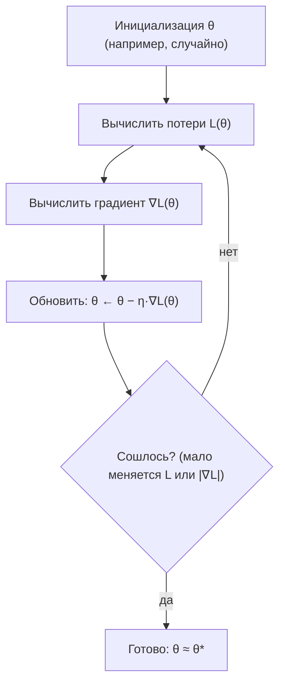
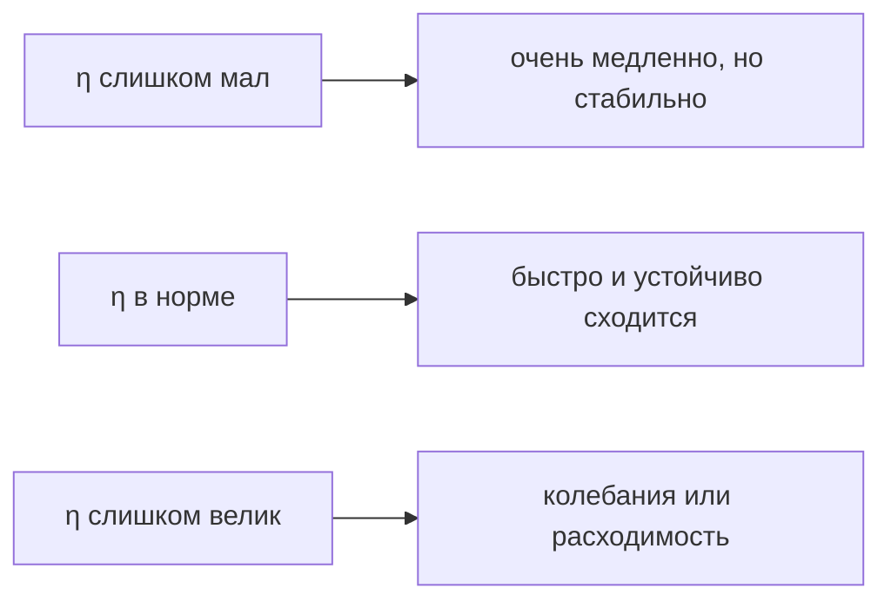
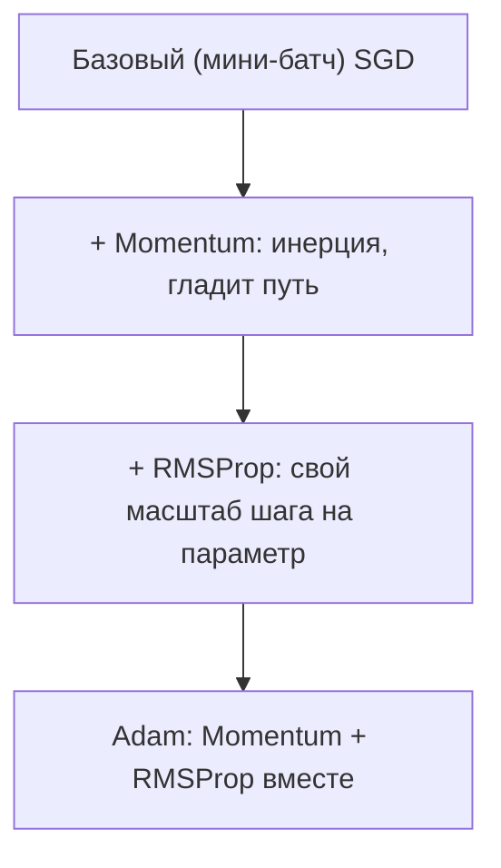

Почти всё обучение модели сводится к одной задаче: подобрать параметры так, чтобы модель ошибалась как можно меньше. «Ошибается меньше» означает, что некоторая числовая функция — функция потерь — принимает минимальное значение. Поиск такого минимума и есть **оптимизация**, а **градиентный спуск** — главный рабочий инструмент для этого поиска. Он опирается ровно на ту математику, которую мы разбирали в [производных](/calculus/derivatives/) и [градиенте](/calculus/gradient/): производная говорит, куда функция растёт, а значит, и куда надо идти, чтобы она убывала.

## Что мы минимизируем

У модели есть параметры — соберём их в вектор $\theta = (\theta_1, \dots, \theta_n)$. Для каждого набора параметров можно посчитать, насколько предсказания расходятся с правильными ответами на обучающих данных. Это число и есть **функция потерь** (loss) $L(\theta)$.

Классический пример — средняя квадратичная ошибка (MSE) для регрессии. Если модель предсказывает $\hat{y}_i = f(x_i; \theta)$, а правильный ответ — $y_i$, то по $m$ примерам:

$$
L(\theta) = \frac{1}{m} \sum_{i=1}^{m} \left( f(x_i; \theta) - y_i \right)^2.
$$

Задача оптимизации формулируется коротко:

$$
\theta^\* = \arg\min_{\theta} \; L(\theta).
$$

Мы ищем такой $\theta^\*$, при котором потери минимальны. Аналитически решить это уравнение можно лишь в редких случаях (например, для линейной регрессии есть формула нормального уравнения). В общем случае — особенно для нейросетей с миллионами параметров — прямой формулы нет, и минимум приходится искать **итеративно**, шаг за шагом улучшая $\theta$.

:::note[Геометрическая картинка]
Представьте $L(\theta)$ как рельеф местности: по горизонтали — параметры, по вертикали — высота (значение потерь). Обучение — это спуск с холмов в долину с завязанными глазами: вы не видите всю карту, но в каждой точке можете нащупать, в какую сторону склон идёт вниз.
:::

## Идея градиентного спуска

В точке $\theta$ градиент $\nabla L(\theta)$ — это вектор частных производных:

$$
\nabla L(\theta) = \left( \frac{\partial L}{\partial \theta_1}, \dots, \frac{\partial L}{\partial \theta_n} \right).
$$

Ключевое свойство: **градиент указывает направление наискорейшего роста** функции. Значит, антиградиент $-\nabla L(\theta)$ указывает направление наискорейшего убывания. Чтобы уменьшить потери, делаем маленький шаг в сторону антиградиента:

$$
\theta_{t+1} = \theta_t - \eta \, \nabla L(\theta_t).
$$

Это и есть **итерация градиентного спуска**. Здесь $\eta > 0$ — **скорость обучения** (learning rate), размер шага. Повторяя обновление, мы скатываемся по рельефу потерь всё ниже.



### Простой пример руками

Возьмём одномерную задачу $L(\theta) = \theta^2$. Производная $L'(\theta) = 2\theta$, минимум очевиден в $\theta = 0$. Стартуем из $\theta_0 = 4$ с шагом $\eta = 0.1$:

$$
\theta_1 = 4 - 0.1 \cdot 2 \cdot 4 = 4 - 0.8 = 3.2.
$$
$$
\theta_2 = 3.2 - 0.1 \cdot 2 \cdot 3.2 = 3.2 - 0.64 = 2.56.
$$

На каждом шаге $\theta$ умножается на $(1 - 2\eta) = 0.8$, то есть последовательность $4, 3.2, 2.56, \dots$ геометрически стремится к нулю. Спуск работает.

## Роль скорости обучения

Learning rate $\eta$ — самый важный и самый капризный гиперпараметр. Он управляет компромиссом между скоростью и устойчивостью.

- **Слишком маленький $\eta$.** Шаги крошечные, спуск ползёт. Сходимость гарантирована (на гладкой выпуклой функции), но обучение длится мучительно долго.
- **Слишком большой $\eta$.** Шаги перескакивают минимум. В лучшем случае модель «прыгает» вокруг дна долины, в худшем — потери **расходятся**, улетая в бесконечность.

Вернёмся к $L(\theta) = \theta^2$, где шаг сжимает $\theta$ в $(1 - 2\eta)$ раз. Чтобы значение убывало по модулю, нужно $|1 - 2\eta| < 1$, то есть $0 < \eta < 1$. При $\eta = 1$ получаем $\theta_{t+1} = -\theta_t$ — вечные колебания $4, -4, 4, \dots$ без всякого приближения к нулю. При $\eta > 1$ амплитуда растёт, и спуск расходится.



:::tip[Практика подбора]
Начните с $\eta$ вроде $10^{-2}$ или $10^{-3}$ и смотрите на кривую потерь. Падает плавно — хорошо. Скачет вверх-вниз или взрывается — уменьшайте. Падает, но черепашьим темпом — увеличивайте. На практике почти всегда используют **расписание** (learning rate schedule): большой шаг в начале, затем постепенное уменьшение, чтобы аккуратно «довести» модель до дна.
:::

## Локальные и глобальные минимумы, седловые точки

Градиент равен нулю не только в минимуме. Точки, где $\nabla L(\theta) = 0$, называются **критическими**, и их три типа.

- **Глобальный минимум** — самая низкая точка всего рельефа. То, что мы хотим найти.
- **Локальный минимум** — дно отдельной ямы: ниже всех соседей, но выше глобального дна. Спуск может застрять здесь, потому что во все стороны склон идёт вверх.
- **Седловая точка** — по одним направлениям функция убывает, по другим растёт (как горный перевал или седло лошади). Градиент нулевой, но это не минимум.


Различить их формально помогает вторая производная (для многих переменных — матрица Гессе $H = \nabla^2 L$): в минимуме она положительно определена, в седле имеет и положительные, и отрицательные собственные значения.

Здесь важна хорошая новость про класс задач. Если $L(\theta)$ **выпукла** (как MSE для линейной регрессии или logistic loss для логистической регрессии), то локальный минимум ровно один и он же глобальный — застрять негде. Именно поэтому для [линейных моделей](/machine-learning/linear-models/) градиентный спуск надёжно находит оптимум. У невыпуклых функций (нейросети) минимумов и седловых точек много, но на практике в высокой размерности седловые точки встречаются куда чаще «плохих» локальных минимумов, и небольшой шум в обновлениях помогает с них соскальзывать.

$$
\text{выпуклая } L \;\Rightarrow\; \text{любой локальный минимум} = \text{глобальный минимум}.
$$

## Batch, SGD и мини-батч

Чтобы сделать один шаг, нужен градиент $\nabla L(\theta)$. Но $L$ — это сумма (среднее) по всем обучающим примерам. Сколько примеров брать для оценки градиента? Отсюда три варианта спуска.

### Пакетный градиентный спуск (Batch GD)

Считаем градиент по **всему** датасету сразу:

$$
\theta_{t+1} = \theta_t - \eta \cdot \frac{1}{m} \sum_{i=1}^{m} \nabla \ell(\theta_t; x_i, y_i),
$$

где $\ell$ — потеря на одном примере. Оценка градиента точная, траектория спуска гладкая. Минус: один шаг требует прохода по всем данным — на больших датасетах это дорого, а до первого обновления параметров приходится долго ждать.

### Стохастический градиентный спуск (SGD)

Берём **один случайный пример** на шаг:

$$
\theta_{t+1} = \theta_t - \eta \cdot \nabla \ell(\theta_t; x_i, y_i).
$$

Шаги дешёвые и частые, обновлений за эпоху столько же, сколько примеров. Оценка градиента шумная — траектория «дрожит». Этот шум одновременно и минус (не сходится в одну точку, а блуждает у дна), и плюс (помогает выскакивать из седловых точек и неглубоких локальных минимумов).

### Мини-батч (mini-batch GD)

Золотая середина и стандарт де-факто: берём небольшую пачку из $B$ примеров (типично $B$ от 32 до 256):

$$
\theta_{t+1} = \theta_t - \eta \cdot \frac{1}{B} \sum_{i \in \text{batch}} \nabla \ell(\theta_t; x_i, y_i).
$$

Шум усредняется и уменьшается, шаг остаётся дешёвым, а векторные операции над батчем эффективно считаются на GPU. Когда сегодня говорят «обучаем через SGD», почти всегда имеют в виду именно мини-батч.

| Вариант | Примеров на шаг | Стоимость шага | Шум градиента | Поведение |
|---|---|---|---|---|
| Batch GD | все $m$ | высокая | нет | гладкий, но медленный спуск |
| Mini-batch | $B$ (32–256) | низкая | умеренный | быстрый и устойчивый — стандарт |
| SGD | 1 | минимальная | высокий | очень шумный, частые обновления |

:::note[Эпоха и итерация]
**Итерация** — одно обновление параметров (один батч). **Эпоха** — один полный проход по всему датасету. Если в данных $10\,000$ примеров и батч $B = 100$, то одна эпоха = $100$ итераций. Обучают обычно много эпох.
:::

## Проблемы сходимости и интуиция

На гладких выпуклых задачах с разумным $\eta$ градиентный спуск сходится. Но на реальных, невыпуклых ландшафтах возникает целый набор трудностей.

- **Овраги (плохая обусловленность).** Если рельеф сильно вытянут — крутой по одной оси и пологий по другой, — спуск зигзагообразно скачет поперёк узкого оврага вместо движения вдоль него. Помогает **нормализация признаков** (приведение к сопоставимым масштабам) и моменты.
- **Плато и седловые точки.** В областях, где градиент почти нулевой, шаги становятся крошечными и обучение «замирает». Шум мини-батчей и адаптивные методы помогают пройти такие места.
- **Расходимость.** Слишком большой $\eta$ — потери растут вместо падения. Лечится уменьшением шага и иногда обрезкой градиента (gradient clipping).
- **Застревание в локальных минимумах.** Для невыпуклых функций возможно, но в глубоких сетях на практике менее болезненно, чем кажется.

Чтобы бороться с этим, поверх базового правила обновления придумали улучшения. **Momentum** накапливает «инерцию» движения и проскакивает мелкие неровности и плато:

$$
v_{t+1} = \beta v_t + \nabla L(\theta_t), \qquad \theta_{t+1} = \theta_t - \eta \, v_{t+1}.
$$

Адаптивные методы (**RMSProp**, **Adam**) подбирают свой эффективный шаг для каждого параметра, исходя из истории градиентов, и потому гораздо устойчивее к выбору $\eta$ и к плохой обусловленности. Adam сегодня — разумный выбор «по умолчанию» для нейросетей.



### Как это выглядит в коде

Один шаг градиентного спуска для линейной регрессии $\hat{y} = Xw + b$ с потерей MSE:

```python
import numpy as np

def gradient_step(X, y, w, b, lr):
    m = X.shape[0]
    y_pred = X @ w + b              # предсказания
    error = y_pred - y             # остатки
    # градиенты MSE по w и b
    grad_w = (2 / m) * (X.T @ error)
    grad_b = (2 / m) * error.sum()
    # шаг против градиента
    w = w - lr * grad_w
    b = b - lr * grad_b
    return w, b

# обучающий цикл по мини-батчам
def train(X, y, lr=0.01, epochs=100, batch_size=32):
    n, d = X.shape
    w, b = np.zeros(d), 0.0
    for _ in range(epochs):
        idx = np.random.permutation(n)       # перемешали данные
        for start in range(0, n, batch_size):
            batch = idx[start:start + batch_size]
            w, b = gradient_step(X[batch], y[batch], w, b, lr)
    return w, b
```

Этот код перемешивает данные каждую эпоху, нарезает на батчи и делает по шагу на каждом — ровно тот мини-батч SGD, что описан выше. Подробнее про работу с массивами и обучение моделей — в разделах [Python для данных](/python-data/) и [машинное обучение](/machine-learning/).

## Задания

<details>
<summary>Решение</summary>

Это упражнение-постановка: переходите к заданиям ниже. (Шаблон-проверка корректности раскрывающегося блока.)

</details>

**Задание 1.** Для функции $L(\theta) = \theta^2$ сделайте два шага градиентного спуска из точки $\theta_0 = 5$ при $\eta = 0.3$. Чему равны $\theta_1$ и $\theta_2$? Сходится ли процесс к минимуму?

<details>
<summary>Решение</summary>

Производная: $L'(\theta) = 2\theta$. Правило: $\theta_{t+1} = \theta_t - \eta \cdot 2\theta_t = \theta_t (1 - 2\eta)$. Здесь $1 - 2\eta = 1 - 0.6 = 0.4$.

$$
\theta_1 = 5 \cdot 0.4 = 2.0, \qquad \theta_2 = 2.0 \cdot 0.4 = 0.8.
$$

Поскольку $|1 - 2\eta| = 0.4 < 1$, каждый шаг приближает $\theta$ к минимуму $\theta = 0$ — процесс сходится.

</details>

**Задание 2.** При каких значениях $\eta$ градиентный спуск для $L(\theta) = \theta^2$ сходится, при каких колеблется без сходимости, а при каких расходится?

<details>
<summary>Решение</summary>

После шага $\theta_{t+1} = \theta_t (1 - 2\eta)$, поэтому $\theta_t = \theta_0 (1 - 2\eta)^t$. Поведение зависит от $|1 - 2\eta|$:

- **Сходится** к нулю, если $|1 - 2\eta| < 1$, то есть $0 < \eta < 1$. (При $\eta = 0.5$ попадаем в минимум за один шаг: $\theta_1 = 0$.)
- **Колеблется** с постоянной амплитудой при $\eta = 1$: тогда $1 - 2\eta = -1$ и $\theta_t = \theta_0 (-1)^t$.
- **Расходится**, если $\eta > 1$: $|1 - 2\eta| > 1$, и $|\theta_t|$ растёт неограниченно.

Вывод: слишком большой шаг ломает спуск, даже если функция идеально выпуклая.

</details>

**Задание 3.** В датасете $50\,000$ примеров, размер батча $B = 250$, обучаем 20 эпох. Сколько обновлений параметров (итераций) произойдёт всего? Сравните с чистым batch GD за те же 20 эпох.

<details>
<summary>Решение</summary>

Итераций за эпоху: $50\,000 / 250 = 200$. За 20 эпох:

$$
200 \times 20 = 4000 \text{ обновлений.}
$$

В batch GD одно обновление приходится на одну эпоху (один проход по всем данным = один шаг), поэтому за 20 эпох всего **20** обновлений. Мини-батч делает на два порядка больше шагов при той же объёме просмотренных данных — отсюда обычно более быстрое обучение.

</details>

**Задание 4.** Объясните, почему стохастичность (шум) мини-батч/стохастического спуска бывает полезна, хотя она «портит» точность оценки градиента.

<details>
<summary>Решение</summary>

Шумная оценка градиента сдвигает направление каждого шага случайным образом. На невыпуклом ландшафте это даёт несколько преимуществ:

- **Выход из седловых точек.** В точном batch GD при $\nabla L \approx 0$ шаги замирают; случайные толчки помогают соскользнуть с седла в сторону убывания.
- **Преодоление мелких локальных минимумов.** Шум позволяет «выпрыгнуть» из неглубокой ямы и продолжить поиск более низкого дна.
- **Эффект регуляризации.** Модель не садится точно на дно по обучающим данным, что часто улучшает обобщение на новые данные.

Плата за это — траектория дрожит и не сходится в одну точку, а блуждает рядом с минимумом. Поэтому к концу обучения learning rate обычно уменьшают: шум затухает, и модель аккуратно «оседает» в минимуме.

</details>
