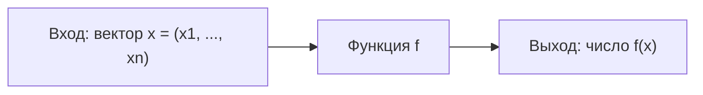
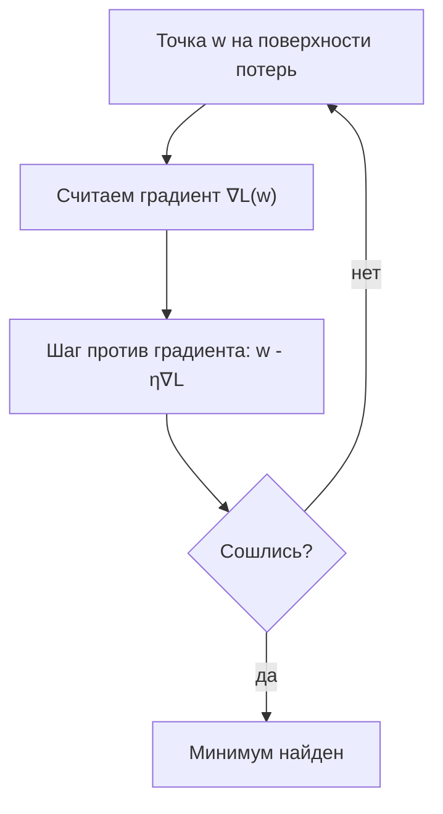
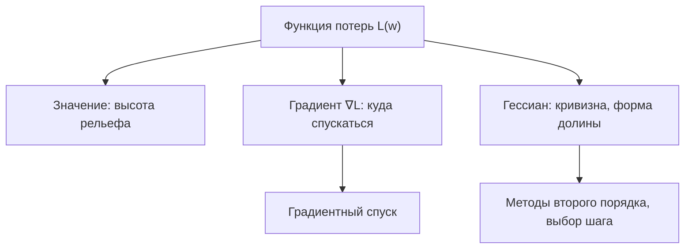

В машинном обучении почти всё, что мы оптимизируем, — это функции многих переменных: функция потерь зависит от тысяч или миллионов параметров модели. Чтобы понять, как менять параметры и в какую сторону, нам нужен инструмент, обобщающий обычную производную на многомерный случай. Этот инструмент — **градиент**. Он лежит в основе градиентного спуска, обратного распространения ошибки и почти всех методов обучения.

Если производная одной переменной из [математического анализа](/calculus/) отвечает на вопрос «как быстро меняется $f(x)$, когда мы чуть-чуть двигаем $x$», то здесь мы спрашиваем: «как меняется $f$, когда мы двигаем сразу много входов?». Для записи нам понадобятся [векторы](/linear-algebra/).

## Функции многих переменных

Функция многих переменных принимает вектор и возвращает число:

$$
f : \mathbb{R}^n \to \mathbb{R}, \qquad f(x_1, x_2, \dots, x_n) = f(\vec{x}).
$$

Примеры, которые встречаются постоянно:

- $f(x, y) = x^2 + y^2$ — параболоид, «чаша» с минимумом в нуле.
- $f(x, y) = \sin(x)\cos(y)$ — холмистая поверхность.
- $L(\vec{w})$ — функция потерь модели, где $\vec{w}$ — вектор всех весов.

Геометрически функцию двух переменных $f(x, y)$ удобно представлять как **поверхность** над плоскостью: высота точки равна значению функции. Для $n > 2$ нарисовать уже нельзя, но интуиция «рельефа» сохраняется: есть впадины (минимумы), вершины (максимумы) и перевалы (седловые точки).



## Частные производные

Частная производная — это обычная производная по одной переменной при условии, что все остальные **зафиксированы как константы**. Обозначается она знаком $\partial$ («дэль», частное «д»):

$$
\frac{\partial f}{\partial x_i} = \lim_{h \to 0} \frac{f(x_1, \dots, x_i + h, \dots, x_n) - f(\vec{x})}{h}.
$$

На практике её считают по тем же правилам, что и одномерную производную, — просто все «чужие» переменные считаются числами.

### Пример

Пусть $f(x, y) = x^2 y + 3y$. Тогда:

- По $x$ (считаем $y$ константой): $\dfrac{\partial f}{\partial x} = 2xy$.
- По $y$ (считаем $x$ константой): $\dfrac{\partial f}{\partial y} = x^2 + 3$.

Геометрический смысл $\frac{\partial f}{\partial x}$ в точке — это наклон поверхности, если идти строго вдоль оси $x$ (как если бы мы разрезали рельеф вертикальной плоскостью, параллельной оси $x$, и смотрели на наклон получившегося среза).

:::note[Обозначения]
Частную производную пишут по-разному: $\frac{\partial f}{\partial x}$, $f_x$, $\partial_x f$. В контексте ML вы чаще всего увидите $\frac{\partial L}{\partial w_i}$ — производную потерь по конкретному весу.
:::

## Градиент

**Градиент** — это вектор, составленный из всех частных производных функции:

$$
\nabla f(\vec{x}) = \left( \frac{\partial f}{\partial x_1}, \frac{\partial f}{\partial x_2}, \dots, \frac{\partial f}{\partial x_n} \right).
$$

Символ $\nabla$ называется «набла». Для функции из примера выше:

$$
\nabla f(x, y) = (\,2xy,\ x^2 + 3\,).
$$

Градиент — функция от точки: в каждой точке пространства он свой и показывает локальное «поведение рельефа».

### Главное свойство: направление наискорейшего роста

Ключевая интуиция, ради которой всё затевалось:

:::tip[Запомните]
Градиент $\nabla f$ в точке указывает в направлении **наискорейшего роста** функции, а его длина $\|\nabla f\|$ равна скорости этого роста. Противоположный вектор $-\nabla f$ — направление наискорейшего убывания.
:::

Почему так? Изменение функции при маленьком шаге $\vec{u}$ (единичный вектор направления) описывается **производной по направлению**:

$$
D_{\vec{u}} f = \nabla f \cdot \vec{u} = \|\nabla f\|\,\|\vec{u}\|\cos\theta = \|\nabla f\|\cos\theta,
$$

где $\theta$ — угол между $\vec{u}$ и градиентом, а $\cdot$ — [скалярное произведение](/linear-algebra/). Эта величина максимальна, когда $\cos\theta = 1$, то есть когда мы идём ровно вдоль градиента. Отсюда и берётся идея **градиентного спуска**: чтобы минимизировать потери, делаем шаги против градиента.

$$
\vec{w}_{t+1} = \vec{w}_t - \eta\,\nabla L(\vec{w}_t),
$$

где $\eta$ — скорость обучения (learning rate).

Ещё одно важное свойство: градиент **перпендикулярен линиям уровня** функции (линиям, вдоль которых $f$ постоянна). Идти вдоль линии уровня — значит не менять высоту; самый крутой подъём всегда поперёк них.



## Градиент типовых функций

### Линейная функция

Пусть $f(\vec{x}) = \vec{a} \cdot \vec{x} = a_1 x_1 + \dots + a_n x_n$. Тогда $\frac{\partial f}{\partial x_i} = a_i$, и значит:

$$
\nabla f(\vec{x}) = \vec{a}.
$$

Градиент линейной функции **постоянен** — не зависит от точки. Поверхность линейной функции — наклонная плоскость, у неё везде один и тот же наклон.

### Квадратичная функция

Очень важный для ML случай — квадратичная форма:

$$
f(\vec{x}) = \tfrac{1}{2}\,\vec{x}^\top A \vec{x} - \vec{b}^\top \vec{x},
$$

где $A$ — симметричная матрица. Её градиент:

$$
\nabla f(\vec{x}) = A\vec{x} - \vec{b}.
$$

Частный, но наглядный случай — «чаша» $f(\vec{x}) = \|\vec{x}\|^2 = x_1^2 + \dots + x_n^2$. Здесь $A = 2I$, $\vec{b} = 0$, и градиент равен $\nabla f = 2\vec{x}$. В нуле он обращается в ноль — это и есть минимум. Квадратичные функции важны потому, что любая гладкая функция вблизи минимума похожа на квадратичную (это видно из разложения Тейлора), и многие методы оптимизации опираются на эту аппроксимацию.

## Якобиан: градиент для векторнозначных функций

Если функция возвращает не число, а вектор, $f : \mathbb{R}^n \to \mathbb{R}^m$, то её «производная» — это матрица всех частных производных, **якобиан**:

$$
J = \begin{pmatrix}
\dfrac{\partial f_1}{\partial x_1} & \cdots & \dfrac{\partial f_1}{\partial x_n} \\[2mm]
\vdots & \ddots & \vdots \\[1mm]
\dfrac{\partial f_m}{\partial x_1} & \cdots & \dfrac{\partial f_m}{\partial x_n}
\end{pmatrix}.
$$

Строка $i$ якобиана — это градиент компоненты $f_i$. Когда $m = 1$, якобиан — это просто (транспонированный) градиент. Якобианы — основа обратного распространения ошибки: слой нейросети есть отображение $\mathbb{R}^n \to \mathbb{R}^m$, и градиент по входу выражается через произведение якобианов слоёв (цепное правило).

## Гессиан: вторые производные

**Гессиан** — это матрица вторых частных производных, многомерный аналог второй производной:

$$
H = \begin{pmatrix}
\dfrac{\partial^2 f}{\partial x_1^2} & \cdots & \dfrac{\partial^2 f}{\partial x_1 \partial x_n} \\[2mm]
\vdots & \ddots & \vdots \\[1mm]
\dfrac{\partial^2 f}{\partial x_n \partial x_1} & \cdots & \dfrac{\partial^2 f}{\partial x_n^2}
\end{pmatrix}, \qquad H_{ij} = \frac{\partial^2 f}{\partial x_i \partial x_j}.
$$

Для гладких функций гессиан симметричен. Он описывает **кривизну** поверхности и помогает понять тип критической точки (где $\nabla f = 0$):

| Гессиан в критической точке | Тип точки |
| --- | --- |
| Положительно определён (все собственные значения $> 0$) | Локальный минимум (выпуклая «чаша») |
| Отрицательно определён (все $< 0$) | Локальный максимум |
| Знаки собственных значений разные | Седловая точка |

:::note[Связь с собственными значениями]
Тип определённости матрицы читается по знакам её собственных значений — см. [линейную алгебру](/linear-algebra/). Седловые точки — частая «ловушка» при обучении нейросетей: градиент там нулевой, но это не минимум.
:::

## Связь с поверхностью функции потерь

Соберём картину воедино на примере обучения модели. Функция потерь $L(\vec{w})$ задаёт **рельеф** над пространством параметров:

- **Значение** $L(\vec{w})$ — высота рельефа в точке.
- **Градиент** $\nabla L$ — направление наискорейшего подъёма; обучение идёт против него.
- **Гессиан** $H$ — кривизна: насколько «крутая» или «пологая» долина, насколько вытянуты её склоны.

Форма рельефа напрямую влияет на скорость обучения. В вытянутом «овраге» (сильно разные собственные значения гессиана — большая *обусловленность*) обычный градиентный спуск зигзагует и сходится медленно. Именно поэтому придуманы методы вроде momentum, RMSProp и Adam: они по-разному учитывают историю и масштаб градиентов.



Численная проверка градиента на простом примере $f(x, y) = x^2 + 3y^2$ (минимум в нуле):

```python
import numpy as np

def f(p):
    x, y = p
    return x**2 + 3*y**2

def grad(p):
    x, y = p
    return np.array([2*x, 6*y])

# Сравним аналитический градиент с конечной разностью
p = np.array([1.0, 2.0])
eps = 1e-6
num_grad = np.array([
    (f(p + [eps, 0]) - f(p - [eps, 0])) / (2*eps),
    (f(p + [0, eps]) - f(p - [0, eps])) / (2*eps),
])
print("аналитический:", grad(p))   # [2. 12.]
print("численный:    ", num_grad)  # ~[2. 12.]
```

Дальше эти идеи напрямую применяются в [машинном обучении](/machine-learning/), а для уверенной работы с векторами и матрицами пригодится [линейная алгебра](/linear-algebra/) и [Python для анализа данных](/python-data/).

## Задания

### Задание 1. Вычисление градиента

Найдите градиент функции $f(x, y) = x^2 y + e^{y}$ и вычислите его в точке $(2, 0)$.

<details>
<summary>Решение</summary>

Считаем частные производные:

- $\dfrac{\partial f}{\partial x} = 2xy$ (производная по $x$, $y$ — константа);
- $\dfrac{\partial f}{\partial y} = x^2 + e^{y}$ (производная по $y$, $x$ — константа).

Значит:

$$
\nabla f(x, y) = (\,2xy,\ x^2 + e^{y}\,).
$$

В точке $(2, 0)$:

$$
\nabla f(2, 0) = (\,2\cdot 2 \cdot 0,\ 2^2 + e^{0}\,) = (0,\ 5).
$$

</details>

### Задание 2. Направление спуска

В точке $(1, 1)$ для функции $f(x, y) = x^2 + y^2$ найдите градиент. В каком направлении функция убывает быстрее всего? Чему равна скорость наискорейшего роста?

<details>
<summary>Решение</summary>

Градиент: $\nabla f = (2x, 2y)$, в точке $(1,1)$ это $\nabla f(1,1) = (2, 2)$.

Быстрее всего функция **убывает** в направлении антиградиента:

$$
-\nabla f(1,1) = (-2, -2).
$$

Скорость наискорейшего роста — это длина градиента:

$$
\|\nabla f(1,1)\| = \sqrt{2^2 + 2^2} = \sqrt{8} = 2\sqrt{2} \approx 2.83.
$$

</details>

### Задание 3. Критическая точка и гессиан

Для функции $f(x, y) = x^2 - y^2$ найдите точку, где градиент равен нулю, выпишите гессиан и определите тип точки.

<details>
<summary>Решение</summary>

Градиент: $\nabla f = (2x, -2y)$. Он равен нулю при $x = 0,\ y = 0$, то есть единственная критическая точка — $(0, 0)$.

Гессиан (вторые производные постоянны):

$$
H = \begin{pmatrix} 2 & 0 \\ 0 & -2 \end{pmatrix}.
$$

Собственные значения — $2$ и $-2$, разных знаков. Значит $(0,0)$ — **седловая точка**: вдоль оси $x$ функция растёт (вверх), вдоль оси $y$ убывает. Это классический «перевал».

</details>

### Задание 4. Шаг градиентного спуска (код)

Для $f(x, y) = x^2 + 3y^2$ сделайте один шаг градиентного спуска из точки $(1, 1)$ с шагом $\eta = 0.1$. Запишите код и новую точку.

<details>
<summary>Решение</summary>

Градиент: $\nabla f = (2x, 6y)$, в точке $(1,1)$ это $(2, 6)$. Шаг:

$$
\vec{w}_{\text{new}} = (1,1) - 0.1\cdot(2, 6) = (1 - 0.2,\ 1 - 0.6) = (0.8,\ 0.4).
$$

```python
import numpy as np

def grad(p):
    x, y = p
    return np.array([2*x, 6*y])

w = np.array([1.0, 1.0])
eta = 0.1
w_new = w - eta * grad(w)
print(w_new)  # [0.8 0.4]
```

Видно, что вдоль $y$ (где склон круче, коэффициент $6$) шаг получился больше, чем вдоль $x$ — это и есть та самая разная кривизна, из-за которой спуск может зигзагить в вытянутых «оврагах».

</details>
