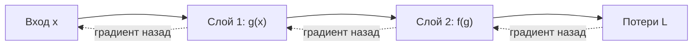
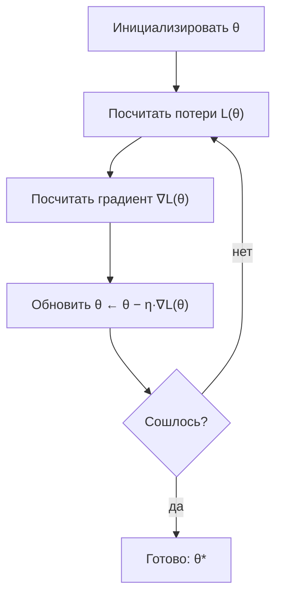

Машинное обучение — это, по сути, поиск таких параметров модели, при которых её ошибка минимальна. А поиск минимума функции — ровно та задача, которой занимается математический анализ и оптимизация. Если линейная алгебра отвечает на вопрос «как представить данные и преобразования», то анализ отвечает на вопрос «в какую сторону и насколько менять параметры, чтобы стало лучше».

Эта тема даёт интуицию и аппарат, который стоит за обучением почти любой модели — от линейной регрессии до больших нейросетей. Не нужно быть математиком, чтобы понять главное: производная показывает скорость изменения, градиент указывает направление самого быстрого роста, а спуск против градиента шаг за шагом ведёт к минимуму.

## Зачем это нужно в ML

Почти любое обучение с учителем сводится к минимизации функции потерь $L(\theta)$ по параметрам $\theta$:

$$
\theta^* = \arg\min_{\theta} L(\theta)
$$

Здесь $\theta$ — это веса модели (коэффициенты регрессии, веса и смещения нейросети), а $L$ измеряет, насколько предсказания расходятся с правдой. У реальных моделей параметров миллионы, аналитической формулы для минимума нет, и единственный практичный способ — двигаться к нему итеративно, опираясь на производные.

Вот где конкретно всплывает анализ:

- **Обучение моделей.** Градиентный спуск и его варианты (SGD, Momentum, Adam) — основной двигатель оптимизации в ML и глубоком обучении.
- **Обратное распространение ошибки (backpropagation).** Это просто цепное правило, применённое к графу вычислений нейросети.
- **Регуляризация.** Добавление штрафов $\lambda\lVert\theta\rVert^2$ к функции потерь меняет ландшафт оптимизации — понимать это можно только через производные.
- **Диагностика обучения.** Затухающие и взрывающиеся градиенты, выбор скорости обучения, застревание в плато — всё это язык анализа.

:::note[Главная мысль]
Обучить модель = минимизировать функцию потерь. Производные говорят, куда шагать; градиентный спуск делает шаги. Всё остальное — детали и улучшения этой базовой идеи.
:::

## Ключевые идеи темы

### Производная: скорость изменения

Производная функции одной переменной — это предел отношения приращений, то есть наклон касательной:

$$
f'(x) = \lim_{h \to 0} \frac{f(x+h) - f(x)}{h}
$$

Интуиция: на сколько изменится выход, если чуть-чуть подвинуть вход. Если $f'(x) > 0$ — функция растёт, если $f'(x) < 0$ — убывает, а в точке минимума или максимума $f'(x) = 0$. Именно условие $f'(x)=0$ лежит в основе поиска оптимума.

### Градиент: производная в многомерном мире

Когда параметров много, отдельная производная по каждому из них собирается в вектор — градиент:

$$
\nabla L(\theta) = \left( \frac{\partial L}{\partial \theta_1}, \frac{\partial L}{\partial \theta_2}, \dots, \frac{\partial L}{\partial \theta_n} \right)
$$

Ключевое свойство: градиент указывает направление самого быстрого роста функции. Значит, чтобы функцию уменьшать, надо идти **против** градиента. Это мостик между анализом и [линейной алгеброй](/linear-algebra/): градиент — это вектор, и работа с ним опирается на язык векторов.

### Цепное правило: как считать производную композиции

Сложные функции — это композиции простых. Цепное правило говорит, как через них пропустить производную:

$$
\frac{d}{dx} f(g(x)) = f'(g(x)) \cdot g'(x)
$$

Нейросеть — это длинная цепочка таких композиций (слой за слоем). Backpropagation — это эффективный способ применить цепное правило ко всему графу вычислений сразу, переиспользуя промежуточные результаты.

### Градиентный спуск: алгоритм обучения

Собрав идеи вместе, получаем простое правило обновления параметров: повторно делаем шаг против градиента с размером $\eta$ (скорость обучения):

$$
\theta_{t+1} = \theta_t - \eta \, \nabla L(\theta_t)
$$

:::tip[Скорость обучения решает всё]
Слишком большой $\eta$ — шаги «перепрыгивают» минимум и обучение расходится. Слишком маленький — сходимость мучительно медленная. Подбор $\eta$ (и более умные оптимизаторы) — половина успеха на практике.
:::

## Как тема связана с другими

- [Линейная алгебра](/linear-algebra/) — градиент это вектор, гессиан это матрица; вычисления градиентов в моделях массово используют матричные операции.
- [Теория вероятностей](/probability/) — функции потерь вроде кросс-энтропии и метода максимального правдоподобия выводятся из вероятностных моделей, а потом минимизируются методами этой темы.
- [Статистика](/statistics/) — оценка параметров (MLE, МНК) почти всегда формулируется как задача оптимизации.
- [Python и работа с данными](/python-data/) — `numpy` и автоматическое дифференцирование (PyTorch, JAX) позволяют не считать градиенты вручную; но чтобы понимать, что происходит под капотом, нужна именно эта тема.
- [Машинное обучение](/machine-learning/) — здесь все идеи оптимизации применяются к реальным моделям.

## Разделы темы

| Раздел | Что внутри |
| --- | --- |
| [Производные](/calculus/derivatives/) | Что такое производная, её геометрический смысл, правила дифференцирования, частные производные. Фундамент всего остального. |
| [Градиент](/calculus/gradient/) | Обобщение производной на много переменных: вектор частных производных, направление наискорейшего роста, линии уровня. |
| [Цепное правило](/calculus/chain-rule/) | Производная композиции функций и её роль в обратном распространении ошибки в нейросетях. |
| [Градиентный спуск](/calculus/gradient-descent/) | Базовый алгоритм оптимизации, скорость обучения, варианты (SGD, Momentum, Adam), проблемы сходимости. |
| [Задания](/calculus/exercises/) | Практические упражнения для закрепления: от ручного дифференцирования до реализации спуска в коде. |

## Как изучать тему

- **Идите по порядку.** Производные → градиент → цепное правило → градиентный спуск. Каждый следующий раздел опирается на предыдущий, перепрыгивать невредно только если база уже есть.
- **Сначала интуиция, потом формулы.** Сперва ответьте себе «что эта величина означает» (наклон, направление, скорость), и лишь затем разбирайте выкладки. Формула без смысла быстро забывается.
- **Считайте руками на малых примерах.** Продифференцируйте $f(x)=x^2$, найдите минимум вручную, сделайте 2–3 шага спуска на бумаге. Маленькие примеры дают то понимание, которое не даст ни одна библиотека.
- **Затем — код.** Реализуйте градиентный спуск на чистом `numpy` для линейной регрессии, прежде чем доверяться `autograd`. Когда руками всё сошлось, переходите к автоматическому дифференцированию.
- **Связывайте с практикой.** После каждого раздела спрашивайте себя: где это всплывает при обучении модели? Так теория перестаёт быть абстракцией.

:::note[Минимум, который реально нужен]
Для уверенного старта в ML не нужен весь курс матанализа. Достаточно понимать производную как скорость изменения, градиент как направление, цепное правило для композиций и сам цикл градиентного спуска. Этого хватит, чтобы осознанно обучать большинство моделей.
:::

Начните с раздела [Производные](/calculus/derivatives/) и закрепите всё на [Заданиях](/calculus/exercises/).
