Если [namespaces](/containerization/namespaces/) отвечают за то, *что процесс видит*, то control groups (cgroups) отвечают за то, *сколько ресурсов процесс может потребить*. Это второй из двух фундаментальных механизмов ядра Linux, на которых стоит вся контейнеризация. Без cgroups контейнер был бы лишь изолированным «пузырём видимости», способным выесть всю память и весь CPU хоста и положить соседей. cgroups превращают изоляцию в управляемую: они **ограничивают**, **учитывают** и **приоритизируют** ресурсы для группы процессов.

## Зачем нужны cgroups: три функции

cgroups (control groups) — подсистема ядра Linux, объединяющая процессы в иерархические группы, к которым применяются контроллеры (controllers) ресурсов. У механизма три тесно связанные задачи:

- **Ограничение (limiting)** — задать верхнюю границу: не больше 512 МиБ памяти, не больше 1,5 ядра CPU, не больше 100 процессов.
- **Учёт (accounting)** — измерить фактическое потребление: сколько CPU-секунд, сколько байт памяти, сколько операций ввода-вывода израсходовала группа. На этом учёте строятся метрики `docker stats`, `kubectl top` и биллинг в облаках.
- **Приоритизация (prioritization)** — при дефиците ресурса распределить его пропорционально весам: группе с большим весом достанется больше CPU или пропускной способности диска.

:::note[Namespaces против cgroups — не путать]
Это разные оси одной задачи. **Namespaces** изолируют *видимость*: процесс внутри своего PID/mount/net namespace не видит чужие процессы, точки монтирования и сетевые интерфейсы. **cgroups** изолируют *ресурсы*: ограничивают долю CPU, объём памяти, полосу I/O. Контейнер — это процесс, помещённый одновременно в набор namespaces (изоляция) и в набор cgroups (лимиты). Одно без другого контейнером не является.
:::

## cgroups v1 против cgroups v2

Существуют две несовместимые архитектуры интерфейса. Понимать различие важно, потому что в проде до сих пор встречаются обе.

В **cgroups v1** (появилась в 2007–2008 годах) каждый контроллер имел **собственную независимую иерархию**. Контроллер `memory` монтировался в `/sys/fs/cgroup/memory`, `cpu` — в `/sys/fs/cgroup/cpu`, `blkio` — в `/sys/fs/cgroup/blkio` и так далее. Один и тот же процесс мог находиться в разных точках этих несвязанных деревьев. Это давало гибкость, но порождало хаос: согласовать политики между контроллерами (например, лимит памяти и лимит I/O для одной группы) было сложно, а некоторые комбинации работали некорректно. Классический пример проблемы — управление страничным кэшем и I/O: контроллеры `memory` и `blkio` жили в разных иерархиях и не могли совместно учитывать обратную запись (writeback) грязных страниц.

**cgroups v2** (стабилизирована в ядре 4.5, 2016 год) вводит **единую (unified) иерархию**: одно дерево, смонтированное в `/sys/fs/cgroup`, в котором каждая группа имеет сразу все включённые для неё контроллеры. Это даёт стройную модель: лимиты CPU, памяти и I/O для группы задаются в одном каталоге и могут согласовываться ядром.

| Характеристика | cgroups v1 | cgroups v2 |
|---|---|---|
| Иерархия | Отдельная на каждый контроллер | Единая (unified) для всех |
| Точка монтирования | `/sys/fs/cgroup/<controller>/` | `/sys/fs/cgroup/` |
| Размещение процессов | Произвольное в каждом дереве | Только в листьях дерева |
| Согласование memory+io | Затруднено | Поддерживается (writeback) |
| Имена файлов | `memory.limit_in_bytes`, `cpu.cfs_quota_us` | `memory.max`, `cpu.max` |
| Статус | Устаревает (legacy) | Стандарт |

Сегодня v2 — стандарт: на неё перешли все актуальные дистрибутивы (Fedora с 31, Debian с 11, Ubuntu с 21.10, RHEL с 9), её требует современный Kubernetes и она необходима для rootless-контейнеров. v1 и v2 могут **сосуществовать** в гибридном (hybrid) режиме — часть контроллеров на v1, часть на v2, — но один контроллер не может работать в обеих версиях одновременно. Современная рекомендация — чистый v2 (режим `systemd.unified_cgroup_hierarchy=1`, ставший умолчанием).

:::tip[Как узнать версию на хосте]
Если `stat -fc %T /sys/fs/cgroup/` выдаёт `cgroup2fs` — это unified v2. Если `tmpfs` (и внутри подкаталоги `memory`, `cpu`, …) — это v1 или гибрид.
:::

## Основные контроллеры

Контроллер — модуль ядра, отвечающий за конкретный тип ресурса. Имена файлов ниже даны для v2.

- **`cpu`** — распределение процессорного времени. Два режима. Пропорциональный: `cpu.weight` (вес от 1 до 10000, по умолчанию 100) — при конкуренции группы получают CPU пропорционально весам. Абсолютный лимит: `cpu.max` в формате `QUOTA PERIOD` (микросекунды). Например `cpu.max = 150000 100000` означает «не более 150 мс CPU за каждые 100 мс реального времени», то есть **полтора ядра**. Значение `max` снимает лимит.
- **`cpuset`** — жёсткая привязка к конкретным ядрам (`cpuset.cpus`, например `0-3`) и к узлам памяти NUMA (`cpuset.mems`). Применяется для latency-sensitive нагрузок, где важна локальность кэша и памяти.
- **`memory`** — учёт и ограничение ОЗУ. `memory.max` — жёсткий потолок: попытка превысить приводит к срабатыванию OOM. `memory.high` — мягкий порог: при его превышении ядро начинает агрессивно отбирать страницы и троттлить группу, но не убивает процессы сразу. `memory.current` показывает текущее потребление. Учитываются и анонимная память, и страничный кэш.
- **`io`** — лимиты ввода-вывода на блочные устройства. `io.max` задаёт ограничения на устройство (по номерам `major:minor`) в IOPS и байтах/сек: например `8:0 rbps=10485760 wiops=1000`. `io.weight` распределяет полосу пропорционально весам.
- **`pids`** — ограничение числа процессов и потоков в группе. `pids.max` — главная защита от **fork-бомбы**: даже если внутри контейнера запустится процесс, бесконечно порождающий потомков, он упрётся в лимит и не исчерпает таблицу PID хоста.

## Файловая система cgroup

cgroups управляются не системными вызовами напрямую, а через виртуальную файловую систему `cgroup2`, смонтированную в `/sys/fs/cgroup`. Иерархия групп = иерархия каталогов: чтобы создать группу, достаточно создать каталог — ядро автоматически наполнит его интерфейсными файлами.

Ключевые файлы интерфейса:

- `cgroup.procs` — список PID, входящих в группу; запись PID в этот файл **переносит** процесс в группу.
- `cgroup.controllers` — какие контроллеры доступны в этой группе.
- `cgroup.subtree_control` — какие контроллеры **включены для дочерних** групп (`+cpu +memory` включает, `-io` выключает).
- `<controller>.max`, `<controller>.weight`, `<controller>.current` — лимиты, веса и учёт.

В v2 действует правило **«только листья»** (no internal process constraint): процессы могут жить только в листовых группах, а внутренние узлы дерева служат лишь для распределения. Поддерево можно **делегировать** (delegation): сменить владельца каталога на непривилегированного пользователя или передать systemd, и тот будет управлять им сам. На делегировании построены rootless Docker и Podman.

```mermaid
flowchart TD
    Root["/sys/fs/cgroup (корень)"]
    Sys["system.slice"]
    User["user.slice"]
    Docker["docker (subtree_control: +cpu +memory +pids)"]
    C1["контейнер A&#10;cpu.max = 150000 100000&#10;memory.max = 536870912&#10;pids.max = 100"]
    C2["контейнер B&#10;cpu.weight = 50&#10;memory.max = 268435456"]

    Root --> Sys
    Root --> User
    Sys --> Docker
    Docker --> C1
    Docker --> C2
```



## Как контейнерные среды используют cgroups

Контейнерные движки не пишут в `/sys/fs/cgroup` напрямую через прикладной код — это делает низкоуровневый рантайм [runc](/containerization/runtimes/) по спецификации OCI. Но управлять иерархией можно двумя способами — это **драйвер cgroup**:

| Драйвер | Кто владеет иерархией | Когда выбирать |
|---|---|---|
| `cgroupfs` | Рантайм пишет в `/sys/fs/cgroup` сам | Хосты без systemd, простые установки |
| `systemd` | Группы создаются как systemd-юниты (scope/slice) | Хосты с systemd (рекомендуется) |

На системах с systemd единственным «писателем» в cgroup-дерево должен быть systemd, иначе два управляющих процесса будут конфликтовать. Поэтому и Docker (через containerd), и kubelet настраивают драйвер `systemd` — это требование стабильной работы Kubernetes на современных узлах.

Флаги [`docker run`](/containerization/docker/) — это удобная обёртка над значениями cgroup-файлов:

```bash
# Лимит 512 МиБ памяти и 1.5 ядра CPU
docker run --memory=512m --cpus=1.5 nginx
```

Под капотом движок транслирует это в файлы группы контейнера:

```text
memory.max  = 536870912        # 512 * 1024 * 1024 байт
cpu.max     = 150000 100000    # 1.5 ядра: квота 150мс на период 100мс
```

То есть `--cpus=1.5` напрямую означает «квота = 1.5 × период». А `--cpu-shares` отображается в `cpu.weight` (пропорциональное распределение), `--pids-limit` — в `pids.max`, `--cpuset-cpus` — в `cpuset.cpus`.

```mermaid
flowchart LR
    subgraph Host["Хост: 4 ядра, 16 ГиБ ОЗУ"]
        CPU["Планировщик CPU (CFS)"]
        MEM["Менеджер памяти"]
    end
    GA["Группа A&#10;вес 100, лимит 512 МиБ"]
    GB["Группа B&#10;вес 50, лимит 256 МиБ"]
    CPU -->|"2/3 времени при конкуренции"| GA
    CPU -->|"1/3 времени при конкуренции"| GB
    MEM -->|"потолок 512 МиБ"| GA
    MEM -->|"потолок 256 МиБ"| GB
```



:::caution[Лимит CPU и троттлинг]
`cpu.max` — это жёсткая квота. Если приложение упёрлось в неё, ядро **приостанавливает** (throttle) его до конца периода, даже если на хосте есть свободные ядра. Для латентно-чувствительных сервисов чрезмерно низкая квота вызывает скачки задержек. Иногда разумнее использовать только веса (`cpu.weight`), которые ограничивают долю лишь при реальной конкуренции.
:::

## OOM killer и memory.max

`memory.max` — жёсткая граница. Когда процессы группы пытаются выделить память сверх неё и ядру не удаётся освободить страницы (вытеснить кэш, выгрузить в swap), наступает **OOM (Out Of Memory)** внутри cgroup. Срабатывает **cgroup-aware OOM killer**: он выбирает и убивает процессы *внутри этой группы*, а не на всём хосте. В контейнере, где PID 1 — единственный значимый процесс, это обычно означает гибель контейнера. В `docker stats` и логах ядра (`dmesg`) такое событие видно как `oom-kill`, а контейнер завершается с кодом 137 (128 + сигнал 9).

Ключевая идея: `memory.high` даёт мягкую «полку» — ядро тормозит группу и активно вытесняет страницы, давая приложению шанс снизить потребление *до* фатального OOM. Грамотная связка — `memory.high` чуть ниже `memory.max` — позволяет деградировать плавно вместо резкого убийства.

## Практика: cgroup v2 руками

Создадим группу и наложим лимиты напрямую через файловую систему (нужны права root, ядро в режиме unified v2):

```bash
# 1. Включаем контроллеры для дочерних групп в корне
echo "+cpu +memory +pids" > /sys/fs/cgroup/cgroup.subtree_control

# 2. Создаём группу — просто каталог
mkdir /sys/fs/cgroup/demo

# 3. Задаём лимиты: 512 МиБ памяти, 1.5 ядра, максимум 50 процессов
echo 536870912         > /sys/fs/cgroup/demo/memory.max
echo "150000 100000"   > /sys/fs/cgroup/demo/cpu.max
echo 50                > /sys/fs/cgroup/demo/pids.max

# 4. Помещаем текущий shell (и всех его потомков) в группу
echo $$ > /sys/fs/cgroup/demo/cgroup.procs

# 5. Проверяем учёт
cat /sys/fs/cgroup/demo/memory.current
```

Соответствие очевидно: эти три записи — ровно то, что делает `docker run --memory=512m --cpus=1.5 --pids-limit=50` для своей контейнерной группы. Контейнерный движок добавляет к этому namespaces, образ как rootfs, сеть и жизненный цикл, но ядро ресурсов остаётся тем же — каталог в `/sys/fs/cgroup` с записанными лимитами.

:::note[Что дальше]
cgroups дают контроль над ресурсами, namespaces — над видимостью. Вместе они образуют примитивы контейнера. Дальше курс переходит к тому, из чего собирается файловая система контейнера — к [образам и слоям](/containerization/images/) — и к стандартам [OCI и средам выполнения](/containerization/runtimes/), которые формально описывают, как рантайм применяет cgroups и namespaces. Общую карту тем смотрите в [роадмапе](/roadmap/).
:::
