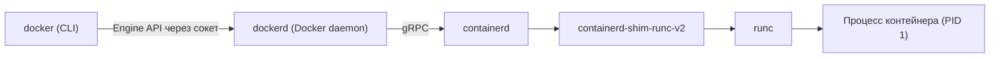
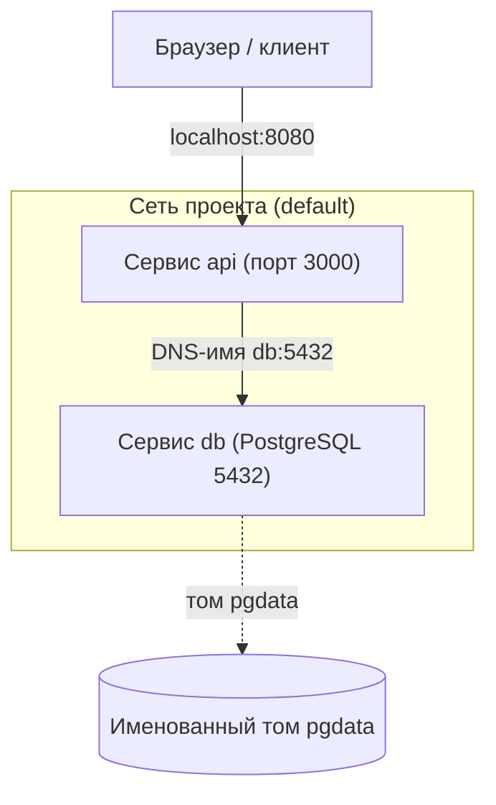

Docker — это не один монолитный процесс, а связка нескольких компонентов с чётким разделением ответственности. Понимание этой архитектуры объясняет, почему `docker stop` иногда не убивает контейнер мгновенно, почему контейнеры переживают рестарт демона и как Docker соотносится со стандартами, разобранными в разделе [Стандарты OCI и среды выполнения](/containerization/runtimes/). В этом разделе мы сначала разберём, кто за что отвечает, а затем перейдём к практике: командам CLI, сборке, сетям, томам и Docker Compose.

## Архитектура: от CLI до контейнера

Когда вы вводите `docker run nginx`, происходит следующая цепочка. Утилита `docker` (CLI) — это тонкий клиент, который ничего сам не запускает. Он сериализует ваш запрос в вызов **Docker Engine API** (REST поверх HTTP) и отправляет его демону `dockerd`. По умолчанию связь идёт через Unix-сокет `/var/run/docker.sock`.

Демон `dockerd` отвечает за высокоуровневую логику: образы, тома, сети, сборку, REST API. Но сами контейнеры он не запускает — эту работу он делегирует демону **containerd**. containerd управляет жизненным циклом контейнеров и образов на уровне ниже: тянет образы из реестра, распаковывает слои, готовит rootfs и поручает запуск low-level рантайму.

Для каждого контейнера containerd порождает процесс **containerd-shim** (точнее, `containerd-shim-runc-v2`). Shim — это посредник, который остаётся жить рядом с контейнером. Именно он вызывает **runc** — низкоуровневую OCI-совместимую среду выполнения, которая непосредственно настраивает namespaces, cgroups, capabilities, seccomp и делает `execve` процесса контейнера (см. [Namespaces](/containerization/namespaces/) и [cgroups](/containerization/cgroups/)).



Ключевая деталь: после того как runc настроил контейнер и сделал `execve`, он **завершается**. Контейнер остаётся «прикреплён» к shim, а не к runc и не к dockerd. Благодаря этому вы можете перезапустить или обновить `dockerd` и даже `containerd`, не убивая работающие контейнеры — shim переживёт рестарт демона и переподключится.

:::note[Немного истории]
Изначально вся логика жила в монолитном демоне Docker. В 2015 году Docker выделил из себя `runc` — low-level рантайм на основе библиотеки libcontainer, переданный в **Open Container Initiative** как эталонная реализация runtime-спецификации. В 2016–2017 годах из Docker был выделен и `containerd` (high-level рантайм), и в 2017 году Docker передал его в **CNCF**, где тот позже стал самостоятельным проектом-выпускником. Сегодня containerd используется не только Docker, но и Kubernetes напрямую — через интерфейс CRI, минуя dockerd. Подробнее о слоях рантаймов — в разделе [Стандарты OCI и среды выполнения](/containerization/runtimes/).
:::

## Ключевые объекты Docker

Прежде чем переходить к командам, зафиксируем четыре базовые сущности, которыми оперирует Docker:

| Объект | Что это | Команды для работы |
| --- | --- | --- |
| **Образ (image)** | Неизменяемый шаблон из слоёв файловой системы плюс метаданные (см. [Образы и слои](/containerization/images/)) | `docker images`, `docker pull`, `docker build` |
| **Контейнер (container)** | Запущенный (или остановленный) экземпляр образа с тонким записываемым слоем поверх | `docker run`, `docker ps`, `docker rm` |
| **Том (volume)** | Постоянное хранилище данных вне записываемого слоя контейнера (см. [Хранение данных](/containerization/storage/)) | `docker volume ...`, флаги `-v` / `--mount` |
| **Сеть (network)** | Виртуальная сеть для связи контейнеров между собой и с внешним миром (см. [Сеть контейнеров](/containerization/networking/)) | `docker network ...`, флаг `--network` |

## Основы CLI

Главная команда — `docker run`: она создаёт контейнер из образа и запускает его. Самые частые флаги:

| Флаг | Назначение |
| --- | --- |
| `-d`, `--detach` | Запуск в фоне; возвращает ID контейнера |
| `-p HOST:CONTAINER` | Проброс порта хоста на порт контейнера |
| `-v`, `--volume` | Монтирование тома или каталога хоста |
| `-e KEY=VALUE` | Переменная окружения внутри контейнера |
| `--name` | Человекочитаемое имя контейнера |
| `--rm` | Удалить контейнер автоматически после остановки |
| `--memory` | Жёсткий лимит памяти (например `512m`) |
| `--cpus` | Лимит CPU (например `1.5` — полтора ядра) |
| `--restart` | Политика перезапуска: `no`, `on-failure`, `always`, `unless-stopped` |

Лимиты `--memory` и `--cpus` реализуются через cgroups — это не просто рекомендации, а навязанные ядром ограничения.

Пример: запустить веб-сервер в фоне, ограничить ресурсы, пробросить порт и задать политику перезапуска.

```bash
docker run -d \
  --name web \
  -p 8080:80 \
  -e NGINX_HOST=example.local \
  --memory 256m \
  --cpus 0.5 \
  --restart unless-stopped \
  nginx:1.27
```

Теперь сайт доступен на `http://localhost:8080`. Несколько команд для наблюдения и управления:

```bash
docker ps                 # запущенные контейнеры (-a — включая остановленные)
docker images             # локальные образы
docker logs -f web        # поток логов контейнера (stdout/stderr)
docker exec -it web sh    # интерактивная оболочка внутри работающего контейнера
docker stop web           # послать SIGTERM, затем SIGKILL по таймауту
docker rm web             # удалить остановленный контейнер
```

:::tip
Флаги `-it` в `docker exec` и `docker run` — это `-i` (держать STDIN открытым) плюс `-t` (выделить псевдо-TTY). Без них интерактивная оболочка работать не будет.
:::

Работа с реестром образов (по умолчанию Docker Hub) — `pull` и `push`:

```bash
docker pull postgres:16
docker tag myapp:dev registry.example.com/team/myapp:1.0
docker push registry.example.com/team/myapp:1.0
```

:::caution[docker stop не мгновенный]
`docker stop` сначала отправляет PID 1 контейнера сигнал `SIGTERM` и ждёт (по умолчанию 10 секунд), давая приложению корректно завершиться. Только потом следует `SIGKILL`. Если ваше приложение игнорирует SIGTERM, остановка займёт все 10 секунд. Уменьшить ожидание можно флагом `-t`.
:::

## Сборка: docker build и Dockerfile

Свои образы описываются в **Dockerfile** — текстовом файле с инструкциями. `docker build` исполняет их слой за слоем и кэширует результат каждого шага.

```dockerfile
FROM node:20-alpine
WORKDIR /app
COPY package*.json ./
RUN npm ci --omit=dev
COPY . .
EXPOSE 3000
CMD ["node", "server.js"]
```

```bash
docker build -t myapp:1.0 .
```

Здесь мы лишь обозначаем подход; детали инструкций, кэширования слоёв и многоступенчатой сборки разобраны в разделе [Образы и слои файловой системы](/containerization/images/).

## Сети (кратко)

При старте Docker создаёт сеть **bridge** по умолчанию — виртуальный коммутатор `docker0`, к которому подключаются контейнеры. Контейнеры в ней получают приватные IP и выходят наружу через NAT. Доступ снаружи к сервису внутри контейнера открывается флагом `-p` (проброс портов).

Лучшая практика — создавать **user-defined bridge networks**. В отличие от сети по умолчанию, в пользовательской сети работает встроенный DNS: контейнеры видят друг друга **по имени**, а не по IP.

```bash
docker network create app-net
docker run -d --name db --network app-net postgres:16
docker run -d --name api --network app-net myapp:1.0
# теперь из контейнера api хост "db" резолвится в IP контейнера базы
```

Подробный разбор драйверов (`bridge`, `host`, `overlay`, `macvlan`), iptables и CNI — в разделе [Сеть контейнеров](/containerization/networking/).

## Тома (кратко)

Записываемый слой контейнера эфемерен: удалили контейнер — потеряли данные. Для постоянного хранения используют тома. Есть два основных вида:

| Тип | Синтаксис `-v` | Управление | Когда применять |
| --- | --- | --- | --- |
| **Именованный том** | `-v mydata:/var/lib/postgresql/data` | Docker (в `/var/lib/docker/volumes/`) | Данные приложений, БД — переносимо и независимо от путей хоста |
| **Bind mount** | `-v /host/path:/container/path` | Вы сами (произвольный путь хоста) | Разработка, конфиги, доступ к конкретным файлам хоста |

Современный явный синтаксис — `--mount`, он многословнее, но читается однозначно:

```bash
docker run -d \
  --mount type=volume,source=pgdata,target=/var/lib/postgresql/data \
  postgres:16
```

Сравнение драйверов хранения, OverlayFS и `tmpfs` — в разделе [Хранение данных](/containerization/storage/).

## Docker Compose

Запускать приложение из нескольких связанных контейнеров вручную через `docker run` быстро становится неудобно. **Docker Compose** позволяет описать всё приложение декларативно в файле `compose.yaml` (или `docker-compose.yml`) и поднять одной командой. Compose сам создаёт общую сеть для проекта, поэтому сервисы видят друг друга по именам.

Пример: веб-приложение плюс PostgreSQL.

```yaml
services:
  db:
    image: postgres:16
    environment:
      POSTGRES_USER: app
      POSTGRES_PASSWORD: secret
      POSTGRES_DB: appdb
    volumes:
      - pgdata:/var/lib/postgresql/data
    healthcheck:
      test: ["CMD-SHELL", "pg_isready -U app -d appdb"]
      interval: 5s
      retries: 5

  api:
    build: .
    ports:
      - "8080:3000"
    environment:
      DATABASE_URL: postgres://app:secret@db:5432/appdb
    depends_on:
      db:
        condition: service_healthy
    restart: unless-stopped

volumes:
  pgdata:
```

```bash
docker compose up -d      # собрать (при необходимости) и запустить всё в фоне
docker compose ps         # статус сервисов проекта
docker compose logs -f api
docker compose down       # остановить и удалить контейнеры и сеть проекта
docker compose down -v    # то же + удалить именованные тома
```



Обратите внимание на две важные детали примера. Во-первых, в `DATABASE_URL` указан хост `db` — это имя сервиса, которое Compose резолвит через встроенный DNS. Во-вторых, `depends_on` с `condition: service_healthy` гарантирует, что `api` стартует только после того, как healthcheck базы данных стал успешным; обычный `depends_on` лишь упорядочивает старт, но не ждёт готовности.

:::note[compose как плагин]
Современный Compose v2 — это плагин CLI, вызываемый как `docker compose` (через пробел). Старая отдельная утилита `docker-compose` (через дефис) на Python считается устаревшей. Команды и формат файла в основном совместимы.
:::

## Альтернативы Docker

Docker — не единственная реализация контейнерного инструментария, и благодаря стандартам OCI образы взаимозаменяемы между ними.

| Инструмент | Особенности |
| --- | --- |
| **Podman** | Daemonless — нет фонового демона, каждый контейнер запускается как дочерний процесс пользователя. Поддерживает rootless-режим из коробки. CLI почти полностью совместим с docker (часто хватает `alias docker=podman`). Понятие «pod» как у Kubernetes |
| **nerdctl** | CLI для **containerd** с docker-совместимым интерфейсом. Полезен там, где containerd уже используется (например на узлах Kubernetes), и даёт доступ к его возможностям (lazy pulling образов, шифрование) |

Rootless-подход (запуск контейнеров без root-привилегий) значительно снижает поверхность атаки; подробнее об этом и о моделях угроз — в разделе [Безопасность контейнеров](/containerization/security/). Когда контейнеров становится много и их нужно распределять по кластеру узлов, на сцену выходит оркестрация — об этом в разделе [Оркестрация и Kubernetes](/containerization/orchestration/).

## Задания

### Задание 1. Цепочка компонентов и переживание рестарта демона

Опишите цепочку компонентов, через которые проходит команда `docker run nginx` — от ввода в терминале до запуска процесса контейнера. Какой компонент после запуска контейнера **завершается**, а к какому контейнер остаётся «прикреплён»? Почему благодаря этому контейнеры переживают рестарт `dockerd`?

<details>
<summary>Решение</summary>

Цепочка такая:

```text
docker (CLI) --Engine API через сокет--> dockerd --gRPC--> containerd
   --> containerd-shim-runc-v2 --> runc --> процесс контейнера (PID 1)
```

Распределение ответственности:

- **`docker` (CLI)** — тонкий клиент, сам ничего не запускает; сериализует запрос в вызов Docker Engine API (REST поверх HTTP) и шлёт демону через Unix-сокет `/var/run/docker.sock`.
- **`dockerd`** — высокоуровневая логика: образы, тома, сети, сборка, REST API. Запуск контейнеров делегирует containerd.
- **`containerd`** — жизненный цикл контейнеров и образов: тянет образы из реестра, распаковывает слои, готовит rootfs, поручает запуск low-level рантайму.
- **`containerd-shim-runc-v2`** — посредник, который остаётся жить рядом с контейнером.
- **`runc`** — низкоуровневый OCI-совместимый рантайм: настраивает namespaces, cgroups, capabilities, seccomp и делает `execve` процесса контейнера.

Ключевой момент: после того как runc настроил контейнер и сделал `execve`, **runc завершается**. Контейнер остаётся прикреплён к **shim**, а не к runc и не к dockerd.

Именно поэтому можно перезапустить или обновить `dockerd` и даже `containerd`, не убивая работающие контейнеры: shim переживает рестарт демона и переподключается к нему. Контейнерные процессы не являются дочерними для dockerd, и его падение/рестарт их не затрагивает.

</details>

### Задание 2. Что произойдёт, если приложение игнорирует SIGTERM

Вы запустили контейнер, чьё PID 1 не обрабатывает (игнорирует) сигнал `SIGTERM`. Что именно произойдёт при выполнении `docker stop web` и сколько примерно времени займёт остановка? Как ускорить её, не меняя само приложение?

<details>
<summary>Решение</summary>

`docker stop` останавливает контейнер в два шага:

1. отправляет PID 1 сигнал `SIGTERM` и **ждёт** (по умолчанию 10 секунд), давая приложению корректно завершиться;
2. если процесс не завершился — посылает `SIGKILL`, который ядро доставляет принудительно (его нельзя проигнорировать).

Так как приложение игнорирует SIGTERM, оно не завершится на первом шаге. Docker прождёт весь таймаут (~10 секунд), и только потом убьёт процесс через SIGKILL. То есть остановка займёт примерно все 10 секунд впустую.

Ускорить, не трогая приложение, можно флагом тайм-аута:

```bash
docker stop -t 2 web   # ждать SIGTERM только 2 секунды, затем SIGKILL
docker stop -t 0 web   # фактически сразу SIGKILL
```

Вывод: `docker stop` не мгновенный, и поведение зависит от того, обрабатывает ли PID 1 сигнал SIGTERM. Корректное приложение в контейнере должно ловить SIGTERM и завершаться gracefully.

</details>

### Задание 3. Запуск с лимитами ресурсов, портом и DNS между контейнерами

Соберите команду `docker run`, которая запускает `nginx:1.27` в фоне с именем `web`, пробрасывает порт хоста 8080 на 80 в контейнере, ограничивает контейнер 256 МБ памяти и половиной ядра CPU, задаёт политику перезапуска `unless-stopped`. Затем объясните, как реализуются лимиты `--memory`/`--cpus` и что нужно сделать, чтобы контейнер `api` мог обращаться к контейнеру `db` по имени `db`, а не по IP.

<details>
<summary>Решение</summary>

Команда запуска:

```bash
docker run -d \
  --name web \
  -p 8080:80 \
  --memory 256m \
  --cpus 0.5 \
  --restart unless-stopped \
  nginx:1.27
```

После этого сервис доступен на `http://localhost:8080` (хост-порт 8080 проброшен на 80 внутри контейнера).

Про лимиты: `--memory` и `--cpus` реализуются через **cgroups**. Это не рекомендации, а навязанные ядром ограничения: при превышении лимита памяти процесс может быть убит OOM-killer'ом, а `--cpus 0.5` ограничивает контейнер половиной ядра по времени CPU.

Про DNS между контейнерами: сеть `bridge` по умолчанию **не** даёт разрешения имён. Чтобы контейнеры видели друг друга по имени, нужна **user-defined bridge network** — в ней работает встроенный DNS:

```bash
docker network create app-net
docker run -d --name db  --network app-net postgres:16
docker run -d --name api --network app-net myapp:1.0
# теперь из контейнера api хост "db" резолвится в IP контейнера базы
```

</details>

### Задание 4. Compose: разбор зависимости api от db

Дан фрагмент `compose.yaml`:

```yaml
services:
  db:
    image: postgres:16
    healthcheck:
      test: ["CMD-SHELL", "pg_isready -U app -d appdb"]
      interval: 5s
      retries: 5
  api:
    build: .
    environment:
      DATABASE_URL: postgres://app:secret@db:5432/appdb
    depends_on:
      db:
        condition: service_healthy
```

Ответьте: (1) почему в `DATABASE_URL` указан хост `db`, а не IP-адрес; (2) чем `depends_on` с `condition: service_healthy` отличается от обычного `depends_on`; (3) что удалит `docker compose down` и чем от него отличается `docker compose down -v`.

<details>
<summary>Решение</summary>

**(1) Хост `db` вместо IP.** Compose автоматически создаёт общую сеть для проекта (user-defined bridge), в которой работает встроенный DNS. Поэтому сервисы резолвятся по **имени сервиса**: `db` превращается в IP контейнера базы. IP заранее неизвестен и может меняться между запусками, а имя стабильно — поэтому в строке подключения используют имя сервиса.

**(2) `depends_on` с условием против обычного.**

- Обычный `depends_on` лишь **упорядочивает старт**: контейнер `db` будет запущен раньше `api`, но Compose не ждёт, пока база реально готова принимать соединения. `api` может стартовать, когда PostgreSQL ещё инициализируется, и упасть на подключении.
- `condition: service_healthy` заставляет Compose **дождаться успешного healthcheck** сервиса `db` (здесь — пока `pg_isready` не начнёт возвращать успех) и только потом запускать `api`. Это решает гонку «сервис запущен, но ещё не готов».

**(3) `down` против `down -v`.**

```bash
docker compose down      # остановить и удалить контейнеры и сеть проекта
docker compose down -v   # то же + удалить именованные тома (например pgdata)
```

`docker compose down` убирает контейнеры и сеть проекта, но **именованные тома сохраняются** — данные БД переживут перезапуск. Флаг `-v` дополнительно удаляет именованные тома, то есть **сотрёт данные** (например содержимое `pgdata`). Использовать `-v` нужно осознанно, чтобы не потерять состояние БД.

</details>
