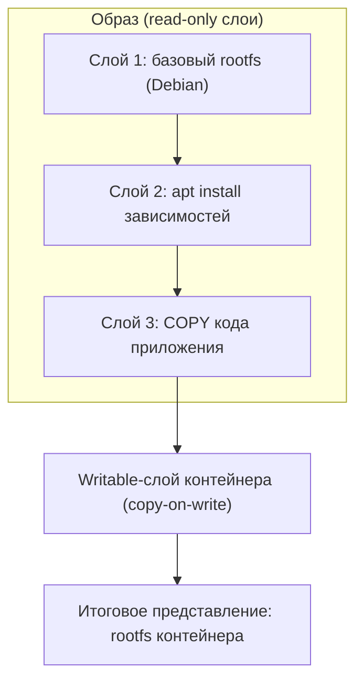
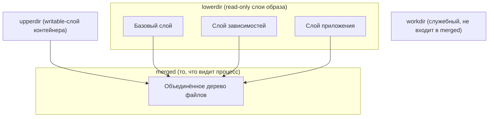
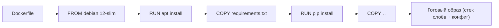
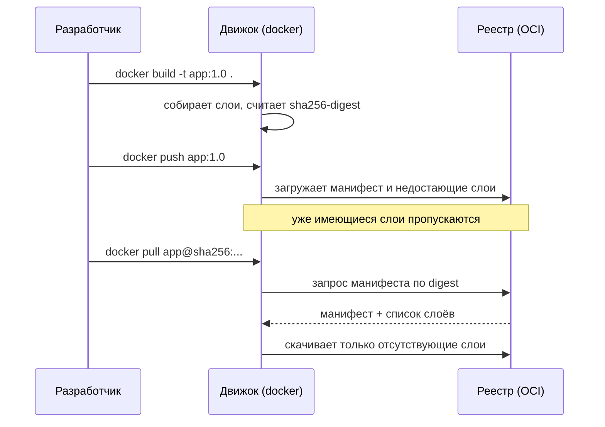

Контейнер не появляется из воздуха: его файловая система разворачивается из **образа** (image) — заранее подготовленного шаблона. Если [namespaces](/containerization/namespaces/) и [cgroups](/containerization/cgroups/) отвечают за изоляцию и лимиты запущенного процесса, то образ отвечает за то, *что именно* этот процесс увидит как свой корневой каталог `/`. В этом разделе разберём, как образ устроен внутри: из чего складываются слои, как union-файловые системы собирают их в единое дерево, почему образы адресуются по хешу, и как Dockerfile превращается в стек слоёв.

## Что такое образ контейнера

Образ контейнера — это **неизменяемый (read-only) шаблон файловой системы плюс метаданные конфигурации**. Метаданные описывают, как запускать контейнер по умолчанию:

- `entrypoint` — основная исполняемая команда (PID 1 внутри контейнера);
- `cmd` — аргументы по умолчанию к entrypoint (их легко переопределить при запуске);
- `env` — переменные окружения;
- `workdir` — рабочий каталог процесса;
- а также `exposed ports`, `user`, `labels` и прочее.

Ключевое слово — **неизменяемый**. Сам образ нельзя «отредактировать на лету»: при запуске контейнера движок берёт read-only слои образа и кладёт сверху тонкий **writable-слой**, в который попадают все изменения процесса. Остановка и удаление контейнера удаляют этот writable-слой; образ остаётся нетронутым. Подробнее жизненный цикл writable-слоя и тома (volumes) рассматриваются в разделе [Хранение данных](/containerization/storage/).

## Слои: образ как стек изменений

Образ собирается не как один монолитный архив, а как **стек слоёв (layers)**. Каждый слой — это набор изменений файловой системы относительно предыдущего: добавленные, изменённые и удалённые файлы. Слои укладываются один поверх другого, и итоговое дерево файлов — результат их наложения.



Такая модель даёт два важных свойства:

1. **Переиспользование.** Если десять образов начинаются с одного и того же базового слоя `debian`, этот слой хранится на диске и передаётся по сети **один раз**.
2. **Инкрементальность.** При обновлении приложения меняется только верхний слой с кодом; нижние слои с ОС и зависимостями остаются прежними и не пересобираются и не перекачиваются.

## Union-файловые системы и OverlayFS

Чтобы из нескольких независимых каталогов-слоёв собрать единое дерево, используются **union- (overlay-) файловые системы**. В Linux де-факто стандартом стала **OverlayFS** — она встроена в ядро и используется драйвером хранилища `overlay2` в Docker.

OverlayFS оперирует четырьмя понятиями:

| Каталог | Назначение |
|---|---|
| **lowerdir** | Нижние, read-only слои (могут быть стопкой из нескольких слоёв образа) |
| **upperdir** | Верхний, writable-слой — сюда попадают все изменения |
| **workdir** | Служебный пустой каталог на той же ФС, что и upperdir; ядро использует его для атомарных операций |
| **merged** | Итоговое объединённое представление, которое и видит процесс как свой `/` |



### Copy-on-write

Главный механизм OverlayFS — **copy-on-write (CoW)**, копирование при записи:

- **Чтение** файла, который существует только в нижнем слое, идёт напрямую из lowerdir — без копирования.
- При **первой записи** в такой файл OverlayFS сначала целиком копирует его из lowerdir в upperdir («copy up»), и только потом изменяет копию. Нижний слой остаётся нетронутым.

Отсюда практическое следствие: запись в большой файл, лежащий в нижнем слое, влечёт его полное копирование наверх и может быть медленной и затратной по месту. Для часто записываемых и больших данных используйте тома, а не writable-слой (см. [Хранение данных](/containerization/storage/)).

### Whiteout: «удаление» из нижнего слоя

Файл в read-only нижнем слое нельзя физически удалить. Чтобы смоделировать удаление, OverlayFS создаёт в upperdir специальный **whiteout-файл** (в реализации ядра — символьное устройство с номерами 0/0). В merged-представлении такой файл «скрывает» одноимённый файл из нижних слоёв, и для процесса он выглядит удалённым.

:::caution[Удаление не уменьшает образ]
Если в Dockerfile в одном слое скопировать большой файл, а в следующем слое его «удалить», размер образа не уменьшится: данные остаются в нижнем слое, а сверху просто ложится whiteout. Чтобы данные действительно не попали в образ, удаляйте их в той же инструкции `RUN`, что и создали, либо применяйте multi-stage builds.
:::

## Content-addressable storage и digest

Слои и конфигурация образа хранятся как **content-addressable storage**: каждый объект адресуется по криптографическому хешу своего содержимого — **digest** в формате `sha256:<hex>`.

```text
sha256:e3b0c44298fc1c149afbf4c8996fb92427ae41e4649b934ca495991b7852b855
```

Это даёт:

- **Дедупликацию.** Два байт-в-байт одинаковых слоя имеют один и тот же digest и хранятся единожды, даже если принадлежат разным образам.
- **Целостность.** Получив слой, движок пересчитывает хеш и сверяет с ожидаемым digest — подмена или повреждение данных обнаруживаются сразу.
- **Однозначность.** Манифест образа (manifest) ссылается на слои и конфиг по их digest, образуя проверяемое дерево — по сути граф Меркла.

**Тег против digest.** Тег (`nginx:1.27`) — это изменяемая человекочитаемая метка, которую можно переназначить на другой образ. Digest (`nginx@sha256:...`) указывает на конкретное содержимое и никогда не меняется. В production-окружениях фиксация по digest гарантирует, что вы запускаете именно тот образ, который тестировали.

Формат манифеста, конфигурации и слоёв стандартизирован спецификацией **OCI image-spec** — её детали и связь с runtime-spec разбираются в разделе [Стандарты OCI и среды выполнения](/containerization/runtimes/).

## Dockerfile: как слои создаются

Образы чаще всего собирают декларативно из **Dockerfile**. Основные инструкции:

```dockerfile
FROM debian:12-slim          # базовый образ — нижние слои
WORKDIR /app                 # рабочая директория (метаданные)
ENV LANG=C.UTF-8             # переменная окружения (метаданные)
RUN apt-get update && \      # выполняет команду -> новый слой
    apt-get install -y python3 && \
    rm -rf /var/lib/apt/lists/*
COPY requirements.txt .      # копирует файлы -> новый слой
RUN pip3 install -r requirements.txt
COPY . .                     # код приложения -> новый слой
CMD ["python3", "app.py"]    # команда по умолчанию (метаданные)
```

Разница между похожими инструкциями:

| Инструкция | Что делает |
|---|---|
| `COPY` | Копирует файлы из контекста сборки в образ (предпочтительна) |
| `ADD` | То же, плюс умеет распаковывать локальные tar и качать по URL (используйте осознанно) |
| `CMD` | Аргументы по умолчанию; легко переопределяются при `docker run` |
| `ENTRYPOINT` | Основная команда; аргументы из `CMD`/CLI передаются ей |
| `RUN` | Выполняет команду на этапе сборки и фиксирует результат в новом слое |



### Кэширование слоёв и порядок инструкций

Каждая значимая инструкция (`RUN`, `COPY`, `ADD`) создаёт слой, и сборщик **кэширует** результат. При повторной сборке инструкция берётся из кэша, если не изменились ни она сама, ни её входные данные (для `COPY` — содержимое копируемых файлов). Как только один слой признан изменившимся, **все последующие слои пересобираются заново** — кэш «ломается» сверху вниз.

Отсюда главное правило: **редко меняющееся — выше, часто меняющееся — ниже**. Классический приём для приложений на пакетных менеджерах:

```dockerfile
COPY requirements.txt .          # меняется редко
RUN pip3 install -r requirements.txt   # тяжёлый шаг кэшируется
COPY . .                         # код меняется часто — внизу
```

Если бы `COPY . .` стоял перед установкой зависимостей, любое изменение в коде сбрасывало бы кэш и заставляло переустанавливать все зависимости заново.

:::tip[.dockerignore]
Файл `.dockerignore` исключает из контекста сборки лишнее (`.git`, `node_modules`, локальные артефакты, секреты). Это ускоряет сборку, уменьшает образ и предотвращает срабатывание `COPY . .` на ненужных файлах, ломающее кэш.
:::

### Multi-stage builds

Чтобы инструменты сборки (компиляторы, dev-зависимости) не попадали в финальный образ, применяют **многоэтапную сборку (multi-stage build)**: в одном этапе собирают артефакт, в финальный образ копируют только результат.

```dockerfile
# Этап сборки
FROM golang:1.22 AS build
WORKDIR /src
COPY . .
RUN go build -o /app/server ./cmd/server

# Финальный образ — только бинарник
FROM gcr.io/distroless/base-debian12
COPY --from=build /app/server /server
ENTRYPOINT ["/server"]
```

Финальный образ содержит лишь скомпилированный бинарник и минимальный runtime — без Go-тулчейна и исходников.

## Уменьшение размера образа

Маленькие образы быстрее качаются, занимают меньше места в реестре и имеют меньшую поверхность атаки (об этом — в разделе [Безопасность контейнеров](/containerization/security/)).

| Приём | Эффект |
|---|---|
| Минимальные базовые образы (`-slim`, `alpine`) | Меньше пакетов в базе |
| **Distroless**-образы (`gcr.io/distroless/*`) | Только runtime приложения, без shell и пакетного менеджера |
| Multi-stage builds | Инструменты сборки не попадают в финал |
| Объединение `RUN` и очистка кэшей в одной инструкции | Меньше слоёв, мусор не оседает в нижних слоях |
| `.dockerignore` | Лишнее не попадает в контекст |

## Реестры: хранение и распространение

**Реестр (registry)** — это хранилище образов, организованное вокруг content-addressable storage. Публичный пример — Docker Hub, но подойдёт любой **OCI-совместимый** реестр (GitHub Container Registry, Harbor, реестры облаков, self-hosted Distribution).

Обмен идёт по двум основным операциям:

- **`docker push`** — клиент загружает в реестр слои (по digest) и манифест; уже существующие в реестре слои не передаются повторно.
- **`docker pull`** — клиент скачивает манифест, по нему определяет недостающие слои и качает только их, сверяя digest.



## Практика

Сборка и инспекция образа:

```bash
# Собрать образ из Dockerfile в текущем каталоге
docker build -t myapp:1.0 .

# Посмотреть список образов и их размеры
docker image ls

# Посмотреть слои и команды, которыми они созданы
docker history myapp:1.0

# Получить digest и конфигурацию образа
docker image inspect myapp:1.0
```

Типичный вывод `docker image ls` показывает репозиторий, тег, ID образа (короткий digest конфига) и размер:

```text
REPOSITORY   TAG    IMAGE ID       CREATED         SIZE
myapp        1.0    a1b2c3d4e5f6   2 minutes ago   78.3MB
debian       12     0a1b2c3d4e5f   3 weeks ago     117MB
```

Запустить контейнер из образа можно командой `docker run myapp:1.0` — движок развернёт read-only слои образа, добавит сверху writable-слой через OverlayFS и стартует процесс с заданными `entrypoint`/`cmd`. Подробности работы с Docker на практике — в разделе [Docker на практике](/containerization/docker/).

:::note[Что запомнить]
Образ — это **неизменяемый стек read-only слоёв плюс конфиг**, адресуемый по sha256-digest. OverlayFS объединяет слои в единое дерево и применяет copy-on-write, добавляя сверху writable-слой контейнера. Порядок инструкций в Dockerfile напрямую определяет эффективность кэша, а multi-stage builds и distroless-базы дают компактные и безопасные образы.
:::

**Источники:**

- [Overlay Filesystem — The Linux Kernel documentation](https://docs.kernel.org/filesystems/overlayfs.html)
- [OverlayFS storage driver — Docker Docs](https://docs.docker.com/engine/storage/drivers/overlayfs-driver/)
- [OCI Image Format Specification](https://github.com/opencontainers/image-spec)

## Задания

### Задание 1. Неизменяемость образа и writable-слой

Объясните, почему образ называют «неизменяемым», если внутри запущенного контейнера можно создавать, редактировать и удалять файлы. Куда попадают эти изменения и что с ними произойдёт после `docker rm` контейнера?

<details>
<summary>Решение</summary>

Образ — это **read-only стек слоёв плюс конфиг**. Когда движок запускает контейнер, он не трогает слои образа, а кладёт сверху тонкий **writable-слой** (в терминах OverlayFS — `upperdir`). Все изменения процесса — новые файлы, правки, удаления — оседают именно там:

- запись нового файла → файл создаётся в writable-слое;
- правка файла из нижнего слоя → срабатывает copy-on-write: файл копируется наверх (copy up) и меняется копия, нижний слой не трогается;
- удаление файла из нижнего слоя → в writable-слой кладётся whiteout, скрывающий оригинал.

Сами read-only слои образа при этом не меняются — поэтому образ «неизменяемый». После остановки и `docker rm` writable-слой удаляется вместе со всеми изменениями, а образ остаётся нетронутым (и его можно запустить снова из исходного состояния). Из этого следствие: **данные, которые должны пережить контейнер, нельзя держать в writable-слое** — для них нужны тома (volumes).

</details>

### Задание 2. Whiteout и «удаление» большого файла

В Dockerfile есть такой фрагмент:

```dockerfile
COPY huge-dataset.tar /tmp/data.tar      # файл на 800 МБ
RUN tar -xf /tmp/data.tar -C /opt/app
RUN rm /tmp/data.tar                      # «убираем за собой»
```

Автор ожидал, что после `rm` образ станет на 800 МБ легче. Что произойдёт на самом деле и как переписать Dockerfile правильно?

<details>
<summary>Решение</summary>

Образ **не уменьшится** на 800 МБ. Причина — слоистая модель и whiteout:

- `COPY huge-dataset.tar` создаёт слой, в котором лежат эти 800 МБ. Этот слой неизменяем.
- `RUN rm /tmp/data.tar` создаёт **новый** слой сверху. Физически удалить файл из нижнего read-only слоя нельзя — вместо этого кладётся whiteout-файл (в реализации ядра — символьное устройство 0/0), который лишь *скрывает* `data.tar` в итоговом merged-представлении.
- Данные продолжают занимать место в нижнем слое, входят в размер образа и качаются при `pull`.

Удалять нужно **в той же инструкции `RUN`, что и создавать** временный файл, чтобы лишние данные вообще не зафиксировались в отдельном слое:

```dockerfile
COPY huge-dataset.tar /tmp/data.tar
RUN tar -xf /tmp/data.tar -C /opt/app && \
    rm /tmp/data.tar
```

Либо вынести распаковку в отдельный этап и скопировать в финальный образ только результат через **multi-stage build**:

```dockerfile
FROM debian:12-slim AS extract
COPY huge-dataset.tar /tmp/data.tar
RUN mkdir /opt/app && tar -xf /tmp/data.tar -C /opt/app

FROM debian:12-slim
COPY --from=extract /opt/app /opt/app
```

Здесь слой с `data.tar` остаётся в промежуточном этапе `extract` и в финальный образ не попадает.

</details>

### Задание 3. Порядок инструкций и кэш слоёв

Даны два варианта Dockerfile. Приложение собирается и запускается одинаково, но при ежедневной правке кода один из них пересобирается секунды, а другой — минуты. Определите, какой именно медленный и почему, опираясь на работу кэша слоёв.

```dockerfile
# Вариант A
FROM python:3.12-slim
WORKDIR /app
COPY . .
RUN pip install -r requirements.txt
CMD ["python", "app.py"]
```

```dockerfile
# Вариант B
FROM python:3.12-slim
WORKDIR /app
COPY requirements.txt .
RUN pip install -r requirements.txt
COPY . .
CMD ["python", "app.py"]
```

<details>
<summary>Решение</summary>

Медленный — **вариант A**.

Кэш слоёв ломается сверху вниз: как только содержимое входных данных инструкции изменилось, её слой и **все последующие** пересобираются заново.

- В **варианте A** первой идёт `COPY . .` — она зависит от **всего** контекста сборки. Любая правка в любом файле кода меняет вход этой инструкции, её слой инвалидируется, а вслед за ним инвалидируется и `RUN pip install`. В итоге зависимости переустанавливаются при **каждом** изменении кода — это и есть «минуты».

- В **варианте B** сначала копируется только `requirements.txt`, затем ставятся зависимости, и лишь потом идёт `COPY . .` с остальным кодом. Пока `requirements.txt` не менялся, слои `COPY requirements.txt .` и `RUN pip install` берутся из кэша, а пересобирается только дешёвый верхний слой `COPY . .` — это «секунды».

Правило: **редко меняющееся — выше, часто меняющееся — ниже**. Тяжёлый шаг установки зависимостей нужно отделять от копирования кода и держать выше него. Дополнительно стоит завести `.dockerignore` (исключить `.git`, кэши, артефакты), чтобы посторонние файлы не сбрасывали кэш `COPY . .`.

</details>

### Задание 4. Дедупликация по digest и теги в production

Команда собрала и запушила в реестр образ `api:latest`. Через неделю в реестр запушили другой билд под тем же тегом `api:latest`. Ответьте:

1. Почему при `push` второго образа в реестр передались не все слои, даже если базовый образ остался тем же?
2. Чем рискует production-окружение, если деплой описан как `docker pull api:latest`?
3. Как зафиксировать запуск так, чтобы гарантированно получать именно протестированный образ?

<details>
<summary>Решение</summary>

**1. Почему передались не все слои.** Реестр организован как content-addressable storage: слои адресуются по `sha256`-digest своего содержимого. При `push` клиент отправляет манифест и предлагает слои по их digest, а реестр забирает только те, которых у него ещё нет. Базовый слой и слой зависимостей байт-в-байт совпадают с первым билдом → у них тот же digest → они уже лежат в реестре и повторно не передаются (дедупликация). Реально загружаются только изменившиеся верхние слои.

**2. Чем рискует production с `latest`.** Тег — это **изменяемая** человекочитаемая метка, её можно переназначить на другой образ. `api:latest` теперь указывает на новый билд. Значит:
- разные узлы/поды, тянувшие образ в разное время, могут работать на **разном** содержимом;
- нельзя воспроизвести, что именно крутилось в проде в момент инцидента;
- откат «вернуть latest» не гарантирует возврат к прежним байтам.

**3. Как зафиксировать.** Запускать по **digest**, а не по тегу — digest указывает на конкретное неизменяемое содержимое и никогда не меняется:

```bash
docker pull api@sha256:e3b0c44298fc1c149afbf4c8996fb92427ae41e4649b934ca495991b7852b855
```

Digest нужного образа можно получить из `docker image inspect` или из вывода `push`. Так в проде гарантированно поднимется ровно тот образ, который проходил тестирование, а целостность скачанных слоёв движок проверит, пересчитав их хеши и сверив с манифестом.

</details>
