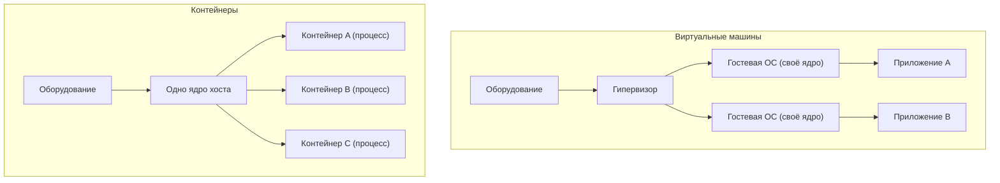
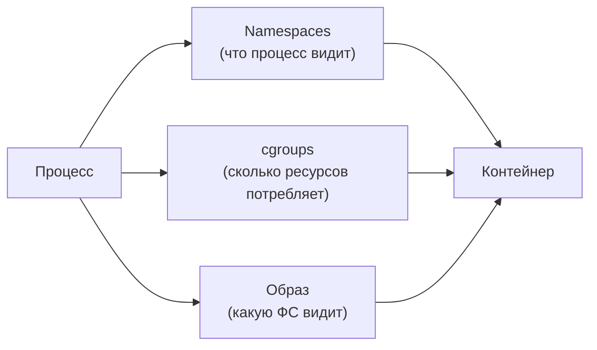
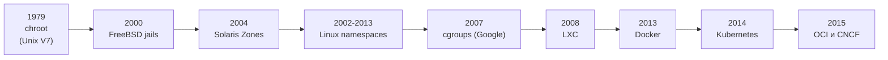

Контейнеризация — это способ упаковать приложение вместе со всеми его зависимостями (библиотеками, утилитами, конфигурацией, файлами) в одну изолированную и переносимую единицу, которую можно запустить как обычный процесс на общем ядре операционной системы. Ключевое слово здесь — «процесс». Контейнер не виртуализирует оборудование и не несёт в себе собственного ядра ОС: он использует ядро хоста, а изоляция достигается средствами самого ядра. Именно поэтому контейнеры стартуют за миллисекунды, занимают мегабайты, а не гигабайты, и позволяют запускать сотни экземпляров на одной машине.

Чтобы понять, почему эта технология стала фундаментом современной разработки, начнём с проблемы, которую она решает.

## Какую проблему решают контейнеры

Любой, кто разворачивал приложение не на своей машине, сталкивался с классической фразой «но у меня же работает». Код, который безупречно запускался на ноутбуке разработчика, падает на сервере тестирования, а в продакшене ведёт себя ещё иначе. Причины почти всегда одни и те же:

- **Конфликты версий зависимостей.** Приложению A нужен Python 3.9 и libssl 1.1, приложению B на той же машине — Python 3.12 и libssl 3.0. Установить оба набора системно, не сломав ничего, тяжело. Это явление часто называют «адом зависимостей» (dependency hell).
- **Различия окружений.** Версия ядра, набор системных библиотек, переменные среды, права доступа, локали — всё это незаметно влияет на поведение программы.
- **Тяжесть и медленный старт виртуальных машин.** Изоляцию можно получить и через ВМ, но каждая ВМ тащит за собой полноценную гостевую ОС с собственным ядром. Это десятки секунд на загрузку, гигабайты памяти и диска, заметные накладные расходы.

Контейнеры отвечают на это сразу несколькими свойствами:

| Потребность | Что даёт контейнеризация |
| --- | --- |
| Воспроизводимость | Один и тот же образ запускается одинаково на ноутбуке, в CI и в продакшене |
| Плотность размещения | Сотни контейнеров на одном хосте — общее ядро, минимум накладных расходов |
| Скорость | Старт за миллисекунды-секунды, мгновенное масштабирование |
| Переносимость | Артефакт не привязан к конкретной машине и её настройкам |
| Иммутабельность | Образ собирается один раз и не меняется; обновление — это новый образ, а не правка на месте |

Иммутабельность артефакта особенно важна: вместо того чтобы «чинить» работающий сервер вручную, вы собираете новую версию образа, тестируете её и заменяете старую целиком. Это устраняет дрейф конфигурации и делает откат тривиальным. Именно поэтому контейнеры стали естественной основой для **микросервисной архитектуры** (каждый сервис — свой образ со своими зависимостями) и для **CI/CD**-конвейеров (собранный образ проходит весь путь от сборки до релиза без пересборки окружения).

:::tip[Главная идея]
Контейнер — это не «лёгкая виртуальная машина». Это обычный процесс Linux, которому ядро показало ограниченный взгляд на систему и ограничило потребление ресурсов. Всё остальное — следствие этого факта.
:::

## Чем контейнер отличается от виртуальной машины

Принципиальное различие — в том, где проходит граница изоляции. Виртуальная машина виртуализирует оборудование: гипервизор предоставляет гостевой системе виртуальный процессор, память, диски, а гостевая ОС загружает **собственное ядро**. Контейнер же делит ядро с хостом, а изолируется на уровне видимости процессов и ресурсов.

Отсюда вытекают и компромиссы: ВМ дают более сильную изоляцию (отдельное ядро — отдельная поверхность атаки и сбоев), но платят за это весом и скоростью; контейнеры легче и быстрее, но делят ядро, что накладывает ограничения на безопасность и совместимость. Подробное сравнение с таблицами и сценариями выбора смотрите в разделе [сравнение контейнеров и ВМ](/virtualization/containers-vs-vm/).

## Формула контейнера

Если убрать маркетинг, любой контейнер в Linux складывается из четырёх элементов:

**Контейнер = процесс + namespaces + cgroups + образ**

- **Процесс** — контейнер запускается ядром как обычная программа. У него есть PID, он виден в `ps` на хосте (хотя внутри контейнера видит только себя).
- **Namespaces (пространства имён)** отвечают за **изоляцию видимости**. Они дают процессу собственный, ограниченный взгляд на систему: свой набор PID, свою сеть, свою файловую систему монтирования, свой hostname. С точки зрения процесса внутри он один в системе. Подробно — в разделе [Namespaces](/containerization/namespaces/).
- **cgroups (control groups)** отвечают за **лимиты ресурсов**: сколько CPU, памяти, дискового и сетевого ввода-вывода может потреблять контейнер. Без них один контейнер мог бы «съесть» всю память хоста. Разбор — в разделе [cgroups и лимиты ресурсов](/containerization/cgroups/).
- **Образ (image)** — это упакованная файловая система со всем содержимым приложения и его зависимостями, организованная в слои. Из образа создаётся корневая ФС контейнера.

Эти механизмы — namespaces и cgroups — встроены в ядро Linux. Docker, containerd и прочие инструменты их не изобретают, а лишь удобно оркестрируют. Понимание этой формулы — ключ ко всему курсу: дальше мы разберём каждый компонент по отдельности.

## История: от chroot до Kubernetes

Контейнеры не возникли в один день вместе с Docker. Это итог почти полувековой эволюции механизмов изоляции в Unix-подобных системах.

### chroot (1979)

Самый ранний предок контейнеров — системный вызов `chroot`, появившийся в Unix Version 7 в 1979 году и добавленный в BSD в 1983-м (релиз 4.2BSD). Он подменяет видимый процессу корень файловой системы: программа, запущенная в `chroot`, считает корнем указанный каталог и не видит того, что выше. Это была лишь изоляция файловой системы — без изоляции процессов, сети или пользователей — но сама идея «дать процессу ограниченный взгляд на мир» родилась именно здесь.

### FreeBSD jails (2000) и Solaris Zones (2004)

Следующий шаг сделали другие Unix-системы. **FreeBSD jails** (2000) расширили идею chroot до полноценной изоляции: своя файловая система, свой набор процессов, свой сетевой адрес, ограниченные привилегии. **Solaris Zones** (позже названные Containers, 2004) пошли ещё дальше, добавив управление ресурсами и почти полную виртуализацию окружения ОС поверх одного ядра. Это уже были контейнеры в современном смысле, но привязанные к конкретным проприетарным платформам.

### Linux: namespaces и cgroups (2002–2013)

В Linux фундамент собирался по частям и не сразу. **Namespaces** добавлялись постепенно: первым стал mount namespace (2002), затем UTS, IPC, PID, network namespaces, и завершил картину user namespace (2013). Параллельно инженеры Google в 2007 году представили **cgroups** — изначально под названием «process containers», — механизм учёта и ограничения ресурсов групп процессов. К 2013 году в ядре наконец сошлись оба кита, на которых стоит контейнеризация.

### LXC (2008)

**LXC (Linux Containers)** в 2008 году первым объединил namespaces и cgroups в готовый инструмент для запуска «системных контейнеров» — фактически целых легковесных Linux-окружений. LXC доказал, что контейнеры в Linux работают, но оставался относительно низкоуровневым и неудобным в повседневной разработке.

### Docker (2013)

Перелом наступил в 2013 году с появлением **Docker**. Технически он поначалу использовал тот же LXC под капотом, но принёс то, чего не хватало: **формат образа со слоями**, публичный **реестр** (Docker Hub) для обмена образами, декларативный `Dockerfile` для сборки и крайне простой CLI. Docker превратил контейнеры из инструмента для специалистов в массовую технологию — `docker run` стал одной из самых узнаваемых команд в индустрии. Именно удобство, а не сама изоляция, сделало контейнеры повсеместными.

### OCI (2015) и стандартизация

Бурный рост породил риск фрагментации: каждый вендор мог пойти своим путём. Чтобы этого избежать, в 2015 году была основана **OCI (Open Container Initiative)** — она зафиксировала открытые стандарты на формат образа (image-spec) и на среду выполнения (runtime-spec). Эталонной реализацией runtime-spec стал **runc**. Благодаря OCI образ, собранный одним инструментом, гарантированно запускается другим.

### CNCF, Kubernetes и разделение слоёв

В 2014 году Google открыл исходный код **Kubernetes** — системы оркестрации, выросшей из внутренней платформы Borg. Управлять одним контейнером просто, но в продакшене их тысячи: их нужно планировать по узлам, перезапускать при сбоях, масштабировать, связывать сетью. Эту задачу и решает оркестратор. Kubernetes стал флагманским проектом **CNCF (Cloud Native Computing Foundation)**, основанной в 2015 году.

Со временем монолитный Docker разделился на слои: низкоуровневый рантайм **runc**, высокоуровневый рантайм **containerd**, а также альтернативный **CRI-O**. Kubernetes общается с ними через стандартный интерфейс **CRI (Container Runtime Interface)**, что окончательно отвязало оркестрацию от конкретного движка контейнеров.

:::note
Сегодня «контейнеры» — это не один продукт, а экосистема стандартов и взаимозаменяемых компонентов: OCI задаёт форматы, runc/containerd/CRI-O исполняют, Kubernetes оркестрирует. Docker остаётся популярным инструментом разработчика, но он давно не единственный игрок.
:::

## Как устроен этот курс

Дальше мы разберём контейнеризацию слой за слоем, двигаясь от ядра к оркестрации:

- [Namespaces](/containerization/namespaces/) — изоляция видимости: PID, сеть, точки монтирования, пользователи.
- [cgroups и лимиты ресурсов](/containerization/cgroups/) — ограничение CPU, памяти и ввода-вывода.
- [Образы и слои файловой системы](/containerization/images/) — как устроены image, слои и OverlayFS.
- [Стандарты OCI и среды выполнения](/containerization/runtimes/) — OCI, runc, containerd, CRI-O, CRI.
- [Docker на практике](/containerization/docker/) — сборка, запуск и повседневная работа.
- [Сеть контейнеров](/containerization/networking/) — мосты, overlay-сети, CNI.
- [Хранение данных](/containerization/storage/) — тома, persistent storage, драйверы.
- [Безопасность контейнеров](/containerization/security/) — seccomp, capabilities, изоляция и поверхность атаки.
- [Оркестрация и Kubernetes](/containerization/orchestration/) — управление контейнерами в масштабе.
- [Глоссарий и источники](/containerization/glossary/) — термины и ссылки на первоисточники.

Если вы только выстраиваете маршрут изучения, загляните в [дорожную карту](/roadmap/). А начать стоит с первого кита изоляции — [пространств имён](/containerization/namespaces/).
