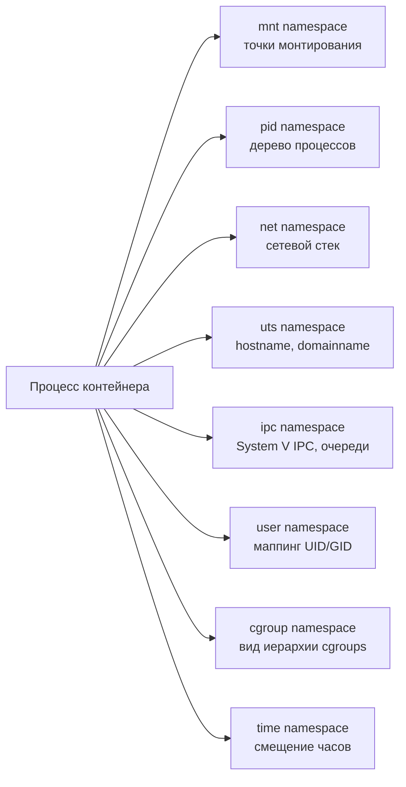
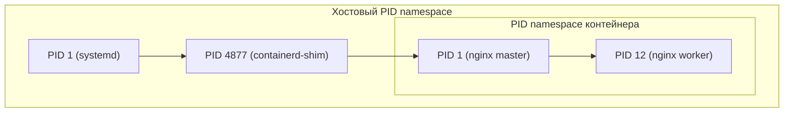

Контейнер — это не отдельная сущность ядра, а обычный набор процессов, которым ядро Linux «подменило» картину мира. Двумя главными механизмами, делающими эту подмену, являются **namespaces** (пространства имён) и **cgroups** (контрольные группы). Разделение обязанностей между ними простое и его важно усвоить с самого начала:

- **namespaces** изолируют то, что процесс **видит** — какие точки монтирования, сетевые интерфейсы, идентификаторы процессов и пользователей ему доступны;
- **cgroups** ограничивают то, что процесс **потребляет** — сколько CPU, памяти, операций ввода-вывода ему позволено использовать (см. [/containerization/cgroups/](/containerization/cgroups/)).

Эта глава целиком о первом механизме. Если виртуальная машина даёт гостю отдельное ядро и эмулированное «железо» (см. [/virtualization/containers-vs-vm/](/virtualization/containers-vs-vm/)), то namespaces не дают ничего отдельного — они лишь фильтруют один общий ресурс ядра так, что разные группы процессов видят разные его подмножества.

## Идея namespace

Каждый namespace изолирует **один класс глобальных ресурсов ядра**. Обычно такие ресурсы глобальны для всей системы: список процессов, таблица монтирования, hostname, сетевой стек. Namespace «оборачивает» класс ресурса в обёртку, видимую только участникам этого пространства имён. Процессы внутри одного PID namespace видят одно дерево процессов, процессы в другом — другое, и они ничего не знают друг о друге, хотя выполняются на одном ядре.

Каждый процесс в Linux одновременно принадлежит ровно одному namespace каждого типа. По умолчанию все процессы наследуют «корневые» (initial) namespaces, созданные при загрузке системы. Контейнер появляется тогда, когда для группы процессов создаётся новый набор namespaces по нескольким типам сразу.



## Типы namespaces

На современном ядре Linux существует восемь типов пространств имён.

| Тип | Флаг clone() | Что изолирует |
|-----|--------------|---------------|
| **mount (mnt)** | `CLONE_NEWNS` | Список точек монтирования. Процесс получает собственное представление дерева ФС; монтирование/размонтирование внутри не видно снаружи. |
| **UTS** | `CLONE_NEWUTS` | `hostname` и `domainname`. Позволяет контейнеру иметь собственное сетевое имя. |
| **IPC** | `CLONE_NEWIPC` | Объекты System V IPC (разделяемая память, семафоры, очереди сообщений) и POSIX-очереди сообщений. |
| **PID** | `CLONE_NEWPID` | Пространство идентификаторов процессов: своё дерево с собственным PID 1. |
| **network (net)** | `CLONE_NEWNET` | Сетевые интерфейсы, IP-адреса, таблицы маршрутизации, порты, правила iptables/nftables, сокеты. |
| **user** | `CLONE_NEWUSER` | Отображение идентификаторов пользователей и групп (UID/GID), набор его возможностей (capabilities). Основа rootless. |
| **cgroup** | `CLONE_NEWCGROUP` | Вид корня cgroup-иерархии: процесс видит свою группу как корень, не зная пути на хосте. |
| **time** | `CLONE_NEWTIME` | Смещения для `CLOCK_MONOTONIC` и `CLOCK_BOOTTIME` (с ядра 5.6). |

Историческая деталь: флаг для mount namespace называется `CLONE_NEWNS`, а не `CLONE_NEWMNT`, потому что mount namespace появился первым (ядро 2.4.19, 2002 год) — тогда ещё не предполагалось, что namespaces станут целым семейством.

:::note
Time namespace изолирует только монотонные часы (`CLOCK_MONOTONIC` и `CLOCK_BOOTTIME`) через смещения. Часы реального времени (`CLOCK_REALTIME`, то есть «настенное» время) общие для всей системы и namespace их не виртуализирует. Это нужно прежде всего для корректной миграции и восстановления контейнеров (CRIU), где важно сохранить uptime.
:::

### PID namespace: своё дерево процессов

PID namespace — один из самых наглядных. Внутри него процессы пронумерованы заново, начиная с 1. Первый процесс, созданный в новом PID namespace, получает PID 1 и берёт на себя особую роль init-процесса:

- **reaping зомби** — когда дочерний процесс завершается, а его непосредственный родитель уже умер, осиротевший процесс переподвешивается к PID 1; именно PID 1 обязан вызвать `wait()` и «похоронить» зомби. Если внутри контейнера в роли PID 1 стоит приложение, не умеющее этого делать, зомби-процессы будут накапливаться.
- **обработка сигналов** — у PID 1 особая семантика: ядро не применяет к нему действия по умолчанию для сигналов вроде `SIGTERM`, если обработчик не установлен явно. Поэтому процесс, не настроивший обработку `SIGTERM`, может игнорировать корректную остановку контейнера, и оркестратору придётся убивать его через `SIGKILL`.

Важно, что PID namespaces **вложены**: процесс имеет PID в своём пространстве имён и одновременно другой PID в родительском (вплоть до корневого). Родительский namespace видит все процессы потомков, но не наоборот.



Один и тот же процесс `nginx master` виден как PID 1 внутри контейнера и одновременно как обычный «сквозной» PID на хосте — например, PID 4880, дочерний к containerd-shim. Если процесс с PID 1 внутри namespace завершается, ядро посылает `SIGKILL` всем остальным процессам этого пространства имён и **разрушает namespace** — именно поэтому остановка главного процесса контейнера означает остановку всего контейнера.

### user namespace: root внутри без root снаружи

User namespace отображает диапазоны UID/GID внутри пространства имён на другие диапазоны на хосте. Классическая конфигурация: UID 0 (`root`) внутри контейнера соответствует, скажем, UID 100000 на хосте — обычному непривилегированному пользователю.

Это и есть фундамент **rootless-контейнеров**: процесс может быть «root» внутри своего мира (управлять своими файлами, монтировать, менять hostname), но для ядра хоста он остаётся непривилегированным пользователем без реальных полномочий над системой. User namespace — единственный тип, который непривилегированный пользователь может создать без специальных прав, и именно он «разблокирует» создание остальных namespaces без root. Подробнее о rootless и связанных рисках — в разделе [/containerization/security/](/containerization/security/).

Маппинг задаётся через файлы `/proc/<pid>/uid_map` и `/proc/<pid>/gid_map`. Формат строки: `ID_внутри ID_снаружи количество`.

```bash
# Внутри нового user namespace стали "root", хотя снаружи это обычный пользователь
unshare --user --map-root-user bash
id        # uid=0(root) gid=0(root)
cat /proc/self/uid_map   # 0  1000  1
```

## Как namespaces создаются и управляются

Всё взаимодействие с namespaces строится на трёх системных вызовах:

- **`clone()`** — создаёт новый процесс и одновременно помещает его в новые namespaces, перечисленные флагами (`CLONE_NEWPID`, `CLONE_NEWNET`, …). Именно так runtime типа `runc` запускает контейнер.
- **`unshare()`** — «отцепляет» текущий процесс от его текущих namespaces, переводя его в новые, без создания нового процесса. Доступна и одноимённая утилита `unshare`.
- **`setns()`** — присоединяет процесс к **уже существующему** namespace по файловому дескриптору. На этом построена утилита `nsenter` (войти в namespaces работающего контейнера).

Сами namespaces представлены в файловой системе `/proc`. Для каждого процесса есть каталог `/proc/<pid>/ns/`, где каждый файл — символическая ссылка на конкретный namespace:

```bash
ls -l /proc/self/ns/
# lrwxrwxrwx ... mnt -> 'mnt:[4026531840]'
# lrwxrwxrwx ... net -> 'net:[4026531992]'
# lrwxrwxrwx ... pid -> 'pid:[4026531836]'
# ...
```

Число в квадратных скобках — инод namespace, его уникальный идентификатор. Если у двух процессов совпадает инод для `net`, они находятся в одном сетевом пространстве имён. Пока на namespace ссылается хотя бы один процесс или открытый файловый дескриптор (например, через bind-mount файла-ссылки), он продолжает существовать — это позволяет создавать «постоянные» namespaces, переживающие завершение создавшего их процесса.

## Практика

Разберём самый показательный пример — создание PID namespace утилитой `unshare`.

```bash
# --pid: новый PID namespace; --fork: запустить bash как дочерний (будущий PID 1);
# --mount-proc: новый mount namespace и перемонтировать /proc, чтобы ps видел только наши процессы
sudo unshare --pid --fork --mount-proc bash

# Внутри:
echo $$        # 1   — наш bash стал PID 1
ps -e          # видны только процессы этого namespace, а не всего хоста
```

Без `--mount-proc` команда `ps` продолжала бы читать `/proc` хоста и показывала бы все процессы системы — наглядная иллюстрация того, что PID namespace без собственного mount namespace и перемонтированного `/proc` даёт неполную изоляцию.

Полезные инструменты для наблюдения и навигации:

| Команда | Назначение |
|---------|------------|
| `lsns` | Список всех namespaces в системе с типом, инодом, числом процессов и командой-владельцем. |
| `nsenter -t <pid> -n -m` | Войти в network (`-n`) и mount (`-m`) namespaces процесса `<pid>` — отладка контейнера «изнутри». |
| `ip netns add/exec/list` | Управление **именованными** network namespaces (хранятся в `/var/run/netns/`). |
| `readlink /proc/<pid>/ns/net` | Узнать инод конкретного namespace процесса. |

Пример работы с сетевым пространством имён напрямую через `ip`:

```bash
# Создать именованный network namespace и заглянуть в него
sudo ip netns add demo
sudo ip netns exec demo ip link   # внутри только loopback (lo), и он в состоянии DOWN
sudo ip netns exec demo ip link set lo up
sudo ip netns delete demo
```

Свежесозданный network namespace полностью пуст: в нём есть только интерфейс `lo`, причём выключенный, и нет ни маршрутов, ни правил firewall. Чтобы связать его с внешним миром, нужны виртуальные устройства (veth-пары, мосты) — это тема раздела [/containerization/networking/](/containerization/networking/).

:::tip
`lsns` без аргументов — отличная первая команда при разборе того, «что вообще запущено» на хосте с контейнерами: по числу процессов и команде-владельцу сразу видно, какие группы namespaces соответствуют каким контейнерам.
:::

## Итог

Namespaces — это механизм изоляции **видимости**: ядро остаётся одно, но каждый набор процессов получает собственный срез глобальных ресурсов. Восемь типов (mnt, uts, ipc, pid, net, user, cgroup, time) вместе формируют ту «оболочку реальности», которую мы называем контейнером. PID namespace задаёт собственное дерево процессов с особым PID 1, а user namespace через маппинг UID/GID делает возможными rootless-контейнеры.

При этом namespaces ничего не ограничивают количественно — процесс в изолированном пространстве имён по-прежнему может исчерпать всю память или CPU хоста. За лимиты отвечает второй столп контейнеризации — [cgroups](/containerization/cgroups/). Вместе они дают полную изоляцию, на которой строятся среды выполнения OCI (см. [/containerization/runtimes/](/containerization/runtimes/)).

## Задания

### Задание 1. Разделение обязанностей и базовые понятия

Ответьте своими словами на три вопроса:

1. В чём принципиальная разница между тем, что изолируют namespaces, и тем, что ограничивают cgroups?
2. Сколько namespaces каждого типа одновременно «принадлежит» одному процессу в Linux и откуда берутся пространства имён по умолчанию?
3. Почему в разделе сказано, что namespaces «не дают ничего отдельного», в отличие от виртуальной машины?

<details>
<summary>Решение</summary>

1. namespaces изолируют то, что процесс **видит** (точки монтирования, сетевые интерфейсы, дерево процессов, идентификаторы пользователей), а cgroups ограничивают то, что процесс **потребляет** (CPU, память, ввод-вывод). Первое — про видимость, второе — про количественные лимиты.
2. Каждый процесс одновременно принадлежит **ровно одному** namespace **каждого типа**. По умолчанию все процессы наследуют «корневые» (initial) namespaces, созданные при загрузке системы. Контейнер появляется, когда для группы процессов создаётся новый набор namespaces сразу по нескольким типам.
3. Виртуальная машина даёт гостю отдельное ядро и эмулированное «железо». namespaces же работают на одном общем ядре и лишь **фильтруют один общий ресурс ядра** так, что разные группы процессов видят разные его подмножества. Никакого отдельного ядра или железа не появляется.

</details>

### Задание 2. Сценарий «что произойдёт, если…»: PID 1 в контейнере

Разработчик запустил приложение в контейнере так, что в роли PID 1 оказался обычный бинарник, который не устанавливает обработчик `SIGTERM` и не вызывает `wait()` для осиротевших дочерних процессов. Опишите два последствия:

1. Что произойдёт при попытке оркестратора корректно остановить контейнер?
2. Что будет происходить с дочерними процессами, чьи родители завершились?

А также: что случится с самим контейнером, если этот PID 1 завершится?

<details>
<summary>Решение</summary>

1. **Остановка.** У PID 1 особая семантика: ядро не применяет к нему действие по умолчанию для сигналов вроде `SIGTERM`, если обработчик не установлен явно. Поэтому процесс просто **проигнорирует** `SIGTERM`, корректной остановки не произойдёт, и оркестратору придётся убивать контейнер жёстко через `SIGKILL` (обычно по таймауту).
2. **Зомби.** Когда дочерний процесс завершается, а его непосредственный родитель уже умер, осиротевший процесс переподвешивается к PID 1. Именно PID 1 обязан вызвать `wait()` и «похоронить» зомби. Раз приложение этого не умеет — **зомби-процессы будут накапливаться**.
3. **Завершение PID 1.** Если процесс с PID 1 внутри namespace завершается, ядро посылает `SIGKILL` всем остальным процессам этого пространства имён и **разрушает namespace**. Поэтому остановка главного процесса означает остановку всего контейнера.

Практический вывод: либо приложение само корректно обрабатывает сигналы и reaping, либо в роли PID 1 ставят лёгкий init (tini, dumb-init, `--init` у docker).

</details>

### Задание 3. Практика: неполная изоляция PID namespace

Дана команда:

```bash
sudo unshare --pid --fork bash
```

Внутри полученной оболочки выполняется `ps -e`, и она по-прежнему показывает **все** процессы хоста, хотя `echo $$` выводит небольшое число. Объясните, почему изоляция «протекает», и приведите исправленную команду. Поясните роль каждого флага.

<details>
<summary>Решение</summary>

**Почему протекает.** `ps` читает данные из `/proc`. Создан только новый PID namespace, но **mount namespace не тронут** — поэтому `/proc` по-прежнему смонтирован хостовый и отражает процессы всего хоста, а не нового пространства имён. PID namespace без собственного mount namespace и перемонтированного `/proc` даёт неполную изоляцию.

**Исправленная команда:**

```bash
sudo unshare --pid --fork --mount-proc bash

# Внутри:
echo $$        # 1   — наш bash стал PID 1
ps -e          # теперь видны только процессы этого namespace
```

**Роль флагов:**

| Флаг | Назначение |
|------|------------|
| `--pid` | Создать новый PID namespace. |
| `--fork` | Запустить `bash` как дочерний процесс — он и станет будущим PID 1 (сам `unshare` остаётся в исходном namespace). |
| `--mount-proc` | Создать новый mount namespace и перемонтировать `/proc`, чтобы `ps` видел только процессы нового пространства имён. |

Замечание про `echo $$`: даже без `--mount-proc` bash действительно получает PID 1 в своём namespace, но без свежего `/proc` утилиты, читающие `/proc`, этого «не замечают».

</details>

### Задание 4. user namespace, маппинг UID/GID и идентификация по иноду

Выполнена команда и получен вывод:

```bash
unshare --user --map-root-user bash
id                       # uid=0(root) gid=0(root)
cat /proc/self/uid_map   # 0  1000  1
```

1. Расшифруйте строку `0  1000  1` из `uid_map` по формату `ID_внутри ID_снаружи количество`. Является ли этот процесс реально привилегированным для ядра хоста?
2. Почему именно user namespace считают основой rootless-контейнеров и чем он уникален среди восьми типов?
3. Как, имея два PID, проверить, находятся ли они в **одном и том же** сетевом namespace? Приведите команду и критерий.

<details>
<summary>Решение</summary>

1. Строка `0  1000  1` означает: UID `0` (root) **внутри** namespace отображается на UID `1000` **снаружи** (обычный пользователь), и так отображён диапазон длиной `1` (только сам UID 0). То есть `id` показывает `uid=0(root)`, но для ядра хоста это по-прежнему **непривилегированный** пользователь 1000 без реальных полномочий над системой. «root внутри без root снаружи».

2. user namespace отображает диапазоны UID/GID и набор capabilities. Это фундамент rootless: процесс — «root» в своём мире (свои файлы, монтирование, смена hostname), но для ядра остаётся непривилегированным. Уникальность: это **единственный тип, который непривилегированный пользователь может создать без специальных прав**, и именно он «разблокирует» создание остальных namespaces без root.

3. Каждый namespace в `/proc/<pid>/ns/` представлен символической ссылкой вида `net:[<инод>]`. Если у двух процессов совпадает инод для `net`, они в одном сетевом пространстве имён:

```bash
readlink /proc/<pid1>/ns/net
readlink /proc/<pid2>/ns/net
# Совпадает число в скобках, например net:[4026531992] — один и тот же net namespace
```

Дополнительно: `lsns` покажет все namespaces системы с типом, инодом, числом процессов и командой-владельцем — удобно для общей картины.

</details>
