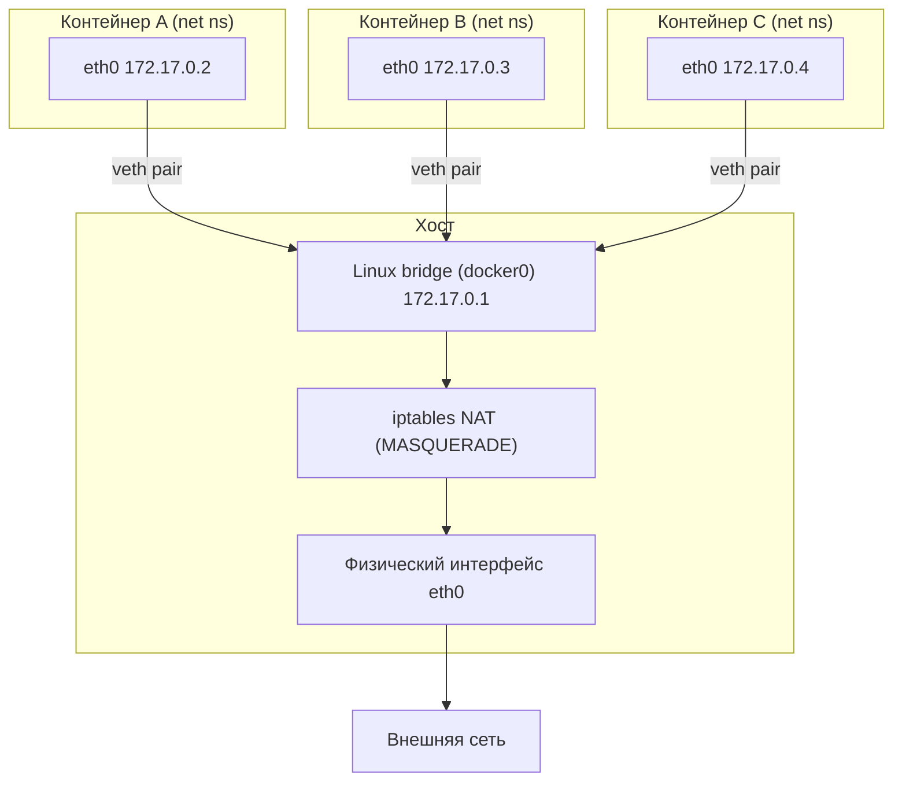
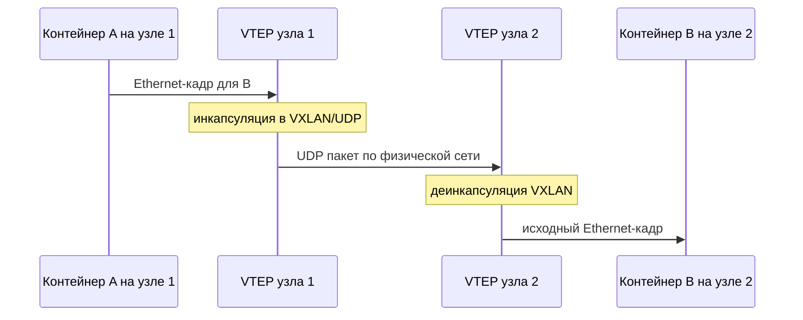

Сеть — то место, где «контейнер как изолированный процесс» превращается в «контейнер как сетевой узел». В предыдущих разделах мы видели, что контейнер — это обычный процесс хоста, помещённый в набор [namespaces](/containerization/namespaces/) и ограниченный [cgroups](/containerization/cgroups/). Сетевая изоляция — частный случай этой модели: процесс получает собственный **network namespace** и внутри него видит совсем другой мир, чем хост.

## Отправная точка: свой network namespace

Network namespace (`net`) — это полностью независимая копия сетевого стека ядра Linux. У контейнера в своём network namespace есть:

- собственный набор сетевых интерфейсов (минимум — свой `lo`, loopback, со своим состоянием);
- собственные таблицы маршрутизации (`ip route`);
- собственные правила `iptables`/`nftables` и conntrack;
- собственное пространство номеров портов: порт 80 в контейнере и порт 80 на хосте — это разные сущности.

Это объясняет ключевое свойство: два контейнера могут одновременно слушать «один и тот же» порт 8080, не мешая друг другу, потому что слушают они в разных namespaces. Сам по себе свежесозданный network namespace практически бесполезен — в нём есть только `lo`, и связи с внешним миром нет. Задача сетевой подсистемы — соединить этот изолированный стек с хостом, а через хост — с остальной сетью.

Создать пустой namespace вручную можно так:

```bash
# создаём именованный network namespace
sudo ip netns add demo

# внутри него виден только loopback, и тот в состоянии DOWN
sudo ip netns exec demo ip link show
# 1: lo: <LOOPBACK> mtu 65536 ... state DOWN
```

## veth pair: виртуальный «кабель»

Чтобы соединить два сетевых стека, ядро предоставляет **veth pair** (virtual Ethernet) — пару виртуальных интерфейсов, работающих как два конца одного кабеля: всё, что отправлено в один конец, выходит из другого. Один конец оставляют на хосте, второй переносят внутрь network namespace контейнера.

```bash
# создаём пару veth0 <--> veth1
sudo ip link add veth0 type veth peer name veth1

# один конец отправляем в namespace demo
sudo ip link set veth1 netns demo

# конец на хосте поднимаем и даём адрес
sudo ip addr add 10.10.0.1/24 dev veth0
sudo ip link set veth0 up

# второй конец настраиваем уже внутри namespace
sudo ip netns exec demo ip addr add 10.10.0.2/24 dev veth1
sudo ip netns exec demo ip link set veth1 up
sudo ip netns exec demo ip link set lo up

# проверяем связность хост <-> контейнер
sudo ip netns exec demo ping -c1 10.10.0.1
```

По сути именно это Docker делает за вас при запуске контейнера: создаёт veth pair, один конец кладёт в namespace контейнера (там он обычно виден как `eth0`), а второй подключает к мосту на хосте.

## Linux bridge и NAT

Если контейнеров много, соединять каждый отдельным кабелем с хостом неудобно. Нужен коммутатор — и его роль играет **Linux bridge**: программный L2-коммутатор внутри ядра. Хостовые концы veth-пар всех контейнеров «втыкаются» в один мост, и контейнеры начинают видеть друг друга на канальном уровне, как будто подключены к одному физическому свитчу.

У Docker этот мост по умолчанию называется `docker0`. Контейнеры получают адреса из его подсети (по умолчанию что-то вроде `172.17.0.0/16`), а сам `docker0` выступает их шлюзом по умолчанию.



Внутри подсети моста всё работает напрямую. Но адреса вроде `172.17.0.2` приватны и не маршрутизируются в интернете. Чтобы пакет от контейнера дошёл до внешнего сервера и вернулся, нужен **NAT** (Network Address Translation). Docker добавляет в таблицу `nat` правило `MASQUERADE`: исходящий пакет из подсети моста подменяет адрес источника на адрес хоста, а ответы маршрутизируются обратно через таблицу conntrack.

Путь исходящего пакета целиком:


:::note
Для работы NAT и проброса портов на хосте должна быть включена IP-переадресация: `net.ipv4.ip_forward=1`. Docker выставляет её сам при старте демона; при ручной настройке через `ip netns` это придётся сделать вручную.
:::

## Режимы сети Docker

Docker абстрагирует описанную механику в несколько сетевых драйверов (режимов). Выбираются они флагом `--network` при запуске.

| Режим | Что происходит | Когда применять |
|-------|----------------|-----------------|
| `bridge` | По умолчанию. Свой net namespace, veth до `docker0`, выход через NAT | Большинство одиночных контейнеров на одном хосте |
| `host` | Контейнер использует **сетевой стек хоста**, своего net namespace нет | Когда нужен максимум производительности или прослушивание сырых портов хоста |
| `none` | Создаётся пустой net namespace без интерфейсов (только `lo`) | Полная сетевая изоляция, ручная настройка |
| `container:<имя>` | Общий net namespace с другим контейнером | «Sidecar»-паттерн; так же устроены поды в Kubernetes |
| `overlay` | Виртуальная L2-сеть поверх нескольких хостов (VXLAN) | Кластеры Swarm / multi-host |
| `macvlan` / `ipvlan` | Контейнер получает собственный MAC/IP прямо в физической сети | Когда контейнер должен выглядеть как отдельное устройство в LAN |

Несколько важных следствий. В режиме `host` исчезает изоляция портов: если контейнер слушает 80, он занимает порт 80 хоста, и проброс `-p` не имеет смысла. Режим `container:` лежит в основе **пода** Kubernetes — все контейнеры пода делят один network namespace и общаются через `localhost` (подробнее в разделе про [оркестрацию](/containerization/orchestration/)). Драйвер `macvlan` минует мост и NAT: трафик идёт почти как у физической машины, но требует поддержки promiscuous-режима от сетевой карты и согласования с сетевым оборудованием.

## Проброс портов

В режиме `bridge` контейнер по умолчанию недоступен извне: его адрес приватный и за NAT. Чтобы открыть сервис наружу, используют **публикацию портов** — флаг `-p`:

```bash
# порт 8080 хоста -> порт 80 контейнера
docker run -d -p 8080:80 nginx
```

Технически это правило **DNAT** (Destination NAT) в `iptables`: пакет, пришедший на `<IP хоста>:8080`, переписывает адрес назначения на `172.17.0.X:80` и перенаправляется в контейнер. Ответный трафик проходит обратное преобразование. Дополнительно за пределами `iptables` работает вспомогательный процесс `docker-proxy`, который обеспечивает доступ через loopback и согласованное поведение в краевых случаях.

```bash
# посмотреть созданные правила DNAT
sudo iptables -t nat -L DOCKER -n
# DNAT tcp -- dpt:8080 to:172.17.0.2:80
```

:::caution
`-p 8080:80` слушает на всех интерфейсах хоста (`0.0.0.0`). Чтобы ограничить доступ только локальной машиной, явно указывайте адрес: `-p 127.0.0.1:8080:80`. Иначе сервис может оказаться открыт в сеть, даже если того не ожидали — это частая ошибка безопасности (см. [Безопасность контейнеров](/containerization/security/)).
:::

## DNS и обнаружение сервисов

IP-адреса контейнеров эфемерны: при пересоздании они меняются. Поэтому Docker предоставляет встроенный **DNS-резолвер** на адресе `127.0.0.11` внутри каждого контейнера. В **пользовательских** (созданных вручную) bridge-сетях работает автоматическое разрешение имён: контейнер доступен по своему имени или сетевому алиасу.

```bash
docker network create app-net
docker run -d --name db   --network app-net postgres
docker run -d --name web  --network app-net myapp
# внутри web можно обращаться к базе просто по имени: postgres://db:5432
```

:::tip
В сети по умолчанию (`bridge`/`docker0`) разрешение по имени контейнера НЕ работает — это исторический режим. Всегда создавайте пользовательскую сеть (`docker network create`) для связанных сервисов: получите DNS-имена, изоляцию от посторонних контейнеров и предсказуемую связность.
:::

## CNI: сетевой стандарт для Kubernetes

Docker реализует сеть собственными драйверами, но в мире оркестрации действует единый стандарт — **CNI (Container Network Interface)**. Это спецификация и набор плагинов: среда выполнения (kubelet через CRI) создаёт network namespace пода и вызывает CNI-плагин, передавая ему namespace и конфигурацию. Плагин обязан настроить интерфейсы, назначить IP (IPAM) и обеспечить маршрутизацию, после чего вернуть результат в JSON.

Распространённые реализации:

| Плагин | Модель работы | Особенности |
|--------|---------------|-------------|
| `bridge` | Эталонный плагин: мост + veth, как у Docker | Базовый, для одного узла; основа для обучения |
| Flannel | Overlay поверх узлов, часто VXLAN | Простой, минимум настроек, без сетевых политик «из коробки» |
| Calico | Маршрутизация L3 (BGP) либо overlay; eBPF-режим | NetworkPolicy, высокая производительность, масштаб |
| Cilium | Сеть и политики на основе eBPF | L3–L7-политики, наблюдаемость, замена kube-proxy |

В кластере Kubernetes каждому поду выделяется один IP (модель «IP-per-pod»), и поды должны связываться между узлами без NAT — это требование сетевой модели Kubernetes. Именно CNI-плагин делает это требование выполнимым, настраивая маршруты или туннели между узлами. Как это вписывается в общую архитектуру кластера — в разделе про [оркестрацию](/containerization/orchestration/).

## Overlay-сети и VXLAN

Когда контейнеры живут на разных физических хостах, плоская L2-связность между ними недостижима напрямую: их разделяет реальная сеть дата-центра. Решение — **overlay-сеть**: виртуальная сеть, наложенная поверх существующей физической (underlay) с помощью туннелирования.

Доминирующая технология здесь — **VXLAN** (Virtual eXtensible LAN). Кадр Ethernet от контейнера инкапсулируется в UDP-пакет (порт 4789) и отправляется на узел, где живёт получатель; там он деинкапсулируется и доставляется в нужный namespace. Контейнеры при этом «думают», что находятся в одном сегменте, хотя физически разнесены по разным машинам и подсетям.



За инкапсуляцию отвечает VTEP (VXLAN Tunnel Endpoint) на каждом узле. Плата за гибкость — накладные расходы: дополнительный заголовок (около 50 байт) уменьшает полезный MTU и слегка нагружает CPU. Поэтому Calico в режиме чистой L3-маршрутизации (BGP) может быть быстрее overlay там, где underlay-сеть позволяет маршрутизировать адреса подов напрямую.

## Практика: основные команды

```bash
# список сетей и их драйверов
docker network ls

# создать пользовательскую bridge-сеть с заданной подсетью
docker network create --driver bridge --subnet 10.5.0.0/24 mynet

# подключить уже запущенный контейнер к сети
docker network connect mynet web

# детально посмотреть сеть: подсеть, шлюз, подключённые контейнеры
docker network inspect mynet

# увидеть «сырой» уровень: namespaces, veth и мосты
ip netns list
ip link show type bridge
ip -d link show type veth
```

## Итоги

- Каждый контейнер по умолчанию получает собственный network namespace со своим стеком: интерфейсы, маршруты, `iptables`, пространство портов.
- **veth pair** соединяет namespace контейнера с хостом, а **Linux bridge** (`docker0`) объединяет контейнеры в общий L2-сегмент; выход во внешнюю сеть идёт через **NAT (MASQUERADE)**.
- Режимы `bridge`, `host`, `none`, `container`, `overlay`, `macvlan` дают разные компромиссы между изоляцией, производительностью и связностью.
- `-p` настраивает **DNAT** для входящих соединений; встроенный DNS обеспечивает обнаружение сервисов по имени в пользовательских сетях.
- **CNI** — стандарт сетевых плагинов Kubernetes (bridge, Flannel, Calico, Cilium); **overlay** на **VXLAN** обеспечивает связность контейнеров между узлами.
