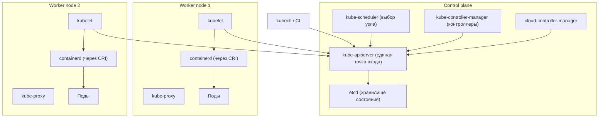
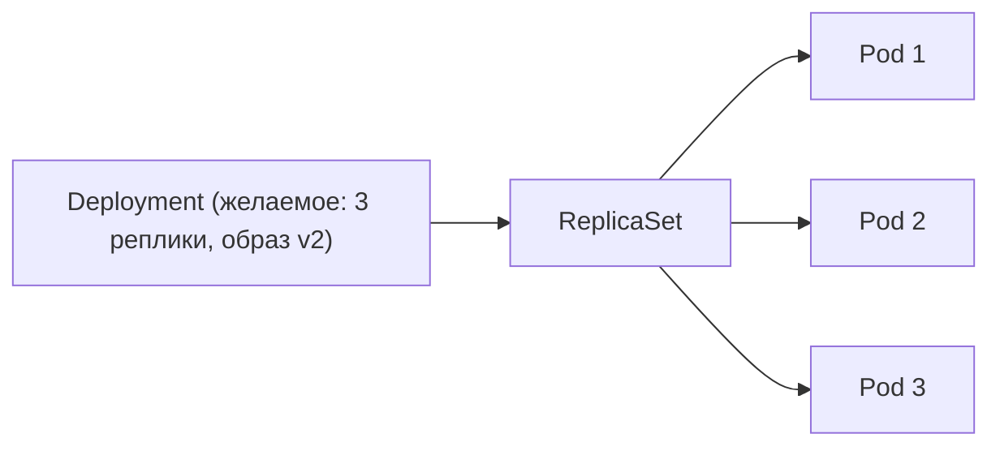
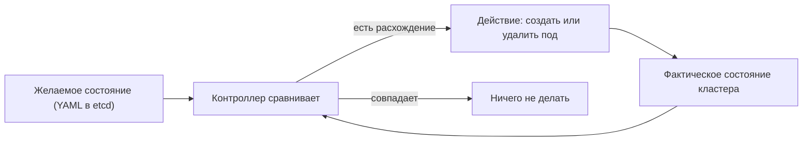

В предыдущих разделах мы разобрали, как устроен один контейнер: изоляция через [namespaces](/containerization/namespaces/), лимиты через [cgroups](/containerization/cgroups/), [образы и слои](/containerization/images/), а также [стандарты OCI и среды выполнения](/containerization/runtimes/). Запустить один контейнер командой `docker run` несложно. Но что происходит, когда контейнеров становится сотни, они живут на десятках узлов, должны переживать падение машин, обновляться без простоя и находить друг друга по имени? Именно здесь ручное управление перестаёт работать, и на сцену выходит оркестрация.

## Зачем нужна оркестрация

Представьте production-окружение: 200 экземпляров микросервисов распределены по 15 серверам. Возникают задачи, которые `docker run` в принципе не решает:

- **Планирование размещения (scheduling).** На какой именно узел поставить новый контейнер, чтобы хватило CPU и памяти, и нагрузка распределялась равномерно?
- **Самовосстановление (self-healing).** Если процесс упал или целый узел вышел из строя, кто перезапустит контейнеры в другом месте?
- **Горизонтальное масштабирование.** Как за секунды поднять с 3 до 30 реплик под нагрузкой и так же быстро свернуть обратно?
- **Обновления без простоя.** Как выкатить новую версию образа постепенно, проверяя здоровье новых экземпляров, и автоматически откатиться при ошибке?
- **Обнаружение сервисов и балансировка.** Контейнеры эфемерны, их IP постоянно меняются. Как клиентам обращаться к сервису по стабильному адресу?
- **Управление конфигами и секретами.** Где централизованно хранить настройки и пароли, не зашивая их в образ?
- **Оркестрация хранилища.** Как подключить постоянный том к контейнеру, который может переехать на другой узел?

Оркестратор — это система, которая берёт на себя весь этот список. Вы декларируете *что* должно работать, а оркестратор сам решает *как* и *где* это запустить и поддерживать. Де-факто стандартом отрасли стал **Kubernetes** (часто сокращают до **k8s** — восемь букв между «k» и «s»), изначально разработанный в Google и переданный в CNCF.

## Архитектура Kubernetes

Кластер Kubernetes делится на две роли: **control plane** (управляющий слой, «мозг» кластера) и **worker nodes** (рабочие узлы, где реально крутятся контейнеры). На небольших кластерах эти роли могут совмещаться на одной машине, в проде — разнесены и продублированы для отказоустойчивости.



### Компоненты control plane

- **kube-apiserver** — единственная точка входа в кластер. Любое действие (от `kubectl`, контроллеров, kubelet) проходит через REST API сервера. Он валидирует запросы, проверяет права и записывает состояние в etcd. Все остальные компоненты общаются *только* через apiserver, а не напрямую друг с другом.
- **etcd** — распределённое key-value хранилище, единственный источник истины о состоянии всего кластера. Здесь лежат описания всех объектов: какие поды должны быть запущены, какие сервисы существуют, какие секреты заведены. Потеря etcd без резервной копии означает потерю кластера.
- **kube-scheduler** — отслеживает поды, которым ещё не назначен узел, и подбирает подходящий узел с учётом запрошенных ресурсов, ограничений (affinity, taints/tolerations), доступности.
- **kube-controller-manager** — процесс, в котором работает множество контроллеров (ReplicaSet, Deployment, Node, Job и др.). Каждый контроллер следит за своим типом объектов и приводит фактическое состояние к желаемому.
- **cloud-controller-manager** — интегрирует кластер с API облачного провайдера: создаёт балансировщики нагрузки, тома, управляет жизненным циклом узлов. В on-prem кластере может отсутствовать.

### Компоненты рабочих узлов

- **kubelet** — агент на каждом узле. Получает от apiserver описания подов, которые должны здесь работать, и запускает контейнеры через **CRI** (Container Runtime Interface), а также следит за их здоровьем (liveness/readiness probes).
- **kube-proxy** — программирует сетевые правила узла (через iptables, IPVS или eBPF), чтобы трафик на виртуальный IP сервиса попадал на один из подов-бэкендов.
- **Среда выполнения контейнеров** — обычно **containerd**, который kubelet вызывает по CRI. О связке CRI → containerd → runc подробно см. в разделе [Стандарты OCI и среды выполнения](/containerization/runtimes/).

## Основные объекты Kubernetes

Всё в Kubernetes — объекты API, описываемые декларативно. Разберём ключевые.

### Pod

**Pod** — наименьшая единица развёртывания. Это один или несколько контейнеров, которые делят общий сетевой namespace (один IP-адрес и порты, видят друг друга по `localhost`) и могут совместно использовать тома. Контейнеры в поде всегда планируются на один узел и живут/умирают вместе. Типичный паттерн — основной контейнер плюс sidecar (например, прокси или сборщик логов). Поды эфемерны: при падении они не «лечатся», а пересоздаются контроллером с новым именем и IP.

### ReplicaSet и Deployment

**ReplicaSet** поддерживает заданное число одинаковых реплик пода: упал один — создаётся новый. Напрямую с ReplicaSet работают редко.

**Deployment** — слой поверх ReplicaSet, добавляющий декларативные обновления и откаты. Меняете образ в манифесте — Deployment создаёт новый ReplicaSet и выполняет **rolling update**: постепенно поднимает новые поды и гасит старые, не допуская простоя. Если что-то пошло не так, командой можно откатиться на предыдущую версию.



### Service

Поды приходят и уходят, их IP меняются — обращаться к ним напрямую нельзя. **Service** даёт стабильную точку доступа и балансировку поверх набора подов, выбираемых по меткам (label selector). Типы:

| Тип | Назначение | Доступность |
| --- | --- | --- |
| **ClusterIP** | Внутренний виртуальный IP (по умолчанию) | Только внутри кластера |
| **NodePort** | Открывает порт на каждом узле | Извне по `IP_узла:порт` |
| **LoadBalancer** | Внешний балансировщик облака | Извне по публичному IP |

Внутри кластера сервисы доступны по DNS-имени (например, `my-service.default.svc.cluster.local`), что и реализует service discovery.

### Прочие объекты

- **Namespace** — логическое разделение кластера на изолированные пространства имён (не путать с Linux namespaces!) для разграничения команд и окружений.
- **ConfigMap** и **Secret** — хранят конфигурацию и чувствительные данные (пароли, токены) отдельно от образа. Подключаются в под как переменные окружения или файлы. Значения Secret по умолчанию лишь base64-кодированы, не зашифрованы — это разграничение доступа, а не криптозащита.
- **Ingress** — правила маршрутизации HTTP/HTTPS-трафика снаружи к сервисам по хосту и пути; обслуживается отдельным Ingress-контроллером (nginx, Traefik и т. п.).
- **StatefulSet** — для приложений с состоянием (БД, очереди): даёт стабильные сетевые идентификаторы и персональные тома для каждого пода, упорядоченные запуск и обновление.
- **DaemonSet** — гарантирует, что копия пода работает на *каждом* (или подходящем) узле; типично для агентов логирования, мониторинга, сетевых плагинов.

## Декларативная модель и reconciliation loop

Центральная идея Kubernetes: вы не отдаёте императивные команды «запусти», «останови», «перенеси». Вы описываете в YAML **желаемое состояние** (desired state) — например, «должно быть 3 реплики образа `nginx:1.27`». Дальше работают контроллеры, каждый из которых крутит **петлю согласования (reconciliation loop)**: непрерывно сравнивает желаемое состояние (из etcd) с фактическим (что реально запущено) и предпринимает действия, чтобы устранить расхождение.



:::tip
Поэтому если вручную удалить под, который входит в Deployment, контроллер тут же создаст замену — фактическое состояние возвращается к желаемому. Чтобы убрать под навсегда, нужно изменить желаемое состояние (например, уменьшить число реплик или удалить сам Deployment).
:::

Эта модель и обеспечивает самовосстановление, масштабирование и отказоустойчивость «бесплатно»: вам достаточно правильно описать цель.

## Сеть и хранение в кластере

Kubernetes не реализует сеть и хранилище сам, а делегирует это плагинам через стандартизованные интерфейсы:

- **CNI** (Container Network Interface) отвечает за сеть подов: каждому поду выдаётся уникальный IP, поды на разных узлах общаются напрямую без NAT. Конкретную модель реализуют плагины (Calico, Cilium, Flannel). Подробно о сетевых механизмах — в разделе [Сеть контейнеров](/containerization/networking/).
- **CSI** (Container Storage Interface) с объектами **PersistentVolume** (PV) и **PersistentVolumeClaim** (PVC) подключает постоянное хранилище: под «запрашивает» том через PVC, а драйвер CSI монтирует реальный диск, который переживает пересоздание пода. См. раздел [Хранение данных](/containerization/storage/).

## Альтернативы

Kubernetes — стандарт, но не единственный вариант:

| Оркестратор | Сильные стороны | Когда уместен |
| --- | --- | --- |
| **Kubernetes** | Богатая экосистема, де-факто стандарт | Сложные распределённые системы |
| **Docker Swarm** | Простота, нативная интеграция с Docker | Небольшие кластеры, быстрый старт |
| **HashiCorp Nomad** | Лёгкость, оркеструет не только контейнеры | Смешанные нагрузки, минимализм |

## Практика: минимальный пример

Манифест Deployment, поддерживающего 3 реплики nginx:

```yaml
apiVersion: apps/v1
kind: Deployment
metadata:
  name: web
spec:
  replicas: 3
  selector:
    matchLabels:
      app: web
  template:
    metadata:
      labels:
        app: web
    spec:
      containers:
        - name: nginx
          image: nginx:1.27
          ports:
            - containerPort: 80
```

И Service типа ClusterIP, выбирающий эти поды по метке `app: web`:

```yaml
apiVersion: v1
kind: Service
metadata:
  name: web
spec:
  selector:
    app: web
  ports:
    - port: 80
      targetPort: 80
```

Основные команды `kubectl`:

```bash
# Применить манифесты (декларативно создать или обновить объекты)
kubectl apply -f deployment.yaml -f service.yaml

# Посмотреть состояние подов, deployment'ов и сервисов
kubectl get pods
kubectl get deployments
kubectl get services

# Детальная информация и события по объекту (полезно при диагностике)
kubectl describe deployment web
kubectl describe pod web-7c9f8b6d4-abcde
```

`kubectl apply` отправляет желаемое состояние в apiserver, тот сохраняет его в etcd, а контроллеры приводят кластер в соответствие. Это и есть декларативный цикл в действии.

:::note
Это вводный обзор: мы намеренно опустили helm-чарты, операторы, RBAC, HPA, network policies, тонкости планировщика и многое другое. Полноценный курс по Kubernetes — в [планах развития](/roadmap/). Здесь важно усвоить главное: оркестратор реализует декларативную модель через петли согласования, а Pod, Deployment и Service — три объекта, с которых начинается работа практически с любым приложением.
:::

## Итог

- Оркестрация решает то, что не под силу ручному `docker run`: scheduling, самовосстановление, масштабирование, обновления без простоя, service discovery и управление конфигами.
- Kubernetes делится на control plane (apiserver, etcd, scheduler, controller-manager) и worker nodes (kubelet, kube-proxy, containerd через CRI).
- Ключевые объекты: **Pod** (минимальная единица), **Deployment** (через ReplicaSet — обновления и откаты), **Service** (стабильный доступ и балансировка).
- В основе всего — декларативная модель и reconciliation loop: вы описываете желаемое состояние, контроллеры непрерывно его обеспечивают.
- Сеть и хранилище подключаются через стандарты CNI и CSI, что роднит Kubernetes с философией OCI: интерфейсы вместо жёстко зашитых реализаций.

## Задания

### Задание 1. Кто за что отвечает в control plane

Сопоставьте каждый компонент с его задачей и ответьте: почему в архитектуре Kubernetes все компоненты общаются *только* через kube-apiserver, а не напрямую друг с другом? Что станет с кластером при безвозвратной потере etcd?

Компоненты: `kube-apiserver`, `etcd`, `kube-scheduler`, `kube-controller-manager`, `kubelet`, `kube-proxy`.

<details>
<summary>Решение</summary>

Сопоставление:

| Компонент | Задача |
| --- | --- |
| `kube-apiserver` | Единственная точка входа: валидирует запросы, проверяет права, читает/пишет состояние в etcd |
| `etcd` | Распределённое key-value хранилище — единственный источник истины о состоянии кластера |
| `kube-scheduler` | Выбирает узел для подов, которым ещё не назначен узел, с учётом ресурсов и ограничений |
| `kube-controller-manager` | Запускает контроллеры (ReplicaSet, Deployment, Node, Job…), приводящие фактическое состояние к желаемому |
| `kubelet` | Агент на узле: запускает контейнеры через CRI и следит за их здоровьем (probes) |
| `kube-proxy` | Программирует сетевые правила узла (iptables/IPVS/eBPF) для трафика на виртуальный IP сервиса |

Почему всё идёт через apiserver:

- Это единая точка валидации, аутентификации и авторизации — права проверяются в одном месте, а не в каждом компоненте.
- apiserver — единственный, кто пишет в etcd; остальные не трогают хранилище напрямую, что исключает гонки и рассогласование.
- Развязка компонентов: они не знают сетевых адресов друг друга, общаются через общий API. Это упрощает масштабирование и замену реализаций.

Потеря etcd без резервной копии означает потерю кластера: исчезает описание всех объектов (поды, сервисы, секреты, желаемое состояние). Именно поэтому etcd регулярно резервируют.

</details>

### Задание 2. Что произойдёт, если удалить под вручную

В кластере работает Deployment `web` с `replicas: 3`. Вы выполнили:

```bash
kubectl delete pod web-7c9f8b6d4-abcde
```

Что произойдёт сразу после этого и почему? Сколько подов останется в итоге? А если нужно действительно убрать один экземпляр навсегда — что сделать вместо `delete pod`?

<details>
<summary>Решение</summary>

Сразу после удаления контроллер пересоздаст под — в итоге снова будет 3 пода.

Механика — reconciliation loop. Желаемое состояние в etcd: «3 реплики с меткой `app: web`». После удаления фактическое состояние = 2 пода, желаемое = 3. Контроллер ReplicaSet (управляемый Deployment) обнаруживает расхождение и создаёт новый под — с **новым именем и новым IP**, потому что поды эфемерны и не «лечатся», а пересоздаются.

`kubectl delete pod` меняет только фактическое состояние, но не желаемое, поэтому эффект моментально откатывается. Чтобы убрать экземпляр навсегда, нужно изменить именно желаемое состояние:

```bash
# Уменьшить число реплик
kubectl scale deployment web --replicas=2
```

Либо отредактировать `replicas` в манифесте и применить `kubectl apply -f deployment.yaml`. Чтобы убрать приложение целиком — удалить сам Deployment (`kubectl delete deployment web`).

</details>

### Задание 3. Связать Deployment и Service по меткам

Дан Deployment, у которого поды получают метку `app: api`, и порт контейнера 8080. Напишите манифест Service типа ClusterIP, который балансирует трафик на эти поды на порт 80, проксируя на 8080. Объясните: почему обращаться к подам напрямую по IP нельзя и по какому имени Service будет доступен изнутри кластера? Когда стоит выбрать NodePort или LoadBalancer вместо ClusterIP?

<details>
<summary>Решение</summary>

Манифест Service:

```yaml
apiVersion: v1
kind: Service
metadata:
  name: api
spec:
  selector:
    app: api
  ports:
    - port: 80
      targetPort: 8080
```

Ключевой момент — `selector` должен совпадать с метками подов (`app: api`), иначе Service не найдёт бэкенды. `port` — порт самого сервиса, `targetPort` — порт в контейнере.

Почему нельзя по IP подов: поды эфемерны, при пересоздании (падение, обновление, масштабирование) получают новые IP. Service даёт стабильный виртуальный IP (ClusterIP) и балансировку поверх набора подов, выбираемых по меткам — это и есть service discovery.

Имя внутри кластера (DNS): `api.<namespace>.svc.cluster.local`, например `api.default.svc.cluster.local`. Внутри того же namespace достаточно короткого имени `api`.

Выбор типа:

- **ClusterIP** — по умолчанию, доступ только внутри кластера (общение между сервисами).
- **NodePort** — открывает порт на каждом узле, доступ извне по `IP_узла:порт`. Подходит для простого внешнего доступа без облачного балансировщика.
- **LoadBalancer** — поднимает внешний балансировщик облачного провайдера с публичным IP. Для production-доступа снаружи в облаке. (Для HTTP/HTTPS-маршрутизации по хосту и пути обычно используют Ingress поверх сервисов.)

</details>

### Задание 4. Rolling update: что под капотом и что при ошибке

Вы поменяли в манифесте Deployment образ с `nginx:1.27` на `nginx:1.28` и выполнили `kubectl apply`. Опишите, что произойдёт на уровне ReplicaSet'ов и подов. Почему при этом нет простоя? Что произойдёт, если новый образ окажется битым и поды не будут проходить readiness-проверки, и как откатиться?

<details>
<summary>Решение</summary>

Что происходит при `apply`:

1. `kubectl apply` отправляет новое желаемое состояние в apiserver, тот пишет его в etcd.
2. Контроллер Deployment видит, что образ изменился, и создаёт **новый ReplicaSet** (для `nginx:1.28`), оставляя старый (`nginx:1.27`).
3. Выполняется **rolling update**: новый ReplicaSet постепенно наращивает реплики, старый — постепенно гасит. В каждый момент часть подов уже на новой версии, часть ещё на старой.

Почему нет простоя: переключение постепенное, и поды считаются готовыми принимать трафик только после успешных readiness-проб. Service направляет трафик лишь на готовые поды, поэтому суммарная ёмкость не падает до нуля.

Если образ битый: новые поды не пройдут readiness-проверку, не станут «готовыми», и rolling update **остановится**, не доведя замену до конца. Старые рабочие поды остаются, трафик продолжает идти на них — катастрофы не происходит, выкатка просто «зависает» в промежуточном состоянии.

Откат на предыдущую версию:

```bash
# Посмотреть статус выкатки
kubectl rollout status deployment web

# Откатиться на предыдущую ревизию
kubectl rollout undo deployment web
```

Это снова про декларативную модель: Deployment хранит историю ReplicaSet'ов, и откат — это возврат к предыдущему желаемому состоянию, которое контроллеры приведут в действие через тот же reconciliation loop.

</details>
