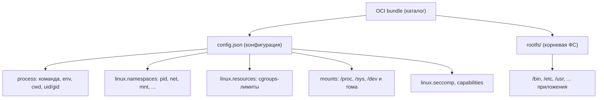
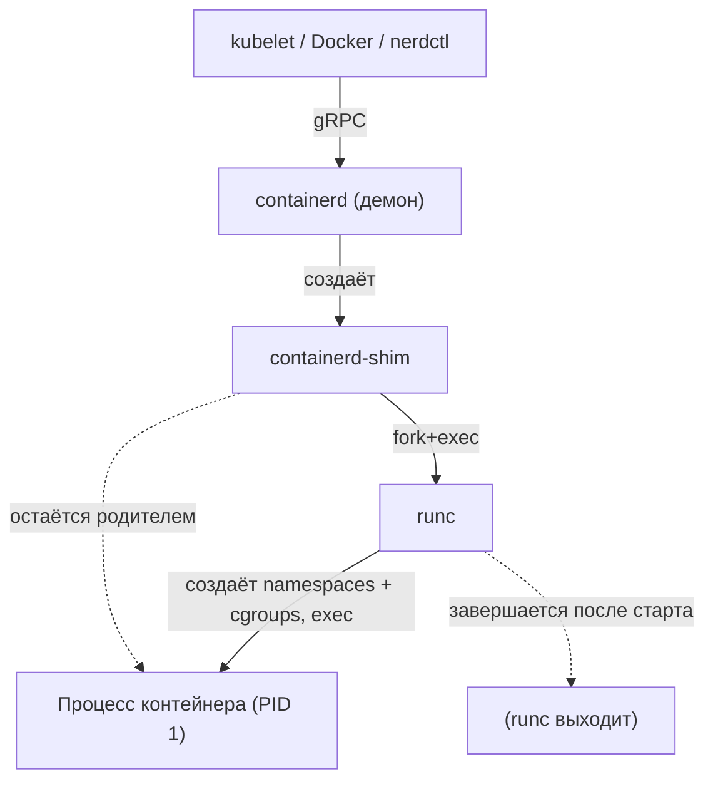
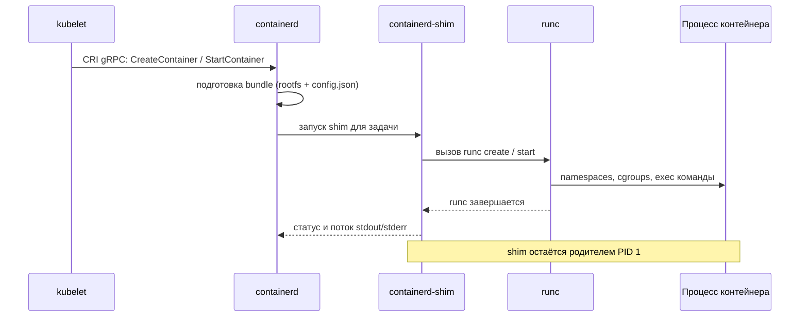

К 2015 году вокруг контейнеров сложилась типичная для молодых технологий проблема — фрагментация. Docker задавал де-факто стандарт, но его формат образа и способ запуска были привязаны к одной реализации. Параллельно появлялись альтернативы (например, CoreOS с форматом appc и рантаймом rkt), и индустрия рисковала расколоться на несовместимые экосистемы: образ, собранный одним инструментом, мог не запуститься в другом, а оркестраторам пришлось бы поддерживать зоопарк форматов. Чтобы этого избежать, в июне 2015 года под эгидой Linux Foundation была учреждена **Open Container Initiative (OCI)** — открытая структура управления для выработки отраслевых стандартов на форматы и среды выполнения контейнеров. Docker передал в OCI свой низкоуровневый рантайм **runc**, который стал эталонной (reference) реализацией.

Ключевая идея OCI — разделить «что такое контейнер» (спецификации) и «кто его запускает» (рантаймы), а сами рантаймы расслоить на уровни. Благодаря этому образ, собранный в одном инструменте, корректно запускается в любом OCI-совместимом рантайме, а Kubernetes может менять рантайм под собой, не переписывая остальную систему.

## Три спецификации OCI

OCI стандартизирует три независимых, но дополняющих друг друга артефакта.

| Спецификация | Что описывает | Где применяется |
|---|---|---|
| **image-spec** | Формат образа: манифест, слои файловой системы, конфигурация (команда, аргументы, переменные окружения), дайджесты | Сборка и хранение образов — подробнее в [/containerization/images/](/containerization/images/) |
| **runtime-spec** | Формат «бандла» (filesystem bundle) и правила его запуска: жизненный цикл контейнера, операции create/start/kill/delete | Низкоуровневый запуск контейнера |
| **distribution-spec** | HTTP API реестра (registry) для push/pull контента по дайджестам и тегам | Передача образов между реестром и хостом |

**image-spec** описывает, как устроен образ на диске и в реестре: манифест перечисляет слои и ссылается на объект конфигурации, слои представлены как tar-архивы с разностью файловой системы, а всё содержимое адресуется по криптографическому дайджесту (content-addressable). Это та самая модель слоёв, которая разбирается в разделе [/containerization/images/](/containerization/images/).

**runtime-spec** определяет, что рантайм получает на вход не образ, а уже распакованный **OCI bundle** — и описывает, как из него запустить процесс. **distribution-spec** (v1.0 — 2021 год) формализует API реестра, который раньше существовал как протокол Docker Registry HTTP API V2.

### Структура OCI bundle

Бандл — это каталог на локальной файловой системе, из которого low-level рантайм создаёт контейнер. Он состоит ровно из двух частей: обязательного файла `config.json` в корне каталога и корневой файловой системы контейнера (по умолчанию каталог `rootfs`, путь задаётся полем `root.path`).



`config.json` — это декларативное описание контейнера: какой процесс запустить, в каких namespaces его изолировать, какие cgroups-лимиты наложить, что и куда смонтировать, какой seccomp-профиль и набор capabilities применить (про namespaces и cgroups см. [/containerization/namespaces/](/containerization/namespaces/) и [/containerization/cgroups/](/containerization/cgroups/), про seccomp и capabilities — [/containerization/security/](/containerization/security/)). High-level рантайм распаковывает слои образа в `rootfs`, генерирует `config.json` и передаёт готовый бандл низкоуровневому рантайму.

## Уровни рантаймов: low-level и high-level

OCI-совместимые среды выполнения делятся на два уровня с разной зоной ответственности.

- **Low-level (OCI runtime)** — реализует именно runtime-spec: берёт готовый бандл и превращает его в живой процесс, создавая namespaces, настраивая cgroups, применяя seccomp и capabilities, после чего запускает целевой процесс как PID 1 контейнера. Он ничего не знает об образах, реестрах и сети.
- **High-level (container runtime)** — управляет образами (pull/push, хранение слоёв через OverlayFS), сетью, томами и жизненным циклом множества контейнеров, но сам контейнер не запускает: делегирует это low-level рантайму через стандартный интерфейс.

### Low-level рантаймы

- **runc** — эталонная реализация runtime-spec на Go. Напрямую вызывает системные вызовы Linux (`clone`/`unshare` для namespaces, запись в файловую систему cgroups) и запускает процесс. Большинство инсталляций используют именно его.
- **crun** — альтернатива на C от сообщества (Red Hat). Меньше по размеру и быстрее запускается за счёт отсутствия рантайма Go и более лёгкого процесса; полностью совместима с OCI runtime-spec.
- **Рантаймы усиленной изоляции** — **kata-runtime** (запускает каждый контейнер в облегчённой виртуальной машине с отдельным ядром) и **gVisor/runsc** от Google (перехватывает системные вызовы в пользовательском пространстве через собственное ядро-прокси). Они подключаются туда же, где ожидается OCI runtime, но дают границу безопасности уровня гипервизора. Подробнее о модели угроз и компромиссах — в [/containerization/security/](/containerization/security/); о грани между контейнерами и ВМ — в [/virtualization/containers-vs-vm/](/virtualization/containers-vs-vm/).

:::note
Low-level рантаймы взаимозаменяемы, потому что все они принимают один и тот же формат бандла. Сменить runc на crun или runsc обычно можно правкой одной строки в конфигурации high-level рантайма — без изменений в образах и приложениях.
:::

### High-level рантаймы

- **containerd** — демон, изначально выделенный из Docker и переданный в CNCF. Управляет полным жизненным циклом: образы, снапшоты файловой системы, передача в реестр, сеть (через плагины), задачи (tasks). Сам процесс контейнера запускает через runc.
- **CRI-O** — лёгкий рантайм от сообщества Kubernetes, специально заточенный под CRI. Делает только то, что нужно kubelet, и по умолчанию работает с crun или runc.

## Роль shim

Между high-level рантаймом и low-level рантаймом стоит **shim** (например, `containerd-shim-runc-v2`). Это критически важный посредник. После запуска контейнера shim становится его родительским процессом, а сам runc завершается — он нужен только на момент создания.

Зачем это:

- **Развязка от демона.** Контейнер не является дочерним процессом containerd. Поэтому containerd можно перезапустить или обновить, не убивая работающие контейнеры — их родителем остаётся shim, переживающий рестарт демона.
- **Сбор кода завершения и потоков ввода-вывода.** Shim держит открытыми stdout/stderr контейнера и его exit code, передавая их демону, когда тот снова доступен.
- **Развязка от управляющего процесса.** Один shim обслуживает один контейнер, изолируя сбои.



## CRI: интерфейс Kubernetes к рантайму

**Container Runtime Interface (CRI)** — это gRPC-интерфейс, через который **kubelet** (агент Kubernetes на узле) общается с рантаймом. kubelet выступает gRPC-клиентом и не зависит от конкретной реализации: эндпоинт рантайма задаётся флагом `--container-runtime-endpoint`. CRI определяет два сервиса — RuntimeService (создание pod sandbox, контейнеров, операции жизненного цикла) и ImageService (управление образами). Это и есть слой, который позволил Kubernetes убрать прямую зависимость от Docker: достаточно, чтобы рантайм реализовывал CRI.

CRI реализуют **containerd** (через встроенный CRI-плагин) и **CRI-O**. О том, как kubelet и узлы складываются в кластер, — в разделе [/containerization/orchestration/](/containerization/orchestration/).

:::tip
Начиная с Kubernetes 1.24 встроенная поддержка Docker через прослойку dockershim удалена. Современные кластеры используют containerd или CRI-O напрямую — это историческое следствие появления CRI.
:::

### Полная цепочка запуска в Kubernetes

Когда планировщик назначает под на узел, запрос проходит сверху вниз через все уровни:



Цепочка: **kubelet → CRI → containerd → containerd-shim → runc → процесс контейнера**. Каждый уровень добавляет ровно одну ответственность, и любой из них (рантайм, shim, low-level бинарь) можно заменить совместимым по стандарту.

## Инструменты для практики

Каждый уровень доступен напрямую через свой CLI — это полезно для отладки и понимания.

| Инструмент | Уровень | Назначение |
|---|---|---|
| `runc spec` / `runc run` | low-level | Сгенерировать заготовку `config.json` и запустить бандл вручную |
| `ctr` | containerd | Отладочный CLI containerd (образы, контейнеры, задачи) |
| `crictl` | CRI | Отладка через CRI-эндпоинт — «как видит рантайм kubelet» |

Минимальный эксперимент с эталонным рантаймом показывает, что контейнер — это всего лишь бандл и процесс:

```bash
# Подготовить rootfs из образа (см. /containerization/images/) и каталог бандла
mkdir -p mycontainer/rootfs
# Экспорт ФС образа в rootfs опускаем для краткости

cd mycontainer
runc spec                 # создаёт шаблонный config.json
runc run mycontainerid    # запускает контейнер из бандла
```

`runc spec` создаёт готовый `config.json` с разумными значениями по умолчанию (namespaces, базовые mounts, seccomp), а `runc run` исполняет бандл напрямую — без containerd, Docker и Kubernetes. Именно эту работу под капотом выполняет вся остальная цепочка. О том, как высокоуровневые инструменты прячут эти детали за удобным интерфейсом, — в разделе [/containerization/docker/](/containerization/docker/).

:::caution
`ctr` и `crictl` — инструменты отладки, а не повседневной эксплуатации. `ctr` работает поверх containerd напрямую и не видит метаданные Kubernetes; `crictl` смотрит через CRI и показывает поды и контейнеры так, как их понимает kubelet. Для прикладных задач используйте `kubectl` или `nerdctl`.
:::
