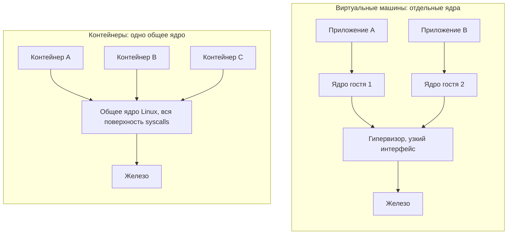
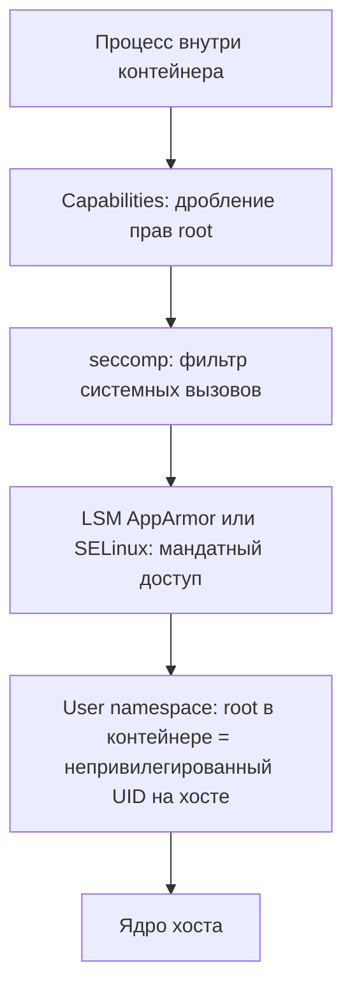
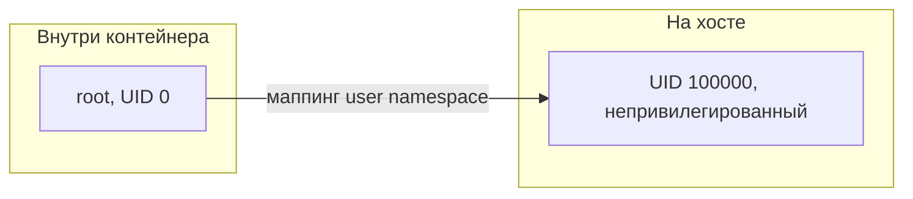

Из всех разделов курса этот — самый практический и одновременно самый отрезвляющий. Контейнеры дают удобство и плотность упаковки, но за это приходится платить более слабой границей изоляции, чем у виртуальных машин. Понимание, где именно проходит эта граница и какими слоями защиты её можно укрепить, отличает рабочую конфигурацию от той, которую взломают на следующий день после деплоя.

## Тезис: общее ядро — это общая поверхность атаки

Виртуальная машина виртуализирует железо: внутри неё работает собственное полноценное ядро, а граница изоляции — это тонкий, тщательно отлаженный интерфейс гипервизора (несколько десятков выходов в гипервизор, VM exits). Контейнеры устроены иначе: все контейнеры на хосте **разделяют одно и то же ядро Linux** (подробнее о различии — в [/virtualization/containers-vs-vm/](/virtualization/containers-vs-vm/)). Контейнер — это просто процесс, которому ядро через [namespaces](/containerization/namespaces/) и [cgroups](/containerization/cgroups/) показало урезанную картину мира.

Отсюда главное следствие для безопасности: **поверхностью атаки становится весь интерфейс ядра** — около 350 системных вызовов плюс псевдофайловые системы (`/proc`, `/sys`), ioctl, netlink и прочее. Если процесс внутри контейнера найдёт уязвимость в любом из этих путей, он атакует то же ядро, что обслуживает хост и все остальные контейнеры. Успешная эксплуатация означает побег из контейнера (container escape) и компрометацию всей машины.



У ВМ компрометация гостевого ядра запирается границей гипервизора. У контейнеров такой границы нет — её приходится строить программно, слой за слоем, поверх единого ядра. Эти слои мы и разберём.

## Слои защиты ядра

Ни один из механизмов ниже не является достаточным сам по себе. Безопасность контейнера — это **defense in depth**: несколько независимых барьеров, каждый из которых сужает то, что злоумышленник может сделать, пробив предыдущий.



### Linux capabilities — дробление всемогущего root

Исторически в Linux привилегии были бинарными: либо ты `root` (UID 0) и можешь всё, либо обычный пользователь. **Capabilities** разбивают это «всё» примерно на 40 независимых привилегий, которые можно выдавать и отбирать по отдельности. Примеры:

| Capability | Что разрешает |
| --- | --- |
| `CAP_NET_BIND_SERVICE` | Слушать порты ниже 1024 |
| `CAP_NET_ADMIN` | Управлять сетевыми интерфейсами, iptables |
| `CAP_SYS_ADMIN` | «Швейцарский нож»: монтирование, namespaces и десятки операций — почти равно root |
| `CAP_SYS_MODULE` | Загружать модули ядра (прямой путь к побегу) |
| `CAP_DAC_OVERRIDE` | Игнорировать права доступа к файлам |
| `CAP_CHOWN` | Менять владельца файлов |

Docker по умолчанию **сбрасывает большинство опасных capabilities**, оставляя безопасный минимум (около 14 — для смены UID, биндинга, chown внутри контейнера и т. п.). Но даже этот набор избыточен для типичного приложения. Хорошая практика — сбросить всё и добавить только нужное:

```bash
# Сбросить все capabilities и вернуть лишь право слушать привилегированный порт
docker run --cap-drop=ALL --cap-add=NET_BIND_SERVICE nginx
```

:::caution[CAP_SYS_ADMIN — красный флаг]
Эта capability настолько широка, что её называют «новым root». Если приложение её требует — почти наверняка архитектура неверна. Никогда не добавляйте её «на всякий случай».
:::

### seccomp — фильтрация системных вызовов

**seccomp** (secure computing mode), а точнее режим seccomp-bpf, позволяет задать список системных вызовов, которые процессу разрешено делать. Любой вызов вне списка ядро либо завершит ошибкой `EPERM`, либо убьёт процесс. Это прямое сужение той самой поверхности атаки в ~350 syscalls.

Docker применяет **дефолтный seccomp-профиль** ко всем контейнерам (если явно не отключён). Он разрешает около 300 «обычных» вызовов и блокирует заведомо опасные и редко нужные: `kexec_load` (загрузка нового ядра), `init_module` (загрузка модулей), `mount`, `ptrace` к чужим процессам, `bpf` и др. Можно подключить и собственный, более строгий профиль:

```bash
# Применить кастомный профиль вместо дефолтного
docker run --security-opt seccomp=/path/to/profile.json myapp

# Полностью отключить seccomp - так делать НЕ нужно
docker run --security-opt seccomp=unconfined myapp
```

:::danger
`seccomp=unconfined` открывает все системные вызовы. Эту опцию часто советуют в интернете «чтобы заработало» — но она снимает один из важнейших барьеров. Лучше выяснить, какой именно вызов блокируется, и аккуратно разрешить его.
:::

### LSM — мандатный контроль доступа: AppArmor и SELinux

**Linux Security Modules (LSM)** — это каркас в ядре, в который встраиваются системы мандатного контроля доступа (MAC). В отличие от обычных прав доступа (DAC), которые контролирует владелец файла, MAC задаёт администратор, и обойти его процесс не может, даже будучи root.

- **AppArmor** — основан на путях к файлам, прост в написании профилей. Используется в Debian/Ubuntu и применяется Docker по умолчанию (профиль `docker-default`).
- **SELinux** — основан на метках (labels) и более гранулярен, но сложнее. Стандарт в RHEL/Fedora; для контейнеров используется тип `container_t`.

| | AppArmor | SELinux |
| --- | --- | --- |
| Модель | По путям файлов | По меткам (labels) |
| Дистрибутивы | Debian, Ubuntu, SUSE | RHEL, Fedora, CentOS |
| Сложность | Ниже | Выше |
| Гранулярность | Средняя | Высокая |

```bash
# Подключить кастомный AppArmor-профиль
docker run --security-opt apparmor=my-profile myapp

# Включить метки SELinux (типично на RHEL)
docker run --security-opt label=type:container_t myapp
```

## User namespaces и rootless-контейнеры

Даже со всеми фильтрами процесс внутри контейнера по умолчанию запускается от `root` (UID 0), и это тот же самый UID 0, что и на хосте. Если он сбежит из контейнера, он окажется root на хосте.

**User namespace** (см. [/containerization/namespaces/](/containerization/namespaces/)) решает это, **отображая UID внутри контейнера на другие UID снаружи**. Root (0) внутри маппится, например, на UID 100000 на хосте — обычного непривилегированного пользователя без единой реальной привилегии. Сбежавший процесс получает права никого.



**Rootless-контейнеры** идут дальше: не только процесс внутри, но и **сам демон/рантайм запускается от обычного пользователя** без root на хосте.

| Подход | root на хосте? | root внутри контейнера? |
| --- | --- | --- |
| Обычный Docker | Демон от root | UID 0 = UID 0 хоста |
| Docker + userns-remap | Демон от root | UID 0 маппится на непривилегированный |
| Rootless Docker / Podman | Нет | UID 0 маппится на непривилегированный |

[Podman](https://podman.io/) спроектирован как rootless с самого начала и не использует постоянный демон. Rootless-режим радикально снижает последствия побега: атакующий в худшем случае получает права того непривилегированного пользователя, что запустил контейнер.

## Дополнительные практические меры

Простые флаги и инструкции, дающие большой выигрыш почти бесплатно:

- **`--security-opt no-new-privileges`** — запрещает процессу повышать привилегии через setuid-бинарники (например, через `sudo` или setuid-`su` внутри образа). Эскалация блокируется на уровне ядра.
- **Read-only корневая ФС (`--read-only`)** — приложение не сможет писать в свою файловую систему, что мешает закрепиться и подменить бинарники. Для нужных каталогов подключают tmpfs или тома.
- **Никогда `--privileged`** — этот флаг снимает почти всю защиту разом (см. ниже).
- **`USER` в Dockerfile** — запускать процесс не от root.

```dockerfile
FROM python:3.12-slim
RUN useradd --create-home --uid 10001 appuser
WORKDIR /app
COPY --chown=appuser:appuser . .
USER appuser
CMD ["python", "app.py"]
```

```bash
# Собираем всё вместе: минимум прав, фильтр syscalls, без эскалации, RO ФС, не root
docker run \
  --cap-drop=ALL \
  --security-opt seccomp=/etc/docker/profile.json \
  --security-opt no-new-privileges \
  --read-only --tmpfs /tmp \
  --user 10001 \
  myapp
```

## Типичные опасности

| Опасность | Почему критично |
| --- | --- |
| `--privileged` | Отключает seccomp, выдаёт все capabilities, открывает доступ к устройствам хоста (`/dev`). Фактически контейнер = root на хосте |
| Монтирование `/var/run/docker.sock` внутрь | Контейнер получает полный контроль над Docker-демоном (root) и может запустить привилегированный контейнер с маунтом хоста |
| Запуск от root внутри контейнера | Любой побег сразу даёт root на хосте |
| Эксплуатация уязвимостей ядра | Общее ядро = общая уязвимость для всех контейнеров |
| Container escape | Совокупный результат: выход из изоляции на хост |

:::danger[docker.sock и --privileged]
Сокет Docker внутри контейнера и флаг `--privileged` — две самые частые причины полной компрометации хоста. Многие CI-системы и «удобные» образы тянут их за собой. Относитесь к ним как к выдаче root-доступа постороннему коду.
:::

## Усиленная изоляция: песочницы и микро-ВМ

Когда нагрузка недоверенная (мультитенантность, выполнение чужого кода), слоёв защиты поверх общего ядра может быть мало. Тогда границу изоляции усиливают, фактически возвращая отдельное ядро или его эмуляцию (подробно — в [/virtualization/containers-vs-vm/](/virtualization/containers-vs-vm/)):

- **gVisor** (Google) — перехватывает системные вызовы контейнера и обслуживает их в **ядре пользовательского пространства** (компонент Sentry), почти не обращаясь к настоящему ядру хоста. Поверхность атаки на хост-ядро резко сокращается ценой накладных расходов и неполной совместимости syscalls.
- **Kata Containers** — запускают каждый контейнер (или pod) внутри **лёгкой ВМ** с собственным ядром. Для оркестратора это выглядит как обычный контейнер (поддержка CRI), но граница изоляции — гипервизорная.
- **Firecracker** (AWS) — минималистичный VMM, лежащий в основе AWS Lambda и Fargate. Запускает микро-ВМ за десятки миллисекунд; часто используется как движок под Kata.

| Технология | Граница изоляции | Накладные расходы | Совместимость |
| --- | --- | --- | --- |
| Обычный runc | Namespaces + cgroups (общее ядро) | Минимальные | Полная |
| gVisor | User-space ядро (Sentry) | Средние | Частичная |
| Kata / Firecracker | Микро-ВМ + гипервизор | Выше | Высокая |

## Безопасность образов

Защита рантайма бессмысленна, если в образ уже встроена уязвимость или бэкдор. Цепочка поставок (supply chain) — отдельный фронт:

- **Сканирование уязвимостей.** Инструменты вроде [Trivy](https://trivy.dev/), Grype, Clair проверяют пакеты образа по базам CVE. Встраивается в CI как обязательный шаг.
- **Минимальные и distroless-образы.** Чем меньше в образе пакетов, тем меньше поверхность атаки и тем меньше CVE. `distroless`-образы Google содержат только приложение и его рантайм — без shell, пакетного менеджера и утилит, которыми пользуется атакующий. Базовый `alpine` или `scratch` — в ту же сторону.
- **Подпись образов.** [cosign](https://github.com/sigstore/cosign) из проекта **Sigstore** позволяет криптографически подписывать образы и проверять подпись перед запуском — гарантия, что образ не подменили.
- **Фиксация версий.** Используйте дайджесты (`image@sha256:...`), а не плавающий тег `latest`: иначе вы не контролируете, что именно запускается.

```bash
# Сканирование образа на уязвимости
trivy image myapp:1.4.2

# Подпись и проверка подписи образа
cosign sign myregistry/myapp@sha256:abc123...
cosign verify myregistry/myapp@sha256:abc123...
```

:::tip
Закрепите образ по дайджесту, а не по тегу: `FROM python:3.12-slim@sha256:...`. Тег можно переписать в реестре, дайджест — нет. Это защищает и от случайных, и от вредоносных подмен.
:::

## Итог

Контейнерная изоляция строится не одним механизмом, а стопкой независимых барьеров поверх общего ядра: capabilities убирают лишние привилегии, seccomp сужает набор syscalls, LSM навязывает мандатные политики, user namespaces обезвреживают внутреннего root. Сверху — гигиена запуска (`no-new-privileges`, read-only ФС, `USER`, отказ от `--privileged` и проброса `docker.sock`) и безопасность образов (сканирование, distroless, подписи, фиксация версий). Если нагрузка недоверенная и этого мало — переходят на усиленную изоляцию (gVisor, Kata, Firecracker), фактически возвращая отдельное ядро. Дальше эти принципы масштабируются на кластер — об этом в разделе [/containerization/orchestration/](/containerization/orchestration/).
