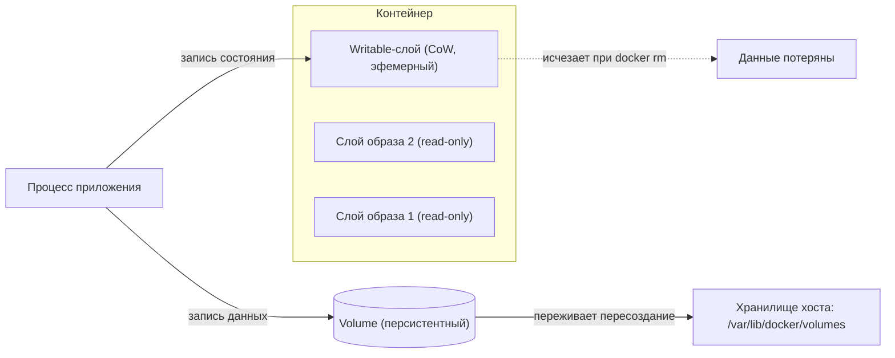
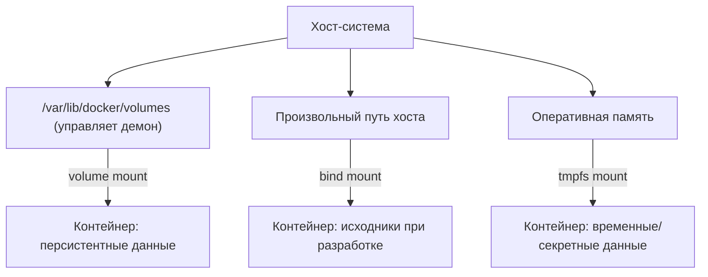

Контейнер по своей природе эфемерен: его файловая система собирается из неизменяемых слоёв образа плюс один тонкий writable-слой сверху. Всё, что процесс записывает на диск во время работы, попадает именно в этот верхний слой — и исчезает вместе с контейнером, как только вы выполните `docker rm`. Для stateless-приложений это идеально, но базе данных, очереди или хранилищу файлов нужна персистентность, переживающая пересоздание контейнера. В этом разделе разбираемся, почему writable-слой не подходит для хранения данных, какие механизмы предлагает Docker (volumes, bind mounts, tmpfs), как устроены storage-драйверы и как та же задача решается в Kubernetes.

## Проблема эфемерного writable-слоя

Как мы разбирали в разделе про [образы и слои](/containerization/images/), образ — это набор read-only слоёв, объединённых через OverlayFS. При запуске контейнера движок добавляет сверху ещё один слой — **writable container layer**. Любая запись, модификация или удаление файла происходит в нём.

У этого механизма два принципиальных ограничения.

**Эфемерность.** Writable-слой привязан к жизненному циклу контейнера. Удалили контейнер — удалился и слой со всеми данными. Это сознательное архитектурное решение: контейнеры задуманы как одноразовые и взаимозаменяемые. Но оно означает, что хранить в них состояние нельзя.

**Накладные расходы copy-on-write.** Слои образа разделяются между всеми контейнерами из этого образа. Чтобы изменить файл из нижнего read-only слоя, драйвер должен сначала скопировать его целиком в writable-слой — это операция `copy_up`. Для большого файла, который меняется хотя бы в одном байте (например, файл данных СУБД), копируется весь файл. Для приложений с интенсивной записью CoW превращается в узкое место: растёт латентность и потребление места.

Вывод простой: данные, которые должны жить дольше контейнера или активно перезаписываются, нужно выносить наружу — за пределы writable-слоя.



## Три типа монтирования в Docker

Docker предлагает три способа смонтировать данные внутрь контейнера в обход writable-слоя.



### Volumes — рекомендованный способ

**Volume** — это каталог, которым полностью управляет демон Docker. Физически тома лежат в `/var/lib/docker/volumes/<имя>/_data` на хосте, но напрямую лазить туда руками не следует — это часть приватной области Docker.

Преимущества томов:

- содержимое не зависит от жизненного цикла контейнера — том переживает `docker rm`;
- легко создаются, бэкапятся и переносятся командами Docker CLI;
- одинаково работают на Linux и Windows, без привязки к структуре каталогов хоста;
- могут управляться драйверами томов (volume drivers) — например, для хранения данных на удалённом NFS или в облаке;
- запись идёт напрямую в файловую систему хоста, минуя CoW writable-слоя, поэтому производительность близка к нативной.

Это рекомендованный механизм для **персистентных данных**: файлов СУБД, состояния приложений, загруженного контента.

### Bind mounts — путь хоста внутрь контейнера

**Bind mount** монтирует конкретный путь хоста (файл или каталог) внутрь контейнера. В отличие от тома, этот путь полностью под вашим контролем и виден всем процессам хоста.

Bind mount не изолирован Docker: и контейнер, и любой процесс хоста видят и меняют одни и те же файлы одновременно. Это и сильная сторона, и риск. Главный сценарий — **разработка**: смонтировали каталог с исходниками внутрь контейнера, и горячая перезагрузка подхватывает изменения без пересборки образа.

:::caution
Bind mount даёт контейнеру доступ к произвольному пути хоста. Если смонтировать чувствительный системный каталог (например, `/etc` или сокет `/var/run/docker.sock`) с правом записи, контейнер сможет влиять на хост. Для production предпочитайте volumes.
:::

### tmpfs — хранение в оперативной памяти

**tmpfs mount** размещает данные не на диске, а в оперативной памяти хоста (на Linux). Ничего не пишется в writable-слой и ничего не остаётся после остановки контейнера или перезагрузки хоста.

Применение: временные файлы, кэш промежуточных вычислений и особенно **чувствительные данные** — секреты, токены, ключи, которые не должны попадать на диск. Ограничение: tmpfs нельзя разделять между контейнерами, и он живёт только в рамках одного контейнера.

### Сравнение

| Свойство | Volume | Bind mount | tmpfs |
|---|---|---|---|
| Где лежат данные | `/var/lib/docker/volumes` | Произвольный путь хоста | RAM хоста |
| Управляет Docker | Да | Нет | Да |
| Переживает `docker rm` | Да | Да (это путь хоста) | Нет |
| Виден процессам хоста | Не рекомендуется | Да | Нет |
| Разделение между контейнерами | Да | Да | Нет |
| Производительность записи | Близка к нативной | Близка к нативной | Максимальная (RAM) |
| Типичный сценарий | БД, состояние | Исходники при разработке | Секреты, временный кэш |

## Storage-драйверы: как хранятся слои

Storage-драйвер (graphdriver) отвечает за то, как на диске организованы слои образа и writable-слой контейнера и как реализован copy-on-write.

По умолчанию на современном Linux используется **overlay2** — драйвер поверх ядерной OverlayFS. Он объединяет несколько нижних read-only каталогов (`lowerdir` — слои образа) с одним верхним writable (`upperdir`) в единое представление (`merged`). При изменении файла из нижнего слоя срабатывает `copy_up`: файл копируется в `upperdir`, и дальше правки идут уже там.

Исторически существовали и другие драйверы, которые сегодня считаются устаревшими или нишевыми:

| Драйвер | Механизм | Статус |
|---|---|---|
| **overlay2** | OverlayFS (union FS на уровне файлов) | Драйвер по умолчанию |
| aufs | Ранний union FS, не в mainline-ядре | Удалён в Docker Engine v24.0 (заменён overlay2) |
| devicemapper | Блочный CoW через LVM thin pool | Удалён в Docker Engine v25.0 |
| btrfs | CoW на уровне ФС Btrfs | Только если хост на Btrfs |
| zfs | CoW на уровне ФС ZFS | Нишевый, требует ZFS |
| vfs | Без CoW, полное копирование слоёв | Только для отладки/тестов |

:::note
Начиная с Docker Engine 29.0, для новых установок по умолчанию используется containerd image store; классические graphdriver вроде overlay2 при этом по-прежнему важны для понимания того, как устроены слои. Проверить активный драйвер можно командой `docker info` (поле Storage Driver).
:::

Ключевой момент: любой storage-драйвер оптимизирован для слоёв образа, а не для интенсивной записи приложения. Запись большого объёма в writable-слой через CoW почти всегда медленнее, чем запись в volume, который идёт напрямую в файловую систему хоста.

## Практика: команды и синтаксис

Создание именованного тома и его инспекция:

```bash
docker volume create app-data
docker volume ls
docker volume inspect app-data
docker volume rm app-data
```

Подключить хранилище к контейнеру можно двумя синтаксисами: старым `-v`/`--volume` и более явным `--mount`. Рекомендуется `--mount`: его поля читаются однозначно, тогда как `-v` упаковывает всё в строку через двоеточие.

```bash
# Именованный том через -v (volume:путь-в-контейнере)
docker run -d -v app-data:/var/lib/postgresql/data postgres:16

# То же самое через --mount (явные ключи)
docker run -d \
  --mount type=volume,source=app-data,target=/var/lib/postgresql/data \
  postgres:16

# Bind mount: исходники с хоста в контейнер для разработки
docker run -it \
  --mount type=bind,source="$(pwd)"/src,target=/app/src \
  node:22 bash

# tmpfs: временные/секретные данные в памяти
docker run -d \
  --mount type=tmpfs,target=/run/secrets,tmpfs-size=64m \
  myapp:latest
```

Существенное различие в поведении: если при `-v` указать имя, которого нет, Docker молча создаст том. При bind mount через `-v` несуществующий путь хоста будет создан как пустой каталог, а вот `--mount type=bind` с несуществующим источником выдаст ошибку — что обычно безопаснее.

### Совместное использование и резервное копирование

Один том можно смонтировать сразу в несколько контейнеров — например, чтобы веб-сервер и воркер работали с общими загруженными файлами:

```bash
docker run -d --name web    -v shared:/data nginx
docker run -d --name worker -v shared:/data myworker
```

Бэкап тома делают через временный контейнер, который монтирует и том, и каталог хоста, а затем архивирует данные:

```bash
docker run --rm \
  -v app-data:/source:ro \
  -v "$(pwd)":/backup \
  alpine tar czf /backup/app-data.tar.gz -C /source .
```

:::tip
Перед бэкапом тома с активной СУБД либо останавливайте контейнер БД, либо используйте штатные средства дампа (`pg_dump`, `mysqldump`). Копирование файлов данных «на горячую» может дать несогласованный снимок.
:::

## Хранение в Kubernetes (кратко)

В оркестраторе абстракция хранилища выходит на уровень кластера. Подробно сеть и оркестрация разбираются в разделе [про Kubernetes](/containerization/orchestration/), здесь — только модель томов.

- **PersistentVolume (PV)** — ресурс кластера, представляющий конкретный кусок хранилища (диск в облаке, NFS-шара, локальный диск). Его выделяет администратор или динамический провижининг.
- **PersistentVolumeClaim (PVC)** — заявка пода на хранилище нужного размера и режима доступа. Kubernetes связывает PVC с подходящим PV.
- **StorageClass** — описывает «класс» хранилища (тип диска, параметры) и включает динамическое создание PV под заявку, без ручного выделения.
- **CSI (Container Storage Interface)** — стандартный интерфейс, через который сторонние системы хранения (облачные блочные диски, СХД, распределённые ФС) интегрируются с Kubernetes без вкомпилирования драйверов в ядро оркестратора.

Связь с темой раздела прямая: PVC — это кластерный аналог `docker volume`, развязывающий жизненный цикл данных и жизненный цикл пода так же, как том развязывает данные и контейнер.

## Итоги

- Writable-слой контейнера эфемерен и неэффективен при интенсивной записи из-за copy-on-write — состояние в нём держать нельзя.
- **Volumes** — рекомендованный способ для персистентных данных: управляются Docker, лежат в `/var/lib/docker/volumes`, дают почти нативную производительность.
- **Bind mounts** удобны для разработки (исходники с хоста), но не изолированы и требуют осторожности.
- **tmpfs** — для временных и чувствительных данных, которые не должны касаться диска.
- Слои хранит storage-драйвер; по умолчанию это **overlay2**, остальные (aufs, devicemapper, btrfs, zfs, vfs) — устаревшие, удалённые или нишевые.
- В Kubernetes ту же задачу решают **PV / PVC / StorageClass** поверх интерфейса **CSI**.

## Задания

### Задание 1. Понимание: почему не writable-слой

Объясните своими словами, почему файл данных СУБД (например PostgreSQL) нельзя держать в writable-слое контейнера. Назовите два независимых ограничения и для каждого укажите, в чём именно проблема.

<details>
<summary>Решение</summary>

Раздел называет два принципиальных ограничения writable-слоя.

1. **Эфемерность.** Writable-слой привязан к жизненному циклу контейнера: `docker rm` удаляет контейнер вместе со слоем и всеми записанными данными. Контейнеры задуманы одноразовыми и взаимозаменяемыми, поэтому состояние в них хранить нельзя — оно не переживёт пересоздание.

2. **Накладные расходы copy-on-write.** Слои образа read-only и разделяются между контейнерами. Чтобы изменить файл из нижнего слоя, драйвер сначала целиком копирует его в writable-слой (операция `copy_up`). Для большого файла данных СУБД даже изменение одного байта влечёт копирование всего файла. При интенсивной записи это становится узким местом: растут латентность и потребление места.

Вывод раздела: данные, которые должны жить дольше контейнера или активно перезаписываются, выносят наружу — за пределы writable-слоя (в volume).

</details>

### Задание 2. Выбор механизма под сценарий

Для каждого из трёх случаев выберите подходящий тип монтирования (volume, bind mount или tmpfs) и обоснуйте выбор одним-двумя свойствами из раздела:

1. Каталог `data/` базы данных в production.
2. Каталог с исходниками приложения при локальной разработке с горячей перезагрузкой.
3. Файл с JWT-токеном и приватным ключом, который не должен попадать на диск.

<details>
<summary>Решение</summary>

| Сценарий | Выбор | Обоснование |
|---|---|---|
| Данные БД в production | **Volume** | Рекомендованный механизм для персистентных данных: управляется Docker, переживает `docker rm`, запись идёт напрямую в ФС хоста минуя CoW — производительность близка к нативной. Легко бэкапить и переносить. |
| Исходники при разработке | **Bind mount** | Монтирует конкретный путь хоста внутрь контейнера; контейнер и хост видят одни и те же файлы, поэтому горячая перезагрузка подхватывает правки без пересборки образа. |
| Секреты/токены | **tmpfs** | Данные лежат в RAM хоста, ничего не пишется в writable-слой и не остаётся после остановки контейнера. Подходит именно для чувствительных данных, которые не должны касаться диска. |

Важно: для production раздел прямо советует предпочитать volumes, а bind mount — это риск (даёт доступ к произвольному пути хоста).

</details>

### Задание 3. «Что произойдёт, если…»: поведение `-v` против `--mount`

Разберите два сценария и скажите, что сделает Docker в каждом:

1. `docker run -v non-existent-vol:/data postgres:16` — тома `non-existent-vol` не существует.
2. `docker run --mount type=bind,source=/no/such/path,target=/data postgres:16` — пути `/no/such/path` на хосте нет.

Почему второй вариант раздел называет «обычно более безопасным»?

<details>
<summary>Решение</summary>

1. При `-v` с несуществующим **именем тома** Docker **молча создаст том** `non-existent-vol` и смонтирует его. Ошибки не будет.
2. При `--mount type=bind` с несуществующим **источником-путём** Docker **выдаст ошибку** и контейнер не запустится.

Дополнительный нюанс из раздела: bind mount **через `-v`** с несуществующим путём хоста, наоборот, создаст пустой каталог.

Почему `--mount` безопаснее: явный отказ при опечатке в пути не даёт незаметно подмонтировать пустой каталог вместо реальных данных. Молчаливое создание (`-v`) маскирует ошибку — приложение запустится с пустым хранилищем, а вы об этом не узнаете. Плюс у `--mount` поля (`type=`, `source=`, `target=`) читаются однозначно, тогда как `-v` упаковывает всё в строку через двоеточие.

</details>

### Задание 4. Практика: общий том и бэкап

Дан том `app-data`. Нужно: (1) смонтировать его одновременно в два контейнера для общего доступа к файлам и (2) сделать согласованный бэкап тома в tar-архив в текущем каталоге. Приведите команды и объясните, почему для шага 2 (если это том БД) недостаточно простого копирования файлов.

<details>
<summary>Решение</summary>

**1. Общий том в двух контейнерах.** Один том можно смонтировать сразу в несколько контейнеров:

```bash
docker run -d --name web    -v app-data:/data nginx
docker run -d --name worker -v app-data:/data myworker
```

Оба контейнера видят и пишут одни и те же файлы (volume поддерживает разделение между контейнерами).

**2. Бэкап через временный контейнер.** Запускаем одноразовый контейнер, который монтирует и том (read-only), и каталог хоста, и архивирует данные:

```bash
docker run --rm \
  -v app-data:/source:ro \
  -v "$(pwd)":/backup \
  alpine tar czf /backup/app-data.tar.gz -C /source .
```

`--rm` удаляет временный контейнер после работы, `:ro` защищает исходный том от случайной записи.

**Почему копирования файлов БД «на горячую» недостаточно.** У работающей СУБД часть состояния в буферах/WAL и файлы меняются в процессе архивации, поэтому tar-снимок может получиться несогласованным (битым). Раздел советует перед бэкапом тома с активной БД либо останавливать контейнер БД, либо использовать штатные средства дампа — `pg_dump`, `mysqldump`, — которые дают консистентный снимок.

</details>
