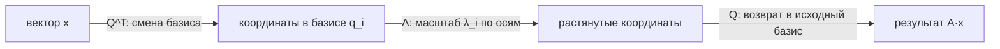
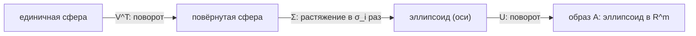
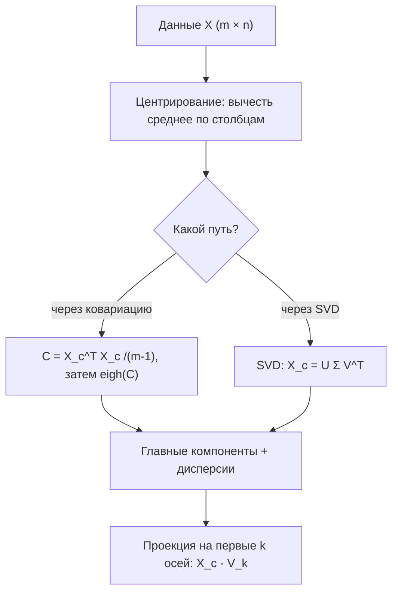

Разложение матрицы — это представление её в виде произведения нескольких матриц с понятной структурой (диагональных, ортогональных, треугольных). Зачем это нужно? Потому что в «разобранном» виде матрица перестаёт быть таблицей чисел и раскрывает свою геометрию: в каких направлениях она растягивает пространство, во сколько раз и есть ли направления, которые она почти не задействует. Именно эти направления и масштабы лежат в основе сжатия данных, понижения размерности и устойчивых численных алгоритмов.

В этом разделе мы разберём два центральных разложения — спектральное (для симметричных матриц) и сингулярное (SVD, для любых матриц), — а затем покажем, как из них естественно вырастают низкоранговые приближения и метод главных компонент (PCA). По дороге понадобятся [собственные значения и векторы](/linear-algebra/), [геометрия линейных отображений](/linear-algebra/) и понятие [ковариации из статистики](/statistics/).

## Спектральное разложение симметричной матрицы

Напомним: число $\lambda$ — **собственное значение** матрицы $A$, а ненулевой вектор $\vec{v}$ — соответствующий ему **собственный вектор**, если

$$
A\vec{v} = \lambda \vec{v}.
$$

Геометрически: $A$ не поворачивает $\vec{v}$, а только растягивает (или сжимает) его в $\lambda$ раз. Для произвольной матрицы собственные векторы могут быть комплексными, не образовывать базис и вести себя капризно. Но среди всех матриц есть особенно «удобный» класс — **симметричные** ($A = A^\top$), и для них работает красивая теорема.

### Спектральная теорема

Если $A \in \mathbb{R}^{n\times n}$ симметрична, то:

- все её собственные значения $\lambda_1, \dots, \lambda_n$ **вещественны**;
- собственные векторы можно выбрать **ортонормированными** (взаимно перпендикулярными и единичной длины).

Собрав ортонормированные собственные векторы в столбцы матрицы $Q$ (тогда $Q^\top Q = I$, то есть $Q$ ортогональна), а собственные значения — на диагональ $\Lambda$, получаем **спектральное разложение**:

$$
A = Q\Lambda Q^\top = \sum_{i=1}^{n} \lambda_i\, \vec{q}_i \vec{q}_i^{\top}.
$$

:::note[Как это читать]
Действие симметричной матрицы на вектор $\vec{x}$ распадается на три шага: $Q^\top$ переводит $\vec{x}$ в систему координат из собственных векторов, $\Lambda$ масштабирует каждую координату на свой $\lambda_i$, а $Q$ возвращает результат обратно. Правая форма $\sum_i \lambda_i \vec{q}_i\vec{q}_i^\top$ показывает то же самое как сумму простых «проекторов» $\vec{q}_i\vec{q}_i^\top$ с весами $\lambda_i$.
:::



### Геометрия и положительная определённость

Знаки собственных значений полностью описывают «характер» симметричной матрицы:

- все $\lambda_i > 0$ — матрица **положительно определена** ($\vec{x}^\top A\vec{x} > 0$ для всех $\vec{x}\ne 0$);
- все $\lambda_i \ge 0$ — **положительно полуопределена**;
- знаки разные — квадратичная форма имеет «седло».

Это важно на практике: ковариационные и матрицы Грама $X^\top X$ всегда положительно полуопределены, гессианы в точках минимума функции потерь — положительно (полу)определены. Подробнее о гессиане и кривизне — в разделе [Производные и оптимизация](/calculus/).

Небольшая проверка спектральной теоремы в коде:

```python
import numpy as np

A = np.array([[2.0, 1.0],
              [1.0, 2.0]])          # симметричная

lam, Q = np.linalg.eigh(A)          # eigh — для симметричных/эрмитовых
print(lam)                          # [1. 3.]  — вещественные
print(Q.T @ Q)                      # ~единичная: столбцы ортонормированы

# Реконструкция A = Q Λ Q^T
A_rec = Q @ np.diag(lam) @ Q.T
print(np.allclose(A, A_rec))        # True
```

:::tip
Для симметричных матриц используйте `np.linalg.eigh`, а не общий `np.linalg.eig`: он точнее, быстрее и гарантированно возвращает вещественные значения и ортонормированный базис.
:::

## Сингулярное разложение (SVD)

Спектральное разложение работает только для квадратных симметричных матриц. А что делать с прямоугольной матрицей данных $X$ размера $m\times n$ (строки — объекты, столбцы — признаки)? Здесь на сцену выходит **сингулярное разложение** — самое универсальное разложение в линейной алгебре, существующее для **любой** матрицы.

### Формулировка

Любую матрицу $A \in \mathbb{R}^{m\times n}$ можно записать как

$$
A = U\Sigma V^{\top},
$$

где

- $U \in \mathbb{R}^{m\times m}$ ортогональна; её столбцы $\vec{u}_i$ — **левые сингулярные векторы**;
- $V \in \mathbb{R}^{n\times n}$ ортогональна; её столбцы $\vec{v}_i$ — **правые сингулярные векторы**;
- $\Sigma \in \mathbb{R}^{m\times n}$ «диагональна»: на диагонали стоят **сингулярные числа** $\sigma_1 \ge \sigma_2 \ge \dots \ge 0$, остальное — нули.

Эквивалентная и очень полезная форма — сумма ранг-один слагаемых (берём только $r$ ненулевых сингулярных чисел, $r$ — ранг матрицы):

$$
A = \sum_{i=1}^{r} \sigma_i\, \vec{u}_i \vec{v}_i^{\top}.
$$

### Геометрический смысл

Любое линейное отображение — это **поворот, масштабирование вдоль осей и ещё один поворот**. SVD буквально выписывает эти три шага: $V^\top$ поворачивает, $\Sigma$ растягивает оси на $\sigma_i$, $U$ снова поворачивает. Единичная сфера под действием $A$ превращается в эллипсоид, а сингулярные числа $\sigma_i$ — длины его полуосей.



### Связь со спектральным разложением

SVD и спектральное разложение — близкие родственники. Рассмотрим симметричные матрицы $A^\top A$ и $AA^\top$ (обе положительно полуопределены):

$$
A^\top A = V\Sigma^\top\Sigma\, V^\top, \qquad AA^\top = U\Sigma\Sigma^\top U^\top.
$$

Отсюда сразу видно:

- правые сингулярные векторы $\vec{v}_i$ — собственные векторы $A^\top A$;
- левые сингулярные векторы $\vec{u}_i$ — собственные векторы $AA^\top$;
- сингулярные числа связаны с собственными как $\sigma_i = \sqrt{\lambda_i}$.

А если $A$ сама симметрична и положительно полуопределена, то SVD и спектральное разложение совпадают: $U = V = Q$ и $\sigma_i = \lambda_i$.

```python
import numpy as np

A = np.array([[3.0, 0.0],
              [4.0, 5.0]])

U, s, Vt = np.linalg.svd(A)         # s — вектор сингулярных чисел
print(s)                            # отсортированы по убыванию

# Связь: σ_i^2 = собственные значения A^T A
lam = np.linalg.eigvalsh(A.T @ A)
print(np.allclose(np.sort(s**2), np.sort(lam)))   # True

# Реконструкция
Sigma = np.zeros_like(A)
np.fill_diagonal(Sigma, s)
print(np.allclose(A, U @ Sigma @ Vt))             # True
```

## Низкоранговые приближения

Главная практическая ценность SVD — **оптимальное сжатие**. Раз $A = \sum_i \sigma_i \vec{u}_i\vec{v}_i^\top$, а сингулярные числа убывают, то отбросив маленькие $\sigma_i$, мы потеряем немного. Оставим первые $k$ слагаемых:

$$
A_k = \sum_{i=1}^{k} \sigma_i\, \vec{u}_i \vec{v}_i^{\top}.
$$

**Теорема Эккарта–Янга** утверждает, что $A_k$ — наилучшее приближение $A$ матрицей ранга $k$ среди всех возможных (по спектральной и фробениусовой нормам). Ошибка приближения выражается через отброшенные сингулярные числа:

$$
\|A - A_k\|_F^2 = \sum_{i=k+1}^{r} \sigma_i^2.
$$

То есть «энергия» данных распределена по сингулярным числам, и доля сохранённой энергии равна

$$
\frac{\sum_{i=1}^{k}\sigma_i^2}{\sum_{i=1}^{r}\sigma_i^2}.
$$

### Зачем это в ML

- **Сжатие**: вместо $m\times n$ чисел храним $U_k$, $\Sigma_k$, $V_k$ — это $k(m+n+1)$ чисел. При $k \ll \min(m,n)$ экономия огромная (классический пример — сжатие изображений).
- **Шумоподавление**: малые $\sigma_i$ часто соответствуют шуму; их обнуление очищает сигнал.
- **Латентные факторы**: в рекомендательных системах усечённое SVD матрицы «пользователи × объекты» вскрывает скрытые предпочтения (см. [другие алгоритмы ML](/machine-learning/other-algorithms/)).
- **Псевдообратная и устойчивая регрессия**: через SVD строится псевдообратная матрица Мура–Пенроуза, лежащая в основе [линейной регрессии](/machine-learning/).

```python
import numpy as np

rng = np.random.default_rng(0)
A = rng.normal(size=(200, 100))

U, s, Vt = np.linalg.svd(A, full_matrices=False)

k = 10
A_k = U[:, :k] @ np.diag(s[:k]) @ Vt[:k, :]

energy = np.cumsum(s**2) / np.sum(s**2)
print(f"Доля энергии при k={k}: {energy[k-1]:.3f}")
print(f"Ошибка ||A-A_k||_F: {np.linalg.norm(A - A_k):.3f}")
```

## Метод главных компонент (PCA)

PCA — это, возможно, самое известное применение спектрального разложения и SVD в анализе данных. Задача: найти **новые ортогональные оси (главные компоненты)**, вдоль которых данные разбросаны сильнее всего, и спроецировать на первые несколько из них, понизив размерность с минимальной потерей информации.

### Постановка через ковариацию

Пусть $X \in \mathbb{R}^{m\times n}$ — данные ($m$ объектов, $n$ признаков). Сначала **центрируем** признаки (вычитаем среднее по столбцам), получая $X_c$. Выборочная **ковариационная матрица**

$$
C = \frac{1}{m-1} X_c^{\top} X_c \in \mathbb{R}^{n\times n}
$$

симметрична и положительно полуопределена, поэтому имеет спектральное разложение $C = Q\Lambda Q^\top$. Связь с дисперсией прямая: на диагонали $C$ стоят дисперсии признаков, вне диагонали — ковариации (см. [ковариация и корреляция](/statistics/)).

- Собственные векторы $\vec{q}_i$ (столбцы $Q$) — **главные компоненты**, направления максимальной дисперсии.
- Собственные значения $\lambda_i$ — **дисперсия данных вдоль этих направлений**.
- Доля объяснённой дисперсии первыми $k$ компонентами: $\sum_{i=1}^k \lambda_i \big/ \sum_{i=1}^n \lambda_i$.

### Почему максимизация дисперсии = собственный вектор

Дисперсия проекции центрированных данных на единичный вектор $\vec{w}$ равна $\vec{w}^\top C \vec{w}$. Ищем направление максимальной дисперсии при ограничении $\|\vec{w}\| = 1$. Через множитель Лагранжа условие оптимальности даёт ровно уравнение на собственный вектор:

$$
\max_{\|\vec{w}\|=1} \vec{w}^{\top} C \vec{w} \quad\Longrightarrow\quad C\vec{w} = \lambda \vec{w}.
$$

Максимум достигается на собственном векторе с наибольшим $\lambda$, а само значение максимума и есть $\lambda_{\max}$. Так чисто оптимизационная задача превращается в задачу на собственные значения.

### PCA через SVD — короче и устойчивее

Считать ковариацию $X_c^\top X_c$ необязательно (и численно рискованно). Применим SVD напрямую к центрированным данным:

$$
X_c = U\Sigma V^{\top}.
$$

Тогда $X_c^\top X_c = V\Sigma^2 V^\top$, и значит:

- правые сингулярные векторы $V$ — это и есть главные компоненты $Q$;
- собственные значения ковариации $\lambda_i = \dfrac{\sigma_i^2}{m-1}$;
- проекции данных (**счёт-компоненты**) — это $X_c V = U\Sigma$.



```python
import numpy as np
from sklearn.decomposition import PCA

rng = np.random.default_rng(42)
X = rng.normal(size=(500, 5)) @ rng.normal(size=(5, 5))  # коррелированные признаки

# --- Вручную через SVD ---
Xc = X - X.mean(axis=0)
U, s, Vt = np.linalg.svd(Xc, full_matrices=False)
explained = (s**2) / np.sum(s**2)
print("Доля дисперсии (SVD):", np.round(explained, 3))

# Проекция на 2 главные компоненты
X_2d = Xc @ Vt[:2].T

# --- Проверка через scikit-learn ---
pca = PCA(n_components=2)
pca.fit(X)
print("Доля дисперсии (sklearn):", np.round(pca.explained_variance_ratio_, 3))
```

:::caution[Не забывайте про масштаб признаков]
PCA чувствителен к масштабу: признак в «рублях» с большой дисперсией перетянет на себя главные компоненты, заслонив признаки в «долях». Если единицы измерения несопоставимы, стандартизируйте данные (вычесть среднее, поделить на стандартное отклонение) — тогда PCA по сути работает с корреляционной матрицей. Подробнее о стандартизации — в [подготовке данных на Python](/python-data/).
:::

:::note[PCA, автоэнкодеры и не только]
PCA — это линейное понижение размерности. Когда структура данных нелинейна, на смену приходят t-SNE, UMAP и автоэнкодеры, но интуиция «найти оси максимальной информативности» остаётся той же. О месте PCA среди методов обучения без учителя — в разделе [другие алгоритмы ML](/machine-learning/other-algorithms/).
:::

## Краткое сравнение

| Разложение | Для каких матриц | Формула | Где используется |
|---|---|---|---|
| Спектральное | симметричные $n\times n$ | $A = Q\Lambda Q^\top$ | PCA через ковариацию, анализ квадратичных форм, гессиан |
| SVD | любые $m\times n$ | $A = U\Sigma V^\top$ | сжатие, шумоподавление, PCA, псевдообратная, рекомендации |
| Низкоранговое $A_k$ | любые | $\sum_{i=1}^k \sigma_i\vec{u}_i\vec{v}_i^\top$ | оптимальное приближение (Эккарт–Янг) |

## Задания

### Упражнение 1. Спектральное разложение вручную

Найдите собственные значения, ортонормированные собственные векторы и запишите спектральное разложение матрицы

$$
A = \begin{pmatrix} 2 & 1 \\ 1 & 2 \end{pmatrix}.
$$

<details>
<summary>Решение</summary>

Характеристическое уравнение:

$$
\det(A - \lambda I) = (2-\lambda)^2 - 1 = \lambda^2 - 4\lambda + 3 = 0 \;\Rightarrow\; \lambda_1 = 3,\; \lambda_2 = 1.
$$

Для $\lambda_1 = 3$: $(A-3I)\vec{v}=0 \Rightarrow -v_1 + v_2 = 0 \Rightarrow \vec{v}_1 \propto (1,1)$. Нормируем: $\vec{q}_1 = \tfrac{1}{\sqrt{2}}(1,1)$.

Для $\lambda_2 = 1$: $v_1 + v_2 = 0 \Rightarrow \vec{v}_2 \propto (1,-1)$. Нормируем: $\vec{q}_2 = \tfrac{1}{\sqrt{2}}(1,-1)$.

Векторы ортогональны (как и обещает спектральная теорема). Разложение:

$$
A = Q\Lambda Q^\top,\quad
Q = \frac{1}{\sqrt{2}}\begin{pmatrix} 1 & 1 \\ 1 & -1 \end{pmatrix},\quad
\Lambda = \begin{pmatrix} 3 & 0 \\ 0 & 1 \end{pmatrix}.
$$

Проверка по сумме проекторов: $A = 3\,\vec{q}_1\vec{q}_1^\top + 1\,\vec{q}_2\vec{q}_2^\top = 3\cdot\tfrac12\begin{pmatrix}1&1\\1&1\end{pmatrix} + 1\cdot\tfrac12\begin{pmatrix}1&-1\\-1&1\end{pmatrix} = \begin{pmatrix}2&1\\1&2\end{pmatrix}.$

</details>

### Упражнение 2. Сингулярные числа через $A^\top A$

Не вызывая SVD напрямую, найдите сингулярные числа матрицы

$$
A = \begin{pmatrix} 1 & 0 \\ 0 & 0 \\ 0 & 2 \end{pmatrix}.
$$

<details>
<summary>Решение</summary>

Сингулярные числа $A$ — это корни из собственных значений $A^\top A$:

$$
A^\top A = \begin{pmatrix} 1 & 0 & 0 \\ 0 & 0 & 2 \end{pmatrix}\begin{pmatrix} 1 & 0 \\ 0 & 0 \\ 0 & 2 \end{pmatrix} = \begin{pmatrix} 1 & 0 \\ 0 & 4 \end{pmatrix}.
$$

Матрица диагональна, её собственные значения $\lambda_1 = 4,\ \lambda_2 = 1$. Тогда

$$
\sigma_1 = \sqrt{4} = 2,\qquad \sigma_2 = \sqrt{1} = 1.
$$

(Сингулярные числа принято упорядочивать по убыванию.)

</details>

### Упражнение 3. Доля объяснённой дисперсии

Сингулярные числа центрированной матрицы данных $X_c$ оказались равны $\sigma = (10,\ 6,\ 2,\ 1)$. Сколько главных компонент нужно оставить, чтобы сохранить не менее 95% дисперсии?

<details>
<summary>Решение</summary>

Дисперсия вдоль компонент пропорциональна $\sigma_i^2$:

$$
\sigma^2 = (100,\ 36,\ 4,\ 1),\qquad \sum \sigma_i^2 = 141.
$$

Накопленная доля:

- $k=1$: $100/141 \approx 0{,}709$ — мало;
- $k=2$: $(100+36)/141 = 136/141 \approx 0{,}965$ — уже $\ge 0{,}95$.

**Ответ:** достаточно **двух** главных компонент (они сохраняют около 96,5% дисперсии).

</details>

### Упражнение 4. PCA своими руками

Напишите функцию, которая центрирует данные, считает PCA через SVD и возвращает проекцию на $k$ компонент вместе с долями объяснённой дисперсии. Проверьте, что доли совпадают с `sklearn`.

<details>
<summary>Решение</summary>

```python
import numpy as np
from sklearn.decomposition import PCA

def pca_svd(X, k):
    Xc = X - X.mean(axis=0)               # центрирование
    U, s, Vt = np.linalg.svd(Xc, full_matrices=False)
    explained_ratio = (s**2) / np.sum(s**2)
    scores = Xc @ Vt[:k].T                 # проекция = U[:, :k] * s[:k]
    return scores, explained_ratio[:k]

rng = np.random.default_rng(7)
X = rng.normal(size=(300, 4)) @ rng.normal(size=(4, 4))

scores, ratio = pca_svd(X, k=2)

pca = PCA(n_components=2).fit(X)
print("моя реализация:", np.round(ratio, 4))
print("sklearn:       ", np.round(pca.explained_variance_ratio_, 4))
print("совпало:", np.allclose(ratio, pca.explained_variance_ratio_))
```

Ключевые моменты: (1) обязательно центрировать данные — иначе первая компонента «поймает» смещение от нуля, а не разброс; (2) проекцию можно получить и как $U_k\Sigma_k$, и как $X_c V_k$ — это одно и то же; (3) знак компонент (направление вектора) у разных реализаций может отличаться — это нормально, информативность от этого не меняется.

</details>
