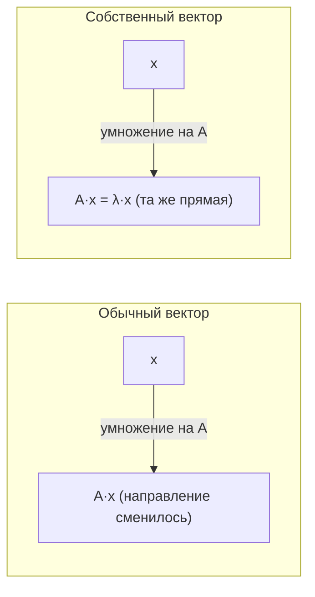

Матрица — это не просто таблица чисел, а *преобразование*: она берёт вектор и превращает его в другой вектор. Большинство векторов при этом меняют и длину, и направление. Но почти у каждой матрицы есть особые направления, которые преобразование **не сворачивает в сторону**, а лишь растягивает или сжимает. Эти направления задают **собственные векторы**, а коэффициенты растяжения — **собственные значения**. Через них раскрывается «скелет» преобразования, и именно на них строятся [матричные разложения](/linear-algebra/decompositions/) и [PCA](/machine-learning/).

Перед этим разделом полезно освежить [векторы](/linear-algebra/vectors/) и [матрицы](/linear-algebra/matrices/).

## Интуиция: особые направления преобразования

Возьмём матрицу $A$ и посмотрим, как она действует на разные векторы $\vec{x}$, отображая их в $A\vec{x}$. Для большинства векторов результат «уезжает» в сторону — направление меняется. Но есть исключения: для некоторых $\vec{x}$ вектор $A\vec{x}$ лежит на той же прямой, что и сам $\vec{x}$. Преобразование лишь масштабирует такой вектор, не поворачивая его.

Формально вектор $\vec{x} \neq \vec{0}$ называется **собственным вектором** матрицы $A$, если

$$
A\vec{x} = \lambda \vec{x},
$$

где число $\lambda$ — соответствующее **собственное значение**. Знак и величина $\lambda$ говорят, что происходит вдоль этого направления:

- $\lambda > 1$ — растяжение;
- $0 < \lambda < 1$ — сжатие;
- $\lambda < 0$ — растяжение с разворотом на $180^\circ$;
- $\lambda = 0$ — направление схлопывается в ноль (матрица вырождена).

:::note[Терминология]
По-английски: *eigenvalue* (собственное значение) и *eigenvector* (собственный вектор). Приставка *eigen-* — немецкая, означает «собственный, присущий». Множество всех собственных значений называют **спектром** матрицы.
:::



## Характеристическое уравнение

Как находить $\lambda$ и $\vec{x}$? Перепишем определение, перенеся всё в одну сторону:

$$
A\vec{x} = \lambda \vec{x} \quad\Longleftrightarrow\quad A\vec{x} - \lambda \vec{x} = \vec{0} \quad\Longleftrightarrow\quad (A - \lambda I)\,\vec{x} = \vec{0},
$$

где $I$ — единичная матрица (она нужна, чтобы из матрицы $A$ можно было вычесть «число» $\lambda$).

Это [однородная система](/linear-algebra/linear-systems/). Нулевой вектор $\vec{x} = \vec{0}$ — всегда решение, но он нам не интересен. Ненулевое решение существует только тогда, когда матрица $A - \lambda I$ **вырождена**, то есть её определитель равен нулю:

$$
\det(A - \lambda I) = 0.
$$

Это и есть **характеристическое уравнение**. Раскрыв определитель, получаем многочлен степени $n$ относительно $\lambda$ (для матрицы размера $n \times n$) — **характеристический многочлен**. Его корни и есть собственные значения.

### Пример $2\times 2$ по шагам

Пусть

$$
A = \begin{pmatrix} 2 & 1 \\ 1 & 2 \end{pmatrix}.
$$

Составляем $A - \lambda I$ и считаем определитель:

$$
\det\!\begin{pmatrix} 2-\lambda & 1 \\ 1 & 2-\lambda \end{pmatrix} = (2-\lambda)^2 - 1 = \lambda^2 - 4\lambda + 3 = (\lambda-1)(\lambda-3).
$$

Корни: $\lambda_1 = 3$ и $\lambda_2 = 1$. Теперь для каждого $\lambda$ решаем $(A - \lambda I)\vec{x} = \vec{0}$.

Для $\lambda_1 = 3$:

$$
(A - 3I)\vec{x} = \begin{pmatrix} -1 & 1 \\ 1 & -1 \end{pmatrix}\vec{x} = \vec{0} \;\Rightarrow\; x_1 = x_2 \;\Rightarrow\; \vec{x}_1 = \begin{pmatrix} 1 \\ 1 \end{pmatrix}.
$$

Для $\lambda_2 = 1$:

$$
(A - I)\vec{x} = \begin{pmatrix} 1 & 1 \\ 1 & 1 \end{pmatrix}\vec{x} = \vec{0} \;\Rightarrow\; x_1 = -x_2 \;\Rightarrow\; \vec{x}_2 = \begin{pmatrix} 1 \\ -1 \end{pmatrix}.
$$

Собственный вектор определён **с точностью до масштаба**: если $\vec{x}$ собственный, то и любой $c\vec{x}$ ($c \neq 0$) тоже. Поэтому обычно их нормируют до единичной длины.

:::tip[Два полезных тождества для проверки]
Не вычисляя многочлен до конца, можно контролировать ответ:

- сумма собственных значений равна **следу** (сумме диагональных элементов): $\sum_i \lambda_i = \operatorname{tr}(A)$;
- произведение собственных значений равно **определителю**: $\prod_i \lambda_i = \det(A)$.

В примере: $3 + 1 = 4 = \operatorname{tr}(A)$ и $3 \cdot 1 = 3 = \det(A)$. Сходится.
:::

### Кратность и комплексные корни

Степень характеристического многочлена равна $n$, значит, с учётом кратности у матрицы $n \times n$ ровно $n$ собственных значений в комплексных числах. Здесь возможны тонкости:

- **Кратные корни.** Корень может повторяться. Число повторов — *алгебраическая кратность*. Размерность пространства собственных векторов для этого $\lambda$ — *геометрическая кратность*. Геометрическая никогда не превосходит алгебраическую.
- **Комплексные значения.** У вещественной матрицы корни бывают комплексными. Классический пример — поворот плоскости: у него нет вещественных собственных направлений, ведь поворот меняет направление каждому вектору.

$$
R = \begin{pmatrix} \cos\theta & -\sin\theta \\ \sin\theta & \cos\theta \end{pmatrix}, \qquad \lambda = \cos\theta \pm i\sin\theta = e^{\pm i\theta}.
$$

## Диагонализация

Предположим, у матрицы $A$ размера $n \times n$ нашлось $n$ **линейно независимых** собственных векторов. Соберём их в столбцы матрицы $P$, а собственные значения — на диагональ матрицы $D$:

$$
P = \big(\,\vec{x}_1 \;\; \vec{x}_2 \;\; \cdots \;\; \vec{x}_n\,\big), \qquad
D = \begin{pmatrix} \lambda_1 & & \\ & \ddots & \\ & & \lambda_n \end{pmatrix}.
$$

Тогда выполняется ключевое равенство:

$$
A = P D P^{-1}, \qquad \text{эквивалентно} \qquad D = P^{-1} A P.
$$

Это **диагонализация**. Смысл прозрачен: $P^{-1}$ переводит вектор в систему координат, осями которой служат собственные векторы; в этих координатах преобразование $A$ — просто независимое растяжение каждой оси на $\lambda_i$ (матрица $D$); затем $P$ возвращает результат обратно.


### Зачем это нужно: степени матрицы

Диагонализация превращает тяжёлые операции в лёгкие. Например, степень:

$$
A^k = (P D P^{-1})^k = P D^k P^{-1},
$$

потому что соседние $P^{-1}P$ сокращаются. А возвести в степень диагональную матрицу элементарно — каждый $\lambda_i$ в степень $k$:

$$
D^k = \begin{pmatrix} \lambda_1^k & & \\ & \ddots & \\ & & \lambda_n^k \end{pmatrix}.
$$

Так считают, например, установившееся поведение марковских цепей и линейных динамических систем: при больших $k$ доминирует наибольшее по модулю собственное значение.

:::caution[Диагонализуема не всякая матрица]
Если линейно независимых собственных векторов меньше $n$ (геометрическая кратность меньше алгебраической), разложение $A = PDP^{-1}$ невозможно. Пример — сдвиг $\begin{pmatrix} 1 & 1 \\ 0 & 1 \end{pmatrix}$: единственное значение $\lambda = 1$ имеет лишь одно собственное направление. Для таких случаев существует более общая жорданова форма, а на практике чаще берут [SVD](/linear-algebra/decompositions/), которое определено для любой матрицы.
:::

## Симметричные матрицы — особенно приятный случай

Матрица **симметрична**, если $A = A^{\top}$. В данных такие матрицы возникают сплошь и рядом: матрицы [ковариации](/statistics/), грамовы матрицы скалярных произведений, гессианы. Для них работает **спектральная теорема** — красивый и сильный результат:

1. Все собственные значения **вещественны** (комплексных не бывает).
2. Собственные векторы, отвечающие разным $\lambda$, **взаимно ортогональны**; более того, всегда можно выбрать полный **ортонормированный** базис из собственных векторов.
3. Матрица всегда диагонализуема, причём матрицу перехода можно взять **ортогональной**: $Q^{-1} = Q^{\top}$.

Последний пункт даёт особенно удобную запись — **ортогональную диагонализацию**:

$$
A = Q D Q^{\top}, \qquad Q^{\top} Q = I.
$$

Здесь обращение матрицы заменяется на простое транспонирование — это и численно устойчивее, и геометрически означает, что собственные направления образуют прямой угол.

:::note[Связь с положительной определённостью и PCA]
Для симметричной матрицы знаки собственных значений классифицируют её: все $\lambda_i > 0$ — матрица *положительно определённая*. Именно так устроена ковариационная матрица: её собственные векторы задают **главные оси** разброса данных, а собственные значения — дисперсию вдоль этих осей. Отбор направлений с наибольшими $\lambda_i$ и есть метод главных компонент, [PCA](/machine-learning/).
:::

## Вычисление на практике (NumPy)

Руками считают только маленькие примеры. В реальности используют численные методы из `numpy.linalg`.

```python
import numpy as np

A = np.array([[2.0, 1.0],
              [1.0, 2.0]])

# Общий случай: eig возвращает значения и векторы (столбцы матрицы vecs)
vals, vecs = np.linalg.eig(A)
print(vals)          # [3. 1.]
print(vecs)          # столбцы — собственные векторы (нормированы до длины 1)

# Для симметричных матриц лучше eigh: быстрее, точнее, значения по возрастанию
vals_s, vecs_s = np.linalg.eigh(A)
print(vals_s)        # [1. 3.]

# Проверка определения A x = λ x для первого собственного вектора
x = vecs[:, 0]
print(np.allclose(A @ x, vals[0] * x))   # True

# Проверка ортогональности собственных векторов симметричной матрицы
print(np.allclose(vecs_s.T @ vecs_s, np.eye(2)))  # True
```

:::tip
Если матрица симметрична, всегда вызывайте `np.linalg.eigh`, а не `np.linalg.eig`: первая использует это свойство, гарантирует вещественный результат и численно надёжнее.
:::

## Коротко

| Понятие | Определение | Смысл |
|---|---|---|
| Собственное значение $\lambda$ | корень $\det(A - \lambda I) = 0$ | коэффициент растяжения вдоль особого направления |
| Собственный вектор $\vec{x}$ | $A\vec{x} = \lambda\vec{x}$, $\vec{x} \neq \vec{0}$ | направление, которое преобразование не поворачивает |
| Диагонализация | $A = PDP^{-1}$ | переход в базис, где $A$ — просто масштабирование осей |
| Спектральная теорема | $A = QDQ^{\top}$ для $A = A^{\top}$ | ортонормированный базис из собственных векторов |

Дальше — [матричные разложения](/linear-algebra/decompositions/) (включая SVD), где идеи спектра обобщаются на произвольные, в том числе неквадратные, матрицы.

## Задания

### Упражнение 1. Найти спектр вручную

Для матрицы

$$
A = \begin{pmatrix} 4 & 1 \\ 2 & 3 \end{pmatrix}
$$

составьте характеристическое уравнение, найдите оба собственных значения и проверьте ответ через след и определитель.

<details>
<summary>Решение</summary>

Характеристический многочлен:

$$
\det\!\begin{pmatrix} 4-\lambda & 1 \\ 2 & 3-\lambda \end{pmatrix} = (4-\lambda)(3-\lambda) - 2 = \lambda^2 - 7\lambda + 10 = (\lambda-2)(\lambda-5).
$$

Корни: $\lambda_1 = 5$, $\lambda_2 = 2$.

Проверка:

- след $\operatorname{tr}(A) = 4 + 3 = 7$, и $\lambda_1 + \lambda_2 = 5 + 2 = 7$ — совпадает;
- определитель $\det(A) = 4\cdot 3 - 1\cdot 2 = 10$, и $\lambda_1 \lambda_2 = 5 \cdot 2 = 10$ — совпадает.

</details>

### Упражнение 2. Найти собственные векторы

Для той же матрицы $A = \begin{pmatrix} 4 & 1 \\ 2 & 3 \end{pmatrix}$ из упражнения 1 найдите собственный вектор для $\lambda_1 = 5$.

<details>
<summary>Решение</summary>

Решаем $(A - 5I)\vec{x} = \vec{0}$:

$$
\begin{pmatrix} -1 & 1 \\ 2 & -2 \end{pmatrix}\begin{pmatrix} x_1 \\ x_2 \end{pmatrix} = \vec{0}.
$$

Первая строка даёт $-x_1 + x_2 = 0$, то есть $x_1 = x_2$ (вторая строка пропорциональна первой и не даёт нового условия). Значит, собственный вектор:

$$
\vec{x}_1 = \begin{pmatrix} 1 \\ 1 \end{pmatrix} \quad(\text{или любой кратный ему}).
$$

Проверка: $A\vec{x}_1 = \begin{pmatrix} 4+1 \\ 2+3 \end{pmatrix} = \begin{pmatrix} 5 \\ 5 \end{pmatrix} = 5\vec{x}_1$. Верно.

</details>

### Упражнение 3. Рассуждение про симметрию

Матрица $B = \begin{pmatrix} 0 & 1 \\ 0 & 0 \end{pmatrix}$ имеет единственное собственное значение $\lambda = 0$ (кратности 2), но только одно собственное направление. Объясните, почему это **не** противоречит спектральной теореме.

<details>
<summary>Решение</summary>

Спектральная теорема гарантирует полный ортонормированный базис из собственных векторов и диагонализуемость **только для симметричных** матриц ($A = A^{\top}$).

Здесь $B = \begin{pmatrix} 0 & 1 \\ 0 & 0 \end{pmatrix}$, а $B^{\top} = \begin{pmatrix} 0 & 0 \\ 1 & 0 \end{pmatrix} \neq B$ — матрица несимметрична. Поэтому теорема к ней неприменима, и нехватка собственных векторов (геометрическая кратность 1 при алгебраической 2) совершенно законна. Такая матрица недиагонализуема.

</details>

### Упражнение 4. Степень через диагонализацию (код)

Дана диагонализуемая матрица $A = \begin{pmatrix} 2 & 0 \\ 0 & 3 \end{pmatrix}$ (она уже диагональна). С помощью NumPy и формулы $A^k = P D^k P^{-1}$ вычислите $A^{10}$ и сравните с прямым возведением в степень.

<details>
<summary>Решение</summary>

Для диагональной матрицы $P = I$, а $D = A$, поэтому $A^{10}$ — это просто диагональ из $2^{10}$ и $3^{10}$. Код подтверждает это и для общего пути через `eig`:

```python
import numpy as np

A = np.array([[2.0, 0.0],
              [0.0, 3.0]])

vals, P = np.linalg.eig(A)
D = np.diag(vals)

A_pow = P @ np.diag(vals**10) @ np.linalg.inv(P)
direct = np.linalg.matrix_power(A, 10)

print(np.round(A_pow))   # [[1024.    0.] [   0. 59049.]]
print(np.allclose(A_pow, direct))  # True
```

Здесь $2^{10} = 1024$ и $3^{10} = 59049$. Главное наблюдение: вместо десяти умножений матриц достаточно возвести в степень числа на диагонали — ровно ради этого и нужна диагонализация.

</details>
