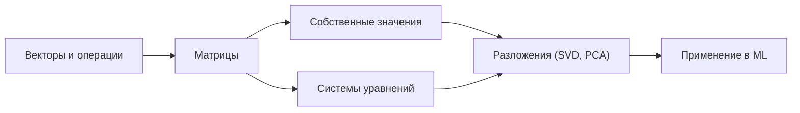

Линейная алгебра — это язык, на котором записано почти всё машинное обучение. Данные в ML — это таблицы чисел, то есть матрицы; один объект (картинка, пользователь, документ) — это вектор; обучение модели — это поиск таких чисел (весов), при которых преобразование входов в выходы работает лучше всего. Если вы понимаете векторы, матрицы и операции над ними, то формулы из учебников по ML перестают быть набором символов и превращаются в осмысленные геометрические действия: проекции, повороты, растяжения, сжатия размерности.

Эта страница — карта темы. Ниже разберём, зачем линейная алгебра нужна именно для ML, какие идеи в ней центральные, как она связана с другими темами курса, и дадим список разделов со ссылками.

## Зачем это нужно для ML

Почти любой шаг в типичном ML-пайплайне опирается на линейную алгебру:

- **Представление данных.** Датасет из $n$ объектов с $d$ признаками — это матрица $X \in \mathbb{R}^{n \times d}$. Строка — объект, столбец — признак. Все библиотеки (NumPy, pandas, PyTorch) работают именно с такими массивами.
- **Линейные модели.** Линейная и логистическая регрессия предсказывают через скалярное произведение признаков и весов: $\hat{y} = X w + b$. Это буквально одна матрично-векторная операция.
- **Нейросети.** Один полносвязный слой — это умножение на матрицу весов плюс смещение и нелинейность: $a = \sigma(W x + b)$. Глубокая сеть — это композиция таких преобразований.
- **Снижение размерности.** PCA, латентные представления, эмбеддинги — всё это про поиск «хороших» базисов и проекций, то есть про собственные значения и сингулярное разложение.
- **Метрики близости.** Косинусная близость, евклидово расстояние, нормы — основа поиска похожих объектов, кластеризации и рекомендаций.
- **Производительность.** Вычисления на GPU — это в первую очередь быстрое умножение матриц. Понимание размерностей помогает писать корректный и эффективный код.

:::tip[Главная интуиция]
Матрица — это не «таблица чисел», а **преобразование пространства**: она берёт вектор и переводит его в другой вектор. Обучение модели — это подбор такого преобразования, которое удобно решает задачу.
:::

## Ключевые идеи темы

Несколько понятий проходят сквозь всю линейную алгебру и всё ML. Стоит держать их в голове как опорные.

### Вектор и скалярное произведение

Вектор $\vec{x} = (x_1, \dots, x_d)$ — это и точка в пространстве, и направление. Скалярное произведение

$$
\vec{a} \cdot \vec{b} = \sum_{i=1}^{d} a_i b_i = \|\vec{a}\|\,\|\vec{b}\|\cos\theta
$$

измеряет, насколько два вектора «смотрят в одну сторону». На нём держатся и предсказание линейной модели, и косинусная близость, и понятие проекции.

### Матрица как преобразование

Умножение $A\vec{x}$ переводит вектор $\vec{x}$ в новый вектор. Композиция преобразований — это произведение матриц $B(A\vec{x}) = (BA)\vec{x}$. Именно поэтому нейросеть из нескольких линейных слоёв без нелинейностей схлопывается в одно матричное преобразование.

### Базис, ранг и размерность

Любой вектор раскладывается по базису. Ранг матрицы — число линейно независимых направлений, которые она реально использует. Низкий ранг означает, что в данных меньше «настоящих» измерений, чем столбцов, — на этом основано сжатие и борьба с избыточностью признаков.

### Собственные векторы и разложения

Собственный вектор $\vec{v}$ матрицы $A$ при умножении только масштабируется:

$$
A\vec{v} = \lambda \vec{v}
$$

Эти особые направления и числа $\lambda$ показывают «скелет» преобразования. На них и на сингулярном разложении (SVD) построены PCA, рекомендательные системы и анализ устойчивости обучения.



## Связь с другими темами

Линейная алгебра не существует в вакууме — она переплетена с остальными разделами курса.

- [Математический анализ](/calculus/): обучение моделей — это оптимизация. Градиент функции потерь — это вектор, а правила дифференцирования матричных выражений (matrix calculus) живут на стыке двух тем. Без линейной алгебры не записать ни градиентный спуск, ни обратное распространение ошибки.
- [Теория вероятностей](/probability/): ковариационная матрица, многомерное нормальное распределение, маргинализация — это линейная алгебра поверх вероятностей. PCA и матрица ковариаций — прямая связка.
- [Статистика](/statistics/): метод наименьших квадратов, регрессия и проверка гипотез о коэффициентах формулируются через матричные операции и проекции.
- [Python для данных](/python-data/): NumPy, pandas и фреймворки глубокого обучения — это практическая реализация всего, что мы здесь изучаем. Векторизация кода = перевод циклов в матричные операции.
- [Машинное обучение](/machine-learning/): итоговая цель — здесь все идеи собираются в работающие модели.

## Разделы курса

| Раздел | Что внутри |
| --- | --- |
| [Векторы и операции](/linear-algebra/vectors/) | Что такое вектор, сложение и масштабирование, скалярное произведение, нормы, проекции, угол и косинусная близость. База для всего остального. |
| [Матрицы](/linear-algebra/matrices/) | Матрица как таблица данных и как преобразование. Умножение, транспонирование, обратная матрица, ранг, специальные виды матриц. |
| [Системы уравнений](/linear-algebra/linear-systems/) | Решение $A\vec{x} = \vec{b}$, метод Гаусса, существование и единственность решения, метод наименьших квадратов и связь с регрессией. |
| [Собственные значения](/linear-algebra/eigenvalues/) | Собственные векторы и числа, геометрический смысл, диагонализация, где это всплывает в ML. |
| [Разложения и ML](/linear-algebra/decompositions/) | LU, QR, спектральное разложение и SVD; PCA, снижение размерности, рекомендательные системы — линейная алгебра в действии. |
| [Задания](/linear-algebra/exercises/) | Практические упражнения и задачи для закрепления: от ручных вычислений до кода на NumPy. |

## Как изучать тему

:::note[Рекомендуемый порядок]
Идите по разделам сверху вниз: векторы → матрицы → системы → собственные значения → разложения → задания. Каждый следующий раздел опирается на предыдущий.
:::

Несколько практических советов, которые экономят время:

1. **Сначала геометрия, потом формулы.** Прежде чем заучивать правило умножения матриц, представьте, *что* оно делает с пространством: куда переезжают базисные векторы. Понимание «картинки» делает формулу очевидной.
2. **Считайте руками на маленьких размерностях.** Перемножьте две матрицы $2\times 2$, найдите собственные значения, решите систему из двух уравнений на бумаге. Это закрепляет механику лучше, чем десять прочитанных страниц.
3. **Сразу проверяйте в коде.** Параллельно повторяйте всё в NumPy — это и проверка понимания, и мост к [практике на Python](/python-data/).

```python
import numpy as np

# Матрица как преобразование вектора
A = np.array([[2.0, 0.0],
              [0.0, 3.0]])      # растяжение: x в 2 раза, y в 3 раза
x = np.array([1.0, 1.0])
print(A @ x)                    # -> [2. 3.]

# Скалярное произведение и косинусная близость
a = np.array([1.0, 2.0, 3.0])
b = np.array([2.0, 4.0, 6.0])
cos = a @ b / (np.linalg.norm(a) * np.linalg.norm(b))
print(round(float(cos), 3))     # -> 1.0 (сонаправлены)
```

4. **Следите за размерностями.** 90% ошибок в ML-коде — это несовпадение форм массивов. Привыкайте проговаривать: «матрица $n\times d$ умножается на вектор $d$, получаем вектор $n$».
5. **Возвращайтесь к теме из ML.** Когда встретите в нейросетях или регрессии незнакомую формулу, возвращайтесь сюда — почти всегда это окажется знакомая операция в новой одежде.

:::tip[Что должно остаться в голове]
Если запомнить только три вещи — пусть это будут: скалярное произведение измеряет похожесть, матрица преобразует пространство, а разложения находят в данных скрытые направления. Остальное наращивается вокруг этого.
:::

Готовы? Начните с раздела [Векторы и операции](/linear-algebra/vectors/).
