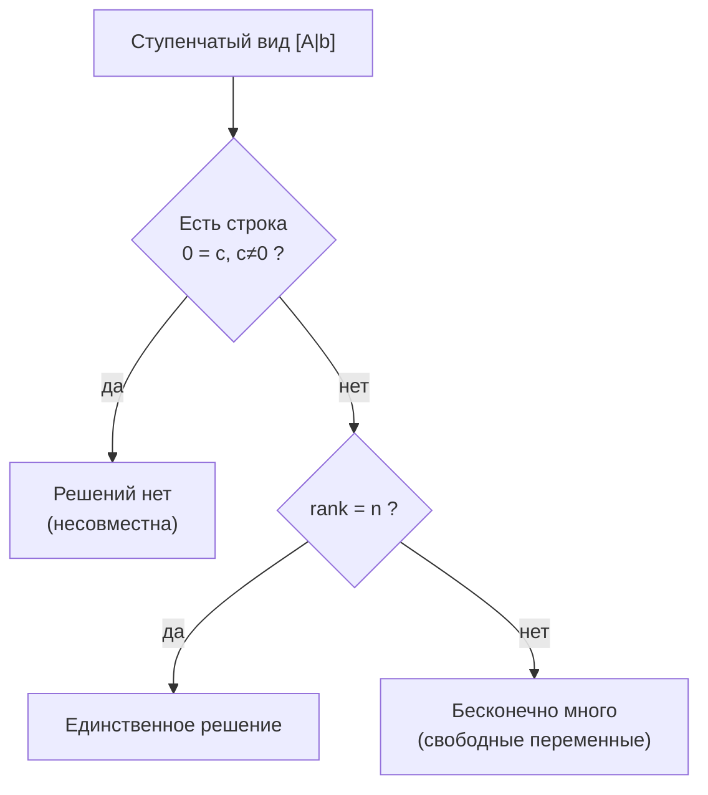
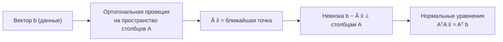

Система линейных уравнений — это набор уравнений, в каждом из которых неизвестные входят только в первой степени и только линейно (без произведений, квадратов, синусов и прочей нелинейности). Это базовый объект всей линейной алгебры: матрицы, ранг, определители, собственные значения — всё так или иначе крутится вокруг вопроса «как решить $Ax=b$ и что это решение означает». Для ML этот сюжет важен вдвойне: линейная регрессия, нормальные уравнения, многие шаги оптимизации сводятся именно к решению (часто приближённому) линейных систем.

Перед чтением полезно освежить [векторы и матрицы](/linear-algebra/).

## От уравнений к записи $Ax=b$

Рассмотрим систему из трёх уравнений с тремя неизвестными:

$$
\begin{cases}
2x_1 + x_2 - x_3 = 8 \\
-3x_1 - x_2 + 2x_3 = -11 \\
-2x_1 + x_2 + 2x_3 = -3
\end{cases}
$$

Коэффициенты при неизвестных образуют матрицу, неизвестные — вектор-столбец, а правые части — ещё один вектор. Тогда вся система записывается компактно:

$$
A x = b, \qquad
A = \begin{pmatrix} 2 & 1 & -1 \\ -3 & -1 & 2 \\ -2 & 1 & 2 \end{pmatrix},\quad
x = \begin{pmatrix} x_1 \\ x_2 \\ x_3 \end{pmatrix},\quad
b = \begin{pmatrix} 8 \\ -11 \\ -3 \end{pmatrix}
$$

В общем случае $A$ — это матрица размера $m \times n$ ($m$ уравнений, $n$ неизвестных), $x \in \mathbb{R}^n$, $b \in \mathbb{R}^m$. Произведение $Ax$ — это вектор, $i$-я компонента которого равна скалярному произведению $i$-й строки $A$ на $x$:

$$
(Ax)_i = \sum_{j=1}^{n} a_{ij}\, x_j
$$

:::note[Два взгляда на $Ax$]
Произведение $Ax$ можно читать двумя способами:

- **по строкам**: каждое уравнение — это одно скалярное равенство $(\text{строка}) \cdot x = b_i$;
- **по столбцам**: $Ax = x_1 a_{:1} + x_2 a_{:2} + \dots + x_n a_{:n}$ — линейная комбинация столбцов $A$ с коэффициентами $x_j$.

Второй взгляд — ключ к интуиции: решить $Ax=b$ значит «выразить $b$ как комбинацию столбцов $A$».
:::

## Метод Гаусса

Идея метода Гаусса (исключения переменных): элементарными преобразованиями строк привести расширенную матрицу $[A \mid b]$ к ступенчатому виду, а затем найти неизвестные обратным ходом. Допустимые преобразования не меняют множество решений:

1. перестановка двух строк;
2. умножение строки на ненулевое число;
3. прибавление к строке другой строки, умноженной на число.

### Прямой ход

Берём расширенную матрицу и обнуляем поддиагональные элементы по столбцам:

$$
\left[\begin{array}{ccc|c}
2 & 1 & -1 & 8 \\
-3 & -1 & 2 & -11 \\
-2 & 1 & 2 & -3
\end{array}\right]
\;\to\;
\left[\begin{array}{ccc|c}
2 & 1 & -1 & 8 \\
0 & \tfrac12 & \tfrac12 & 1 \\
0 & 2 & 1 & 5
\end{array}\right]
\;\to\;
\left[\begin{array}{ccc|c}
2 & 1 & -1 & 8 \\
0 & \tfrac12 & \tfrac12 & 1 \\
0 & 0 & -1 & 1
\end{array}\right]
$$

В первом шаге к строке 2 прибавили $\tfrac32$ строки 1, к строке 3 прибавили строку 1. Во втором шаге из строки 3 вычли $4$ строки 2.

### Обратный ход

Из последней строки $-x_3 = 1 \Rightarrow x_3 = -1$. Подставляем вверх:

$$
\tfrac12 x_2 + \tfrac12 x_3 = 1 \;\Rightarrow\; x_2 = 3,\qquad
2x_1 + x_2 - x_3 = 8 \;\Rightarrow\; x_1 = 2
$$

Ответ: $x = (2,\ 3,\ -1)^\top$.


:::tip[Выбор ведущего элемента]
На практике в качестве ведущего элемента (pivot) в столбце выбирают строку с наибольшим по модулю значением и переставляют её наверх — это **частичный выбор главного элемента** (partial pivoting). Деление на маленькие числа усиливает ошибки округления, поэтому без pivoting'а численное решение быстро «плывёт».
:::

## Существование и единственность решения

После приведения к ступенчатому виду возможны ровно три исхода. Они полностью описываются через **ранг** матрицы $A$ и ранг расширенной матрицы $[A \mid b]$ (ранг — число ненулевых строк в ступенчатом виде, то есть число линейно независимых строк/столбцов).

| Условие | Число решений | Что произошло |
|---|---|---|
| $\operatorname{rank}(A) < \operatorname{rank}([A\mid b])$ | нет решений | появилась строка вида $0 = c$, $c\neq 0$ |
| $\operatorname{rank}(A) = \operatorname{rank}([A\mid b]) = n$ | ровно одно | все переменные ведущие |
| $\operatorname{rank}(A) = \operatorname{rank}([A\mid b]) < n$ | бесконечно много | есть свободные переменные |

Это **теорема Кронекера — Капелли**. Кратко:

- Система **совместна** (имеет хотя бы одно решение) тогда и только тогда, когда $\operatorname{rank}(A) = \operatorname{rank}([A\mid b])$, то есть $b$ лежит в линейной оболочке столбцов $A$.
- Решение **единственно** дополнительно требует, чтобы ранг равнялся числу неизвестных $n$ (нет свободных переменных).

Для **квадратной** системы ($m = n$) удобный критерий единственности: решение существует и единственно при любом $b$ тогда и только тогда, когда $\det A \neq 0$ (матрица обратима). В этом случае формально $x = A^{-1}b$, но на практике систему решают методом Гаусса, а не обращением матрицы — это быстрее и устойчивее.



## Геометрическая интерпретация

Каждое линейное уравнение с $n$ неизвестными задаёт гиперплоскость в $\mathbb{R}^n$ (прямую на плоскости при $n=2$, плоскость в пространстве при $n=3$). Решение системы — это **пересечение** всех этих гиперплоскостей.

Для двух уравнений с двумя неизвестными — две прямые на плоскости:

- пересекаются в одной точке → единственное решение;
- параллельны и не совпадают → решений нет;
- совпадают → бесконечно много решений (вся прямая).

Есть и второй геометрический взгляд — «по столбцам». Вопрос $Ax=b$ — это вопрос «можно ли набрать вектор $b$ из столбцов $A$»:

- если $b$ лежит в пространстве столбцов $A$ (их линейной оболочке) — система совместна;
- если столбцы линейно независимы — представление единственно.

Оба взгляда эквивалентны, но «столбцовый» особенно полезен в ML: именно он ведёт к методу наименьших квадратов.

## Переопределённые системы и метод наименьших квадратов

В реальных данных уравнений обычно **больше**, чем неизвестных: $m > n$. Такая система называется **переопределённой**. Точного решения чаще всего нет — $b$ не лежит в пространстве столбцов $A$ (данные зашумлены, модель приближённая). Что делать?

Вместо требования $Ax = b$ ищем $x$, минимизирующее **невязку** — квадрат длины ошибки:

$$
\hat{x} = \arg\min_{x}\; \lVert Ax - b \rVert_2^2 = \arg\min_{x} \sum_{i=1}^{m} \big((Ax)_i - b_i\big)^2
$$

Геометрически мы проецируем $b$ ортогонально на пространство столбцов $A$: $A\hat{x}$ — ближайшая к $b$ точка этого пространства, а вектор ошибки $b - A\hat{x}$ перпендикулярен всем столбцам $A$. Условие перпендикулярности $A^\top(b - A\hat{x}) = 0$ даёт **нормальные уравнения**:

$$
A^\top A\, \hat{x} = A^\top b
$$

Если столбцы $A$ линейно независимы, матрица $A^\top A$ обратима и

$$
\hat{x} = (A^\top A)^{-1} A^\top b
$$



:::caution[Нормальные уравнения — теория, а не рецепт]
Формула $(A^\top A)^{-1}A^\top b$ хороша для понимания, но численно рискованна: число обусловленности $A^\top A$ — это квадрат числа обусловленности $A$, поэтому ошибки округления усиливаются. На практике метод наименьших квадратов решают через **QR-разложение** или **SVD**. В коде вызывают готовую функцию, а не обращают $A^\top A$ руками.
:::

### Мост к линейной регрессии

Это и есть линейная регрессия в матричной форме. Пусть у нас $m$ объектов, у каждого $n$ признаков; строки $A$ — это объекты (с добавленным столбцом единиц для свободного члена), $b$ — целевая переменная, $x$ — искомые веса. Минимизация $\lVert Ax - b\rVert^2$ — это минимизация суммы квадратов ошибок предсказания, то есть метод наименьших квадратов и есть обучение линейной модели.

```python
import numpy as np

# m=4 объекта, признак + столбец единиц (свободный член)
A = np.array([[1.0, 0.0],
              [1.0, 1.0],
              [1.0, 2.0],
              [1.0, 3.0]])
b = np.array([1.0, 2.9, 5.2, 6.8])

# Рекомендуемый способ: устойчивое решение МНК (через SVD внутри)
x_hat, residuals, rank, sv = np.linalg.lstsq(A, b, rcond=None)
print("веса [intercept, slope]:", x_hat)

# Те же нормальные уравнения "в лоб" — для сверки, не для продакшена
x_normal = np.linalg.solve(A.T @ A, A.T @ b)
print("через нормальные уравнения:", x_normal)
```

Подробно про вывод весов, регуляризацию и интерпретацию — в разделе [линейные модели](/machine-learning/linear-models/). Связь с производными и минимизацией функции потерь раскрывается в [математическом анализе](/calculus/), а вероятностный смысл наименьших квадратов (предположение о нормальном шуме) — в [теории вероятностей](/probability/).

## Задания

### Задание 1. Решить систему методом Гаусса

Решите вручную:

$$
\begin{cases}
x_1 + 2x_2 + x_3 = 4 \\
2x_1 + x_2 - x_3 = 1 \\
3x_1 + 2x_2 + 2x_3 = 9
\end{cases}
$$

<details>
<summary>Решение</summary>

Расширенная матрица и прямой ход (из строки 2 вычитаем $2\times$строку 1; из строки 3 вычитаем $3\times$строку 1):

$$
\left[\begin{array}{ccc|c}
1 & 2 & 1 & 4 \\ 2 & 1 & -1 & 1 \\ 3 & 2 & 2 & 9
\end{array}\right]
\to
\left[\begin{array}{ccc|c}
1 & 2 & 1 & 4 \\ 0 & -3 & -3 & -7 \\ 0 & -4 & -1 & -3
\end{array}\right]
$$

Из строки 3 вычитаем $\tfrac43$ строки 2:

$$
\to
\left[\begin{array}{ccc|c}
1 & 2 & 1 & 4 \\ 0 & -3 & -3 & -7 \\ 0 & 0 & 3 & \tfrac{19}{3}
\end{array}\right]
$$

Обратный ход: $3x_3 = \tfrac{19}{3} \Rightarrow x_3 = \tfrac{19}{9}$; затем $-3x_2 - 3x_3 = -7 \Rightarrow x_2 = \tfrac{7}{3} - x_3 = \tfrac{21 - 19}{9} = \tfrac{2}{9}$; и $x_1 = 4 - 2x_2 - x_3 = 4 - \tfrac{4}{9} - \tfrac{19}{9} = \tfrac{36 - 23}{9} = \tfrac{13}{9}$.

Ответ: $x = \left(\tfrac{13}{9},\ \tfrac{2}{9},\ \tfrac{19}{9}\right)^\top$. Проверка подстановкой в любое из уравнений сходится.

</details>

### Задание 2. Определить число решений

Не решая до конца, определите число решений каждой системы по рангам:

а) $\begin{cases} x_1 + x_2 = 2 \\ 2x_1 + 2x_2 = 5 \end{cases}$  б) $\begin{cases} x_1 + x_2 = 2 \\ 2x_1 + 2x_2 = 4 \end{cases}$

<details>
<summary>Решение</summary>

**а)** Вычтем $2\times$первую строку из второй: получим $0 = 1$. Значит $\operatorname{rank}(A) = 1$, но $\operatorname{rank}([A\mid b]) = 2$. Ранги не равны → **решений нет** (прямые параллельны).

**б)** Та же операция даёт $0 = 0$ — строка исчезает. $\operatorname{rank}(A) = \operatorname{rank}([A\mid b]) = 1 < n = 2$ → **бесконечно много решений** (прямые совпадают). Общее решение: $x_1 = 2 - t,\ x_2 = t,\ t \in \mathbb{R}$.

</details>

### Задание 3. Метод наименьших квадратов вручную

Через начало координат подгоняется прямая $y = kx$ (без свободного члена) к точкам $(1, 2)$ и $(2, 3)$. Это переопределённая система $A k = b$ с $A = \begin{pmatrix}1\\2\end{pmatrix}$, $b = \begin{pmatrix}2\\3\end{pmatrix}$. Найдите $k$ через нормальное уравнение.

<details>
<summary>Решение</summary>

Здесь $A$ — это столбец, $A^\top A$ и $A^\top b$ — скаляры:

$$
A^\top A = 1^2 + 2^2 = 5, \qquad A^\top b = 1\cdot 2 + 2\cdot 3 = 8
$$

Нормальное уравнение $5k = 8$ даёт

$$
\hat{k} = \frac{8}{5} = 1.6
$$

Точного $k$, проходящего через обе точки, нет ($2/1 = 2 \neq 1.5 = 3/2$), поэтому МНК выбирает компромисс $1.6$, минимизирующий суммарную квадратичную ошибку.

</details>

### Задание 4. Проверка нормальных уравнений кодом

Напишите короткий скрипт, который для случайных $A$ ($20\times 3$) и $b$ сравнивает решение `np.linalg.lstsq` с решением нормальных уравнений и печатает норму разности.

<details>
<summary>Решение</summary>

```python
import numpy as np

rng = np.random.default_rng(0)
A = rng.standard_normal((20, 3))
b = rng.standard_normal(20)

x_lstsq, *_ = np.linalg.lstsq(A, b, rcond=None)
x_normal = np.linalg.solve(A.T @ A, A.T @ b)

print("lstsq:        ", x_lstsq)
print("normal eqs:   ", x_normal)
print("||разность|| = ", np.linalg.norm(x_lstsq - x_normal))
```

Разность будет порядка $10^{-14}$ — то есть совпадение до машинной точности. На хорошо обусловленной матрице оба способа дают один и тот же ответ; различия проявляются лишь когда столбцы $A$ почти линейно зависимы (тогда `lstsq` устойчивее).

</details>
