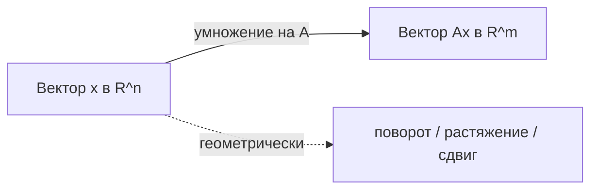
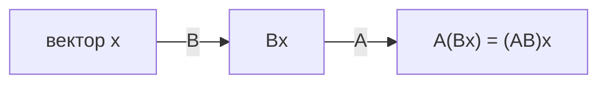

Матрица — одна из центральных конструкций линейной алгебры и, без преувеличения, рабочая лошадка всего машинного обучения. У неё два лица. С одной стороны, это просто прямоугольная таблица чисел — так в ней удобно хранить данные. С другой — это компактная запись линейного преобразования пространства. Эти два взгляда не противоречат друг другу, а дополняют: научившись переключаться между ними, вы начнёте «видеть» геометрию за формулами и формулы за данными.

Перед чтением полезно освежить в памяти [векторы](/linear-algebra/vectors/) и саму идею [линейной алгебры](/linear-algebra/).

## Матрица как таблица

Матрица $A$ размера $m \times n$ — это таблица из $m$ строк и $n$ столбцов:

$$
A = \begin{pmatrix}
a_{11} & a_{12} & \cdots & a_{1n} \\
a_{21} & a_{22} & \cdots & a_{2n} \\
\vdots & \vdots & \ddots & \vdots \\
a_{m1} & a_{m2} & \cdots & a_{mn}
\end{pmatrix}
$$

Элемент $a_{ij}$ стоит на пересечении строки $i$ и столбца $j$. Важно сразу запомнить порядок индексов: **сначала строка, потом столбец**. Размер матрицы тоже принято писать как «строки $\times$ столбцы».

В таком виде матрица — это просто организованный набор чисел. Например, оценки трёх студентов по двум предметам естественно лягут в таблицу $3 \times 2$. Никакой «магии» преобразований тут пока нет — это контейнер.

:::note[Соглашение об обозначениях]
Матрицы обычно обозначают заглавными латинскими буквами ($A$, $B$, $X$), векторы — строчными жирными или со стрелкой ($\vec{x}$), скаляры — обычными строчными ($\alpha$, $c$). Мы будем считать векторы столбцами, то есть матрицами размера $n \times 1$.
:::

## Матрица как линейное преобразование

Второй взгляд гораздо интереснее. Матрица $A$ размера $m \times n$ задаёт функцию, которая берёт вектор из $\mathbb{R}^n$ и превращает его в вектор из $\mathbb{R}^m$:

$$
\vec{x} \in \mathbb{R}^n \;\longmapsto\; A\vec{x} \in \mathbb{R}^m
$$

Это преобразование **линейное**: оно сохраняет операции сложения и умножения на число.

$$
A(\vec{x} + \vec{y}) = A\vec{x} + A\vec{y}, \qquad A(c\,\vec{x}) = c\,(A\vec{x})
$$

Геометрически линейные преобразования — это повороты, растяжения, сжатия, отражения и сдвиги (комбинации этих действий), причём начало координат всегда остаётся на месте, а прямые остаются прямыми, а параллельные линии — параллельными.

Ключевая интуиция: **столбцы матрицы показывают, куда уезжают базисные векторы**. Столбец $j$ — это образ $j$-го базисного вектора $\vec{e}_j$. Зная, куда переходят базисные векторы, мы знаем всё о преобразовании, потому что любой вектор есть их линейная комбинация.



## Умножение матрицы на вектор

Произведение $A\vec{x}$ можно понимать двумя способами, и оба важны.

**Способ 1: по строкам (скалярные произведения).** $i$-я координата результата — это скалярное произведение $i$-й строки матрицы на вектор:

$$
(A\vec{x})_i = \sum_{j=1}^{n} a_{ij}\,x_j
$$

**Способ 2: по столбцам (линейная комбинация).** Результат — это линейная комбинация столбцов матрицы с коэффициентами из вектора:

$$
A\vec{x} = x_1 \vec{a}_1 + x_2 \vec{a}_2 + \cdots + x_n \vec{a}_n
$$

где $\vec{a}_j$ — $j$-й столбец $A$. Этот второй взгляд особенно полезен: он объясняет, почему множество всех возможных $A\vec{x}$ (так называемый **образ**, или column space) — это в точности линейная оболочка столбцов.

Конкретный пример:

$$
\begin{pmatrix} 2 & 0 \\ 1 & 3 \end{pmatrix}
\begin{pmatrix} 4 \\ 1 \end{pmatrix}
=
4\begin{pmatrix} 2 \\ 1 \end{pmatrix} + 1\begin{pmatrix} 0 \\ 3 \end{pmatrix}
= \begin{pmatrix} 8 \\ 7 \end{pmatrix}
$$

:::tip[Согласование размеров]
Чтобы умножить $A$ на $\vec{x}$, число столбцов $A$ должно совпадать с длиной $\vec{x}$. Размер $m\times n$ на $n\times 1$ даёт $m\times 1$. «Внутренние» размеры сокращаются, «внешние» дают размер результата — это же правило работает и для матриц.
:::

## Умножение матрицы на матрицу

Произведение $C = AB$ определяется так, чтобы оно соответствовало **композиции преобразований**: сначала применяем $B$, потом $A$. То есть $(AB)\vec{x} = A(B\vec{x})$. Именно поэтому порядок такой «обратный» — сначала пишется то, что применяется последним.

Если $A$ имеет размер $m \times k$, а $B$ — размер $k \times n$, то $C = AB$ имеет размер $m \times n$, и

$$
c_{ij} = \sum_{l=1}^{k} a_{il}\,b_{lj}
$$

Элемент $c_{ij}$ — это скалярное произведение $i$-й строки $A$ на $j$-й столбец $B$. Другой полезный взгляд: $j$-й столбец результата $C$ равен $A$, умноженной на $j$-й столбец $B$.



### Свойства произведения

| Свойство | Формула | Комментарий |
|---|---|---|
| Ассоциативность | $(AB)C = A(BC)$ | можно расставлять скобки как угодно |
| Дистрибутивность | $A(B+C) = AB + AC$ | раскрывается как обычно |
| Связь со скаляром | $c(AB) = (cA)B = A(cB)$ | скаляр «проходит насквозь» |
| **Не**коммутативность | $AB \neq BA$ | в общем случае! |
| Транспонирование | $(AB)^\top = B^\top A^\top$ | порядок меняется |

Самое неожиданное для новичка свойство — **некоммутативность**. Сначала повернуть, а потом растянуть — это, вообще говоря, не то же самое, что сначала растянуть, а потом повернуть. Поэтому $AB$ и $BA$ могут отличаться, а часто $BA$ вообще не определено из-за размеров.

:::caution[Порядок имеет значение]
Привычка из школьной алгебры «множители можно переставлять» здесь не работает. Всегда следите за порядком матриц и за согласованием размеров.
:::

## Транспонирование

Транспонирование $A^\top$ переворачивает матрицу относительно главной диагонали: строки становятся столбцами. Формально $(A^\top)_{ij} = a_{ji}$. Матрица $m \times n$ превращается в $n \times m$.

$$
\begin{pmatrix} 1 & 2 & 3 \\ 4 & 5 & 6 \end{pmatrix}^\top
=
\begin{pmatrix} 1 & 4 \\ 2 & 5 \\ 3 & 6 \end{pmatrix}
$$

Полезные тождества: $(A^\top)^\top = A$, $(A + B)^\top = A^\top + B^\top$, и уже упомянутое $(AB)^\top = B^\top A^\top$. Транспонирование постоянно встречается в ML: например, в формуле метода наименьших квадратов $\vec{w} = (X^\top X)^{-1} X^\top \vec{y}$ — подробнее в разделе [машинное обучение](/machine-learning/).

## Единичная и обратная матрицы

**Единичная матрица** $I$ — это квадратная матрица с единицами на главной диагонали и нулями в остальных местах. Она играет роль числа 1: для любой подходящей по размеру матрицы $AI = IA = A$. Геометрически — это преобразование «ничего не делать».

$$
I_3 = \begin{pmatrix} 1 & 0 & 0 \\ 0 & 1 & 0 \\ 0 & 0 & 1 \end{pmatrix}
$$

**Обратная матрица** $A^{-1}$ (только для квадратных $A$) — это та, которая отменяет действие $A$:

$$
A A^{-1} = A^{-1} A = I
$$

Если $A$ — это «повернуть на 30 градусов и растянуть вдвое», то $A^{-1}$ — это «сжать вдвое и повернуть назад на 30 градусов». Обратная существует не всегда: если преобразование «схлопывает» пространство (например, проецирует плоскость на прямую), восстановить исходный вектор невозможно. Матрица, у которой нет обратной, называется **вырожденной (сингулярной)**. Критерий обратимости — ненулевой определитель: $\det A \neq 0$.

Для $2\times 2$ есть удобная формула:

$$
A = \begin{pmatrix} a & b \\ c & d \end{pmatrix}, \qquad
A^{-1} = \frac{1}{ad - bc}\begin{pmatrix} d & -b \\ -c & a \end{pmatrix}
$$

:::caution[На практике обратную не считают «в лоб»]
Решая систему $A\vec{x} = \vec{b}$, почти никогда не вычисляют $A^{-1}$ явно — это дорого и численно неустойчиво. Вместо этого используют разложения (LU, QR, Холецкого) или функции вроде `numpy.linalg.solve`. Явная обратная нужна разве что для теоретических выкладок.
:::

## Ранг матрицы

**Ранг** $\operatorname{rank}(A)$ — это число линейно независимых столбцов (оно же равно числу линейно независимых строк). Интуитивно ранг показывает, сколько «настоящих измерений» сохраняет преобразование.

- Если матрица $m\times n$ имеет ранг $r$, то её образ — $r$-мерное подпространство.
- Квадратная матрица $n\times n$ обратима тогда и только тогда, когда её ранг **полный**, то есть равен $n$.
- Если ранг меньше числа столбцов, у разных входных векторов могут совпадать выходы — информация теряется.

Например, матрица $\begin{pmatrix} 1 & 2 \\ 2 & 4 \end{pmatrix}$ имеет ранг 1: второй столбец вдвое больше первого, они линейно зависимы. Такое преобразование «сплющивает» всю плоскость в одну прямую. В ML низкий ранг матрицы данных — сигнал о том, что признаки дублируют друг друга (мультиколлинеарность); идея низкоранговых приближений лежит в основе PCA и рекомендательных систем.

## Частные виды матриц

| Тип | Условие | Геометрический смысл |
|---|---|---|
| Диагональная | $a_{ij}=0$ при $i\neq j$ | независимое растяжение по осям |
| Симметричная | $A = A^\top$ | растяжение вдоль ортогональных осей |
| Ортогональная | $A^\top A = I$ | поворот и/или отражение, длины сохраняются |
| Единичная | диагональная с единицами | тождественное преобразование |

**Диагональная** матрица умножает каждую координату на своё число — самое простое из нетривиальных преобразований. Умножение на неё стоит дёшево.

**Симметричная** матрица ($A = A^\top$) исключительно важна: ковариационные матрицы, матрицы Грама, гессианы — все симметричны. У них вещественные собственные значения и ортогональный базис собственных векторов (см. [собственные значения](/linear-algebra/eigenvalues/)).

**Ортогональная** матрица сохраняет длины и углы: $\|Q\vec{x}\| = \|\vec{x}\|$. Её обратная равна транспонированной, $Q^{-1} = Q^\top$, что делает её невероятно удобной в вычислениях. Повороты и отражения — это именно ортогональные преобразования.

## Данные как матрица: объекты на признаки

Вернёмся к первому взгляду — таблице. В машинном обучении данные почти всегда хранятся как матрица $X$ размера $n \times d$:

- $n$ строк — **объекты** (наблюдения, примеры, сэмплы);
- $d$ столбцов — **признаки** (features, переменные).

Элемент $x_{ij}$ — значение $j$-го признака у $i$-го объекта. Эта компоновка («объекты в строках, признаки в столбцах») — негласный стандарт; именно её ждут `pandas` и `scikit-learn`.

```python
import numpy as np

# 4 объекта (цветка), 3 признака
X = np.array([
    [5.1, 3.5, 1.4],
    [4.9, 3.0, 1.4],
    [6.7, 3.1, 4.7],
    [6.0, 2.9, 4.5],
])
print(X.shape)        # (4, 3): 4 объекта, 3 признака

# центрирование признаков: вычитаем среднее по столбцам
X_centered = X - X.mean(axis=0)

# линейная модель: предсказание = X @ w
w = np.array([0.2, -0.1, 0.5])
y_pred = X @ w        # форма (4,): по одному числу на объект
print(y_pred)
```

Здесь хорошо видно, как два смысла матрицы сливаются: $X$ — это таблица данных, а умножение $X\vec{w}$ — это линейное преобразование, переводящее вектор весов модели в вектор предсказаний по всем объектам сразу. Векторизация (один матричный продукт вместо цикла по объектам) — причина, по которой матричная запись так удобна и быстра. Подробнее про работу с такими таблицами — в разделе [Python для данных](/python-data/).

:::note[Векторизация вместо циклов]
Запись $\hat{\vec{y}} = X\vec{w}$ вычисляет предсказания для всех $n$ объектов одной операцией. Библиотеки линейной алгебры (BLAS под капотом NumPy) делают это на порядки быстрее, чем явный цикл на Python.
:::

## Задания

### Задание 1. Умножение матриц вручную

Даны матрицы

$$
A = \begin{pmatrix} 1 & 2 \\ 0 & 1 \end{pmatrix}, \qquad
B = \begin{pmatrix} 2 & 0 \\ 1 & 3 \end{pmatrix}.
$$

Вычислите $AB$ и $BA$ и убедитесь, что они различаются.

<details>
<summary>Решение</summary>

Считаем $AB$ (строка $A$ на столбец $B$):

$$
AB = \begin{pmatrix} 1\cdot2 + 2\cdot1 & 1\cdot0 + 2\cdot3 \\ 0\cdot2 + 1\cdot1 & 0\cdot0 + 1\cdot3 \end{pmatrix}
= \begin{pmatrix} 4 & 6 \\ 1 & 3 \end{pmatrix}.
$$

Теперь $BA$:

$$
BA = \begin{pmatrix} 2\cdot1 + 0\cdot0 & 2\cdot2 + 0\cdot1 \\ 1\cdot1 + 3\cdot0 & 1\cdot2 + 3\cdot1 \end{pmatrix}
= \begin{pmatrix} 2 & 4 \\ 1 & 5 \end{pmatrix}.
$$

$AB \neq BA$ — наглядная иллюстрация некоммутативности умножения матриц.

</details>

### Задание 2. Обратная матрица 2×2

Найдите обратную к матрице $A = \begin{pmatrix} 4 & 7 \\ 2 & 6 \end{pmatrix}$ и проверьте, что $AA^{-1} = I$.

<details>
<summary>Решение</summary>

Определитель: $\det A = 4\cdot6 - 7\cdot2 = 24 - 14 = 10 \neq 0$, значит обратная существует.

По формуле для $2\times2$:

$$
A^{-1} = \frac{1}{10}\begin{pmatrix} 6 & -7 \\ -2 & 4 \end{pmatrix}
= \begin{pmatrix} 0.6 & -0.7 \\ -0.2 & 0.4 \end{pmatrix}.
$$

Проверка:

$$
A A^{-1} = \begin{pmatrix} 4 & 7 \\ 2 & 6 \end{pmatrix}\begin{pmatrix} 0.6 & -0.7 \\ -0.2 & 0.4 \end{pmatrix}
= \begin{pmatrix} 2.4 - 1.4 & -2.8 + 2.8 \\ 1.2 - 1.2 & -1.4 + 2.4 \end{pmatrix}
= \begin{pmatrix} 1 & 0 \\ 0 & 1 \end{pmatrix}. \checkmark
$$

</details>

### Задание 3. Ранг и вырожденность

Определите ранг матрицы $C = \begin{pmatrix} 1 & 2 & 3 \\ 2 & 4 & 6 \\ 1 & 1 & 1 \end{pmatrix}$. Обратима ли она?

<details>
<summary>Решение</summary>

Посмотрим на строки. Вторая строка равна первой, умноженной на 2: $(2,4,6) = 2\cdot(1,2,3)$. Значит, она линейно зависима от первой.

Остаются две независимые строки: $(1,2,3)$ и $(1,1,1)$ — они не пропорциональны, поэтому независимы. Итого $\operatorname{rank}(C) = 2$.

Ранг (2) меньше размера матрицы (3), то есть ранг **не полный**. Следовательно, $\det C = 0$ и матрица **вырождена** — обратной у неё нет. Проверить можно кодом:

```python
import numpy as np
C = np.array([[1, 2, 3], [2, 4, 6], [1, 1, 1]])
print(np.linalg.matrix_rank(C))   # 2
print(round(np.linalg.det(C), 9)) # 0.0
```

</details>

### Задание 4. Смысл умножения на вектор

Матрица $D = \begin{pmatrix} 3 & 0 \\ 0 & 1 \end{pmatrix}$ применяется к вектору $\vec{x} = \begin{pmatrix} 2 \\ 5 \end{pmatrix}$. Вычислите $D\vec{x}$ и объясните словами, что геометрически делает это преобразование.

<details>
<summary>Решение</summary>

$$
D\vec{x} = \begin{pmatrix} 3 & 0 \\ 0 & 1 \end{pmatrix}\begin{pmatrix} 2 \\ 5 \end{pmatrix}
= \begin{pmatrix} 3\cdot2 + 0\cdot5 \\ 0\cdot2 + 1\cdot5 \end{pmatrix}
= \begin{pmatrix} 6 \\ 5 \end{pmatrix}.
$$

$D$ — диагональная матрица. Она независимо масштабирует координаты: растягивает пространство в 3 раза вдоль оси $x$ и оставляет ось $y$ без изменений (коэффициент 1). Поэтому первая координата вектора утроилась ($2 \to 6$), а вторая не поменялась ($5 \to 5$). Квадрат превратился бы в вытянутый по горизонтали прямоугольник.

</details>
