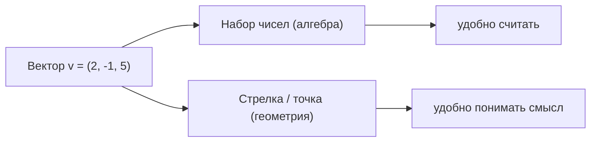
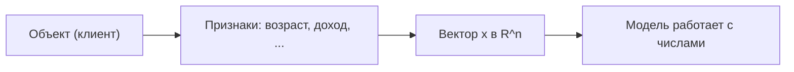

Вектор — это базовый «кирпич» всей линейной алгебры и почти всего машинного обучения. Любой объект данных (письмо, картинку, клиента банка, товар) мы рано или поздно превращаем в вектор чисел, чтобы модель могла с ним работать. В этом разделе разберём, что такое вектор, какие над ним есть операции и какой геометрический смысл за ними стоит.

## Что такое вектор

У вектора есть два взгляда, и оба полезны.

**Алгебраический взгляд.** Вектор — это упорядоченный набор чисел (компонент). Например, вектор из трёх чисел:

$$
\vec{v} = \begin{pmatrix} 2 \\ -1 \\ 5 \end{pmatrix}, \qquad \vec{v} \in \mathbb{R}^3.
$$

Запись $\mathbb{R}^3$ означает «вектор из 3 вещественных чисел». Слово *упорядоченный* важно: $(2, -1, 5)$ и $(-1, 2, 5)$ — это разные векторы.

**Геометрический взгляд.** Тот же вектор можно представить как точку в пространстве с координатами $(2, -1, 5)$ или как стрелку из начала координат в эту точку. Стрелка задаёт *направление* и *длину*.



:::note[Договорённость об обозначениях]
Векторы обычно пишут жирным ($\mathbf{v}$) или со стрелкой ($\vec{v}$). $i$-ю компоненту обозначают $v_i$, нумерация чаще с 1 в математике и с 0 в коде. В формулах ниже считаем, что $\vec{a} = (a_1, \dots, a_n)$.
:::

В двух измерениях всё легко рисуется на плоскости — именно на 2D-картинках удобнее всего набирать интуицию, а формулы потом без изменений работают для любого числа измерений.

## Сложение и умножение на скаляр

### Сложение векторов

Векторы складываются покомпонентно (поэтому складывать можно только векторы одинаковой размерности):

$$
\vec{a} + \vec{b} = (a_1 + b_1,\; a_2 + b_2,\; \dots,\; a_n + b_n).
$$

Геометрически это *правило треугольника*: ставим начало второй стрелки в конец первой, и сумма — стрелка из начала первой в конец второй.

```python
import numpy as np

a = np.array([2, -1, 5])
b = np.array([1,  4, 0])

print(a + b)   # [3 3 5]
```

### Умножение на скаляр

Умножение на число (скаляр) $\lambda$ масштабирует каждую компоненту:

$$
\lambda \vec{a} = (\lambda a_1,\; \lambda a_2,\; \dots,\; \lambda a_n).
$$

Геометрически вектор растягивается ($|\lambda| > 1$) или сжимается ($|\lambda| < 1$), а при $\lambda < 0$ ещё и разворачивается в противоположную сторону. Например, $-1 \cdot \vec{a}$ — это та же стрелка, но направленная назад.

```python
print(2 * a)    # [ 4 -2 10]
print(-1 * a)   # [-2  1 -5]
```

### Линейная комбинация

Если объединить две операции — сложение и умножение на скаляр — получится **линейная комбинация**, центральное понятие линейной алгебры:

$$
\lambda_1 \vec{a}_1 + \lambda_2 \vec{a}_2 + \dots + \lambda_k \vec{a}_k.
$$

Подбирая коэффициенты $\lambda_i$, из набора векторов можно «собирать» новые. Множество всех таких комбинаций называется *линейной оболочкой* и тесно связано с понятиями базиса и линейной независимости — это мы разбираем в [разделе про линейную алгебру](/linear-algebra/).

:::tip[Зачем это в ML]
Предсказание линейной модели — это линейная комбинация признаков: $\hat{y} = w_1 x_1 + \dots + w_n x_n + b$. То есть веса модели $w_i$ — коэффициенты линейной комбинации входных признаков. Понимание этой операции сразу даёт интуицию о том, как «устроена» линейная регрессия.
:::

## Скалярное произведение

**Скалярное произведение** (dot product) двух векторов — это число, сумма произведений соответствующих компонент:

$$
\vec{a} \cdot \vec{b} = \sum_{i=1}^{n} a_i b_i = a_1 b_1 + a_2 b_2 + \dots + a_n b_n.
$$

```python
a = np.array([2, -1, 5])
b = np.array([1,  4, 0])

print(np.dot(a, b))   # 2*1 + (-1)*4 + 5*0 = -2
print(a @ b)          # то же самое: -2
```

### Геометрический смысл

У скалярного произведения есть вторая, геометрическая, формула:

$$
\vec{a} \cdot \vec{b} = \|\vec{a}\|\,\|\vec{b}\|\cos\theta,
$$

где $\theta$ — угол между векторами, а $\|\cdot\|$ — длина (норма, о ней ниже). Отсюда сразу читается главная интуиция: **скалярное произведение измеряет, насколько векторы «сонаправлены»**.

| Знак $\vec{a}\cdot\vec{b}$ | Угол $\theta$ | Смысл |
|---|---|---|
| $> 0$ | острый ($<90^\circ$) | смотрят в одну сторону |
| $= 0$ | прямой ($90^\circ$) | перпендикулярны (ортогональны) |
| $< 0$ | тупой ($>90^\circ$) | смотрят в разные стороны |

### Проекция

Из той же формулы выводится длина проекции вектора $\vec{a}$ на направление $\vec{b}$:

$$
\text{proj}_{\vec{b}}\,\vec{a} = \frac{\vec{a}\cdot\vec{b}}{\|\vec{b}\|}.
$$

Проще говоря, скалярное произведение отвечает на вопрос «какая часть одного вектора лежит вдоль другого». Если $\vec{b}$ — единичный вектор ($\|\vec{b}\| = 1$), то проекция равна просто $\vec{a}\cdot\vec{b}$. Именно так линейная модель «измеряет» вход вдоль направления своих весов.

## Нормы и расстояния

**Норма** — это длина вектора, то есть способ измерить его «размер» одним числом. Норм бывает несколько, на практике чаще всего встречаются две.

### L2-норма (евклидова)

Привычная длина «по теореме Пифагора»:

$$
\|\vec{a}\|_2 = \sqrt{\sum_{i=1}^{n} a_i^2} = \sqrt{a_1^2 + a_2^2 + \dots + a_n^2}.
$$

Заметьте: $\|\vec{a}\|_2^2 = \vec{a}\cdot\vec{a}$ — квадрат L2-нормы есть скалярное произведение вектора на себя.

### L1-норма (манхэттенская)

Сумма модулей компонент — длина пути «по клеточкам», как такси по сетке улиц:

$$
\|\vec{a}\|_1 = \sum_{i=1}^{n} |a_i| = |a_1| + |a_2| + \dots + |a_n|.
$$

```python
a = np.array([3, -4])

print(np.linalg.norm(a))        # L2: sqrt(9 + 16) = 5.0
print(np.linalg.norm(a, ord=1)) # L1: 3 + 4 = 7.0
```

### Расстояния

Расстояние между двумя точками — это норма их разности. Для L2 это знакомое евклидово расстояние:

$$
d_2(\vec{a}, \vec{b}) = \|\vec{a} - \vec{b}\|_2 = \sqrt{\sum_{i=1}^{n} (a_i - b_i)^2},
$$

а для L1 — манхэттенское: $d_1(\vec{a}, \vec{b}) = \sum_i |a_i - b_i|$.

:::note[Где это в ML]
L2-расстояние лежит в основе метода k ближайших соседей и кластеризации k-means. L1- и L2-нормы используются в регуляризации (Lasso и Ridge соответственно): добавляя норму весов к функции потерь, мы штрафуем модель за «слишком большие» коэффициенты и боремся с переобучением. Подробнее — в [разделе про машинное обучение](/machine-learning/).
:::

## Косинусная близость

Часто нас интересует не длина векторов, а только их *направление* — например, два текста про одно и то же должны считаться похожими, даже если один из них в три раза длиннее. Для этого из геометрической формулы скалярного произведения выражают косинус угла:

$$
\cos\theta = \frac{\vec{a}\cdot\vec{b}}{\|\vec{a}\|_2\,\|\vec{b}\|_2}.
$$

Эта величина и называется **косинусной близостью** (cosine similarity). Она лежит в диапазоне $[-1, 1]$:

- $1$ — векторы сонаправлены (максимально похожи);
- $0$ — ортогональны (не связаны);
- $-1$ — противоположно направлены.

Ключевое свойство: косинусная близость не зависит от длины векторов, только от угла между ними. Масштабирование $\vec{a} \to 5\vec{a}$ её не меняет.

```python
def cosine_similarity(a, b):
    return (a @ b) / (np.linalg.norm(a) * np.linalg.norm(b))

doc1 = np.array([1, 1, 0, 2])   # счётчики слов в тексте 1
doc2 = np.array([2, 2, 0, 4])   # текст 2 = текст 1, но "длиннее"
doc3 = np.array([0, 0, 3, 1])   # текст про другое

print(round(cosine_similarity(doc1, doc2), 3))  # 1.0  — то же направление
print(round(cosine_similarity(doc1, doc3), 3))  # 0.298 — слабо похожи
```

Косинусная близость — рабочая лошадка поиска похожих документов, рекомендательных систем и работы с эмбеддингами (векторными представлениями слов и объектов).

## Объект данных как вектор признаков

Главная причина, по которой ML так любит векторы: **любой объект можно представить как точку в пространстве признаков**. Каждая координата — это один измеримый признак (feature).

Например, клиент банка:

$$
\vec{x} = (\underbrace{34}_{\text{возраст}},\; \underbrace{120000}_{\text{доход}},\; \underbrace{3}_{\text{кол-во карт}},\; \underbrace{1}_{\text{есть кредит}}).
$$



Как только объекты стали векторами, всё, что мы обсудили, обретает прикладной смысл:

- **расстояние** между векторами = насколько объекты *непохожи* (ближайшие соседи, кластеры);
- **скалярное произведение** с вектором весов = как модель *оценивает* объект;
- **косинусная близость** = насколько объекты *похожи по структуре*, без учёта масштаба.

:::caution[Признаки в разных масштабах]
Если один признак измеряется в единицах (число карт), а другой в сотнях тысяч (доход), то L2-расстояние будет почти целиком определяться доходом — остальные признаки «потеряются». Поэтому перед расчётом расстояний признаки обычно приводят к одному масштабу (стандартизация или нормировка). Подробнее о подготовке данных — в [разделе про Python и данные](/python-data/), а про вероятностный взгляд на признаки — в [теории вероятностей](/probability/).
:::

## Задания

### Задание 1. Линейная комбинация

Даны векторы $\vec{a} = (1, 2)$ и $\vec{b} = (3, -1)$. Вычислите $\vec{c} = 2\vec{a} - \vec{b}$ и его L2-норму.

<details>
<summary>Решение</summary>

Считаем покомпонентно:

$$
2\vec{a} = (2, 4), \qquad 2\vec{a} - \vec{b} = (2 - 3,\; 4 - (-1)) = (-1, 5).
$$

Длина:

$$
\|\vec{c}\|_2 = \sqrt{(-1)^2 + 5^2} = \sqrt{1 + 25} = \sqrt{26} \approx 5.10.
$$

</details>

### Задание 2. Ортогональность

Перпендикулярны ли векторы $\vec{a} = (2, 1, -2)$ и $\vec{b} = (1, 2, 2)$? Какой между ними угол — острый, прямой или тупой?

<details>
<summary>Решение</summary>

Считаем скалярное произведение:

$$
\vec{a}\cdot\vec{b} = 2\cdot 1 + 1\cdot 2 + (-2)\cdot 2 = 2 + 2 - 4 = 0.
$$

Произведение равно нулю, значит векторы **ортогональны** (угол ровно $90^\circ$).

</details>

### Задание 3. L1 против L2

Для вектора $\vec{a} = (3, 0, 4)$ найдите $\|\vec{a}\|_1$ и $\|\vec{a}\|_2$. Почему они различаются и в каком случае совпали бы?

<details>
<summary>Решение</summary>

$$
\|\vec{a}\|_1 = |3| + |0| + |4| = 7, \qquad \|\vec{a}\|_2 = \sqrt{3^2 + 0^2 + 4^2} = \sqrt{25} = 5.
$$

L1 суммирует модули, L2 «сглаживает» вклад за счёт квадратов и корня, поэтому обычно $\|\vec{a}\|_2 \le \|\vec{a}\|_1$. Нормы совпадают, когда у вектора не более одной ненулевой компоненты (например, $(0, 4, 0)$: и L1, и L2 равны 4) — тогда суммировать и возводить в квадрат нечего.

</details>

### Задание 4. Косинусная близость в коде

Напишите функцию, которая принимает два вектора NumPy и возвращает их косинусную близость. Проверьте на $\vec{a} = (1, 0)$ и $\vec{b} = (1, 1)$ — какой ответ ожидаете и почему?

<details>
<summary>Решение</summary>

```python
import numpy as np

def cosine_similarity(a, b):
    return (a @ b) / (np.linalg.norm(a) * np.linalg.norm(b))

a = np.array([1, 0])
b = np.array([1, 1])
print(round(cosine_similarity(a, b), 4))  # 0.7071
```

Угол между $(1,0)$ и $(1,1)$ равен $45^\circ$, а $\cos 45^\circ = \tfrac{1}{\sqrt{2}} \approx 0.7071$. Проверка по формуле:

$$
\cos\theta = \frac{1\cdot 1 + 0\cdot 1}{\sqrt{1}\cdot\sqrt{2}} = \frac{1}{\sqrt{2}} \approx 0.707.
$$

</details>
