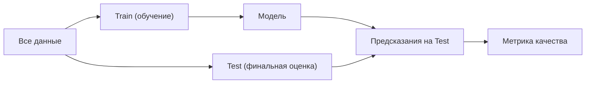
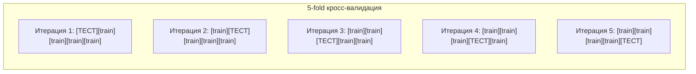
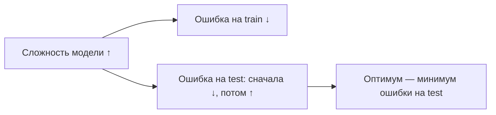
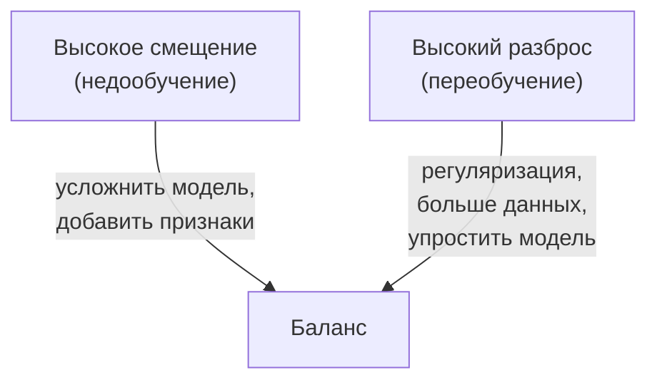
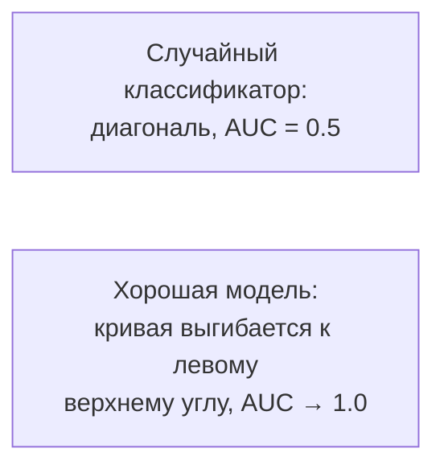

Модель, которая идеально предсказывает на данных, на которых обучалась, может оказаться бесполезной в реальности. Цель оценки качества — честно оценить, как модель поведёт себя на **новых, ранее не виденных** данных. Этот раздел про то, как организовать такую проверку и какими числами измерять результат.

Если вы ещё не знакомы с базовыми понятиями обучения, начните с раздела [Машинное обучение](/machine-learning/). Метрики опираются на [вероятность](/probability/) и [статистику](/statistics/), а практику удобно отрабатывать на [Python для анализа данных](/python-data/).

## Зачем вообще разделять данные

Ключевая идея: оценивать модель надо на данных, которые она **не видела при обучении**. Иначе мы измеряем способность запоминать, а не обобщать.



### Разбиение train/test

Самый простой подход — один раз случайно разделить данные, например 80% на обучение и 20% на тест.

```python
from sklearn.model_selection import train_test_split

X_train, X_test, y_train, y_test = train_test_split(
    X, y, test_size=0.2, random_state=42, stratify=y
)
```

Параметр `stratify=y` сохраняет долю классов в обеих частях — это особенно важно для несбалансированных задач. `random_state` фиксирует случайность, чтобы результат был воспроизводимым.

:::caution[Тест трогаем один раз]
Тестовую выборку используют **только** для финальной оценки. Если подбирать гиперпараметры по тесту, он перестаёт быть честным — информация о нём «протекает» в модель. Для подбора параметров используйте отдельную валидационную выборку или кросс-валидацию.
:::

### Кросс-валидация (k-fold)

При одном разбиении оценка зависит от того, какие именно объекты попали в тест. **k-fold кросс-валидация** убирает эту лотерею: данные делят на $k$ равных частей (folds), модель обучают $k$ раз, каждый раз используя одну часть как валидацию, а остальные $k-1$ — для обучения.



Итоговая оценка — среднее по фолдам, а её разброс показывает стабильность модели:

$$
\text{CV score} = \frac{1}{k}\sum_{i=1}^{k} \text{score}_i
$$

```python
from sklearn.model_selection import cross_val_score, StratifiedKFold

cv = StratifiedKFold(n_splits=5, shuffle=True, random_state=42)
scores = cross_val_score(model, X, y, cv=cv, scoring="f1")
print(f"F1: {scores.mean():.3f} ± {scores.std():.3f}")
```

:::tip
`StratifiedKFold` сохраняет баланс классов в каждом фолде. Для временных рядов обычная кросс-валидация **неприменима** — нельзя обучаться на будущем и предсказывать прошлое. Используйте `TimeSeriesSplit`.
:::

| Метод | Когда применять | Плюсы | Минусы |
|---|---|---|---|
| Hold-out (train/test) | Много данных, быстрый прогон | Прост, быстр | Оценка шумная, зависит от разбиения |
| k-fold CV | Средний объём данных | Стабильная оценка + разброс | В $k$ раз дольше обучать |
| Stratified k-fold | Несбалансированные классы | Сохраняет доли классов | То же, что k-fold |
| TimeSeriesSplit | Временные ряды | Учитывает порядок времени | Часть данных не используется для теста |

## Переобучение, недообучение и компромисс bias-variance

Когда модель работает плохо, причина обычно в одном из двух перекосов.

- **Недообучение (underfitting):** модель слишком простая, не улавливает закономерность. Плохо и на train, и на test.
- **Переобучение (overfitting):** модель слишком сложная, выучила шум обучающей выборки. Отлично на train, плохо на test.



### Разложение ошибки

Ожидаемую ошибку предсказания в точке можно разложить на три составляющие:

$$
\mathbb{E}\big[(y - \hat{f}(x))^2\big] = \underbrace{\big(\text{Bias}[\hat{f}(x)]\big)^2}_{\text{смещение}} + \underbrace{\text{Var}[\hat{f}(x)]}_{\text{разброс}} + \underbrace{\sigma^2}_{\text{шум}}
$$

- **Смещение (bias)** — систематическая ошибка от слишком грубых предположений. Высокое смещение = недообучение.
- **Разброс (variance)** — чувствительность модели к конкретной обучающей выборке. Высокий разброс = переобучение.
- **Шум** ($\sigma^2$) — неустранимая ошибка в самих данных.

Уменьшая одно, обычно увеличиваешь другое — это и есть **компромисс смещения и разброса**.



:::note[Как распознать на практике]
Сравните качество на train и на валидации. Большой разрыв (train высоко, valid низко) — переобучение. Низко на обоих — недообучение. Кривые обучения (learning curves) помогают увидеть, поможет ли больше данных.
:::

## Метрики классификации

### Матрица ошибок (confusion matrix)

Основа всех метрик классификации. Для бинарной задачи (положительный/отрицательный класс):

| | Предсказано «+» | Предсказано «−» |
|---|---|---|
| **На самом деле «+»** | TP (истинно положит.) | FN (ложно отриц.) |
| **На самом деле «−»** | FP (ложно положит.) | TN (истинно отриц.) |

Здесь TP, TN — верные предсказания, а FP («ложная тревога») и FN («пропуск») — два разных типа ошибок, цена которых в задачах часто несимметрична.

### Accuracy (доля верных ответов)

$$
\text{Accuracy} = \frac{TP + TN}{TP + TN + FP + FN}
$$

Простая и интуитивная, но **обманчива на несбалансированных данных**. Если 99% объектов одного класса, модель «всегда отвечай большинство» даст 99% accuracy, не научившись ничему.

### Precision и Recall

$$
\text{Precision} = \frac{TP}{TP + FP}, \qquad \text{Recall} = \frac{TP}{TP + FN}
$$

- **Precision (точность)** отвечает на вопрос: «Среди объектов, которые модель назвала положительными, сколько действительно положительны?» Важна, когда дорога ложная тревога (например, помечать письмо как спам).
- **Recall (полнота)** отвечает: «Сколько из всех реально положительных объектов модель нашла?» Важна, когда дорог пропуск (например, диагностика болезни, выявление мошенничества).

### F1-мера

Гармоническое среднее precision и recall — единое число, когда важны оба:

$$
F_1 = 2 \cdot \frac{\text{Precision} \cdot \text{Recall}}{\text{Precision} + \text{Recall}}
$$

Гармоническое среднее «штрафует» дисбаланс: если хоть одна из метрик мала, $F_1$ тоже мала. Обобщение $F_\beta$ позволяет придать больший вес recall ($\beta>1$) или precision ($\beta<1$):

$$
F_\beta = (1+\beta^2)\cdot\frac{\text{Precision}\cdot\text{Recall}}{\beta^2\cdot\text{Precision} + \text{Recall}}
$$

### ROC-кривая и AUC

Большинство классификаторов выдают не метку, а **вероятность**. Меняя порог отсечения, мы балансируем между типами ошибок. ROC-кривая показывает этот компромисс, откладывая по осям:

$$
\text{TPR} = \frac{TP}{TP+FN} \;(=\text{Recall}), \qquad \text{FPR} = \frac{FP}{FP+TN}
$$



**AUC** (area under the ROC curve) — площадь под кривой, от 0.5 (случай) до 1.0 (идеал). Удобная интерпретация: AUC равна вероятности того, что случайно взятый положительный объект получит более высокий балл, чем случайно взятый отрицательный. AUC не зависит от выбора порога и устойчива к дисбалансу классов лучше, чем accuracy.

:::tip[PR-кривая при сильном дисбалансе]
При очень редком положительном классе ROC может выглядеть оптимистично из-за большого числа TN. В таких случаях информативнее **precision-recall кривая** и метрика average precision (AP).
:::

```python
from sklearn.metrics import (
    confusion_matrix, classification_report, roc_auc_score
)

y_pred = model.predict(X_test)
y_proba = model.predict_proba(X_test)[:, 1]

print(confusion_matrix(y_test, y_pred))
print(classification_report(y_test, y_pred))
print("AUC:", roc_auc_score(y_test, y_proba))  # для AUC нужны вероятности!
```

## Метрики регрессии

В регрессии предсказываем число, поэтому измеряем величину отклонения $\hat{y}_i$ от истинного $y_i$.

### MAE — средняя абсолютная ошибка

$$
\text{MAE} = \frac{1}{n}\sum_{i=1}^{n} |y_i - \hat{y}_i|
$$

В тех же единицах, что и целевая переменная, легко интерпретируется («в среднем ошибаемся на X рублей»). Устойчива к выбросам.

### MSE и RMSE

$$
\text{MSE} = \frac{1}{n}\sum_{i=1}^{n} (y_i - \hat{y}_i)^2, \qquad \text{RMSE} = \sqrt{\text{MSE}}
$$

Возведение в квадрат сильнее штрафует крупные ошибки, поэтому MSE/RMSE чувствительны к выбросам. RMSE удобнее MSE, так как возвращается в исходные единицы измерения.

### R² — коэффициент детерминации

$$
R^2 = 1 - \frac{\sum_i (y_i - \hat{y}_i)^2}{\sum_i (y_i - \bar{y})^2}
$$

Показывает долю дисперсии целевой переменной, объяснённую моделью. $R^2 = 1$ — идеал, $R^2 = 0$ — модель не лучше предсказания средним $\bar{y}$, $R^2 < 0$ — модель хуже константы.

| Метрика | Единицы | Чувствительность к выбросам | Интерпретация |
|---|---|---|---|
| MAE | как у $y$ | низкая | средняя ошибка |
| MSE | квадрат $y$ | высокая | для оптимизации |
| RMSE | как у $y$ | высокая | «типичная» ошибка |
| R² | безразмерна | средняя | доля объяснённой дисперсии |

```python
from sklearn.metrics import mean_absolute_error, mean_squared_error, r2_score
import numpy as np

mae = mean_absolute_error(y_test, y_pred)
rmse = np.sqrt(mean_squared_error(y_test, y_pred))
r2 = r2_score(y_test, y_pred)
print(f"MAE={mae:.2f}  RMSE={rmse:.2f}  R2={r2:.3f}")
```

## Выбор метрики под задачу

Нет «лучшей» метрики — есть подходящая под цель и под стоимость ошибок.

- **Сбалансированная классификация, ошибки равноценны:** accuracy, AUC.
- **Несбалансированные классы:** забудьте про accuracy. Смотрите precision, recall, F1, PR-AUC. Решите, что дороже — ложная тревога (precision) или пропуск (recall).
- **Медицина, мошенничество, безопасность:** обычно приоритет recall (нельзя пропускать), но следите за precision, чтобы не утонуть в ложных срабатываниях.
- **Регрессия с выбросами:** MAE устойчивее; если крупные ошибки критичны — RMSE.
- **Сравнение моделей между задачами:** безразмерные метрики (R², AUC).

:::caution[Метрика обучения ≠ бизнес-метрика]
Модель оптимизирует функцию потерь, а вы оцениваете её прикладной метрикой. Они могут расходиться. Всегда держите в голове, какое решение модель будет поддерживать в реальности, и подбирайте порог/метрику под цену ошибок, а не под красивое число.
:::

## Утечки данных (data leakage)

**Утечка** — это когда в обучение просачивается информация, недоступная в момент реального предсказания. Результат: на оценке метрики прекрасные, в продакшене модель проваливается. Это самая частая причина «слишком хороших» результатов.

Типичные источники утечки:

- **Препроцессинг до разбиения.** Масштабирование, заполнение пропусков, отбор признаков, обученные на **всех** данных, «подсматривают» статистику теста. Все обучаемые преобразования настраивайте только на train.
- **Признаки из будущего.** Поле, которое заполняется уже после события-цели (например, «дата закрытия сделки» при прогнозе самого факта закрытия).
- **Целевая переменная в признаках.** Прямая или закодированная утечка target в фичи (например, неаккуратный target encoding без кросс-валидации).
- **Дубликаты и группы.** Один и тот же объект (или связанные записи одного пользователя) попал и в train, и в test — используйте `GroupKFold`.

Правильный способ — упаковать препроцессинг и модель в единый `Pipeline`, тогда внутри кросс-валидации каждый фолд масштабируется по своему train:

```python
from sklearn.pipeline import Pipeline
from sklearn.preprocessing import StandardScaler
from sklearn.linear_model import LogisticRegression
from sklearn.model_selection import cross_val_score

pipe = Pipeline([
    ("scaler", StandardScaler()),       # обучается отдельно на каждом train-фолде
    ("clf", LogisticRegression(max_iter=1000)),
])

scores = cross_val_score(pipe, X, y, cv=5, scoring="roc_auc")
print(scores.mean())
```

:::danger[Главное правило]
Любое преобразование, которое «учится» по данным (среднее, std, словарь категорий, отбор признаков), должно видеть **только** обучающую часть. Test и валидационные фолды — всегда «новые» данные.
:::

## Задания

### Задание 1. Считаем метрики по матрице ошибок

Бинарный классификатор болезни дал на тесте: TP = 40, FP = 10, FN = 20, TN = 430. Посчитайте accuracy, precision, recall и F1. Какая метрика здесь важнее и почему?

<details>
<summary>Решение</summary>

Всего объектов: $40 + 10 + 20 + 430 = 500$.

$$
\text{Accuracy} = \frac{TP+TN}{n} = \frac{40+430}{500} = 0{,}94
$$

$$
\text{Precision} = \frac{TP}{TP+FP} = \frac{40}{40+10} = 0{,}80
$$

$$
\text{Recall} = \frac{TP}{TP+FN} = \frac{40}{40+20} \approx 0{,}667
$$

$$
F_1 = 2\cdot\frac{0{,}80\cdot 0{,}667}{0{,}80 + 0{,}667} \approx 2\cdot\frac{0{,}533}{1{,}467} \approx 0{,}727
$$

Accuracy высокая (0.94) в основном из-за большого числа здоровых (TN). Но это **несбалансированная медицинская задача**, где важно не пропускать больных, то есть приоритетен **recall**. А он всего ~0.67 — модель пропускает треть больных. Accuracy здесь вводит в заблуждение.

</details>

### Задание 2. Где спряталась утечка

Аналитик масштабировал все признаки `StandardScaler().fit_transform(X)` на полном датасете, затем сделал `train_test_split` и получил AUC = 0.97. В продакшене модель показывает AUC = 0.82. В чём ошибка и как исправить?

<details>
<summary>Решение</summary>

Утечка данных при препроцессинге: `StandardScaler` обучился (посчитал среднее и std) на **всём** датасете, включая будущую тестовую часть. Тест перестал быть «новыми» данными — его статистика просочилась в обучение, оценка завышена.

Исправление — настраивать скейлер только на train. Удобнее всего через `Pipeline`, чтобы это автоматически соблюдалось и внутри кросс-валидации:

```python
from sklearn.pipeline import Pipeline
from sklearn.preprocessing import StandardScaler

pipe = Pipeline([
    ("scaler", StandardScaler()),
    ("clf", model),
])
pipe.fit(X_train, y_train)        # scaler учится только на train
auc = pipe.score(X_test, y_test)  # test остаётся честным
```

Цифра 0.82 ближе к реальному качеству; 0.97 была иллюзией.

</details>

### Задание 3. bias или variance

У модели на train accuracy = 0.99, на валидации accuracy = 0.71. У другой модели: train = 0.72, валидация = 0.70. Диагностируйте каждую и предложите по одному действию.

<details>
<summary>Решение</summary>

**Модель A (0.99 / 0.71):** большой разрыв между train и валидацией — классическое **переобучение (высокий variance)**. Модель выучила шум. Действия: регуляризация, упрощение модели, больше данных, ранняя остановка.

**Модель B (0.72 / 0.70):** низкое качество на обоих, разрыва почти нет — **недообучение (высокое смещение, bias)**. Модель слишком проста. Действия: усложнить модель, добавить признаки/полиномиальные взаимодействия, ослабить регуляризацию.

</details>

### Задание 4. Регрессия и выброс

Истинные значения $y = [10, 12, 14, 16, 100]$, предсказания $\hat{y} = [11, 13, 13, 15, 40]$. Посчитайте MAE и RMSE. Объясните, почему они так сильно различаются.

<details>
<summary>Решение</summary>

Ошибки (по модулю): $|10-11|, |12-13|, |14-13|, |16-15|, |100-40| = 1, 1, 1, 1, 60$.

$$
\text{MAE} = \frac{1+1+1+1+60}{5} = \frac{64}{5} = 12{,}8
$$

Квадраты ошибок: $1, 1, 1, 1, 3600$.

$$
\text{MSE} = \frac{1+1+1+1+3600}{5} = \frac{3604}{5} = 720{,}8, \qquad \text{RMSE} = \sqrt{720{,}8} \approx 26{,}85
$$

RMSE (≈26.85) намного больше MAE (12.8), потому что возведение в квадрат резко усиливает вклад единственной большой ошибки (60) на выбросе $y=100$. MAE считает все ошибки линейно и потому устойчивее к выбросам. Выбор метрики зависит от того, насколько критичны для задачи именно крупные промахи.

</details>
