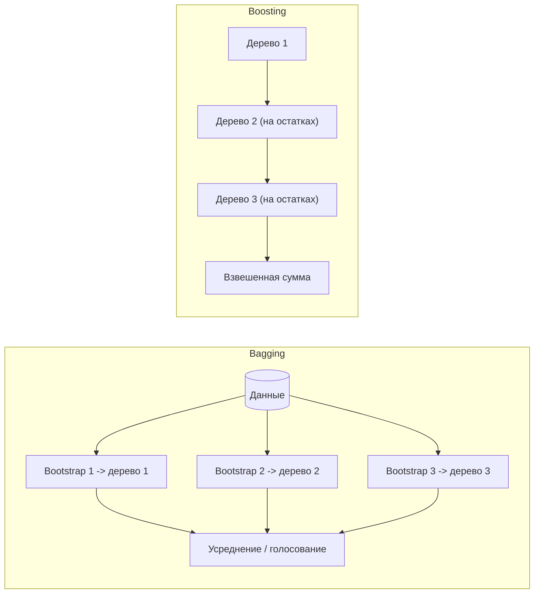
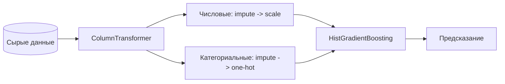

Это сводная страница заданий по всей теме [машинного обучения](/machine-learning/intro/). Задачи сгруппированы по уровням сложности и покрывают ключевые идеи: [типы задач](/machine-learning/types/), [пайплайн обучения](/machine-learning/workflow/), [линейные модели](/machine-learning/linear-models/), [деревья и ансамбли](/machine-learning/trees-ensembles/), [прочие алгоритмы](/machine-learning/other-algorithms/), [метрики качества](/machine-learning/evaluation/), [работу с признаками](/machine-learning/feature-engineering/) и [нейросети](/machine-learning/neural-networks/).

:::tip[Как работать со страницей]
Сначала честно решите задачу сами — на бумаге для вычислительных и в редакторе/ноутбуке для кодовых. Только потом раскрывайте блок с решением. Если застряли, вернитесь к соответствующему разделу теории по ссылке и попробуйте снова. Полезно держать рядом [глоссарий](/machine-learning/glossary/).
:::

## Базовый уровень

Задачи на понимание базовых понятий: типы обучения, метрики, переобучение, утечка данных.

### Задание 1. Классификация типа задачи

Для каждого сценария определите тип ML-задачи (обучение с учителем / без учителя; классификация / регрессия / кластеризация) и приведите подходящую метрику качества.

1. Предсказать стоимость квартиры по площади, этажу и району.
2. Разбить клиентов интернет-магазина на группы по поведению, заранее не зная групп.
3. Определить, является ли письмо спамом.
4. Предсказать, сколько товаров купит пользователь за месяц.
5. Распознать, какая из 10 цифр изображена на картинке.

<details>
<summary>Решение</summary>

1. Обучение с учителем, **регрессия** (целевая величина непрерывна). Метрика: $\text{MAE}$, $\text{RMSE}$ или $R^2$.
2. Обучение **без учителя**, **кластеризация** (меток нет). Метрика: silhouette score, inertia (для подбора числа кластеров).
3. Обучение с учителем, **бинарная классификация**. Метрика: precision/recall, $F_1$, ROC-AUC (классы часто несбалансированы).
4. Обучение с учителем, **регрессия** (счётная неотрицательная величина). Метрика: $\text{MAE}$/$\text{RMSE}$, иногда специализированные (например, пуассоновское отклонение).
5. Обучение с учителем, **многоклассовая классификация**. Метрика: accuracy, macro-$F_1$, матрица ошибок.

Подробнее — в разделе [типы задач](/machine-learning/types/).

</details>

### Задание 2. Матрица ошибок и метрики

Бинарный классификатор протестировали на 200 объектах. Получена матрица ошибок:

| | Предсказано «+» | Предсказано «−» |
|---|---|---|
| **Истинно «+»** | TP = 40 | FN = 10 |
| **Истинно «−»** | FP = 30 | TN = 120 |

Вычислите accuracy, precision, recall и $F_1$.

<details>
<summary>Решение</summary>

$$\text{accuracy} = \frac{TP + TN}{\text{всего}} = \frac{40 + 120}{200} = 0{,}80$$

$$\text{precision} = \frac{TP}{TP + FP} = \frac{40}{40 + 30} = \frac{40}{70} \approx 0{,}571$$

$$\text{recall} = \frac{TP}{TP + FN} = \frac{40}{40 + 10} = \frac{40}{50} = 0{,}80$$

$$F_1 = \frac{2 \cdot \text{precision} \cdot \text{recall}}{\text{precision} + \text{recall}} = \frac{2 \cdot 0{,}571 \cdot 0{,}80}{0{,}571 + 0{,}80} \approx 0{,}667$$

Высокий recall при умеренной precision: модель почти не пропускает положительные объекты, но часто ложно срабатывает. Детали метрик — в разделе [оценка качества](/machine-learning/evaluation/).

</details>

### Задание 3. Переобучение или недообучение

По описанию определите, что происходит с моделью, и предложите 1–2 действия.

1. Точность на train = 0,99, на validation = 0,71.
2. Точность на train = 0,68, на validation = 0,67.
3. Дерево решений без ограничения глубины идеально классифицирует обучающую выборку.

<details>
<summary>Решение</summary>

1. **Переобучение (overfitting)**: большой разрыв train–val. Действия: регуляризация, упрощение модели, больше данных, ранняя остановка, сильнее кросс-валидация.
2. **Недообучение (underfitting)**: обе метрики низкие и близкие. Действия: усложнить модель, добавить признаки/нелинейности, уменьшить регуляризацию, дольше обучать.
3. **Переобучение**: дерево запомнило выборку (включая шум). Действия: ограничить `max_depth`, `min_samples_leaf`, прунинг, перейти к ансамблю (см. [деревья и ансамбли](/machine-learning/trees-ensembles/)).

Общая логика диагностики — в [пайплайне обучения](/machine-learning/workflow/).

</details>

### Задание 4. Поиск утечки данных

В пайплайне предсказания оттока клиентов есть подозрение на утечку (data leakage). Найдите проблему в каждом пункте.

1. Масштабирование признаков (`StandardScaler`) обучили на всём датасете, потом разбили на train/test.
2. В признаки попала колонка `refund_amount` — сумма возврата, которая оформляется только после ухода клиента.
3. Пропуски заполнили средним по всему датасету до разбиения.

<details>
<summary>Решение</summary>

1. **Утечка через препроцессинг**: `StandardScaler` «увидел» среднее и дисперсию тестовых объектов. Правильно — `fit` только на train, `transform` на test. Лучше через `Pipeline`.
2. **Утечка из будущего (target leakage)**: признак физически становится известен после события, которое мы предсказываем. Его нужно исключить.
3. То же, что и в п.1 — статистики для импьютации должны считаться **только** по train.

Тема разобрана в [feature engineering](/machine-learning/feature-engineering/) и [пайплайне](/machine-learning/workflow/).

</details>

## Средний уровень

Вычислительные задачи и небольшой код: линейные модели, градиентный спуск, регуляризация, кросс-валидация, метрики ранжирования.

### Задание 5. Шаг градиентного спуска для линейной регрессии

Модель $\hat{y} = w x + b$, функция потерь — MSE на двух точках $(x_1, y_1) = (1, 2)$ и $(x_2, y_2) = (2, 2)$:

$$L = \frac{1}{2}\sum_{i=1}^{2}(w x_i + b - y_i)^2$$

Начальные параметры $w = 0$, $b = 0$, скорость обучения $\eta = 0{,}1$. Сделайте **один** шаг градиентного спуска и найдите новые $w, b$.

<details>
<summary>Решение</summary>

Остатки при $w=b=0$: $r_i = w x_i + b - y_i = -y_i$, то есть $r_1 = -2$, $r_2 = -2$.

Частные производные:

$$\frac{\partial L}{\partial w} = \sum_i r_i x_i = (-2)(1) + (-2)(2) = -6$$

$$\frac{\partial L}{\partial b} = \sum_i r_i = (-2) + (-2) = -4$$

Обновление $\theta \leftarrow \theta - \eta \,\nabla_\theta L$:

$$w = 0 - 0{,}1 \cdot (-6) = 0{,}6, \qquad b = 0 - 0{,}1 \cdot (-4) = 0{,}4$$

После шага $w = 0{,}6$, $b = 0{,}4$ — параметры сдвинулись в сторону уменьшения ошибки. Подробнее о методе — в [линейных моделях](/machine-learning/linear-models/) и в разделе [производных](/calculus/).

</details>

### Задание 6. Сигмоида и логистическая регрессия

Логистическая регрессия даёт линейную комбинацию $z = w_1 x_1 + w_2 x_2 + b$ с весами $w_1 = 1{,}5$, $w_2 = -2$, $b = 0{,}5$. Для объекта $x_1 = 2$, $x_2 = 1$:

1. Вычислите $z$ и вероятность $p = \sigma(z)$, где $\sigma(z) = \dfrac{1}{1 + e^{-z}}$.
2. При пороге $0{,}5$ — какой класс предскажет модель?

<details>
<summary>Решение</summary>

$$z = 1{,}5 \cdot 2 + (-2)\cdot 1 + 0{,}5 = 3 - 2 + 0{,}5 = 1{,}5$$

$$p = \sigma(1{,}5) = \frac{1}{1 + e^{-1{,}5}} = \frac{1}{1 + 0{,}2231} \approx \frac{1}{1{,}2231} \approx 0{,}818$$

Так как $p = 0{,}818 > 0{,}5$, модель предсказывает **класс 1** (положительный).

Связь линейной комбинации с вероятностью — основа [линейных моделей](/machine-learning/linear-models/); о самой функции и логарифмах — в [вероятности](/probability/).

</details>

### Задание 7. L1 vs L2: какая регуляризация занулит веса

Сравните L1 (Lasso) и L2 (Ridge) регуляризацию.

1. Какая из них склонна обнулять часть весов и почему?
2. К целевой функции добавляют штраф $\lambda R(w)$. Запишите $R(w)$ для L1 и L2.
3. Что произойдёт с весами при росте $\lambda \to \infty$?

<details>
<summary>Решение</summary>

1. **L1 (Lasso)** зануляет веса. Геометрически область ограничения $\sum|w_j| \le t$ имеет «углы» на осях координат, и оптимум часто попадает в них (где часть координат равна нулю) — отсюда разреженность и автоматический отбор признаков. L2 даёт круглую область, веса лишь сжимаются к нулю, но не обнуляются.

2. Штрафы:

$$R_{L1}(w) = \sum_{j} |w_j|, \qquad R_{L2}(w) = \sum_{j} w_j^2$$

3. При $\lambda \to \infty$ штраф доминирует, и все веса $w_j \to 0$ (модель вырождается в предсказание константы — сильное недообучение).

Подробнее — в [линейных моделях](/machine-learning/linear-models/); о нормах векторов — в [линейной алгебре](/linear-algebra/).

</details>

### Задание 8. K-Fold кросс-валидация на scikit-learn

Напишите код, который оценивает `RandomForestClassifier` на датасете `load_breast_cancer` с помощью 5-блочной стратифицированной кросс-валидации по метрике ROC-AUC и выводит среднее и стандартное отклонение.

<details>
<summary>Решение</summary>

```python
import numpy as np
from sklearn.datasets import load_breast_cancer
from sklearn.ensemble import RandomForestClassifier
from sklearn.model_selection import StratifiedKFold, cross_val_score

X, y = load_breast_cancer(return_X_y=True)

model = RandomForestClassifier(n_estimators=300, random_state=42)
cv = StratifiedKFold(n_splits=5, shuffle=True, random_state=42)

scores = cross_val_score(model, X, y, cv=cv, scoring="roc_auc")
print(f"ROC-AUC: {scores.mean():.4f} +/- {scores.std():.4f}")
```

Ключевые идеи: `StratifiedKFold` сохраняет пропорцию классов в каждом блоке; `scoring="roc_auc"` задаёт метрику; усреднение по фолдам даёт устойчивую оценку обобщающей способности. См. [пайплайн обучения](/machine-learning/workflow/) и [оценку качества](/machine-learning/evaluation/).

</details>

### Задание 9. Энтропия и прирост информации в дереве

В узле дерева 10 объектов: 6 класса «+» и 4 класса «−». Признак разбивает узел на две ветви:

- левая: 4 объекта «+», 0 «−»;
- правая: 2 «+», 4 «−».

Вычислите энтропию родительского узла и информационный прирост (information gain) разбиения. Энтропия: $H = -\sum_k p_k \log_2 p_k$.

<details>
<summary>Решение</summary>

Родитель ($p_+ = 0{,}6$, $p_- = 0{,}4$):

$$H_{\text{parent}} = -0{,}6\log_2 0{,}6 - 0{,}4\log_2 0{,}4 \approx -0{,}6(-0{,}737) - 0{,}4(-1{,}322) \approx 0{,}442 + 0{,}529 = 0{,}971$$

Левая ветвь — чистая, $H_L = 0$.

Правая ветвь ($p_+ = \tfrac{2}{6}$, $p_- = \tfrac{4}{6}$):

$$H_R = -\tfrac{1}{3}\log_2 \tfrac{1}{3} - \tfrac{2}{3}\log_2 \tfrac{2}{3} \approx 0{,}333\cdot 1{,}585 + 0{,}667\cdot 0{,}585 \approx 0{,}528 + 0{,}390 = 0{,}918$$

Взвешенная энтропия потомков (веса $\tfrac{4}{10}$ и $\tfrac{6}{10}$):

$$H_{\text{children}} = 0{,}4\cdot 0 + 0{,}6\cdot 0{,}918 = 0{,}551$$

Прирост информации:

$$IG = H_{\text{parent}} - H_{\text{children}} = 0{,}971 - 0{,}551 = 0{,}420$$

Положительный прирост означает, что разбиение уменьшает неопределённость. Подробнее — в [деревьях и ансамблях](/machine-learning/trees-ensembles/).

</details>

## Продвинутый уровень

Задачи на ансамбли, нейросети, дисбаланс классов и сборку полноценного пайплайна.

### Задание 10. Bagging vs Boosting

Сравните бэггинг (например, случайный лес) и бустинг (например, градиентный бустинг). Заполните таблицу и поясните, при каком сценарии что предпочесть.

| Свойство | Bagging | Boosting |
|---|---|---|
| Как строятся деревья | ? | ? |
| Что снижается в bias-variance | ? | ? |
| Чувствительность к шуму/выбросам | ? | ? |
| Параллелизуемость обучения | ? | ? |

<details>
<summary>Решение</summary>

| Свойство | Bagging | Boosting |
|---|---|---|
| Как строятся деревья | независимо, на bootstrap-подвыборках, параллельно | последовательно, каждое исправляет ошибки предыдущих |
| Что снижается в bias-variance | в основном **variance** (усреднение независимых моделей) | в основном **bias** (постепенное добавление слабых моделей) |
| Чувствительность к шуму/выбросам | ниже (усреднение сглаживает) | выше (модель «дообучается» на сложных, в т.ч. шумных, объектах) |
| Параллелизуемость обучения | высокая (деревья независимы) | низкая по своей природе (есть инженерные оптимизации в XGBoost/LightGBM) |

Схема различия потоков построения:



**Когда что:** бэггинг — когда базовые модели сильно переобучаются и нужно снизить дисперсию; бустинг — когда нужна максимальная точность на табличных данных и есть время на аккуратную настройку (регуляризация, learning rate, ранняя остановка). Подробнее — в [деревьях и ансамблях](/machine-learning/trees-ensembles/).

</details>

### Задание 11. Forward-pass нейрона с ReLU

Однослойная сеть: вход $x = (1, -2, 3)$, веса $w = (0{,}5, 1{,}0, -0{,}5)$, смещение $b = 1$. Активация ReLU: $\text{ReLU}(z) = \max(0, z)$.

1. Вычислите выход нейрона.
2. Чему равна производная ReLU по $z$ в этой точке (важно для обратного распространения)?
3. Что было бы на выходе при $w = (0{,}5, 1{,}0, 0{,}5)$ (изменён знак третьего веса)?

<details>
<summary>Решение</summary>

1. Линейная комбинация:

$$z = 0{,}5\cdot 1 + 1{,}0\cdot(-2) + (-0{,}5)\cdot 3 + 1 = 0{,}5 - 2 - 1{,}5 + 1 = -2$$

$$a = \text{ReLU}(-2) = \max(0, -2) = 0$$

2. Производная ReLU: $\text{ReLU}'(z) = 1$ при $z > 0$ и $0$ при $z < 0$. Здесь $z = -2 < 0$, поэтому производная равна **0** — нейрон «мёртв» на этом примере, градиент через него не проходит (проблема dying ReLU).

3. С новым весом:

$$z = 0{,}5 - 2 + 1{,}5 + 1 = 1, \qquad a = \text{ReLU}(1) = 1$$

Теперь нейрон активен, производная равна 1. Подробнее о прямом и обратном проходе — в [нейронных сетях](/machine-learning/neural-networks/); о цепном правиле — в [производных](/calculus/).

</details>

### Задание 12. Дисбаланс классов и выбор метрики

Датасет фрода: 99% транзакций легитимны, 1% мошеннические. Модель A всегда предсказывает «не фрод».

1. Чему равна accuracy модели A? Почему метрика обманчива?
2. Какие метрики и приёмы использовать вместо accuracy?
3. Напишите код, обучающий логистическую регрессию с учётом дисбаланса и считающий precision/recall/PR-AUC.

<details>
<summary>Решение</summary>

1. Accuracy $= 0{,}99$ (99% объектов класса «не фрод»), но recall по фроду равен **0** — модель не ловит ни одного мошенника. На сильно несбалансированных данных accuracy не отражает полезность.

2. Использовать: **precision/recall**, $F_1$, **PR-AUC** (информативнее ROC-AUC при сильном дисбалансе), матрицу ошибок. Приёмы: `class_weight="balanced"`, передискретизация (SMOTE/undersampling), настройка порога по бизнес-стоимости ошибок.

3. Пример кода:

```python
from sklearn.datasets import make_classification
from sklearn.linear_model import LogisticRegression
from sklearn.model_selection import train_test_split
from sklearn.metrics import (
    precision_score, recall_score, average_precision_score,
)

X, y = make_classification(
    n_samples=10000, weights=[0.99, 0.01],
    n_informative=5, random_state=42,
)
X_tr, X_te, y_tr, y_te = train_test_split(
    X, y, test_size=0.3, stratify=y, random_state=42,
)

clf = LogisticRegression(class_weight="balanced", max_iter=1000)
clf.fit(X_tr, y_tr)

proba = clf.predict_proba(X_te)[:, 1]
pred = (proba >= 0.5).astype(int)

print(f"precision: {precision_score(y_te, pred):.3f}")
print(f"recall:    {recall_score(y_te, pred):.3f}")
print(f"PR-AUC:    {average_precision_score(y_te, proba):.3f}")
```

Разбор метрик при дисбалансе — в [оценке качества](/machine-learning/evaluation/), про балансировку признаков и сэмплинг — в [feature engineering](/machine-learning/feature-engineering/).

</details>

### Задание 13. Сборка end-to-end пайплайна

Соберите воспроизводимый scikit-learn `Pipeline` для смешанных данных (числовые + категориальные): импьютация, масштабирование числовых, one-hot для категориальных, затем градиентный бустинг. Объясните, почему препроцессинг должен быть внутри `Pipeline`.

<details>
<summary>Решение</summary>

```python
import pandas as pd
from sklearn.compose import ColumnTransformer
from sklearn.pipeline import Pipeline
from sklearn.impute import SimpleImputer
from sklearn.preprocessing import StandardScaler, OneHotEncoder
from sklearn.ensemble import HistGradientBoostingClassifier
from sklearn.model_selection import cross_val_score

num_cols = ["age", "income"]
cat_cols = ["city", "device"]

numeric = Pipeline([
    ("impute", SimpleImputer(strategy="median")),
    ("scale", StandardScaler()),
])
categorical = Pipeline([
    ("impute", SimpleImputer(strategy="most_frequent")),
    ("ohe", OneHotEncoder(handle_unknown="ignore")),
])

pre = ColumnTransformer([
    ("num", numeric, num_cols),
    ("cat", categorical, cat_cols),
])

pipe = Pipeline([
    ("pre", pre),
    ("model", HistGradientBoostingClassifier(random_state=42)),
])

# scores = cross_val_score(pipe, X, y, cv=5, scoring="roc_auc")
```

**Почему препроцессинг внутри Pipeline:** при кросс-валидации каждый шаг (`fit` импьютера, скейлера, энкодера) выполняется **только на тренировочной части** каждого фолда. Это предотвращает [утечку данных](/machine-learning/workflow/) (см. задание 4) и даёт честную оценку. Бонусом — пайплайн целиком сериализуется и применяется к новым данным одной командой `predict`.



Тема целиком — в [практике ML](/machine-learning/practice/) и [пайплайне обучения](/machine-learning/workflow/).

</details>

:::note[Что дальше]
Если задачи дались легко — переходите к [практическому проекту](/machine-learning/practice/) на реальном датасете. Если где-то застряли, точечно повторите теорию по ссылкам в решениях и вернитесь к заданию. Терминологию всегда можно свериться в [глоссарии](/machine-learning/glossary/).
:::
