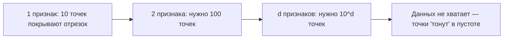
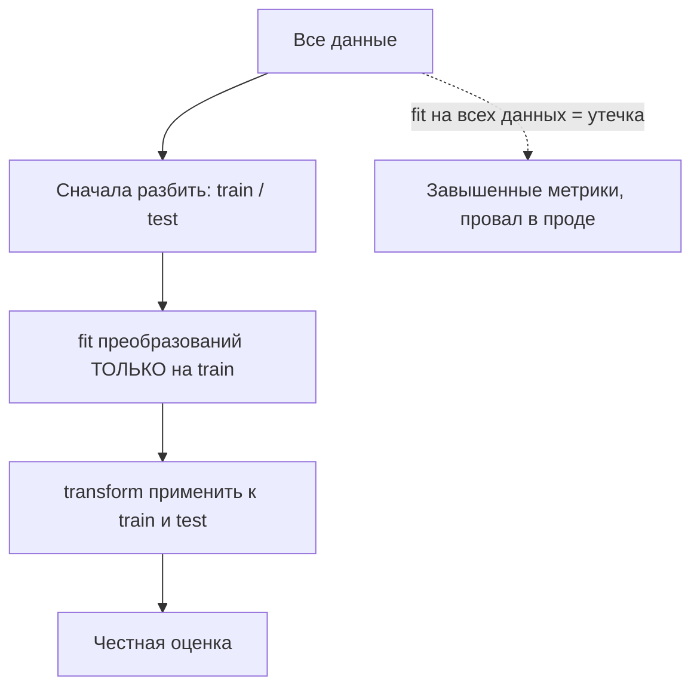

Модель учится не на «сырой реальности», а на признаках (features) — числах, которыми мы описываем каждый объект. Алгоритм видит ровно то, что вы ему дали: если важная закономерность не выражена ни в одном признаке, никакая модель её не найдёт. Поэтому есть полушутливое правило индустрии: «прикладной ML — это на 80% работа с признаками и на 20% выбор модели». Конструирование признаков (feature engineering) — это искусство превращать знание о предметной области в столбцы таблицы.

В этом разделе разберём, что такое признаки и почему их качество решает исход, как конструировать новые признаки из имеющихся, как отбирать полезные и отбрасывать вредные, что такое проклятие размерности и — самое опасное — как не допустить утечку данных (data leakage). Техническую сторону масштабирования и кодирования (какой `Scaler` вызвать, как собрать пайплайн) мы вынесли в [Подготовку данных](/python-data/data-prep/), а здесь сосредоточимся на смысле и конструировании. Математический фундамент — в [Линейной алгебре](/linear-algebra/) и [Статистике](/statistics/).

## Что такое признак и почему он решает исход

Объект для модели — это вектор признаков $\mathbf{x} = (x_1, x_2, \dots, x_d)$. Один и тот же объект (например, клиент банка) можно описать сотней разных способов, и от выбора описания напрямую зависит, сможет ли модель уловить закономерность.

Простой пример. Пусть мы предсказываем, попадёт ли точка $(a, b)$ внутрь единичной окружности. В исходных координатах граница — это кривая $a^2 + b^2 = 1$, и линейная модель её не отделит. Но стоит добавить один признак $r = \sqrt{a^2 + b^2}$ — и задача становится тривиальной: правило «$r < 1$» решает её идеально. Признак не добавил ни байта новой информации, он лишь представил её в форме, удобной для модели.


:::tip
Хорошие признаки делают границу между классами простой. Если приходится брать всё более сложную модель, чтобы хоть как-то разделить данные, — часто проблема не в модели, а в том, что нужный признак ещё не сконструирован.
:::

Признаки бывают разных типов, и от типа зависит, что с ними можно делать:

| Тип | Примеры | Особенности |
| --- | --- | --- |
| Числовой непрерывный | возраст, цена, температура | можно масштабировать, брать логарифм, считать разности |
| Числовой дискретный | число покупок, кол-во детей | целые значения, иногда ведут себя как категории |
| Категориальный номинальный | город, бренд, цвет | порядка нет, нужно кодирование |
| Категориальный порядковый | образование (нач./сред./высш.) | есть естественный порядок |
| Бинарный | да/нет, мужчина/женщина | частный случай категории, один столбец 0/1 |
| Дата/время | timestamp заказа | сами по себе бесполезны, ценны производные |
| Текст / изображение | отзыв, фото | требуют отдельного представления (векторизация) |

## Конструирование признаков

Конструирование — это создание новых столбцов из имеющихся данных и внешнего знания. Базовые приёмы перечислены ниже; их можно и нужно комбинировать.

### Математические преобразования

Иногда модели проще работать не с самой величиной, а с её преобразованием. Самый частый случай — логарифм для сильно скошенных распределений (доход, число просмотров, цена): он сжимает «хвост» и делает распределение ближе к симметричному.

$$
x' = \log(1 + x)
$$

Прибавление единицы (`log1p`) спасает от $\log 0$. Другие полезные преобразования: $\sqrt{x}$ (мягче логарифма), $1/x$, степени $x^2, x^3$ для нелинейных зависимостей, и общее семейство Бокса–Кокса.

```python
import numpy as np
import pandas as pd

df = pd.DataFrame({"income": [1_000, 5_000, 12_000, 250_000]})
df["income_log"] = np.log1p(df["income"])  # сжали хвост распределения
```

:::note
Логарифм имеет смысл только для неотрицательных величин и осмыслен, когда важны относительные, а не абсолютные изменения (рост дохода с 1000 до 2000 «весит» столько же, сколько с 100000 до 200000).
:::

### Взаимодействия признаков

Взаимодействие (interaction) — это комбинация двух или более признаков, которая несёт смысл, отсутствующий в каждом по отдельности. Чаще всего берут произведение или отношение.

$$
x_{\text{interaction}} = x_i \cdot x_j, \qquad x_{\text{ratio}} = \frac{x_i}{x_j}
$$

Примеры: `площадь = длина × ширина`; `цена_за_м2 = цена / площадь`; `нагрузка = запросы / число_серверов`. Линейная модель сама не умеет перемножать признаки — взаимодействие нужно дать ей явно. Деревья и градиентный бустинг улавливают взаимодействия автоматически, но и им явный признак-отношение нередко помогает.

```python
df = pd.DataFrame({"price": [200_000, 350_000], "area": [50, 70]})
df["price_per_m2"] = df["price"] / df["area"]  # 4000 и 5000
```

### Агрегаты и групповые статистики

Очень мощный приём для табличных и транзакционных данных — посчитать статистику по группе и «приклеить» её к каждому объекту. Например, для каждого пользователя — средний чек, число заказов, дисперсия времени между покупками.

```python
orders = pd.DataFrame({
    "user_id": [1, 1, 1, 2, 2],
    "amount":  [100, 300, 200, 50, 90],
})
agg = orders.groupby("user_id")["amount"].agg(["mean", "sum", "count"])
agg.columns = ["amount_mean", "amount_sum", "amount_count"]
# присоединяем агрегаты обратно к транзакциям
orders = orders.merge(agg, on="user_id")
```

Подробнее о `groupby`, `agg` и `merge` — в разделе про [pandas](/python-data/pandas/).

:::caution
Агрегаты — частый источник утечки. Если считать среднее по группе на всём датасете (включая тест), статистика «подсмотрит» будущее. Считайте агрегаты только на train или используйте схему out-of-fold (см. ниже).
:::

### Признаки из даты и времени

Голый timestamp модели почти бесполезен. Ценность — в производных, которые отражают человеческие и сезонные циклы.

```python
ts = pd.to_datetime(df["order_time"])
df["hour"]       = ts.dt.hour
df["dayofweek"]  = ts.dt.dayofweek      # 0 = понедельник
df["is_weekend"] = (ts.dt.dayofweek >= 5).astype(int)
df["month"]      = ts.dt.month
df["days_since"] = (pd.Timestamp("2026-06-14") - ts).dt.days
```

Особый случай — циклические признаки. Час 23 и час 0 близки физически, но как числа они «на разных концах». Чтобы передать модели цикличность, кодируют углом через синус и косинус:

$$
x_{\sin} = \sin\!\left(\frac{2\pi \cdot t}{T}\right), \qquad x_{\cos} = \cos\!\left(\frac{2\pi \cdot t}{T}\right)
$$

где $t$ — текущее значение (час, месяц), $T$ — длина цикла (24, 12). Пара $(x_{\sin}, x_{\cos})$ помещает точку на окружность, и 23:00 оказывается рядом с 00:00.

```python
df["hour_sin"] = np.sin(2 * np.pi * df["hour"] / 24)
df["hour_cos"] = np.cos(2 * np.pi * df["hour"] / 24)
```

### Признаки из текста

Текст нужно превратить в числа. Базовые подходы:

- Bag of Words / счётчики — сколько раз встретилось каждое слово.
- TF-IDF — взвешивает слова: частые в документе, но редкие в корпусе слова получают больший вес.
- Эмбеддинги — плотные векторы, где близкие по смыслу слова/тексты лежат рядом (современный стандарт для NLP).

Простые «ручные» признаки тоже работают на удивление хорошо: длина текста, число слов, доля заглавных букв, наличие ссылок, число восклицательных знаков (для детекции спама).

```python
from sklearn.feature_extraction.text import TfidfVectorizer

corpus = ["хороший товар быстрая доставка", "товар сломан верните деньги"]
vec = TfidfVectorizer()
X = vec.fit_transform(corpus)          # разреженная матрица [n_docs × n_terms]
print(vec.get_feature_names_out())
```

### Признаки из категорий

Категории (`город`, `бренд`) нельзя подать в модель строкой — их кодируют числами. Главные способы (механика и код — в [Подготовке данных](/python-data/data-prep/)):

- One-hot — отдельный бинарный столбец на каждое значение. Просто и безопасно, но «взрывает» размерность при большом числе категорий.
- Ordinal — числа по порядку; корректно только для порядковых категорий.
- Target / mean encoding — заменяем категорию средним значением таргета по ней. Очень мощно для категорий высокой кардинальности, но крайне опасно с точки зрения утечки.

$$
\text{enc}(c) = \frac{\sum_{i:\, x_i = c} y_i}{\#\{i : x_i = c\}}
$$

:::danger
Target encoding почти гарантированно ведёт к утечке, если считать среднее по таргету на тех же строках, на которых обучается модель. Защита — out-of-fold кодирование: для каждой строки среднее считается по другим фолдам, не включающим саму строку. Без этой предосторожности модель «запоминает» таргет и блестяще работает на train, проваливаясь на проде.
:::

## Отбор признаков

Больше признаков не значит лучше. Лишние признаки замедляют обучение, усложняют интерпретацию, повышают риск переобучения и могут попросту мешать (шумовые столбцы). Отбор признаков (feature selection) оставляет полезное подмножество. Три семейства методов:

| Метод | Идея | Плюсы / минусы |
| --- | --- | --- |
| Фильтры (filter) | оценить каждый признак отдельно (корреляция с таргетом, $\chi^2$, взаимная информация) | быстро, не зависят от модели; не видят взаимодействий |
| Обёртки (wrapper) | перебирать подмножества, обучая модель (RFE, forward/backward) | учитывают модель; дорого по вычислениям |
| Встроенные (embedded) | отбор внутри обучения (L1-регуляризация, важности в деревьях) | хороший баланс; зависят от конкретной модели |

L1-регуляризация (Lasso) добавляет к функции потерь штраф $\lambda \sum_j |w_j|$, который буквально обнуляет веса бесполезных признаков — это и есть автоматический отбор. Деревья и бустинги дают `feature_importances_`, по которым можно отсечь самые слабые столбцы.

```python
from sklearn.feature_selection import SelectKBest, mutual_info_classif

# оставить 10 признаков с наибольшей взаимной информацией с таргетом
selector = SelectKBest(score_func=mutual_info_classif, k=10)
X_new = selector.fit_transform(X_train, y_train)  # fit только на train!
```

:::caution
Отбор признаков — это тоже обучаемое преобразование. Его, как и масштабирование, обучают на train и применяют к test внутри пайплайна. Если выбирать признаки по корреляции с таргетом на всём датасете, вы занесёте утечку.
:::

## Проклятие размерности

Проклятие размерности (curse of dimensionality) — собирательное название эффектов, из-за которых в пространствах высокой размерности интуиция ломается, а модели работают хуже.

Главная проблема — экспоненциальная разреженность. Чтобы покрыть пространство с той же плотностью точек, при росте числа признаков $d$ нужно экспоненциально больше данных. Если на отрезке $[0,1]$ хватает 10 точек, то в единичном кубе размерности $d$ для той же плотности нужно $10^d$ точек.

Второй эффект — концентрация расстояний: в высокой размерности расстояния между всеми парами точек становятся почти одинаковыми, и понятие «ближайший сосед» теряет смысл. Для методов вроде kNN это смертельно.

$$
\frac{\max_i \|\mathbf{x}_i - \mathbf{q}\| - \min_i \|\mathbf{x}_i - \mathbf{q}\|}{\min_i \|\mathbf{x}_i - \mathbf{q}\|} \xrightarrow[d \to \infty]{} 0
$$



Что делать на практике:

- Отбор признаков — выкинуть бесполезные столбцы (см. выше).
- Понижение размерности — PCA и подобные методы сжимают $d$ признаков в несколько компонент, сохраняя дисперсию (основа PCA — собственные векторы ковариационной матрицы, см. [Линейную алгебру](/linear-algebra/)).
- Регуляризация — штрафовать сложность модели, чтобы она не цеплялась за шум.

## Утечка данных (data leakage)

Утечка данных — ситуация, когда в признаки или в процесс обучения просачивается информация, которой не будет в момент реального предсказания. Это самая коварная ошибка в ML: модель показывает прекрасные метрики на валидации и полностью проваливается в проде. Механику защиты через `Pipeline` и `ColumnTransformer` мы подробно разобрали в [Подготовке данных](/python-data/data-prep/); здесь — концептуальная классификация, чтобы научиться видеть утечку заранее.

### Откуда берётся утечка

- Утечка из будущего (target leakage). В признаках оказывается величина, которая становится известна только вместе с таргетом или после него. Классика: предсказываем дефолт по кредиту, а среди признаков — `сумма_списания_штрафа`, которая существует, только если дефолт уже случился.
- Утечка через предобработку (train-test contamination). Статистики (среднее для масштабирования, список категорий, параметры PCA, отобранные признаки) посчитаны на всём датасете, включая тест. Тест «подсмотрел» сам себя.
- Утечка через группы. Связанные строки (несколько записей одного пациента) попали и в train, и в test — модель запоминает конкретные объекты, а не закономерность. Лечится групповым разбиением (`GroupKFold`).
- Утечка через время. В задачах с временной структурой train содержит данные позже, чем test, — модель «знает будущее». Нужно разбиение по времени, без перемешивания.



### Как предотвращать

- Сначала разбивайте, потом обрабатывайте. Любая статистика — только из train.
- Собирайте всю предобработку в `Pipeline`, чтобы `fit` физически не мог увидеть test.
- Для категорийного target encoding и групповых агрегатов используйте out-of-fold.
- Спросите про каждый признак: «А он точно будет известен в момент предсказания?» Если нет или «зависит» — выкидывайте.
- Слишком хорошая метрика (например, ROC-AUC 0.999) — повод заподозрить утечку, а не радоваться.

:::danger
Правило одной фразы: всё, что обучается на данных (среднее, медиана, список категорий, веса PCA, отобранные признаки, target encoding), должно «видеть» только обучающую выборку. Нарушение этого правила — определение утечки.
:::

## Задания

### Задание 1. Циклическое кодирование часа

У вас есть признак `hour` (час суток, 0–23). Объясните, почему подавать его в линейную модель «как есть» — плохая идея, и закодируйте его так, чтобы 23:00 и 00:00 оказались близкими. Чему равны $(\sin, \cos)$ для часов 0, 6, 12, 18?

<details>
<summary>Решение</summary>

Как число, час 23 «далеко» от часа 0 (разница 23), хотя физически между ними один час. Линейная модель воспримет полночь и 23:00 как очень разные моменты. Циклическое кодирование помещает час на окружность:

$$
x_{\sin} = \sin\!\left(\frac{2\pi h}{24}\right), \quad x_{\cos} = \cos\!\left(\frac{2\pi h}{24}\right)
$$

Значения по углам кратным $\pi/2$:

| час | угол | $\sin$ | $\cos$ |
| --- | --- | --- | --- |
| 0  | 0       | 0  | 1  |
| 6  | $\pi/2$ | 1  | 0  |
| 12 | $\pi$   | 0  | -1 |
| 18 | $3\pi/2$| -1 | 0  |

```python
import numpy as np
hours = np.array([0, 6, 12, 18])
s = np.sin(2 * np.pi * hours / 24)
c = np.cos(2 * np.pi * hours / 24)
```

Теперь час 23 даёт $(\sin \approx -0.26,\ \cos \approx 0.97)$ — очень близко к часу 0 $(0, 1)$, чего мы и добивались.

</details>

### Задание 2. Найдите утечку

Команда предсказывает, уйдёт ли клиент (отток) в следующем месяце. ROC-AUC на отложенной выборке внезапно равен 0.998. Среди признаков есть: `средний_чек`, `дней_с_регистрации`, `дата_закрытия_счёта`, `регион`. В чём, вероятнее всего, проблема?

<details>
<summary>Решение</summary>

Почти наверняка это target leakage через признак `дата_закрытия_счёта`. Счёт закрывается тогда же, когда клиент уходит, то есть этот признак — фактически переформулированный таргет: для ушедших дата есть, для оставшихся её нет. Модель «предсказывает» отток, просто читая ответ.

Признаки этого ряда (заполняется только вместе с событием-таргетом или после него) — главные подозреваемые. Подозрительно высокая метрика (0.998) — сигнал утечки, а не повод радоваться. Правильный шаг: удалить `дата_закрытия_счёта` (и любые поля, появляющиеся в момент ухода) и заново оценить модель.

</details>

### Задание 3. Агрегат без утечки

Дана таблица транзакций с колонками `user_id`, `amount`. Нужен признак «средняя сумма транзакции пользователя». Объясните, почему наивный `groupby` на всём датасете опасен, и предложите корректную схему.

<details>
<summary>Решение</summary>

Наивный вариант считает среднее по всем транзакциям пользователя, включая те, что попадут в тест. Тогда признак для каждой train-строки «знает» о тестовых транзакциях того же пользователя — это утечка через предобработку (и частично через группы).

Корректные варианты:

1. Считать агрегат только на train, а для test использовать те же значения (как обученное преобразование):

```python
agg = train.groupby("user_id")["amount"].mean().rename("user_mean")
train = train.merge(agg, on="user_id", how="left")
test  = test.merge(agg,  on="user_id", how="left")  # значения из train
```

2. Если важно избежать заглядывания строки «в саму себя», использовать out-of-fold: разбить train на фолды и для каждой строки брать среднее, посчитанное по остальным фолдам. Для новых пользователей в test — глобальное среднее по train как запасное значение.

</details>

### Задание 4. Проклятие размерности на пальцах

На отрезке $[0,1]$ для приемлемой плотности достаточно 10 точек. Сколько точек нужно для той же плотности в кубе размерности $d=5$? Что это говорит о добавлении признаков «на всякий случай»?

<details>
<summary>Решение</summary>

Плотность сохраняется, если на каждое из $d$ независимых направлений приходится по 10 точек, то есть всего нужно

$$
10^{d} = 10^{5} = 100{,}000 \text{ точек.}
$$

Каждый новый признак умножает требуемый объём данных примерно на порядок. Вывод: добавлять признаки «на всякий случай» вредно — без соответствующего роста выборки пространство становится разреженным, точки «тонут в пустоте», метрики на расстояниях вырождаются, а модель переобучается на шум. Лучше добавлять признаки осознанно и отбирать их (фильтры, L1, важности), а при большой размерности применять понижение размерности (PCA).

</details>
