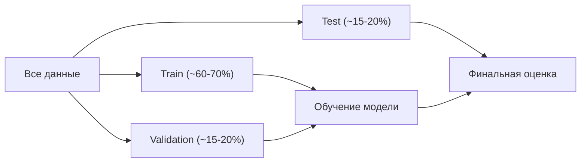
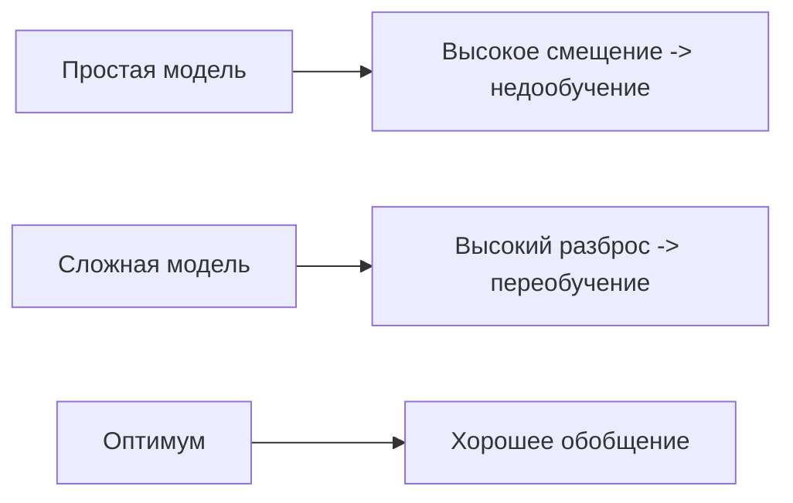
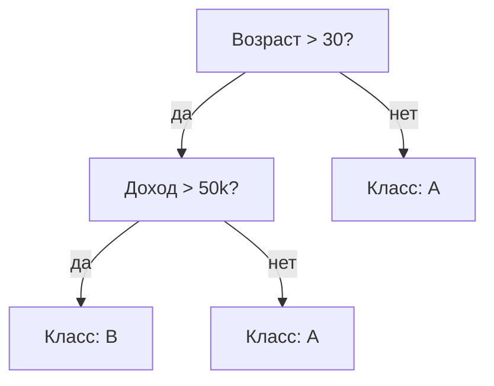
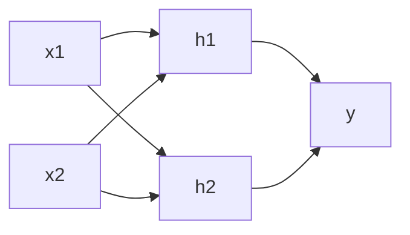

Этот глоссарий собирает базовые термины машинного обучения с короткими определениями: ровно столько, чтобы понять суть и не запутаться, плюс ссылки на разделы с подробным разбором. Термины сгруппированы по темам — от постановки задачи до нейросетей и типичных ошибок. Используйте его как карту: встретили незнакомое слово в статье или курсе — посмотрите определение здесь, при необходимости перейдите глубже.

:::tip[Как читать]
Курсивом выделены связанные термины из этого же глоссария — их полезно посмотреть рядом. Формулы даны там, где они короче и точнее слов.
:::

## Постановка задачи и данные

### Машинное обучение (Machine Learning)
Подход, при котором модель *выучивает* зависимости из данных, а не задаётся правилами вручную. Формально: по обучающей выборке настраиваем параметры модели так, чтобы минимизировать ошибку на новых данных.

### Обучение с учителем (Supervised learning)
Каждому объекту в данных сопоставлена правильная *метка*. Модель учится предсказывать метку по *признакам*. Делится на **регрессию** (метка — число, например цена) и **классификацию** (метка — категория, например «спам / не спам»).

### Обучение без учителя (Unsupervised learning)
Меток нет — модель ищет структуру в данных сама. Типичные задачи: *кластеризация* (группировка похожих объектов) и снижение размерности (*PCA*).

### Обучение с подкреплением (Reinforcement learning)
Агент действует в среде, получает награды и штрафы и учится стратегии, максимизирующей суммарную награду. Метки заменены сигналом награды, который часто отложен во времени.

### Признак (Feature)
Измеримое свойство объекта, поданное на вход модели: возраст, площадь, цвет пикселя, TF-IDF слова. Набор признаков объекта — вектор $x \in \mathbb{R}^d$. Преобразование сырых данных в полезные признаки называют **feature engineering**.

### Метка (Label) и целевая переменная (Target)
*Метка* — правильный ответ для объекта в обучении с учителем. *Целевая переменная* $y$ — то, что мы предсказываем. Для регрессии $y$ непрерывна, для классификации — дискретна.

### Обучающая, валидационная и тестовая выборки
Данные делят на части, чтобы честно оценить модель:

| Выборка | Назначение |
|---|---|
| Обучающая (train) | настройка параметров модели |
| Валидационная (validation) | подбор *гиперпараметров*, выбор модели |
| Тестовая (test) | финальная оценка качества, используется один раз |

Главное правило: тестовые данные не должны влиять на обучение, иначе оценка качества будет завышена.

## Обучение модели и оптимизация

### Функция потерь (Loss function)
Числовая мера ошибки модели на объекте или выборке: чем меньше, тем лучше. Обучение — это минимизация средней потери. Примеры:

- **MSE** (регрессия): $\mathcal{L} = \frac{1}{n}\sum_{i=1}^{n}(y_i - \hat{y}_i)^2$
- **Кросс-энтропия** (классификация): $\mathcal{L} = -\frac{1}{n}\sum_{i=1}^{n}\sum_{k} y_{ik}\log \hat{y}_{ik}$

См. также [исчисление](/calculus/) — производные нужны для оптимизации.

### Градиентный спуск (Gradient descent)
Итеративный метод минимизации функции потерь: на каждом шаге двигаемся в сторону, противоположную градиенту.

$$\theta_{t+1} = \theta_t - \eta \, \nabla_\theta \mathcal{L}(\theta_t)$$

Здесь $\eta$ — **скорость обучения** (learning rate). Разновидности: **batch** (по всем данным), **SGD** (по одному объекту), **mini-batch** (по небольшим пакетам — стандарт на практике). Опирается на [производные и градиент](/calculus/gradient-descent/).

### Гиперпараметр (Hyperparameter)
Настройка, которую задают до обучения и не выучивают из данных: скорость обучения, глубина дерева, число соседей в *kNN*, коэффициент регуляризации. Подбираются на валидации или *кросс-валидацией* (Grid Search, Random Search, байесовская оптимизация).

### Параметры (Parameters / Weights)
Величины, которые модель настраивает в ходе обучения: веса и смещения в линейных моделях и нейросетях. В отличие от *гиперпараметров*, они находятся автоматически.

### Регуляризация (Regularization)
Приёмы против *переобучения*: к функции потерь добавляют штраф за сложность модели.

- **L2 (Ridge):** $+\lambda \sum_j \theta_j^2$ — сжимает веса к нулю.
- **L1 (Lasso):** $+\lambda \sum_j |\theta_j|$ — обнуляет часть весов (отбор признаков).

Для нейросетей также используют **dropout** и **early stopping**.

## Оценка качества

### Переобучение и недообучение (Overfitting / Underfitting)
**Переобучение** — модель «зазубрила» обучающую выборку, включая шум, и плохо работает на новых данных (низкая ошибка на train, высокая на test). **Недообучение** — модель слишком проста и не уловила закономерность (высокая ошибка везде).

### Bias-variance tradeoff (смещение–разброс)
Ошибку модели раскладывают на три части:

$$\text{Ошибка} = \text{Смещение}^2 + \text{Разброс} + \text{Шум}$$

**Смещение (bias)** — систематическая ошибка из-за упрощений (ведёт к недообучению). **Разброс (variance)** — чувствительность к конкретной выборке (ведёт к переобучению). Цель — найти баланс.

### Кросс-валидация (Cross-validation)
Способ надёжнее оценить качество при ограниченных данных. В **k-fold** данные делят на $k$ частей: по очереди каждая становится валидационной, остальные — обучающими; результаты усредняют. Снижает зависимость оценки от случайного разбиения. Опирается на идеи [статистики](/statistics/).

### Матрица ошибок (Confusion matrix)
Таблица TP, FP, FN, TN для классификации: сколько объектов предсказано верно/неверно по каждому классу. База для метрик ниже.

### Precision и Recall (точность и полнота)
$$\text{Precision} = \frac{TP}{TP + FP}, \qquad \text{Recall} = \frac{TP}{TP + FN}$$

**Precision** — какая доля положительных предсказаний верна. **Recall** — какую долю реальных положительных мы поймали. Между ними обычно компромисс.

### F1-мера (F1 score)
Гармоническое среднее точности и полноты — единая метрика, когда важны обе:

$$F_1 = 2 \cdot \frac{\text{Precision} \cdot \text{Recall}}{\text{Precision} + \text{Recall}}$$

### Accuracy (доля верных ответов)
$\frac{TP+TN}{\text{всего}}$. Проста, но обманчива на несбалансированных классах: при 99% одного класса модель «всегда отвечай большинством» даёт 99% accuracy, будучи бесполезной.

### ROC-AUC
**ROC-кривая** показывает зависимость доли верных положительных (TPR) от доли ложных положительных (FPR) при разных порогах. **AUC** — площадь под ней: вероятность, что случайный положительный объект получит больший балл, чем случайный отрицательный. $\text{AUC}=1$ — идеал, $0.5$ — случайное угадывание.

## Классические модели

### Линейная и логистическая регрессия
**Линейная регрессия** предсказывает число: $\hat{y} = w^\top x + b$. **Логистическая регрессия** — вероятность класса через сигмоиду: $\hat{y} = \sigma(w^\top x + b)$, где $\sigma(z) = \frac{1}{1+e^{-z}}$. Опирается на [линейную алгебру](/linear-algebra/) и [вероятность](/probability/).

### kNN (k ближайших соседей)
Объект относят к классу, преобладающему среди $k$ ближайших по расстоянию соседей (или усредняют их значения для регрессии). Не требует обучения как такового, но чувствителен к масштабу признаков и медленный на больших данных.

### SVM (метод опорных векторов)
Ищет разделяющую гиперплоскость с максимальным **зазором (margin)** между классами. С помощью **kernel trick** (ядерного трюка) работает и с нелинейными границами, неявно отображая данные в пространство большей размерности.

### Наивный Байес (Naive Bayes)
Классификатор на основе теоремы Байеса с «наивным» предположением о независимости признаков:

$$P(y \mid x) \propto P(y)\prod_{j} P(x_j \mid y)$$

Прост, быстр, хорош для текстов несмотря на нереалистичное предположение. См. [теорему Байеса](/probability/bayes/).

### Дерево решений (Decision tree)
Модель в виде последовательности вопросов «признак больше порога?». Листья содержат предсказание. Разбиения выбирают по уменьшению неоднородности (**Gini**, **энтропия**). Интерпретируемо, но легко переобучается.

## Ансамбли

### Ансамбль (Ensemble)
Объединение нескольких моделей для более точного и устойчивого прогноза, чем у любой по отдельности. Две главные стратегии — *бэггинг* и *бустинг*.

### Бэггинг (Bagging)
Обучаем много моделей на случайных подвыборках (с возвращением) и усредняем ответы. Снижает *разброс*. Главный представитель — **Random Forest** (случайный лес): бэггинг над деревьями со случайным выбором признаков в узлах.

### Бустинг (Boosting)
Модели обучаются последовательно: каждая следующая исправляет ошибки предыдущих. Снижает *смещение*. Популярные реализации градиентного бустинга: **XGBoost**, **LightGBM**, **CatBoost** — частые победители на табличных данных.

| Свойство | Бэггинг | Бустинг |
|---|---|---|
| Обучение моделей | параллельно, независимо | последовательно |
| Что снижает | разброс | смещение |
| Риск переобучения | ниже | выше (нужна регуляризация) |
| Пример | Random Forest | XGBoost |

## Без учителя и снижение размерности

### Кластеризация (Clustering)
Группировка объектов по схожести без меток. **K-means** делит данные на $k$ кластеров, минимизируя разброс внутри них; **DBSCAN** находит кластеры произвольной формы по плотности; **иерархическая** строит дерево вложенных групп.

### PCA (метод главных компонент)
Линейное снижение размерности: находит ортогональные направления максимальной дисперсии и проецирует данные на них. Сжимает признаки с минимальной потерей информации, помогает визуализации и борьбе с шумом. Математически опирается на собственные векторы ковариационной матрицы — см. [линейную алгебру](/linear-algebra/).

### Стандартизация и нормализация
Приведение признаков к сопоставимому масштабу. **Стандартизация:** $x' = \frac{x - \mu}{\sigma}$ (нулевое среднее, единичная дисперсия). **Нормализация (min-max):** приведение к отрезку $[0, 1]$. Критично для *kNN*, *SVM*, *PCA* и нейросетей.

## Нейросети и глубокое обучение

### Нейросеть (Neural network)
Модель из слоёв связанных «нейронов». Каждый нейрон считает взвешенную сумму входов и пропускает её через *функцию активации*. Глубокие сети (много слоёв) автоматически выучивают иерархию признаков.

### Функция активации (Activation function)
Нелинейность, без которой сеть из любого числа слоёв осталась бы линейной. Примеры: **ReLU** $f(z)=\max(0,z)$, **сигмоида** $\sigma(z)=\frac{1}{1+e^{-z}}$, **tanh**, **softmax** (для вероятностей классов на выходе).

### Обратное распространение (Backpropagation)
Алгоритм вычисления градиентов функции потерь по всем весам сети через цепное правило дифференцирования — применяется справа налево, от выхода к входу. Эти градиенты затем использует *градиентный спуск*. Суть — [производная сложной функции](/calculus/chain-rule/).

### Эпоха, батч, итерация
**Эпоха** — один полный проход по обучающей выборке. **Батч** — порция данных, обрабатываемая за один шаг. **Итерация** — один шаг обновления весов (один батч).

## Типичные проблемы и термины процесса

### Утечка данных (Data leakage)
Ситуация, когда в обучение просачивается информация, недоступная в момент реального предсказания (например, признак, вычисленный с учётом будущего, или статистики, посчитанные по всей выборке до разбиения на train/test). Даёт завышенное качество на оценке и провал в проде. Один из самых коварных багов в ML.

:::caution[Где чаще всего возникает утечка]
Масштабирование и заполнение пропусков нужно настраивать только на train и применять к test теми же параметрами — иначе тест «подсматривает» статистики всей выборки.
:::

### Несбалансированные классы (Imbalanced data)
Один класс встречается намного реже другого (мошенничество, редкая болезнь). Accuracy перестаёт работать; помогают взвешивание классов, ресемплинг (oversampling/SMOTE, undersampling) и метрики *precision/recall*, *F1*, *ROC-AUC* / PR-AUC.

### Обобщающая способность (Generalization)
Способность модели хорошо работать на данных, которых она не видела. Конечная цель обучения — не низкая ошибка на train, а низкая ошибка на новых объектах.

### Пайплайн (Pipeline)
Связанная последовательность шагов обработки и моделирования (предобработка → признаки → модель), оформленная как единый объект. В scikit-learn `Pipeline` гарантирует, что преобразования настраиваются только на train и корректно переносятся на test, предотвращая *утечку данных*.

См. также практику на Python: [работа с данными](/python-data/).

## Источники

- Hastie T., Tibshirani R., Friedman J. **The Elements of Statistical Learning** — классика по статистическому обучению; [бесплатный PDF](https://hastie.su.domains/ElemStatLearn/).
- Bishop C. **Pattern Recognition and Machine Learning** — фундаментальный учебник с вероятностным взглядом; [официальная страница книги](https://www.microsoft.com/en-us/research/people/cmbishop/prml-book/).
- Goodfellow I., Bengio Y., Courville A. **Deep Learning** — основной справочник по глубокому обучению; [онлайн-версия](https://www.deeplearningbook.org/).
- Andrew Ng. **Machine Learning** — вводный курс, эталон для старта; [Coursera](https://www.coursera.org/learn/machine-learning).
- **scikit-learn** — документация и руководство пользователя с примерами; [scikit-learn.org](https://scikit-learn.org/stable/).
- **StatQuest with Josh Starmer** — наглядные видеоразборы метрик, деревьев, бустинга и др.; [YouTube-канал](https://www.youtube.com/c/joshstarmer).
