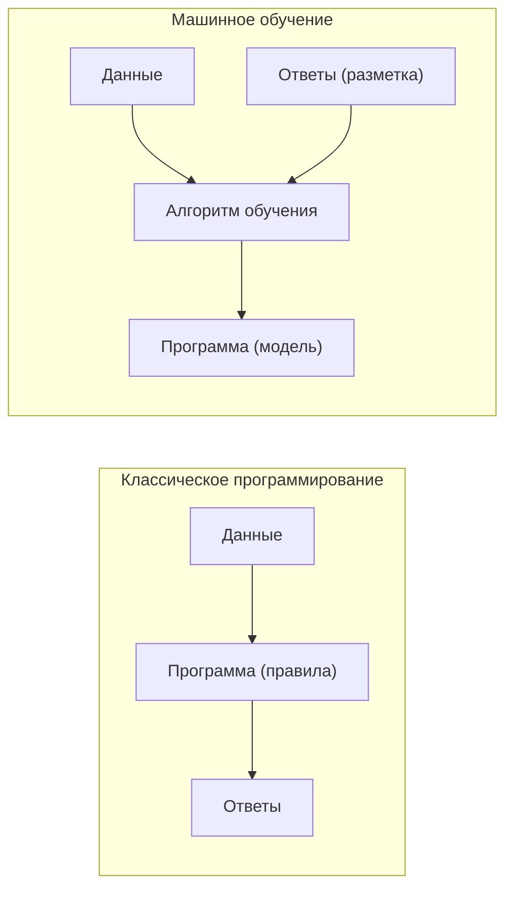
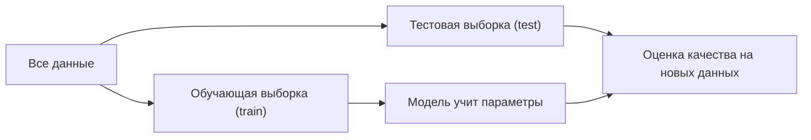
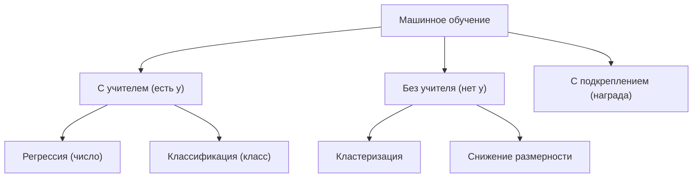
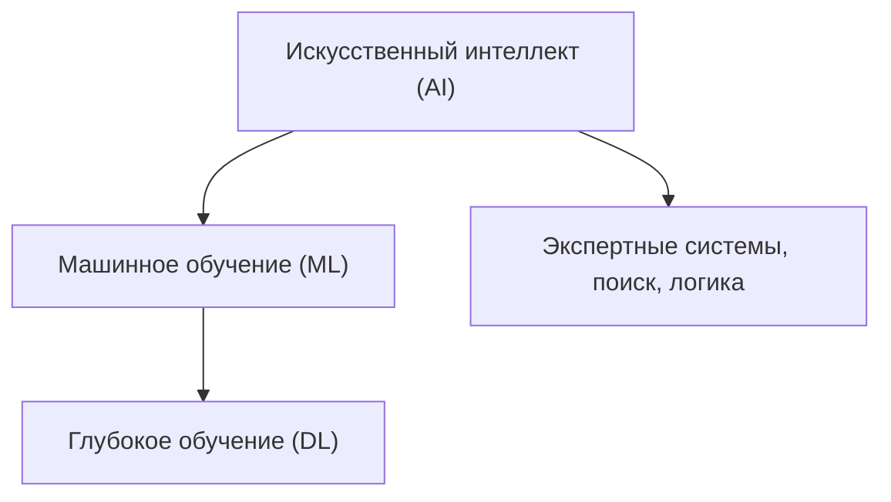

Машинное обучение (Machine Learning, ML) — это способ заставить программу решать задачу, не описывая решение явными правилами, а показывая ей **примеры**. Вместо того чтобы вручную перечислять условия («если письмо содержит слово „выигрыш“ и пришло с незнакомого адреса — это спам»), мы даём алгоритму тысячи писем, помеченных как «спам» и «не спам», и он сам находит закономерности, отличающие одни от других.

Это и есть главный сдвиг мышления: **мы программируем не само решение, а процесс его поиска по данным.**

## Правила против обучения

Сравним два подхода к одной задаче — распознать рукописную цифру на картинке.

**Классический подход (rule-based).** Инженер придумывает признаки и пороги: «если в верхней части есть петля, а внизу прямая палочка — это 9». Таких правил для всех цифр, всех почерков и всех помарок нужны сотни, они конфликтуют друг с другом и ломаются на новом почерке.

**Машинное обучение.** Мы собираем датасет из размеченных картинок (например, [MNIST](https://en.wikipedia.org/wiki/MNIST_database)) и даём алгоритму самому подобрать, какие комбинации пикселей соответствуют какой цифре.



Ключевая инверсия: в классическом подходе на вход идут данные **и** программа, на выходе — ответы. В ML на вход идут данные **и** ответы, а на выходе — программа (модель), которая дальше будет давать ответы на новых данных.

:::note
ML уместно ровно тогда, когда правила существуют, но мы не можем их явно выписать: они слишком сложны, их слишком много или они скрыты в данных. Если же правило простое и известно («НДС = 20% от суммы»), ML не нужен — это лишь источник ошибок и накладных расходов.
:::

## Формальная постановка

Опишем задачу обучения с учителем чуть строже. У нас есть набор **объектов**, каждый описан вектором **признаков** (features):

$$
\vec{x} = (x_1, x_2, \dots, x_d) \in \mathbb{R}^d
$$

Например, для квартиры: $x_1$ — площадь, $x_2$ — этаж, $x_3$ — расстояние до метро. Размерность $d$ — число признаков.

Каждому объекту сопоставлена **целевая переменная** (target) $y$ — то, что мы хотим предсказывать (цена квартиры, метка класса). Обучающая выборка — это $n$ пар:

$$
\mathcal{D} = \{(\vec{x}^{(i)}, y^{(i)})\}_{i=1}^{n}
$$

Удобно собрать все признаки в **матрицу объект-признак** $X$ размера $n \times d$ (строки — объекты, столбцы — признаки) и все ответы в вектор $\vec{y}$:

$$
X = \begin{pmatrix} x_1^{(1)} & \cdots & x_d^{(1)} \\ \vdots & \ddots & \vdots \\ x_1^{(n)} & \cdots & x_d^{(n)} \end{pmatrix}, \qquad \vec{y} = \begin{pmatrix} y^{(1)} \\ \vdots \\ y^{(n)} \end{pmatrix}
$$

Подробнее про векторы и матрицы — в разделе [Линейная алгебра](/linear-algebra/).

### Гипотеза и обучение

Мы ищем функцию $h$ (**гипотезу**, или модель), которая по признакам предсказывает цель:

$$
\hat{y} = h(\vec{x}; \theta)
$$

Здесь $\theta$ — **параметры** модели (например, веса линейной регрессии), а $\hat{y}$ — предсказание (крышка над буквой означает «оценка», в отличие от истинного $y$).

«Обучить модель» — значит подобрать параметры $\theta$ так, чтобы предсказания были близки к истинным ответам. Близость измеряется **функцией потерь** (loss) $L(\hat{y}, y)$, а обучение — это минимизация средней потери по выборке:

$$
\theta^* = \arg\min_{\theta} \; \frac{1}{n} \sum_{i=1}^{n} L\big(h(\vec{x}^{(i)}; \theta),\; y^{(i)}\big)
$$

Как именно минимизируют этот функционал (градиентный спуск, производные) — см. [Математический анализ](/calculus/).

### Обобщение — главная цель

Подогнать модель под обучающие данные мало. Нам нужно, чтобы она работала на **новых, ранее не виденных** объектах — это называется **обобщением** (generalization). Поэтому данные делят как минимум на две части:



Здесь возникает фундаментальный компромисс:

- **Недообучение (underfitting)** — модель слишком проста, не уловила закономерность, плохо работает и на train, и на test.
- **Переобучение (overfitting)** — модель «запомнила» обучающие данные вместе с шумом, отлично работает на train, но проваливается на test.

:::caution
Высокое качество на обучающей выборке ничего не говорит о качестве модели. Судить можно только по данным, которых модель не видела при обучении.
:::

## Типы задач

ML принято делить по тому, что мы знаем о данных и что хотим получить.

| Тип | Что есть | Что предсказываем | Пример |
|---|---|---|---|
| Обучение с учителем — регрессия | $X$ и числовой $y$ | непрерывное число | цена квартиры |
| Обучение с учителем — классификация | $X$ и категориальный $y$ | метку класса | спам / не спам |
| Обучение без учителя | только $X$ | структуру в данных | сегменты клиентов (кластеризация) |
| Обучение с подкреплением | состояния и награды | стратегию действий | игра, робот, торговый агент |



Подробный разбор каждого типа — в разделе [Машинное обучение](/machine-learning/).

## ML, AI и Deep Learning

Эти термины часто путают. Они вложены друг в друга:

- **Искусственный интеллект (AI)** — самое широкое понятие: любые методы, заставляющие машину вести себя «разумно», включая и системы правил, и поиск, и ML.
- **Машинное обучение (ML)** — подмножество AI: методы, которые учатся на данных, а не программируются правилами.
- **Глубокое обучение (Deep Learning, DL)** — подмножество ML: модели на основе многослойных нейронных сетей, которые сами выучивают признаки из сырых данных (пикселей, текста, звука).



:::tip
Главное отличие DL от классического ML — **автоматическое извлечение признаков**. В классическом ML признаки чаще придумывает человек (feature engineering); в DL сеть строит их сама из сырых данных, но требует на порядки больше данных и вычислений.
:::

## Краткая история

ML развивался не плавно, а волнами надежд и разочарований.

| Период | Веха |
|---|---|
| 1957 | Фрэнк Розенблатт создаёт **перцептрон** — первую обучаемую модель нейрона |
| 1969 | Минский и Пейперт показывают, что один перцептрон не решает даже XOR → спад интереса |
| ~1974–1980 | Первая **«зима ИИ»**: завышенные ожидания не оправдались, финансирование урезано |
| 1986 | Популяризация **обратного распространения ошибки** (backpropagation) для многослойных сетей |
| ~1987–1993 | Вторая «зима ИИ» |
| 1990-е–2000-е | Расцвет «классического» ML: SVM, случайные леса, бустинг |
| 2012 | **AlexNet** выигрывает ImageNet — старт бума глубокого обучения |
| 2017–наши дни | Архитектура **Transformer**, большие языковые модели (LLM) |

Перцептрон вычислял взвешенную сумму входов и пропускал её через пороговую функцию:

$$
\hat{y} = \begin{cases} 1, & \text{если } \sum_{j=1}^{d} w_j x_j + b > 0 \\ 0, & \text{иначе} \end{cases}
$$

Эта формула — прямой предок современных нейросетей: те же веса $w_j$, смещение $b$ и нелинейность, только слоёв теперь миллиарды параметров.

Что сделало возможным бум 2010-х: накопились **большие данные**, выросла **вычислительная мощность** (GPU), появились **удобные фреймворки**. Сами идеи (нейроны, backprop) были известны десятилетиями.

## Когда ML уместно, а когда нет

ML — мощный, но не универсальный инструмент. Он оправдан, когда выполняются условия:

- задачу **трудно описать правилами**, но легко привести примеры;
- есть **достаточно качественных данных** с разметкой (для обучения с учителем);
- допустима **вероятностная, не идеальная** точность ответа;
- закономерности **достаточно стабильны** во времени.

ML стоит избегать или использовать осторожно, когда:

- правило **простое и точно известно** — проще запрограммировать его явно;
- данных **мало** или они грязные/нерепрезентативные;
- цена ошибки критична, а **объяснимость обязательна** (право, медицина — нужны интерпретируемые модели и контроль);
- распределение данных **быстро меняется** (модель устаревает быстрее, чем обучается).

:::danger
ML усиливает закономерности из обучающих данных, включая **ошибки и предвзятость**. Если в исторических данных была дискриминация, модель её воспроизведёт и масштабирует. «Данные → модель» не означает «объективно».
:::

Для практической работы с данными (загрузка, очистка, признаки) понадобится [Python для данных](/python-data/), а для оценки моделей и проверки гипотез — [Статистика](/statistics/) и [Теория вероятностей](/probability/).

## Задания

### Задание 1. Где здесь ML

Для каждой задачи определите, нужно ли машинное обучение, и если да — к какому типу (регрессия, классификация, без учителя, с подкреплением) она относится:

1. Перевести температуру из Цельсия в Фаренгейт.
2. Предсказать, уйдёт ли клиент от оператора связи в следующем месяце.
3. Разбить 100 000 покупателей на похожие группы для маркетинга.
4. Оценить стоимость подержанного автомобиля по его характеристикам.

<details>
<summary>Решение</summary>

1. **ML не нужен.** Есть точная формула $F = \frac{9}{5}C + 32$. Любое «обучение» здесь только добавит ошибку.
2. **Классификация** (обучение с учителем). Цель $y \in \{\text{уйдёт}, \text{останется}\}$ — две категории.
3. **Кластеризация** (обучение без учителя). Разметки нет, ищем структуру в данных.
4. **Регрессия** (обучение с учителем). Цель $y$ — непрерывное число (цена).

</details>

### Задание 2. Признаки и размерности

Пусть обучающая выборка содержит 500 квартир, каждая описана четырьмя признаками: площадь, этаж, число комнат, расстояние до метро. Предсказываем цену.

1. Чему равны $n$ и $d$?
2. Каков размер матрицы $X$ и вектора $\vec{y}$?
3. К какому типу задач это относится?

<details>
<summary>Решение</summary>

1. $n = 500$ (число объектов), $d = 4$ (число признаков).
2. Матрица объект-признак $X$ имеет размер $n \times d = 500 \times 4$. Вектор ответов $\vec{y}$ имеет размер $500 \times 1$ (по одному числу-цене на квартиру).
3. Цена — непрерывное число, значит это **регрессия** (обучение с учителем).

</details>

### Задание 3. Train, test и переобучение

Студент обучил модель и получил точность 99% на обучающей выборке, но 62% на тестовой. На отдельной проверочной выборке тоже около 60%.

1. Как называется это явление?
2. Почему нельзя доверять цифре 99%?
3. Назовите хотя бы два способа смягчить проблему.

<details>
<summary>Решение</summary>

1. **Переобучение (overfitting):** модель «запомнила» обучающие данные вместе с шумом и плохо обобщается.
2. Точность на train измерена на тех же данных, на которых модель училась, — она может просто «зазубрить» ответы. О реальном качестве говорит только результат на данных, которые модель не видела при обучении (test ≈ 62%).
3. Например: упростить модель (меньше параметров), добавить регуляризацию, собрать больше обучающих данных, использовать раннюю остановку, применить кросс-валидацию для честной оценки.

</details>

### Задание 4. Перцептрон вручную

Дан перцептрон с весами $\vec{w} = (0.5,\ -1)$ и смещением $b = 0.2$. Правило: $\hat{y} = 1$, если $w_1 x_1 + w_2 x_2 + b > 0$, иначе $\hat{y} = 0$.

Вычислите предсказание для объекта $\vec{x} = (2,\ 1)$ и проверьте результат кодом.

<details>
<summary>Решение</summary>

Считаем взвешенную сумму:

$$
s = 0.5 \cdot 2 + (-1) \cdot 1 + 0.2 = 1 - 1 + 0.2 = 0.2
$$

Так как $s = 0.2 > 0$, то $\hat{y} = 1$.

```python
import numpy as np

w = np.array([0.5, -1.0])
b = 0.2
x = np.array([2.0, 1.0])

s = w @ x + b          # 0.2
y_hat = int(s > 0)     # 1
print(s, y_hat)        # 0.2 1
```

</details>
