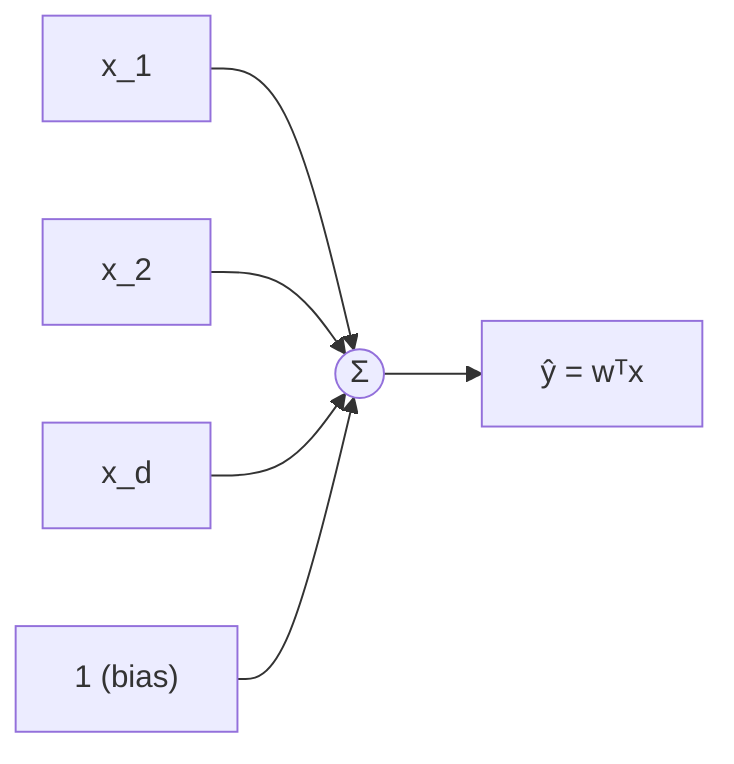
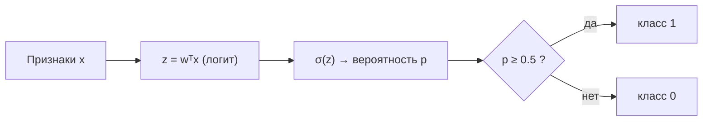

Линейные модели — это фундамент классического машинного обучения. Они просты, быстро обучаются, легко интерпретируются и при этом часто служат сильным базовым решением (baseline), которое непросто превзойти. Главная идея: предсказание строится как **взвешенная сумма признаков** плюс свободный член. Поняв линейную регрессию и её «классификационного брата» — логистическую регрессию, вы получаете ключ к более сложным методам, ведь даже нейросеть — это, по сути, стопка линейных моделей с нелинейностями между ними.

Перед чтением полезно освежить [линейную алгебру](/linear-algebra/) (скалярное произведение, матрицы), [производные и градиенты](/calculus/) и сам метод [градиентного спуска](/calculus/gradient-descent/).

## Линейная регрессия

### Модель

Пусть объект описан вектором признаков $\vec{x} = (x_1, x_2, \dots, x_d)$. Линейная модель предсказывает число как линейную комбинацию признаков:

$$
\hat{y} = w_0 + w_1 x_1 + w_2 x_2 + \dots + w_d x_d = w_0 + \sum_{j=1}^{d} w_j x_j
$$

Здесь $w_1, \dots, w_d$ — **веса** (коэффициенты), показывающие вклад каждого признака, а $w_0$ — **смещение** (bias, intercept), значение прогноза при нулевых признаках.

Удобно убрать $w_0$ из формулы, добавив к каждому объекту фиктивный признак $x_0 = 1$. Тогда модель записывается компактно через скалярное произведение:

$$
\hat{y} = \vec{w}^{\top} \vec{x} = \sum_{j=0}^{d} w_j x_j
$$

Для всей выборки из $n$ объектов признаки складывают в **матрицу плана** $X$ размера $n \times (d+1)$ (строка — объект), и тогда вектор всех предсказаний:

$$
\hat{\vec{y}} = X \vec{w}
$$



### Функция потерь: MSE

Чтобы обучить модель, нужно измерить, насколько предсказания расходятся с истиной. Для регрессии стандартный выбор — **среднеквадратичная ошибка** (Mean Squared Error):

$$
\mathrm{MSE}(\vec{w}) = \frac{1}{n} \sum_{i=1}^{n} \left( \hat{y}_i - y_i \right)^2 = \frac{1}{n} \sum_{i=1}^{n} \left( \vec{w}^{\top} \vec{x}_i - y_i \right)^2
$$

Почему именно квадрат ошибки, а не модуль? Несколько причин:

- квадрат **сильнее штрафует крупные промахи** — модель старается избегать больших ошибок;
- функция **гладкая и выпуклая**, у неё единственный минимум, а производная берётся легко;
- минимизация MSE соответствует **методу максимального правдоподобия**, если шум в данных нормальный (см. [вероятность](/probability/)).

:::note[Почему делят на n]
Деление на $n$ делает MSE средней ошибкой на объект, не зависящей от размера выборки. Иногда добавляют ещё множитель $\tfrac{1}{2}$ — он сокращает двойку при дифференцировании и не меняет точку минимума.
:::

### Нормальное уравнение (аналитическое решение)

MSE — выпуклая квадратичная функция от $\vec{w}$, поэтому её минимум можно найти точно, приравняв градиент к нулю. В матричной форме потери (без множителя $1/n$, он не влияет на argmin):

$$
L(\vec{w}) = \| X\vec{w} - \vec{y} \|^2
$$

Градиент по $\vec{w}$:

$$
\nabla_{\vec{w}} L = 2 X^{\top} (X\vec{w} - \vec{y})
$$

Приравниваем к нулю и получаем **нормальное уравнение**:

$$
X^{\top} X \, \vec{w} = X^{\top} \vec{y}
\quad\Longrightarrow\quad
\vec{w} = \left( X^{\top} X \right)^{-1} X^{\top} \vec{y}
$$

Это решение в одну формулу — без итераций. Но у него есть цена:

- обращение матрицы $X^{\top}X$ размера $(d+1)\times(d+1)$ стоит порядка $O(d^3)$ — дорого при большом числе признаков;
- если признаки линейно зависимы (мультиколлинеарность), матрица $X^{\top}X$ вырождена и не обращается;
- нужно держать всю матрицу в памяти.

Поэтому при больших $n$ и $d$ переходят к градиентному спуску.

### Обучение градиентным спуском

[Градиентный спуск](/calculus/gradient-descent/) ищет минимум итеративно, делая шаги против градиента. Для MSE градиент по весам:

$$
\nabla_{\vec{w}} \, \mathrm{MSE} = \frac{2}{n} X^{\top} \left( X\vec{w} - \vec{y} \right)
$$

Правило обновления с шагом обучения (learning rate) $\eta$:

$$
\vec{w} \leftarrow \vec{w} - \eta \, \nabla_{\vec{w}} \, \mathrm{MSE}
$$

```python
import numpy as np

def linreg_gd(X, y, lr=0.1, epochs=500):
    n, d = X.shape
    X = np.hstack([np.ones((n, 1)), X])   # добавляем столбец единиц для bias
    w = np.zeros(d + 1)
    for _ in range(epochs):
        grad = (2 / n) * X.T @ (X @ w - y)
        w -= lr * grad
    return w
```

:::tip
На практике редко пишут это руками: `sklearn.linear_model.LinearRegression` решает нормальное уравнение, а `SGDRegressor` — стохастическим градиентным спуском. Ручная реализация полезна, чтобы понимать, что происходит «под капотом».
:::

## Логистическая регрессия

Несмотря на слово «регрессия», это модель **классификации**. Задача: предсказать вероятность того, что объект относится к классу 1 (например, «письмо — спам»).

### Сигмоида

Линейная комбинация $z = \vec{w}^{\top}\vec{x}$ может принимать любое значение от $-\infty$ до $+\infty$, а нам нужна вероятность из отрезка $[0, 1]$. Эту проблему решает **сигмоида** (логистическая функция):

$$
\sigma(z) = \frac{1}{1 + e^{-z}}
$$

Она плавно «сжимает» прямую в интервал $(0, 1)$: при $z \to +\infty$ даёт 1, при $z \to -\infty$ даёт 0, а в нуле — ровно $0{,}5$. У неё есть приятное свойство для дифференцирования:

$$
\sigma'(z) = \sigma(z)\,\bigl(1 - \sigma(z)\bigr)
$$

### Вероятностная интерпретация

Модель выдаёт вероятность принадлежности к положительному классу:

$$
P(y = 1 \mid \vec{x}) = \sigma(\vec{w}^{\top}\vec{x}), \qquad
P(y = 0 \mid \vec{x}) = 1 - \sigma(\vec{w}^{\top}\vec{x})
$$

Величину $z = \vec{w}^{\top}\vec{x}$ называют **логитом** — это логарифм шансов (log-odds):

$$
\ln \frac{P(y=1\mid \vec{x})}{P(y=0\mid \vec{x})} = \vec{w}^{\top}\vec{x}
$$

То есть логистическая регрессия линейна не в самой вероятности, а в логарифме отношения шансов.

### Функция потерь: кросс-энтропия

Для классификации MSE плохо подходит (с сигмоидой она становится невыпуклой и плохо обучается). Используют **логистическую потерю** (log loss), она же бинарная кросс-энтропия. Для одного объекта:

$$
\ell(\vec{w}) = -\,\bigl[\, y \ln \hat{p} + (1 - y)\ln(1 - \hat{p}) \,\bigr], \qquad \hat{p} = \sigma(\vec{w}^{\top}\vec{x})
$$

Логика проста: если истинный класс $y=1$, остаётся слагаемое $-\ln\hat{p}$ — оно мало, когда $\hat{p}$ близко к 1, и стремится к $+\infty$, когда модель уверенно ошибается ($\hat{p}\to 0$). По всей выборке усредняем:

$$
J(\vec{w}) = -\frac{1}{n}\sum_{i=1}^{n}\Bigl[\, y_i \ln \hat{p}_i + (1 - y_i)\ln(1 - \hat{p}_i) \,\Bigr]
$$

Эта функция выпукла по $\vec{w}$, поэтому её надёжно минимизируют градиентным спуском. Замечательно, что после подстановки сигмоиды градиент имеет **точно такой же вид**, как у линейной регрессии:

$$
\nabla_{\vec{w}} J = \frac{1}{n} X^{\top}\left( \hat{\vec{p}} - \vec{y} \right)
$$

где $\hat{\vec{p}} = \sigma(X\vec{w})$ применяется поэлементно.

### Граница решения

Чтобы превратить вероятность в метку класса, выбирают порог (обычно $0{,}5$):

$$
\hat{y} = \begin{cases} 1, & \hat{p} \ge 0{,}5 \\ 0, & \hat{p} < 0{,}5 \end{cases}
$$

Условие $\hat{p} = 0{,}5$ эквивалентно $z = \vec{w}^{\top}\vec{x} = 0$. Это уравнение задаёт **гиперплоскость** — границу решения. Поэтому логистическая регрессия — линейный классификатор: она разделяет классы прямой (в 2D), плоскостью (в 3D) и т.д.



:::caution[Линейная граница — это ограничение]
Если классы нельзя разделить прямой (например, один «внутри» другого кольцом), базовая логистическая регрессия справится плохо. Помогают добавление полиномиальных признаков ($x_1^2,\, x_1 x_2,\, \dots$) или переход к нелинейным моделям.
:::

## Регуляризация: борьба с переобучением

Когда признаков много, а данных мало, модель может **переобучиться** (overfitting): подогнаться под шум обучающей выборки и плохо работать на новых данных. У линейных моделей признак переобучения — **большие по модулю веса**: модель резко реагирует на мелкие колебания признаков.

Идея регуляризации — добавить к функции потерь штраф за величину весов, заставляя их оставаться маленькими.

### L2 (Ridge)

Штрафуем сумму квадратов весов:

$$
J_{\mathrm{Ridge}}(\vec{w}) = \mathrm{MSE}(\vec{w}) + \lambda \sum_{j=1}^{d} w_j^2
$$

Коэффициент $\lambda \ge 0$ управляет силой регуляризации: при $\lambda = 0$ — обычная регрессия, при больших $\lambda$ веса «придавливаются» к нулю. L2 делает веса малыми, но **не обнуляет** их полностью. Бонус: для линейной регрессии Ridge всегда имеет решение, даже при мультиколлинеарности:

$$
\vec{w} = \left( X^{\top}X + \lambda I \right)^{-1} X^{\top}\vec{y}
$$

Добавление $\lambda I$ делает матрицу невырожденной.

### L1 (Lasso)

Штрафуем сумму модулей весов:

$$
J_{\mathrm{Lasso}}(\vec{w}) = \mathrm{MSE}(\vec{w}) + \lambda \sum_{j=1}^{d} |w_j|
$$

Ключевое отличие: L1 склонна **обнулять** часть весов полностью. Это автоматический **отбор признаков** — модель сама решает, какие признаки выбросить. Цена: $|w|$ недифференцируема в нуле, поэтому используют специальные методы оптимизации (координатный спуск, субградиенты).

### Сравнение

| Свойство | L2 (Ridge) | L1 (Lasso) |
|---|---|---|
| Штраф | $\lambda \sum w_j^2$ | $\lambda \sum \lvert w_j \rvert$ |
| Эффект на веса | уменьшает, но не зануляет | зануляет часть весов |
| Отбор признаков | нет | да |
| Разреженность решения | нет | да |
| Дифференцируемость | везде | нет в нуле |
| Когда применять | признаки коррелированы, нужны все | много признаков, нужен отбор |

:::note[Elastic Net]
Комбинация обоих штрафов — **Elastic Net**: $\lambda_1\sum\lvert w_j\rvert + \lambda_2\sum w_j^2$. Берёт лучшее от обоих подходов и хорошо работает при группах коррелированных признаков.
:::

Важно: смещение $w_0$ обычно **не регуляризуют** — оно лишь сдвигает уровень предсказаний и к переобучению не ведёт.

## Важность масштабирования признаков

Линейные модели чувствительны к **масштабу признаков**. Представьте, что один признак — площадь квартиры (десятки–сотни), а другой — число комнат (1–5). Это создаёт две проблемы:

1. **Градиентный спуск сходится медленно.** Поверхность потерь становится вытянутой «оврагом»: по одной оси шаги нужны крупные, по другой — мелкие. Спуск зигзагует и долго ищет минимум.
2. **Регуляризация работает несправедливо.** Штраф $\sum w_j^2$ одинаково давит на все веса. Но признак в крупном масштабе получит маленький вес, в мелком — большой, и регуляризация накажет их непропорционально.

Решение — привести признаки к сопоставимому масштабу. Самый частый способ — **стандартизация** (z-score): вычитаем среднее и делим на стандартное отклонение, чтобы у каждого признака были нулевое среднее и единичная дисперсия (см. [статистику](/statistics/)):

$$
x_j' = \frac{x_j - \mu_j}{\sigma_j}
$$

```python
from sklearn.pipeline import make_pipeline
from sklearn.preprocessing import StandardScaler
from sklearn.linear_model import Ridge

# масштабирование + модель в одном конвейере
model = make_pipeline(StandardScaler(), Ridge(alpha=1.0))
model.fit(X_train, y_train)
```

:::danger[Утечка данных]
Параметры масштабирования ($\mu$, $\sigma$) считают **только по обучающей выборке** и применяют к тесту теми же значениями. Если посчитать статистики по всем данным сразу, информация о тесте «протечёт» в обучение и оценка качества окажется завышенной. `Pipeline` в scikit-learn делает это правильно автоматически при кросс-валидации.
:::

## Коротко

- **Линейная регрессия**: $\hat{y} = \vec{w}^{\top}\vec{x}$, обучается минимизацией MSE — через нормальное уравнение (точно, но дорого) или градиентным спуском (масштабируемо).
- **Логистическая регрессия**: $\hat{p} = \sigma(\vec{w}^{\top}\vec{x})$, обучается минимизацией кросс-энтропии; даёт вероятности и линейную границу решения.
- **L2 (Ridge)** уменьшает веса и стабилизирует решение; **L1 (Lasso)** зануляет веса и отбирает признаки.
- **Масштабирование** признаков ускоряет сходимость и делает регуляризацию корректной.

Дальше можно посмотреть, как линейные модели обобщаются в нелинейные методы в разделе [машинного обучения](/machine-learning/), и углубить понимание оптимизации в [градиентном спуске](/calculus/gradient-descent/).

## Задания

### Задание 1. Нормальное уравнение вручную

Дана выборка из трёх точек: $(x, y) = (1, 2), (2, 2), (3, 4)$. Постройте простую линейную регрессию $\hat{y} = w_0 + w_1 x$, решив нормальное уравнение. Найдите $w_0$ и $w_1$.

<details>
<summary>Решение</summary>

Матрица плана (со столбцом единиц для $w_0$) и вектор целей:

$$
X = \begin{pmatrix} 1 & 1 \\ 1 & 2 \\ 1 & 3 \end{pmatrix}, \qquad
\vec{y} = \begin{pmatrix} 2 \\ 2 \\ 4 \end{pmatrix}
$$

Считаем $X^{\top}X$ и $X^{\top}\vec{y}$:

$$
X^{\top}X = \begin{pmatrix} 3 & 6 \\ 6 & 14 \end{pmatrix}, \qquad
X^{\top}\vec{y} = \begin{pmatrix} 8 \\ 18 \end{pmatrix}
$$

Решаем систему $X^{\top}X\,\vec{w} = X^{\top}\vec{y}$:

$$
\begin{cases} 3w_0 + 6w_1 = 8 \\ 6w_0 + 14w_1 = 18 \end{cases}
$$

Из первого: $w_0 = \tfrac{8 - 6w_1}{3}$. Подставляем во второе:

$$
6\cdot\frac{8 - 6w_1}{3} + 14 w_1 = 18 \;\Rightarrow\; 16 - 12 w_1 + 14 w_1 = 18 \;\Rightarrow\; 2 w_1 = 2
$$

Значит $w_1 = 1$, тогда $w_0 = \tfrac{8 - 6}{3} = \tfrac{2}{3} \approx 0{,}67$.

Итоговая прямая: $\hat{y} = \tfrac{2}{3} + x$. Проверка предсказаний при $x = 1, 2, 3$: $1{,}67,\ 2{,}67,\ 3{,}67$ — линия идёт между точками, что разумно.

</details>

### Задание 2. Сигмоида и порог

Обученная логистическая модель имеет веса $w_0 = -3$, $w_1 = 2$ (один признак $x$). При каком значении $x$ проходит граница решения (порог $0{,}5$)? Какова предсказанная вероятность класса 1 при $x = 2$?

<details>
<summary>Решение</summary>

Граница решения — там, где $\hat{p} = 0{,}5$, то есть где логит $z = 0$:

$$
z = w_0 + w_1 x = -3 + 2x = 0 \;\Rightarrow\; x = 1{,}5
$$

При $x < 1{,}5$ модель относит объект к классу 0, при $x > 1{,}5$ — к классу 1.

Вероятность при $x = 2$: сначала логит $z = -3 + 2\cdot 2 = 1$, затем

$$
\hat{p} = \sigma(1) = \frac{1}{1 + e^{-1}} = \frac{1}{1 + 0{,}368} \approx 0{,}73
$$

Объект уверенно относится к классу 1 (вероятность около 73%).

</details>

### Задание 3. L1 против L2: какой штраф выбрать

У вас 10 000 признаков (например, частоты слов в текстах), и вы подозреваете, что предсказание определяют лишь несколько десятков из них. Какую регуляризацию выбрать — L1 или L2 — и почему? Что произойдёт с весами?

<details>
<summary>Решение</summary>

Стоит выбрать **L1 (Lasso)**. Причины:

- L1-штраф $\lambda\sum|w_j|$ обнуляет веса неинформативных признаков, выполняя автоматический **отбор признаков**. Из 10 000 в модели останутся только несколько десятков значимых — решение станет **разреженным**.
- Это даёт интерпретируемость (видно, какие слова реально важны) и ускоряет применение модели.

L2 (Ridge) лишь уменьшил бы все 10 000 весов, не обнулив ни одного: модель осталась бы плотной и менее интерпретируемой. L2 предпочтительнее в обратной ситуации — когда полезны почти все признаки и/или они сильно коррелированы.

Если признаки идут коррелированными группами, разумный компромисс — **Elastic Net**.

</details>

### Задание 4. Почему важно масштабировать (короткий код)

Объясните и покажите кодом, почему перед обучением линейной модели с регуляризацией признаки приводят к одному масштабу. Опишите ожидаемый эффект.

<details>
<summary>Решение</summary>

Регуляризация $\sum w_j^2$ штрафует все веса одинаково, но без масштабирования признак в крупных единицах получает маленький вес, а в мелких — большой, и штраф давит на них непропорционально. Кроме того, градиентный спуск на признаках разного масштаба сходится медленно (вытянутый «овраг» поверхности потерь). Стандартизация ($\mu=0$, $\sigma=1$) уравнивает признаки.

```python
from sklearn.datasets import load_diabetes
from sklearn.model_selection import cross_val_score
from sklearn.pipeline import make_pipeline
from sklearn.preprocessing import StandardScaler
from sklearn.linear_model import Ridge

X, y = load_diabetes(return_X_y=True)

raw = Ridge(alpha=1.0)
scaled = make_pipeline(StandardScaler(), Ridge(alpha=1.0))

print("без масштабирования:", cross_val_score(raw, X, y, cv=5).mean())
print("со масштабированием:", cross_val_score(scaled, X, y, cv=5).mean())
```

Ожидаемый эффект: версия с `StandardScaler` обучается стабильнее и обычно даёт не худшее, а часто лучшее качество, потому что регуляризация действует на все признаки справедливо. Масштабирование при этом всегда оборачивают в `Pipeline`, чтобы статистики считались только по обучающим фолдам и не было утечки данных.

</details>
