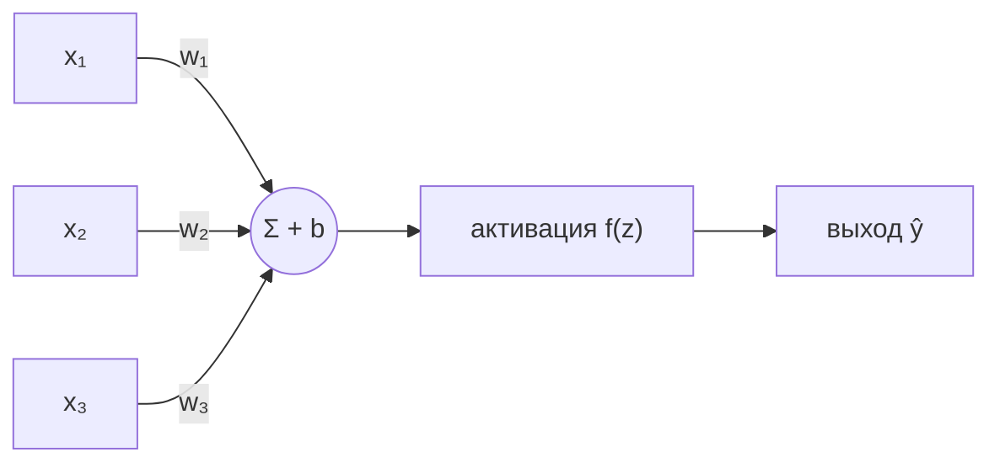
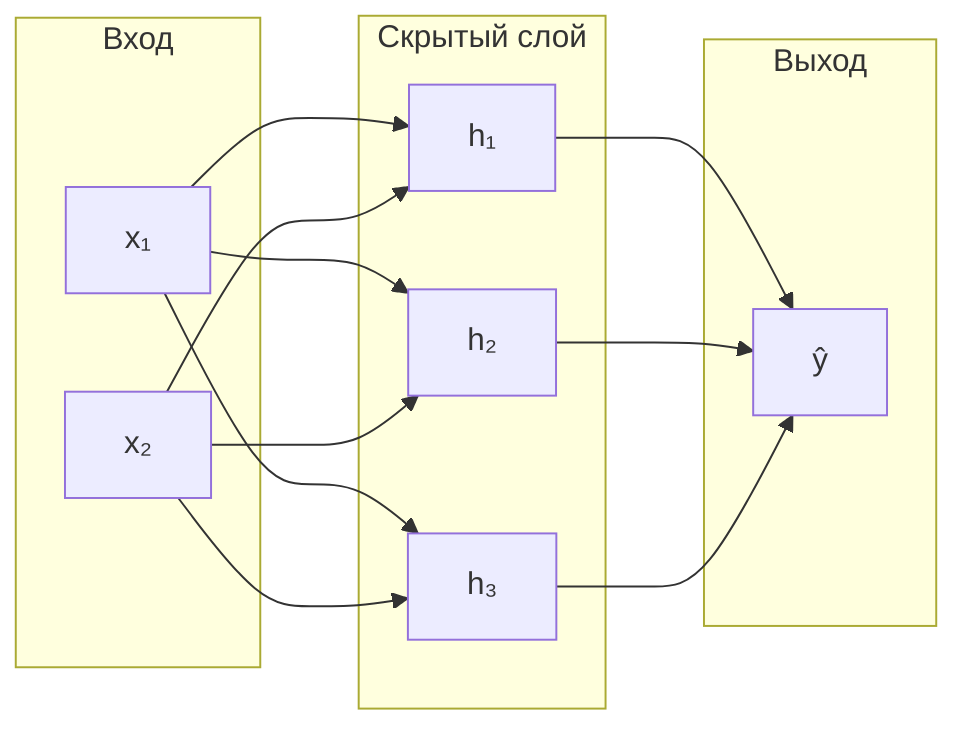
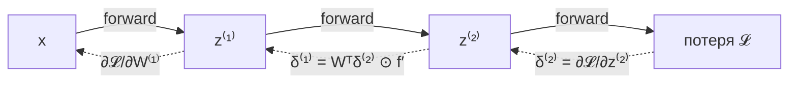
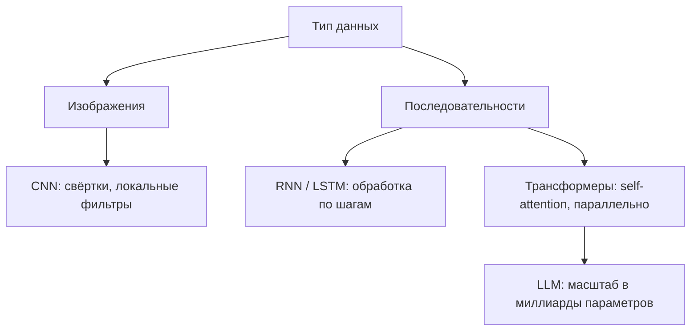

Нейронные сети — это семейство моделей, которые строят сложные функции из множества простых, обучаемых элементов. Если линейные модели и деревья (см. [машинное обучение](/machine-learning/)) хорошо работают на табличных данных с понятными признаками, то нейросети раскрываются там, где признаки нужно извлекать из «сырых» данных: пикселей, звука, текста. Цена за эту гибкость — много данных и вычислений. Разберём, как это устроено, начиная с одного нейрона.

## Перцептрон и биологическая аналогия

Биологический нейрон получает сигналы через дендриты, суммирует их и «срабатывает» (выдаёт импульс по аксону), если суммарное возбуждение превысило порог. Искусственный нейрон — это грубая математическая карикатура на эту идею: он берёт взвешенную сумму входов и пропускает её через нелинейную функцию.

Перцептрон Розенблатта (1958) — простейший такой нейрон. На входе вектор признаков $x = (x_1, \dots, x_n)$, у нейрона есть веса $w = (w_1, \dots, w_n)$ и смещение (bias) $b$. Он вычисляет:

$$
z = \sum_{i=1}^{n} w_i x_i + b = w^\top x + b, \qquad
\hat{y} = \begin{cases} 1, & z \ge 0 \\ 0, & z < 0 \end{cases}
$$



Геометрически перцептрон проводит гиперплоскость $w^\top x + b = 0$ и относит точки по одну её сторону к классу 1, по другую — к классу 0. Это линейный классификатор: один нейрон не способен разделить классы, между которыми нет прямой границы.

:::caution[Проблема XOR]
Один перцептрон не может выучить функцию XOR: нет такой прямой, которая отделит пары $(0,0),(1,1)$ от $(0,1),(1,0)$. Именно это ограничение в 1969 году заморозило интерес к нейросетям. Решение — складывать нейроны в слои: композиция нелинейных слоёв задаёт уже криволинейные границы.
:::

## Полносвязный слой, веса и смещения

Полносвязный (dense, fully-connected) слой — это просто несколько нейронов, работающих параллельно над одним и тем же входом. Если вход — вектор размерности $n$, а в слое $m$ нейронов, то веса удобно собрать в матрицу $W \in \mathbb{R}^{m \times n}$, а смещения — в вектор $b \in \mathbb{R}^{m}$:

$$
z = W x + b, \qquad a = f(z),
$$

где $f$ применяется покомпонентно, $z, a \in \mathbb{R}^m$. Каждая строка матрицы $W$ — это веса одного нейрона. Понимание этого как матричного умножения важно: всё обучение нейросети — это операции линейной алгебры на GPU (см. [линейная алгебра](/linear-algebra/)).

Сеть из нескольких таких слоёв называется многослойным перцептроном (MLP). Слой $l$ принимает на вход активации предыдущего слоя:

$$
a^{(l)} = f\!\left(W^{(l)} a^{(l-1)} + b^{(l)}\right), \qquad a^{(0)} = x.
$$



:::note[Зачем нужна нелинейность]
Без функции активации $f$ композиция слоёв $W^{(2)}(W^{(1)} x + b^{(1)}) + b^{(2)}$ снова сворачивается в одно линейное преобразование $W' x + b'$. Сколько бы слоёв вы ни сложили, без нелинейности это останется линейной моделью. Нелинейность $f$ — то, что даёт сети выразительную силу.
:::

## Функции активации

Активация — это нелинейная функция, через которую проходит выход $z$ каждого нейрона. Три самые ходовые:

### Sigmoid

$$
\sigma(z) = \frac{1}{1 + e^{-z}} \in (0, 1)
$$

Сжимает любое число в интервал $(0,1)$, поэтому удобна для интерпретации как вероятность на выходе бинарного классификатора. Её производная компактна: $\sigma'(z) = \sigma(z)\,(1-\sigma(z))$. Минус — насыщение: при больших $|z|$ производная близка к нулю, градиент «затухает», и глубокие слои почти перестают обучаться (проблема исчезающего градиента).

### ReLU

$$
\mathrm{ReLU}(z) = \max(0, z)
$$

Сейчас это стандарт для скрытых слоёв. Считается мгновенно, не насыщается для $z > 0$ (производная равна 1), что резко ускоряет обучение глубоких сетей. Риск — «мёртвые» нейроны: если на нейрон постоянно приходит $z < 0$, его градиент всегда 0 и он не обучается. Лечится вариантами вроде Leaky ReLU: $\max(0.01 z, z)$.

### Softmax

Используется на выходе для многоклассовой классификации. Превращает вектор «сырых» оценок (логитов) $z \in \mathbb{R}^K$ в распределение вероятностей по $K$ классам:

$$
\mathrm{softmax}(z)_k = \frac{e^{z_k}}{\sum_{j=1}^{K} e^{z_j}}, \qquad \sum_{k} \mathrm{softmax}(z)_k = 1.
$$

| Активация | Диапазон | Где применяют | Особенность |
|---|---|---|---|
| Sigmoid | $(0, 1)$ | выход бинарной классификации | насыщается, затухающий градиент |
| ReLU | $[0, +\infty)$ | скрытые слои | быстро, но возможны «мёртвые» нейроны |
| Softmax | вектор-распределение | выход мультиклассификации | нормирует сумму к 1 |

```python
import numpy as np

def sigmoid(z):
    return 1.0 / (1.0 + np.exp(-z))

def relu(z):
    return np.maximum(0.0, z)

def softmax(z):
    z = z - z.max(axis=-1, keepdims=True)  # стабилизация от переполнения
    e = np.exp(z)
    return e / e.sum(axis=-1, keepdims=True)
```

:::tip
Сдвиг `z - z.max(...)` в softmax не меняет результат (числитель и знаменатель домножаются на одну константу $e^{-\max z}$), но защищает от переполнения `exp` на больших логитах.
:::

## Прямой проход и функция потерь

Прямой проход (forward pass) — это последовательное вычисление активаций от входа к выходу. Для сети из $L$ слоёв:

$$
x \to z^{(1)} \to a^{(1)} \to z^{(2)} \to a^{(2)} \to \dots \to a^{(L)} = \hat{y}.
$$

Чтобы оценить, насколько предсказание $\hat{y}$ хорошо, нужна функция потерь $\mathcal{L}(\hat{y}, y)$. Выбор зависит от задачи:

- **Регрессия** — средняя квадратичная ошибка (MSE):
$$
\mathcal{L} = \frac{1}{N}\sum_{i=1}^{N}\left(\hat{y}_i - y_i\right)^2.
$$
- **Классификация** — перекрёстная энтропия (cross-entropy). Для $K$ классов, где $y$ — one-hot вектор истинного класса:
$$
\mathcal{L} = -\sum_{k=1}^{K} y_k \log \hat{y}_k.
$$

Cross-entropy в паре с softmax — каноничный выбор: вместе они дают особенно простой градиент $\hat{y} - y$. Основы вероятностной интерпретации потерь — в разделе [вероятность](/probability/), а связь с оценкой максимального правдоподобия — в [статистике](/statistics/).

## Обратное распространение ошибки

Обучить сеть — значит подобрать все веса $W^{(l)}$ и смещения $b^{(l)}$ так, чтобы потери были минимальны. Для этого нужен градиент потерь по каждому параметру: $\frac{\partial \mathcal{L}}{\partial W^{(l)}}$ и $\frac{\partial \mathcal{L}}{\partial b^{(l)}}$. Параметров миллионы, поэтому считать производные «в лоб» по каждому невозможно. Backpropagation — это эффективный способ вычислить их все за один обратный проход, применяя [цепное правило](/calculus/chain-rule/).

Идея в том, что сеть — это композиция функций, и производная композиции есть произведение производных. Считаем «ошибку» $\delta^{(l)} = \frac{\partial \mathcal{L}}{\partial z^{(l)}}$ на выходе каждого слоя и распространяем её с конца к началу:

$$
\delta^{(L)} = \nabla_{a}\mathcal{L} \odot f'(z^{(L)}),
\qquad
\delta^{(l)} = \left(W^{(l+1)\top}\delta^{(l+1)}\right) \odot f'(z^{(l)}),
$$

где $\odot$ — покомпонентное умножение. Зная $\delta^{(l)}$, градиенты по параметрам слоя получаются сразу:

$$
\frac{\partial \mathcal{L}}{\partial W^{(l)}} = \delta^{(l)} \, a^{(l-1)\top},
\qquad
\frac{\partial \mathcal{L}}{\partial b^{(l)}} = \delta^{(l)}.
$$



:::note[Главная мысль]
Backpropagation — это не отдельный «магический» алгоритм, а аккуратное применение цепного правила к графу вычислений. Современные фреймворки (PyTorch, TensorFlow) делают это автоматически (autograd): вы описываете только прямой проход, а градиенты строятся по графу операций. Понимать механику всё равно полезно — чтобы диагностировать затухающие/взрывающиеся градиенты.
:::

## Обучение через SGD

Имея градиент, обновляем параметры в сторону его антиградиента — это градиентный спуск. Для параметра $\theta$ (любого веса или смещения) и скорости обучения $\eta$:

$$
\theta \leftarrow \theta - \eta \, \frac{\partial \mathcal{L}}{\partial \theta}.
$$

Считать градиент по всему датасету на каждом шаге дорого. Поэтому используют стохастический градиентный спуск (SGD): на каждом шаге берут небольшую случайную выборку — мини-батч — и оценивают градиент по ней. Это шумнее, но многократно быстрее, а шум даже помогает выбираться из плохих локальных минимумов.

```python
# Один шаг обучения (псевдо-PyTorch)
for x_batch, y_batch in dataloader:      # перебор мини-батчей
    y_hat = model(x_batch)               # прямой проход
    loss = criterion(y_hat, y_batch)     # функция потерь
    optimizer.zero_grad()                # обнулить старые градиенты
    loss.backward()                      # backprop: заполнить .grad
    optimizer.step()                     # шаг SGD: обновить веса
```

Один полный проход по всем данным называется эпохой; обучение длится много эпох. На практике вместо «ванильного» SGD берут адаптивные оптимизаторы (Adam, AdamW), которые подстраивают шаг под каждый параметр и сходятся быстрее. Слишком большой $\eta$ — потери расходятся; слишком малый — обучение ползёт. Основы оптимизации и понятие градиента подробнее — в разделе [математический анализ](/calculus/).

## Обзор архитектур

MLP плохо подходит для структурированных данных: он не учитывает, что соседние пиксели изображения связаны, а слова в предложении идут по порядку. Под разные типы данных придуманы специализированные архитектуры.

### CNN — свёрточные сети

Для изображений. Вместо полносвязности используют свёртку: небольшое обучаемое ядро (фильтр) скользит по изображению и выделяет локальные паттерны — края, текстуры, а в глубоких слоях — части объектов. Ключевые идеи: локальность (нейрон смотрит на маленькую область) и разделение весов (один фильтр применяется ко всему изображению, резко сокращая число параметров). Это основа компьютерного зрения.

### RNN — рекуррентные сети

Для последовательностей (текст, временные ряды, речь). Сеть обрабатывает элементы по одному, сохраняя «память» — скрытое состояние $h_t$, которое обновляется на каждом шаге:

$$
h_t = f\!\left(W_h h_{t-1} + W_x x_t + b\right).
$$

Базовые RNN плохо помнят длинный контекст из-за затухающих градиентов; их улучшенные версии — LSTM и GRU — с механизмом «ворот» удерживают информацию дольше.

### Трансформеры и LLM

Сегодняшний стандарт для текста и многого другого. Вместо рекуррентности трансформер использует механизм внимания (self-attention): каждый элемент последовательности напрямую «смотрит» на все остальные и взвешивает их важность. Это позволяет обрабатывать всю последовательность параллельно (а не по шагам, как RNN) и улавливать связи между далёкими словами.

Большие языковые модели (LLM, например семейства GPT и Claude) — это трансформеры с миллиардами параметров, обученные предсказывать следующий токен на огромных корпусах текста. Их масштаб и архитектура и дали скачок качества в обработке естественного языка.



| Архитектура | Данные | Ключевая идея |
|---|---|---|
| MLP | табличные / векторы | полносвязные слои |
| CNN | изображения | свёртка, разделение весов |
| RNN / LSTM | последовательности | скрытое состояние, рекуррентность |
| Трансформер | последовательности | self-attention, параллелизм |

## Когда нужен DL и какова его цена

Глубокое обучение — мощный, но дорогой инструмент. Прежде чем тянуться к нейросети, честно оцените задачу.

**DL оправдан, когда:**
- данных много (десятки тысяч примеров и больше);
- признаки «сырые» и сложные — пиксели, аудио, текст, — и ручная их инженерия трудна;
- задача допускает сбор/разметку больших объёмов или есть предобученные модели для дообучения (transfer learning).

**Цена:**
- **Данные.** Глубокие сети «голодные»: на малых выборках они переобучаются и проигрывают простым моделям.
- **Вычисления.** Обучение требует GPU/TPU, времени и энергии; крупные модели — серьёзных кластеров.
- **Сложность и интерпретируемость.** Нейросеть — «чёрный ящик»: объяснить конкретное решение сложнее, чем у линейной модели или дерева.
- **Инженерия.** Подбор архитектуры, гиперпараметров, регуляризации, мониторинг обучения.

:::tip[Правило большого пальца]
На табличных данных малого/среднего объёма начинайте с градиентного бустинга (XGBoost, LightGBM) или линейных моделей — часто они и точнее, и дешевле. Нейросети берите там, где данных много и они неструктурированы (зрение, речь, текст). Не усложняйте без необходимости.
:::

## Задания

### Задание 1. Прямой проход одного нейрона

Нейрон с весами $w = (0.5,\ -1.0)$, смещением $b = 0.2$ и сигмоидной активацией получает вход $x = (2,\ 1)$. Вычислите $z$ и выход $a = \sigma(z)$.

<details>
<summary>Решение</summary>

Сначала линейная часть:

$$
z = w^\top x + b = 0.5 \cdot 2 + (-1.0)\cdot 1 + 0.2 = 1.0 - 1.0 + 0.2 = 0.2.
$$

Затем активация:

$$
a = \sigma(0.2) = \frac{1}{1 + e^{-0.2}} \approx \frac{1}{1 + 0.8187} \approx 0.5498.
$$

```python
import numpy as np
w, b, x = np.array([0.5, -1.0]), 0.2, np.array([2.0, 1.0])
z = w @ x + b
a = 1 / (1 + np.exp(-z))
print(round(z, 3), round(a, 4))  # 0.2 0.5498
```

</details>

### Задание 2. Почему сеть без активаций бесполезна

Покажите, что двухслойная сеть без нелинейной активации эквивалентна одному линейному слою.

<details>
<summary>Решение</summary>

Пусть первый слой даёт $a^{(1)} = W^{(1)} x + b^{(1)}$, второй — $a^{(2)} = W^{(2)} a^{(1)} + b^{(2)}$ (активаций нет). Подставим:

$$
a^{(2)} = W^{(2)}\left(W^{(1)} x + b^{(1)}\right) + b^{(2)}
= \underbrace{W^{(2)} W^{(1)}}_{W'}\, x + \underbrace{W^{(2)} b^{(1)} + b^{(2)}}_{b'}.
$$

Получили $a^{(2)} = W' x + b'$ — обычное линейное (аффинное) преобразование. Любое число линейных слоёв подряд схлопывается в одно, поэтому без нелинейности глубина не даёт никакой выразительной силы.

</details>

### Задание 3. Softmax и cross-entropy

Сеть выдала логиты $z = (2,\ 0,\ -1)$ для трёх классов. Истинный класс — первый (one-hot $y = (1, 0, 0)$). Вычислите вероятности через softmax и значение перекрёстной энтропии.

<details>
<summary>Решение</summary>

Экспоненты: $e^{2} \approx 7.389$, $e^{0} = 1$, $e^{-1} \approx 0.368$. Сумма $\approx 8.757$.

$$
\mathrm{softmax}(z) \approx \left(\tfrac{7.389}{8.757},\ \tfrac{1}{8.757},\ \tfrac{0.368}{8.757}\right) \approx (0.844,\ 0.114,\ 0.042).
$$

Перекрёстная энтропия (вклад даёт только истинный класс):

$$
\mathcal{L} = -\log \hat{y}_1 \approx -\log(0.844) \approx 0.170.
$$

Чем увереннее сеть в правильном классе, тем ближе $\hat{y}_1$ к 1 и тем меньше потеря.

</details>

### Задание 4. Шаг градиентного спуска

Минимизируем $\mathcal{L}(\theta) = (\theta - 3)^2$. Текущее $\theta = 0$, скорость обучения $\eta = 0.1$. Сделайте один шаг градиентного спуска и объясните, куда движется $\theta$.

<details>
<summary>Решение</summary>

Производная: $\dfrac{d\mathcal{L}}{d\theta} = 2(\theta - 3)$. В точке $\theta = 0$ она равна $2(0 - 3) = -6$.

Шаг обновления:

$$
\theta \leftarrow \theta - \eta \cdot (-6) = 0 - 0.1 \cdot (-6) = 0.6.
$$

Градиент отрицателен, значит функция убывает при росте $\theta$, и спуск двигает $\theta$ в сторону увеличения — к минимуму в точке $\theta = 3$. Повторяя шаги, $\theta$ будет приближаться к 3.

</details>
