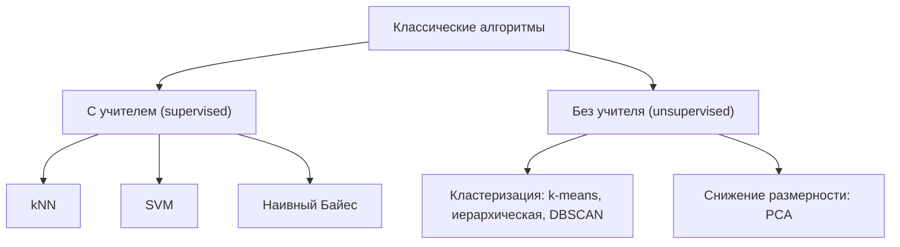
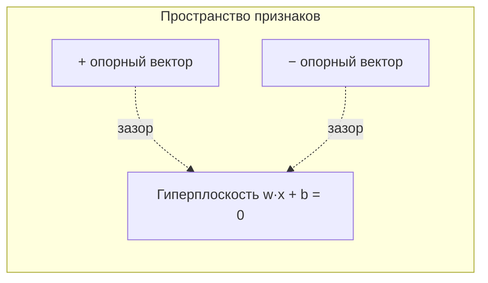
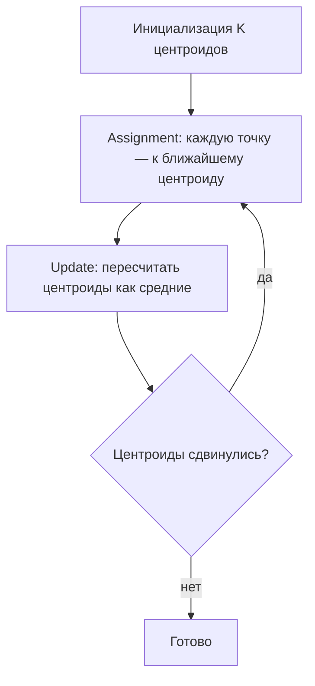

До сих пор мы разбирали линейные модели и деревья. Но «классический» арсенал ML гораздо шире. В этом разделе соберём пять идей, которые обязан знать любой практик: они дёшевы, интерпретируемы и часто оказываются достаточно хороши, чтобы не доставать тяжёлую артиллерию. Мы пройдёмся по методу ближайших соседей, методу опорных векторов, наивному Байесу, кластеризации и снижению размерности — у каждого своя геометрическая или вероятностная интуиция.

Условно эти алгоритмы делятся на две большие группы.



Предполагается, что вы уже знакомы с базовыми понятиями из раздела [Машинное обучение](/machine-learning/), а также с [линейной алгеброй](/linear-algebra/) и [вероятностями](/probability/).

## Метод k ближайших соседей (kNN)

Идея почти неприлично проста: чтобы предсказать метку нового объекта, посмотри на $k$ ближайших к нему объектов обучающей выборки и проголосуй большинством (для классификации) или усредни их значения (для регрессии).

### Ленивое обучение

kNN — это **ленивый алгоритм** (lazy learner). Этап «обучения» сводится к тому, чтобы просто запомнить обучающую выборку. Вся работа происходит на этапе предсказания: нужно посчитать расстояния до всех точек и найти ближайшие. Это противоположность «жадным» (eager) моделям вроде линейной регрессии, которые тратят время на обучение, но потом предсказывают мгновенно.

| Свойство | kNN | Линейная модель |
|---|---|---|
| Время обучения | почти ноль | значимое |
| Время предсказания | большое (нужно сканировать данные) | мгновенное |
| Память на этапе предсказания | вся выборка | только параметры |
| Граница решений | произвольная, нелинейная | линейная |

:::caution[Проклятие размерности]
В пространствах высокой размерности понятие «близости» вырождается: расстояния между всеми точками становятся почти одинаковыми, и kNN теряет смысл. Перед применением полезно снизить размерность (см. PCA ниже) или тщательно отобрать признаки.
:::

### Метрики расстояния

Качество kNN критически зависит от того, как мы измеряем «близость». Самое популярное — расстояние Минковского, обобщающее евклидово и манхэттенское:

$$
d_p(\vec{x}, \vec{y}) = \left( \sum_{i=1}^{n} |x_i - y_i|^p \right)^{1/p}
$$

- $p = 2$ — **евклидово** расстояние (обычная «прямая линия»).
- $p = 1$ — **манхэттенское** (city block, сумма модулей).
- $p \to \infty$ — расстояние **Чебышёва** $\max_i |x_i - y_i|$.

Для текстов и разреженных векторов чаще берут **косинусную меру близости**:

$$
\cos(\vec{x}, \vec{y}) = \frac{\vec{x} \cdot \vec{y}}{\|\vec{x}\| \, \|\vec{y}\|}
$$

:::tip[Масштабируйте признаки!]
kNN использует расстояния, поэтому признак с большим диапазоном (например, доход в рублях) задавит признак с маленьким (например, возраст). Перед обучением почти всегда нужна стандартизация: `StandardScaler` приводит каждый признак к нулевому среднему и единичной дисперсии.
:::

### Выбор k

Параметр $k$ управляет компромиссом смещение–разброс:

- **Маленький $k$** (например, $k=1$): модель гибкая, граница решений изломанная, легко переобучается на шум — высокий разброс.
- **Большой $k$**: граница сглаживается, модель грубее, теряет локальные детали — высокое смещение. В пределе $k = N$ всегда предсказывается самый частый класс.

Хорошая эвристика для старта — $k \approx \sqrt{N}$, а далее подбираем по кросс-валидации. Для бинарной классификации берут **нечётное** $k$, чтобы избежать ничьих.

```python
import numpy as np
from sklearn.datasets import load_iris
from sklearn.model_selection import train_test_split
from sklearn.preprocessing import StandardScaler
from sklearn.neighbors import KNeighborsClassifier
from sklearn.pipeline import make_pipeline

X, y = load_iris(return_X_y=True)
X_tr, X_te, y_tr, y_te = train_test_split(X, y, test_size=0.3, random_state=42)

# Pipeline: масштабирование обязательно для kNN
clf = make_pipeline(StandardScaler(), KNeighborsClassifier(n_neighbors=5))
clf.fit(X_tr, y_tr)
print(f"Accuracy: {clf.score(X_te, y_te):.3f}")
```

## Метод опорных векторов (SVM)

SVM ищет не просто разделяющую границу, а **лучшую** из всех возможных. Для линейно разделимых классов таких границ бесконечно много — SVM выбирает ту, что проходит максимально далеко от обеих групп точек.

### Разделяющая гиперплоскость и зазор

Гиперплоскость задаётся уравнением $\vec{w} \cdot \vec{x} + b = 0$. Метки классов кодируем как $y_i \in \{-1, +1\}$. SVM максимизирует **зазор** (margin) — ширину «полосы» между классами, равную $\dfrac{2}{\|\vec{w}\|}$. Максимизация зазора эквивалентна минимизации $\|\vec{w}\|$:

$$
\min_{\vec{w}, b} \frac{1}{2}\|\vec{w}\|^2
\quad \text{при условии} \quad
y_i (\vec{w} \cdot \vec{x}_i + b) \ge 1 \;\; \forall i
$$

Точки, лежащие точно на границе полосы (для которых ограничение обращается в равенство), и называются **опорными векторами**. Только они определяют решение — остальные точки можно выбросить, граница не изменится.



### Мягкий зазор

Реальные данные редко идеально разделимы. **Мягкий зазор** (soft margin) допускает ошибки через штрафные переменные $\xi_i$ и гиперпараметр $C$:

$$
\min_{\vec{w}, b, \xi} \frac{1}{2}\|\vec{w}\|^2 + C \sum_{i=1}^{N} \xi_i
$$

- **Большой $C$**: ошибки дороги, модель старается классифицировать всё верно — узкий зазор, риск переобучения.
- **Маленький $C$**: широкий зазор, больше допустимых ошибок — лучше обобщение, риск недообучения.

### Kernel trick

Что если данные нельзя разделить прямой? Идея ядерного трюка: неявно отобразить точки в пространство более высокой размерности, где они становятся линейно разделимыми. Самое красивое — нам не нужно вычислять само отображение $\phi(\vec{x})$, достаточно знать **скалярное произведение** в новом пространстве через функцию-ядро:

$$
K(\vec{x}_i, \vec{x}_j) = \phi(\vec{x}_i) \cdot \phi(\vec{x}_j)
$$

| Ядро | Формула | Когда применять |
|---|---|---|
| Линейное | $\vec{x}_i \cdot \vec{x}_j$ | много признаков, текст |
| Полиномиальное | $(\gamma \, \vec{x}_i \cdot \vec{x}_j + r)^d$ | известна полиномиальная структура |
| RBF (гауссово) | $\exp(-\gamma \|\vec{x}_i - \vec{x}_j\|^2)$ | универсальный выбор по умолчанию |

```python
from sklearn.svm import SVC

# RBF-ядро; C и gamma обычно подбирают по сетке
svm = make_pipeline(StandardScaler(), SVC(kernel="rbf", C=1.0, gamma="scale"))
svm.fit(X_tr, y_tr)
print(f"Accuracy: {svm.score(X_te, y_te):.3f}")
```

:::note
RBF-ядро `gamma` управляет «радиусом влияния» одной точки: большое `gamma` — узкие колоколы, изломанная граница и переобучение; маленькое — гладкая граница. Пара `(C, gamma)` обычно настраивается совместно через `GridSearchCV`.
:::

## Наивный байесовский классификатор

Это вероятностный классификатор, прямое применение [теоремы Байеса](/probability/bayes/). Мы хотим найти класс $c$, наиболее вероятный при наблюдаемых признаках $\vec{x} = (x_1, \dots, x_n)$:

$$
P(c \mid \vec{x}) = \frac{P(\vec{x} \mid c) \, P(c)}{P(\vec{x})}
$$

### В чём «наивность»

Прямое моделирование $P(\vec{x} \mid c)$ требует учёта всех зависимостей между признаками — это экспоненциально дорого. «Наивное» допущение: **признаки условно независимы при заданном классе**. Тогда совместная вероятность распадается в произведение:

$$
P(\vec{x} \mid c) = \prod_{i=1}^{n} P(x_i \mid c)
$$

Знаменатель $P(\vec{x})$ одинаков для всех классов, поэтому его можно отбросить и выбирать класс по максимуму:

$$
\hat{c} = \arg\max_{c} \; P(c) \prod_{i=1}^{n} P(x_i \mid c)
$$

На практике перемножение многих маленьких вероятностей вызывает потерю точности, поэтому работают с логарифмами: $\log P(c) + \sum_i \log P(x_i \mid c)$.

### Разновидности

- **Multinomial NB** — для счётных признаков (частоты слов); рабочая лошадка классификации текстов и спам-фильтров.
- **Bernoulli NB** — бинарные признаки (есть слово / нет слова).
- **Gaussian NB** — непрерывные признаки, предполагается нормальное распределение $P(x_i \mid c)$ внутри класса.

:::tip[Сглаживание Лапласа]
Если в обучении некоторое слово ни разу не встретилось в классе, то $P(x_i \mid c) = 0$ обнулит всё произведение. Сглаживание добавляет псевдосчёт $\alpha$ (обычно $\alpha = 1$) ко всем частотам, устраняя нулевые вероятности.
:::

Несмотря на заведомо неверное допущение о независимости, наивный Байес удивительно хорош как baseline, обучается за один проход по данным и почти не требует настройки.

## Кластеризация

Кластеризация — обучение **без учителя**: меток нет, цель — самостоятельно сгруппировать похожие объекты.

### k-means

Алгоритм разбивает данные на $K$ кластеров, минимизируя суммарный внутрикластерный разброс (инерцию):

$$
J = \sum_{k=1}^{K} \sum_{\vec{x} \in C_k} \|\vec{x} - \vec{\mu}_k\|^2
$$

где $\vec{\mu}_k$ — центроид (среднее точек) кластера $C_k$. Алгоритм итеративно чередует два шага.



Особенности: нужно заранее задать $K$; результат зависит от начальной инициализации (используют `k-means++`); алгоритм предполагает выпуклые кластеры примерно одного размера и плохо справляется с вытянутыми или вложенными формами.

**Выбор K** делают методом локтя (elbow): строят график инерции от $K$ и ищут точку перегиба; либо по **силуэту** — метрике, оценивающей, насколько объект ближе к своему кластеру, чем к соседним.

```python
from sklearn.cluster import KMeans
from sklearn.metrics import silhouette_score

km = KMeans(n_clusters=3, init="k-means++", n_init=10, random_state=42)
labels = km.fit_predict(X)
print(f"Inertia: {km.inertia_:.1f}")
print(f"Silhouette: {silhouette_score(X, labels):.3f}")
```

### Иерархическая кластеризация

Строит дерево вложенных кластеров — **дендрограмму**. Агломеративный (снизу вверх) вариант: каждая точка начинает как отдельный кластер, далее на каждом шаге сливаются два ближайших. Способ измерения расстояния между кластерами — *linkage*:

| Linkage | Расстояние между кластерами |
|---|---|
| single | минимальное между точками (цепочки) |
| complete | максимальное между точками (компактные) |
| average | среднее по всем парам |
| ward | минимизирует прирост внутрикластерной дисперсии |

Главный плюс: $K$ не нужно задавать заранее — его выбирают, «разрезав» дендрограмму на нужной высоте.

### DBSCAN (кратко)

Плотностная кластеризация. Кластер — это область высокой плотности точек, разделённая разреженными зонами. Два параметра: радиус $\varepsilon$ и минимальное число соседей `min_samples`. Достоинства: сам определяет число кластеров, находит кластеры произвольной формы и явно помечает **выбросы** (шум) как точки, не попавшие ни в один кластер. Слабость: плохо работает, когда плотность кластеров сильно различается.

| Алгоритм | Нужно задать K | Форма кластеров | Выбросы |
|---|---|---|---|
| k-means | да | выпуклые, сферичные | нет |
| Иерархический | нет (разрез) | зависит от linkage | нет |
| DBSCAN | нет | произвольная | да |

## Снижение размерности: PCA

Метод главных компонент (Principal Component Analysis) проецирует данные в пространство меньшей размерности, сохраняя как можно больше **дисперсии** — то есть информации о вариативности данных.

### Интуиция

PCA ищет новые ортогональные оси (главные компоненты), вдоль которых данные «разбросаны» сильнее всего. Первая компонента — направление максимальной дисперсии, вторая — максимальной из оставшейся при условии перпендикулярности первой, и так далее. Отбросив компоненты с малой дисперсией, мы сжимаем данные с минимальной потерей.

### Связь с разложениями матриц

Формально PCA — это собственное разложение ковариационной матрицы. Сначала данные центрируют (вычитают среднее), затем считают ковариационную матрицу:

$$
\Sigma = \frac{1}{N-1} X^\top X
$$

Её **собственные векторы** $\vec{v}_i$ задают направления главных компонент, а **собственные значения** $\lambda_i$ — величину дисперсии вдоль них:

$$
\Sigma \vec{v}_i = \lambda_i \vec{v}_i
$$

Доля объяснённой дисперсии $k$-й компоненты равна $\dfrac{\lambda_k}{\sum_j \lambda_j}$. На практике PCA вычисляют через сингулярное разложение (SVD) матрицы данных — это устойчивее численно. Подробно об этом в разделе [Разложения матриц](/linear-algebra/decompositions/).

:::caution
PCA чувствителен к масштабу: признак с большой дисперсией перетянет на себя первые компоненты. Перед PCA данные почти всегда стандартизируют. Кроме того, новые оси — линейные комбинации исходных признаков, поэтому интерпретируемость теряется.
:::

```python
from sklearn.decomposition import PCA

pca = make_pipeline(StandardScaler(), PCA(n_components=2))
X_2d = pca.fit_transform(X)
explained = pca.named_steps["pca"].explained_variance_ratio_
print(f"Объяснённая дисперсия: {explained.round(3)}, сумма: {explained.sum():.3f}")
```

PCA удобен для визуализации многомерных данных в 2D/3D, борьбы с проклятием размерности перед kNN/SVM и удаления коррелированных признаков (шума).

## Задания

### Задание 1. kNN вручную

Дана обучающая выборка из точек на плоскости с метками:
A(1, 1)=🔴, B(1, 2)=🔴, C(4, 4)=🔵, D(6, 4)=🔵, E(5, 5)=🔵.
Какую метку kNN с $k=3$ и евклидовым расстоянием присвоит точке $Q(4, 1)$?

<details>
<summary>Решение</summary>

Считаем евклидовы расстояния от $Q(4,1)$ до каждой точки:

- до A(1,1): $\sqrt{3^2+0^2}=3{,}00$
- до B(1,2): $\sqrt{3^2+1^2}=\sqrt{10}\approx 3{,}16$
- до C(4,4): $\sqrt{0^2+3^2}=3{,}00$
- до D(6,4): $\sqrt{2^2+3^2}=\sqrt{13}\approx 3{,}61$
- до E(5,5): $\sqrt{1^2+4^2}=\sqrt{17}\approx 4{,}12$

Три ближайших: A (3,00, 🔴), C (3,00, 🔵), B (3,16, 🔴). Голосование: 🔴 — 2 голоса, 🔵 — 1 голос.

Ответ: kNN присвоит метку 🔴 (красный).

</details>

### Задание 2. Роль гиперпараметра C в SVM

Объясните, почему очень большое значение $C$ в SVM с мягким зазором ведёт к переобучению, и что произойдёт в пределе $C \to \infty$.

<details>
<summary>Решение</summary>

В целевой функции $\frac{1}{2}\|\vec{w}\|^2 + C\sum_i \xi_i$ параметр $C$ — это цена нарушений зазора $\xi_i$.

- При **большом** $C$ слагаемое со штрафами доминирует, и оптимизатор любой ценой минимизирует $\sum_i \xi_i$, то есть старается классифицировать все обучающие точки правильно. Зазор сужается, граница изгибается, подстраиваясь под отдельные точки (в том числе шумовые) — это и есть переобучение: высокая точность на трейне, плохое обобщение.
- В пределе $C \to \infty$ ошибки становятся бесконечно дорогими, и задача вырождается в **жёсткий зазор** (hard margin): ни одного нарушения не допускается. Если данные не разделимы линейно (с учётом ядра), задача становится несовместной/неустойчивой.

Маленький $C$, наоборот, даёт широкий зазор и больше допустимых ошибок — выше смещение, но лучше обобщение.

</details>

### Задание 3. Наивный Байес со сглаживанием

Спам-фильтр обучен на словах. В классе «спам» (всего 8 слов в словаре класса) слово «выигрыш» встретилось 3 раза. Найдите $P(\text{«выигрыш»} \mid \text{спам})$ без сглаживания и со сглаживанием Лапласа ($\alpha=1$), если размер словаря $V=8$.

<details>
<summary>Решение</summary>

Без сглаживания — обычная относительная частота:

$$
P(\text{«выигрыш»} \mid \text{спам}) = \frac{3}{8} = 0{,}375
$$

Со сглаживанием Лапласа добавляем $\alpha=1$ к числителю и $\alpha V$ к знаменателю:

$$
P_{\text{Lap}} = \frac{3 + 1}{8 + 1\cdot 8} = \frac{4}{16} = 0{,}25
$$

Сглаживание «оттянуло» вероятность от наблюдённой частоты к равномерной — это и защищает от нулевых вероятностей у слов, которых в обучении не было: для невстреченного слова получилось бы $\frac{0+1}{16}=0{,}0625$ вместо нуля.

</details>

### Задание 4. Объяснённая дисперсия PCA

После применения PCA получены собственные значения ковариационной матрицы: $\lambda = [6{,}0,\; 2{,}5,\; 1{,}0,\; 0{,}5]$. Сколько компонент нужно оставить, чтобы сохранить не менее 90% дисперсии?

<details>
<summary>Решение</summary>

Суммарная дисперсия: $6{,}0 + 2{,}5 + 1{,}0 + 0{,}5 = 10{,}0$.

Доли и накопленная сумма:

- 1 компонента: $6{,}0 / 10 = 0{,}60$ → накоплено 60%
- 2 компоненты: $+2{,}5/10 = 0{,}25$ → накоплено 85%
- 3 компоненты: $+1{,}0/10 = 0{,}10$ → накоплено 95%

90% порог преодолевается только на третьей компоненте.

Ответ: нужно оставить **3 главные компоненты** (сохранят 95% дисперсии).

</details>
