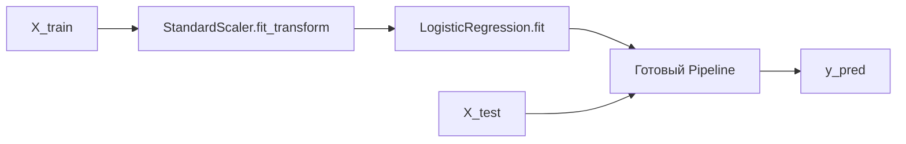
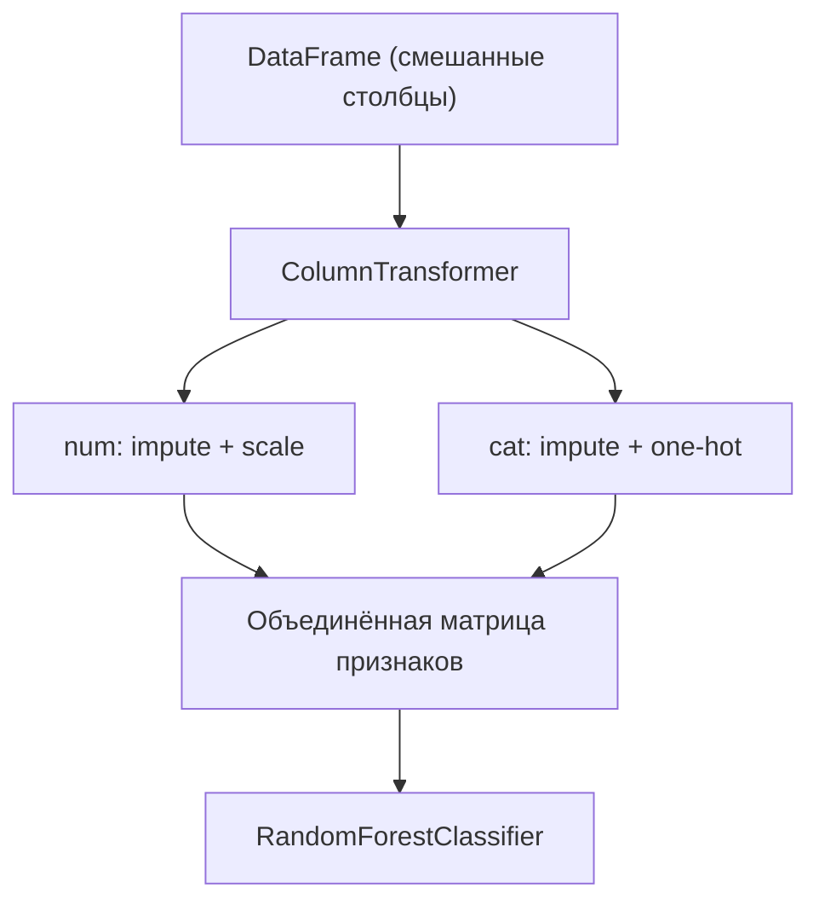
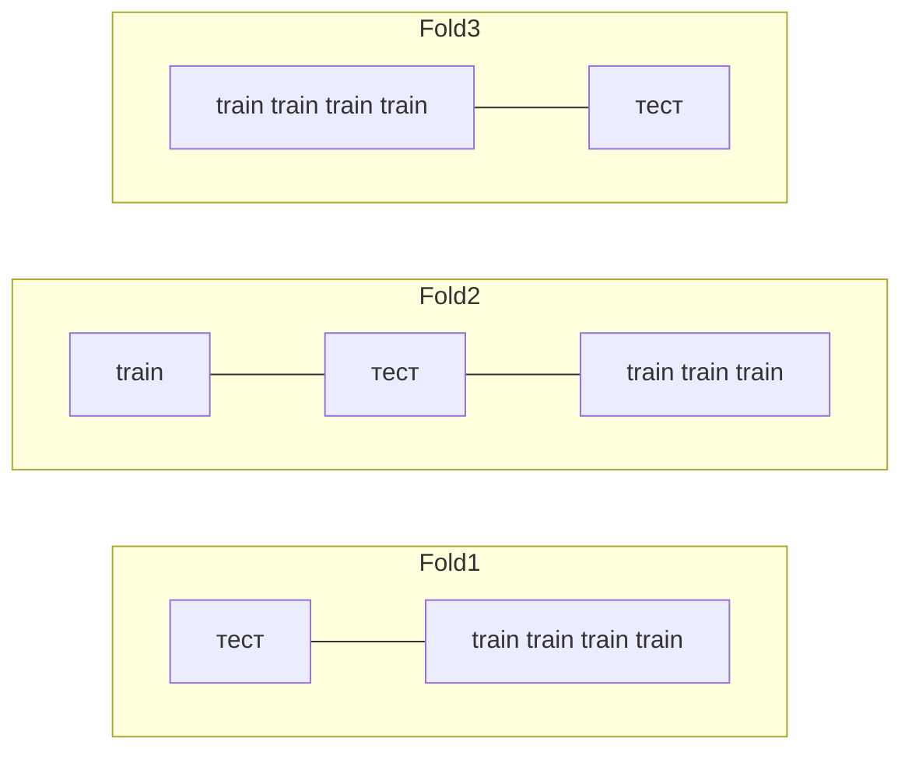
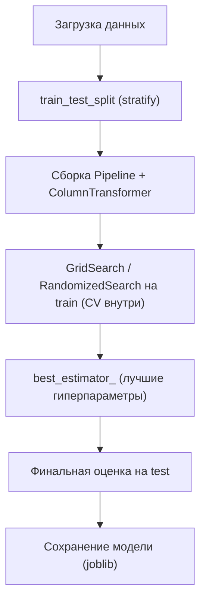

Эта страница — практическое руководство по [scikit-learn](https://scikit-learn.org/stable/), самой популярной библиотеке классического ML в Python. Мы пройдём весь путь: от сырых данных до обученной модели с честной оценкой качества. Главная идея, которую стоит усвоить: **scikit-learn устроен вокруг единого интерфейса** `fit` / `predict` / `transform`, и почти любой объект (модель, препроцессор, целый конвейер) подчиняется ему. Когда вы это поймёте, новые алгоритмы будут подключаться без чтения тонны документации.

Теоретическую базу мы тут не пересказываем — за метриками идите в [оценку качества моделей](/machine-learning/evaluation/), за подготовкой признаков — в [работу с признаками](/machine-learning/feature-engineering/), а за работой с таблицами — в [Python для данных](/python-data/).

## Единый API: estimator, transformer, predictor

В scikit-learn всё строится на трёх ролях, и один объект может играть несколько из них:

- **Estimator** — всё, что умеет `fit(X, y)`: учится по данным. Это базовая роль.
- **Transformer** — умеет `transform(X)`: преобразует данные (масштабирование, кодирование, отбор признаков). Часто есть `fit_transform`.
- **Predictor** — умеет `predict(X)`: выдаёт предсказания. У классификаторов обычно есть ещё `predict_proba`.

Соглашения об именах данных:

- `X` — матрица признаков формы (число объектов, число признаков), обычно `numpy`-массив или `pandas.DataFrame`.
- `y` — вектор целевых значений (длиной в число объектов).


:::note[Почему единый API так важен]
Из-за того, что у всех объектов одинаковые методы, их можно собирать в `Pipeline`, подменять одну модель другой одной строкой и автоматически перебирать в `GridSearchCV`. Это не «удобная мелочь», а ключевая архитектурная идея библиотеки.
:::

## Сквозной пример: от данных до метрики

Начнём с минимального, но полного цикла на встроенном датасете рака груди (бинарная классификация: доброкачественная/злокачественная опухоль). Все признаки числовые — это позволит сфокусироваться на самом пайплайне обучения.

```python
import numpy as np
from sklearn.datasets import load_breast_cancer
from sklearn.model_selection import train_test_split
from sklearn.preprocessing import StandardScaler
from sklearn.linear_model import LogisticRegression
from sklearn.metrics import accuracy_score, classification_report

# 1. Загрузка данных
data = load_breast_cancer(as_frame=True)
X = data.data           # DataFrame: 569 объектов, 30 числовых признаков
y = data.target         # Series: 0 / 1

# 2. Разбиение на обучение и тест
X_train, X_test, y_train, y_test = train_test_split(
    X, y,
    test_size=0.2,      # 20% данных — на тест
    random_state=42,    # воспроизводимость
    stratify=y,         # сохранить доли классов в обеих частях
)

# 3. Масштабирование признаков (учим ТОЛЬКО на train!)
scaler = StandardScaler()
X_train_scaled = scaler.fit_transform(X_train)
X_test_scaled = scaler.transform(X_test)   # transform, а не fit_transform!

# 4. Обучение модели
model = LogisticRegression(max_iter=1000, random_state=42)
model.fit(X_train_scaled, y_train)

# 5. Предсказание и оценка
y_pred = model.predict(X_test_scaled)
print("Accuracy:", accuracy_score(y_test, y_pred))
print(classification_report(y_test, y_pred))
```

Обратите внимание на пункт 3: `StandardScaler` учится (`fit`) только на обучающей выборке, а к тесту применяется уже обученное преобразование (`transform`). Если вызвать `fit_transform` на всех данных сразу, статистики масштабирования «подсмотрят» тест — это **утечка данных (data leakage)**, и оценка качества станет завышенной и нечестной.

### Зачем нужен train_test_split и `stratify`

Модель легко выучить так, чтобы она идеально воспроизводила обучающие данные, но плохо работала на новых. Тест — это имитация «новых данных», которых модель не видела. `train_test_split` разрезает выборку случайно.

Параметр `stratify=y` гарантирует, что доля каждого класса в train и test совпадает с долей в исходных данных. Это особенно важно при дисбалансе классов: без стратификации редкий класс может почти целиком попасть в одну из частей.

$$\text{accuracy} = \frac{\text{число верных предсказаний}}{\text{общее число объектов}} = \frac{1}{n}\sum_{i=1}^{n} \mathbb{1}[\hat{y}_i = y_i]$$

:::caution[Accuracy обманчива при дисбалансе]
Если 95% объектов одного класса, модель «всегда отвечай большинством» даёт 95% accuracy, ничему не научившись. Для таких задач смотрите precision, recall, F1 и ROC-AUC — подробно в разделе [оценка качества моделей](/machine-learning/evaluation/).
:::

## Pipeline: связываем препроцессинг и модель

Ручное чередование `fit`/`transform` для каждого шага — источник ошибок: легко забыть применить преобразование к тесту или случайно обучить его на всех данных. `Pipeline` решает это: он объединяет шаги в единый estimator, который сам правильно вызывает `fit` на обучении и `transform` на предсказании.

```python
from sklearn.pipeline import Pipeline

pipe = Pipeline(steps=[
    ("scaler", StandardScaler()),
    ("clf", LogisticRegression(max_iter=1000, random_state=42)),
])

# Один fit обучает ВСЮ цепочку:
pipe.fit(X_train, y_train)

# Один predict прогоняет данные через все шаги:
y_pred = pipe.predict(X_test)
print("Accuracy:", accuracy_score(y_test, y_pred))
```

Логика проста: при `fit` все шаги, кроме последнего, вызывают `fit_transform`, а последний (модель) — `fit`. При `predict` промежуточные шаги вызывают только `transform`. Утечка данных при таком подходе исключена by design.



## ColumnTransformer: разные преобразования для разных столбцов

Реальные таблицы смешанные: есть числовые столбцы (возраст, доход) и категориальные (город, пол). Их нельзя обрабатывать одинаково — числа надо масштабировать, категории кодировать. `ColumnTransformer` применяет свой transformer к своему набору столбцов и склеивает результат.

```python
import pandas as pd
from sklearn.compose import ColumnTransformer
from sklearn.pipeline import Pipeline
from sklearn.preprocessing import StandardScaler, OneHotEncoder
from sklearn.impute import SimpleImputer
from sklearn.ensemble import RandomForestClassifier
from sklearn.model_selection import train_test_split

# Игрушечные смешанные данные
df = pd.DataFrame({
    "age":    [25, 38, 47, 51, 22, 36, 60, 41],
    "income": [40, 75, 90, 30, 28, 65, 120, 80],   # тыс.
    "city":   ["msk", "spb", "msk", "kzn", "spb", "msk", "kzn", "spb"],
    "target": [0, 1, 1, 0, 0, 1, 1, 1],
})
X = df.drop(columns="target")
y = df["target"]

X_train, X_test, y_train, y_test = train_test_split(
    X, y, test_size=0.25, random_state=0, stratify=y
)

numeric_features = ["age", "income"]
categorical_features = ["city"]

# Под-пайплайн для чисел: заполнить пропуски -> масштабировать
numeric_tr = Pipeline([
    ("imputer", SimpleImputer(strategy="median")),
    ("scaler", StandardScaler()),
])

# Под-пайплайн для категорий: заполнить пропуски -> one-hot
categorical_tr = Pipeline([
    ("imputer", SimpleImputer(strategy="most_frequent")),
    ("onehot", OneHotEncoder(handle_unknown="ignore")),
])

preprocessor = ColumnTransformer(transformers=[
    ("num", numeric_tr, numeric_features),
    ("cat", categorical_tr, categorical_features),
])

# Полный конвейер: препроцессинг + модель
clf = Pipeline([
    ("prep", preprocessor),
    ("model", RandomForestClassifier(n_estimators=200, random_state=0)),
])

clf.fit(X_train, y_train)
print("Accuracy:", clf.score(X_test, y_test))
```

Здесь `handle_unknown="ignore"` критичен: если в тесте появится город, которого не было в обучении, `OneHotEncoder` не упадёт с ошибкой, а закодирует его нулями. Подробнее про кодирование категорий и заполнение пропусков — в разделе [работа с признаками](/machine-learning/feature-engineering/).



:::tip[Один объект — вся обработка]
После того как конвейер собран, объект `clf` — это полноценная модель. Его можно сохранить через `joblib.dump(clf, "model.joblib")` и развернуть: на новых сырых данных он сам выполнит и препроцессинг, и предсказание. Никаких «забыл смасштабировать на проде».
:::

## Кросс-валидация: честная оценка без везения

Одно случайное разбиение train/test может оказаться удачным или нет — оценка зависит от того, какие объекты попали в тест. **K-fold кросс-валидация** разбивает данные на $k$ частей (folds), обучает модель $k$ раз, каждый раз используя одну часть как тест, а остальные — как обучение. Итоговая метрика — среднее по фолдам.

$$\text{CV-score} = \frac{1}{k}\sum_{i=1}^{k} \text{score}_i$$



```python
from sklearn.model_selection import cross_val_score, StratifiedKFold

cv = StratifiedKFold(n_splits=5, shuffle=True, random_state=42)

scores = cross_val_score(pipe, X, y, cv=cv, scoring="accuracy")
print("Scores по фолдам:", np.round(scores, 3))
print(f"Среднее: {scores.mean():.3f} ± {scores.std():.3f}")
```

`StratifiedKFold` сохраняет баланс классов в каждом фолде. Передавая в `cross_val_score` именно **Pipeline**, а не «голую» модель, вы гарантируете, что масштабирование и кодирование заново обучаются внутри каждого фолда только на его обучающей части. Это снова защита от утечки.

:::caution
Никогда не делайте `scaler.fit_transform(X)` на всех данных до кросс-валидации. Тогда статистики масштабирования увидят все фолды, и CV-оценка завысится. Кладите препроцессоры внутрь Pipeline — и проблема исчезает сама.
:::

## Подбор гиперпараметров: GridSearchCV и RandomizedSearchCV

**Параметры** модель учит сама во время `fit` (например, веса логистической регрессии). **Гиперпараметры** задаём мы до обучения (сила регуляризации, число деревьев, глубина). Их подбирают перебором с кросс-валидацией.

### GridSearchCV — полный перебор сетки

`GridSearchCV` проверяет все комбинации значений из заданной сетки и выбирает лучшую по CV. Имена параметров записываются как `<имя_шага>__<имя_параметра>` (двойное подчёркивание) — так grid-search дотягивается до параметра внутри конкретного шага Pipeline.

```python
from sklearn.model_selection import GridSearchCV

pipe = Pipeline([
    ("scaler", StandardScaler()),
    ("clf", LogisticRegression(max_iter=1000, random_state=42)),
])

param_grid = {
    "clf__C": [0.01, 0.1, 1, 10, 100],     # сила регуляризации
    "clf__penalty": ["l1", "l2"],
    "clf__solver": ["liblinear"],          # поддерживает и l1, и l2
}

grid = GridSearchCV(
    pipe,
    param_grid=param_grid,
    cv=5,
    scoring="accuracy",
    n_jobs=-1,            # использовать все ядра
)
grid.fit(X_train, y_train)

print("Лучшие параметры:", grid.best_params_)
print("Лучший CV-score:", round(grid.best_score_, 3))

# grid сам по себе уже работает как лучшая обученная модель:
print("Test accuracy:", round(grid.score(X_test, y_test), 3))
```

Число обучений растёт как произведение размеров сетки на число фолдов. Здесь: $5 \times 2 \times 1 \times 5 = 50$ обучений. С большими сетками это быстро становится дорого.

### RandomizedSearchCV — случайная выборка из распределений

Когда комбинаций слишком много, `RandomizedSearchCV` берёт фиксированное число случайных точек (`n_iter`). Часто он находит почти такое же хорошее решение за долю времени, потому что не все гиперпараметры одинаково важны.

```python
from scipy.stats import loguniform, randint
from sklearn.ensemble import RandomForestClassifier
from sklearn.model_selection import RandomizedSearchCV

rf = RandomForestClassifier(random_state=42)

param_dist = {
    "n_estimators": randint(100, 500),
    "max_depth": randint(2, 20),
    "min_samples_leaf": randint(1, 10),
    "max_features": loguniform(0.1, 1.0),
}

search = RandomizedSearchCV(
    rf,
    param_distributions=param_dist,
    n_iter=30,           # всего 30 случайных комбинаций
    cv=5,
    scoring="accuracy",
    n_jobs=-1,
    random_state=42,
)
search.fit(X_train, y_train)

print("Лучшие параметры:", search.best_params_)
print("Лучший CV-score:", round(search.best_score_, 3))
```

| Критерий | GridSearchCV | RandomizedSearchCV |
|---|---|---|
| Что перебирает | все комбинации сетки | `n_iter` случайных точек |
| Пространство | дискретные списки | списки и распределения |
| Стоимость | растёт мультипликативно | задаётся `n_iter` |
| Когда выбрать | мало параметров, хочется полноты | много параметров, нужен бюджет по времени |

:::tip[Защита от подгонки под тест]
И `GridSearchCV`, и `RandomizedSearchCV` подбирают гиперпараметры по кросс-валидации на **обучающей** выборке. Тестовую выборку трогаем ровно один раз — в самом конце, для финальной оценки выбранной модели. Если крутить гиперпараметры, глядя на тест, тест перестаёт быть честной оценкой обобщающей способности.
:::

## Сводка рабочего процесса



Ключевые правила, которые стоит запомнить:

- Препроцессоры обучаются только на train (или внутри Pipeline) — иначе утечка.
- Pipeline и ColumnTransformer делают обработку воспроизводимой и переносимой.
- Кросс-валидация даёт устойчивую оценку; подбор гиперпараметров — только по train.
- Тест используется один раз, в самом конце.

Дальше углубляйтесь в метрики ([оценка качества моделей](/machine-learning/evaluation/)) и в подготовку данных ([работа с признаками](/machine-learning/feature-engineering/)).

## Задания

### Задание 1. Найдите и исправьте утечку данных

Ниже фрагмент кода. Объясните, в чём ошибка, и перепишите его правильно.

```python
scaler = StandardScaler()
X_scaled = scaler.fit_transform(X)   # X — все данные
X_train, X_test, y_train, y_test = train_test_split(X_scaled, y, test_size=0.2)
model = LogisticRegression().fit(X_train, y_train)
print(model.score(X_test, y_test))
```

<details>
<summary>Решение</summary>

Ошибка: `StandardScaler` обучается (`fit`) на **всех** данных до разбиения. Среднее и стандартное отклонение, по которым масштабируются признаки, вычислены в том числе по будущему тесту — это утечка данных, и оценка качества будет завышенной.

Правильно — сначала разбить, потом масштабировать (учить scaler только на train), либо обернуть всё в Pipeline:

```python
from sklearn.pipeline import Pipeline

X_train, X_test, y_train, y_test = train_test_split(
    X, y, test_size=0.2, random_state=42, stratify=y
)

pipe = Pipeline([
    ("scaler", StandardScaler()),
    ("clf", LogisticRegression(max_iter=1000)),
])
pipe.fit(X_train, y_train)        # scaler учится только на X_train
print(pipe.score(X_test, y_test))
```

</details>

### Задание 2. Сколько обучений сделает GridSearchCV?

Дана сетка и кросс-валидация на 5 фолдов:

```python
param_grid = {
    "clf__C": [0.1, 1, 10],
    "clf__penalty": ["l1", "l2"],
    "clf__solver": ["liblinear", "saga"],
}
GridSearchCV(pipe, param_grid, cv=5)
```

Сколько раз будет обучена модель в процессе `fit` (без учёта финального переобучения на лучших параметрах)? А если заменить на `RandomizedSearchCV(..., n_iter=8, cv=5)`?

<details>
<summary>Решение</summary>

Число комбинаций сетки — произведение размеров списков:

$$3 \times 2 \times 2 = 12 \text{ комбинаций.}$$

При 5-фолдовой кросс-валидации каждая комбинация обучается 5 раз:

$$12 \times 5 = 60 \text{ обучений.}$$

(После этого `GridSearchCV` по умолчанию делает ещё одно переобучение на всём train с лучшими параметрами — `refit=True` — итого 61, но вопрос был про перебор.)

Для `RandomizedSearchCV` с `n_iter=8` берётся 8 случайных комбинаций:

$$8 \times 5 = 40 \text{ обучений}$$

— меньше, чем полный перебор, и число контролируется параметром `n_iter` независимо от размера пространства.

</details>

### Задание 3. Соберите конвейер для смешанных данных

Есть DataFrame со столбцами: `age`, `salary` (числовые, бывают пропуски), `department` (категориальный). Целевая переменная — бинарная. Напишите код, который собирает `Pipeline` с `ColumnTransformer` (медианная импутация + масштабирование для чисел; импутация модой + one-hot для категории) и моделью `LogisticRegression`, корректно обрабатывая неизвестные категории в тесте.

<details>
<summary>Решение</summary>

```python
from sklearn.compose import ColumnTransformer
from sklearn.pipeline import Pipeline
from sklearn.impute import SimpleImputer
from sklearn.preprocessing import StandardScaler, OneHotEncoder
from sklearn.linear_model import LogisticRegression

numeric = ["age", "salary"]
categorical = ["department"]

numeric_tr = Pipeline([
    ("imputer", SimpleImputer(strategy="median")),
    ("scaler", StandardScaler()),
])

categorical_tr = Pipeline([
    ("imputer", SimpleImputer(strategy="most_frequent")),
    ("onehot", OneHotEncoder(handle_unknown="ignore")),
])

preprocessor = ColumnTransformer([
    ("num", numeric_tr, numeric),
    ("cat", categorical_tr, categorical),
])

clf = Pipeline([
    ("prep", preprocessor),
    ("model", LogisticRegression(max_iter=1000)),
])

clf.fit(X_train, y_train)
print(clf.score(X_test, y_test))
```

Ключевой момент — `handle_unknown="ignore"` у `OneHotEncoder`: новые значения `department`, не встречавшиеся в обучении, будут закодированы нулями вместо падения с ошибкой.

</details>

### Задание 4. Почему Pipeline внутри cross_val_score, а не отдельный scaler?

Коллега масштабирует данные один раз заранее, а потом запускает `cross_val_score(model, X_scaled, y, cv=5)`. Объясните, какую проблему это создаёт и почему передача Pipeline её устраняет.

<details>
<summary>Решение</summary>

Если масштабировать `X` один раз до кросс-валидации, то `StandardScaler` вычисляет среднее и дисперсию по **всему** датасету, включая объекты, которые в каждом фолде окажутся в роли валидации. То есть на каждом шаге CV «тестовая» часть фолда уже повлияла на препроцессинг — это утечка, и CV-оценка получается оптимистично завышенной.

Когда мы передаём в `cross_val_score` целый `Pipeline`, библиотека внутри каждого фолда заново вызывает `fit` на **обучающей** части фолда и только `transform` — на валидационной. Статистики масштабирования каждый раз считаются без участия валидации, и оценка остаётся честной.

```python
pipe = Pipeline([
    ("scaler", StandardScaler()),
    ("clf", LogisticRegression(max_iter=1000)),
])
scores = cross_val_score(pipe, X, y, cv=5)   # масштабирование честно — внутри фолдов
```

</details>
