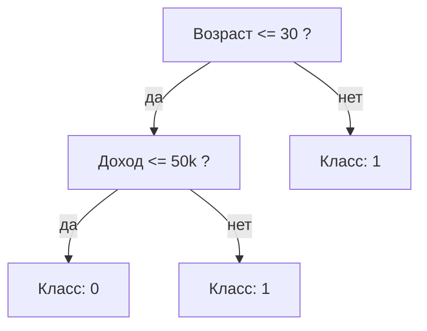
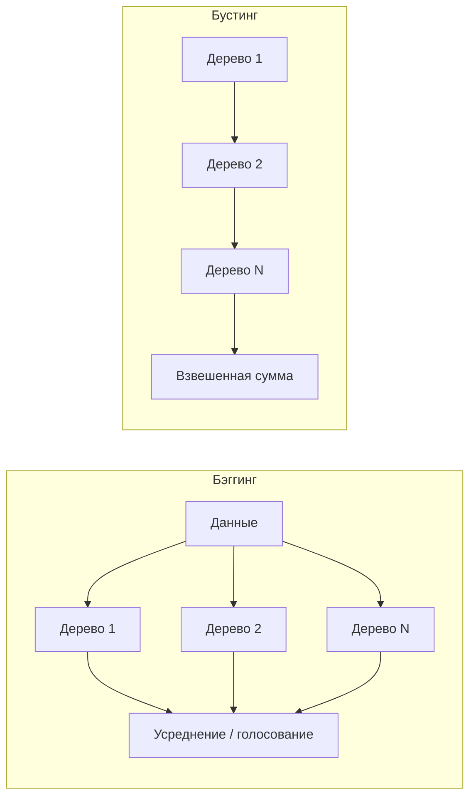

Деревья решений — это один из самых интуитивных классов моделей: они задают серию вопросов «да/нет» к признакам и в зависимости от ответов спускаются к предсказанию. Одно дерево легко понять и визуализировать, но оно склонно переобучаться. Зато из деревьев получаются лучшие на сегодня модели для табличных данных — **ансамбли**: случайный лес и градиентный бустинг. В этом разделе разберём, как дерево строится, почему оно нестабильно, и как объединение многих деревьев лечит эту нестабильность.

Перед этим разделом полезно понимать базовые идеи обучения с учителем из [/machine-learning/](/machine-learning/), а для критериев расщепления пригодятся понятия энтропии и распределений из [/probability/](/probability/).

## Дерево решений: рекурсивные разбиения

Дерево решений делит пространство признаков на прямоугольные области. В каждом внутреннем узле проверяется условие вида $x_j \le t$ (признак $j$ меньше порога $t$). Если условие выполнено — идём в левого потомка, иначе — в правого. В листе хранится предсказание: для классификации это обычно класс большинства (или вектор вероятностей), для регрессии — среднее значение целевой переменной по объектам, попавшим в лист.



Обучение идёт **жадно и рекурсивно**:

1. В текущем узле перебираем все признаки $j$ и все разумные пороги $t$.
2. Для каждой пары $(j, t)$ оцениваем, насколько хорошо разбиение разделяет данные (по выбранному критерию).
3. Выбираем лучшее разбиение, создаём двух потомков и повторяем процедуру для каждого из них.
4. Останавливаемся, когда узел «чистый» (все объекты одного класса), либо сработал критерий остановки (минимальное число объектов, максимальная глубина и т. п.).

Алгоритм не ищет глобально оптимальное дерево (это NP-трудная задача) — он на каждом шаге выбирает локально лучшее разбиение. Именно поэтому деревья называют жадными.

## Критерии расщепления

Критерий измеряет «неоднородность» (impurity) узла: мы хотим, чтобы после разбиения потомки были чище родителя. Пусть $p_k$ — доля объектов класса $k$ в узле.

### Индекс Джини

$$
\text{Gini} = \sum_{k} p_k (1 - p_k) = 1 - \sum_{k} p_k^2
$$

Интуиция: это вероятность ошибиться, если случайно пометить объект меткой, вытянутой из того же распределения классов узла. Для чистого узла ($p_k = 1$ для одного класса) Джини равен $0$; максимум — при равномерном распределении классов. Это критерий по умолчанию в `DecisionTreeClassifier` scikit-learn (CART).

### Энтропия и информационный выигрыш

$$
H = -\sum_{k} p_k \log_2 p_k
$$

Энтропия — мера неопределённости в битах. **Информационный выигрыш** (information gain) от разбиения — это снижение энтропии:

$$
IG = H(\text{родитель}) - \sum_{c \in \{L, R\}} \frac{n_c}{n}\, H(c)
$$

где $n_c$ — число объектов в потомке $c$, $n$ — в родителе. Алгоритм выбирает разбиение с максимальным $IG$ (или, эквивалентно, с минимальной взвешенной неоднородностью потомков).

:::note[Джини или энтропия?]
На практике разница между Джини и энтропией почти всегда несущественна — они дают похожие деревья. Джини чуть быстрее (нет логарифма). Энтропия исторически связана с алгоритмами ID3/C4.5, Джини — с CART.
:::

### Регрессионные деревья

Для регрессии неоднородность измеряют дисперсией внутри узла, а разбиение минимизирует суммарную взвешенную MSE потомков:

$$
\text{MSE}(c) = \frac{1}{n_c} \sum_{i \in c} (y_i - \bar{y}_c)^2, \qquad \bar{y}_c = \frac{1}{n_c}\sum_{i \in c} y_i
$$

В листе предсказывается среднее $\bar{y}_c$.

## Переобучение, обрезка и ограничения

Если позволить дереву расти, пока каждый лист не станет чистым, оно идеально запомнит обучающую выборку, включая шум — это классическое **переобучение** (см. [/machine-learning/](/machine-learning/) про bias-variance). Глубокое дерево имеет очень высокую дисперсию: меняем пару объектов — и структура дерева может радикально измениться.

Способы бороться:

| Параметр (scikit-learn) | Что ограничивает | Эффект |
|---|---|---|
| `max_depth` | максимальную глубину | проще дерево, меньше дисперсия |
| `min_samples_split` | минимум объектов для разбиения узла | не дробит мелкие узлы |
| `min_samples_leaf` | минимум объектов в листе | гладкие, статистически надёжные листья |
| `max_leaf_nodes` | число листьев | прямой контроль сложности |
| `ccp_alpha` | штраф за сложность (cost-complexity pruning) | пост-обрезка |

**Cost-complexity pruning** (обрезка по стоимости-сложности) минимизирует

$$
R_\alpha(T) = R(T) + \alpha\, |\tilde{T}|
$$

где $R(T)$ — ошибка дерева, $|\tilde{T}|$ — число листьев, $\alpha \ge 0$ — штраф за сложность. Сначала растят полное дерево, затем последовательно отрезают ветви, дающие наименьший прирост ошибки на единицу упрощения. Оптимальное $\alpha$ подбирают по кросс-валидации.

```python
from sklearn.tree import DecisionTreeClassifier

# Ограничиваем рост заранее (pre-pruning)
clf = DecisionTreeClassifier(
    criterion="gini",
    max_depth=4,
    min_samples_leaf=20,
    random_state=0,
)
clf.fit(X_train, y_train)
```

## Ансамбли: идея

Одно дерево — «слабый» и нестабильный предиктор. Объединение многих деревьев усредняет ошибки. Два принципиально разных подхода:

- **Бэггинг** (параллельный): обучаем много деревьев независимо на разных подвыборках и усредняем. Снижает **дисперсию**.
- **Бустинг** (последовательный): каждое следующее дерево исправляет ошибки предыдущих. Снижает **смещение** (а заодно и дисперсию).



## Бэггинг и случайный лес

**Бэггинг** (bootstrap aggregating): из обучающей выборки $N$ раз берём бутстрэп-выборку (выборку с возвращением того же размера), на каждой обучаем дерево, затем усредняем (регрессия) или голосуем (классификация).

Почему работает: если предсказания деревьев имеют дисперсию $\sigma^2$ и **попарную корреляцию** $\rho$, то дисперсия усреднения по $B$ моделям равна

$$
\rho \sigma^2 + \frac{1 - \rho}{B}\, \sigma^2
$$

Видно, что увеличение числа деревьев $B$ убирает второе слагаемое, но первое, $\rho\sigma^2$, остаётся. Значит, чтобы выиграть, деревья нужно **декоррелировать**.

**Случайный лес** (Random Forest) делает именно это: помимо бутстрэпа, в каждом узле разбиение ищется не по всем признакам, а по случайному подмножеству из $m$ признаков (часто $m = \sqrt{p}$ для классификации, $m = p/3$ для регрессии, где $p$ — общее число признаков). Это мешает деревьям всегда цепляться за один и тот же сильный признак — снижается $\rho$, а значит и итоговая дисперсия.

:::tip[OOB-оценка]
Для каждого дерева около 37% объектов не попадают в его бутстрэп-выборку (out-of-bag). На них можно бесплатно оценить качество, не выделяя отдельный валидационный набор: `RandomForestClassifier(oob_score=True)`.
:::

```python
from sklearn.ensemble import RandomForestClassifier

rf = RandomForestClassifier(
    n_estimators=500,
    max_features="sqrt",
    n_jobs=-1,
    oob_score=True,
    random_state=0,
)
rf.fit(X_train, y_train)
print("OOB score:", rf.oob_score_)
```

Случайный лес почти не переобучается с ростом числа деревьев (больше деревьев — стабильнее, не хуже), хорошо работает «из коробки» и легко параллелится.

## Бустинг

Бустинг строит деревья **последовательно**, и каждое новое исправляет ошибки уже построенного ансамбля.

### AdaBoost

AdaBoost (adaptive boosting) работает с весами объектов. Изначально все веса равны. После обучения очередного слабого классификатора:

- увеличивает веса неверно классифицированных объектов (следующее дерево обратит на них больше внимания);
- каждому дереву $m$ присваивается вес $\alpha_m$, зависящий от его ошибки $\text{err}_m$:

$$
\alpha_m = \frac{1}{2}\ln\frac{1 - \text{err}_m}{\text{err}_m}
$$

Итоговое предсказание — взвешенное голосование: $\hat{y} = \operatorname{sign}\!\big(\sum_m \alpha_m h_m(x)\big)$. Слабыми моделями обычно служат «пни» (деревья глубины 1).

### Градиентный бустинг

Градиентный бустинг (GBM) обобщает идею: ансамбль $F(x)$ строится аддитивно, а каждое дерево подгоняется под **антиградиент функции потерь** — то есть под направление, в котором нужно подвинуть текущие предсказания. Для квадратичной потери антиградиент — это просто остатки $y_i - F(x_i)$, поэтому интуиция такая: каждое новое дерево учится на ошибках предыдущих.

$$
F_m(x) = F_{m-1}(x) + \nu \cdot h_m(x), \qquad h_m \approx -\nabla_F L\big(y, F_{m-1}(x)\big)
$$

Здесь $\nu$ — **learning rate** (скорость обучения, обычно 0.01–0.1): малый шаг + много деревьев работает лучше, чем большой шаг. Это ключевой компромисс между числом деревьев `n_estimators` и `learning_rate`.

:::caution
В отличие от случайного леса, градиентный бустинг **переобучается** при слишком большом числе деревьев. Число итераций — это параметр регуляризации, его подбирают с ранней остановкой по валидации.
:::

## XGBoost и LightGBM

Это две самые популярные промышленные реализации градиентного бустинга. Обе побеждают во множестве соревнований на табличных данных.

**XGBoost** добавляет к классическому GBM:
- регуляризацию сложности дерева прямо в функцию потерь (штраф $\gamma$ за число листьев и $\lambda$ за величину весов листьев);
- использование вторых производных (метод Ньютона) при поиске разбиений;
- встроенную обработку пропусков и параллелизм по признакам.

Регуляризованная цель на шаге $t$:

$$
\mathcal{L}^{(t)} = \sum_i l\big(y_i, \hat{y}_i^{(t-1)} + f_t(x_i)\big) + \gamma T + \frac{1}{2}\lambda \sum_{j=1}^{T} w_j^2
$$

где $T$ — число листьев, $w_j$ — веса листьев.

**LightGBM** оптимизирован на скорость и большие данные:
- **гистограммный** поиск разбиений (признаки бинятся в ~255 корзин — меньше переборов порогов);
- рост дерева **leaf-wise** (растит лист с максимальным выигрышем), а не level-wise — точнее, но требует ограничения `num_leaves`/`max_depth` от переобучения;
- техники GOSS и EFB для ускорения на разреженных и больших данных.

| Критерий | XGBoost | LightGBM |
|---|---|---|
| Рост дерева | level-wise (по уровням) | leaf-wise (по лучшему листу) |
| Поиск разбиений | exact / гистограммный | гистограммный |
| Скорость на больших данных | средняя | очень высокая |
| Память | больше | меньше |
| Чувствительность к переобучению | ниже | выше (нужен контроль `num_leaves`) |

```python
import lightgbm as lgb

model = lgb.LGBMClassifier(
    n_estimators=2000,
    learning_rate=0.03,
    num_leaves=31,
    subsample=0.8,
    subsample_freq=1,        # без этого subsample (bagging) не применяется
    colsample_bytree=0.8,
    random_state=0,
)
model.fit(
    X_train, y_train,
    eval_set=[(X_val, y_val)],
    callbacks=[lgb.early_stopping(50)],   # ранняя остановка
)
```

:::tip
Для бустинга деревья **не нужно** масштабировать или нормировать признаки — разбиения инвариантны к монотонным преобразованиям. Категориальные признаки LightGBM умеет обрабатывать нативно (параметр `categorical_feature`), без one-hot.
:::

Помимо XGBoost и LightGBM стоит знать **CatBoost** — он особенно хорош с категориальными признаками и устойчив к настройкам по умолчанию.

## Важность признаков

Деревья дают «бесплатную» оценку важности признаков, но интерпретировать её надо аккуратно.

- **Mean Decrease in Impurity (MDI), Gini importance.** Сумма уменьшений неоднородности по всем разбиениям, где использовался признак, усреднённая по деревьям. Считается мгновенно (`model.feature_importances_`), но **смещена в сторону признаков с большим числом уникальных значений** (категориальные с многими категориями, непрерывные) и завышает важность коррелированных признаков.
- **Permutation importance.** Случайно перемешиваем значения одного признака на валидации и смотрим, насколько просела метрика. Честнее, считается на любой модели, но дороже и тоже страдает при сильной корреляции признаков.
- **SHAP-значения.** Раскладывают конкретное предсказание по вкладам признаков на основе теории игр. Дают и глобальную, и локальную интерпретацию; для деревьев есть быстрый алгоритм TreeSHAP.

```python
from sklearn.inspection import permutation_importance

result = permutation_importance(
    rf, X_val, y_val, n_repeats=20, random_state=0, n_jobs=-1
)
for i in result.importances_mean.argsort()[::-1][:10]:
    print(f"{feature_names[i]:20s} {result.importances_mean[i]:.4f}")
```

:::caution
Не делайте выводов о причинно-следственных связях по важности признаков. Высокая важность означает лишь «модель активно использует этот признак для предсказания», а не «этот признак влияет на целевую переменную в реальности».
:::

## Когда деревья лучше линейных моделей

Деревья и ансамбли деревьев выигрывают у линейных моделей (см. [/machine-learning/](/machine-learning/)), когда:

- **Нелинейные зависимости и взаимодействия признаков.** Деревья ловят взаимодействия автоматически, без ручного создания произведений признаков.
- **Смешанные типы данных и табличные признаки разного масштаба.** Не нужны масштабирование, нормировка, обработка выбросов в признаках.
- **Монотонные, но не линейные эффекты.** Линейной модели нужны преобразования; дереву — нет.
- **Признаки с естественными порогами** («возраст > 18», «доход > порога»).

Линейные модели предпочтительнее, когда:

- данных мало, а признаков много (деревья переобучаются, линейная модель с регуляризацией устойчивее);
- зависимость действительно близка к линейной;
- нужна **экстраполяция** за пределы обучающих данных (дерево не умеет — оно выдаёт константу из ближайшего листа);
- важна простая интерпретируемость в виде коэффициентов и нужна гладкая, дифференцируемая функция.

Для неструктурированных данных (изображения, текст, звук) деревья почти всегда уступают нейросетям, но на **табличных данных** градиентный бустинг до сих пор остаётся сильнейшим базовым решением.

## Задания

### Упражнение 1. Индекс Джини и информационный выигрыш

В узле 10 объектов: 6 класса A и 4 класса B. Разбиение делит их на две группы: левая — 4×A и 1×B, правая — 2×A и 3×B. Вычислите индекс Джини родителя и взвешенный Джини после разбиения. Стало ли лучше?

<details>
<summary>Решение</summary>

Родитель: $p_A = 0.6,\ p_B = 0.4$.

$$
\text{Gini}_{\text{род}} = 1 - (0.6^2 + 0.4^2) = 1 - (0.36 + 0.16) = 0.48
$$

Левый узел (5 объектов: 4A, 1B), $p_A = 0.8,\ p_B = 0.2$:

$$
\text{Gini}_L = 1 - (0.64 + 0.04) = 0.32
$$

Правый узел (5 объектов: 2A, 3B), $p_A = 0.4,\ p_B = 0.6$:

$$
\text{Gini}_R = 1 - (0.16 + 0.36) = 0.48
$$

Взвешенный Джини потомков (по 5 из 10 объектов в каждом):

$$
\frac{5}{10}\cdot 0.32 + \frac{5}{10}\cdot 0.48 = 0.16 + 0.24 = 0.40
$$

Неоднородность снизилась с $0.48$ до $0.40$ — разбиение полезно (выигрыш по Джини $= 0.08$).

</details>

### Упражнение 2. Декорреляция в случайном лесу

Дисперсия усреднения $B$ деревьев равна $\rho\sigma^2 + \frac{1-\rho}{B}\sigma^2$. Пусть $\sigma^2 = 1$. Сравните предельную (при $B \to \infty$) дисперсию для $\rho = 0.9$ и $\rho = 0.3$. Почему случайный отбор признаков важнее простого увеличения числа деревьев?

<details>
<summary>Решение</summary>

При $B \to \infty$ второе слагаемое обнуляется, остаётся $\rho\sigma^2 = \rho$.

- $\rho = 0.9 \Rightarrow$ предельная дисперсия $= 0.9$.
- $\rho = 0.3 \Rightarrow$ предельная дисперсия $= 0.3$.

Сколько деревьев ни добавляй, ниже $\rho\sigma^2$ опуститься нельзя. Поэтому одно лишь увеличение $B$ упирается в «потолок» $\rho$. Случайный отбор признаков в узлах снижает сам $\rho$ (деревья перестают быть копиями друг друга), сдвигая этот потолок вниз — это и даёт основной выигрыш случайного леса над обычным бэггингом.

</details>

### Упражнение 3. learning_rate против n_estimators

В градиентном бустинге вы получили хорошее качество при `learning_rate=0.1, n_estimators=300`. Коллега уменьшил `learning_rate` до `0.01`. Что нужно сделать с числом деревьев и почему? Как защититься от перебора?

<details>
<summary>Решение</summary>

При уменьшении шага в 10 раз каждое дерево вносит меньший вклад, поэтому для достижения той же суммарной «подгонки» нужно примерно во столько же раз **больше** деревьев — порядка `n_estimators ≈ 3000`. Точное соотношение нелинейно, но направление именно такое.

Малый `learning_rate` обычно даёт лучшее обобщение (более плавная оптимизация), но дольше обучается. Чтобы не подбирать число деревьев вручную и не переобучиться, используют **раннюю остановку**: задают большой `n_estimators`, отслеживают метрику на валидации (`eval_set`) и останавливают обучение, когда она перестаёт улучшаться в течение заданного числа итераций (`early_stopping_rounds` / `early_stopping(50)`).

</details>

### Упражнение 4. Почему дерево не экстраполирует

Регрессионное дерево обучили на данных, где $x \in [0, 10]$ и $y = 2x$. Что оно предскажет для $x = 100$? Сравните с линейной регрессией.

<details>
<summary>Решение</summary>

Дерево разбивает пространство признаков на конечное число областей и в каждом листе выдаёт **константу** — среднее $y$ обучающих объектов этого листа. Объект $x = 100$ попадёт в крайний правый лист, соответствующий наибольшим виденным значениям $x$ (около $x \approx 10$). Предсказание будет примерно равно среднему $y$ в этом листе — порядка $y \approx 20$ (а не $200$).

Дерево физически **не может выдать значение выше, чем максимум, виденный на обучении** — оно не экстраполирует. Линейная регрессия выучит $\hat{y} = 2x$ и корректно предскажет $\hat{y} = 200$. Это фундаментальное ограничение деревьев: при необходимости экстраполяции за пределы обучающего диапазона линейные модели предпочтительнее.

</details>
