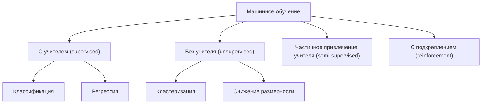
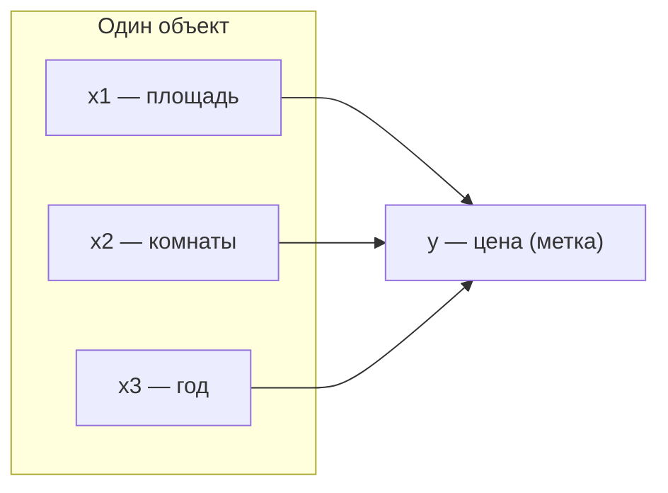
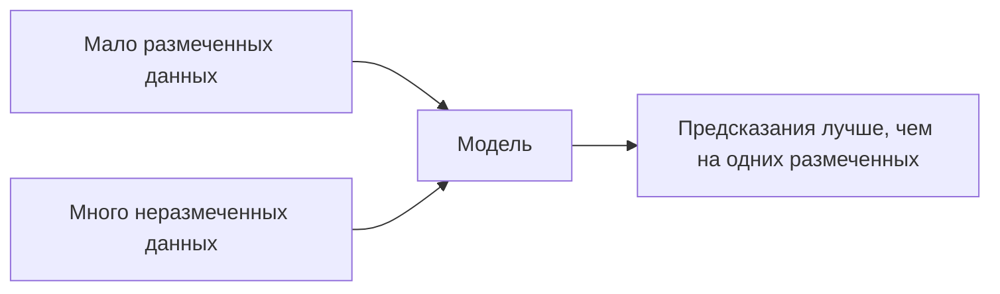
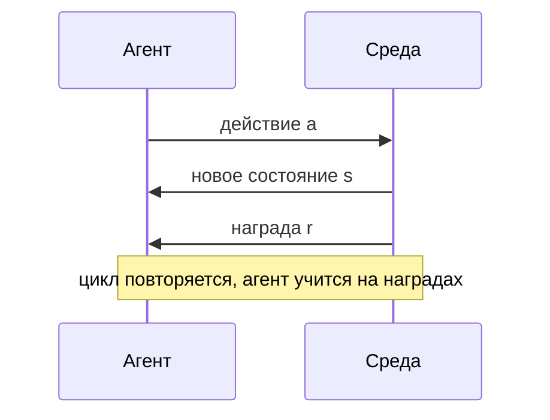

Машинное обучение — это набор методов, которые позволяют программе улучшать качество решения задачи по мере накопления данных, без того чтобы человек явно прописывал правила. Вместо инструкции «если входящее письмо содержит слово *выигрыш*, помечай как спам» мы показываем алгоритму тысячи писем с метками «спам / не спам» и позволяем ему самому найти закономерности.

Виды машинного обучения отличаются прежде всего тем, **какие данные доступны** и **какой сигнал обратной связи** получает алгоритм. Это и есть главная ось классификации: есть ли у нас правильные ответы, насколько их много и приходят ли они сразу или с задержкой.



Прежде чем разбирать каждый вид, договоримся о базовом словаре — он один и тот же для всех парадигм.

## Признаки, метки и целевая переменная

Любой объект, который мы подаём алгоритму, описывается набором чисел или категорий — это **признаки** (features). Дом описывается площадью, числом комнат, годом постройки; письмо — частотами слов; пациент — давлением, возрастом, результатами анализов.

Формально один объект — это вектор признаков:

$$\mathbf{x} = (x_1, x_2, \dots, x_d),$$

где $d$ — размерность, то есть число признаков. Весь датасет из $n$ объектов удобно представлять матрицей $X$ размера $n \times d$: строки — объекты, столбцы — признаки.

**Метка** (label), она же **целевая переменная** (target), $y$ — это тот ответ, который мы хотим предсказывать. Цена дома, факт «спам / не спам», диагноз. Не у всех задач есть метки: именно их наличие и тип отделяют один вид обучения от другого.



:::note[Признак или метка — зависит от задачи]
Возраст пациента может быть признаком (когда предсказываем риск болезни) или целевой переменной (когда по снимку оцениваем биологический возраст). Роль переменной определяется постановкой задачи, а не самой переменной.
:::

Чтобы говорить о признаках на одном языке с линейной алгеброй и матрицами объект-признак, пригодится [линейная алгебра](/linear-algebra/), а для понимания шкал и распределений признаков — [статистика](/statistics/).

## Обучение с учителем (supervised learning)

Здесь у нас есть **размеченные данные**: пары $(\mathbf{x}_i, y_i)$, то есть для каждого объекта известен правильный ответ. Алгоритм ищет функцию $f$, которая по признакам предсказывает метку:

$$\hat{y} = f(\mathbf{x}).$$

«Учитель» — это и есть набор правильных ответов $y_i$, по которым модель сверяется во время обучения. Качество измеряют функцией потерь (loss), штрафующей за расхождение $\hat{y}$ и истинного $y$. Обучение — это минимизация средней ошибки по всем объектам, что почти всегда сводится к задаче оптимизации (см. [математический анализ](/calculus/) про градиенты и минимумы).

Обучение с учителем делится на два больших класса по типу целевой переменной.

### Классификация

Целевая переменная **категориальная** — конечный набор классов. Модель отвечает на вопрос «к какой категории относится объект».

- Спам / не спам в почте.
- Распознавание рукописной цифры (10 классов: 0–9).
- Диагноз по снимку: «есть патология / нет».
- Определение языка текста.

Когда классов два, говорят о **бинарной** классификации, когда больше — о **многоклассовой**. Часто модель выдаёт не жёсткую метку, а вероятности классов, например через логистическую функцию:

$$P(y=1 \mid \mathbf{x}) = \frac{1}{1 + e^{-(\mathbf{w}^\top \mathbf{x} + b)}}.$$

Качество оценивают долей верных ответов (accuracy), точностью и полнотой (precision/recall) и другими метриками — подробнее об их вероятностной природе см. [теория вероятностей](/probability/).

### Регрессия

Целевая переменная **числовая и непрерывная**. Модель предсказывает количество.

- Цена квартиры по её характеристикам.
- Завтрашняя температура.
- Ожидаемая выручка магазина на следующий месяц.
- Время доставки заказа.

Типичная функция потерь — среднеквадратичная ошибка (MSE):

$$\text{MSE} = \frac{1}{n} \sum_{i=1}^{n} \left( y_i - \hat{y}_i \right)^2.$$

Простейшая модель — линейная регрессия $\hat{y} = \mathbf{w}^\top \mathbf{x} + b$; на её примере удобно впервые увидеть, как обучение сводится к подбору весов $\mathbf{w}$.

```python
from sklearn.linear_model import LinearRegression, LogisticRegression

# Регрессия: предсказываем число (цену)
reg = LinearRegression().fit(X_train, y_price)
price = reg.predict(X_new)

# Классификация: предсказываем класс (спам/не спам)
clf = LogisticRegression().fit(X_train, y_is_spam)
label = clf.predict(X_new)          # 0 или 1
proba = clf.predict_proba(X_new)    # вероятности классов
```

:::tip[Как отличить классификацию от регрессии]
Спросите себя: имеет ли смысл «промежуточное» значение ответа? Между «спам» и «не спам» ничего нет — это классификация. Между ценой 100 и 200 есть 150 — это регрессия.
:::

## Обучение без учителя (unsupervised learning)

Меток нет: есть только признаки $\mathbf{x}_i$, но никаких «правильных ответов». Задача — найти структуру в самих данных. Здесь нет внешнего учителя, который скажет, правильно ли мы разбили данные, поэтому и оценка качества сложнее и часто субъективнее.

### Кластеризация

Алгоритм группирует объекты так, чтобы похожие попадали в одну группу (кластер), а непохожие — в разные. Сходство обычно измеряют расстоянием между векторами признаков, например евклидовым:

$$d(\mathbf{x}, \mathbf{x}') = \sqrt{\sum_{j=1}^{d} (x_j - x'_j)^2}.$$

Примеры задач:

- Сегментация клиентов по поведению для маркетинга.
- Группировка новостей по сюжетам.
- Выделение сообществ в социальной сети.
- Обнаружение аномалий (объект, не попавший ни в один плотный кластер).

Классический метод — k-средних (k-means): минимизируем суммарный квадрат расстояний от объектов до центров своих кластеров.

```python
from sklearn.cluster import KMeans

# Меток нет — передаём только признаки X
model = KMeans(n_clusters=3, random_state=0).fit(X)
clusters = model.labels_   # номер кластера для каждого объекта
```

### Снижение размерности

Когда признаков очень много (сотни, тысячи), данные тяжело хранить, визуализировать и обучать на них модели. Снижение размерности сжимает $\mathbf{x} \in \mathbb{R}^{d}$ до $\mathbf{z} \in \mathbb{R}^{k}$ при $k \ll d$, стараясь сохранить как можно больше полезной информации.

- Сжатие изображений и сигналов.
- Визуализация данных на плоскости (метод главных компонент PCA, t-SNE, UMAP).
- Удаление коррелированных и шумных признаков перед обучением.

Метод главных компонент (PCA) ищет направления максимальной дисперсии данных — это напрямую линейно-алгебраическая операция (собственные векторы ковариационной матрицы), см. [линейную алгебру](/linear-algebra/).

:::note[Зачем нужно обучение без учителя]
Размеченные данные дороги: чтобы получить метки, часто нужен ручной труд экспертов. Неразмеченных данных, наоборот, обычно много. Поэтому unsupervised-методы — это способ извлечь пользу из «сырых» данных, которых у нас в избытке.
:::

## Обучение с частичным привлечением учителя (semi-supervised)

Промежуточный случай: небольшая часть данных размечена, а большая — нет. Это очень частая ситуация на практике, потому что разметка дорогая, а сырых данных много.

Идея: использовать структуру неразмеченных данных, чтобы улучшить модель, обученную на скромном размеченном наборе. Например, кластеризовать все объекты, а затем перенести известные метки на весь кластер; или обучить модель на размеченных данных, разметить ею уверенные предсказания на остальных (self-training) и дообучиться.

- Медицинские снимки: размечено врачами 500 штук, ещё 50 000 без диагноза.
- Классификация веб-страниц: вручную размечена тысяча, доступны миллионы.
- Распознавание речи, где транскрипция дорогая.



:::tip
Полезный мысленный ориентир: semi-supervised работает тогда, когда неразмеченные данные действительно несут информацию о структуре классов (объекты одного класса лежат рядом). Если это не так, неразмеченные данные не помогут, а могут и навредить.
:::

## Обучение с подкреплением (reinforcement learning)

Здесь нет фиксированного датасета с ответами. Есть **агент**, который действует в **среде**, и за свои действия получает **награду** (reward) — числовой сигнал, часто с задержкой. Цель агента — научиться стратегии (политике), которая максимизирует суммарную награду в долгой перспективе.

Ключевое отличие от обучения с учителем: учитель не говорит «правильное действие здесь — такое-то». Он лишь сообщает, насколько хорошо в итоге всё сложилось. Агент сам должен путём проб понять, какие действия ведут к награде.



Взаимодействие описывают цепочкой «состояние $s_t$ → действие $a_t$ → награда $r_t$ → новое состояние $s_{t+1}$». Агент максимизирует ожидаемую дисконтированную сумму наград:

$$G_t = \sum_{k=0}^{\infty} \gamma^{k} \, r_{t+k+1}, \qquad 0 \le \gamma \le 1,$$

где коэффициент дисконтирования $\gamma$ задаёт, насколько мы ценим будущие награды по сравнению с немедленными.

Примеры задач:

- Игры: шахматы, го, видеоигры (AlphaGo, агенты Atari).
- Управление роботом, который учится ходить.
- Оптимизация стратегии торговли или управление ресурсами дата-центра.
- Рекомендации, где важна долгосрочная вовлечённость, а не один клик.

:::caution[Главная трудность RL]
Награда приходит с задержкой и относится к целой цепочке действий. Понять, какое именно действие в прошлом привело к успеху, — это проблема «назначения заслуг» (credit assignment). Из-за неё RL обычно требует на порядки больше данных и вычислений, чем обучение с учителем.
:::

## Таблица сравнения

| Критерий | С учителем | Без учителя | Частичное привлечение | С подкреплением |
|---|---|---|---|---|
| Данные | пары $(\mathbf{x}, y)$ | только $\mathbf{x}$ | мало $(\mathbf{x}, y)$ + много $\mathbf{x}$ | взаимодействие со средой |
| Обратная связь | правильный ответ на каждый объект | нет | ответ на часть объектов | отложенная награда |
| Главная цель | предсказать метку | найти структуру | улучшить предсказание дешёвой разметкой | максимизировать суммарную награду |
| Типичные задачи | классификация, регрессия | кластеризация, снижение размерности | классификация при дефиците меток | управление, игры, стратегии |
| Метрики | accuracy, MSE, precision/recall | силуэт, доля сохранённой дисперсии | как у supervised | средняя награда за эпизод |
| Примеры методов | линейная/логистическая регрессия, деревья, нейросети | k-means, PCA, t-SNE | self-training, label propagation | Q-learning, policy gradient |

Большинство «классических» задач, с которых начинают вход в ML, — это обучение с учителем. Двигаться дальше удобно через раздел [машинное обучение](/machine-learning/), а необходимый фундамент собирать в [линейной алгебре](/linear-algebra/), [математическом анализе](/calculus/), [теории вероятностей](/probability/) и [статистике](/statistics/). Практическую работу с данными разбирает раздел [Python для данных](/python-data/).

## Задания

### Задание 1. Классификация или регрессия?

Для каждой задачи определите тип целевой переменной и отнесите её к классификации или регрессии:

1. Предсказать, вернёт ли клиент банку кредит.
2. Предсказать, сколько дней проработает деталь до поломки.
3. Определить породу собаки по фотографии.
4. Оценить, на сколько процентов вырастет трафик сайта за месяц.

<details>
<summary>Решение</summary>

1. Целевая переменная категориальная («вернёт / не вернёт») → **бинарная классификация**.
2. Число дней — непрерывная величина → **регрессия**.
3. Порода — одна из конечного набора категорий → **многоклассовая классификация**.
4. Процент роста — непрерывное число → **регрессия**.

Ориентир: если между двумя возможными ответами есть осмысленное промежуточное значение — это регрессия; если ответы дискретны и «промежутка» нет — классификация.

</details>

### Задание 2. Какой вид обучения выбрать?

У интернет-магазина есть история покупок миллионов клиентов, но никаких заранее заданных групп. Менеджер хочет разбить клиентов на однородные сегменты, чтобы по-разному настраивать рассылки. Какой вид машинного обучения подходит и почему? Что было бы, если бы у нас уже были заранее размеченные сегменты?

<details>
<summary>Решение</summary>

Заданных меток (готовых сегментов) нет — есть только признаки клиентов (частота покупок, средний чек, категории товаров). Значит, это **обучение без учителя**, а конкретно — **кластеризация** (например, k-means). Алгоритм сам найдёт группы похожих клиентов.

Если бы сегменты были заранее размечены людьми и мы хотели бы автоматически относить новых клиентов к этим известным сегментам, задача превратилась бы в **классификацию** (обучение с учителем): мы бы обучали модель на парах «признаки клиента → его сегмент».

</details>

### Задание 3. Минимизация ошибки в регрессии

Модель регрессии дала на четырёх объектах предсказания $\hat{y} = (3,\ 5,\ 2,\ 8)$, истинные значения $y = (2,\ 5,\ 4,\ 7)$. Посчитайте MSE по формуле

$$\text{MSE} = \frac{1}{n} \sum_{i=1}^{n} (y_i - \hat{y}_i)^2.$$

Что произойдёт с этим значением, если модель улучшится и для всех объектов $\hat{y}_i = y_i$?

<details>
<summary>Решение</summary>

Считаем покомпонентные ошибки и их квадраты:

- $(2-3)^2 = 1$
- $(5-5)^2 = 0$
- $(4-2)^2 = 4$
- $(7-8)^2 = 1$

Сумма квадратов: $1 + 0 + 4 + 1 = 6$. Делим на $n=4$:

$$\text{MSE} = \frac{6}{4} = 1.5.$$

Если модель предсказывает идеально, то $y_i - \hat{y}_i = 0$ для всех $i$, и тогда $\text{MSE} = 0$. Это нижняя граница: MSE неотрицательна (сумма квадратов), и ноль достигается только при точном совпадении предсказаний с истиной.

```python
import numpy as np

y      = np.array([2, 5, 4, 7])
y_hat  = np.array([3, 5, 2, 8])
mse = np.mean((y - y_hat) ** 2)
print(mse)  # 1.5
```

</details>

### Задание 4. Почему обучение с подкреплением — это не обучение с учителем

В чём принципиальная разница между сигналом обратной связи в обучении с учителем и наградой в обучении с подкреплением? Приведите пример, где «правильного ответа» в каждый момент просто не существует.

<details>
<summary>Решение</summary>

В обучении с учителем для **каждого** объекта известен правильный ответ $y_i$, и модель напрямую сравнивает с ним своё предсказание. Обратная связь точная, мгновенная и относится к одному объекту.

В обучении с подкреплением агент получает лишь **награду** — числовую оценку того, насколько хорошо складывается ситуация. Награда:

- не говорит, какое действие было правильным;
- часто приходит с **задержкой** и относится к целой цепочке действий (проблема назначения заслуг);
- зависит от собственных действий агента, который сам формирует свои данные, исследуя среду.

Пример: игра в шахматы. В середине партии не существует единственного «правильного» хода с известной меткой — есть лишь итоговый результат (выигрыш/проигрыш) в конце. Понять, какой именно ход из десятков сделанных привёл к победе, и есть суть задачи RL.

</details>
