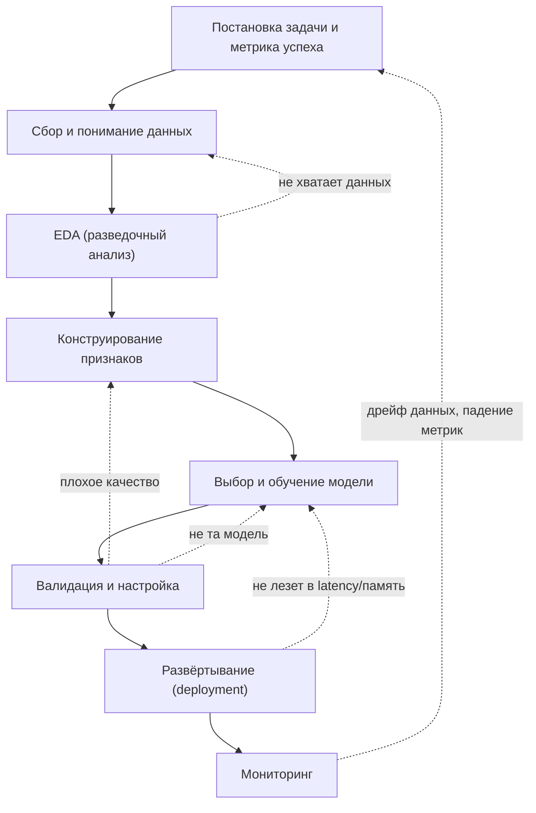
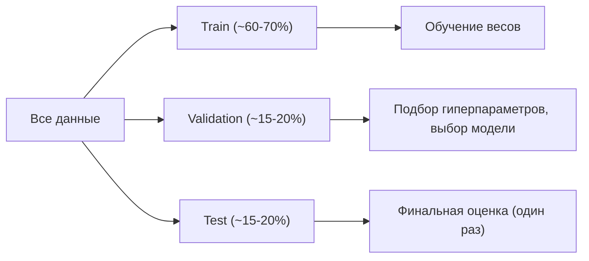
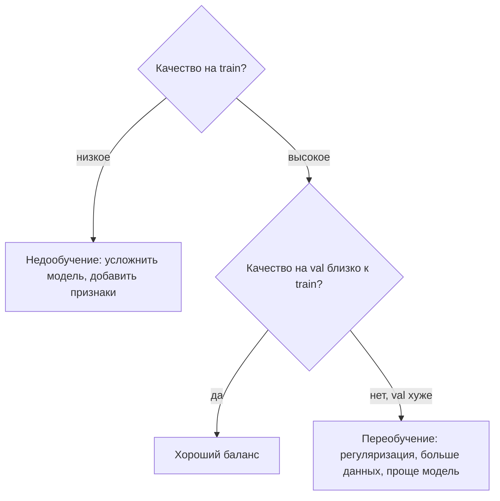

Машинное обучение — это не «обучить модель», а цикл инженерных решений, в котором обучение модели занимает лишь малую часть времени. Большую часть усилий съедают понимание задачи, данные и проверка того, что модель действительно решает бизнес-проблему, а не подгоняется под удобные числа. В этом разделе разберём жизненный цикл ML-проекта от формулировки задачи до мониторинга в продакшене, и почему этот процесс по своей природе итеративный.

Хорошая ментальная модель: ML-проект похож на научный эксперимент, обёрнутый в инженерный pipeline. Вы выдвигаете гипотезу («такие-то признаки предскажут отток»), ставите измеримый критерий успеха, собираете данные, проверяете гипотезу на отложенной выборке и повторяете. Пропуск любого шага обычно всплывает позже и стоит дороже.

## Общая карта жизненного цикла



Пунктирные стрелки — это и есть суть процесса: вы почти никогда не проходите цикл один раз сверху вниз. Каждый этап может отправить вас назад.

## Постановка задачи и выбор метрики успеха

Первый и самый недооценённый шаг — превратить расплывчатое «хотим использовать ML» в конкретную, измеримую задачу.

Нужно ответить на три вопроса:

1. **Какой тип задачи?** Классификация, регрессия, ранжирование, кластеризация, генерация. От этого зависит всё остальное.
2. **Что считаем успехом для бизнеса?** Например, «снизить отток на 5%» или «сократить ручную модерацию на 30%».
3. **Какой технической метрикой это измеряется?** Бизнес-цель нужно отобразить в метрику модели.

:::caution[Разделяйте бизнес-метрику и метрику модели]
Бизнес-метрика (выручка, отток, время обработки) — то, ради чего проект существует. Метрика модели (accuracy, ROC-AUC, RMSE) — то, что вы оптимизируете во время обучения. Они связаны, но не тождественны. Модель с высокой accuracy может быть бесполезной для бизнеса — например, на несбалансированных данных.
:::

Классический пример ловушки — **accuracy на несбалансированных классах**. Пусть мошеннических транзакций 1%. Модель, которая всегда отвечает «не мошенник», даёт точность

$$
\text{accuracy} = \frac{TP + TN}{TP + TN + FP + FN} = \frac{0 + 99}{100} = 99\%,
$$

но не ловит ни одного мошенника. Здесь нужны precision, recall, F1 или PR-AUC. Подробно метрики разобраны в разделе [Оценка качества моделей](/machine-learning/evaluation/).

Также на этом этапе полезно сразу определить **baseline** — простейшее решение, которое модель обязана превзойти. Это может быть константный прогноз (среднее/самый частый класс) или простое правило. Если сложная модель не бьёт тривиальный baseline, что-то не так.

## Сбор и понимание данных

Данные — топливо ML. На этом шаге вы отвечаете на вопросы: какие источники доступны, как они связаны, насколько они полны и достоверны, есть ли утечки (leakage).

Ключевые подзадачи:

- **Источники и сбор**: базы, логи, API, разметка. Зафиксируйте, как и когда собраны данные.
- **Целевая переменная (target)**: убедитесь, что она доступна и корректна. Часто разметка шумная или определена неоднозначно.
- **Утечка данных (data leakage)**: признак не должен «знать будущее». Классический пример — использовать признак, который в реальности появляется только после момента предсказания.

:::danger[Утечка — самая частая причина «слишком хороших» результатов]
Если на валидации метрика подозрительно высокая, первое подозрение — leakage. Например, при предсказании оттока в признаки случайно попало поле «дата деактивации аккаунта». Модель идеально предсказывает отток, но в продакшене этого признака на момент прогноза ещё не существует.
:::

Понимание данных также включает фиксацию **единицы наблюдения** (что такое одна строка: клиент? транзакция? клиент-месяц?) — от этого зависит и разбиение, и интерпретация.

## Разведочный анализ данных (EDA)

EDA (Exploratory Data Analysis) — этап, на котором вы «знакомитесь» с данными до всякого моделирования. Цель — сформировать интуицию, обнаружить проблемы и гипотезы о полезных признаках.

Что обычно смотрят:

- Распределения признаков (гистограммы, описательные статистики: среднее, медиана, дисперсия).
- Пропуски (`NaN`): сколько, где, случайны ли они.
- Выбросы и аномалии.
- Корреляции между признаками и с таргетом.
- Баланс классов (для классификации).

Практический минимум на pandas:

```python
import pandas as pd

df = pd.read_csv("data.csv")

print(df.shape)                 # размер
print(df.dtypes)                # типы колонок
print(df.describe())            # числовые статистики
print(df.isna().mean().sort_values(ascending=False))  # доля пропусков
print(df["target"].value_counts(normalize=True))      # баланс классов

# Корреляция числовых признаков с таргетом
print(df.corr(numeric_only=True)["target"].sort_values())
```

Инструменты и приёмы анализа данных подробно разбираются в разделе [Python для данных](/python-data/). EDA — это во многом про визуализацию и описательную [статистику](/statistics/).

:::tip
EDA и конструирование признаков делайте **только на обучающей части** данных. Если вы изучаете распределения и строите признаки на всём датасете, информация из теста «протекает» в ваши решения — это тонкая форма leakage.
:::

## Конструирование признаков (feature engineering)

Признаки (features) — это то, что модель реально «видит». Часто грамотные признаки дают больший прирост качества, чем замена модели на более сложную.

Типичные операции:

- **Кодирование категорий**: one-hot, target encoding, частотное кодирование.
- **Масштабирование числовых признаков**: стандартизация $z = \dfrac{x - \mu}{\sigma}$ или нормализация в $[0, 1]$. Важно для моделей, чувствительных к масштабу (линейные модели, KNN, нейросети).
- **Обработка пропусков**: заполнение медианой/средним, отдельная категория, индикатор пропуска.
- **Создание новых признаков**: отношения, разности, агрегаты по группам, признаки из дат (день недели, час), текстовые/частотные признаки.
- **Отбор признаков**: убрать неинформативные и сильно коррелированные.

:::caution[Параметры предобработки учим только на train]
$\mu$ и $\sigma$ для стандартизации, медианы для заполнения пропусков, словари кодирования категорий — всё это вычисляется **на обучающей выборке** и затем применяется к валидации и тесту. В scikit-learn это решается через `fit` на train и `transform` на остальных частях, удобно обёрнутое в `Pipeline`.
:::

```python
from sklearn.pipeline import Pipeline
from sklearn.preprocessing import StandardScaler
from sklearn.linear_model import LogisticRegression

pipe = Pipeline([
    ("scaler", StandardScaler()),
    ("model", LogisticRegression(max_iter=1000)),
])

pipe.fit(X_train, y_train)     # scaler учит mu/sigma ТОЛЬКО на train
preds = pipe.predict(X_test)   # на test применяются те же mu/sigma
```

## Разбиение на train / validation / test

Это центральная идея, отвечающая на вопрос «как понять, что модель будет работать на новых данных». Мы делим данные на три непересекающиеся части:

| Часть | Назначение | Когда используется |
|---|---|---|
| **Train** (обучающая) | Подгонка параметров модели (веса) | На каждой итерации обучения |
| **Validation** (валидационная) | Подбор гиперпараметров, выбор модели, ранняя остановка | Многократно во время разработки |
| **Test** (тестовая) | Финальная честная оценка качества | Один раз, в самом конце |

Зачем три части, а не две? Если подбирать гиперпараметры по тесту, вы начинаете неявно «подгонять» решения под тест, и его оценка перестаёт быть честной. Валидация принимает на себя многократные «подглядывания», а тест остаётся нетронутым до самого конца.



Принципы корректного разбиения:

- **Стратификация**: при дисбалансе классов сохраняйте их пропорции в каждой части (`stratify=y`).
- **Временной порядок**: для временных рядов нельзя разбивать случайно — тест должен идти строго **после** train по времени, иначе модель «подглядывает в будущее».
- **Группы**: если у одного объекта несколько строк (например, несколько визитов одного клиента), он должен целиком попасть в одну часть, иначе утечка.

```python
from sklearn.model_selection import train_test_split

# Сначала отделяем тест, затем из оставшегося — валидацию
X_trainval, X_test, y_trainval, y_test = train_test_split(
    X, y, test_size=0.2, stratify=y, random_state=42
)
X_train, X_val, y_train, y_val = train_test_split(
    X_trainval, y_trainval, test_size=0.25, stratify=y_trainval, random_state=42
)
# Итог: train 60%, val 20%, test 20%
```

Когда данных мало, вместо фиксированной валидации используют **кросс-валидацию** (k-fold): данные делят на $k$ частей, по очереди каждую делают валидационной, а на остальных обучают, и усредняют метрику. Это даёт более устойчивую оценку. Кросс-валидация подробно разобрана в разделе [Оценка качества моделей](/machine-learning/evaluation/).

## Выбор и обучение модели

Здесь действует прагматичный принцип: **начинайте с простого**. Простая модель — это baseline, она быстро обучается, легко отлаживается и часто оказывается достаточно хорошей.

Ориентировочный порядок усложнения:

1. Baseline: константа / простое правило / логистическая или линейная регрессия.
2. Деревья и ансамбли: случайный лес, градиентный бустинг (XGBoost, LightGBM, CatBoost) — часто лучший выбор для табличных данных.
3. Нейросети — когда данных много и они неструктурированы (текст, изображения, аудио).

Выбор зависит от типа данных, объёма, требований к интерпретируемости и ограничений по скорости/памяти в продакшене. На этом этапе обучение происходит на train, а сравнение кандидатов — на validation.

## Валидация и настройка гиперпараметров

Гиперпараметры — это настройки, которые не выучиваются из данных, а задаются заранее (глубина дерева, скорость обучения, сила регуляризации). Их подбирают по валидационной метрике.

Способы подбора:

- **Grid search** — перебор по сетке значений.
- **Random search** — случайная выборка из пространства; часто эффективнее grid при многих параметрах.
- **Байесовская оптимизация** (Optuna, Hyperopt) — умный поиск, учитывающий прошлые результаты.

Главная диагностика на этом этапе — соотношение качества на train и validation:

$$
\text{generalization gap} = \text{ошибка}_{\text{val}} - \text{ошибка}_{\text{train}}.
$$

- Большая ошибка и на train, и на val → **недообучение** (underfitting): модель слишком проста.
- Маленькая ошибка на train, большая на val → **переобучение** (overfitting): модель запомнила train.



Подробнее про bias-variance, кривые обучения и борьбу с переобучением — в разделе [Оценка качества моделей](/machine-learning/evaluation/).

## Развёртывание (deployment)

Обученная модель приносит пользу только в продакшене. Способы развёртывания:

- **Batch (пакетный)**: периодически прогоняем модель на новых данных (например, ночью считаем скоринг всех клиентов).
- **Online / real-time**: модель за сервисом (REST/gRPC), отвечает на запросы синхронно.
- **Edge**: модель на устройстве (телефон, IoT).

Что важно учесть:

- **Согласованность признаков train/serve (training-serving skew)**: предобработка в продакшене должна быть идентична обучению. Поэтому удобно сериализовать весь `Pipeline`, а не только модель.
- **Ограничения по latency и памяти** — могут потребовать вернуться к выбору более лёгкой модели.
- **Воспроизводимость**: версионируйте данные, код и веса модели.

Темы упаковки и изоляции окружения см. в разделах [Контейнеризация](/containerization/) и [Виртуализация](/virtualization/) — модели часто разворачивают в контейнерах.

## Мониторинг

После запуска модель не «застывает» — мир меняется, и качество деградирует. Мониторинг закрывает цикл.

Что отслеживают:

- **Технические метрики сервиса**: latency, доступность, ошибки.
- **Дрейф данных (data drift)**: распределение входных признаков в проде уехало относительно train.
- **Дрейф концепции (concept drift)**: изменилась сама связь признаков с таргетом (например, поведение пользователей после изменения продукта).
- **Качество модели**: если таргет становится известен позже (с задержкой), отслеживайте метрику на нём.

Когда метрики падают ниже порога — это сигнал переобучить модель на свежих данных или пересмотреть постановку задачи. Стрелка мониторинга снова ведёт в начало цикла.

## Итеративность: главный принцип

Жизненный цикл — это **петля, а не прямая линия**. Реальный проект выглядит так: быстрый baseline end-to-end (от данных до оценки), затем последовательные улучшения по самому слабому звену.

:::tip[Сначала тонкий сквозной срез]
Не доводите один этап до идеала, пока не прошли весь цикл хотя бы раз. Сначала постройте простейший работающий pipeline целиком — это вскроет реальные узкие места (например, что данных не хватает или метрика выбрана неудачно) гораздо раньше, чем месяц тюнинга признаков.
:::

Каждая итерация отвечает на вопрос «где сейчас теряется больше всего качества/ценности?» и направляет усилия туда: больше данных, лучше признаки, другая модель, иная метрика или даже переформулировка задачи.

## Задания

### Задание 1. Выбор метрики

Вы строите модель для обнаружения редкого заболевания: в выборке 2% больных, 98% здоровых. Заказчик предлагает оценивать модель по accuracy. Объясните, почему это плохая идея, и предложите более подходящие метрики. Чему равна accuracy «глупой» модели, которая всех считает здоровыми?

<details>
<summary>Решение</summary>

Модель, которая всегда отвечает «здоров», получает

$$
\text{accuracy} = \frac{98}{100} = 98\%,
$$

при этом она не находит ни одного больного — её клиническая ценность нулевая. Accuracy здесь маскирует полную бесполезность из-за сильного дисбаланса классов.

Подходящие метрики ориентированы на положительный (редкий) класс:

- **Recall (полнота)** — какую долю реально больных мы поймали; критично, чтобы не пропускать больных.
- **Precision (точность)** — какая доля помеченных как больные действительно больны.
- **F1** — гармоническое среднее precision и recall.
- **PR-AUC** или **ROC-AUC** — пороговонезависимые сводные метрики.

Конкретный выбор зависит от цены ошибок: пропустить больного (FN) обычно дороже, поэтому акцент на recall.

</details>

### Задание 2. Поиск утечки данных

Команда предсказывает, уйдёт ли клиент в течение месяца (отток). На валидации ROC-AUC = 0.998 — подозрительно высоко. В числе признаков: возраст, тариф, число обращений в поддержку, `days_since_account_closed` (сколько дней назад закрыт аккаунт). Что не так и как это исправить?

<details>
<summary>Решение</summary>

Признак `days_since_account_closed` — это утечка данных (leakage). Он определён только для уже ушедших клиентов и напрямую содержит информацию о таргете: если аккаунт закрыт, клиент гарантированно в оттоке. В момент реального прогноза (клиент ещё активен) этого признака не существует или он пуст.

Как исправить:

- Удалить из признаков всё, что становится известно **только после** момента предсказания.
- Зафиксировать «точку отсечения по времени» (cutoff): признаки используют только данные до этой точки, таргет — после.
- Перепроверить остальные признаки на тот же дефект (любое поле, косвенно отражающее факт ухода).

После удаления признака AUC станет реалистичным (заметно ниже), и это правильно — высокая метрика была иллюзией.

</details>

### Задание 3. Корректное разбиение

Дан датасет: 10 000 строк, каждая — один визит клиента; всего 3 000 уникальных клиентов (у одного клиента может быть несколько визитов). Задача — классификация с дисбалансом 1:9. Коллега делает обычный `train_test_split(test_size=0.2)` без дополнительных параметров. Назовите две проблемы и как их устранить.

<details>
<summary>Решение</summary>

Проблема 1 — **утечка через группы**. Визиты одного клиента могут попасть и в train, и в test. Модель «узнаёт» клиента на обучении и нечестно хорошо предсказывает его в тесте. Нужно разбивать **по клиентам**, чтобы все строки одного клиента были в одной части. В scikit-learn — `GroupShuffleSplit` или `GroupKFold` с группами по `client_id`.

Проблема 2 — **отсутствие стратификации** при дисбалансе 1:9. Случайное разбиение может исказить долю классов в test, оценка станет неустойчивой. Нужно сохранять пропорции классов (`stratify=y`, либо стратифицированный групповой сплит, например `StratifiedGroupKFold`).

```python
from sklearn.model_selection import StratifiedGroupKFold

cv = StratifiedGroupKFold(n_splits=5)
for tr_idx, te_idx in cv.split(X, y, groups=client_id):
    ...
```

</details>

### Задание 4. Диагноз по метрикам

После обучения градиентного бустинга получили: ошибка на train = 2%, на validation = 25%. Как называется ситуация, чему равен generalization gap и какие три действия стоит попробовать?

<details>
<summary>Решение</summary>

Это **переобучение (overfitting)**: модель отлично запомнила обучающую выборку, но плохо обобщает.

$$
\text{generalization gap} = \text{ошибка}_{\text{val}} - \text{ошибка}_{\text{train}} = 25\% - 2\% = 23\%.
$$

Большой разрыв подтверждает переобучение.

Что попробовать:

1. **Усилить регуляризацию / упростить модель**: уменьшить глубину деревьев (`max_depth`), увеличить `min_child_samples`/`min_samples_leaf`, снизить число деревьев или скорость обучения, добавить L1/L2.
2. **Больше данных** или аугментация — расширить train, чтобы модель не запоминала шум.
3. **Отбор признаков** — убрать шумные/утечковые признаки; меньше степеней свободы → меньше переобучение.

Дополнительно полезно использовать раннюю остановку (early stopping) по валидационной метрике.

</details>
