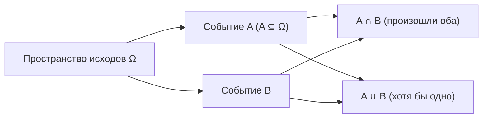

Теория вероятностей — это язык, на котором ML описывает неопределённость. Прежде чем говорить о распределениях, оценках и моделях, нужно договориться о базовых объектах: что такое случайный эксперимент, что мы называем событием и как приписываем событию число — вероятность. Эта страница закладывает фундамент, на котором дальше строятся [случайные величины и распределения](/probability/), [статистика](/statistics/) и большая часть [машинного обучения](/machine-learning/).

## Случайный эксперимент и исходы

**Случайный эксперимент** — это процедура, результат которой нельзя предсказать заранее, но множество всех мыслимых результатов известно. Классические примеры: бросок монеты, бросок кубика, вытягивание карты из колоды.

Множество всех возможных **элементарных исходов** называют **пространством элементарных исходов** и обозначают $\Omega$ (омега). Элементарный исход $\omega \in \Omega$ — это один конкретный, неделимый результат эксперимента.

- Бросок монеты: $\Omega = \{\text{О}, \text{Р}\}$ (орёл, решка).
- Бросок кубика: $\Omega = \{1, 2, 3, 4, 5, 6\}$.
- Два броска монеты: $\Omega = \{\text{ОО}, \text{ОР}, \text{РО}, \text{РР}\}$.

Пространство $\Omega$ может быть конечным (кубик), счётным (число бросков до первого орла) или несчётным (время ожидания автобуса — любое $t \ge 0$). Пока сосредоточимся на конечных пространствах: на них проще всего увидеть всю механику.

## События

**Событие** — это любое подмножество пространства исходов: $A \subseteq \Omega$. Говорят, что событие $A$ «произошло», если фактический исход эксперимента $\omega$ принадлежит $A$.

Для броска кубика «выпало чётное число» — это событие $A = \{2, 4, 6\}$. Само $\Omega$ называют **достоверным событием** (происходит всегда), а пустое множество $\varnothing$ — **невозможным событием** (не происходит никогда).

Поскольку события — это множества, над ними работают обычные операции теории множеств, и у каждой есть содержательный смысл.

| Операция | Запись | Смысл |
|---|---|---|
| Объединение | $A \cup B$ | произошло $A$, или $B$, или оба |
| Пересечение | $A \cap B$ | произошли и $A$, и $B$ одновременно |
| Дополнение | $\bar{A}$ (или $A^c$) | $A$ не произошло |
| Разность | $A \setminus B$ | $A$ произошло, а $B$ — нет |

События $A$ и $B$ называют **несовместными** (непересекающимися), если они не могут произойти вместе: $A \cap B = \varnothing$.



## Аксиомы вероятности

**Вероятность** — это функция $P$, которая каждому событию $A$ сопоставляет число $P(A)$. Современное определение (аксиоматика А. Н. Колмогорова, 1933) требует, чтобы эта функция удовлетворяла трём аксиомам.

1. **Неотрицательность.** Для любого события $A$:
$$P(A) \ge 0.$$
2. **Нормировка.** Вероятность достоверного события равна единице:
$$P(\Omega) = 1.$$
3. **Аддитивность.** Для несовместных событий $A$ и $B$ ($A \cap B = \varnothing$):
$$P(A \cup B) = P(A) + P(B).$$
   (В общем случае требуется счётная аддитивность — для счётного набора попарно несовместных событий.)

Из этих трёх аксиом выводятся все остальные свойства. Несколько самых полезных:

- Вероятность невозможного события: $P(\varnothing) = 0$.
- Вероятность дополнения: $P(\bar{A}) = 1 - P(A)$. Часто проще посчитать «обратное» событие.
- Ограниченность: $0 \le P(A) \le 1$.
- Монотонность: если $A \subseteq B$, то $P(A) \le P(B)$.
- **Формула включения-исключения** для произвольных (в том числе совместных) событий:
$$P(A \cup B) = P(A) + P(B) - P(A \cap B).$$

:::note[Зачем вычитать пересечение]
Если $A$ и $B$ пересекаются, то, складывая $P(A)$ и $P(B)$, мы дважды учитываем исходы из $A \cap B$. Вычитание $P(A \cap B)$ убирает двойной счёт. Когда события несовместны, $P(A \cap B) = 0$, и формула превращается в третью аксиому.
:::

## Классическое определение вероятности

Аксиомы говорят, какими свойствами обладает $P$, но не дают рецепта вычисления. Самый простой рецепт работает, когда $\Omega$ конечно и все элементарные исходы **равновозможны** (симметричная монета, честный кубик). Тогда вероятность события равна доле благоприятных исходов:

$$P(A) = \frac{|A|}{|\Omega|} = \frac{\text{число благоприятных исходов}}{\text{общее число исходов}}.$$

Здесь $|A|$ — количество элементов в $A$. Например, для честного кубика и события «чётное число» $A = \{2,4,6\}$:

$$P(A) = \frac{3}{6} = \frac{1}{2}.$$

Главное ограничение: исходы должны быть именно равновозможными. У кривой монеты или у «суммы двух кубиков» (где 7 выпадает чаще, чем 2) наивный подсчёт долей даст неверный ответ — нужно правильно выбрать пространство равновозможных исходов.

:::caution[Выбирайте правильное пространство]
Для суммы двух кубиков нельзя брать $\Omega = \{2, 3, \dots, 12\}$ (11 исходов) и считать их равновозможными — это ошибка. Равновозможны 36 пар $(i, j)$, где $i, j \in \{1,\dots,6\}$. Сумма 7 даёт 6 благоприятных пар, поэтому $P(\text{сумма}=7) = 6/36$, а сумма 2 — только одну: $P(\text{сумма}=2) = 1/36$.
:::

## Немного комбинаторики

Чтобы применять классическое определение, нужно уметь считать число исходов. Здесь помогает комбинаторика.

**Правило умножения.** Если первый выбор можно сделать $n_1$ способами, второй — $n_2$ способами и так далее, то общее число способов равно произведению $n_1 \cdot n_2 \cdots n_k$. Например, у трёхзначного PIN из цифр $0$–$9$ всего $10^3 = 1000$ вариантов.

**Перестановки.** Число способов расставить $n$ различных объектов в ряд (порядок важен, все объекты используются):

$$P_n = n! = n \cdot (n-1) \cdots 2 \cdot 1.$$

Например, $5$ книг на полке можно расставить $5! = 120$ способами. По соглашению $0! = 1$.

**Размещения** (выборки с учётом порядка). Число способов выбрать $k$ объектов из $n$ и расставить их по местам:

$$A_n^k = \frac{n!}{(n-k)!} = n \cdot (n-1) \cdots (n-k+1).$$

**Сочетания** (выборки без учёта порядка). Число способов выбрать $k$ объектов из $n$, когда порядок не важен:

$$C_n^k = \binom{n}{k} = \frac{n!}{k!\,(n-k)!}.$$

Разница между размещениями и сочетаниями — в одном множителе $k!$: при сочетаниях мы делим на число перестановок внутри выбранной группы, потому что порядок нам безразличен.

| Что считаем | Порядок важен? | Все используются? | Формула |
|---|---|---|---|
| Перестановки | да | да | $n!$ |
| Размещения | да | нет (берём $k$) | $\dfrac{n!}{(n-k)!}$ |
| Сочетания | нет | нет (берём $k$) | $\dfrac{n!}{k!\,(n-k)!}$ |

В Python готовые функции лежат в стандартном модуле `math`:

```python
from math import factorial, perm, comb

print(factorial(5))   # 120  — перестановки 5 объектов
print(perm(10, 3))    # 720  — размещения: A(10,3)
print(comb(49, 6))    # 13983816 — сочетания: C(49,6)
```

## Разобранные примеры

**Пример 1. Сумма на двух кубиках.** Какова вероятность, что сумма очков на двух честных кубиках равна 8?

Пространство — 36 равновозможных пар. Благоприятны пары $(2,6), (3,5), (4,4), (5,3), (6,2)$ — всего 5. Значит,

$$P(\text{сумма}=8) = \frac{5}{36} \approx 0{,}139.$$

**Пример 2. «Хотя бы один».** Бросаем монету 3 раза. Какова вероятность выпадения хотя бы одного орла?

Считать «хотя бы один» напрямую долго — проще через дополнение. Событие $\bar{A}$ = «ни одного орла» = «три решки» имеет ровно один благоприятный исход из $2^3 = 8$:

$$P(\bar{A}) = \frac{1}{8}, \qquad P(A) = 1 - \frac{1}{8} = \frac{7}{8}.$$

**Пример 3. Лотерея.** В тираже из 49 номеров выбирают 6. Какова вероятность угадать все 6 (порядок не важен)?

Число способов выбрать 6 номеров из 49 равно $\binom{49}{6} = 13\,983\,816$. Благоприятный исход один, поэтому

$$P = \frac{1}{\binom{49}{6}} = \frac{1}{13\,983\,816} \approx 7{,}15 \cdot 10^{-8}.$$

## Задания

**Задание 1.** Из колоды в 36 карт вытягивают одну. Найдите вероятность события «вытянута карта червовой масти ИЛИ туз». Подсказка: используйте формулу включения-исключения.

<details>
<summary>Решение</summary>

В колоде 9 карт червовой масти ($A$), 4 туза ($B$) и ровно один туз червей ($A \cap B$).

$$P(A \cup B) = P(A) + P(B) - P(A \cap B) = \frac{9}{36} + \frac{4}{36} - \frac{1}{36} = \frac{12}{36} = \frac{1}{3}.$$

Если бы мы забыли вычесть пересечение, туз червей был бы посчитан дважды, и ответ оказался бы завышенным.

</details>

**Задание 2.** Бросают два честных кубика. Что вероятнее: что сумма очков чётная или что произведение очков чётное? Обоснуйте.

<details>
<summary>Решение</summary>

Всего $36$ равновозможных пар.

Сумма чётна, когда оба числа чётные ($3 \cdot 3 = 9$ пар) или оба нечётные ($3 \cdot 3 = 9$ пар):
$$P(\text{сумма чётна}) = \frac{9 + 9}{36} = \frac{18}{36} = \frac{1}{2}.$$

Произведение нечётно только если оба числа нечётные ($9$ пар), значит произведение чётно в остальных случаях:
$$P(\text{произведение чётно}) = 1 - \frac{9}{36} = \frac{27}{36} = \frac{3}{4}.$$

Чётное произведение вероятнее: $\frac{3}{4} > \frac{1}{2}$.

</details>

**Задание 3.** Из 10 человек нужно выбрать команду из 3 человек. Сколькими способами это можно сделать? А если внутри команды дополнительно назначают капитана, заместителя и казначея (три разные роли)?

<details>
<summary>Решение</summary>

Без ролей порядок не важен — это сочетания:
$$\binom{10}{3} = \frac{10!}{3!\,7!} = \frac{10 \cdot 9 \cdot 8}{6} = 120.$$

С тремя различными ролями порядок важен — это размещения:
$$A_{10}^{3} = 10 \cdot 9 \cdot 8 = 720.$$

Множитель $720 / 120 = 6 = 3!$ — это число способов распределить три роли внутри уже выбранной тройки.

</details>

**Задание 4.** Напишите короткий код, который методом Монте-Карло оценивает вероятность выпадения хотя бы одного орла за 3 броска монеты, и сравните с точным ответом $7/8$.

<details>
<summary>Решение</summary>

```python
import random

N = 1_000_000
hits = 0
for _ in range(N):
    flips = [random.randint(0, 1) for _ in range(3)]  # 1 = орёл
    if sum(flips) >= 1:                                # хотя бы один орёл
        hits += 1

print(hits / N)        # около 0.875
print(7 / 8)           # 0.875
```

При большом числе испытаний $N$ оценка $hits/N$ сходится к точному значению $7/8 = 0{,}875$ — это иллюстрация частотного смысла вероятности (закон больших чисел), к которому мы вернёмся в разделе [статистики](/statistics/).

</details>
