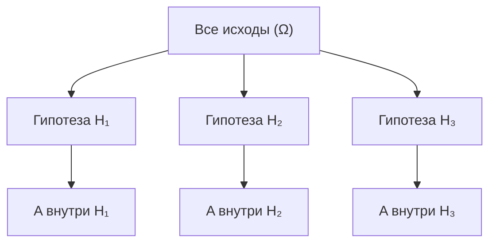
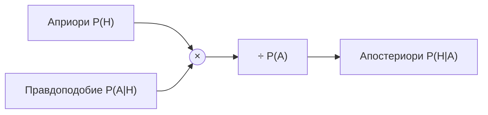

Почти всё интересное в теории вероятностей начинается там, где появляется новая информация. Мы знали что-то о мире, потом узнали факт — и наши оценки шансов изменились. Аппарат, который описывает это «обновление веры под действием данных», — условная вероятность и теорема Байеса. Это же ядро многих ML-моделей: от спам-фильтров до байесовских сетей.

Базовые понятия (события, $P(A)$, аксиомы) разобраны в разделе [Теория вероятностей](/probability/). Здесь мы идём дальше — к тому, как вероятности связаны между собой.

## Условная вероятность

**Условная вероятность** $P(A \mid B)$ — это вероятность события $A$ при условии, что событие $B$ уже произошло. Читается «вероятность $A$ при условии $B$».

Идея простая: когда нам сообщили, что $B$ случилось, всё пространство исходов сжимается до $B$. Теперь нас интересует не вся вероятность $A$, а лишь та её часть, что попадает внутрь $B$:

$$
P(A \mid B) = \frac{P(A \cap B)}{P(B)}, \qquad P(B) > 0.
$$

Здесь $A \cap B$ — событие «произошли и $A$, и $B$» (пересечение). Мы как бы переносим начало координат внутрь $B$ и нормируем на «новый размер мира» $P(B)$.

::: note[Геометрическая интуиция]
Представьте пространство исходов как площадь квадрата. $P(B)$ — площадь области $B$. Условие «$B$ произошло» означает: мы смотрим только на область $B$ и спрашиваем, какую её долю занимает $A$. Поэтому в знаменателе именно $P(B)$, а не $1$.
:::

Из определения сразу следует **правило умножения** (теорема умножения вероятностей):

$$
P(A \cap B) = P(A \mid B)\, P(B) = P(B \mid A)\, P(A).
$$

То есть совместную вероятность можно «разложить» двумя способами — и именно это равенство приведёт нас к теореме Байеса.

### Простой пример с костью

Бросаем честный шестигранный кубик. Пусть $A = \{\text{выпало число} \geq 5\} = \{5, 6\}$, а $B = \{\text{выпало чётное}\} = \{2, 4, 6\}$.

- $P(A) = \tfrac{2}{6} = \tfrac{1}{3}$ — без всякой информации.
- $A \cap B = \{6\}$, значит $P(A \cap B) = \tfrac{1}{6}$.
- Узнав, что число чётное, считаем: $P(A \mid B) = \dfrac{1/6}{3/6} = \dfrac{1}{3}$.

Любопытно: здесь $P(A \mid B) = P(A)$. Информация «число чётное» не изменила оценку. Это особый случай — независимость.

## Независимость событий

События $A$ и $B$ **независимы**, если знание об одном не меняет вероятность другого:

$$
P(A \mid B) = P(A).
$$

Подставив это в правило умножения, получаем эквивалентное и более симметричное определение:

$$
A \perp B \iff P(A \cap B) = P(A)\, P(B).
$$

Именно это равенство удобно проверять на практике: вероятность совместного наступления равна произведению вероятностей.

::: caution[Независимость — это не «несовместность»]
Несовместные (непересекающиеся) события $A \cap B = \varnothing$ почти всегда **зависимы**: если случилось одно, второе точно не случилось, то есть $P(A \mid B) = 0 \neq P(A)$. Не путайте «не пересекаются» и «независимы» — это противоположные по духу вещи.
:::

Для нескольких событий $A_1, \dots, A_n$ важна **взаимная независимость**: вероятность пересечения любого набора равна произведению вероятностей. Попарной независимости для этого недостаточно. На допущении независимости признаков построен наивный байесовский классификатор — об этом ниже.

## Формула полной вероятности

Часто прямую вероятность события $A$ посчитать тяжело, зато легко посчитать её «по частям» — внутри разных сценариев. Пусть события $H_1, H_2, \dots, H_n$ образуют **полную группу гипотез**: они попарно несовместны и покрывают всё пространство (ровно одна из них обязательно происходит).



Тогда вероятность $A$ складывается из вкладов каждой гипотезы:

$$
P(A) = \sum_{i=1}^{n} P(A \mid H_i)\, P(H_i).
$$

Каждое слагаемое — это «вероятность попасть в сценарий $H_i$» умноженная на «вероятность $A$ внутри этого сценария». Формула — прямое следствие правила умножения и того, что куски $A \cap H_i$ не пересекаются.

**Пример.** Две урны. В первой 3 белых и 7 чёрных шаров, во второй 6 белых и 4 чёрных. Урну выбираем с равной вероятностью, затем тянем шар. Какова вероятность вытащить белый ($A$)?

$$
P(A) = \underbrace{\tfrac{1}{2}}_{P(H_1)} \cdot \underbrace{\tfrac{3}{10}}_{P(A \mid H_1)} + \underbrace{\tfrac{1}{2}}_{P(H_2)} \cdot \underbrace{\tfrac{6}{10}}_{P(A \mid H_2)} = \tfrac{3}{20} + \tfrac{6}{20} = \tfrac{9}{20} = 0{,}45.
$$

## Теорема Байеса

Формула полной вероятности отвечает на вопрос «какова вероятность $A$?». Теорема Байеса отвечает на обратный, куда более ценный вопрос: «мы наблюдали $A$ — из какой гипотезы он, скорее всего, родом?»

Берём правило умножения в двух формах $P(H \cap A) = P(A \mid H)P(H) = P(H \mid A)P(A)$ и выражаем искомое:

$$
P(H \mid A) = \frac{P(A \mid H)\, P(H)}{P(A)}.
$$

Если $H_i$ — полная группа гипотез, знаменатель раскрывается по формуле полной вероятности:

$$
P(H_i \mid A) = \frac{P(A \mid H_i)\, P(H_i)}{\sum_{j} P(A \mid H_j)\, P(H_j)}.
$$

### Словарь Байеса

| Обозначение | Название | Смысл |
|---|---|---|
| $P(H)$ | априорная вероятность (prior) | что мы думали о гипотезе **до** наблюдения |
| $P(A \mid H)$ | правдоподобие (likelihood) | насколько данные $A$ ожидаемы при гипотезе $H$ |
| $P(A)$ | свидетельство (evidence) | полная вероятность данных, нормировочный множитель |
| $P(H \mid A)$ | апостериорная вероятность (posterior) | что мы думаем о гипотезе **после** наблюдения |

Кратко суть всей теоремы:

$$
\text{posterior} \propto \text{likelihood} \times \text{prior}.
$$

Знак $\propto$ («пропорционально») напоминает: знаменатель $P(A)$ одинаков для всех гипотез и нужен лишь для того, чтобы апостериорные вероятности в сумме давали единицу.



## Содержательный пример: медицинский тест

Это классика, на которой ломается интуиция почти у всех. Болезнь встречается у $0{,}1\%$ населения. Тест хорош: он находит больных в $99\%$ случаев (чувствительность) и даёт ложную тревогу лишь в $5\%$ случаев у здоровых. Человек получил **положительный** результат. С какой вероятностью он действительно болен?

Большинство людей называют число около $90\%$. Посчитаем честно.

Обозначим:

- $H$ — «болен», $\bar H$ — «здоров»; $P(H) = 0{,}001$, $P(\bar H) = 0{,}999$.
- $A$ — «тест положительный». Тогда $P(A \mid H) = 0{,}99$ и $P(A \mid \bar H) = 0{,}05$.

Сначала свидетельство — полная вероятность положительного теста:

$$
P(A) = P(A \mid H)P(H) + P(A \mid \bar H)P(\bar H) = 0{,}99 \cdot 0{,}001 + 0{,}05 \cdot 0{,}999 \approx 0{,}0509.
$$

Теперь Байес:

$$
P(H \mid A) = \frac{0{,}99 \cdot 0{,}001}{0{,}0509} \approx 0{,}0194 \approx 1{,}9\%.
$$

Всего около **2%**. Почему так мало? Болезнь крайне редкая, поэтому здоровых, получивших ложноположительный результат, в абсолютном выражении гораздо больше, чем настоящих больных. Низкий приоритет $P(H)$ «придавливает» даже очень точный тест. Это называют [ошибкой базовой ставки (base rate fallacy)](https://en.wikipedia.org/wiki/Base_rate_fallacy).

::: tip[Проверка на «натуральных частотах»]
Возьмём 100 000 человек. Больных — 100, из них тест поймает $\approx 99$. Здоровых — 99 900, ложная тревога у $5\%$ — это $\approx 4995$ человек. Положительных всего $99 + 4995 = 5094$, из них реально больны $99$. Доля: $99 / 5094 \approx 1{,}9\%$. Тот же ответ, но без формул — людям так понятнее.
:::

```python
p_disease = 0.001          # P(H)
sensitivity = 0.99         # P(A|H)
false_positive = 0.05      # P(A|not H)

p_pos = sensitivity * p_disease + false_positive * (1 - p_disease)  # P(A)
posterior = sensitivity * p_disease / p_pos                          # P(H|A)
print(f"P(болен | тест+) = {posterior:.4f}")  # 0.0194
```

## Связь с наивным байесовским классификатором

Идея Байеса напрямую превращается в алгоритм классификации. Пусть объект описан признаками $x_1, \dots, x_n$, а классы — $C_1, \dots, C_k$ (например, «спам» / «не спам»). Мы хотим выбрать класс с максимальной апостериорной вероятностью:

$$
P(C \mid x_1, \dots, x_n) \propto P(C)\, P(x_1, \dots, x_n \mid C).
$$

Совместное правдоподобие всех признаков оценить сложно. «Наивное» допущение: признаки **условно независимы при заданном классе**. Тогда совместная вероятность распадается в произведение:

$$
P(x_1, \dots, x_n \mid C) = \prod_{i=1}^{n} P(x_i \mid C).
$$

Классификатор выбирает класс по правилу:

$$
\hat C = \arg\max_{C} \; P(C) \prod_{i=1}^{n} P(x_i \mid C).
$$

Допущение независимости почти всегда нарушается (в тексте слова коррелируют), но на практике модель работает на удивление хорошо, быстро обучается и не требует много данных. Подробнее о ней — в разделе [Прочие алгоритмы ML](/machine-learning/other-algorithms/).

::: note[Почему на практике берут логарифм]
Произведение многих маленьких вероятностей быстро уходит в машинный ноль (потеря точности). Поэтому максимизируют логарифм: $\log P(C) + \sum_i \log P(x_i \mid C)$ — сумма вместо произведения. О логарифмах и устойчивости вычислений см. [Математический анализ](/calculus/).
:::

```python
from sklearn.naive_bayes import MultinomialNB
from sklearn.feature_extraction.text import CountVectorizer

texts = ["выиграй приз бесплатно", "отчёт за квартал готов",
         "бесплатный кредит сейчас", "встреча перенесена на среду"]
labels = ["spam", "ham", "spam", "ham"]

X = CountVectorizer().fit_transform(texts)
clf = MultinomialNB().fit(X, labels)
print(clf.classes_)  # ['ham' 'spam']
```

## Главное за минуту

- Условная вероятность $P(A \mid B) = \dfrac{P(A \cap B)}{P(B)}$ — это пересчёт шансов после получения информации.
- Независимость: $P(A \cap B) = P(A)P(B)$. Это не то же самое, что несовместность.
- Формула полной вероятности собирает $P(A)$ из вкладов гипотез; теорема Байеса переворачивает условие и даёт апостериорную вероятность.
- $\text{posterior} \propto \text{likelihood} \times \text{prior}$ — апостериорное мнение пропорционально правдоподобию данных, взвешенному на априорное мнение.
- Редкие события + неидеальный тест = контринтуитивно низкая апостериорная вероятность. Всегда учитывайте базовую ставку.
- Наивный Байес — прямое применение теоремы с допущением условной независимости признаков.

## Задания

**1. Две монеты.** Бросают две честные монеты. Известно, что **хотя бы одна** выпала орлом. Какова вероятность, что **обе** орлы?

<details>
<summary>Решение</summary>

Пространство исходов: $\{OO, OР, РO, РР\}$, каждый с вероятностью $1/4$.

Событие $B$ = «хотя бы один орёл» = $\{OO, OР, РO\}$, значит $P(B) = 3/4$.
Событие $A$ = «обе орлы» = $\{OO\}$, причём $A \cap B = \{OO\}$, $P(A \cap B) = 1/4$.

$$
P(A \mid B) = \frac{1/4}{3/4} = \frac{1}{3}.
$$

Ответ $1/3$, а не $1/2$ — потому что условие «хотя бы один орёл» исключает только исход $РР$, оставляя три равновероятных варианта.

</details>

**2. Проверка независимости.** При броске кубика: $A = \{1,2,3\}$ («малое число»), $B = \{2,4,6\}$ («чётное»). Независимы ли $A$ и $B$?

<details>
<summary>Решение</summary>

$P(A) = 3/6 = 1/2$, $P(B) = 3/6 = 1/2$.
$A \cap B = \{2\}$, поэтому $P(A \cap B) = 1/6$.

Проверяем критерий: $P(A)P(B) = \tfrac{1}{2}\cdot\tfrac{1}{2} = \tfrac{1}{4}$.

Так как $1/6 \neq 1/4$, события **зависимы**.

</details>

**3. Байес для двух заводов.** Завод №1 выпускает $60\%$ деталей с браком $2\%$; завод №2 — остальные $40\%$ с браком $5\%$. Деталь оказалась бракованной. С какого завода она вероятнее?

<details>
<summary>Решение</summary>

Гипотезы: $H_1$ (завод 1), $P(H_1)=0{,}6$; $H_2$ (завод 2), $P(H_2)=0{,}4$.
Брак $D$: $P(D \mid H_1)=0{,}02$, $P(D \mid H_2)=0{,}05$.

Полная вероятность брака:

$$
P(D) = 0{,}6 \cdot 0{,}02 + 0{,}4 \cdot 0{,}05 = 0{,}012 + 0{,}020 = 0{,}032.
$$

Апостериорные вероятности:

$$
P(H_1 \mid D) = \frac{0{,}012}{0{,}032} = 0{,}375, \qquad P(H_2 \mid D) = \frac{0{,}020}{0{,}032} = 0{,}625.
$$

Несмотря на больший объём выпуска, бракованная деталь вероятнее с **завода №2** ($62{,}5\%$) из-за более высокого процента брака.

</details>

**4. Код: обновление веры данными.** Монета может быть честной ($p=0{,}5$) или фальшивой ($p=0{,}9$ на орла), априори с равными шансами. Выпало 3 орла подряд. Посчитайте апостериорную вероятность того, что монета фальшивая.

<details>
<summary>Решение</summary>

Правдоподобие 3 орлов: для честной $0{,}5^3$, для фальшивой $0{,}9^3$.

```python
prior_fair, prior_fake = 0.5, 0.5
like_fair = 0.5 ** 3      # 0.125
like_fake = 0.9 ** 3      # 0.729

evidence = like_fair * prior_fair + like_fake * prior_fake
post_fake = like_fake * prior_fake / evidence
print(round(post_fake, 4))  # 0.8537
```

Аналитически:

$$
P(\text{fake} \mid OOO) = \frac{0{,}729 \cdot 0{,}5}{0{,}125 \cdot 0{,}5 + 0{,}729 \cdot 0{,}5} \approx 0{,}854.
$$

Три орла подряд поднимают веру в фальшивость монеты с $50\%$ до примерно $85\%$.

</details>
