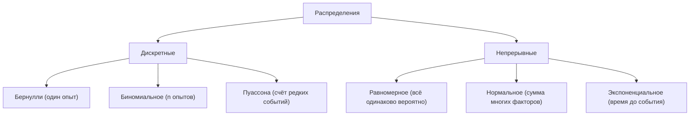
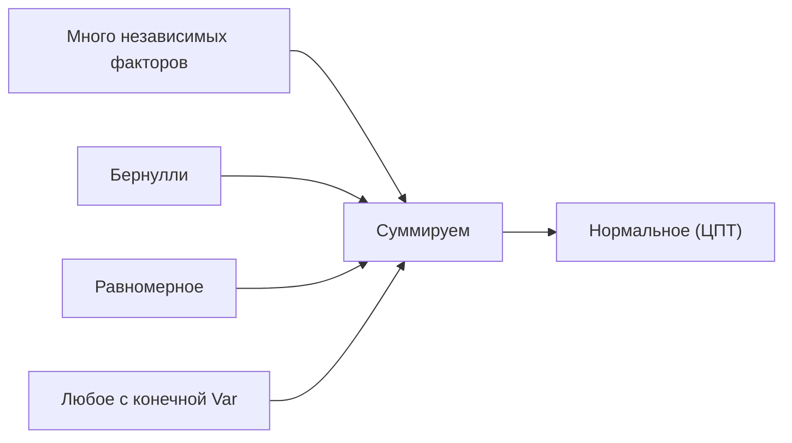

Распределение — это «закон», по которому случайная величина раздаёт свою вероятность по возможным значениям. Зная распределение, мы знаем всё: среднее, разброс, вероятность редких событий. На практике большинство задач сводится к небольшому набору «типовых» распределений — они описывают подбрасывания монет, потоки заявок, шумы измерений и многое другое. В этом разделе разберём шесть самых важных: три дискретных (Бернулли, биномиальное, Пуассона) и три непрерывных (равномерное, нормальное, экспоненциальное).

Если термины «случайная величина», «плотность» или «математическое ожидание» пока выглядят туманно, загляните в раздел [Теория вероятностей](/probability/) — здесь мы опираемся на эти понятия.

## Краткая навигация



Полезно держать в голове две характеристики любого распределения:

- **математическое ожидание** $\mathbb{E}[X]$ — «центр тяжести», среднее значение;
- **дисперсия** $\mathrm{Var}(X)$ — мера разброса; её корень $\sigma=\sqrt{\mathrm{Var}(X)}$ называют стандартным отклонением.

## Бернулли: один опыт с двумя исходами

Самый простой кирпичик. Случайная величина $X$ принимает всего два значения: $1$ («успех») с вероятностью $p$ и $0$ («неудача») с вероятностью $1-p$.

$$P(X=1)=p,\qquad P(X=0)=1-p,\qquad 0\le p\le 1.$$

Компактно функцию вероятности можно записать так:

$$P(X=k)=p^{k}(1-p)^{1-k},\quad k\in\{0,1\}.$$

**Параметр:** $p$ — вероятность успеха.

**Характеристики:**

$$\mathbb{E}[X]=p,\qquad \mathrm{Var}(X)=p(1-p).$$

Дисперсия максимальна при $p=0{,}5$ (наибольшая неопределённость) и равна нулю при $p=0$ или $p=1$ (исход предопределён).

**Где встречается:** подбрасывание монеты, «кликнул / не кликнул», «дефолт по кредиту / нет». В ML это основа бинарной классификации: модель предсказывает $p$ — вероятность класса 1.

## Биномиальное: сумма независимых Бернулли

Повторим опыт Бернулли $n$ раз независимо, с одной и той же $p$, и посчитаем число успехов $X$. Получаем биномиальное распределение $X\sim \mathrm{Bin}(n,p)$.

$$P(X=k)=\binom{n}{k}p^{k}(1-p)^{n-k},\quad k=0,1,\dots,n,$$

где $\binom{n}{k}=\dfrac{n!}{k!\,(n-k)!}$ — число способов выбрать $k$ успехов из $n$ опытов (см. [комбинаторику в основах вероятности](/probability/)).

**Параметры:** $n$ (число опытов) и $p$.

**Характеристики:**

$$\mathbb{E}[X]=np,\qquad \mathrm{Var}(X)=np(1-p).$$

Интуиция простая: складываем $n$ одинаковых бернуллиевских слагаемых, поэтому и среднее, и дисперсия умножаются на $n$.

**Форма.** При маленьком $n$ распределение «зубчатое»; с ростом $n$ оно становится симметричным и колоколообразным (это уже намёк на нормальное — см. ниже).

```python
import numpy as np
from scipy.stats import binom

n, p = 10, 0.3
k = np.arange(0, n + 1)
print(binom.pmf(k, n, p).round(3))
# вероятность ровно 3 успехов:
print(binom.pmf(3, n, p).round(4))  # 0.2668
```

**Где встречается:** число бракованных деталей в партии, число конверсий из $n$ показов рекламы, число «орлов» в серии бросков.

## Пуассона: счёт редких событий за интервал

Распределение Пуассона описывает **количество событий**, происходящих за фиксированный интервал времени (или на отрезке пространства), если события независимы и происходят со средней интенсивностью $\lambda$.

$$P(X=k)=\frac{\lambda^{k}e^{-\lambda}}{k!},\quad k=0,1,2,\dots$$

**Параметр:** $\lambda>0$ — средняя ожидаемая частота событий за интервал.

**Характеристики:** замечательная особенность — среднее и дисперсия совпадают.

$$\mathbb{E}[X]=\lambda,\qquad \mathrm{Var}(X)=\lambda.$$

**Связь с биномиальным.** Пуассон — это предел биномиального, когда опытов очень много ($n\to\infty$), а вероятность каждого успеха мала ($p\to 0$), но их произведение остаётся конечным: $np\to\lambda$. Поэтому Пуассон — «закон редких событий».

:::tip[Когда тянуться к Пуассону]
Если вы считаете, сколько раз произошло что-то редкое за единицу времени (звонки в колл-центр за час, опечатки на странице, отказы сервера за сутки) — это почти наверняка Пуассон.
:::

**Где встречается:** число запросов к серверу в секунду, число клиентов в очереди, число фотонов на детекторе, число страховых случаев за год.

## Равномерное: всё одинаково вероятно

Непрерывная случайная величина равномерно распределена на отрезке $[a,b]$, если её плотность постоянна внутри отрезка и равна нулю снаружи.

$$f(x)=\begin{cases}\dfrac{1}{b-a}, & a\le x\le b,\\[4pt] 0, & \text{иначе.}\end{cases}$$

**Параметры:** границы $a$ и $b$.

**Характеристики:**

$$\mathbb{E}[X]=\frac{a+b}{2},\qquad \mathrm{Var}(X)=\frac{(b-a)^{2}}{12}.$$

**Форма** — «прямоугольник»: все значения внутри отрезка равноправны.

**Где встречается:** генераторы псевдослучайных чисел (стандартное `random()` даёт $U[0,1]$), модель «ничего не знаем, кроме диапазона», ошибка округления. Из равномерного $U[0,1]$ можно получить любое другое распределение методом обратной функции — это фундамент симуляций Монте-Карло.

```python
import numpy as np
u = np.random.uniform(0, 1, size=5)
print(u)  # пять чисел из U[0,1]
```

## Нормальное (Гаусса): колокол

Главное непрерывное распределение. Плотность нормального распределения с параметрами $\mu$ (среднее) и $\sigma^{2}$ (дисперсия):

$$f(x)=\frac{1}{\sigma\sqrt{2\pi}}\exp\!\left(-\frac{(x-\mu)^{2}}{2\sigma^{2}}\right).$$

**Параметры:** $\mu$ задаёт положение пика, $\sigma$ — ширину колокола. Запись: $X\sim\mathcal{N}(\mu,\sigma^{2})$.

**Характеристики:**

$$\mathbb{E}[X]=\mu,\qquad \mathrm{Var}(X)=\sigma^{2}.$$

**Правило трёх сигм** — удобный ориентир для нормального распределения:

| Интервал | Доля массы |
|---|---|
| $\mu\pm\sigma$ | $\approx 68\%$ |
| $\mu\pm 2\sigma$ | $\approx 95\%$ |
| $\mu\pm 3\sigma$ | $\approx 99{,}7\%$ |

**Стандартизация.** Любую нормальную величину можно привести к стандартной $\mathcal{N}(0,1)$ заменой

$$Z=\frac{X-\mu}{\sigma}.$$

Это превращает значение в «число стандартных отклонений от среднего» (z-оценку) и используется на каждом шагу в [статистике](/statistics/).

```python
import numpy as np
from scipy.stats import norm

# P(X в пределах одного сигма от среднего)
print(norm.cdf(1) - norm.cdf(-1))  # 0.6827
x = np.random.normal(loc=0, scale=1, size=1000)  # выборка из N(0,1)
```

### Почему нормальное распределение особенное

Нормальное распределение возникает повсюду не случайно — за этим стоит фундаментальная **центральная предельная теорема (ЦПТ)**:

:::note[Центральная предельная теорема]
Сумма (или среднее) большого числа независимых случайных величин с конечной дисперсией распределена приблизительно нормально — почти **независимо от того**, как распределено каждое слагаемое.
:::

Формально, если $X_1,\dots,X_n$ независимы и одинаково распределены со средним $\mu$ и дисперсией $\sigma^{2}$, то их нормированное среднее сходится к стандартному нормальному:

$$\frac{\bar X_n-\mu}{\sigma/\sqrt{n}}\;\xrightarrow{\;n\to\infty\;}\;\mathcal{N}(0,1).$$

Отсюда — особый статус «колокола»:

- **Сумма многих малых факторов.** Рост человека, ошибка измерения прибора, шум в данных складываются из множества независимых вкладов — и потому близки к нормальным.
- **Устойчивость к свёртке.** Сумма независимых нормальных величин снова нормальна: $\mathcal{N}(\mu_1,\sigma_1^2)+\mathcal{N}(\mu_2,\sigma_2^2)=\mathcal{N}(\mu_1+\mu_2,\sigma_1^2+\sigma_2^2)$.
- **Максимум энтропии.** Среди всех распределений с заданными средним и дисперсией нормальное — самое «неинформативное» (максимально неопределённое). Это делает его честным выбором по умолчанию, когда мы знаем только центр и разброс.
- **Удобство математики.** Полностью задаётся двумя числами $(\mu,\sigma)$, имеет приятные свойства при дифференцировании и интегрировании — отсюда метод наименьших квадратов, гауссовские модели, доверительные интервалы в [статистике](/statistics/).



:::caution[Не всё на свете нормально]
ЦПТ требует независимости и конечной дисперсии. Доходы, размеры городов, длительности тяжёлых хвостов часто описываются не нормальным, а степенными или логнормальными законами. Прежде чем «по привычке» предполагать нормальность, посмотрите на гистограмму данных.
:::

## Экспоненциальное: время до события

Экспоненциальное распределение описывает **время ожидания** до первого события в пуассоновском потоке. Оно тесно связано с распределением Пуассона: если события приходят со средней частотой $\lambda$, то промежутки между ними экспоненциальны.

$$f(x)=\lambda e^{-\lambda x},\quad x\ge 0,\qquad \lambda>0.$$

Функция распределения (вероятность, что событие наступит не позже $x$):

$$F(x)=P(X\le x)=1-e^{-\lambda x}.$$

**Параметр:** $\lambda$ — интенсивность (среднее число событий в единицу времени).

**Характеристики:**

$$\mathbb{E}[X]=\frac{1}{\lambda},\qquad \mathrm{Var}(X)=\frac{1}{\lambda^{2}}.$$

Чем больше интенсивность $\lambda$, тем короче среднее ожидание $1/\lambda$.

**Свойство отсутствия памяти** — ключевая особенность:

$$P(X>s+t\mid X>s)=P(X>t).$$

Если устройство прожило $s$ часов, вероятность прожить ещё $t$ часов такая же, как у нового. Прошлое не влияет на будущее — отсюда «отсутствие памяти». Это единственное непрерывное распределение с таким свойством.

**Где встречается:** время между запросами к серверу, время до отказа оборудования (в простейшей модели без износа), интервалы между радиоактивными распадами, время обслуживания в теории очередей.

```python
import numpy as np
lam = 2.0  # в среднем 2 события в единицу времени -> среднее ожидание 0.5
waits = np.random.exponential(scale=1 / lam, size=5)  # scipy/numpy берут 1/lambda
print(waits.round(3))
```

:::note[Пуассон и экспоненциальное — две стороны одного процесса]
*Сколько* событий за интервал — Пуассон. *Сколько ждать* до события — экспоненциальное. Один и тот же поток, разные вопросы.
:::

## Сводная таблица

| Распределение | Тип | Параметры | $\mathbb{E}[X]$ | $\mathrm{Var}(X)$ | Типичный вопрос |
|---|---|---|---|---|---|
| Бернулли | дискр. | $p$ | $p$ | $p(1-p)$ | Успех или нет? |
| Биномиальное | дискр. | $n,\ p$ | $np$ | $np(1-p)$ | Сколько успехов из $n$? |
| Пуассона | дискр. | $\lambda$ | $\lambda$ | $\lambda$ | Сколько редких событий за интервал? |
| Равномерное | непр. | $a,\ b$ | $\frac{a+b}{2}$ | $\frac{(b-a)^2}{12}$ | Всё в диапазоне равновероятно |
| Нормальное | непр. | $\mu,\ \sigma^2$ | $\mu$ | $\sigma^2$ | Сумма многих факторов |
| Экспоненциальное | непр. | $\lambda$ | $\frac{1}{\lambda}$ | $\frac{1}{\lambda^2}$ | Сколько ждать до события? |

## Задания

### Задание 1. Биномиальное на практике

Монета честная ($p=0{,}5$), бросаем её $5$ раз. Какова вероятность выпадения ровно $3$ орлов? А не менее $4$ орлов?

<details>
<summary>Решение</summary>

Число орлов $X\sim\mathrm{Bin}(5,\,0{,}5)$.

Ровно 3 орла:

$$P(X=3)=\binom{5}{3}(0{,}5)^3(0{,}5)^2=10\cdot\frac{1}{32}=\frac{10}{32}=0{,}3125.$$

Не менее 4 орлов — это $X=4$ или $X=5$:

$$P(X=4)=\binom{5}{4}(0{,}5)^5=5\cdot\frac{1}{32}=\frac{5}{32},\qquad P(X=5)=\binom{5}{5}(0{,}5)^5=\frac{1}{32}.$$

$$P(X\ge 4)=\frac{5}{32}+\frac{1}{32}=\frac{6}{32}=0{,}1875.$$

```python
from scipy.stats import binom
print(binom.pmf(3, 5, 0.5))          # 0.3125
print(binom.sf(3, 5, 0.5))           # P(X>3)=P(X>=4)=0.1875
```

</details>

### Задание 2. Пуассон в колл-центре

В колл-центр поступает в среднем $\lambda=3$ звонка в минуту. Считая поток пуассоновским, найдите вероятность того, что за минуту не поступит ни одного звонка, и вероятность того, что поступит хотя бы один.

<details>
<summary>Решение</summary>

Число звонков $X\sim\mathrm{Pois}(3)$.

Ни одного звонка ($k=0$):

$$P(X=0)=\frac{3^{0}e^{-3}}{0!}=e^{-3}\approx 0{,}0498.$$

Хотя бы один — это дополнение:

$$P(X\ge 1)=1-P(X=0)=1-e^{-3}\approx 0{,}9502.$$

```python
import math
print(math.exp(-3))        # 0.0498
print(1 - math.exp(-3))    # 0.9502
```

</details>

### Задание 3. Правило трёх сигм

Рост взрослых мужчин в популяции приближённо нормален: $\mu=176$ см, $\sigma=7$ см. Какая примерно доля мужчин имеет рост от $169$ до $190$ см? Используйте правило сигм без обращения к таблицам.

<details>
<summary>Решение</summary>

Переведём границы в z-оценки:

$$z_1=\frac{169-176}{7}=-1,\qquad z_2=\frac{190-176}{7}=2.$$

То есть нас интересует интервал $[\mu-\sigma,\ \mu+2\sigma]$. Разобьём массу:

- $[\mu-\sigma,\ \mu]$ содержит половину от $68\%$, то есть $\approx 34\%$;
- $[\mu,\ \mu+2\sigma]$ содержит половину от $95\%$, то есть $\approx 47{,}5\%$.

Складываем:

$$P(169\le X\le 190)\approx 34\% + 47{,}5\% = 81{,}5\%.$$

Точное значение через scipy:

```python
from scipy.stats import norm
print(norm.cdf(2) - norm.cdf(-1))  # 0.8186
```

Оценка по правилу сигм ($81{,}5\%$) практически совпадает с точной ($81{,}9\%$).

</details>

### Задание 4. Отсутствие памяти у экспоненциального

Срок службы лампочки экспоненциален со средним $1000$ часов. Лампочка уже проработала $500$ часов. Какова вероятность, что она проработает ещё хотя бы $1000$ часов? Сравните с вероятностью для новой лампочки прожить $1000$ часов.

<details>
<summary>Решение</summary>

Среднее $\mathbb{E}[X]=1/\lambda=1000$, значит $\lambda=0{,}001$.

Для новой лампочки:

$$P(X>1000)=e^{-\lambda\cdot 1000}=e^{-1}\approx 0{,}368.$$

Для проработавшей $500$ часов — используем свойство отсутствия памяти:

$$P(X>500+1000\mid X>500)=P(X>1000)=e^{-1}\approx 0{,}368.$$

Вероятности **одинаковы**: экспоненциальная модель «не помнит» прошлого, лампочка не «стареет». Именно поэтому экспоненциальное распределение плохо описывает реальный износ — для него нужны распределения с памятью (например, Вейбулла).

</details>
