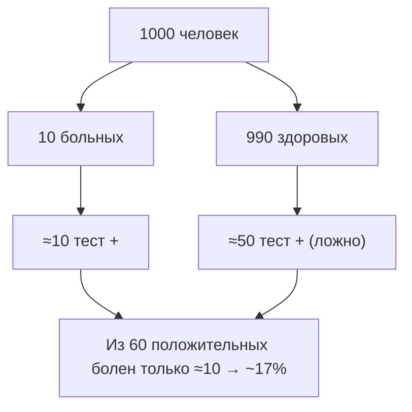

Это сводная страница заданий по всей теме. Задачи закрепляют ключевые идеи разделов: [Вероятность и события](/probability/basics/), [Случайные величины](/probability/random-variables/), [Распределения](/probability/distributions/), [Теорема Байеса](/probability/bayes/) и [Матожидание и дисперсия](/probability/expectation/). К каждому заданию есть решение в раскрывающемся блоке.

:::tip[Как заниматься]
Сначала честно решите сами — на бумаге или в коде — и только потом разворачивайте решение. Если застряли, вернитесь к нужному разделу темы по ссылке: смысл не в том, чтобы «угадать ответ», а в том, чтобы восстановить ход рассуждения. Численные задачи проверяйте симуляцией на Python: это лучшая интуиция для вероятности.
:::

Обозначения по всей странице: $P(A)$ — вероятность события, $\mathbb{E}[X]$ — математическое ожидание, $\operatorname{Var}(X)$ — дисперсия, $\sigma$ — стандартное отклонение.

## Базовые задания

Здесь — определения вероятности, комбинаторика, простые случайные величины и базовые характеристики. Достаточно материала разделов [basics](/probability/basics/) и [expectation](/probability/expectation/).

### Задание 1. Две кости

Бросают две честные шестигранные кости. Найдите вероятности событий:

1. сумма очков равна $7$;
2. сумма очков не меньше $10$;
3. хотя бы на одной кости выпала шестёрка.

<details>
<summary>Решение</summary>

Всего исходов $6 \times 6 = 36$, все равновероятны.

1. Сумма $7$: пары $(1,6),(2,5),(3,4),(4,3),(5,2),(6,1)$ — это $6$ исходов.
$$P = \frac{6}{36} = \frac{1}{6} \approx 0{,}167$$

2. Сумма $\ge 10$: сумма $10$ — $3$ исхода, сумма $11$ — $2$, сумма $12$ — $1$. Итого $6$.
$$P = \frac{6}{36} = \frac{1}{6}$$

3. Удобнее через дополнение: «ни одной шестёрки» — $5 \times 5 = 25$ исходов.
$$P(\text{хотя бы одна } 6) = 1 - \frac{25}{36} = \frac{11}{36} \approx 0{,}306$$

</details>

### Задание 2. Формула включения-исключения

Среди студентов группы $60\%$ знают Python, $40\%$ знают SQL, а $25\%$ знают оба языка. Какова вероятность, что случайный студент знает хотя бы один из этих языков? А что не знает ни одного?

<details>
<summary>Решение</summary>

По формуле сложения (включения-исключения):
$$P(A \cup B) = P(A) + P(B) - P(A \cap B) = 0{,}6 + 0{,}4 - 0{,}25 = 0{,}75$$

«Ни одного» — дополнение к «хотя бы один»:
$$P(\overline{A \cup B}) = 1 - 0{,}75 = 0{,}25$$

Заметьте: события «знает Python» и «знает SQL» здесь **не независимы**: при независимости было бы $P(A \cap B) = 0{,}6 \cdot 0{,}4 = 0{,}24 \ne 0{,}25$.

</details>

### Задание 3. Комбинаторика и выбор

Из колоды в $52$ карты наугад берут $5$ карт (покерная рука). Найдите вероятность, что среди этих $5$ карт окажутся все четыре туза.

<details>
<summary>Решение</summary>

Всего способов выбрать $5$ карт из $52$:
$$\binom{52}{5} = 2{\,}598{\,}960$$

Благоприятные исходы: все $4$ туза обязаны войти в руку, пятая карта — любая из оставшихся $48$. Способов:
$$\binom{4}{4}\binom{48}{1} = 1 \cdot 48 = 48$$

Итого:
$$P = \frac{48}{2{\,}598{\,}960} \approx 1{,}85 \cdot 10^{-5}$$

</details>

### Задание 4. Матожидание и дисперсия дискретной величины

Случайная величина $X$ задана таблицей:

| $x_i$ | $-1$ | $0$ | $2$ | $3$ |
|-------|------|-----|-----|-----|
| $p_i$ | $0{,}2$ | $0{,}3$ | $0{,}4$ | $0{,}1$ |

Найдите $\mathbb{E}[X]$ и $\operatorname{Var}(X)$.

<details>
<summary>Решение</summary>

Проверка нормировки: $0{,}2 + 0{,}3 + 0{,}4 + 0{,}1 = 1$. Хорошо.

Матожидание:
$$\mathbb{E}[X] = \sum_i x_i p_i = (-1)(0{,}2) + 0 \cdot 0{,}3 + 2 \cdot 0{,}4 + 3 \cdot 0{,}1 = -0{,}2 + 0{,}8 + 0{,}3 = 0{,}9$$

Найдём $\mathbb{E}[X^2]$:
$$\mathbb{E}[X^2] = 1 \cdot 0{,}2 + 0 \cdot 0{,}3 + 4 \cdot 0{,}4 + 9 \cdot 0{,}1 = 0{,}2 + 1{,}6 + 0{,}9 = 2{,}7$$

Дисперсия по формуле $\operatorname{Var}(X) = \mathbb{E}[X^2] - (\mathbb{E}[X])^2$:
$$\operatorname{Var}(X) = 2{,}7 - 0{,}9^2 = 2{,}7 - 0{,}81 = 1{,}89$$

Стандартное отклонение: $\sigma = \sqrt{1{,}89} \approx 1{,}37$.

</details>

## Средние задания

Здесь — условная вероятность, теорема Байеса, работа с распределениями и линейность матожидания. Опираются на [bayes](/probability/bayes/), [distributions](/probability/distributions/) и [random-variables](/probability/random-variables/).

### Задание 5. Тест на болезнь (теорема Байеса)

Болезнь встречается у $1\%$ людей. Тест даёт положительный результат у $99\%$ больных (чувствительность) и ошибочно срабатывает у $5\%$ здоровых (ложноположительные). У человека тест положительный. Какова вероятность, что он действительно болен?

<details>
<summary>Решение</summary>

Обозначим: $B$ — болен, $+$ — тест положительный. Дано:
$$P(B) = 0{,}01,\quad P(+\mid B) = 0{,}99,\quad P(+\mid \overline{B}) = 0{,}05$$

Полная вероятность положительного теста:
$$P(+) = P(+\mid B)P(B) + P(+\mid \overline{B})P(\overline{B}) = 0{,}99 \cdot 0{,}01 + 0{,}05 \cdot 0{,}99 = 0{,}0099 + 0{,}0495 = 0{,}0594$$

По формуле Байеса:
$$P(B \mid +) = \frac{P(+\mid B)P(B)}{P(+)} = \frac{0{,}0099}{0{,}0594} \approx 0{,}167$$

Около $17\%$ — контринтуитивно мало. Причина: редкость болезни (низкий приор) перевешивает высокую точность теста, а ложноположительных среди здоровых много в абсолютных числах.



</details>

### Задание 6. Две фабрики (формула полной вероятности)

Завод получает детали с трёх линий: линия A даёт $50\%$ продукции с браком $2\%$, линия B — $30\%$ с браком $3\%$, линия C — $20\%$ с браком $5\%$. Деталь оказалась бракованной. С какой вероятности она с линии C?

<details>
<summary>Решение</summary>

Полная вероятность брака:
$$P(D) = 0{,}5 \cdot 0{,}02 + 0{,}3 \cdot 0{,}03 + 0{,}2 \cdot 0{,}05 = 0{,}01 + 0{,}009 + 0{,}01 = 0{,}029$$

Апостериорная вероятность линии C:
$$P(C \mid D) = \frac{P(D \mid C)P(C)}{P(D)} = \frac{0{,}2 \cdot 0{,}05}{0{,}029} = \frac{0{,}01}{0{,}029} \approx 0{,}345$$

Хотя линия C даёт лишь $20\%$ продукции, среди брака её доля выше — около $34{,}5\%$ — из-за самого высокого процента дефектов.

</details>

### Задание 7. Биномиальное распределение

Модель классификации верно отвечает с вероятностью $p = 0{,}8$. Ей дают $10$ независимых примеров. Пусть $X$ — число верных ответов.

1. Какому распределению подчиняется $X$?
2. Найдите $\mathbb{E}[X]$ и $\operatorname{Var}(X)$.
3. Найдите $P(X = 8)$.

<details>
<summary>Решение</summary>

1. Число успехов в $n$ независимых испытаниях Бернулли — это биномиальное распределение $X \sim \text{Bin}(n=10,\ p=0{,}8)$.

2. Для биномиального:
$$\mathbb{E}[X] = np = 10 \cdot 0{,}8 = 8,\qquad \operatorname{Var}(X) = np(1-p) = 10 \cdot 0{,}8 \cdot 0{,}2 = 1{,}6$$

3. Вероятность ровно $k$ успехов:
$$P(X = k) = \binom{n}{k} p^k (1-p)^{n-k}$$
$$P(X = 8) = \binom{10}{8} \, 0{,}8^8 \, 0{,}2^2 = 45 \cdot 0{,}16777 \cdot 0{,}04 \approx 0{,}302$$

Проверка на Python:

```python
from scipy.stats import binom

X = binom(n=10, p=0.8)
print(X.mean(), X.var())   # 8.0 1.6
print(X.pmf(8))            # 0.30198...
```

</details>

### Задание 8. Нормальное распределение и правило трёх сигм

Время отклика сервиса распределено нормально: $T \sim \mathcal{N}(\mu = 200,\ \sigma = 20)$ мс. Оцените долю запросов с откликом:

1. от $180$ до $220$ мс;
2. дольше $240$ мс.

<details>
<summary>Решение</summary>

Стандартизуем: $Z = \dfrac{T - \mu}{\sigma}$.

1. Границы $180$ и $220$ — это $\mu \pm \sigma$, то есть $Z \in [-1, 1]$. По правилу «трёх сигм» сюда попадает около $68\%$ значений.

2. $240$ мс — это $\mu + 2\sigma$, то есть $Z = 2$. Вне интервала $[-2, 2]$ лежит около $4{,}6\%$, и по симметрии справа — половина:
$$P(T > 240) = P(Z > 2) \approx 0{,}0228 \approx 2{,}3\%$$

Точная проверка:

```python
from scipy.stats import norm

T = norm(loc=200, scale=20)
print(T.cdf(220) - T.cdf(180))  # 0.6827
print(1 - T.cdf(240))           # 0.02275
```

</details>

## Продвинутые задания

Здесь — линейность и независимость, моделирование, закон больших чисел и ЦПТ, связь вероятности с ML. Полезны идеи из всех разделов, особенно [expectation](/probability/expectation/).

### Задание 9. Линейность матожидания (задача о совпадениях)

$n$ человек сдали шляпы в гардероб, шляпы вернули в случайном порядке. Пусть $X$ — число людей, получивших свою собственную шляпу. Найдите $\mathbb{E}[X]$.

<details>
<summary>Решение</summary>

Прямой подсчёт распределения $X$ труден. Но матожидание берётся легко через **индикаторы** и линейность.

Введём $X_i = 1$, если $i$-й человек получил свою шляпу, иначе $0$. Тогда $X = \sum_{i=1}^n X_i$.

Каждый человек равновероятно получает любую из $n$ шляп, поэтому
$$\mathbb{E}[X_i] = P(X_i = 1) = \frac{1}{n}$$

Линейность матожидания работает **даже для зависимых** $X_i$:
$$\mathbb{E}[X] = \sum_{i=1}^n \mathbb{E}[X_i] = n \cdot \frac{1}{n} = 1$$

Удивительно: в среднем ровно один человек получает свою шляпу — независимо от $n$.

</details>

### Задание 10. Закон больших чисел и оценка $\pi$ методом Монте-Карло

Объясните, почему частота попадания случайных точек в четверть круга сходится к $\pi/4$, и реализуйте оценку $\pi$ на Python.

<details>
<summary>Решение</summary>

Бросаем точки равномерно в квадрат $[0,1]^2$. Точка попадает в четверть круга радиуса $1$, если $x^2 + y^2 \le 1$. Площадь четверти круга $= \pi/4$, площадь квадрата $= 1$, поэтому вероятность попадания:
$$P(\text{внутри}) = \frac{\pi/4}{1} = \frac{\pi}{4}$$

По закону больших чисел доля попавших точек $\hat{p}$ сходится к этой вероятности при росте числа бросков, значит $\hat{\pi} = 4\hat{p} \to \pi$.

```python
import numpy as np

rng = np.random.default_rng(0)
n = 1_000_000
x, y = rng.random(n), rng.random(n)
inside = (x**2 + y**2) <= 1.0
pi_est = 4 * inside.mean()
print(pi_est)  # ≈ 3.1416
```

Точность растёт как $1/\sqrt{n}$: чтобы добавить один верный знак, число точек надо увеличить примерно в $100$ раз.

</details>

### Задание 11. Центральная предельная теорема в действии

Возьмём заведомо «не-нормальную» величину — равномерную на $[0,1]$. Покажите кодом, что среднее $k$ таких независимых величин при росте $k$ становится приближённо нормальным, и сопоставьте с теорией.

<details>
<summary>Решение</summary>

Для $U \sim \text{Uniform}(0,1)$ имеем $\mathbb{E}[U] = 1/2$ и $\operatorname{Var}(U) = 1/12$. По ЦПТ среднее $\bar{U}_k$ из $k$ независимых величин при больших $k$ приближённо нормально:
$$\bar{U}_k \approx \mathcal{N}\!\left(\frac{1}{2},\ \frac{1}{12k}\right)$$

```python
import numpy as np

rng = np.random.default_rng(0)
k = 30          # сколько усредняем
trials = 100_000
means = rng.random((trials, k)).mean(axis=1)

print(means.mean(), means.var())      # ≈ 0.5 и ≈ 1/(12*30) ≈ 0.00278
# гистограмма means визуально похожа на колокол
```

Дисперсия выборочного среднего падает как $\operatorname{Var}(U)/k$, а форма распределения стремится к колоколу — даже если исходная величина была равномерной (плоской). Именно ЦПТ объясняет, почему нормальное распределение возникает повсюду в статистике и в [статистике для ML](/statistics/).

</details>

### Задание 12. Ковариация, корреляция и независимость

Случайный вектор $(X, Y)$ задан так: $X$ принимает значения $-1, 0, 1$ равновероятно, а $Y = X^2$.

1. Найдите $\operatorname{Cov}(X, Y)$.
2. Зависимы ли $X$ и $Y$?
3. Что это говорит о связи «корреляция $= 0$» и независимости?

<details>
<summary>Решение</summary>

Распределение $X$: каждое из $-1, 0, 1$ с вероятностью $1/3$. Тогда $Y = X^2$ принимает значения $1, 0, 1$.

Матожидания:
$$\mathbb{E}[X] = \frac{-1 + 0 + 1}{3} = 0,\qquad \mathbb{E}[Y] = \frac{1 + 0 + 1}{3} = \frac{2}{3}$$

Для ковариации нужно $\mathbb{E}[XY]$. Но $XY = X \cdot X^2 = X^3$, и значения $X^3$ — это снова $-1, 0, 1$:
$$\mathbb{E}[XY] = \mathbb{E}[X^3] = \frac{-1 + 0 + 1}{3} = 0$$

1. Ковариация:
$$\operatorname{Cov}(X, Y) = \mathbb{E}[XY] - \mathbb{E}[X]\,\mathbb{E}[Y] = 0 - 0 \cdot \tfrac{2}{3} = 0$$
Значит и корреляция $\rho = 0$.

2. При этом $X$ и $Y$ **зависимы**: зная $X$, мы точно знаем $Y = X^2$. Формально, $P(Y=0 \mid X=0) = 1 \ne P(Y=0) = 1/3$.

3. Вывод: нулевая корреляция означает лишь отсутствие **линейной** связи. Из независимости следует $\operatorname{Cov} = 0$, но обратное неверно. Корреляция «не видит» нелинейные зависимости — важная оговорка при анализе признаков в [машинном обучении](/machine-learning/).

:::caution[Частая ошибка]
«Корреляция нулевая, значит признаки независимы» — неверно. Проверяйте характер связи (графики, нелинейные метрики), а не только коэффициент корреляции Пирсона.
:::

</details>

## Что дальше

Если задачи даются легко — переходите к [статистике](/statistics/) (оценивание, доверительные интервалы, проверка гипотез), где вероятностные модели встречаются с реальными данными. Для практики численных экспериментов пригодится раздел [Python для данных](/python-data/): `numpy`, `scipy.stats` и визуализация распределений превращают теорию в осязаемые эксперименты.
