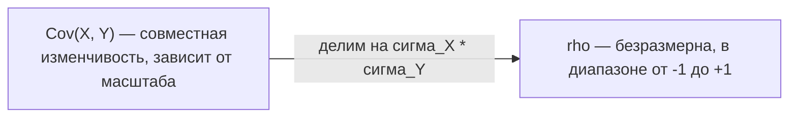
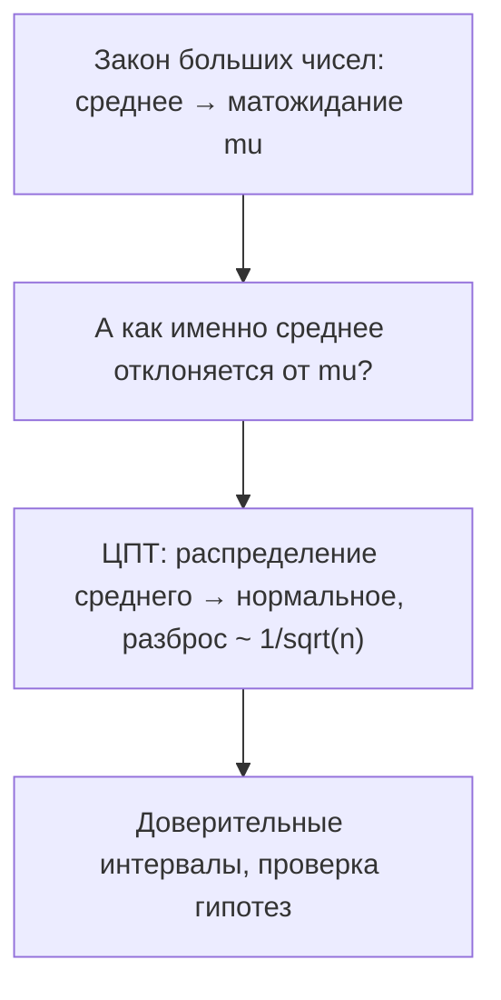

Распределение случайной величины — это полная картина, но работать с ней целиком неудобно. Часто достаточно нескольких чисел, которые сжимают распределение до главного: где находится «центр», насколько сильно значения разбросаны вокруг него и как две величины связаны между собой. Эти числа — математическое ожидание, дисперсия и ковариация — фундамент почти всего, что встретится в ML: от функций потерь до метрик и оценки моделей.

Предполагается, что вы уже знакомы с понятием [случайной величины и распределения](/probability/random-variables/). Здесь мы строим над ними числовые характеристики.

## Математическое ожидание

Математическое ожидание (mat/expected value) — это «среднее по распределению», центр тяжести случайной величины. Если бы мы повторили эксперимент бесконечно много раз и усреднили результаты, мы бы получили именно матожидание.

Для **дискретной** случайной величины $X$ со значениями $x_i$ и вероятностями $p_i = P(X = x_i)$:

$$
\mathbb{E}[X] = \sum_i x_i \, p_i
$$

Для **непрерывной** величины с плотностью $f(x)$ сумма превращается в интеграл:

$$
\mathbb{E}[X] = \int_{-\infty}^{+\infty} x \, f(x)\, dx
$$

Интуиция «центра тяжести» точная: если поставить на числовую ось грузики массой $p_i$ в точках $x_i$, то $\mathbb{E}[X]$ — точка, в которой эта система уравновесится.

:::note[Среднее по выборке против матожидания]
Не путайте $\mathbb{E}[X]$ (свойство распределения, одно конкретное число) с выборочным средним $\bar{x} = \frac{1}{n}\sum_{i=1}^n x_i$ (оценка по данным, случайная величина). Первое — теоретическая константа, второе — то, что мы реально считаем по данным и чем приближаем первое.
:::

### Свойство: матожидание функции

Чтобы найти $\mathbb{E}[g(X)]$, не нужно искать распределение $g(X)$ — достаточно усреднить $g(x_i)$ с теми же вероятностями (правило LOTUS, *law of the unconscious statistician*):

$$
\mathbb{E}[g(X)] = \sum_i g(x_i)\, p_i
$$

Например, для броска честной кости ($x_i = 1,\dots,6$, $p_i = 1/6$):

$$
\mathbb{E}[X] = \frac{1+2+3+4+5+6}{6} = 3.5
$$

### Линейность математического ожидания

Это одно из самых полезных свойств во всей теории вероятностей. Для любых констант $a, b$ и любых случайных величин $X, Y$:

$$
\mathbb{E}[aX + b] = a\,\mathbb{E}[X] + b
$$

$$
\mathbb{E}[X + Y] = \mathbb{E}[X] + \mathbb{E}[Y]
$$

:::tip[Линейность работает всегда]
Второе равенство верно **даже если $X$ и $Y$ зависимы**. Никакой независимости не требуется — это часто экономит массу вычислений. Например, ожидаемое число «успехов» в сумме событий считается как сумма вероятностей этих событий, как бы они ни были связаны.
:::

## Дисперсия и стандартное отклонение

Матожидание говорит, где центр, но ничего не говорит о разбросе. Две величины могут иметь одинаковое $\mathbb{E}[X] = 0$: одна почти всегда около нуля, другая прыгает между $-100$ и $+100$. Разброс измеряет **дисперсия** (variance) — средний квадрат отклонения от среднего.

Обозначим $\mu = \mathbb{E}[X]$. Тогда:

$$
\mathrm{Var}(X) = \mathbb{E}\big[(X - \mu)^2\big]
$$

На практике удобнее эквивалентная формула, которую легко вывести, раскрыв скобки и применив линейность:

$$
\mathrm{Var}(X) = \mathbb{E}[X^2] - \big(\mathbb{E}[X]\big)^2
$$

Дисперсия измеряется в квадрате единиц $X$ (если $X$ в метрах, то $\mathrm{Var}(X)$ в метрах в квадрате), поэтому для интерпретации берут квадратный корень — **стандартное отклонение** (standard deviation):

$$
\sigma_X = \sqrt{\mathrm{Var}(X)}
$$

Оно уже в тех же единицах, что и $X$, и отвечает на вопрос «насколько типичное значение отклоняется от среднего».

### Свойства дисперсии

$$
\mathrm{Var}(aX + b) = a^2\,\mathrm{Var}(X)
$$

Обратите внимание на два момента: сдвиг $b$ не влияет на разброс (логично — сдвиг всего распределения целиком), а множитель $a$ входит в квадрате. Для суммы:

$$
\mathrm{Var}(X + Y) = \mathrm{Var}(X) + \mathrm{Var}(Y) + 2\,\mathrm{Cov}(X, Y)
$$

И только если $X$ и $Y$ **независимы** (точнее — некоррелированы), последнее слагаемое обнуляется:

$$
\mathrm{Var}(X + Y) = \mathrm{Var}(X) + \mathrm{Var}(Y)
$$

:::caution
В отличие от математического ожидания, дисперсия суммы **не** равна сумме дисперсий в общем случае. Связь между переменными добавляет (или вычитает) член с ковариацией. Игнорировать его — частая ошибка.
:::

## Ковариация и корреляция

Ковариация измеряет, как две величины меняются **совместно**: растут ли они вместе, или когда одна растёт, другая падает.

$$
\mathrm{Cov}(X, Y) = \mathbb{E}\big[(X - \mu_X)(Y - \mu_Y)\big] = \mathbb{E}[XY] - \mathbb{E}[X]\,\mathbb{E}[Y]
$$

Знак ковариации содержит главное:

- $\mathrm{Cov}(X, Y) > 0$ — величины «движутся в одну сторону»: когда $X$ выше своего среднего, $Y$ тоже склонна быть выше.
- $\mathrm{Cov}(X, Y) < 0$ — движутся в противоположные стороны.
- $\mathrm{Cov}(X, Y) = 0$ — линейной совместной тенденции нет (величины некоррелированы).

Заметьте, что $\mathrm{Cov}(X, X) = \mathrm{Var}(X)$ — дисперсия это частный случай ковариации.

### Проблема ковариации: масштаб

У ковариации есть неудобство: её величина зависит от единиц измерения. Ковариация роста и веса будет разной в сантиметрах-килограммах и в метрах-граммах, хотя связь та же. Поэтому ковариацию нормируют — делят на произведение стандартных отклонений. Получается **коэффициент корреляции Пирсона**:

$$
\rho_{XY} = \frac{\mathrm{Cov}(X, Y)}{\sigma_X \, \sigma_Y}
$$

Корреляция безразмерна и всегда лежит в диапазоне:

$$
-1 \le \rho_{XY} \le 1
$$

- $\rho = +1$ — идеальная линейная зависимость с положительным наклоном (точки лежат на прямой, идущей вверх).
- $\rho = -1$ — идеальная линейная зависимость с отрицательным наклоном.
- $\rho = 0$ — линейной связи нет.

:::caution[Корреляция ловит только линейную связь]
$\rho = 0$ означает отсутствие *линейной* зависимости, но не отсутствие зависимости вообще. Классический пример: $X$ равномерна на $[-1, 1]$ и $Y = X^2$. Они жёстко связаны (зная $X$, мы точно знаем $Y$), но $\mathrm{Cov}(X, Y) = 0$. Также помните: корреляция — не причинность.
:::

```python
import numpy as np

rng = np.random.default_rng(0)
x = rng.normal(size=10_000)
y = 2.0 * x + rng.normal(scale=0.5, size=10_000)  # y зависит от x линейно

# Матрица ковариаций и корреляций (2x2): на диагонали - дисперсии / единицы
cov = np.cov(x, y)
corr = np.corrcoef(x, y)

print("Var(x) =", cov[0, 0].round(3))
print("Cov(x, y) =", cov[0, 1].round(3))
print("rho(x, y) =", corr[0, 1].round(3))  # близко к +0.97
```



## Закон больших чисел

Мы сказали, что выборочное среднее $\bar{x}_n$ приближает $\mathbb{E}[X]$. Закон больших чисел (ЗБЧ, *law of large numbers*) делает это утверждение строгим: при росте числа независимых наблюдений выборочное среднее сходится к математическому ожиданию.

Если $X_1, X_2, \dots$ — независимые одинаково распределённые величины с $\mathbb{E}[X_i] = \mu$, то:

$$
\bar{X}_n = \frac{1}{n}\sum_{i=1}^{n} X_i \;\xrightarrow[n \to \infty]{}\; \mu
$$

Именно ЗБЧ оправдывает оценку вероятностей частотами и оценку метрик усреднением по тестовой выборке: чем больше данных, тем ближе оценка к истине.

```python
import numpy as np

rng = np.random.default_rng(42)
rolls = rng.integers(1, 7, size=100_000)        # броски кости
running_mean = np.cumsum(rolls) / np.arange(1, len(rolls) + 1)

for n in (10, 100, 1_000, 100_000):
    print(f"n={n:>6}: среднее = {running_mean[n-1]:.4f}")  # сходится к 3.5
```

```text
n=    10: среднее = 3.1000
n=   100: среднее = 3.5700
n=  1000: среднее = 3.5060
n=100000: среднее = 3.4982
```

## Анонс центральной предельной теоремы

ЗБЧ говорит, **куда** сходится среднее. Центральная предельная теорема (ЦПТ) отвечает на более тонкий вопрос: **как** оно колеблется вокруг $\mu$ при конечном $n$. Оказывается, для большого $n$ распределение нормированного среднего стремится к нормальному (гауссовскому) — почти независимо от того, как было распределено само $X$:

$$
\frac{\bar{X}_n - \mu}{\sigma / \sqrt{n}} \;\xrightarrow[n \to \infty]{}\; \mathcal{N}(0, 1)
$$

Из этого следует, что разброс выборочного среднего убывает как $1/\sqrt{n}$: чтобы уменьшить погрешность оценки вдвое, нужно вчетверо больше данных. Именно ЦПТ объясняет вездесущность нормального распределения и лежит в основе доверительных интервалов и проверки гипотез.

:::note
Подробный разбор ЦПТ и её практическое применение для построения интервальных оценок — в разделе [доверительные интервалы](/statistics/confidence-intervals/) в курсе статистики.
:::



## Где это в машинном обучении

- **Функции потерь.** MSE — это в точности оценка $\mathbb{E}[(y - \hat{y})^2]$, а её разложение на bias и variance опирается на свойства дисперсии.
- **Bias–variance tradeoff.** Ошибку модели раскладывают на смещение (систематическая ошибка матожидания предсказания) и дисперсию (чувствительность к выборке).
- **Нормализация признаков.** Стандартизация $z = (x - \mu)/\sigma$ использует среднее и стандартное отклонение напрямую.
- **Отбор и декорреляция признаков.** Матрица ковариаций — сердце PCA (см. [линейную алгебру](/linear-algebra/)), а высокая корреляция признаков сигналит о мультиколлинеарности.
- **Оценка качества.** Усреднение метрики по фолдам кросс-валидации работает благодаря ЗБЧ, а доверительные интервалы вокруг неё — благодаря ЦПТ.

Связанные темы: [случайные величины и распределения](/probability/random-variables/), [математическая статистика](/statistics/), [работа с данными в Python](/python-data/), [машинное обучение](/machine-learning/).

## Задания

### Задание 1. Дисперсия броска кости

Для честной шестигранной кости известно, что $\mathbb{E}[X] = 3.5$. Вычислите $\mathrm{Var}(X)$ и стандартное отклонение $\sigma_X$.

<details>
<summary>Решение</summary>

Сначала найдём $\mathbb{E}[X^2]$ по правилу LOTUS:

$$
\mathbb{E}[X^2] = \frac{1^2 + 2^2 + 3^2 + 4^2 + 5^2 + 6^2}{6} = \frac{91}{6} \approx 15.167
$$

Теперь по формуле $\mathrm{Var}(X) = \mathbb{E}[X^2] - (\mathbb{E}[X])^2$:

$$
\mathrm{Var}(X) = \frac{91}{6} - 3.5^2 = \frac{91}{6} - \frac{49}{4} = \frac{182 - 147}{12} = \frac{35}{12} \approx 2.917
$$

Стандартное отклонение:

$$
\sigma_X = \sqrt{35/12} \approx 1.708
$$

</details>

### Задание 2. Дисперсия суммы зависимых величин

Пусть $\mathrm{Var}(X) = 4$, $\mathrm{Var}(Y) = 9$ и корреляция $\rho_{XY} = 0.5$. Найдите $\mathrm{Var}(X + Y)$. Сравните с тем, что было бы при независимости.

<details>
<summary>Решение</summary>

Сначала восстановим ковариацию из корреляции:

$$
\mathrm{Cov}(X, Y) = \rho_{XY}\,\sigma_X\,\sigma_Y = 0.5 \cdot \sqrt{4} \cdot \sqrt{9} = 0.5 \cdot 2 \cdot 3 = 3
$$

Тогда:

$$
\mathrm{Var}(X + Y) = \mathrm{Var}(X) + \mathrm{Var}(Y) + 2\,\mathrm{Cov}(X, Y) = 4 + 9 + 2\cdot 3 = 19
$$

При независимости ($\mathrm{Cov} = 0$) было бы $4 + 9 = 13$. Положительная корреляция увеличивает разброс суммы: величины «усиливают» друг друга.

</details>

### Задание 3. Линейность не требует независимости

В коробке 5 карточек с числами $\{1, 2, 3, 4, 5\}$. Мы вытягиваем две карточки **без возвращения**. Пусть $X$ — первое число, $Y$ — второе. Чему равно $\mathbb{E}[X + Y]$? Можно ли здесь использовать линейность, ведь $X$ и $Y$ зависимы?

<details>
<summary>Решение</summary>

Линейность математического ожидания не требует независимости, поэтому ей можно пользоваться смело.

По симметрии каждая карточка с равной вероятностью оказывается на первой и на второй позиции, поэтому

$$
\mathbb{E}[X] = \mathbb{E}[Y] = \frac{1+2+3+4+5}{5} = 3
$$

Тогда

$$
\mathbb{E}[X + Y] = \mathbb{E}[X] + \mathbb{E}[Y] = 3 + 3 = 6
$$

Зависимость влияет на дисперсию и ковариацию суммы, но на матожидание суммы — нет.

</details>

### Задание 4. Проверка ЗБЧ кодом

Напишите короткий скрипт, который генерирует $n$ значений из экспоненциального распределения с параметром $\lambda = 1$ (у него $\mathbb{E}[X] = 1$) и показывает, как выборочное среднее приближается к $1$ при росте $n$.

<details>
<summary>Решение</summary>

```python
import numpy as np

rng = np.random.default_rng(7)
sample = rng.exponential(scale=1.0, size=1_000_000)  # E[X] = 1
running_mean = np.cumsum(sample) / np.arange(1, len(sample) + 1)

for n in (100, 10_000, 1_000_000):
    print(f"n={n:>9}: среднее = {running_mean[n-1]:.4f}")
```

Пример вывода (значения сходятся к 1):

```text
n=      100: среднее = 0.9043
n=    10000: среднее = 1.0067
n=  1000000: среднее = 0.9998
```

Чем больше $n$, тем точнее выборочное среднее оценивает $\mathbb{E}[X] = 1$ — это и есть закон больших чисел в действии.

</details>
