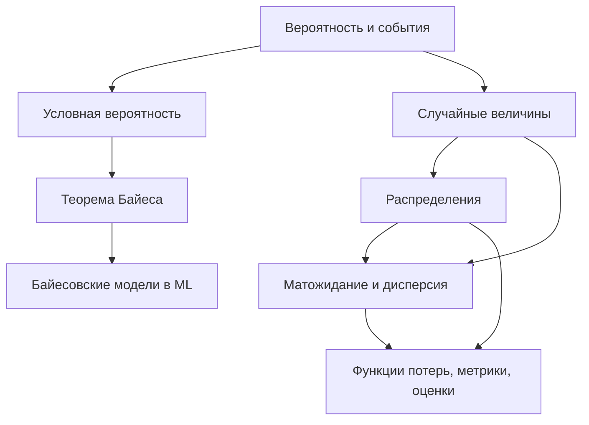

Машинное обучение по своей сути — это работа с неопределённостью. Данные зашумлены, выборка ограничена, будущие наблюдения заранее неизвестны. Теория вероятностей даёт язык, на котором эту неопределённость можно описывать строго: вместо «модель, кажется, чаще ошибается на тёмных снимках» мы говорим «условная вероятность ошибки при низкой яркости равна $0{,}18$». Этот раздел — фундамент, на котором стоят почти все методы ML: от наивного байесовского классификатора до функций потерь в нейросетях.

## Зачем это нужно для ML

Почти каждая модель машинного обучения так или иначе оценивает вероятности или опирается на вероятностные предположения.

- **Классификация** возвращает не просто метку, а распределение $P(y \mid x)$ — насколько модель уверена в каждом классе.
- **Функции потерь** выводятся из вероятностей. Кросс-энтропия — это прямое следствие принципа максимального правдоподобия, а MSE для регрессии вытекает из предположения о гауссовском шуме.
- **Регуляризация** ($L_2$, $L_1$) интерпретируется как априорное распределение на веса в байесовском подходе.
- **Генеративные модели** (VAE, диффузионные модели, языковые модели) буквально учат распределение данных $P(x)$ и сэмплируют из него.
- **Оценка качества** — доверительные интервалы метрик, A/B-тесты, калибровка вероятностей — всё это про вероятность и статистику.

:::note
Граница между теорией вероятностей и [статистикой](/statistics/) условна. Грубо: вероятность идёт «от модели к данным» (знаем распределение — предсказываем наблюдения), а статистика — «от данных к модели» (видим наблюдения — восстанавливаем распределение). В ML мы постоянно ходим в обе стороны.
:::

## Ключевые идеи темы

Несколько идей проходят красной нитью через весь раздел.

### Вероятность как мера

Вероятность $P(A)$ — это число от $0$ до $1$, измеряющее, насколько правдоподобно событие $A$. Базовые правила:

$$
P(A \cup B) = P(A) + P(B) - P(A \cap B), \qquad P(\bar{A}) = 1 - P(A).
$$

Из определения условной вероятности

$$
P(A \mid B) = \frac{P(A \cap B)}{P(B)}
$$

вырастает почти всё остальное — независимость событий, формула полной вероятности и теорема Байеса.

### От событий к случайным величинам

Случайная величина — это способ привязать к случайным исходам числа. Её поведение полностью описывается распределением: функцией вероятностей $p(x)$ для дискретного случая или плотностью $f(x)$ для непрерывного. Сводные характеристики — матожидание $\mathbb{E}[X]$ (центр) и дисперсия $\mathrm{Var}(X)$ (разброс):

$$
\mathbb{E}[X] = \sum_x x\,p(x), \qquad \mathrm{Var}(X) = \mathbb{E}\big[(X - \mathbb{E}[X])^2\big].
$$

### Обновление веры через данные

Теорема Байеса показывает, как пересматривать оценку вероятности при поступлении новой информации:

$$
P(H \mid D) = \frac{P(D \mid H)\,P(H)}{P(D)}.
$$

Это центральная идея для всего байесовского ML: априорное знание $P(H)$ превращается в апостериорное $P(H \mid D)$ после того, как мы увидели данные $D$.

Логику темы удобно представить как поток понятий.



## Связь с другими темами

Теория вероятностей не существует в вакууме — она опирается на другие разделы курса и питает их.

- [Математический анализ](/calculus/) нужен для непрерывных распределений: плотность, интегралы для вероятностей и матожидания, производные при оптимизации правдоподобия.
- [Линейная алгебра](/linear-algebra/) появляется в многомерных распределениях: вектор средних и ковариационная матрица описывают многомерный гауссиан.
- [Статистика](/statistics/) — прямое продолжение: оценивание параметров, проверка гипотез, доверительные интервалы.
- [Python и данные](/python-data/) дают инструменты, чтобы считать вероятности и сэмплировать из распределений (`numpy.random`, `scipy.stats`).
- [Машинное обучение](/machine-learning/) — место, где всё это применяется: вероятностные модели, функции потерь, калибровка.

## Разделы темы

| Раздел | О чём | Ссылка |
| --- | --- | --- |
| Вероятность и события | Что такое вероятность, пространство исходов, операции над событиями, условная вероятность, независимость, формула полной вероятности | [/probability/basics/](/probability/basics/) |
| Случайные величины | Дискретные и непрерывные величины, функция распределения и плотность, как числа описывают случайность | [/probability/random-variables/](/probability/random-variables/) |
| Распределения | Бернулли, биномиальное, Пуассона, равномерное, нормальное и другие; когда какое использовать | [/probability/distributions/](/probability/distributions/) |
| Теорема Байеса | Априорное и апостериорное, обновление веры данными, наивный байесовский классификатор | [/probability/bayes/](/probability/bayes/) |
| Матожидание и дисперсия | Центр и разброс распределения, свойства, ковариация и корреляция, закон больших чисел | [/probability/expectation/](/probability/expectation/) |
| Задания | Задачи на закрепление: от базовых вероятностей до байесовского вывода | [/probability/exercises/](/probability/exercises/) |

## Как изучать

:::tip[Рекомендуемый порядок]
Идите по разделам сверху вниз: [основы](/probability/basics/) → [случайные величины](/probability/random-variables/) → [распределения](/probability/distributions/) → [Байес](/probability/bayes/) → [матожидание и дисперсия](/probability/expectation/). Каждый следующий раздел опирается на предыдущий.
:::

- **Считайте руками, потом кодом.** Сначала решите задачу на бумаге (бросок монеты, выбор шаров из урны), затем проверьте симуляцией. Закон больших чисел работает наглядно:

```python
import numpy as np

rng = np.random.default_rng(0)
# Оценка вероятности "выпала хотя бы одна шестёрка из двух бросков"
rolls = rng.integers(1, 7, size=(100_000, 2))
estimate = np.mean(np.any(rolls == 6, axis=1))
print(round(estimate, 3))  # ~0.306, теоретически 1 - (5/6)^2 ≈ 0.306
```

- **Опирайтесь на интуицию, а не на зубрёжку формул.** Большинство правил выводится из одного определения условной вероятности — поймите его, и остальное соберётся само.
- **Связывайте с ML сразу.** Встретив распределение или теорему, спросите себя: где это в моделях? Кросс-энтропия — это правдоподобие; регуляризация — это априор; softmax — это распределение над классами.
- **Не торопитесь с непрерывным случаем.** Если интегралы пока даются тяжело, параллельно подтяните [математический анализ](/calculus/) — это снимет половину трудностей.
- **Закрепляйте практикой.** После каждого раздела решайте [задания](/probability/exercises/): без собственноручно решённых задач теория быстро выветривается.

:::note
Не пытайтесь освоить всё сразу до уровня доказательств. Для входа в ML важнее уверенно владеть базовыми операциями, понимать смысл матожидания и дисперсии и не бояться теоремы Байеса. Формальную строгость можно наращивать позже, по мере необходимости.
:::
