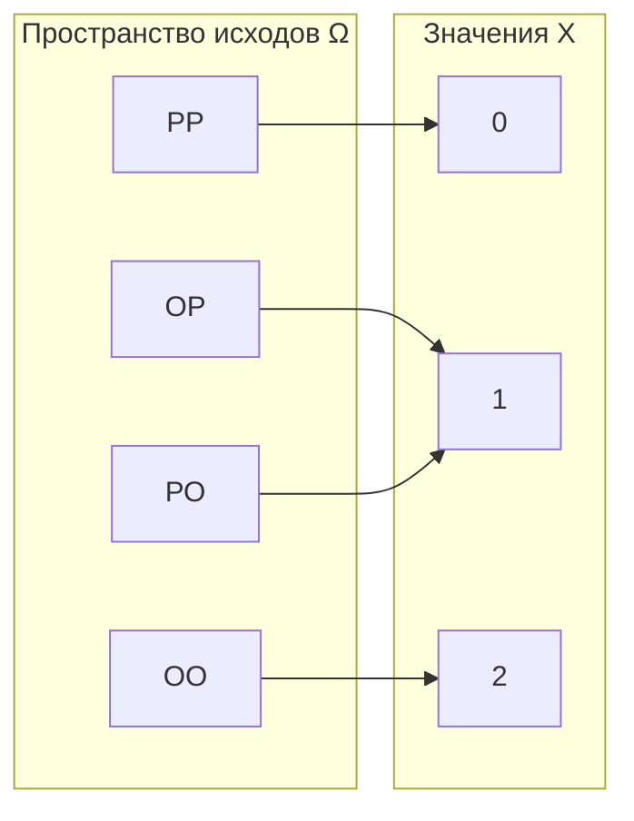
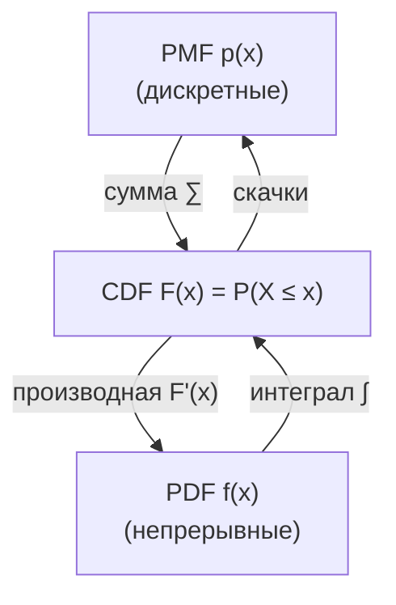

Случайная величина — это способ перевести исходы случайного эксперимента в числа, с которыми уже можно считать: усреднять, складывать, подставлять в модели. Бросок монеты сам по себе — это «орёл» или «решка», но если мы сопоставим орлу 1, а решке 0, то получим число, которым удобно оперировать. Именно так данные в ML почти всегда и устроены: рост клиента, число кликов, оценка вероятности — всё это значения случайных величин.

Эта страница опирается на [основы вероятности](/probability/basics/) и ведёт к [распределениям](/probability/distributions/) и [математическому ожиданию](/probability/expectation/).

## Что такое случайная величина

Формально случайная величина — это функция $X$, которая каждому элементарному исходу $\omega$ из пространства элементарных событий $\Omega$ ставит в соответствие число:

$$
X : \Omega \to \mathbb{R}, \qquad \omega \mapsto X(\omega).
$$

Слово «случайная» немного вводит в заблуждение: сама функция $X$ детерминирована. Случайность приходит из того, *какой* именно исход $\omega$ реализуется. Мы заранее не знаем результат, но знаем правило перевода исходов в числа и знаем вероятности исходов.

:::note[Обозначения]
Случайные величины принято обозначать заглавными буквами ($X$, $Y$, $Z$), а их конкретные реализованные значения — строчными ($x$, $y$). Запись $\{X = x\}$ читается как «событие, состоящее из всех исходов, для которых $X$ принимает значение $x$», и $P(X = x)$ — его вероятность.
:::

Пример. Бросаем две монеты. Пространство исходов $\Omega = \{\text{ОО}, \text{ОР}, \text{РО}, \text{РР}\}$. Пусть $X$ — число выпавших орлов:

$$
X(\text{РР}) = 0, \quad X(\text{ОР}) = X(\text{РО}) = 1, \quad X(\text{ОО}) = 2.
$$

Одно число $X$ «сжимает» четыре исхода в три значения $\{0, 1, 2\}$ — это и есть суть случайной величины как функции.



## Дискретные и непрерывные

Случайные величины делятся на два больших типа по тому, какое множество значений они принимают.

| | Дискретная | Непрерывная |
|---|---|---|
| Множество значений | конечное или счётное ($0,1,2,\dots$) | интервал или вся прямая |
| Описывается через | PMF — функцию вероятности | PDF — плотность |
| $P(X = x)$ | может быть положительной | всегда равна $0$ |
| Суммирование/интегрирование | $\sum$ | $\int$ |
| Примеры | число кликов, исход броска | рост, время ожидания |

**Дискретная** случайная величина принимает значения из «отделённого» множества: целые числа, конечный список категорий. Число орлов из примера выше, количество писем за день, число дефектных деталей в партии.

**Непрерывная** случайная величина может принимать любое значение из интервала. Рост человека, температура, время до отказа устройства. Здесь у любого конкретного значения вероятность ровно нулевая (рост ровно $180{,}000\ldots$ см не встретишь никогда), поэтому говорят о вероятности *попасть в интервал*.

:::tip[Почему P(X = x) = 0 для непрерывных]
Если бы каждое из бесконечного числа значений на интервале имело положительную вероятность, их сумма превысила бы 1. Поэтому осмысленно спрашивать только «какова вероятность, что $X$ попадёт в диапазон от $a$ до $b$», а не «чему равна вероятность точного значения».
:::

## Функция вероятности PMF (для дискретных)

Для дискретной случайной величины основной объект — **функция вероятности** (probability mass function, PMF):

$$
p(x) = P(X = x).
$$

Она задаёт, какая «масса вероятности» сидит в каждом возможном значении. Два требования, которые делают набор чисел корректной PMF:

$$
p(x) \ge 0 \quad \text{для всех } x, \qquad \sum_{x} p(x) = 1.
$$

Для числа орлов при двух честных монетах:

$$
p(0) = \tfrac{1}{4}, \qquad p(1) = \tfrac{1}{2}, \qquad p(2) = \tfrac{1}{4}.
$$

Сумма $= 1$, всё согласовано. Вероятность события «орлов хотя бы один» — это просто сумма по нужным значениям:

$$
P(X \ge 1) = p(1) + p(2) = \tfrac{1}{2} + \tfrac{1}{4} = \tfrac{3}{4}.
$$

```python
import numpy as np

# PMF числа орлов при двух честных монетах
x = np.array([0, 1, 2])
pmf = np.array([0.25, 0.5, 0.25])

assert np.isclose(pmf.sum(), 1.0)          # масса нормирована
print("P(X >= 1) =", pmf[x >= 1].sum())    # -> 0.75
```

## Плотность PDF (для непрерывных)

Для непрерывной случайной величины аналог PMF — **плотность распределения** (probability density function, PDF) $f(x)$. Важно: $f(x)$ — это не вероятность. Вероятность получается *интегрированием* плотности по интервалу:

$$
P(a \le X \le b) = \int_a^b f(x)\, dx.
$$

Геометрически это площадь под графиком плотности на отрезке $[a, b]$. Условия корректной плотности:

$$
f(x) \ge 0, \qquad \int_{-\infty}^{+\infty} f(x)\, dx = 1.
$$

Плотность может быть и больше единицы — ограничение наложено только на полную площадь, а не на высоту. Например, у равномерного распределения на отрезке $[0, 0{,}5]$ плотность равна $f(x) = 2$ внутри отрезка.

Простейший пример — **равномерное распределение** на $[0, 1]$:

$$
f(x) = \begin{cases} 1, & 0 \le x \le 1, \\ 0, & \text{иначе.} \end{cases}
$$

Тогда вероятность попасть в $[0{,}2,\ 0{,}5]$ — это площадь прямоугольника:

$$
P(0{,}2 \le X \le 0{,}5) = \int_{0{,}2}^{0{,}5} 1 \, dx = 0{,}3.
$$

:::caution[PDF не равна P(X = x)]
Запись $f(180)$ для плотности роста ничего не говорит о вероятности роста ровно 180 см (она равна 0). Плотность — это «вероятность на единицу длины»: чем выше $f$ в точке, тем плотнее группируются значения вокруг неё. Размерность $f$ — обратная к размерности $x$.
:::

```python
from scipy import stats

# Равномерное распределение на [0, 1]
U = stats.uniform(loc=0, scale=1)
print(U.pdf(0.7))                       # плотность = 1.0
print(U.cdf(0.5) - U.cdf(0.2))          # P(0.2 <= X <= 0.5) = 0.3
```

## Функция распределения CDF (для всех)

Самый универсальный объект — **функция распределения** (cumulative distribution function, CDF). Она определена одинаково для дискретных и непрерывных величин и накапливает вероятность слева направо:

$$
F(x) = P(X \le x).
$$

Свойства CDF, которые полезно держать в голове:

- $F$ **не убывает**: при движении вправо накопленная вероятность только растёт.
- $\lim_{x \to -\infty} F(x) = 0$ и $\lim_{x \to +\infty} F(x) = 1$.
- $F$ **непрерывна справа**.
- Вероятность попасть в интервал: $P(a < X \le b) = F(b) - F(a)$.

Связь CDF с PMF и PDF:

$$
\underbrace{F(x) = \sum_{t \le x} p(t)}_{\text{дискретный случай}}, \qquad
\underbrace{F(x) = \int_{-\infty}^{x} f(t)\, dt, \quad f(x) = F'(x)}_{\text{непрерывный случай}}.
$$

То есть для непрерывной величины плотность — это производная функции распределения, а CDF — её интеграл. Для дискретной величины CDF выглядит как «лесенка»: она постоянна между значениями и делает скачок высотой $p(x)$ в каждой точке $x$.



Для числа орлов CDF — ступенчатая:

$$
F(x) = \begin{cases}
0, & x < 0, \\
0{,}25, & 0 \le x < 1, \\
0{,}75, & 1 \le x < 2, \\
1, & x \ge 2.
\end{cases}
$$

Высоты скачков — это в точности $p(0)=0{,}25$, $p(1)=0{,}5$, $p(2)=0{,}25$.

## Как это применяется в ML

Случайные величины — базовый язык машинного обучения. Признаки объектов и целевая переменная моделируются как случайные величины с некоторым распределением. Логистическая регрессия предсказывает PMF дискретного класса; регрессия часто предполагает нормальную плотность шума; генеративные модели прямо учат плотность данных. Понимание разницы между PMF, PDF и CDF помогает читать выводы библиотек: например, `scipy.stats` у каждого распределения даёт методы `pmf`/`pdf`, `cdf` и обратный к CDF `ppf` (квантиль).

Конкретные именованные распределения (Бернулли, биномиальное, Пуассона, нормальное) разбираются в разделе [Распределения](/probability/distributions/), а числовые характеристики — в разделе [Математическое ожидание и дисперсия](/probability/expectation/).

## Задания

### Упражнение 1. PMF игральной кости

Бросают честную шестигранную кость, $X$ — выпавшее число очков. Выпишите PMF, проверьте условие нормировки и найдите $P(X \ge 5)$ и $P(2 \le X \le 4)$.

<details>
<summary>Решение</summary>

PMF постоянна, так как кость честная:

$$
p(x) = \tfrac{1}{6}, \quad x \in \{1,2,3,4,5,6\}.
$$

Нормировка: $\sum_{x=1}^{6} \tfrac{1}{6} = 1$ — выполнено.

Вероятности интересующих событий:

$$
P(X \ge 5) = p(5) + p(6) = \tfrac{1}{6} + \tfrac{1}{6} = \tfrac{2}{6} = \tfrac{1}{3},
$$

$$
P(2 \le X \le 4) = p(2) + p(3) + p(4) = \tfrac{3}{6} = \tfrac{1}{2}.
$$

</details>

### Упражнение 2. Нормировка плотности

Случайная величина имеет плотность $f(x) = c\,x$ на отрезке $[0, 2]$ и $f(x) = 0$ вне него. Найдите константу $c$, а затем вычислите $P(X \le 1)$.

<details>
<summary>Решение</summary>

Из условия нормировки полная площадь под плотностью равна 1:

$$
\int_0^2 c\,x \, dx = c \cdot \frac{x^2}{2}\Big|_0^2 = c \cdot \frac{4}{2} = 2c = 1 \;\Rightarrow\; c = \tfrac{1}{2}.
$$

Тогда

$$
P(X \le 1) = \int_0^1 \tfrac{1}{2} x \, dx = \tfrac{1}{2}\cdot\frac{x^2}{2}\Big|_0^1 = \tfrac{1}{2}\cdot\tfrac{1}{2} = \tfrac{1}{4}.
$$

Проверка кодом:

```python
from scipy import integrate
f = lambda x: 0.5 * x
print(integrate.quad(f, 0, 2)[0])   # 1.0 — нормировка
print(integrate.quad(f, 0, 1)[0])   # 0.25
```

</details>

### Упражнение 3. Восстановить плотность из CDF

Дана функция распределения непрерывной величины:

$$
F(x) = \begin{cases} 0, & x < 0,\\ x^2, & 0 \le x \le 1,\\ 1, & x > 1.\end{cases}
$$

Найдите плотность $f(x)$ и вероятность $P(0{,}5 \le X \le 1)$.

<details>
<summary>Решение</summary>

Плотность — производная CDF на интервале $[0,1]$:

$$
f(x) = F'(x) = 2x, \quad 0 \le x \le 1, \qquad f(x) = 0 \text{ иначе.}
$$

(Это корректная плотность: $\int_0^1 2x\,dx = 1$.)

Вероятность через приращение CDF — без интегрирования:

$$
P(0{,}5 \le X \le 1) = F(1) - F(0{,}5) = 1 - 0{,}25 = 0{,}75.
$$

</details>

### Упражнение 4. Дискретная или непрерывная

Для каждой величины определите тип (дискретная или непрерывная) и укажите, чем её естественно описывать — PMF или PDF.

1. Число опечаток на странице книги.
2. Время ожидания автобуса (в минутах).
3. Результат броска двух костей (сумма очков).
4. Уровень заряда батареи в процентах, измеренный точным прибором.

<details>
<summary>Решение</summary>

1. **Дискретная** (значения $0,1,2,\dots$) — PMF. Часто моделируется распределением Пуассона.
2. **Непрерывная** (любое неотрицательное число) — PDF. Типичный кандидат — экспоненциальное распределение.
3. **Дискретная** (целые от 2 до 12) — PMF. Значения не равновероятны: у суммы 7 масса максимальна.
4. **Непрерывная** — PDF. Хотя на экране показывают округлённые проценты, сама физическая величина непрерывна; дискретность тут лишь артефакт округления.

Общий критерий: если значения можно «пересчитать по штукам» — дискретная (PMF); если они заполняют интервал — непрерывная (PDF). А CDF $F(x)=P(X\le x)$ работает в обоих случаях.

</details>
