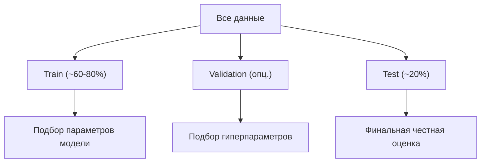

Реальные данные почти никогда не готовы к обучению модели «как есть»: в них есть пропуски, опечатки, признаки в несопоставимых масштабах, текстовые категории и аномалии. Подготовка данных (data preparation, preprocessing) — это набор шагов, которые превращают сырую таблицу в числовую матрицу, понятную алгоритму. От качества этих шагов результат зависит сильнее, чем от выбора самой модели: формула «мусор на входе — мусор на выходе» (garbage in, garbage out) здесь работает буквально.

В этом разделе разберём очистку и пропуски, масштабирование, кодирование категорий, корректное разбиение на выборки и главную ловушку всего пайплайна — утечку данных (data leakage). Конструирование новых признаков из имеющихся вынесено в отдельную тему [Feature engineering](/machine-learning/feature-engineering/), а математический фундамент масштабирования и расстояний — в [Линейную алгебру](/linear-algebra/) и [Статистику](/statistics/).

## Общая картина пайплайна

Подготовка — это конвейер преобразований, который применяется к данным до и во время обучения. Важно с самого начала держать в голове порядок шагов, потому что неправильный порядок (например, масштабирование до разбиения) ломает корректность эксперимента.


:::caution
Ключевая идея, к которой мы вернёмся несколько раз: все статистики (среднее, медиана, минимум, максимум, список категорий) считаются **только на обучающей выборке**, а затем применяются к тестовой. Иначе возникает утечка.
:::

## Очистка данных

Очистка — это приведение данных к консистентному и корректному виду до любых статистических преобразований. Типичные задачи:

- **Корректные типы.** Числа, записанные как строки (`"1 234"`, `"12,5"`), даты как текст, булевы значения как `"Yes"/"No"`.
- **Дубликаты.** Полностью или частично повторяющиеся строки искажают распределение и могут привести к утечке между train и test.
- **Аномалии и невозможные значения.** Возраст `-5`, цена `0`, пульс `400`.
- **Унификация категорий.** `"Москва"`, `"москва"`, `"МСК"` — это одна категория.

```python
import pandas as pd

df = pd.read_csv("data.csv")

# Привести типы
df["price"] = (df["price"].str.replace(" ", "", regex=False)
                          .str.replace(",", ".", regex=False)
                          .astype(float))

# Удалить полные дубликаты
df = df.drop_duplicates()

# Невозможные значения -> пропуски, чтобы обработать их единообразно
df.loc[df["age"] < 0, "age"] = pd.NA
df.loc[df["age"] > 120, "age"] = pd.NA

# Унификация категорий
df["city"] = df["city"].str.strip().str.lower().replace({"мск": "москва"})
```

:::tip
Прежде чем чистить, посмотрите на данные: `df.describe(include="all")`, `df.info()`, `df.isna().mean()`, `df["col"].value_counts(dropna=False)`. Часто это сразу показывает, где спрятались опечатки и пропуски. Подробнее про работу с pandas — в разделе [Python и данные](/python-data/).
:::

## Обработка пропусков

Пропуск (`NaN`, `None`, `NA`) — это отсутствующее значение. Большинство ML-алгоритмов в scikit-learn не умеют работать с пропусками напрямую, поэтому их нужно либо удалить, либо заполнить (импутировать).

### Откуда берутся пропуски

Понимание механизма пропусков влияет на выбор стратегии. Различают три типа:

| Тип | Расшифровка | Суть |
|---|---|---|
| MCAR | Missing Completely At Random | Пропуск не зависит ни от чего (сбой датчика) |
| MAR | Missing At Random | Пропуск зависит от других наблюдаемых признаков |
| MNAR | Missing Not At Random | Пропуск зависит от самого пропущенного значения (богатые скрывают доход) |

Для MCAR/MAR импутация обычно безопасна. При MNAR факт пропуска несёт информацию, и его полезно сохранить как отдельный признак-флаг.

### Удаление

Самый простой подход — выбросить строки или столбцы с пропусками.

```python
df.dropna()                      # удалить строки с любым пропуском
df.dropna(subset=["target"])     # обязательно: строки без целевой переменной
df.dropna(axis=1, thresh=int(0.5 * len(df)))  # удалить столбцы, где >50% пропусков
```

Удаление оправдано, когда пропусков мало (единицы процентов) или когда столбец почти пустой. Но при большом числе пропусков удаление строк выбрасывает много полезных данных и может сместить выборку.

### Импутация

Импутация — заполнение пропусков оценкой. Базовые стратегии в `SimpleImputer`:

- числовые: среднее `mean` или медиана `median` (медиана устойчивее к выбросам);
- категориальные: мода `most_frequent` или константа `"unknown"`.

$$
\hat{x}_{\text{median}} = \operatorname{median}(x_1, x_2, \dots, x_n)
$$

```python
from sklearn.impute import SimpleImputer
import numpy as np

num_imputer = SimpleImputer(strategy="median")
cat_imputer = SimpleImputer(strategy="most_frequent")

# fit считает медиану по train, transform применяет её к любым данным
X_train_num = num_imputer.fit_transform(X_train[["age", "income"]])
X_test_num  = num_imputer.transform(X_test[["age", "income"]])
```

Более продвинутые методы: `KNNImputer` (по соседям в признаковом пространстве) и `IterativeImputer` (моделирует каждый признак как функцию остальных). Они точнее, но медленнее и сильнее рискуют утечкой, если применять неаккуратно.

:::note[Флаг пропуска]
Часто сам факт пропуска информативен. Полезно добавить бинарный признак «было пропущено» до импутации: `MissingIndicator` в scikit-learn или `add_indicator=True` у импутера. Это особенно важно при MNAR.
:::

## Масштабирование признаков

Многие алгоритмы чувствительны к масштабу признаков. Если возраст измеряется в десятках, а доход — в сотнях тысяч, то признак с большими значениями доминирует в расчётах расстояний и градиентов.

### Зачем это нужно

- **Метрические методы** (kNN, SVM, k-means) используют евклидово расстояние $d(\vec{a},\vec{b}) = \sqrt{\sum_i (a_i - b_i)^2}$. Без масштабирования сумму определяет признак с самым крупным размахом.
- **Градиентный спуск** сходится быстрее, когда признаки соразмерны: линии уровня функции потерь становятся ближе к кругу, а не к вытянутому оврагу.
- **Регуляризация** (L1/L2) штрафует коэффициенты, а их величина зависит от масштаба признака — без приведения к общей шкале штраф несправедлив.

Деревьям решений и ансамблям на их основе (Random Forest, gradient boosting) масштабирование не нужно: они работают через пороговые разбиения, инвариантные к монотонным преобразованиям.

### StandardScaler

Стандартизация приводит признак к нулевому среднему и единичной дисперсии (z-оценка):

$$
z = \frac{x - \mu}{\sigma}
$$

где $\mu$ — среднее, $\sigma$ — стандартное отклонение, оценённые по train. Результат не ограничен отрезком, но центрирован. Хорош, когда данные приближённо нормальны и есть умеренные выбросы.

### MinMaxScaler

Нормализация сжимает признак в заданный диапазон, по умолчанию $[0, 1]$:

$$
x' = \frac{x - x_{\min}}{x_{\max} - x_{\min}}
$$

Удобна, когда нужны ограниченные значения (например, на вход нейросети) или когда распределение далеко от нормального. Минус — чувствительность к выбросам: один экстремальный максимум «прижмёт» все остальные значения к нулю.

| Скейлер | Формула | Диапазон | Чувствительность к выбросам |
|---|---|---|---|
| StandardScaler | $\frac{x-\mu}{\sigma}$ | не ограничен, центр в 0 | средняя |
| MinMaxScaler | $\frac{x-x_{\min}}{x_{\max}-x_{\min}}$ | $[0,1]$ | высокая |
| RobustScaler | по медиане и IQR | не ограничен | низкая |

```python
from sklearn.preprocessing import StandardScaler

scaler = StandardScaler()
X_train_scaled = scaler.fit_transform(X_train)  # mu, sigma считаются здесь
X_test_scaled  = scaler.transform(X_test)        # те же mu, sigma
```

:::caution
`fit` вызывается **только** на train. Если масштабировать всю таблицу до разбиения, статистики «увидят» тест — это утечка.
:::

## Кодирование категорий

Категориальные признаки (город, тип товара, образование) нужно превратить в числа. Способ кодирования зависит от того, есть ли у категорий естественный порядок.

### One-hot encoding

Каждая категория становится отдельным бинарным столбцом. Применяется для **номинальных** признаков без порядка (город, цвет).

| city | → | city_msk | city_spb | city_kzn |
|---|---|---|---|---|
| Москва | | 1 | 0 | 0 |
| Казань | | 0 | 0 | 1 |

```python
from sklearn.preprocessing import OneHotEncoder

ohe = OneHotEncoder(handle_unknown="ignore", sparse_output=False)
X_train_cat = ohe.fit_transform(X_train[["city"]])
X_test_cat  = ohe.transform(X_test[["city"]])
```

Параметр `handle_unknown="ignore"` критичен: если в тесте появится категория, которой не было в train, кодировщик не упадёт, а выдаст нулевой вектор. Минус one-hot — рост размерности при большом числе категорий (high cardinality); тогда смотрят в сторону target/frequency encoding (см. [Feature engineering](/machine-learning/feature-engineering/)).

### Label и Ordinal encoding

Кодирование целыми числами `0, 1, 2, ...`. Подходит для **порядковых** признаков, где порядок осмыслен:

$$
\text{low} \to 0,\quad \text{medium} \to 1,\quad \text{high} \to 2
$$

```python
from sklearn.preprocessing import OrdinalEncoder

ord_enc = OrdinalEncoder(categories=[["low", "medium", "high"]])
X_train_ord = ord_enc.fit_transform(X_train[["level"]])
```

:::danger
Не применяйте label/ordinal-кодирование к номинальным признакам без порядка. Если закодировать `Москва=0, СПб=1, Казань=2`, линейная модель решит, что Казань «вдвое больше» СПб и что СПб «между» Москвой и Казанью. Это ложный порядок, ведущий к ошибкам. Для номинальных — one-hot.

Отдельно: `LabelEncoder` в scikit-learn предназначен для кодирования **целевой переменной** `y`, а не признаков `X`.
:::

## Разбиение на обучающую и тестовую выборки

Модель должна оцениваться на данных, которых она не видела при обучении. Поэтому данные делят минимум на две части: train (учим) и test (оцениваем). Часто добавляют валидационную выборку для подбора гиперпараметров.

```python
from sklearn.model_selection import train_test_split

X_train, X_test, y_train, y_test = train_test_split(
    X, y,
    test_size=0.2,        # 20% в тест
    random_state=42,      # воспроизводимость
    stratify=y            # сохранить доли классов
)
```

- **`random_state`** фиксирует разбиение — без него каждый запуск даёт разные результаты, и сравнивать модели нельзя.
- **`stratify=y`** сохраняет пропорции классов в обеих частях. Это важно при несбалансированных классах: иначе редкий класс может почти весь уйти в одну часть.
- **Временные ряды** нельзя перемешивать случайно: тест должен быть строго в будущем относительно train, иначе модель «подсмотрит» будущее (`TimeSeriesSplit`).



:::tip
Тестовую выборку трогают **ровно один раз** — для финальной оценки. Если многократно смотреть на тест и подкручивать модель, тест перестаёт быть «невиданным» и оценка завышается. Для подбора используйте валидацию или кросс-валидацию.
:::

## Утечка данных и как её избежать

Утечка данных (data leakage) — это ситуация, когда при обучении модель получает информацию, недоступную в момент реального предсказания. На отложенной выборке метрики выглядят прекрасно, а в продакшене модель проваливается. Это самая частая и коварная ошибка в подготовке данных.

### Утечка через предобработку

Самый распространённый случай: преобразование обучено на всех данных (включая тест) **до** разбиения.

```python
# НЕПРАВИЛЬНО: scaler видит тест -> mu и sigma "загрязнены" тестом
scaler = StandardScaler().fit(X)              # X = train + test
X_train, X_test = train_test_split(scaler.transform(X), ...)

# ПРАВИЛЬНО: сначала split, потом fit только на train
X_train, X_test = train_test_split(X, ...)
scaler = StandardScaler().fit(X_train)
X_train = scaler.transform(X_train)
X_test  = scaler.transform(X_test)
```

То же касается импутера (медиана по train), one-hot (список категорий по train) и любых статистик. Решение — `Pipeline`, который инкапсулирует все шаги и при кросс-валидации сам пере-обучает их на каждом фолде.

```python
from sklearn.pipeline import Pipeline
from sklearn.compose import ColumnTransformer
from sklearn.preprocessing import StandardScaler, OneHotEncoder
from sklearn.impute import SimpleImputer
from sklearn.linear_model import LogisticRegression

num_cols = ["age", "income"]
cat_cols = ["city", "device"]

numeric = Pipeline([
    ("impute", SimpleImputer(strategy="median")),
    ("scale", StandardScaler()),
])
categorical = Pipeline([
    ("impute", SimpleImputer(strategy="most_frequent")),
    ("ohe", OneHotEncoder(handle_unknown="ignore")),
])

preprocess = ColumnTransformer([
    ("num", numeric, num_cols),
    ("cat", categorical, cat_cols),
])

model = Pipeline([
    ("prep", preprocess),
    ("clf", LogisticRegression(max_iter=1000)),
])

model.fit(X_train, y_train)   # все fit-ы происходят только на train
model.score(X_test, y_test)   # transform на test использует параметры train
```

### Утечка через целевую переменную

Признак содержит информацию, которая в реальности появляется только вместе с целевой переменной или после неё. Примеры:

- предсказываем «уйдёт ли клиент», а в признаках есть `дата_отписки`;
- предсказываем болезнь, а среди признаков — `назначенное_лечение`;
- агрегаты, посчитанные по всему датасету с заглядыванием в будущее.

Такие признаки нужно выявлять доменным анализом и удалять. Подозрительно высокая метрика (AUC около 0.99) — почти всегда признак утечки, а не гениальной модели.

### Чек-лист против утечек

| Делать | Не делать |
|---|---|
| Сначала split, потом fit преобразований | `fit` на всех данных до split |
| `fit` только на train, `transform` на test | подсматривать статистики теста |
| Оборачивать предобработку в `Pipeline` | копировать ручные шаги между train и test |
| Дубликаты удалять до split | оставлять одинаковые строки в train и test |
| Анализировать происхождение каждого признака | слепо доверять метрике 0.99 |

## Задания

### Задание 1. Порядок операций

Коллега масштабирует признаки так:

```python
scaler = MinMaxScaler().fit(X)
X_scaled = scaler.transform(X)
X_train, X_test, y_train, y_test = train_test_split(X_scaled, y, test_size=0.2)
```

В чём ошибка и как её исправить?

<details>
<summary>Решение</summary>

Ошибка — утечка данных. `MinMaxScaler` обучается (`fit`) на **всём** наборе `X`, включая будущую тестовую часть. Значит $x_{\min}$ и $x_{\max}$ вычислены с учётом тестовых наблюдений, и информация о тесте «протекает» в обучение. Метрика на тесте окажется оптимистично завышенной.

Правильный порядок: сначала разбиение, потом `fit` только на train.

```python
X_train, X_test, y_train, y_test = train_test_split(X, y, test_size=0.2,
                                                     random_state=42)
scaler = MinMaxScaler().fit(X_train)   # min/max только по train
X_train = scaler.transform(X_train)
X_test  = scaler.transform(X_test)
```

Ещё надёжнее — обернуть скейлер и модель в `Pipeline`, тогда при кросс-валидации `fit` будет корректно повторяться на каждом обучающем фолде.

</details>

### Задание 2. Какой кодировщик выбрать

Для каждого признака укажите подходящее кодирование (one-hot или ordinal) и обоснуйте:

1. `education` со значениями `школа`, `бакалавр`, `магистр`, `phd`;
2. `payment_method` со значениями `карта`, `наличные`, `перевод`;
3. `tshirt_size` со значениями `S`, `M`, `L`, `XL`.

<details>
<summary>Решение</summary>

1. **`education` — ordinal.** Есть естественный порядок уровней образования: `школа < бакалавр < магистр < phd`. Закодируем `0,1,2,3`, явно задав порядок через `categories=[["школа","бакалавр","магистр","phd"]]`.
2. **`payment_method` — one-hot.** Способы оплаты равноправны, порядка между ними нет. Целочисленное кодирование ввело бы ложное отношение «наличные > карта», искажающее линейные модели.
3. **`tshirt_size` — ordinal.** Размеры упорядочены: `S < M < L < XL`. Порядковое кодирование сохраняет это отношение и экономит признаки.

Общий принцип: **порядок есть → ordinal; порядка нет → one-hot**.

</details>

### Задание 3. Стандартизация вручную

Дан обучающий признак $x_{\text{train}} = [2, 4, 4, 4, 5, 5, 7, 9]$. Вычислите параметры `StandardScaler` и примените их к тестовому значению $x_{\text{test}} = 6$.

<details>
<summary>Решение</summary>

Среднее по train:

$$
\mu = \frac{2+4+4+4+5+5+7+9}{8} = \frac{40}{8} = 5
$$

Дисперсия (scikit-learn по умолчанию делит на $n$):

$$
\sigma^2 = \frac{(2{-}5)^2+3\cdot(4{-}5)^2+2\cdot(5{-}5)^2+(7{-}5)^2+(9{-}5)^2}{8}
= \frac{9+3+0+4+16}{8} = \frac{32}{8} = 4
$$

$$
\sigma = \sqrt{4} = 2
$$

Применяем z-преобразование к тесту, используя $\mu$ и $\sigma$, посчитанные по train:

$$
z_{\text{test}} = \frac{6 - 5}{2} = 0.5
$$

Ключевой момент: значение $x_{\text{test}}=6$ **не участвует** в расчёте $\mu$ и $\sigma$ — иначе была бы утечка.

</details>

### Задание 4. Стратификация

В датасете 1000 объектов: 950 класса «0» и 50 класса «1» (доля редкого класса 5%). Что не так с обычным `train_test_split` без `stratify`, и как это исправить?

<details>
<summary>Решение</summary>

При случайном разбиении без стратификации доли классов в train и test могут заметно «гулять» из-за малого абсолютного числа объектов редкого класса (всего 50). В неудачном тесте на 200 объектов может оказаться, скажем, всего 3–4 представителя класса «1» вместо ожидаемых 10. Это делает оценку метрик по редкому классу нестабильной и шумной, а в крайнем случае класс может почти целиком уйти в одну из частей.

Исправление — стратифицированное разбиение, сохраняющее долю 5% в обеих частях:

```python
X_train, X_test, y_train, y_test = train_test_split(
    X, y, test_size=0.2, random_state=42, stratify=y
)
```

Тогда в тесте из 200 объектов окажется ровно около $200 \times 0.05 = 10$ объектов класса «1», а в train — около 40. Для кросс-валидации та же логика — `StratifiedKFold`.

</details>
