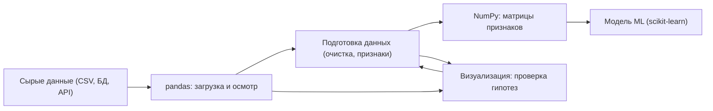

Машинное обучение — это в первую очередь работа с данными, и подавляющее большинство этой работы сегодня делается на Python. Не потому что Python самый быстрый язык (он не самый быстрый), а потому что вокруг него выросла зрелая экосистема инструментов: загрузить таблицу, посчитать матрицы, нарисовать график, очистить пропуски, обучить модель — всё это связные кубики, которые стыкуются друг с другом почти без трения. Эта тема — про то, как уверенно держать эти кубики в руках.

Здесь мы не учим «программированию вообще». Мы учим тому срезу Python, который реально нужен для данных и ML: векторные вычисления вместо циклов, таблицы вместо ручного парсинга, графики для проверки гипотез и аккуратная подготовка данных перед обучением модели.

## Зачем эта тема нужна для ML

В реальном проекте по машинному обучению код, который собственно «обучает модель», — это часто пара строк. Всё остальное время уходит на то, чтобы довести данные до состояния, в котором модель вообще способна чему-то научиться. Грубая, но честная оценка из практики: на сбор, очистку и подготовку данных уходит порядка 70–80% усилий.

Поэтому навык «бегло работать с данными в Python» — это не вспомогательный, а центральный навык дата-сайентиста. Если вы умеете:

- загрузить и осмотреть набор данных за минуты, а не за часы;
- быстро отличить «грязный» признак от полезного;
- выразить преобразование векторно, а не циклом на полмиллиона итераций;
- увидеть проблему глазами на графике до того, как она испортит метрику, —

то всё последующее (модели из [машинного обучения](/machine-learning/), вывод формул из [математического анализа](/calculus/)) ложится на подготовленную почву.



## Ключевые идеи темы

Несколько мыслей, которые проходят через всю тему и которые стоит усвоить раньше синтаксиса.

### Векторизация вместо циклов

Главная идея числового Python: не перебирать элементы по одному, а применять операцию сразу ко всему массиву. Циклы на Python медленные, потому что интерпретируются; а векторная операция в NumPy уходит в скомпилированный C-код и работает на порядки быстрее.

```python
import numpy as np

x = np.arange(1_000_000)

# Медленно и многословно — так не делают
# total = 0
# for v in x:
#     total += v * v

# Векторно — быстро и читается как формула
total = (x * x).sum()
```

По сути вы пишете не код, а математику: выражение `(x * x).sum()` напрямую соответствует $\sum_i x_i^2$.

### Данные — это таблицы и тензоры

Есть две базовые формы представления данных, и обе вы встретите постоянно:

- **Таблица** (`DataFrame` в pandas) — строки-наблюдения, столбцы-признаки, столбцы могут быть разных типов. Это формат, в котором данные приходят из реального мира.
- **Тензор** (массив `ndarray` в NumPy) — однородный многомерный массив чисел. Это формат, который «понимают» модели. Матрица объект-признак $X \in \mathbb{R}^{n \times m}$, где $n$ — число объектов, $m$ — число признаков, — стандартный вход почти любого алгоритма.

Значительная часть работы — это аккуратный перевод из первой формы во вторую.

### Сначала посмотри на данные

До любой модели и любой метрики стоит посмотреть на данные глазами: распределения признаков, выбросы, пропуски, связи между переменными. Знаменитый [квартет Энскомба](https://ru.wikipedia.org/wiki/Квартет_Энскомба) — четыре набора с почти одинаковыми средними, дисперсиями и корреляцией, но совершенно разными графиками — показывает, почему одни числа без картинки обманчивы. Визуализация — это дешёвый способ поймать проблему рано.

### Воспроизводимость и чистота пайплайна

Хороший анализ можно запустить заново и получить тот же результат. Отсюда привычки: фиксировать random seed, не «лечить» данные руками в Excel, держать все преобразования в коде, разделять подготовку обучающих и тестовых данных, чтобы не допустить утечки (data leakage).

## Связь с другими темами

Python — это инструмент, через который вы трогаете руками всю остальную математику курса.

| Тема | Как связана с Python и данными |
| --- | --- |
| [Линейная алгебра](/linear-algebra/) | Массивы NumPy — это и есть векторы и матрицы; умножение матриц, нормы, разложения вы будете считать кодом |
| [Математический анализ](/calculus/) | Градиенты и оптимизация лежат под обучением моделей; векторные операции — язык, на котором их выражают |
| [Теория вероятностей](/probability/) | Случайные величины, распределения и сэмплирование реализуются через `numpy.random` |
| [Статистика](/statistics/) | Описательные статистики, корреляции, проверка гипотез — это pandas плюс визуализация |
| [Машинное обучение](/machine-learning/) | Подготовленные данные подаются в модели; почти весь практический ML на Python живёт в этой экосистеме |

Из соседних тем сюда же примыкают [виртуализация](/virtualization/) и [контейнеризация](/containerization/) — когда дойдёт до воспроизводимого окружения и запуска расчётов вне своего ноутбука.

## Разделы темы

Разделы выстроены по нарастанию: от языка к данным, затем к их представлению, проверке и подготовке, и наконец к закреплению на задачах.

- **[Python для данных](/python-data/python-basics/)** — необходимый минимум языка под анализ данных: типы, коллекции, срезы, функции, comprehensions, работа с файлами и окружением (venv, pip, Jupyter). Без воды и без всего того, что для ML не пригодится.
- **[NumPy](/python-data/numpy/)** — массивы `ndarray`, векторизация, broadcasting, индексация, базовая линейная алгебра. Фундамент, на котором стоит весь остальной числовой Python.
- **[pandas](/python-data/pandas/)** — `Series` и `DataFrame`, загрузка данных, фильтрация и отбор, группировки и агрегации, объединение таблиц, работа со временем. Основной инструмент табличного анализа.
- **[Визуализация](/python-data/visualization/)** — Matplotlib и Seaborn: гистограммы, scatter-графики, boxplot, тепловые карты корреляций. Как увидеть данные и не дать графику соврать.
- **[Подготовка данных](/python-data/data-prep/)** — пропуски, выбросы, кодирование категорий, масштабирование признаков, разбиение train/test, feature engineering и предотвращение утечек. Мост между сырыми данными и моделью.
- **[Задания](/python-data/exercises/)** — практические задачи на весь стек: от векторных операций до сборки небольшого пайплайна подготовки данных.

## Как изучать

:::tip[Учитесь руками, а не глазами]
Этот раздел невозможно усвоить чтением. Откройте Jupyter Notebook и повторяйте каждый пример, меняя параметры и ломая код намеренно — так быстрее всего понимаешь, что на самом деле делает функция.
:::

Практичный порядок и принципы:

1. **Идите по разделам сверху вниз.** Базовый Python → NumPy → pandas → визуализация → подготовка данных. Каждый следующий опирается на предыдущий: pandas построен поверх NumPy, а подготовка данных — поверх всех остальных.
2. **Берите реальный датасет пораньше.** Возьмите что-то живое (например, Titanic или любой набор с [Kaggle Datasets](https://www.kaggle.com/datasets)) и тяните его сквозь все разделы: загрузите, осмотрите, нарисуйте, очистите.
3. **Старайтесь писать векторно.** Поймали себя на цикле по строкам `DataFrame` — остановитесь и спросите, нельзя ли выразить это через операцию над столбцом. Чаще всего можно.
4. **Не зубрите API — держите под рукой документацию.** Важно понимать, *что* вы хотите сделать с данными; синтаксис конкретного метода всегда можно посмотреть в [документации pandas](https://pandas.pydata.org/docs/) и [NumPy](https://numpy.org/doc/).
5. **Закрепляйте на [заданиях](/python-data/exercises/).** Концепция считается усвоенной не тогда, когда вы её прочитали, а когда решили задачу без подсказки.

:::note
Не пытайтесь выучить «весь pandas» — это огромная библиотека, и так не делает никто. Цель — свободно делать 20% операций, которые покрывают 80% повседневной работы с данными, и знать, где искать остальное.
:::
