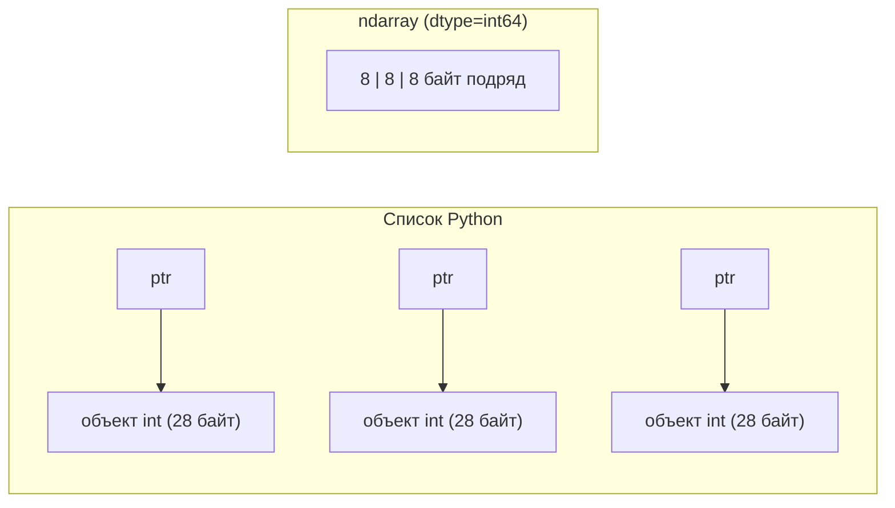
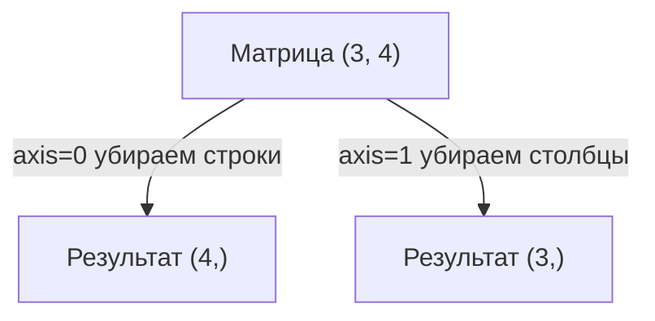

[NumPy](https://numpy.org/) — это фундамент почти всего научного и ML-стека Python: pandas, scikit-learn, PyTorch и TensorFlow внутри так или иначе опираются на его идеи. Центральная сущность библиотеки — `ndarray`, многомерный однородный массив чисел, лежащий в памяти единым непрерывным блоком. Именно эта компактность даёт NumPy скорость: операции выполняются заранее скомпилированным C-кодом сразу над всем массивом, а не в медленном цикле на Python.

В этом разделе мы разберём, как устроен `ndarray`, как его создавать, индексировать и преобразовывать, почему векторизация быстрее циклов, как работает broadcasting и как считать линейную алгебру. По дороге свяжем всё с разделом [Линейная алгебра](/linear-algebra/).

## Что такое ndarray

`ndarray` (N-dimensional array) описывается тремя ключевыми атрибутами:

- `shape` — кортеж с размерами по каждой оси, например `(3, 4)` — 3 строки, 4 столбца;
- `dtype` — тип элементов (`int64`, `float64`, `bool`, ...); тип единый для всего массива;
- `ndim` — число осей (длина `shape`).

```python
import numpy as np

a = np.array([[1, 2, 3],
              [4, 5, 6]])

print(a.shape)   # (2, 3)
print(a.ndim)    # 2
print(a.dtype)   # int64
print(a.size)    # 6  — всего элементов
```

В отличие от списка Python, где каждый элемент — отдельный объект с заголовком, `ndarray` хранит «сырые» числа подряд. Это в разы экономит память и позволяет процессору обрабатывать данные пачками.



:::note[Однородность — это плюс]
Единый `dtype` — не ограничение, а источник производительности. Зная тип и размер элемента, NumPy вычисляет адрес любого элемента простой арифметикой, без разыменования указателей.
:::

## Создание массивов

Способов завести массив много — выбирайте по ситуации.

```python
import numpy as np

np.array([1, 2, 3])              # из списка
np.zeros((2, 3))                 # нули, shape (2,3)
np.ones((2, 3))                  # единицы
np.full((2, 2), 7)               # заполнить значением 7
np.eye(3)                        # единичная матрица 3x3
np.arange(0, 10, 2)              # [0 2 4 6 8] — как range
np.linspace(0, 1, 5)            # [0. 0.25 0.5 0.75 1.] — 5 точек на отрезке
np.random.default_rng(0).normal(size=(2, 3))  # случайные из N(0,1)
```

Тип можно задать явно через `dtype`, а форму поменять через `reshape` (без копирования данных, если возможно):

```python
x = np.arange(12, dtype=np.float64)  # 0..11 как float
m = x.reshape(3, 4)                  # 3x4 без копии
m2 = x.reshape(3, -1)                # -1 = «посчитай сам» -> 4
```

`reshape` не меняет порядок чисел в памяти — он лишь по-новому интерпретирует, где заканчивается строка. По умолчанию NumPy использует C-порядок (по строкам): элементы строки идут подряд.

## Индексация и срезы

Индексация многомерная: оси перечисляются через запятую внутри одних скобок.

```python
a = np.arange(1, 13).reshape(3, 4)
# [[ 1  2  3  4]
#  [ 5  6  7  8]
#  [ 9 10 11 12]]

a[0, 0]      # 1      — элемент
a[1]         # [5 6 7 8] — вся строка 1
a[:, 2]      # [3 7 11]  — весь столбец 2
a[0:2, 1:3]  # [[2 3] [6 7]] — подблок
a[-1]        # [9 10 11 12] — последняя строка
```

Срез `start:stop:step` работает как в обычном Python, но по каждой оси отдельно. Важнейшая особенность: **срез возвращает представление (view), а не копию**. Изменение среза меняет исходный массив.

```python
a = np.arange(6)
s = a[1:4]
s[0] = 100
print(a)   # [  0 100   2   3   4   5]  — изменился оригинал!
```

Если нужна независимая копия — вызовите `.copy()`.

:::caution[View против copy — частый источник багов]
Срезы (`a[1:4]`), `reshape`, транспонирование дают view. «Фантазийная» индексация массивом индексов и булева индексация дают copy. Если результат внезапно «не сохраняется» или, наоборот, неожиданно меняет соседние данные — проверьте, view это или copy.
:::

### Булева индексация

Можно выбирать элементы по маске — массиву из `True`/`False` той же формы. Маску обычно строят сравнением, которое само по себе векторизовано.

```python
a = np.array([-3, 5, -1, 8, 0, -7])

mask = a > 0          # [False  True False  True False False]
a[mask]               # [5 8] — только положительные
a[a > 0]              # то же короче

a[a < 0] = 0          # заменить отрицательные нулём
# a -> [0 5 0 8 0 0]
```

Условия комбинируются поэлементными операторами `&` (и), `|` (или), `~` (не) — обязательно в скобках, потому что у них ниже приоритет, чем у сравнений.

```python
a = np.arange(10)
a[(a > 2) & (a < 7)]   # [3 4 5 6]
```

## Векторизация: почему она быстрее циклов

Векторизация — это запись операции сразу над всем массивом без явного цикла на Python. Вместо

```python
result = []
for xi in x:
    result.append(xi * 2 + 1)
```

пишем

```python
result = x * 2 + 1
```

Почему так быстрее? Цикл на Python интерпретируется: на каждой итерации происходит проверка типов, создание объектов, вызовы методов. Векторизованная операция уходит в скомпилированный C-цикл, который работает над сырым блоком памяти, использует SIMD-инструкции процессора и не платит за интерпретацию.

```python
import numpy as np, time

x = np.arange(1_000_000)

t = time.perf_counter()
s1 = sum(xi * xi for xi in x)        # чистый Python
py = time.perf_counter() - t

t = time.perf_counter()
s2 = (x * x).sum()                    # векторизация
nv = time.perf_counter() - t

print(f"python: {py:.3f}s, numpy: {nv:.4f}s, ускорение ~{py/nv:.0f}x")
# Типично десятки–сотни раз быстрее
```

Большинство математических функций в NumPy — это **ufunc** (universal functions), применяющиеся поэлементно: `np.exp`, `np.log`, `np.sqrt`, `np.sin`, `np.maximum` и т.д. Формально для функции $f$ и массива $\mathbf{x}=(x_1,\dots,x_n)$ результат — это

$$
f(\mathbf{x}) = \big(f(x_1),\ f(x_2),\ \dots,\ f(x_n)\big).
$$

```python
x = np.array([1.0, 2.0, 3.0])
np.exp(x)     # [ 2.718  7.389 20.086]
np.sqrt(x)    # [1.    1.414 1.732]
```

:::tip[Правило большого пальца]
Если вы пишете `for` по элементам массива — почти всегда есть векторизованная замена. Думайте «операциями над всем массивом», а не «по одному элементу».
:::

## Broadcasting

Broadcasting — это правила, по которым NumPy выполняет операции над массивами **разной формы**, мысленно «растягивая» меньший до большего без фактического копирования данных в памяти.

Формы сравниваются справа налево. Две оси совместимы, если они равны либо одна из них равна 1. Ось с размером 1 «растягивается» до размера партнёра.

```text
A      (3, 4)
B         (4,)   -> трактуется как (1, 4) -> растянули до (3, 4)
A + B  (3, 4)    OK

A      (3, 1)
B         (4,)   -> (1, 4)
A + B  (3, 4)    OK — обе оси растянулись

A      (3, 4)
B         (3,)   -> (1, 3)  несовместимо с (..., 4) -> ОШИБКА
```

Классический пример — прибавить вектор-строку к каждой строке матрицы или центрировать столбцы:

```python
A = np.arange(12).reshape(3, 4).astype(float)

col_mean = A.mean(axis=0)     # shape (4,) — среднее по столбцам
A_centered = A - col_mean     # (3,4) - (4,) -> broadcasting

# Таблица умножения через внешнее произведение
row = np.arange(1, 4).reshape(3, 1)   # (3,1)
col = np.arange(1, 5).reshape(1, 4)   # (1,4)
row * col                              # (3,4) — каждый с каждым
```

Математически broadcasting вектора $\mathbf{b}\in\mathbb{R}^{n}$ к строкам матрицы $A\in\mathbb{R}^{m\times n}$ эквивалентно

$$
(A \oplus \mathbf{b})_{ij} = A_{ij} + b_j.
$$

:::note[Память не тратится]
«Растягивание» виртуальное: NumPy не создаёт реальную копию строки $m$ раз, а лишь повторно читает один и тот же блок. Поэтому broadcasting не только удобен, но и экономен.
:::

## Агрегаты по осям

Редукции (`sum`, `mean`, `max`, `min`, `std`, `argmax`, ...) схлопывают массив вдоль указанной оси. Ключ к пониманию — параметр `axis`: он задаёт ось, **которая исчезает**.

```python
A = np.arange(1, 13).reshape(3, 4)
# [[ 1  2  3  4]
#  [ 5  6  7  8]
#  [ 9 10 11 12]]

A.sum()           # 78 — по всему массиву
A.sum(axis=0)     # [15 18 21 24] — суммируем строки -> остаётся 4 столбца
A.sum(axis=1)     # [10 26 42]    — суммируем столбцы -> остаётся 3 строки
```

Удобная мнемоника: `axis=0` — «вниз по столбцам» (исчезают строки), `axis=1` — «вдоль строк» (исчезают столбцы).



Часто нужно сохранить размерность для последующего broadcasting — для этого `keepdims=True`:

```python
A = np.arange(1, 13).reshape(3, 4).astype(float)
row_sum = A.sum(axis=1, keepdims=True)  # shape (3,1), а не (3,)
probs = A / row_sum                      # нормировка строк через broadcasting
```

## Линейная алгебра

NumPy умеет полноценную линейную алгебру (детали смысла — в разделе [Линейная алгебра](/linear-algebra/)). Главное — не путать поэлементное умножение `*` с матричным.

| Операция | Запись | Что делает |
|---|---|---|
| Поэлементное | `A * B` | $C_{ij}=A_{ij}B_{ij}$, формы совместимы по broadcasting |
| Скалярное / матричное | `A @ B` или `np.matmul` | свёртка по внутренней оси |
| Скалярное произведение | `np.dot(u, v)` | $\sum_i u_i v_i$ для векторов |

Для двух матриц $A\in\mathbb{R}^{m\times k}$ и $B\in\mathbb{R}^{k\times n}$ произведение $C=AB\in\mathbb{R}^{m\times n}$ определяется как

$$
C_{ij} = \sum_{p=1}^{k} A_{ip}\, B_{pj}.
$$

```python
A = np.array([[1, 2],
              [3, 4]])
B = np.array([[5, 6],
              [7, 8]])

A * B          # поэлементно: [[5 12] [21 32]]
A @ B          # матрично:    [[19 22] [43 50]]

u = np.array([1, 2, 3])
v = np.array([4, 5, 6])
u @ v          # 32 — скалярное произведение
```

Дополнительные инструменты в подмодуле `np.linalg`:

```python
from numpy.linalg import inv, solve, det, norm, eig

A = np.array([[3., 1.],
              [1., 2.]])
b = np.array([9., 8.])

x = solve(A, b)     # решение Ax = b (точнее и быстрее, чем inv(A) @ b)
det(A)              # определитель
norm(b)             # евклидова норма ||b||
vals, vecs = eig(A) # собственные значения и векторы
```

:::tip[solve вместо inv]
Чтобы решить систему $A\mathbf{x}=\mathbf{b}$, используйте `np.linalg.solve(A, b)`, а не `inv(A) @ b`: это численно устойчивее и быстрее. Явное обращение матрицы почти никогда не нужно.
:::

### Мини-пример: линейная регрессия одной строкой

Метод наименьших квадратов сводится к нормальному уравнению $\hat{\boldsymbol\theta} = (X^\top X)^{-1} X^\top \mathbf{y}$, которое в NumPy лучше решать через `lstsq`:

```python
rng = np.random.default_rng(0)
X = np.c_[np.ones(100), rng.normal(size=100)]   # столбец единиц + признак
y = 2.0 + 3.0 * X[:, 1] + rng.normal(scale=0.1, size=100)

theta, *_ = np.linalg.lstsq(X, y, rcond=None)   # [~2.0, ~3.0]
```

Подробнее о смысле нормального уравнения, проекциях и собственных значениях — в разделе [Линейная алгебра](/linear-algebra/); о градиентном спуске как альтернативе — в [Машинном обучении](/machine-learning/).

## Задания

### Задание 1. Форма и broadcasting

Даны массивы `A` формы `(4, 3)` и `b` формы `(3,)`. Какой формы будет `A + b`? А если `b` имеет форму `(4,)`? Объясните, что произойдёт во втором случае.

<details>
<summary>Решение</summary>

Формы сравниваются справа налево.

- `A` это `(4, 3)`, `b` это `(3,)` $\to$ трактуется как `(1, 3)` $\to$ растягивается до `(4, 3)`. Результат — форма **`(4, 3)`**: вектор `b` прибавляется к каждой строке.
- `A` это `(4, 3)`, `b` это `(4,)` $\to$ трактуется как `(1, 4)`. Сравниваем последние оси: `3` и `4` — не равны и ни одна не равна 1. Совместимости нет $\to$ **`ValueError: operands could not be broadcast together`**.

Чтобы прибавить `b` формы `(4,)` к столбцам, нужно вручную добавить ось: `A + b.reshape(4, 1)`.

</details>

### Задание 2. Замена без цикла

Дан массив `x = np.array([-5, 3, -2, 0, 7, -1])`. Не используя `for`, замените все отрицательные элементы их модулем, а остальные оставьте как есть. Дайте два способа.

<details>
<summary>Решение</summary>

Способ 1 — булева индексация на месте:

```python
x = np.array([-5, 3, -2, 0, 7, -1])
x[x < 0] *= -1          # [5 3 2 0 7 1]
```

Способ 2 — векторизованная функция (не меняет оригинал):

```python
y = np.abs(x)           # [5 3 2 0 7 1]
# или через условие:
y = np.where(x < 0, -x, x)
```

`np.where(cond, a, b)` поэлементно выбирает `a`, где условие истинно, и `b` иначе.

</details>

### Задание 3. Агрегаты по осям

Для матрицы

```python
A = np.array([[2., 4., 6.],
              [1., 1., 1.]])
```

посчитайте: (а) среднее по каждому столбцу, (б) сумму по каждой строке, (в) нормируйте строки так, чтобы сумма каждой строки была равна 1.

<details>
<summary>Решение</summary>

(а) Среднее по столбцам — это `axis=0` (исчезают строки):

```python
A.mean(axis=0)   # [1.5 2.5 3.5]
```

(б) Сумма по строкам — это `axis=1` (исчезают столбцы):

```python
A.sum(axis=1)    # [12.  3.]
```

(в) Делим каждую строку на её сумму. Чтобы сработал broadcasting, сохраняем размерность через `keepdims=True`:

```python
row_sum = A.sum(axis=1, keepdims=True)   # shape (2,1)
A_norm = A / row_sum
# [[0.1667 0.3333 0.5   ]
#  [0.3333 0.3333 0.3333]]
A_norm.sum(axis=1)   # [1. 1.]
```

Без `keepdims` сумма имела бы форму `(2,)`, и деление `(2,3) / (2,)` упало бы с ошибкой broadcasting.

</details>

### Задание 4. Матричное против поэлементного

Пусть

```python
A = np.array([[1, 0],
              [0, 2]])
v = np.array([3, 4])
```

Чему равны `A * v` и `A @ v`? Объясните разницу.

<details>
<summary>Решение</summary>

`A * v` — поэлементное умножение с broadcasting вектора `v` формы `(2,)` к строкам матрицы `(2, 2)`:

$$
A * v = \begin{pmatrix} 1\cdot 3 & 0\cdot 4 \\ 0\cdot 3 & 2\cdot 4 \end{pmatrix} = \begin{pmatrix} 3 & 0 \\ 0 & 8 \end{pmatrix}.
$$

`A @ v` — матрично-векторное произведение $A\mathbf{v}$, свёртка по внутренней оси:

$$
A\mathbf{v} = \begin{pmatrix} 1\cdot 3 + 0\cdot 4 \\ 0\cdot 3 + 2\cdot 4 \end{pmatrix} = \begin{pmatrix} 3 \\ 8 \end{pmatrix}.
$$

```python
A * v    # [[3 0] [0 8]] — форма (2,2)
A @ v    # [3 8]         — форма (2,)
```

Разница принципиальна: `*` повторяет числа покомпонентно и сохраняет 2D-форму, а `@` суммирует произведения и схлопывает внутреннюю ось, давая вектор.

</details>
