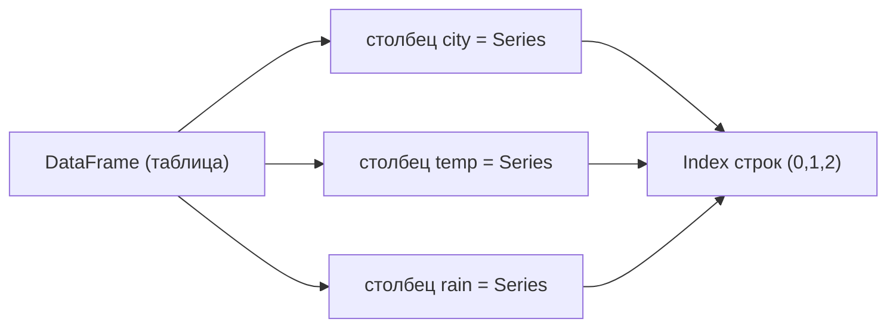
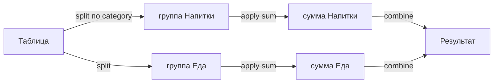
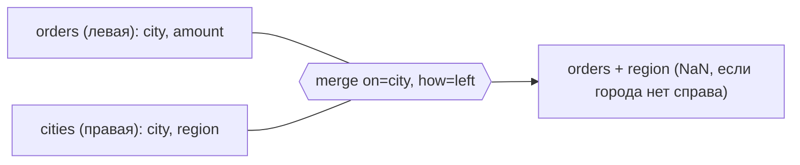

Если [NumPy](/python-data/numpy/) — это про однородные массивы чисел, то **pandas** — про таблицы: разнотипные столбцы, осмысленные имена и метки строк. Это рабочая лошадка любого аналитика данных и ML-инженера: загрузить датасет, посмотреть, почистить, посчитать агрегаты, склеить с другой таблицей — всё это про pandas.

Под капотом pandas стоит на NumPy, поэтому векторные операции работают так же быстро, а сверху добавлены индексы (метки) и инструменты для табличной логики, похожей на SQL и Excel одновременно.

```python
import pandas as pd
import numpy as np
```

::: tip[Договорённость об именах]
Почти весь мир импортирует pandas как `pd`, а NumPy как `np`. Придерживайтесь этой конвенции — так ваш код читают без перевода.
:::

## Две главные структуры: Series и DataFrame

**`Series`** — это одномерный массив с *индексом* (метками). По сути столбец таблицы вместе с подписями строк.

```python
s = pd.Series([10, 20, 30], index=["a", "b", "c"], name="score")
print(s["b"])      # 20  — доступ по метке
print(s.values)    # array([10, 20, 30]) — внутри NumPy-массив
print(s.index)     # Index(['a', 'b', 'c'], dtype='object')
```

**`DataFrame`** — двумерная таблица: набор `Series` с общим индексом строк. Каждый столбец имеет своё имя и свой тип.

```python
df = pd.DataFrame({
    "city": ["Москва", "Казань", "Сочи"],
    "temp": [18, 21, 25],
    "rain": [True, False, False],
})
```

|       | city   | temp | rain  |
|-------|--------|------|-------|
| **0** | Москва | 18   | True  |
| **1** | Казань | 21   | False |
| **2** | Сочи   | 25   | False |

Полезные «первые команды» при знакомстве с любым датасетом:

```python
df.head(3)      # первые строки
df.shape        # (число_строк, число_столбцов)
df.columns      # имена столбцов
df.dtypes       # типы каждого столбца
df.info()       # сводка: типы, число непустых значений, память
df.describe()   # статистики по числовым столбцам
```



## Чтение CSV

В реальности данные приходят файлами. Базовый инструмент — `pd.read_csv`. Возьмём небольшой файл `sales.csv`:

```text
order_id,date,city,product,category,qty,price
1,2024-01-05,Москва,Кофе,Напитки,2,250
2,2024-01-05,Москва,Чай,Напитки,1,150
3,2024-01-06,Казань,Кофе,Напитки,5,250
4,2024-01-07,Москва,Печенье,Еда,3,120
5,2024-01-08,Казань,Чай,Напитки,2,150
6,2024-01-08,Сочи,Кофе,Напитки,1,260
7,2024-01-09,Сочи,Печенье,Еда,4,
8,2024-01-10,Москва,Кофе,Напитки,2,250
```

Обратите внимание: у строки 7 поле `price` пустое — это типичный пропуск.

```python
df = pd.read_csv("sales.csv", parse_dates=["date"])
df.dtypes
# order_id             int64
# date        datetime64[ns]
# city                object   (строки)
# product              object
# category             object
# qty                  int64
# price              float64   (стал float из-за пропуска NaN)
```

::: note[Почему price стал float?]
В столбце есть пустое значение, которое pandas читает как `NaN` (Not a Number) — а `NaN` существует только среди чисел с плавающей точкой. Поэтому весь столбец повышается до `float64`, даже если остальные значения целые.
:::

Частые параметры `read_csv`: `sep=";"` (другой разделитель), `decimal=","` (запятая как десятичный знак), `index_col=0` (взять первый столбец как индекс), `na_values=["—", "n/a"]` (какие строки считать пропусками), `nrows=1000` (прочитать только начало большого файла).

## Индексация: loc и iloc

Здесь новички спотыкаются чаще всего, поэтому запомните правило:

- **`.loc[строки, столбцы]`** — по **меткам** (имена индекса и столбцов). Правая граница среза **включается**.
- **`.iloc[строки, столбцы]`** — по **позициям** (целые числа, как в NumPy). Правая граница **не включается**.

```python
df.loc[0, "city"]            # 'Москва' — метка строки 0, столбец 'city'
df.loc[0:2, ["city", "qty"]] # строки с метками 0,1,2 ВКЛЮЧИТЕЛЬНО
df.iloc[0:2, [2, 5]]         # строки позиций 0,1 (2 не входит), столбцы 2 и 5
df.iloc[-1]                  # последняя строка целиком
```

| Способ | По чему | Срез `a:b` |
|--------|---------|------------|
| `.loc` | по меткам | включает `b` |
| `.iloc` | по позициям | НЕ включает `b` |

Выбор одного столбца — это `Series`, нескольких — `DataFrame`:

```python
df["city"]              # Series
df[["city", "qty"]]     # DataFrame (двойные скобки = список столбцов)
```

## Фильтрация по условию

Условие даёт `Series` из булевых значений (булеву маску), и мы оставляем строки, где `True`:

```python
df[df["city"] == "Москва"]            # только московские заказы
df[df["qty"] >= 3]                    # крупные заказы
```

Несколько условий комбинируют через `&` (И), `|` (ИЛИ), `~` (НЕ). **Каждое условие — в круглых скобках**, иначе приоритет операторов всё сломает:

```python
df[(df["city"] == "Москва") & (df["category"] == "Напитки")]
```

`.loc` умеет фильтровать и выбирать столбцы одновременно — это идиоматичный способ:

```python
df.loc[df["city"] == "Москва", ["product", "qty"]]
#    product  qty
# 0     Кофе    2
# 1      Чай    1
# 3  Печенье    3
# 7     Кофе    2
```

Удобные специальные фильтры: `df[df["city"].isin(["Сочи", "Казань"])]`, `df[df["product"].str.startswith("Ко")]`, `df[df["price"].between(150, 250)]`.

::: caution[Не используйте and/or]
Питоновские `and`/`or` работают с одиночными `True/False`, а не с массивами. Для масок только `&`, `|`, `~`. И не забывайте скобки вокруг каждого условия.
:::

## Создание и преобразование столбцов

Новый столбец — это просто присваивание. Арифметика **векторизована**: операция применяется ко всем строкам сразу, цикл не нужен.

```python
df["revenue"] = df["qty"] * df["price"]   # выручка по строке
df["expensive"] = df["price"] > 200       # булев флаг
```

Преобразование строковых значений — через аксессор `.str`, дат — через `.dt`:

```python
df["city_upper"] = df["city"].str.upper()
df["weekday"] = df["date"].dt.day_name()      # день недели
df["month"] = df["date"].dt.month
```

Когда логика сложнее простой арифметики, помогают `map` (замена по словарю), `apply` (произвольная функция) и `np.where` (векторное «если-иначе»):

```python
# словарь категория -> ставка налога
rates = {"Напитки": 0.10, "Еда": 0.20}
df["tax"] = df["category"].map(rates) * df["revenue"]

# векторное условие
df["size"] = np.where(df["qty"] >= 3, "крупный", "мелкий")
```

::: tip[apply — крайнее средство]
`apply` фактически прогоняет Python-цикл по строкам и потому медленный. Сначала ищите векторное решение (арифметика, `np.where`, `.str`, `.map`); `apply` — когда иначе никак.
:::

## Группировка: groupby

`groupby` реализует схему **split — apply — combine**: разбить таблицу на группы по ключу, посчитать что-то внутри каждой, собрать результат обратно.



```python
df.groupby("category")["revenue"].sum()
# category
# Еда         360.0
# Напитки    2960.0
# Name: revenue, dtype: float64
```

Несколько агрегатов сразу и с понятными именами столбцов — через `.agg` с «именованной агрегацией»:

```python
df.groupby("city").agg(
    total=("revenue", "sum"),
    orders=("order_id", "count"),
    avg_qty=("qty", "mean"),
)
#          total  orders  avg_qty
# city
# Казань  1550.0       2      3.5
# Москва  1510.0       4      2.0
# Сочи     260.0       2      2.5
```

Можно группировать по нескольким ключам — получится иерархический индекс; `reset_index()` вернёт обычную плоскую таблицу:

```python
g = df.groupby(["city", "category"])["revenue"].sum().reset_index()
```

Частые агрегатные функции: `sum`, `mean`, `median`, `count` (непустые), `size` (все строки), `min`, `max`, `std`, `nunique` (число уникальных).

## Объединение таблиц: merge и join

`pd.merge` склеивает две таблицы по общему ключу — это аналог `JOIN` из SQL. Добавим справочник регионов:

```python
cities = pd.DataFrame({
    "city":   ["Москва", "Казань", "Сочи"],
    "region": ["Центр", "Поволжье", "Юг"],
})

pd.merge(df, cities, on="city", how="left")
```

Параметр `how` задаёт тип соединения:

| how | что оставляем |
|-----|---------------|
| `inner` | только ключи, есть в **обеих** таблицах (по умолчанию) |
| `left` | все строки **левой**, недостающее справа → `NaN` |
| `right` | все строки **правой** |
| `outer` | объединение всех ключей |



Если ключевые столбцы названы по-разному, используйте `left_on=` и `right_on=`. Метод `df.join(other)` — это сокращение для merge по индексу.

::: caution[Следите за размером после merge]
Если ключ не уникален в одной из таблиц, строки размножаются (декартово произведение совпавших). Проверяйте `df.shape` до и после: внезапный рост числа строк — почти всегда дубли в ключе.
:::

## Обработка пропусков (NaN)

Пропуски — норма для реальных данных. Сначала их находят, потом решают: удалить или заполнить.

```python
df.isna().sum()        # сколько NaN в каждом столбце
df["price"].isna()     # булева маска: где пропуск
```

**Удаление** — `dropna` (осторожно: можно потерять много данных):

```python
df.dropna()                       # строки, где есть хоть один NaN
df.dropna(subset=["price"])       # только если NaN именно в price
```

**Заполнение** — `fillna`. Типовые стратегии:

```python
df["price"].fillna(0)                       # константой
df["price"].fillna(df["price"].mean())      # средним по столбцу
df["price"].fillna(df["price"].median())    # медианой (устойчивее к выбросам)
df["price"].ffill()                         # значением сверху (forward fill)
```

Выбор стратегии зависит от смысла данных. Для числовых признаков часто берут медиану (она устойчива к выбросам), для упорядоченных по времени рядов — `ffill`. А заполнение средним — это уже простейшая *импутация*, тема из [машинного обучения](/machine-learning/) и предобработки признаков.

::: note[NaN заразен]
Любая арифметика с `NaN` даёт `NaN`: в нашем примере у заказа 7 пустая цена, поэтому `revenue` тоже `NaN`. Поэтому пропуски обрабатывают **до** расчётов, а не после.
:::

## Мини-конвейер: всё вместе

Типичная цепочка обработки от файла до агрегата читается сверху вниз:

```python
report = (
    pd.read_csv("sales.csv", parse_dates=["date"])
      .assign(price=lambda d: d["price"].fillna(d["price"].median()))
      .assign(revenue=lambda d: d["qty"] * d["price"])
      .query("category == 'Напитки'")
      .groupby("city", as_index=False)
      .agg(total=("revenue", "sum"), orders=("order_id", "count"))
      .sort_values("total", ascending=False)
)
```

Здесь `query` — компактная альтернатива булевой маске, `assign` добавляет столбцы внутри цепочки, а `as_index=False` сразу даёт плоскую таблицу. Такой стиль (method chaining) удобно читать и отлаживать построчно.

## Шпаргалка

| Задача | Код |
|--------|-----|
| Прочитать CSV | `pd.read_csv("f.csv")` |
| Первые строки / сводка | `df.head()`, `df.info()` |
| Столбец / несколько | `df["a"]`, `df[["a","b"]]` |
| По метке / позиции | `df.loc[r, c]`, `df.iloc[i, j]` |
| Фильтр | `df[(df["a"]>0) & (df["b"]=="x")]` |
| Новый столбец | `df["c"] = df["a"] * df["b"]` |
| Группировка | `df.groupby("k")["v"].sum()` |
| Объединение | `pd.merge(a, b, on="k", how="left")` |
| Найти пропуски | `df.isna().sum()` |
| Заполнить пропуски | `df["x"].fillna(df["x"].median())` |

## Куда дальше

- [NumPy](/python-data/numpy/) — массивы и векторизация под капотом pandas.
- [Статистика](/statistics/) — `describe`, агрегаты и распределения обретают смысл.
- [Машинное обучение](/machine-learning/) — pandas как первый шаг предобработки признаков.
- Официальная документация: [pandas User Guide](https://pandas.pydata.org/docs/user_guide/index.html) и шпаргалка [10 minutes to pandas](https://pandas.pydata.org/docs/user_guide/10min.html).

## Задания

Для заданий используйте тот же файл `sales.csv` из раздела «Чтение CSV».

### Задание 1. loc против iloc

Дан `df`, прочитанный из `sales.csv` (индекс строк — 0..7 по умолчанию). Что вернёт `df.loc[0:2]`, а что — `df.iloc[0:2]`? Сколько строк в каждом случае?

<details>
<summary>Решение</summary>

`.loc` работает по меткам и **включает** правую границу, поэтому `df.loc[0:2]` вернёт строки с метками 0, 1, 2 — **3 строки**.

`.iloc` работает по позициям и правую границу **не включает** (как срез Python), поэтому `df.iloc[0:2]` вернёт строки на позициях 0, 1 — **2 строки**.

Совпадение меток и позиций здесь случайно (индекс по умолчанию). Если бы индексом были, например, даты, числа `0:2` для `.loc` просто не нашлись бы.

</details>

### Задание 2. Выручка и фильтр

Добавьте столбец `revenue = qty * price` и выведите только заказы из Москвы со столбцами `product` и `revenue`. Почему важен порядок: сначала заполнить пропуски, потом считать выручку?

<details>
<summary>Решение</summary>

```python
df["revenue"] = df["qty"] * df["price"]
df.loc[df["city"] == "Москва", ["product", "revenue"]]
```

Если в `price` остаётся `NaN` (как у заказа 7 из Сочи), то `qty * price` тоже даст `NaN` — пропуск «заражает» вычисление. Поэтому пропуски заполняют **до** расчётов:

```python
df["price"] = df["price"].fillna(df["price"].median())
df["revenue"] = df["qty"] * df["price"]
```

Для Москвы пропусков нет, так что результат не изменится, но в общем случае порядок критичен.

</details>

### Задание 3. Группировка

Посчитайте суммарную выручку (`revenue`) и число заказов по каждому городу. Отсортируйте по выручке убыванию.

<details>
<summary>Решение</summary>

```python
df["revenue"] = df["qty"] * df["price"].fillna(df["price"].median())

(df.groupby("city", as_index=False)
   .agg(total=("revenue", "sum"), orders=("order_id", "count"))
   .sort_values("total", ascending=False))
```

Используем именованную агрегацию: `total=("revenue","sum")` и `orders=("order_id","count")`. `as_index=False` даёт плоскую таблицу, `sort_values(..., ascending=False)` ставит города с большей выручкой наверх. Для Сочи в `price` был пропуск — без заполнения его выручка получилась бы `NaN`, и сумма по городу исказилась бы.

</details>

### Задание 4. Merge и тип соединения

Есть справочник `cities` с городами `Москва, Казань, Сочи` и их регионами. В заказах встречается ещё город `Пермь`, которого в справочнике нет. Что попадёт в столбец `region` для пермского заказа при `how="left"` и при `how="inner"`?

<details>
<summary>Решение</summary>

```python
pd.merge(orders, cities, on="city", how="left")
```

- При `how="left"` сохраняются **все** строки левой таблицы (заказов). Для Перми в справочнике совпадения нет, поэтому `region` будет `NaN`, но сама строка останется.
- При `how="inner"` остаются только города, присутствующие в **обеих** таблицах. Строка с Пермью просто исчезнет из результата.

Вывод: `left` выбирают, когда нельзя терять строки основной таблицы; `inner` — когда нужны только полностью сопоставленные записи. Полезно сверять `df.shape` до и после merge.

</details>
