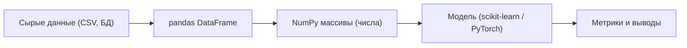
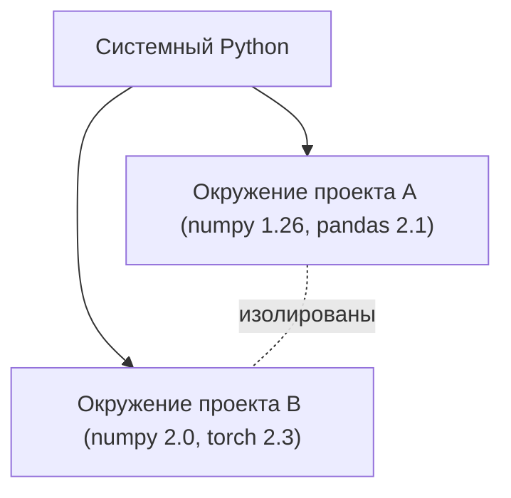

Python — рабочий язык анализа данных и машинного обучения. Не потому, что он самый быстрый (он не самый быстрый), а потому, что вокруг него выросла зрелая экосистема: NumPy, pandas, scikit-learn, PyTorch. Сам по себе язык простой и читаемый, и для старта в ML достаточно небольшого его подмножества.

Эта страница — не полный курс языка, а **необходимый минимум**: те конструкции, которые вы будете видеть и писать каждый день, разбирая данные. Если вы уже программируете на любом языке, прочитать её можно за один присест.

:::note[Что дальше]
Отдельные большие темы вынесены в соседние разделы: работа с массивами в [NumPy](/python-data/), таблицами в pandas и визуализация. Здесь — фундамент, на котором всё это стоит.
:::

## Зачем Python в ML

Машинное обучение — это преобразование данных: загрузить, очистить, превратить в числа, скормить модели, оценить. Python хорош тем, что весь этот конвейер пишется коротко и читаемо, а тяжёлые вычисления делегируются библиотекам на C/Fortran (тот же NumPy).



Ваш «чистый» Python — это клей между этими этапами. Поэтому важно уверенно владеть базовыми структурами данных и уметь компактно их преобразовывать.

## Базовые типы

В Python переменные не объявляются с типом — тип определяется по значению. Узнать тип можно функцией `type()`.

```python
n = 42            # int   — целое
x = 3.14          # float — число с плавающей точкой
name = "Анна"     # str   — строка
ok = True         # bool  — логический (True / False)
nothing = None    # NoneType — «ничего», отсутствие значения
```

Несколько практичных деталей:

- Деление `/` всегда даёт `float`: `7 / 2 == 3.5`. Целочисленное деление — `//`, остаток — `%`, степень — `**`.
- `bool` — это подтип `int`: `True == 1`, `False == 0`. Это иногда удобно: `sum([True, False, True]) == 2` считает количество истин.
- Строки неизменяемы: операции вроде `s.upper()` возвращают новую строку, а не меняют исходную.

```python
price = 100
discount = 0.2
final = price * (1 - discount)   # 80.0  (float, т.к. умножение на float)

s = "machine learning"
print(s.upper())        # MACHINE LEARNING
print(s.split())        # ['machine', 'learning']
print(len(s))           # 16
```

f-строки — основной способ форматирования. Внутри `{...}` можно писать выражения, а после `:` — формат:

```python
acc = 0.8736
print(f"Точность: {acc:.2%}")     # Точность: 87.36%
print(f"2 + 2 = {2 + 2}")         # 2 + 2 = 4
```

## Структуры данных

Четыре «рабочие лошадки» Python — это `list`, `tuple`, `dict` и `set`. Их различия удобно держать в голове по двум осям: **упорядоченность** и **изменяемость**.

| Структура | Синтаксис | Упорядочена | Изменяема | Дубликаты | Когда брать |
|-----------|-----------|:-----------:|:---------:|:---------:|-------------|
| `list`    | `[1, 2, 3]` | да | да | да | последовательность, которую меняют |
| `tuple`   | `(1, 2, 3)` | да | нет | да | фиксированный набор (координата, строка таблицы) |
| `dict`    | `{"a": 1}`  | да* | да | ключи уникальны | соответствие ключ → значение |
| `set`     | `{1, 2, 3}` | нет | да | нет | уникальные элементы, проверка принадлежности |

\* с Python 3.7 словарь сохраняет порядок вставки ключей.

### list — список

Упорядоченная изменяемая коллекция. Основная структура для «набора чего-то».

```python
nums = [3, 1, 4, 1, 5]
nums.append(9)          # [3, 1, 4, 1, 5, 9] — добавить в конец
nums.sort()             # [1, 1, 3, 4, 5, 9] — сортировка на месте
print(nums[0], nums[-1])  # 1 9  — первый и последний
print(len(nums))        # 6
```

Проверка принадлежности через `in`, объединение через `+`:

```python
print(4 in nums)        # True
combined = [1, 2] + [3, 4]   # [1, 2, 3, 4]
```

### tuple — кортеж

То же, что список, но **неизменяемый**. Используется там, где набор значений логически целостен и не должен меняться: координаты `(x, y)`, размер массива `(строки, столбцы)`, возврат нескольких значений из функции.

```python
point = (10, 20)
x, y = point            # распаковка: x = 10, y = 20
# point[0] = 5          # ошибка: tuple нельзя менять
```

Распаковка кортежей — частый приём. Например, обмен значений без временной переменной:

```python
a, b = 1, 2
a, b = b, a             # a = 2, b = 1
```

### dict — словарь

Отображение «ключ → значение». В анализе данных это, например, описание одного объекта (признаки) или счётчик.

```python
person = {"name": "Анна", "age": 30, "city": "Москва"}
print(person["name"])           # Анна
person["age"] = 31              # изменить
person["email"] = "a@x.ru"      # добавить новый ключ

# безопасное чтение: вернёт значение по умолчанию, если ключа нет
print(person.get("phone", "нет"))   # нет
```

Перебор словаря по парам ключ-значение:

```python
for key, value in person.items():
    print(f"{key}: {value}")
```

### set — множество

Неупорядоченная коллекция **уникальных** элементов. Незаменимо для удаления дубликатов и быстрой проверки «есть ли элемент».

```python
tags = ["ml", "python", "ml", "data", "python"]
unique = set(tags)              # {'ml', 'python', 'data'}

a = {1, 2, 3}
b = {2, 3, 4}
print(a & b)    # {2, 3}     — пересечение
print(a | b)    # {1, 2, 3, 4} — объединение
print(a - b)    # {1}        — разность
```

:::tip[Производительность]
Проверка `x in s` для множества (`set`) и словаря (`dict`) выполняется в среднем за константное время $O(1)$, а для списка — за линейное $O(n)$, потому что список приходится перебирать целиком. Если вы часто проверяете принадлежность к большой коллекции — берите `set`.
:::

## Срезы (slicing)

Срез вытаскивает подпоследовательность из списка, кортежа или строки. Синтаксис: `seq[start:stop:step]`. Граница `stop` **не включается** — это ключевое правило.

```python
a = [0, 1, 2, 3, 4, 5, 6, 7, 8, 9]

a[2:5]      # [2, 3, 4]      — с 2 по 4 (5 не входит)
a[:3]       # [0, 1, 2]      — от начала
a[7:]       # [7, 8, 9]      — до конца
a[::2]      # [0, 2, 4, 6, 8] — каждый второй
a[::-1]     # [9, 8, ..., 0]  — разворот
a[-3:]      # [7, 8, 9]      — последние три
```

Логику индексов удобно представлять так: индексы указывают на «границы между элементами».

```text
 элементы:    0   1   2   3   4   5
индекс →    0   1   2   3   4   5   6
индекс ←   -6  -5  -4  -3  -2  -1
```

Срез `a[1:4]` берёт всё между границей 1 и границей 4, то есть элементы с индексами 1, 2, 3.

Та же логика работает со строками:

```python
s = "data science"
print(s[:4])     # data
print(s[-7:])    # science
```

:::caution[Срез vs индекс]
Срез возвращает новую коллекцию того же типа (`a[2:5]` — список), а одиночный индекс `a[2]` — сам элемент. Эта же логика индексации и срезов переносится на массивы NumPy и таблицы pandas, но там она расширяется до нескольких измерений — см. [NumPy](/python-data/).
:::

## Функции

Функция оформляет переиспользуемый кусок логики. Объявляется через `def`, значение возвращается через `return`.

```python
def normalize(x, lo, hi):
    """Приводит x к диапазону [0, 1] по границам lo и hi."""
    return (x - lo) / (hi - lo)

print(normalize(5, 0, 10))   # 0.5
```

Это та самая min-max нормализация, которую часто применяют к признакам перед обучением:

$$ x' = \frac{x - x_{\min}}{x_{\max} - x_{\min}} $$

### Аргументы по умолчанию и именованные

```python
def power(base, exp=2):      # exp по умолчанию = 2
    return base ** exp

power(5)            # 25  — взяли значение по умолчанию
power(5, 3)         # 125
power(base=2, exp=10)   # 1024 — именованные аргументы (порядок не важен)
```

:::danger[Изменяемый аргумент по умолчанию]
Никогда не используйте изменяемый объект (`list`, `dict`) как значение по умолчанию: оно создаётся **один раз** и разделяется между всеми вызовами.

```python
def bad(item, acc=[]):      # ловушка!
    acc.append(item)
    return acc

bad(1)   # [1]
bad(2)   # [1, 2]  — не [2], как ожидалось!
```

Правильно — использовать `None` как сигнал:

```python
def good(item, acc=None):
    if acc is None:
        acc = []
    acc.append(item)
    return acc
```
:::

### Возврат нескольких значений и lambda

Функция может вернуть кортеж — на стороне вызова его удобно распаковать:

```python
def stats(nums):
    return min(nums), max(nums), sum(nums) / len(nums)

lo, hi, mean = stats([4, 8, 15, 16, 23])
```

Короткую одноразовую функцию можно записать `lambda` — это часто встречается в аргументах `sorted`, `map`, pandas `.apply()`:

```python
words = ["banana", "kiwi", "apple"]
words.sort(key=lambda w: len(w))   # сортировка по длине: ['kiwi', 'apple', 'banana']
```

## List comprehensions

Генератор списка (list comprehension) — компактный способ построить список из другого итерируемого объекта. Это, пожалуй, самая узнаваемая идиома Python и очень частая в обработке данных.

Базовая форма:

```python
# было: цикл
squares = []
for x in range(10):
    squares.append(x ** 2)

# стало: comprehension
squares = [x ** 2 for x in range(10)]
# [0, 1, 4, 9, 16, 25, 36, 49, 64, 81]
```

С фильтром `if`:

```python
evens = [x for x in range(10) if x % 2 == 0]   # [0, 2, 4, 6, 8]
```

Часто нужно одновременно преобразовать и отфильтровать:

```python
data = [-3, 5, -1, 8, 0, -7]
clipped = [x for x in data if x > 0]           # [5, 8] — отобрали положительные
labels = ["pos" if x > 0 else "neg" for x in data]
# ['neg', 'pos', 'neg', 'pos', 'neg', 'neg']  — здесь if/else стоит ДО for
```

:::note[Где стоит условие]
Запомните различие по позиции:
- `[x for x in xs if cond]` — `if` **в конце** работает как фильтр (оставить/выбросить).
- `[a if cond else b for x in xs]` — `if/else` **в начале** выбирает значение для каждого элемента (выбросить нельзя).
:::

По аналогии строятся **dict comprehension** и **set comprehension**:

```python
sq_map = {x: x ** 2 for x in range(5)}    # {0: 0, 1: 1, 2: 4, 3: 9, 4: 16}
unique_lengths = {len(w) for w in words}  # множество длин слов
```

## Окружения: venv и conda

Проблема, с которой сталкивается каждый: разным проектам нужны разные версии библиотек. Если ставить всё в системный Python, версии начинают конфликтовать. Решение — **изолированное окружение** на каждый проект.



### venv — встроенный инструмент

`venv` входит в стандартную поставку Python. Лёгкий, не требует ничего ставить.

```bash
# создать окружение в папке .venv
python -m venv .venv

# активировать (macOS / Linux)
source .venv/bin/activate
# активировать (Windows)
# .venv\Scripts\activate

# установить пакеты
pip install numpy pandas scikit-learn

# зафиксировать список зависимостей в файл
pip freeze > requirements.txt

# деактивировать
deactivate
```

Файл `requirements.txt` позволяет воспроизвести окружение на другой машине: `pip install -r requirements.txt`.

### conda — для научного стека

`conda` (Anaconda / Miniconda) управляет не только Python-пакетами, но и системными библиотеками (например, нативными зависимостями для научных вычислений). Удобен, когда нужны сложные сборки.

```bash
conda create -n ml python=3.11 numpy pandas scikit-learn
conda activate ml
conda deactivate
```

| Критерий | venv + pip | conda |
|----------|-----------|-------|
| Поставка | встроен в Python | отдельная установка |
| Что ставит | Python-пакеты | Python + системные библиотеки |
| Вес | лёгкий | тяжелее |
| Когда удобен | большинство проектов | сложный научный стек, не-Python зависимости |

:::tip
Главное правило: **отдельное окружение на каждый проект**. Какой именно инструмент — дело вкуса и задачи. Для входа в ML достаточно `venv` + `pip`. Связанные темы изоляции — [виртуализация](/virtualization/) и [контейнеризация](/containerization/).
:::

## Jupyter Notebook

Jupyter Notebook — интерактивная среда, где код делится на **ячейки**, и каждую можно выполнять отдельно, сразу видя результат: числа, таблицы, графики. Для анализа данных это основной рабочий формат: вы исследуете данные итеративно, шаг за шагом.

```bash
pip install jupyterlab
jupyter lab        # откроется в браузере
```

Файл блокнота имеет расширение `.ipynb`. Ячейки бывают двух основных типов:

- **Code** — выполняемый Python; результат последнего выражения печатается под ячейкой.
- **Markdown** — текст, заголовки, формулы (KaTeX), пояснения.

```python
# ячейка 1
import numpy as np
data = np.array([1, 2, 3, 4, 5])

# ячейка 2 — выполняется отдельно, помнит data из ячейки 1
data.mean()        # 3.0  — выведется автоматически
```

Полезные горячие клавиши (в командном режиме, по нажатию `Esc`):

| Клавиша | Действие |
|---------|----------|
| `Shift + Enter` | выполнить ячейку и перейти к следующей |
| `Ctrl + Enter` | выполнить ячейку, остаться на ней |
| `A` / `B` | вставить ячейку выше / ниже |
| `D D` | удалить ячейку |
| `M` / `Y` | сделать ячейку Markdown / Code |

:::caution[Порядок выполнения]
Ячейки можно запускать в любом порядке, и состояние переменных накапливается. Это удобно, но коварно: легко получить результат, который не воспроизведётся при запуске сверху вниз. Перед тем как считать анализ готовым, выполните **Restart & Run All** — это перезапускает ядро и прогоняет блокнот с чистого листа.
:::

## Что запомнить

- Структуры выбирают по задаче: `list` — изменяемая последовательность, `tuple` — неизменяемый набор, `dict` — ключ→значение, `set` — уникальные элементы и быстрая проверка принадлежности.
- Срезы `seq[start:stop:step]` не включают `stop`; та же логика затем переносится на NumPy и pandas.
- List/dict/set comprehensions заменяют циклы `append` и читаются лучше.
- Один проект — одно изолированное окружение (`venv` или `conda`).
- Jupyter — для итеративного исследования; не забывайте про **Restart & Run All**.

Дальше эти основы превращаются в инструменты анализа: массивы и векторные операции в [NumPy](/python-data/), а математический фундамент под ними — в [линейной алгебре](/linear-algebra/), [теории вероятностей](/probability/) и [статистике](/statistics/). Сами модели — в разделе [машинное обучение](/machine-learning/).

## Задания

**1. Структуры данных.** Дан список оценок с повторами: `grades = [4, 5, 3, 5, 4, 5, 2, 3]`. Не используя циклы явно, получите: (а) множество уникальных оценок; (б) количество уникальных оценок; (в) словарь, где ключ — оценка, значение — сколько раз она встретилась.

<details>
<summary>Решение</summary>

```python
grades = [4, 5, 3, 5, 4, 5, 2, 3]

# (а) уникальные
uniq = set(grades)              # {2, 3, 4, 5}

# (б) сколько уникальных
print(len(uniq))                # 4

# (в) частоты — через готовый Counter
from collections import Counter
counts = dict(Counter(grades))  # {4: 2, 5: 3, 3: 2, 2: 1}
```

Без `Counter` частоты можно собрать dict comprehension:

```python
counts = {g: grades.count(g) for g in set(grades)}
```

</details>

**2. Срезы.** Дана строка `s = "abcdefgh"`. Что вернут выражения `s[1:6:2]`, `s[::-1]`, `s[-3:]`? Объясните каждое.

<details>
<summary>Решение</summary>

- `s[1:6:2]` → `"bdf"`. Берём элементы с индекса 1 до 6 (не включая) с шагом 2: индексы 1, 3, 5 → `b`, `d`, `f`.
- `s[::-1]` → `"hgfedcba"`. Шаг −1 разворачивает строку.
- `s[-3:]` → `"fgh"`. Индекс −3 — это `f`, далее до конца.

</details>

**3. List comprehension.** Перепишите цикл одной строкой через list comprehension. Из чисел от 1 до 20 нужно оставить только кратные 3 и возвести их в квадрат.

```python
result = []
for x in range(1, 21):
    if x % 3 == 0:
        result.append(x ** 2)
```

<details>
<summary>Решение</summary>

```python
result = [x ** 2 for x in range(1, 21) if x % 3 == 0]
# [9, 36, 81, 144, 225, 324]
```

Кратные 3 в диапазоне — это 3, 6, 9, 12, 15, 18; их квадраты и попадают в список.

</details>

**4. Функции.** Напишите функцию `minmax_scale(values)`, которая принимает список чисел и возвращает новый список, приведённый к диапазону $[0, 1]$ по формуле $x' = \dfrac{x - x_{\min}}{x_{\max} - x_{\min}}$. Учтите случай, когда все значения одинаковы (деление на ноль).

<details>
<summary>Решение</summary>

```python
def minmax_scale(values):
    lo, hi = min(values), max(values)
    if hi == lo:                       # все элементы равны
        return [0.0 for _ in values]   # избегаем деления на ноль
    return [(x - lo) / (hi - lo) for x in values]

print(minmax_scale([10, 20, 30]))   # [0.0, 0.5, 1.0]
print(minmax_scale([7, 7, 7]))      # [0.0, 0.0, 0.0]
```

Минимум диапазона переходит в 0, максимум — в 1, остальное — пропорционально между ними. Проверка `hi == lo` защищает от деления на ноль, когда разброса нет.

</details>
