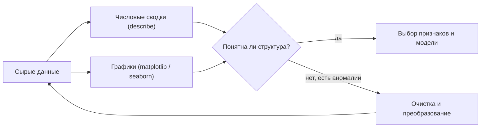
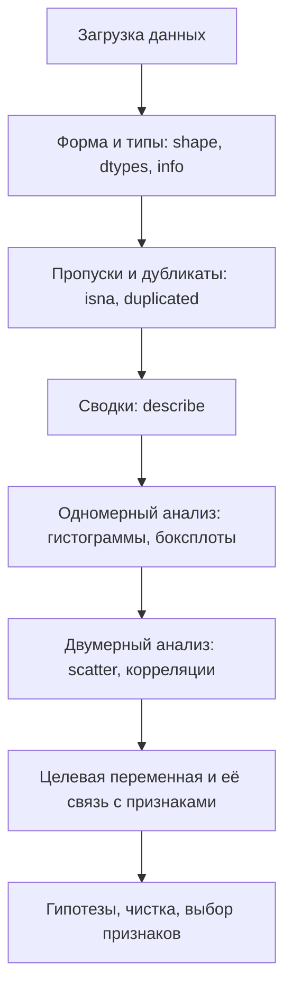

График стоит тысячи строк описательной статистики. Прежде чем обучать модель, данные нужно **увидеть**: понять масштабы признаков, заметить выбросы, проверить распределения и связи. Этот раздел про то, как рисовать графики в `matplotlib` и `seaborn` и как выстроить исследовательский анализ данных (EDA, *Exploratory Data Analysis*).

Перед чтением полезно держать под рукой [pandas и работу с таблицами](/python-data/) и базовые понятия из [статистики](/statistics/).

## Зачем вообще визуализировать

Классический пример — [квартет Энскомба](https://ru.wikipedia.org/wiki/Квартет_Энскомба): четыре набора по 11 точек с **одинаковыми** средними, дисперсиями и коэффициентом корреляции, но совершенно разной структурой. Числа лгут, картинка — нет.



Визуализация отвечает на вопросы, которые трудно задать иначе: «есть ли тяжёлые хвосты?», «линейна ли связь?», «два это кластера или один?», «не перепутаны ли единицы измерения?».

## matplotlib: фигуры и оси

`matplotlib` — базовая библиотека. Ключевая модель: есть **фигура** (`Figure`) — холст целиком, и есть **оси** (`Axes`) — одна система координат внутри него. На одной фигуре может быть несколько `Axes` (сетка подграфиков).

Рекомендуется *объектно-ориентированный* стиль: явно получать `fig` и `ax` через `plt.subplots()`, а не вызывать «магические» функции `plt.plot()` напрямую. Так код предсказуем и масштабируется на несколько графиков.

```python
import matplotlib.pyplot as plt
import numpy as np

# fig — вся фигура, ax — одни оси внутри неё
fig, ax = plt.subplots(figsize=(6, 4))   # размер в дюймах
ax.plot([0, 1, 2, 3], [0, 1, 4, 9])
ax.set_title("Простейший график")
ax.set_xlabel("x")
ax.set_ylabel("y")
fig.tight_layout()      # аккуратные отступы
plt.show()
```

Сетка из нескольких осей:

```python
fig, axes = plt.subplots(nrows=1, ncols=2, figsize=(10, 4))
axes[0].plot([1, 2, 3], [1, 4, 9])
axes[1].scatter([1, 2, 3], [3, 1, 2])
axes[0].set_title("Слева — линия")
axes[1].set_title("Справа — точки")
fig.tight_layout()
```

:::note[Два стиля API]
`plt.plot(...)` (pyplot-стиль) рисует на «текущих» осях и удобен для быстрых набросков в Jupyter. `ax.plot(...)` (ОО-стиль) явно указывает, *куда* рисовать. Для воспроизводимого кода и нескольких подграфиков выбирайте второй.
:::

## Линейный график

Линейный график (`plot`) соединяет точки линиями — подходит, когда по оси $x$ есть естественный порядок: время, индекс, аргумент функции.

```python
x = np.linspace(0, 2 * np.pi, 200)
fig, ax = plt.subplots(figsize=(6, 4))
ax.plot(x, np.sin(x), label="sin(x)")
ax.plot(x, np.cos(x), label="cos(x)", linestyle="--")
ax.set_xlabel("x")
ax.set_ylabel("значение")
ax.set_title("Синус и косинус")
ax.legend()             # покажет подписи из label
ax.grid(True, alpha=0.3)
```

Основные параметры линии: `color`, `linewidth` (`lw`), `linestyle` (`-`, `--`, `:`, `-.`), `marker` (`o`, `s`, `^`) для отметки точек.

## Диаграмма рассеяния

Диаграмма рассеяния (`scatter`) рисует каждую пару $(x_i, y_i)$ отдельной точкой. Это главный инструмент для оценки связи между двумя числовыми признаками: видно форму зависимости, разброс и выбросы. Цветом или размером точек можно закодировать третий признак.

```python
rng = np.random.default_rng(0)
x = rng.normal(size=300)
y = 2 * x + rng.normal(scale=0.5, size=300)   # линейная связь + шум
colors = x * y                                # третье измерение -> цвет

fig, ax = plt.subplots(figsize=(6, 4))
sc = ax.scatter(x, y, c=colors, s=20, alpha=0.7, cmap="viridis")
ax.set_xlabel("x")
ax.set_ylabel("y")
ax.set_title("Диаграмма рассеяния")
fig.colorbar(sc, ax=ax, label="x * y")
```

`alpha` (прозрачность) спасает от «слипания» точек на плотных данных. Если облако точек напоминает прямую — связь близка к линейной, и можно ожидать высокий коэффициент корреляции $r$ (см. [статистику](/statistics/)).

## Гистограмма

Гистограмма (`hist`) показывает **распределение** одного числового признака: ось $x$ делится на интервалы (бины), высота столбца — число наблюдений в интервале. Это первый взгляд на форму: симметрия, скошенность, число пиков (мод), тяжесть хвостов.

```python
data = rng.normal(loc=0, scale=1, size=2000)
fig, ax = plt.subplots(figsize=(6, 4))
ax.hist(data, bins=30, edgecolor="white")
ax.set_xlabel("значение")
ax.set_ylabel("частота")
ax.set_title("Гистограмма нормальных данных")
```

Число бинов сильно влияет на картину: слишком мало — теряются детали, слишком много — шум. Эвристики выбора числа бинов $k$ для выборки размера $n$:

$$k = \lceil \sqrt{n} \rceil \qquad \text{(простое правило)}$$
$$h = \frac{2 \cdot \mathrm{IQR}}{n^{1/3}} \qquad \text{(ширина бина по Фридману–Дьякони)}$$

где $\mathrm{IQR}$ — межквартильный размах. В `matplotlib` можно передать `bins="auto"` — библиотека выберет сама.

:::tip
Если нужна не частота, а **плотность** (площадь под гистограммой равна 1), передайте `density=True`. Тогда гистограмму удобно сравнивать с теоретической плотностью распределения.
:::

## Столбчатая диаграмма

Столбчатая диаграмма (`bar` / `barh`) сравнивает значения по **категориям**. В отличие от гистограммы, по оси $x$ здесь дискретные метки, а не числовые интервалы.

```python
categories = ["A", "B", "C", "D"]
values = [23, 45, 12, 38]

fig, ax = plt.subplots(figsize=(6, 4))
ax.bar(categories, values, color="steelblue")
ax.set_xlabel("категория")
ax.set_ylabel("количество")
ax.set_title("Столбчатая диаграмма")

# подписи значений над столбцами
for i, v in enumerate(values):
    ax.text(i, v + 0.5, str(v), ha="center")
```

Для горизонтальных столбцов используйте `ax.barh(...)` — удобно, когда меток много или они длинные.

## Подписи и оформление

Понятный график невозможен без подписей. Минимальный набор:

| Метод | Что делает |
|---|---|
| `ax.set_title("...")` | заголовок графика |
| `ax.set_xlabel` / `ax.set_ylabel` | подписи осей |
| `ax.legend()` | легенда (берёт `label=` из элементов) |
| `ax.set_xlim` / `ax.set_ylim` | пределы осей |
| `ax.set_xticks` / `ax.set_xticklabels` | положения и подписи делений |
| `ax.grid(True)` | сетка |
| `ax.annotate("...", xy=..., xytext=...)` | стрелка-аннотация к точке |
| `fig.savefig("plot.png", dpi=150)` | сохранение в файл |

```python
fig, ax = plt.subplots()
ax.plot([0, 1, 2], [0, 1, 4], label="данные")
ax.set_title("Заголовок", fontsize=14)
ax.legend(loc="upper left")
ax.annotate("точка интереса", xy=(2, 4), xytext=(0.5, 3.5),
            arrowprops=dict(arrowstyle="->"))
fig.savefig("example.png", dpi=150, bbox_inches="tight")
```

## Кратко о seaborn

`seaborn` — надстройка над `matplotlib`, заточенная под статистические графики и работу с `pandas.DataFrame`. Она берёт на себя оформление и сама строит сложные виды: распределения по группам, корреляции, регрессии. Под капотом всё равно `matplotlib`, поэтому объекты `Figure`/`Axes` доступны для тонкой настройки.

```python
import seaborn as sns
import pandas as pd

tips = sns.load_dataset("tips")   # встроенный учебный датасет

# распределение с оценкой плотности
sns.histplot(data=tips, x="total_bill", kde=True)

# связь двух признаков с разбивкой по категории через цвет
sns.scatterplot(data=tips, x="total_bill", y="tip", hue="time")

# боксплоты по категориям
sns.boxplot(data=tips, x="day", y="total_bill")
```

Самые полезные функции для EDA:

| Функция | Назначение |
|---|---|
| `sns.histplot` | гистограмма + опц. плотность (`kde=True`) |
| `sns.boxplot` / `sns.violinplot` | распределение по категориям, выбросы |
| `sns.scatterplot` | точки с кодированием через `hue`, `size`, `style` |
| `sns.heatmap` | матрица (например, корреляций) цветом |
| `sns.pairplot` | сетка попарных диаграмм для всех числовых столбцов |

```python
# обзор всех попарных связей и распределений за один вызов
sns.pairplot(tips, hue="time")
```

:::note
Боксплот наглядно показывает квартили и выбросы. «Усы» по умолчанию тянутся до точек в пределах $1.5 \cdot \mathrm{IQR}$ от квартилей, всё за их пределами — кандидаты в выбросы.
:::

## Основы EDA: что и зачем смотреть

EDA — это разведка перед моделированием. Цель: понять данные, найти проблемы и сформировать гипотезы. Примерный маршрут.



**1. Структура.** Сколько строк и столбцов, какие типы, нет ли числа, записанного строкой.

```python
df.shape          # (строки, столбцы)
df.dtypes         # типы столбцов
df.info()         # типы + число непустых значений + память
df.head()         # первые строки глазами
```

**2. Пропуски и дубликаты.** Их доля решает, что делать: удалять, заполнять или оставить.

```python
df.isna().mean().sort_values(ascending=False)   # доля пропусков по столбцам
df.duplicated().sum()                            # число дубликатов
```

**3. Числовые сводки.** `describe()` даёт среднее, стандартное отклонение, квартили — быстрый взгляд на масштаб и разброс.

```python
df.describe()                       # числовые столбцы
df.describe(include="object")       # категориальные: count, unique, top, freq
```

**4. Одномерный анализ** (каждый признак отдельно): гистограмма для распределения, боксплот для выбросов, `value_counts()` для категорий.

```python
df["price"].plot.hist(bins=40)
df["category"].value_counts().plot.bar()
```

**5. Двумерный анализ** (связи между признаками): диаграммы рассеяния и матрица корреляций. Корреляция Пирсона измеряет линейную связь:

$$r_{xy} = \frac{\sum_{i}(x_i - \bar{x})(y_i - \bar{y})}{\sqrt{\sum_{i}(x_i - \bar{x})^2}\;\sqrt{\sum_{i}(y_i - \bar{y})^2}}, \qquad r \in [-1, 1]$$

```python
corr = df.corr(numeric_only=True)
sns.heatmap(corr, annot=True, fmt=".2f", cmap="coolwarm", center=0)
```

**6. Целевая переменная.** Если задача обучения с учителем — отдельно смотрят распределение целевой переменной (сбалансированы ли классы? есть ли скос у регрессионной цели?) и её связь с признаками.

:::caution[Помните про корреляцию и зависимость]
$r$ близко к нулю означает отсутствие **линейной** связи, но не отсутствие связи вообще — нелинейную зависимость (например, параболу) корреляция Пирсона не увидит. Поэтому всегда смотрите на диаграмму рассеяния, а не только на число. Этот же сюжет — в [квартете Энскомба](https://ru.wikipedia.org/wiki/Квартет_Энскомба).
:::

Выводы EDA напрямую кормят следующий шаг — [машинное обучение](/machine-learning/): какие признаки информативны, что нужно масштабировать или логарифмировать, какие выбросы убрать.

## Чек-лист графика

- Есть заголовок и подписи обеих осей с единицами измерения.
- Выбран правильный тип: линия — для упорядоченного $x$, scatter — для связи, hist — для распределения, bar — для категорий.
- На плотных scatter включена прозрачность (`alpha`).
- Число бинов гистограммы осмысленно (не 5 и не 500).
- Несколько серий различимы по цвету/стилю, есть легенда.

## Задания

### Задание 1

У вас выборка из $n = 10000$ наблюдений. Сколько бинов гистограммы предложит простое правило «корень из $n$»? Почему для сильно скошенных данных это правило может давать плохую картину?

<details>
<summary>Решение</summary>

По правилу $k = \lceil \sqrt{n} \rceil = \lceil \sqrt{10000} \rceil = 100$ бинов.

Правило «корень из $n$» зависит только от размера выборки и игнорирует форму распределения. Для сильно скошенных данных (например, доходы, длительности) большая часть наблюдений сидит в узком диапазоне, а длинный хвост уходит далеко. При равномерных по ширине 100 бинах основная масса попадёт в несколько первых столбцов, а хвост размажется по почти пустым бинам — структура распределения не читается. Помогает либо логарифмирование оси/данных, либо правило, учитывающее разброс (Фридмана–Дьякони с $\mathrm{IQR}$).

</details>

### Задание 2

Дан график. По оси $x$ — категории товаров (`"Хлеб"`, `"Молоко"`, `"Сыр"`), по оси $y$ — продажи. Кто-то построил это через `ax.plot(...)`. В чём ошибка выбора типа графика и какой нужен?

<details>
<summary>Решение</summary>

`plot` соединяет точки линиями, подразумевая, что между соседними значениями $x$ есть непрерывный переход и естественный порядок. Категории «Хлеб → Молоко → Сыр» не упорядочены и не непрерывны: линия между ними не имеет смысла (что значит «значение продаж между хлебом и молоком»?).

Нужна столбчатая диаграмма: `ax.bar(categories, values)` (или `ax.barh` для горизонтальных столбцов). Каждая категория — отдельный столбец, ничего не интерполируется.

</details>

### Задание 3

Напишите код, который на одной фигуре строит **две** оси рядом: слева — гистограмму массива `data`, справа — диаграмму рассеяния `x` против `y`. У каждой оси должен быть свой заголовок, у фигуры — общий заголовок.

<details>
<summary>Решение</summary>

```python
import matplotlib.pyplot as plt
import numpy as np

rng = np.random.default_rng(42)
data = rng.normal(size=1000)
x = rng.normal(size=200)
y = 1.5 * x + rng.normal(scale=0.5, size=200)

fig, axes = plt.subplots(nrows=1, ncols=2, figsize=(10, 4))

axes[0].hist(data, bins="auto", edgecolor="white")
axes[0].set_title("Распределение data")
axes[0].set_xlabel("значение")
axes[0].set_ylabel("частота")

axes[1].scatter(x, y, alpha=0.6, s=20)
axes[1].set_title("Связь x и y")
axes[1].set_xlabel("x")
axes[1].set_ylabel("y")

fig.suptitle("Два графика на одной фигуре")
fig.tight_layout()
plt.show()
```

`fig.suptitle` задаёт общий заголовок фигуры, `set_title` у каждой оси — частный.

</details>

### Задание 4

В рамках EDA вы посчитали корреляцию Пирсона между признаком и целевой переменной: $r = 0.02$. Коллега предлагает сразу выбросить этот признак как бесполезный. Что вы ответите и как проверите?

<details>
<summary>Решение</summary>

Спешить нельзя. $r = 0.02$ говорит лишь об отсутствии **линейной** связи. Возможны варианты, при которых признак всё же полезен:

- Связь **нелинейная** (например, цель растёт, а потом падает с ростом признака — парабола). Корреляция Пирсона такую зависимость не улавливает.
- Связь проявляется только **в подгруппах** (взаимодействие с другим признаком): внутри каждой группы зависимость есть, но при усреднении она гасится.

Проверка:

1. Построить диаграмму рассеяния признака против цели и посмотреть на форму облака.
2. Раскрасить точки по третьему признаку (`hue` в `seaborn`) — вдруг видны подгруппы.
3. Посчитать ранговую корреляцию Спирмена (ловит монотонные нелинейные связи) или взаимную информацию.

Только если и графики, и нелинейные меры показывают отсутствие связи, признак можно считать неинформативным для линейной модели — но и тогда нелинейные модели (деревья) могут найти в нём пользу.

</details>
