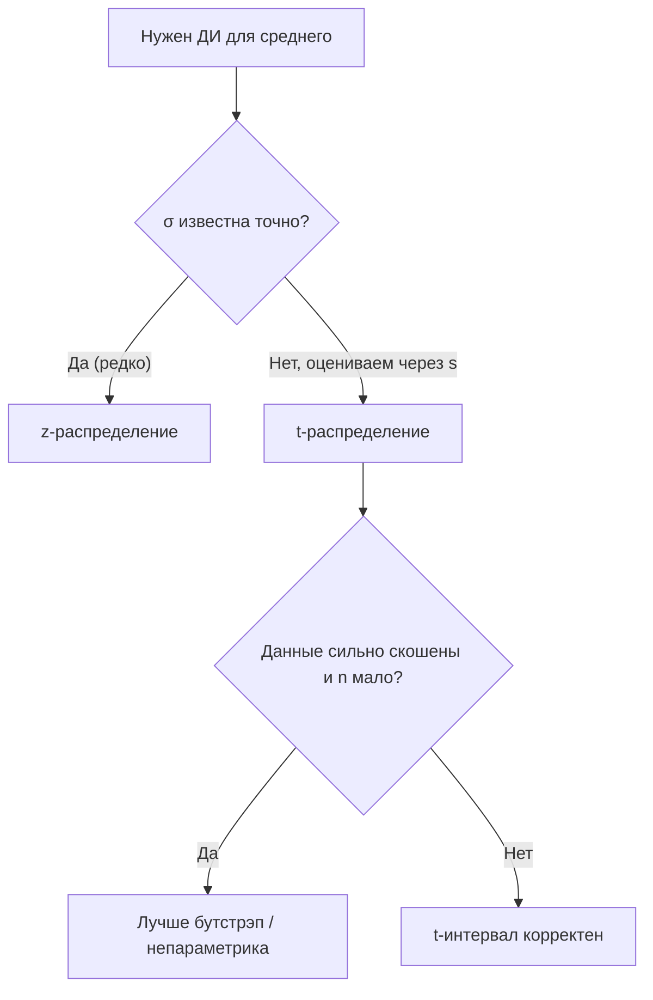
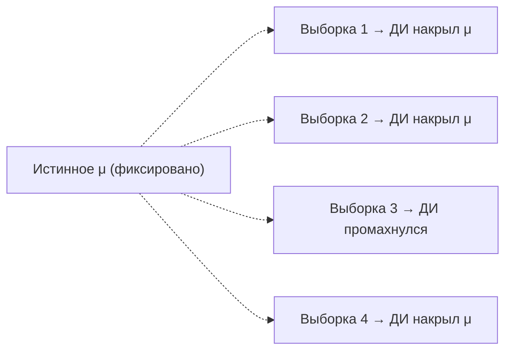

Когда мы оцениваем среднее по выборке, мы почти наверняка ошибаемся: выборочное среднее $\bar{x}$ — это лишь одна реализация случайной величины, и при другой выборке оно было бы другим. Доверительный интервал отвечает на вопрос «насколько мы можем ошибаться» — он превращает точечную оценку в интервал правдоподобных значений с заявленным уровнем уверенности.

Эта тема опирается на [теорию вероятностей](/probability/) (распределения, дисперсия) и на базовые понятия [статистики](/statistics/) (оценивание параметров). Если хочется освежить расчёты на практике — пригодится [Python для данных](/python-data/).

## Стандартная ошибка

Различайте два разброса, которые легко перепутать.

- **Стандартное отклонение** $\sigma$ (или его оценка $s$) описывает разброс *самих наблюдений* в популяции.
- **Стандартная ошибка** (standard error, SE) описывает разброс *выборочного среднего* как оценки.

Если наблюдения независимы и имеют дисперсию $\sigma^2$, то дисперсия среднего из $n$ наблюдений равна $\sigma^2/n$, а значит стандартная ошибка среднего:

$$
\mathrm{SE}(\bar{x}) = \frac{\sigma}{\sqrt{n}}.
$$

На практике $\sigma$ неизвестна, и мы подставляем выборочное стандартное отклонение $s$:

$$
\widehat{\mathrm{SE}} = \frac{s}{\sqrt{n}}, \qquad s = \sqrt{\frac{1}{n-1}\sum_{i=1}^{n}(x_i - \bar{x})^2}.
$$

Ключевая интуиция: SE падает как $1/\sqrt{n}$. Чтобы уменьшить ошибку вдвое, нужно увеличить выборку *вчетверо*. Это закон убывающей отдачи — он объясняет, почему «добрать ещё немного данных» в конце даёт всё меньший выигрыш.

:::note[Делитель n−1]
В формуле $s$ стоит $n-1$, а не $n$. Это поправка Бесселя: деление на $n$ систематически занижает оценку дисперсии, потому что отклонения считаются от выборочного среднего, а не от истинного. Подробнее — в разделе про [описательную статистику и дисперсию](/statistics/).
:::

## Центральная предельная теорема

Почему мы вообще можем что-то сказать про распределение $\bar{x}$, не зная распределения исходных данных? Ответ даёт **центральная предельная теорема** (ЦПТ).

Пусть $X_1, \dots, X_n$ — независимые одинаково распределённые случайные величины со средним $\mu$ и конечной дисперсией $\sigma^2$. Тогда при больших $n$ распределение стандартизованного среднего стремится к стандартному нормальному:

$$
\frac{\bar{X} - \mu}{\sigma/\sqrt{n}} \xrightarrow{d} \mathcal{N}(0, 1).
$$

То есть само $\bar{X}$ приближённо распределено как $\mathcal{N}\!\left(\mu,\, \sigma^2/n\right)$ — *независимо от формы исходного распределения* (лишь бы дисперсия была конечной).


Это и есть фундамент доверительного интервала для среднего: даже если данные далеки от нормальных, *среднее* при достаточном $n$ ведёт себя нормально.

:::caution[Насколько большое n нужно?]
Расхожее правило «$n \ge 30$» — грубый ориентир, а не закон. Для почти симметричных распределений хватает и $n=10$; для сильно скошенных (доходы, время отклика, данные с тяжёлыми хвостами) может не хватить и $n=100$. Если выборка маленькая, а данные явно ненормальны, лучше использовать непараметрические методы (например, бутстрэп).
:::

## Построение доверительного интервала для среднего

Возьмём уровень доверия $1-\alpha$ (типично 95%, тогда $\alpha = 0.05$). Доверительный интервал для $\mu$ имеет вид:

$$
\bar{x} \;\pm\; c \cdot \mathrm{SE},
$$

где $c$ — критическое значение, а произведение $c\cdot\mathrm{SE}$ называют **предельной ошибкой** (margin of error). Дальше всё решает вопрос: известна ли $\sigma$.

### Случай 1: σ известна → z-распределение

Если истинное $\sigma$ известно (на практике — редко, но это базовый случай):

$$
\bar{x} \;\pm\; z_{1-\alpha/2}\cdot \frac{\sigma}{\sqrt{n}}.
$$

Для 95% берём $z_{0.975} \approx 1.96$. Полезно помнить несколько значений:

| Уровень доверия | $\alpha$ | $z_{1-\alpha/2}$ |
|---|---|---|
| 90% | 0.10 | 1.645 |
| 95% | 0.05 | 1.960 |
| 99% | 0.01 | 2.576 |

### Случай 2: σ неизвестна → t-распределение

Это типичная реальная ситуация: $\sigma$ мы не знаем и оцениваем через $s$. Появляется дополнительная неопределённость — мы оцениваем сразу *два* параметра по тем же данным. Уильям Госсет («Стьюдент») показал, что тогда статистика

$$
T = \frac{\bar{x} - \mu}{s/\sqrt{n}}
$$

подчиняется не нормальному распределению, а **t-распределению Стьюдента** с $\nu = n-1$ степенями свободы. Интервал:

$$
\bar{x} \;\pm\; t_{1-\alpha/2,\,\nu}\cdot \frac{s}{\sqrt{n}}.
$$

t-распределение похоже на нормальное, но имеет *более тяжёлые хвосты* — поэтому $t_{1-\alpha/2,\nu} > z_{1-\alpha/2}$, и интервал получается чуть шире. Это плата за то, что мы не знаем $\sigma$. С ростом $n$ степеней свободы становится больше, хвосты «худеют», и t-распределение сходится к нормальному.

| $\nu = n-1$ | $t_{0.975,\,\nu}$ (95%) |
|---|---|
| 5 | 2.571 |
| 10 | 2.228 |
| 30 | 2.042 |
| 100 | 1.984 |
| $\infty$ | 1.960 (= $z$) |

### Как выбирать на практике



:::tip[Простое правило]
Если вы считаете $s$ по выборке — берите t-распределение. При $n \gtrsim 100$ разница с $z$ уже в пределах сотых, но t-интервал никогда не «хуже»: он автоматически переходит в z при большом $n$.
:::

### Пример на Python

```python
import numpy as np
from scipy import stats

rng = np.random.default_rng(42)
data = rng.normal(loc=170, scale=8, size=25)  # рост, см

n = data.size
mean = data.mean()
se = data.std(ddof=1) / np.sqrt(n)            # ddof=1 => делитель n-1

# 95% ДИ через t-распределение (sigma неизвестна)
t_crit = stats.t.ppf(0.975, df=n - 1)
ci = (mean - t_crit * se, mean + t_crit * se)

print(f"Среднее: {mean:.2f}")
print(f"SE: {se:.2f}, t* = {t_crit:.3f}")
print(f"95% ДИ: ({ci[0]:.2f}, {ci[1]:.2f})")

# То же одной строкой:
print(stats.t.interval(0.95, df=n - 1, loc=mean, scale=se))
```

## Как правильно интерпретировать

Доверительный интервал — самое неправильно понимаемое понятие в статистике. Корректная (частотная) трактовка:

> Если бесконечно повторять эксперимент и каждый раз строить 95%-й доверительный интервал по той же процедуре, то примерно 95% таких интервалов накроют истинное $\mu$.

Случайным является *интервал* (его границы зависят от выборки), а $\mu$ — фиксированная неизвестная константа. Поэтому говорить о «вероятности» для конкретного посчитанного интервала некорректно: он либо содержит $\mu$, либо нет.



### Типичные заблуждения

:::danger[Чего НЕ означает 95% ДИ]
1. **Неверно:** «С вероятностью 95% истинное $\mu$ лежит внутри *этого* интервала». После того как границы посчитаны, никакой случайности уже нет — вероятность здесь относится к процедуре, а не к конкретному результату.
2. **Неверно:** «95% наблюдений/данных попадают в интервал». ДИ — про *среднее*, а не про отдельные значения. Интервал для наблюдений (prediction interval) гораздо шире.
3. **Неверно:** «При повторении эксперимента новое $\bar{x}$ попадёт в этот интервал с вероятностью 95%». Это другой объект (предсказание оценки), и вероятность там не 95%.
4. **Неверно:** «Более широкий интервал = более точная оценка». Наоборот: широкий интервал отражает *бо́льшую* неопределённость.
:::

Полезно помнить связь с длиной интервала: ширина $\propto t \cdot s/\sqrt{n}$. Сузить интервал можно тремя способами — увеличить $n$, снизить разброс данных $s$ (лучше измерения) или согласиться на меньший уровень доверия (например, 90% вместо 95%).

:::note[Связь с проверкой гипотез]
95%-й доверительный интервал и двусторонний тест на уровне значимости $\alpha = 0.05$ согласованы: значение $\mu_0$ лежит вне 95%-го ДИ тогда и только тогда, когда гипотеза $H_0: \mu = \mu_0$ отвергается на уровне 5%. Подробнее — в разделах про проверку гипотез в [статистике](/statistics/).
:::

## Задания

### Задание 1. Считаем интервал руками

Выборка из $n = 16$ измерений дала среднее $\bar{x} = 50$ и выборочное стандартное отклонение $s = 8$. Постройте 95%-й доверительный интервал для среднего. Используйте $t_{0.975,\,15} = 2.131$.

<details>
<summary>Решение</summary>

Стандартная ошибка:
$$
\mathrm{SE} = \frac{s}{\sqrt{n}} = \frac{8}{\sqrt{16}} = \frac{8}{4} = 2.
$$

Предельная ошибка:
$$
t_{0.975,15}\cdot \mathrm{SE} = 2.131 \cdot 2 = 4.262.
$$

Интервал:
$$
50 \pm 4.262 \;\Rightarrow\; (45.74,\; 54.26).
$$

</details>

### Задание 2. z или t?

Для каждого случая укажите, какое распределение использовать (z или t), и почему.

1. $n = 12$, $\sigma$ неизвестна, данные примерно симметричны.
2. $n = 500$, считаем $s$ по выборке.
3. $n = 8$, истинное $\sigma = 3$ известно из калибровки прибора.

<details>
<summary>Решение</summary>

1. **t.** $\sigma$ неизвестна и оценивается через $s$, выборка маленькая — разница с z заметна ($t_{0.975,11}=2.201$ против $1.96$).
2. **t** формально (раз считаем $s$), но при $n=500$ значение $t_{0.975,499}\approx 1.965$ практически совпадает с $z=1.96$ — на практике интервалы неразличимы.
3. **z.** $\sigma$ известна точно, поэтому используем нормальное распределение, несмотря на малое $n$. (Предполагаем, что сами данные близки к нормальным, иначе при $n=8$ ЦПТ не спасает.)

</details>

### Задание 3. Сколько данных нужно?

Сейчас 95%-й интервал по $n = 100$ имеет полуширину (margin of error) $4$ единицы. Сколько примерно наблюдений нужно, чтобы сузить полуширину до $1$ единицы, если $s$ и уровень доверия не меняются?

<details>
<summary>Решение</summary>

Полуширина пропорциональна $1/\sqrt{n}$ (критическое значение и $s$ фиксированы):
$$
m \propto \frac{1}{\sqrt{n}}.
$$

Чтобы уменьшить $m$ в $4$ раза, нужно увеличить $\sqrt{n}$ в $4$ раза, то есть $n$ — в $16$ раз:

$$
n_{\text{new}} \approx 16 \cdot 100 = 1600.
$$

Вывод: сужение интервала вчетверо требует роста выборки в 16 раз — наглядная иллюстрация закона $1/\sqrt{n}$.

</details>

### Задание 4. Найдите ошибку в трактовке

Аналитик посчитал 95%-й ДИ для среднего чека: $(1200,\ 1400)$ рублей — и написал в отчёте: «Вероятность того, что средний чек лежит между 1200 и 1400, равна 95%. Кроме того, 95% всех чеков попадают в этот диапазон». Что не так?

<details>
<summary>Решение</summary>

Две ошибки:

1. **Про «вероятность 95% для этого интервала».** Истинное среднее $\mu$ — фиксированная константа, а конкретные границы $(1200, 1400)$ уже посчитаны и не случайны. Корректно: «процедура, по которой построен интервал, накрывает истинное среднее в 95% повторных выборок». Для одного конкретного интервала он либо содержит $\mu$, либо нет.

2. **Про «95% чеков».** ДИ описывает неопределённость в *среднем*, а не разброс отдельных чеков. Отдельные значения разбросаны на масштабе $s$ (а не $s/\sqrt{n}$), поэтому интервал, куда попадает 95% чеков, будет в $\sqrt{n}$ раз шире. Это разные объекты: доверительный интервал против интервала предсказания (prediction interval).

</details>
