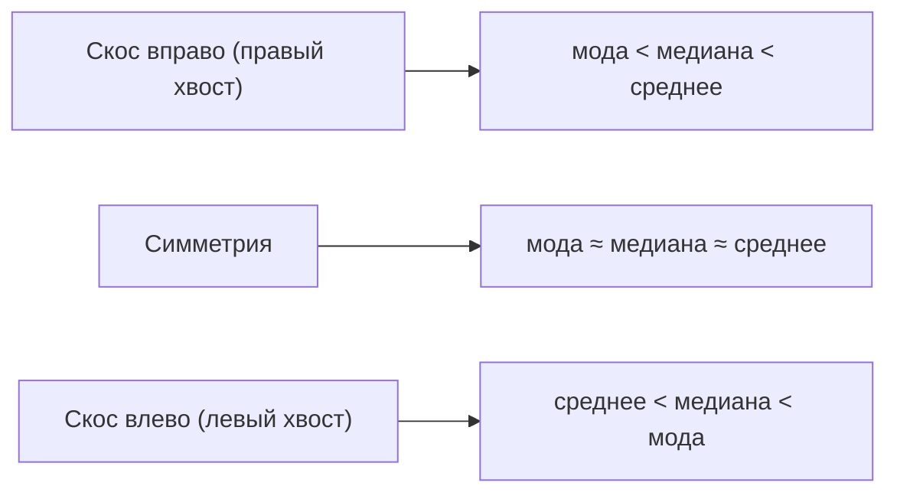
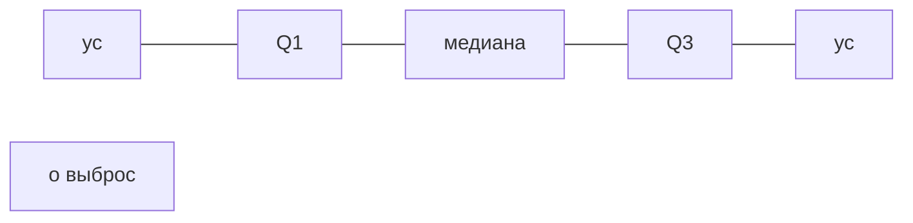

Прежде чем строить модели, данные нужно понять. Описательная статистика — это набор инструментов, которые сжимают большую таблицу чисел до нескольких показателей и картинок: где «центр» данных, насколько они разбросаны, есть ли странные значения. Это первый шаг любого анализа (EDA, exploratory data analysis) и фундамент для [теории вероятностей](/probability/) и [статистического вывода](/statistics/).

Договоримся об обозначениях. У нас есть выборка из $n$ наблюдений одного признака:

$$
x_1, x_2, \ldots, x_n.
$$

Все формулы ниже описывают именно выборку (то, что мы реально измерили), а не теоретическое распределение.

## Меры центра

Мера центра отвечает на вопрос «какое значение типично?». Главных три, и они отвечают на этот вопрос по-разному.

### Среднее арифметическое

Среднее (mean) — сумма всех значений, делённая на их количество:

$$
\bar{x} = \frac{1}{n}\sum_{i=1}^{n} x_i.
$$

Интуиция: если представить значения как грузики на числовой оси, среднее — это точка равновесия, центр масс. Поэтому оно очень чувствительно к крайним значениям: один миллиардер в выборке резко поднимет средний доход, хотя «типичный» человек беднее.

### Медиана

Медиана (median) — значение, которое делит упорядоченный ряд пополам: половина наблюдений меньше неё, половина больше. Сначала сортируем данные, получая порядковые статистики $x_{(1)} \le x_{(2)} \le \ldots \le x_{(n)}$, затем:

$$
\mathrm{med}(x) =
\begin{cases}
x_{\left(\frac{n+1}{2}\right)}, & n \text{ нечётно},\\[4pt]
\dfrac{x_{\left(\frac{n}{2}\right)} + x_{\left(\frac{n}{2}+1\right)}}{2}, & n \text{ чётно}.
\end{cases}
$$

Медиана устойчива к выбросам (робастна): добавьте к выборке одно гигантское значение — медиана почти не сдвинется, ведь важен порядок, а не сами величины. Поэтому для доходов, цен на жильё и других скошенных распределений медиана честнее среднего.

### Мода

Мода (mode) — наиболее часто встречающееся значение. У распределения может быть одна мода (унимодальное), две (бимодальное) или несколько. Мода — единственная из трёх мер, которая работает и для категориальных данных (например, самый популярный цвет товара).

:::note[Какую меру выбрать]
Симметричное распределение без выбросов — среднее, медиана и мода почти совпадают. Скошенное распределение или есть выбросы — опирайтесь на медиану. Категориальные данные — только мода.
:::

Соотношение мер подсказывает форму распределения:



## Меры разброса

Две выборки могут иметь одинаковое среднее, но совершенно разный «характер»: $\{50, 50, 50\}$ и $\{0, 50, 100\}$. Разброс (dispersion) показывает, насколько значения «расползаются» вокруг центра.

### Размах

Размах (range) — простейшая мера: разность максимума и минимума.

$$
R = x_{\max} - x_{\min}.
$$

Он наглядный, но крайне чувствительный: зависит ровно от двух точек, причём именно от самых экстремальных.

### Дисперсия и стандартное отклонение

Дисперсия (variance) — средний квадрат отклонения от среднего. Здесь важна тонкость: для выборки в знаменателе ставят $n-1$, а не $n$. Это поправка Бесселя — она делает оценку несмещённой (в среднем не занижает истинную дисперсию генеральной совокупности).

$$
s^2 = \frac{1}{n-1}\sum_{i=1}^{n} (x_i - \bar{x})^2.
$$

Стандартное отклонение (standard deviation) — корень из дисперсии:

$$
s = \sqrt{s^2}.
$$

Зачем корень? Дисперсия измеряется в квадратах единиц (если $x$ — рубли, то $s^2$ — «рубли в квадрате»), что неинтерпретируемо. Стандартное отклонение возвращает нас к исходным единицам: «значения отклоняются от среднего в среднем на $s$ рублей».

:::caution[n или n−1]
Если вы описываете всю совокупность целиком (генеральная дисперсия), делят на $n$. Если оцениваете дисперсию совокупности по выборке — на $n-1$. В коде это параметр: NumPy по умолчанию делит на $n$ (`ddof=0`), а pandas — на $n-1$ (`ddof=1`). Несовпадение результатов между библиотеками чаще всего объясняется именно этим.
:::

Почему отклонения возводят в квадрат, а не берут модуль? Квадрат сильнее штрафует крупные отклонения, гладко дифференцируем (удобно для оптимизации в [машинном обучении](/machine-learning/)) и тесно связан с понятием [дисперсии случайной величины](/probability/). Подробнее о суммах квадратов — в разделе про [линейную алгебру](/linear-algebra/) и [производные](/calculus/).

### Квантили и межквартильный размах

Квантиль уровня $p$ (где $0 \le p \le 1$) — это порог, ниже которого лежит доля $p$ всех данных. Частные случаи имеют имена:

- **Квартили** делят данные на 4 части: $Q_1$ (25-й процентиль), $Q_2$ (медиана, 50-й), $Q_3$ (75-й).
- **Процентили** делят на 100 частей; 90-й процентиль — значение, ниже которого 90% данных.

Межквартильный размах (IQR, interquartile range) — ширина «средних 50%» данных:

$$
\mathrm{IQR} = Q_3 - Q_1.
$$

IQR — робастная мера разброса: как и медиана, он игнорирует крайние значения и описывает плотную середину распределения. Это делает его идеальной парой к медиане.

| Мера разброса | Формула | Робастность к выбросам | Единицы измерения |
|---|---|---|---|
| Размах | $x_{\max}-x_{\min}$ | нет (худшая) | как у данных |
| Дисперсия | $s^2$ | нет | квадрат единиц |
| Стандартное отклонение | $s$ | нет | как у данных |
| IQR | $Q_3-Q_1$ | да | как у данных |

## Визуализация: гистограмма и ящик с усами

Числа сжимают данные до точки, графики показывают форму. Два рабочих инструмента EDA — гистограмма и боксплот.

### Гистограмма

Гистограмма (histogram) разбивает диапазон значений на интервалы (бины) и показывает, сколько наблюдений попало в каждый. Она отвечает на вопросы: распределение симметрично или скошено? Один пик или несколько? Где сгущения, где пустоты?

Число бинов важно: слишком мало — теряются детали, слишком много — картинка «шумит». Разумная отправная точка — правило Стёрджеса:

$$
k = \lceil \log_2 n + 1 \rceil.
$$

### Ящик с усами

Ящик с усами (box plot) — компактная сводка пяти чисел: минимум (в пределах усов), $Q_1$, медиана, $Q_3$, максимум. Сам «ящик» — это IQR, линия внутри — медиана, «усы» тянутся до крайних значений, не считающихся выбросами, а точки за усами — кандидаты в выбросы.



Боксплот особенно хорош для сравнения нескольких групп бок о бок (например, зарплаты по отделам) и для быстрого обнаружения выбросов.

## Выбросы

Выброс (outlier) — наблюдение, заметно отклоняющееся от остальных. Это может быть ошибка ввода (рост человека 1700 см), редкое, но реальное событие (аномально крупная сделка) или сигнал о неоднородности данных. Выбросы нельзя удалять механически: сначала нужно понять их природу.

Два распространённых формальных правила.

**Правило IQR (правило 1.5·IQR).** Выбросом считается значение за границами:

$$
[\,Q_1 - 1.5\cdot\mathrm{IQR},\; Q_3 + 1.5\cdot\mathrm{IQR}\,].
$$

Именно это правило по умолчанию используют усы боксплота. Оно робастно, так как опирается на квартили, а не на среднее.

**Правило трёх сигм (z-оценка).** Для каждого значения считают, на сколько стандартных отклонений оно удалено от среднего:

$$
z_i = \frac{x_i - \bar{x}}{s}.
$$

Значения с $|z_i| > 3$ объявляют выбросами. Минус подхода: и $\bar{x}$, и $s$ сами чувствительны к выбросам, поэтому крупный выброс «маскирует» себя, раздувая $s$. Для скошенных распределений правило IQR обычно надёжнее.

:::tip[Что делать с выбросом]
Проверить — это ошибка данных или реальное значение? Ошибку исправить или удалить, реальное значение оставить. Если выбросов много и удалять нельзя, используйте робастные меры (медиана, IQR) или преобразование данных (например, логарифм для скошенных величин).
:::

## Всё вместе на Python

Соберём расчёт всех показателей и визуализацию на синтетических данных. Используем NumPy и pandas (см. раздел [Python для данных](/python-data/)).

```python
import numpy as np
import pandas as pd

rng = np.random.default_rng(42)
# скошенное распределение + один явный выброс
data = np.concatenate([rng.normal(50, 10, size=200), [200.0]])
s = pd.Series(data)

# меры центра
print("Среднее:", round(s.mean(), 2))
print("Медиана:", round(s.median(), 2))
print("Мода:   ", round(s.mode().iloc[0], 2))

# меры разброса (pandas использует ddof=1, то есть n-1)
print("Размах: ", round(s.max() - s.min(), 2))
print("Дисперсия:", round(s.var(), 2))
print("Ст. откл.:", round(s.std(), 2))

# квартили и IQR
q1, q3 = s.quantile(0.25), s.quantile(0.75)
iqr = q3 - q1
print("Q1, Q3, IQR:", round(q1, 2), round(q3, 2), round(iqr, 2))

# выбросы по правилу 1.5*IQR
low, high = q1 - 1.5 * iqr, q3 + 1.5 * iqr
outliers = s[(s < low) | (s > high)]
print("Выбросы:", outliers.round(2).tolist())
```

Метод `s.describe()` выдаёт сразу пятичисловую сводку плюс среднее и стандартное отклонение — удобный быстрый обзор любой числовой колонки.

```python
print(s.describe())
```

Для графиков достаточно нескольких строк на matplotlib:

```python
import matplotlib.pyplot as plt

fig, (ax1, ax2) = plt.subplots(1, 2, figsize=(10, 4))
ax1.hist(data, bins=20)          # гистограмма
ax1.set_title("Гистограмма")
ax2.boxplot(data, vert=True)     # ящик с усами
ax2.set_title("Ящик с усами")
plt.tight_layout()
plt.show()
```

## Задания

### Задание 1

Дана выборка времени отклика сервиса (в мс): $\{12, 15, 14, 10, 13, 95\}$. Вычислите среднее и медиану. Какая мера лучше описывает «типичное» время отклика и почему?

<details>
<summary>Решение</summary>

Среднее:

$$
\bar{x} = \frac{12+15+14+10+13+95}{6} = \frac{159}{6} = 26.5 \text{ мс}.
$$

Медиана: сортируем — $10, 12, 13, 14, 15, 95$. При $n=6$ (чётное) берём среднее двух центральных значений $x_{(3)}=13$ и $x_{(4)}=14$:

$$
\mathrm{med} = \frac{13+14}{2} = 13.5 \text{ мс}.
$$

«Типичное» время лучше описывает **медиана** (13.5 мс). Значение 95 — выброс (вероятно, одиночный тормоз), и оно сильно тянет среднее вверх до 26.5 мс, хотя 5 из 6 запросов уложились в 10–15 мс. Медиана к этому выбросу почти нечувствительна.

</details>

### Задание 2

Для выборки $\{2, 4, 4, 4, 5, 5, 7, 9\}$ вычислите выборочную дисперсию ($s^2$, с делением на $n-1$) и стандартное отклонение.

<details>
<summary>Решение</summary>

Среднее: $\bar{x} = \dfrac{2+4+4+4+5+5+7+9}{8} = \dfrac{40}{8} = 5$.

Квадраты отклонений от среднего:

$$
(2-5)^2=9,\; (4-5)^2=1 \;(\times 3),\; (5-5)^2=0\;(\times 2),\; (7-5)^2=4,\; (9-5)^2=16.
$$

Сумма: $9 + 1\cdot 3 + 0\cdot 2 + 4 + 16 = 9+3+0+4+16 = 32$.

Выборочная дисперсия ($n-1 = 7$):

$$
s^2 = \frac{32}{7} \approx 4.57.
$$

Стандартное отклонение:

$$
s = \sqrt{4.57} \approx 2.14.
$$

(Если бы делили на $n=8$ — генеральная дисперсия — получили бы $32/8 = 4$ и $s=2$.)

</details>

### Задание 3

В выборке $Q_1 = 20$, $Q_3 = 40$. Определите границы выбросов по правилу 1.5·IQR и проверьте, являются ли выбросами значения $5$ и $75$.

<details>
<summary>Решение</summary>

$$
\mathrm{IQR} = Q_3 - Q_1 = 40 - 20 = 20.
$$

Границы:

$$
Q_1 - 1.5\cdot\mathrm{IQR} = 20 - 1.5\cdot 20 = 20 - 30 = -10,
$$
$$
Q_3 + 1.5\cdot\mathrm{IQR} = 40 + 1.5\cdot 20 = 40 + 30 = 70.
$$

Допустимый диапазон: $[-10,\ 70]$.

- $5$ лежит внутри $[-10, 70]$ — **не выброс**.
- $75 > 70$ — выходит за верхнюю границу, значит **выброс**.

</details>

### Задание 4

Напишите функцию на Python, которая по списку чисел возвращает словарь с медианой, IQR и списком выбросов по правилу 1.5·IQR. Не используйте готовые `describe`/`boxplot` — только NumPy.

<details>
<summary>Решение</summary>

```python
import numpy as np

def summary(values):
    arr = np.asarray(values, dtype=float)
    q1, q2, q3 = np.percentile(arr, [25, 50, 75])
    iqr = q3 - q1
    low, high = q1 - 1.5 * iqr, q3 + 1.5 * iqr
    outliers = arr[(arr < low) | (arr > high)]
    return {
        "median": q2,
        "iqr": iqr,
        "outliers": outliers.tolist(),
    }

print(summary([12, 15, 14, 10, 13, 95]))
# {'median': 13.5, 'iqr': 2.5, 'outliers': [95.0]}
```

Логика: `np.percentile` сразу даёт квартили, IQR — их разность, а булева маска `(arr < low) | (arr > high)` отбирает значения за границами. Здесь $Q_1=12.25$, $Q_3=14.75$, IQR $=2.5$, верхняя граница $14.75 + 3.75 = 18.5$, поэтому $95$ — единственный выброс.

</details>
