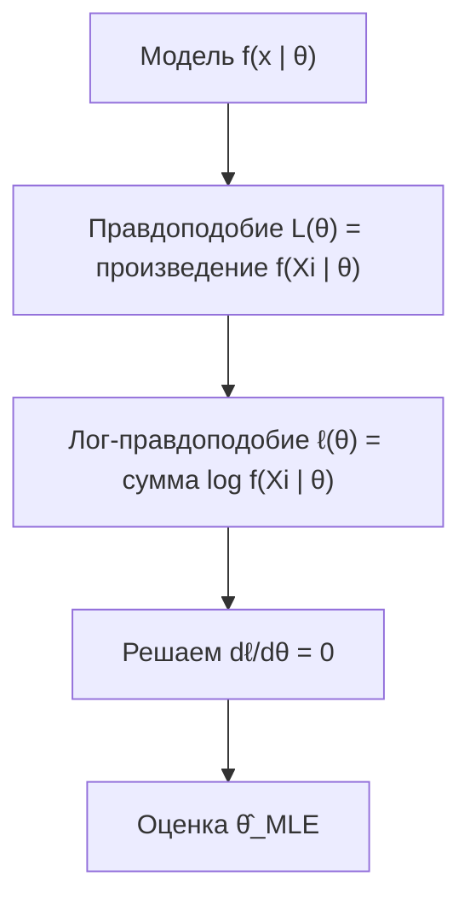

Почти всегда в статистике мы хотим узнать что-то про большой мир, имея на руках лишь его маленький кусочек. Сколько в среднем тратит пользователь? Какова вероятность поломки детали? Какова доля брака на конвейере? Измерить всех невозможно, поэтому мы берём **выборку** и по ней **оцениваем** неизвестные характеристики. Этот раздел — про то, как устроены такие оценки, какими хорошими свойствами они должны обладать и как их строить системно (MLE и метод моментов).

Предполагается, что вы знакомы с базовыми понятиями из [теории вероятностей](/probability/): случайная величина, математическое ожидание, дисперсия, распределение.

## Генеральная совокупность и выборка

**Генеральная совокупность (population)** — это полное множество всех объектов, о которых мы хотим делать выводы. Формально удобно думать о ней как о случайной величине $X$ с некоторым распределением, которое описывается параметром (или вектором параметров) $\theta$. Например, $\theta$ — это истинное среднее время отклика сервиса или истинная доля кликнувших пользователей.

**Выборка (sample)** — это набор наблюдений $X_1, X_2, \dots, X_n$, полученных из генеральной совокупности. Идеализированное (но крайне удобное) предположение — что наблюдения **независимы и одинаково распределены** (i.i.d., independent and identically distributed): каждое $X_i$ имеет то же распределение, что и $X$, и наблюдения не влияют друг на друга.


Ключевая идея: параметр $\theta$ — это фиксированное (хоть и неизвестное) число, свойство мира. А выборка случайна: возьми мы другой набор объектов — получили бы другие числа. Значит, и любая функция от выборки тоже случайна.

:::note[Статистика и оценка — это термины]
**Статистика** — это любая функция от выборки, не зависящая от неизвестных параметров, например выборочное среднее $\bar{X}$. **Оценка (estimator)** — это статистика, которую мы используем, чтобы приблизить конкретный параметр. Конкретное число, полученное на ваших данных, называют **оценкой-значением (estimate)**.
:::

Чтобы выводы по выборке переносились на совокупность, выборка должна быть **репрезентативной**. Самый надёжный способ этого добиться — случайный отбор. Если выборка собрана с перекосом (например, опрос только активных пользователей приложения), то никакая математика не спасёт: оценка будет систематически врать. Это называют **смещением отбора (selection bias)**.

## Точечные оценки

**Точечная оценка** параметра $\theta$ — это одно число $\hat{\theta} = \hat{\theta}(X_1, \dots, X_n)$, вычисленное по выборке. Шляпка $\hat{\ }$ — стандартное обозначение «оценка чего-то».

Самые частые точечные оценки:

| Параметр совокупности | Точечная оценка | Формула |
|---|---|---|
| Среднее $\mu$ | Выборочное среднее $\bar{X}$ | $\bar{X} = \dfrac{1}{n}\sum_{i=1}^{n} X_i$ |
| Дисперсия $\sigma^2$ | Выборочная дисперсия $s^2$ | $s^2 = \dfrac{1}{n-1}\sum_{i=1}^{n}(X_i - \bar{X})^2$ |
| Доля $p$ | Выборочная доля $\hat{p}$ | $\hat{p} = \dfrac{1}{n}\sum_{i=1}^{n} \mathbb{1}[X_i = 1]$ |

Поскольку оценка $\hat{\theta}$ — функция случайной выборки, она сама случайна и имеет распределение, которое называют **выборочным распределением (sampling distribution)**. Именно его свойства определяют, насколько оценка хороша. Два главных свойства — несмещённость и состоятельность.

### Несмещённость

Оценка $\hat{\theta}$ называется **несмещённой (unbiased)**, если в среднем (по всем возможным выборкам) она попадает точно в цель:

$$
\mathbb{E}[\hat{\theta}] = \theta.
$$

**Смещение (bias)** определяется как

$$
\mathrm{Bias}(\hat{\theta}) = \mathbb{E}[\hat{\theta}] - \theta.
$$

Несмещённость означает $\mathrm{Bias}(\hat{\theta}) = 0$. Интуиция: представьте, что вы много-много раз заново собираете выборку и каждый раз считаете оценку. Несмещённая оценка не имеет систематического перекоса — облако её значений центрировано вокруг истины.

**Пример.** Выборочное среднее всегда несмещено относительно $\mu$:

$$
\mathbb{E}[\bar{X}] = \frac{1}{n}\sum_{i=1}^{n}\mathbb{E}[X_i] = \frac{1}{n}\cdot n\mu = \mu.
$$

:::tip[Откуда берётся деление на n−1]
Если в выборочной дисперсии делить на $n$, оценка окажется **смещённой вниз**: мы вычитаем $\bar{X}$, которое само подогнано под данные, поэтому отклонения систематически занижены. Деление на $n-1$ (поправка Бесселя) ровно компенсирует этот эффект и делает $s^2$ несмещённой: $\mathbb{E}[s^2] = \sigma^2$. Число $n-1$ — это «число степеней свободы»: одну степень мы «потратили» на оценку среднего.
:::

### Состоятельность

Оценка $\hat{\theta}_n$ называется **состоятельной (consistent)**, если с ростом объёма выборки она сходится (по вероятности) к истинному значению:

$$
\hat{\theta}_n \xrightarrow{P} \theta \quad \text{при } n \to \infty,
$$

то есть для любого сколь угодно малого $\varepsilon > 0$ верно $\mathbb{P}(|\hat{\theta}_n - \theta| > \varepsilon) \to 0$. Проще говоря: чем больше данных, тем точнее. Это прямое следствие [закона больших чисел](/probability/) для выборочного среднего.

Удобный достаточный признак: если оценка асимптотически несмещена ($\mathbb{E}[\hat{\theta}_n] \to \theta$) и её дисперсия стремится к нулю ($\mathrm{Var}(\hat{\theta}_n) \to 0$), то она состоятельна. Для среднего:

$$
\mathrm{Var}(\bar{X}) = \frac{\sigma^2}{n} \xrightarrow{n\to\infty} 0,
$$

поэтому $\bar{X}$ состоятельна.

:::caution[Несмещённость и состоятельность — это разные свойства]
Это разные вещи, и одно не влечёт другое.

- Можно быть **несмещённым, но не очень полезным**: оценка $\hat{\mu} = X_1$ (берём только первое наблюдение) несмещена ($\mathbb{E}[X_1]=\mu$), но не состоятельна — её дисперсия $\sigma^2$ не падает с ростом $n$.
- Можно быть **смещённым, но состоятельным**: версия дисперсии с делением на $n$ слегка смещена, но при $n\to\infty$ смещение исчезает, и она сходится к $\sigma^2$.
:::

Часто для сравнения оценок используют **среднеквадратичную ошибку (MSE)**, которая красиво раскладывается на дисперсию и квадрат смещения:

$$
\mathrm{MSE}(\hat{\theta}) = \mathbb{E}\big[(\hat{\theta} - \theta)^2\big] = \mathrm{Var}(\hat{\theta}) + \big(\mathrm{Bias}(\hat{\theta})\big)^2.
$$

Это знаменитое разложение bias–variance: иногда выгодно допустить небольшое смещение ради сильного снижения дисперсии и в итоге уменьшить общую ошибку. Подробнее этот компромисс разбирается в разделе [машинного обучения](/machine-learning/).

## Метод максимального правдоподобия (MLE)

Откуда вообще брать формулы для оценок? Метод максимального правдоподобия (maximum likelihood estimation, MLE) — самый универсальный рецепт.

**Интуиция.** У нас есть данные и модель распределения с неизвестным параметром $\theta$. Зададимся вопросом: «При каком значении $\theta$ наблюдаемые данные были бы наиболее вероятны?» То значение, которое делает наши данные максимально правдоподобными, и объявляем оценкой. Мы как бы крутим ручку $\theta$ и ищем положение, при котором модель лучше всего «объясняет» то, что мы увидели.

**Функция правдоподобия.** Для i.i.d. выборки с плотностью (или вероятностью) $f(x \mid \theta)$ правдоподобие — это совместная вероятность данных как функция от $\theta$:

$$
L(\theta) = \prod_{i=1}^{n} f(X_i \mid \theta).
$$

Произведение многих сомножителей неудобно дифференцировать, поэтому переходят к **логарифму правдоподобия** (логарифм монотонен, поэтому точка максимума та же):

$$
\ell(\theta) = \log L(\theta) = \sum_{i=1}^{n} \log f(X_i \mid \theta).
$$

MLE-оценка — это аргумент максимума:

$$
\hat{\theta}_{\text{MLE}} = \arg\max_{\theta} \ell(\theta).
$$

Обычно её находят, приравнивая производную к нулю: $\dfrac{d\ell}{d\theta} = 0$.



### Пример: MLE для доли (распределение Бернулли)

Пусть мы $n$ раз подбрасываем нечестную монету, $X_i \in \{0, 1\}$, вероятность «успеха» $p$ неизвестна. Вероятность одного исхода: $f(x \mid p) = p^x (1-p)^{1-x}$. Обозначим число успехов $k = \sum_i X_i$. Тогда

$$
\ell(p) = \sum_{i=1}^{n}\big[X_i \log p + (1 - X_i)\log(1-p)\big] = k\log p + (n-k)\log(1-p).
$$

Берём производную и приравниваем к нулю:

$$
\frac{d\ell}{dp} = \frac{k}{p} - \frac{n-k}{1-p} = 0 \;\Longrightarrow\; \hat{p}_{\text{MLE}} = \frac{k}{n}.
$$

Результат совпадает со здравым смыслом: лучшая оценка вероятности успеха — наблюдённая доля успехов. Это и приятно в MLE: метод формально подтверждает интуитивные оценки, а в сложных моделях даёт ответ там, где интуиция бессильна.

:::note[Свойства MLE]
При достаточно общих условиях MLE-оценки **состоятельны**, **асимптотически нормальны** и **асимптотически эффективны** (достигают наименьшей возможной дисперсии при больших $n$). Это объясняет, почему MLE — рабочая лошадка статистики и машинного обучения. Минусы: MLE может быть смещённой при малых $n$ (например, MLE дисперсии нормального распределения делит на $n$, а не на $n-1$), а максимизацию иногда приходится делать численно.
:::

Связь с ML: обучение многих моделей — это максимизация правдоподобия. Минимизация кросс-энтропии в классификации и метода наименьших квадратов в линейной регрессии — это в точности MLE при соответствующих предположениях о распределении ошибок.

### Небольшой пример на Python

Сравним аналитическую MLE-оценку доли с численной максимизацией лог-правдоподобия.

```python
import numpy as np
from scipy.optimize import minimize_scalar

rng = np.random.default_rng(0)
true_p = 0.3
data = rng.binomial(1, true_p, size=1000)  # выборка из Бернулли

# Аналитическая MLE: доля успехов
p_hat = data.mean()

# Численная максимизация лог-правдоподобия (минимизируем -ℓ)
def neg_log_likelihood(p):
    eps = 1e-12  # защита от log(0)
    return -(data * np.log(p + eps) + (1 - data) * np.log(1 - p + eps)).sum()

res = minimize_scalar(neg_log_likelihood, bounds=(1e-6, 1 - 1e-6), method="bounded")

print(f"Аналитическая MLE: {p_hat:.4f}")
print(f"Численная MLE:     {res.x:.4f}")
# Аналитическая MLE: 0.2980
# Численная MLE:     0.2980
```

## Метод моментов

Метод моментов — более старый и часто более простой рецепт получения оценок. Идея ещё прямее, чем у MLE.

**Интуиция.** Теоретические моменты распределения (среднее, средний квадрат и т.д.) выражаются через параметры $\theta$. Выборочные моменты мы можем посчитать прямо по данным. Метод моментов просто **приравнивает теоретические моменты к выборочным** и решает систему относительно параметров.

$k$-й теоретический момент $\mathbb{E}[X^k]$ приравнивается к $k$-му выборочному моменту $\frac{1}{n}\sum_i X_i^k$. Чтобы оценить $m$ параметров, берут первые $m$ моментов.

**Пример (один параметр).** Для распределения Пуассона с параметром $\lambda$ верно $\mathbb{E}[X] = \lambda$. Приравниваем к первому выборочному моменту:

$$
\lambda = \bar{X} \;\Longrightarrow\; \hat{\lambda}_{\text{MoM}} = \bar{X}.
$$

**Пример (два параметра).** Для нормального распределения $\mathcal{N}(\mu, \sigma^2)$: $\mathbb{E}[X] = \mu$ и $\mathbb{E}[X^2] = \mu^2 + \sigma^2$. Приравнивая к выборочным моментам, получаем

$$
\hat{\mu} = \bar{X}, \qquad \hat{\sigma}^2 = \frac{1}{n}\sum_{i=1}^{n}(X_i - \bar{X})^2.
$$

| Свойство | Метод моментов (MoM) | Максимальное правдоподобие (MLE) |
|---|---|---|
| Идея | Приравнять моменты | Максимизировать правдоподобие данных |
| Сложность вычислений | Обычно проще, часто замкнутая форма | Может требовать численной оптимизации |
| Эффективность | Как правило, ниже | Асимптотически эффективна |
| Использование модели | Использует только моменты | Использует всю форму распределения |
| Типичная роль | Быстрая оценка, стартовая точка | Основной метод |

:::tip[Когда что использовать]
Метод моментов удобен как быстрая прикидка или как **начальное приближение** для численного поиска MLE. Но если важна точность и есть модель распределения, обычно предпочитают MLE — он использует больше информации о данных и асимптотически эффективнее.
:::

## Задания

### Задание 1. Несмещённость выборочного среднего

Пусть $X_1, \dots, X_n$ — i.i.d. с $\mathbb{E}[X_i] = \mu$ и $\mathrm{Var}(X_i) = \sigma^2$. Покажите, что $\bar{X}$ несмещена, и найдите $\mathrm{Var}(\bar{X})$. Что это говорит о состоятельности?

<details>
<summary>Решение</summary>

Несмещённость по линейности математического ожидания:

$$
\mathbb{E}[\bar{X}] = \mathbb{E}\!\left[\frac{1}{n}\sum_{i=1}^n X_i\right] = \frac{1}{n}\sum_{i=1}^n \mathbb{E}[X_i] = \frac{1}{n}\cdot n\mu = \mu.
$$

Дисперсия (используем независимость, поэтому дисперсия суммы равна сумме дисперсий):

$$
\mathrm{Var}(\bar{X}) = \frac{1}{n^2}\sum_{i=1}^n \mathrm{Var}(X_i) = \frac{1}{n^2}\cdot n\sigma^2 = \frac{\sigma^2}{n}.
$$

Поскольку $\mathbb{E}[\bar{X}] = \mu$ при любом $n$, а $\mathrm{Var}(\bar{X}) = \sigma^2/n \to 0$ при $n \to \infty$, оценка асимптотически несмещена с исчезающей дисперсией, значит, $\bar{X}$ **состоятельна**.

</details>

### Задание 2. MLE для экспоненциального распределения

Пусть $X_1, \dots, X_n$ i.i.d. из экспоненциального распределения с плотностью $f(x \mid \lambda) = \lambda e^{-\lambda x}$, $x \ge 0$. Найдите MLE-оценку $\hat{\lambda}$.

<details>
<summary>Решение</summary>

Лог-правдоподобие:

$$
\ell(\lambda) = \sum_{i=1}^n \log\!\big(\lambda e^{-\lambda X_i}\big) = n\log\lambda - \lambda\sum_{i=1}^n X_i.
$$

Производная и приравнивание к нулю:

$$
\frac{d\ell}{d\lambda} = \frac{n}{\lambda} - \sum_{i=1}^n X_i = 0 \;\Longrightarrow\; \hat{\lambda}_{\text{MLE}} = \frac{n}{\sum_{i=1}^n X_i} = \frac{1}{\bar{X}}.
$$

Это согласуется с тем, что для экспоненциального распределения $\mathbb{E}[X] = 1/\lambda$, то есть оценка — обратная величина к среднему. (Вторая производная $-n/\lambda^2 < 0$ подтверждает, что это максимум.)

</details>

### Задание 3. Метод моментов против MLE

Для экспоненциального распределения из задания 2 найдите оценку методом моментов и сравните с MLE.

<details>
<summary>Решение</summary>

Первый теоретический момент: $\mathbb{E}[X] = 1/\lambda$. Приравниваем к выборочному среднему:

$$
\frac{1}{\lambda} = \bar{X} \;\Longrightarrow\; \hat{\lambda}_{\text{MoM}} = \frac{1}{\bar{X}}.
$$

Оценки **совпадают**: $\hat{\lambda}_{\text{MoM}} = \hat{\lambda}_{\text{MLE}} = 1/\bar{X}$. Для однопараметрических распределений из экспоненциального семейства методы часто дают одинаковый результат. В более сложных моделях (например, с двумя и более параметрами или тяжёлыми хвостами) оценки расходятся, и MLE обычно точнее.

</details>

### Задание 4. Численная проверка смещения дисперсии

Напишите короткий эксперимент: сгенерируйте много выборок из $\mathcal{N}(0, 1)$ и сравните средние значения двух оценок дисперсии — с делением на $n$ и на $n-1$. Какая из них несмещена?

<details>
<summary>Решение</summary>

```python
import numpy as np

rng = np.random.default_rng(42)
n = 5            # маленькая выборка, чтобы смещение было заметно
num_trials = 200_000

var_n = []     # деление на n (смещённая)
var_n1 = []    # деление на n-1 (несмещённая)
for _ in range(num_trials):
    x = rng.normal(0, 1, size=n)
    var_n.append(x.var(ddof=0))   # ddof=0 -> делит на n
    var_n1.append(x.var(ddof=1))  # ddof=1 -> делит на n-1

print(f"E[var, /n]   = {np.mean(var_n):.4f}")   # ~0.80, заметно меньше 1
print(f"E[var, /n-1] = {np.mean(var_n1):.4f}")  # ~1.00
```

Истинная дисперсия равна $1$. Оценка с делением на $n$ в среднем даёт примерно $\frac{n-1}{n}\cdot 1 = 0.8$ — она **смещена вниз**. Оценка с делением на $n-1$ в среднем даёт $\approx 1$ — она **несмещена**. Эксперимент подтверждает поправку Бесселя.

</details>
